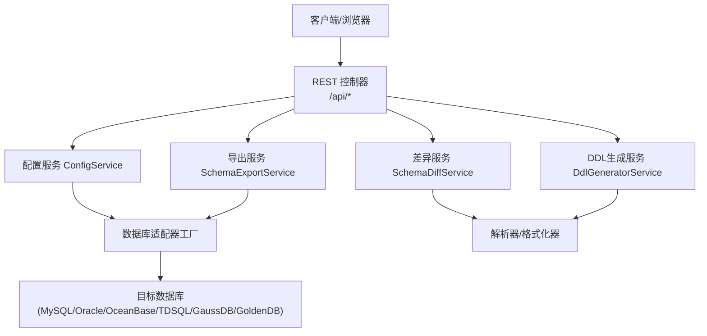
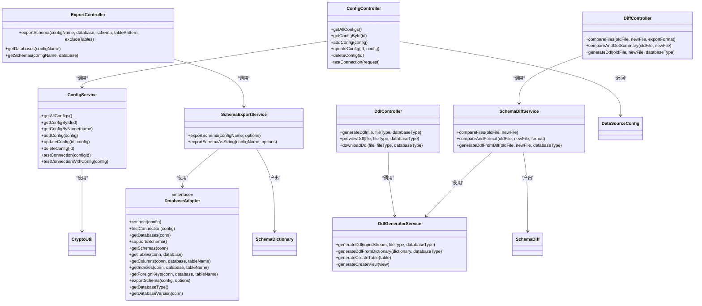
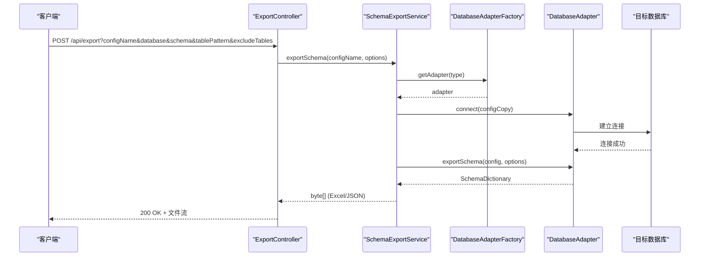
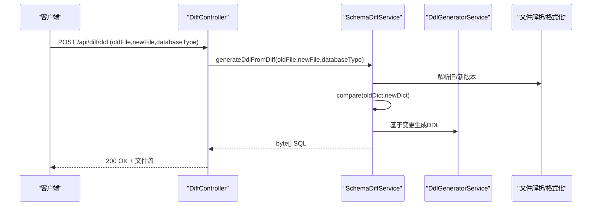
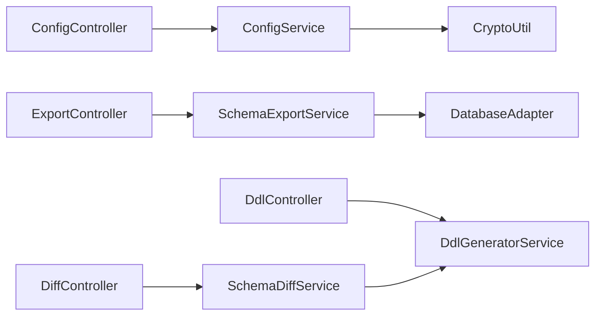

# API接口参考

<cite>
**本文引用的文件**   
- [README.md](file://README.md)
- [application.yml](file://schemasync-backend/src/main/resources/application.yml)
- [SwaggerConfig.java](file://schemasync-backend/src/main/java/com/schemasync/config/SwaggerConfig.java)
- [ConfigController.java](file://schemasync-backend/src/main/java/com/schemasync/controller/ConfigController.java)
- [ExportController.java](file://schemasync-backend/src/main/java/com/schemasync/controller/ExportController.java)
- [DiffController.java](file://schemasync-backend/src/main/java/com/schemasync/controller/DiffController.java)
- [DdlController.java](file://schemasync-backend/src/main/java/com/schemasync/controller/DdlController.java)
- [ConfigService.java](file://schemasync-backend/src/main/java/com/schemasync/service/ConfigService.java)
- [SchemaExportService.java](file://schemasync-backend/src/main/java/com/schemasync/service/SchemaExportService.java)
- [SchemaDiffService.java](file://schemasync-backend/src/main/java/com/schemasync/service/SchemaDiffService.java)
- [DdlGeneratorService.java](file://schemasync-backend/src/main/java/com/schemasync/service/DdlGeneratorService.java)
- [DataSourceConfig.java](file://schemasync-backend/src/main/java/com/schemasync/model/config/DataSourceConfig.java)
- [DatabaseAdapter.java](file://schemasync-backend/src/main/java/com/schemasync/adapter/DatabaseAdapter.java)
- [CryptoUtil.java](file://schemasync-backend/src/main/java/com/schemasync/util/CryptoUtil.java)
- [SchemaDictionary.java](file://schemasync-backend/src/main/java/com/schemasync/model/dict/SchemaDictionary.java)
- [SchemaDiff.java](file://schemasync-backend/src/main/java/com/schemasync/model/diff/SchemaDiff.java)
</cite>

## 目录
1. [简介](#简介)
2. [项目结构](#项目结构)
3. [核心组件](#核心组件)
4. [架构总览](#架构总览)
5. [详细接口说明](#详细接口说明)
6. [依赖关系分析](#依赖关系分析)
7. [性能与容量](#性能与容量)
8. [认证与安全](#认证与安全)
9. [错误处理与状态码](#错误处理与状态码)
10. [Swagger UI 使用指南](#swagger-ui-使用指南)
11. [客户端集成示例与最佳实践](#客户端集成示例与最佳实践)
12. [故障排查](#故障排查)
13. [结论](#结论)

## 简介
本参考文档面向开发者，提供 SchemaSync RESTful API 的完整规范与使用说明。覆盖数据源配置管理（CRUD、连接测试）、数据字典导出（多格式、表过滤）、版本差异对比（文件上传、对比分析）、DDL脚本生成（变更检测、脚本生成）等能力，并给出请求/响应示例、参数校验规则、分页策略、错误处理策略以及 Swagger UI 的使用方法与客户端集成建议。

## 项目结构
后端采用 Spring Boot 分层架构：控制器层暴露 REST 接口，服务层封装业务逻辑，适配器层对接多种数据库，模型层定义数据结构，工具类提供加密与通用能力。前端通过 Axios 调用后端接口，并通过 Swagger UI 进行在线调试。

图表来源
- [ConfigController.java:22-133](file://schemasync-backend/src/main/java/com/schemasync/controller/ConfigController.java#L22-L133)
- [ExportController.java:32-223](file://schemasync-backend/src/main/java/com/schemasync/controller/ExportController.java#L32-L223)
- [DiffController.java:23-108](file://schemasync-backend/src/main/java/com/schemasync/controller/DiffController.java#L23-L108)
- [DdlController.java:24-106](file://schemasync-backend/src/main/java/com/schemasync/controller/DdlController.java#L24-L106)
- [ConfigService.java:26-383](file://schemasync-backend/src/main/java/com/schemasync/service/ConfigService.java#L26-L383)
- [SchemaExportService.java:22-141](file://schemasync-backend/src/main/java/com/schemasync/service/SchemaExportService.java#L22-L141)
- [SchemaDiffService.java:35-800](file://schemasync-backend/src/main/java/com/schemasync/service/SchemaDiffService.java#L35-L800)
- [DdlGeneratorService.java:24-718](file://schemasync-backend/src/main/java/com/schemasync/service/DdlGeneratorService.java#L24-L718)
- [DatabaseAdapter.java:17-134](file://schemasync-backend/src/main/java/com/schemasync/adapter/DatabaseAdapter.java#L17-L134)

章节来源
- [README.md:1-239](file://README.md#L1-L239)

## 核心组件
- 控制器层
  - 配置管理：ConfigController
  - 数据字典导出：ExportController
  - 版本差异对比：DiffController
  - 全量DDL生成：DdlController
- 服务层
  - 配置服务：ConfigService（持久化到本地JSON，AES加密密码）
  - 导出服务：SchemaExportService（适配不同格式输出）
  - 差异服务：SchemaDiffService（解析、对比、格式化、DDL生成）
  - DDL生成服务：DdlGeneratorService（MySQL/GaussDB Oracle风格）
- 适配器层
  - DatabaseAdapter 统一接口，支持多数据库类型
- 模型层
  - DataSourceConfig：数据源配置对象
  - SchemaDictionary：数据字典模型
  - SchemaDiff：差异结果模型
- 工具类
  - CryptoUtil：AES加解密

章节来源
- [ConfigController.java:22-133](file://schemasync-backend/src/main/java/com/schemasync/controller/ConfigController.java#L22-L133)
- [ExportController.java:32-223](file://schemasync-backend/src/main/java/com/schemasync/controller/ExportController.java#L32-L223)
- [DiffController.java:23-108](file://schemasync-backend/src/main/java/com/schemasync/controller/DiffController.java#L23-L108)
- [DdlController.java:24-106](file://schemasync-backend/src/main/java/com/schemasync/controller/DdlController.java#L24-L106)
- [ConfigService.java:26-383](file://schemasync-backend/src/main/java/com/schemasync/service/ConfigService.java#L26-L383)
- [SchemaExportService.java:22-141](file://schemasync-backend/src/main/java/com/schemasync/service/SchemaExportService.java#L22-L141)
- [SchemaDiffService.java:35-800](file://schemasync-backend/src/main/java/com/schemasync/service/SchemaDiffService.java#L35-L800)
- [DdlGeneratorService.java:24-718](file://schemasync-backend/src/main/java/com/schemasync/service/DdlGeneratorService.java#L24-L718)
- [DataSourceConfig.java:13-129](file://schemasync-backend/src/main/java/com/schemasync/model/config/DataSourceConfig.java#L13-L129)
- [DatabaseAdapter.java:17-134](file://schemasync-backend/src/main/java/com/schemasync/adapter/DatabaseAdapter.java#L17-L134)
- [CryptoUtil.java:16-84](file://schemasync-backend/src/main/java/com/schemasync/util/CryptoUtil.java#L16-L84)
- [SchemaDictionary.java:11-28](file://schemasync-backend/src/main/java/com/schemasync/model/dict/SchemaDictionary.java#L11-L28)
- [SchemaDiff.java:11-35](file://schemasync-backend/src/main/java/com/schemasync/model/diff/SchemaDiff.java#L11-L35)

## 架构总览
整体为典型的“控制器-服务-适配器”三层架构，结合策略模式实现多数据库适配；导出与差异流程均基于统一的 SchemaDictionary 模型；DDL生成支持 MySQL 与 GaussDB Oracle 两种风格。

图表来源
- [ConfigController.java:22-133](file://schemasync-backend/src/main/java/com/schemasync/controller/ConfigController.java#L22-L133)
- [ExportController.java:32-223](file://schemasync-backend/src/main/java/com/schemasync/controller/ExportController.java#L32-L223)
- [DiffController.java:23-108](file://schemasync-backend/src/main/java/com/schemasync/controller/DiffController.java#L23-L108)
- [DdlController.java:24-106](file://schemasync-backend/src/main/java/com/schemasync/controller/DdlController.java#L24-L106)
- [ConfigService.java:26-383](file://schemasync-backend/src/main/java/com/schemasync/service/ConfigService.java#L26-L383)
- [SchemaExportService.java:22-141](file://schemasync-backend/src/main/java/com/schemasync/service/SchemaExportService.java#L22-L141)
- [SchemaDiffService.java:35-800](file://schemasync-backend/src/main/java/com/schemasync/service/SchemaDiffService.java#L35-L800)
- [DdlGeneratorService.java:24-718](file://schemasync-backend/src/main/java/com/schemasync/service/DdlGeneratorService.java#L24-L718)
- [DatabaseAdapter.java:17-134](file://schemasync-backend/src/main/java/com/schemasync/adapter/DatabaseAdapter.java#L17-L134)
- [DataSourceConfig.java:13-129](file://schemasync-backend/src/main/java/com/schemasync/model/config/DataSourceConfig.java#L13-L129)
- [SchemaDictionary.java:11-28](file://schemasync-backend/src/main/java/com/schemasync/model/dict/SchemaDictionary.java#L11-L28)
- [SchemaDiff.java:11-35](file://schemasync-backend/src/main/java/com/schemasync/model/diff/SchemaDiff.java#L11-L35)
- [CryptoUtil.java:16-84](file://schemasync-backend/src/main/java/com/schemasync/util/CryptoUtil.java#L16-L84)

## 详细接口说明

### 基础信息
- 基础路径：/
- 端口：8999（见 application.yml）
- 内容类型：
  - JSON 接口：application/json
  - 文件下载接口：application/octet-stream
- 文件上传大小限制：单文件最大 100MB，单次请求最大 200MB

章节来源
- [application.yml:1-83](file://schemasync-backend/src/main/resources/application.yml#L1-L83)

---

### 一、数据源配置管理（/api/config）

#### 1. 获取所有数据源配置
- 方法：GET
- URL：/api/config/datasources
- 请求参数：无
- 响应体：数组，元素为数据源配置对象
- 字段说明（节选）：id、name、type、host、port、database、username、password（加密存储）、charset、timeout、jdbcUrl、poolConfig、createTime、updateTime、supportsSchema（由适配器动态设置）
- 成功响应示例（JSON）：
  - 200 OK
  - 响应体：[DataSourceConfig]
- 失败响应示例：
  - 500 Internal Server Error（内部异常）

章节来源
- [ConfigController.java:33-51](file://schemasync-backend/src/main/java/com/schemasync/controller/ConfigController.java#L33-L51)
- [DataSourceConfig.java:13-129](file://schemasync-backend/src/main/java/com/schemasync/model/config/DataSourceConfig.java#L13-L129)

#### 2. 根据ID获取数据源配置
- 方法：GET
- URL：/api/config/datasources/{id}
- 路径参数：id（字符串）
- 成功响应：DataSourceConfig
- 失败响应：
  - 404 Not Found（不存在）

章节来源
- [ConfigController.java:53-61](file://schemasync-backend/src/main/java/com/schemasync/controller/ConfigController.java#L53-L61)

#### 3. 新增数据源配置
- 方法：POST
- URL：/api/config/datasources
- 请求体：DataSourceConfig（必填：name、type、host、username；可选：port、database、password、charset、timeout、jdbcUrl、poolConfig）
- 行为：
  - 自动填充默认值（如 port=3306、timeout=30、charset=utf8mb4）
  - 自动生成 id（若未提供）
  - 对 password 进行 AES 加密后存储
- 成功响应：创建的 DataSourceConfig
- 失败响应：
  - 400 Bad Request（参数校验失败）
  - 500 Internal Server Error（保存失败）

章节来源
- [ConfigController.java:63-68](file://schemasync-backend/src/main/java/com/schemasync/controller/ConfigController.java#L63-L68)
- [ConfigService.java:133-180](file://schemasync-backend/src/main/java/com/schemasync/service/ConfigService.java#L133-L180)
- [CryptoUtil.java:37-48](file://schemasync-backend/src/main/java/com/schemasync/util/CryptoUtil.java#L37-L48)

#### 4. 更新数据源配置
- 方法：PUT
- URL：/api/config/datasources/{id}
- 路径参数：id
- 请求体：DataSourceConfig（仅更新提供的字段）
- 行为：保留原 createTime，更新 updateTime；若提供 password 且未加密则加密
- 成功响应：更新后的 DataSourceConfig
- 失败响应：
  - 404 Not Found（配置不存在）
  - 500 Internal Server Error（保存失败）

章节来源
- [ConfigController.java:70-77](file://schemasync-backend/src/main/java/com/schemasync/controller/ConfigController.java#L70-L77)
- [ConfigService.java:185-205](file://schemasync-backend/src/main/java/com/schemasync/service/ConfigService.java#L185-L205)

#### 5. 删除数据源配置
- 方法：DELETE
- URL：/api/config/datasources/{id}
- 路径参数：id
- 成功响应：200 OK（空体）
- 失败响应：
  - 500 Internal Server Error（保存失败）

章节来源
- [ConfigController.java:79-84](file://schemasync-backend/src/main/java/com/schemasync/controller/ConfigController.java#L79-L84)
- [ConfigService.java:210-213](file://schemasync-backend/src/main/java/com/schemasync/service/ConfigService.java#L210-L213)

#### 6. 测试数据源连接
- 方法：POST
- URL：/api/config/datasources/test
- 请求体：Map<String, Object>
  - 模式A（测试已保存配置）：configId（字符串）
  - 模式B（测试临时配置）：type、host、port、database、username、password（可选），以及 jdbcUrl、poolConfig、timeout（可选）
- 成功响应：
  - 200 OK
  - 响应体：{ success: boolean, message: string, databaseVersion?: string }
- 失败响应：
  - 500 Internal Server Error（连接失败或异常）

章节来源
- [ConfigController.java:86-131](file://schemasync-backend/src/main/java/com/schemasync/controller/ConfigController.java#L86-L131)
- [ConfigService.java:221-271](file://schemasync-backend/src/main/java/com/schemasync/service/ConfigService.java#L221-L271)
- [DatabaseAdapter.java:26-34](file://schemasync-backend/src/main/java/com/schemasync/adapter/DatabaseAdapter.java#L26-L34)

---

### 二、数据字典导出（/api/export）

#### 1. 导出数据字典
- 方法：POST
- URL：/api/export
- 查询参数：
  - configName（必填）：数据源配置名称
  - database（必填）：数据库名
  - schema（可选）：SCHEMA（部分数据库支持）
  - tablePattern（可选）：表名匹配模式
  - excludeTables（可选）：排除的表列表（逗号分隔或数组，视前端传参）
- 响应：Excel 二进制流（固定为 Excel 格式）
- 文件名：database_schema_yyyyMMddHHmmss_时间戳.xlsx
- 成功响应：200 OK（application/octet-stream）
- 失败响应：
  - 400 Bad Request（参数缺失）
  - 500 Internal Server Error（导出失败）

章节来源
- [ExportController.java:48-99](file://schemasync-backend/src/main/java/com/schemasync/controller/ExportController.java#L48-L99)
- [SchemaExportService.java:46-111](file://schemasync-backend/src/main/java/com/schemasync/service/SchemaExportService.java#L46-L111)

#### 2. 获取数据库列表
- 方法：GET
- URL：/api/export/databases?configName=xxx
- 成功响应：200 OK，数组[string]
- 失败响应：
  - 400 Bad Request（参数缺失或配置不存在）
  - 500 Internal Server Error（连接失败）

章节来源
- [ExportController.java:101-144](file://schemasync-backend/src/main/java/com/schemasync/controller/ExportController.java#L101-L144)
- [DatabaseAdapter.java:43-43](file://schemasync-backend/src/main/java/com/schemasync/adapter/DatabaseAdapter.java#L43-L43)

#### 3. 获取SCHEMA列表
- 方法：GET
- URL：/api/export/schemas?configName=xxx&database=yyy
- 成功响应：200 OK，数组[string]
- 失败响应：
  - 400 Bad Request（参数缺失或配置不存在或不支持SCHEMA）
  - 500 Internal Server Error（连接失败）

章节来源
- [ExportController.java:146-201](file://schemasync-backend/src/main/java/com/schemasync/controller/ExportController.java#L146-L201)
- [DatabaseAdapter.java:50-63](file://schemasync-backend/src/main/java/com/schemasync/adapter/DatabaseAdapter.java#L50-L63)

---

### 三、版本差异对比（/api/diff）

#### 1. 对比两个数据字典文件并下载结果
- 方法：POST
- URL：/api/diff
- 表单参数：
  - oldFile（MultipartFile，必填）
  - newFile（MultipartFile，必填）
  - exportFormat（可选，默认 excel；支持 excel/json）
- 响应：差异结果文件（excel 或 json）
- 文件名：diff_yyyyMMddHHmmss_时间戳.xlsx 或 .json
- 成功响应：200 OK（application/octet-stream）
- 失败响应：
  - 400 Bad Request（文件为空）
  - 500 Internal Server Error（解析/对比失败）

章节来源
- [DiffController.java:31-62](file://schemasync-backend/src/main/java/com/schemasync/controller/DiffController.java#L31-L62)
- [SchemaDiffService.java:114-145](file://schemasync-backend/src/main/java/com/schemasync/service/SchemaDiffService.java#L114-L145)

#### 2. 对比并返回统计摘要
- 方法：POST
- URL：/api/diff/summary
- 表单参数：oldFile、newFile（均为 MultipartFile，必填）
- 成功响应：200 OK，SchemaDiff 对象
- 失败响应：
  - 400 Bad Request（文件为空）
  - 500 Internal Server Error（解析/对比失败）

章节来源
- [DiffController.java:64-76](file://schemasync-backend/src/main/java/com/schemasync/controller/DiffController.java#L64-L76)
- [SchemaDiff.java:11-35](file://schemasync-backend/src/main/java/com/schemasync/model/diff/SchemaDiff.java#L11-L35)

#### 3. 基于对比结果生成差异化DDL脚本
- 方法：POST
- URL：/api/diff/ddl
- 表单参数：
  - oldFile、newFile（MultipartFile，必填）
  - databaseType（可选，默认 mysql；支持 mysql/gaussdb_mysql/gaussdb_oracle）
- 响应：SQL 脚本文件（.sql）
- 文件名：ddl_yyyyMMddHHmmss_时间戳.sql
- 成功响应：200 OK（application/octet-stream）
- 失败响应：
  - 400 Bad Request（文件为空）
  - 500 Internal Server Error（生成失败）

章节来源
- [DiffController.java:78-106](file://schemasync-backend/src/main/java/com/schemasync/controller/DiffController.java#L78-L106)
- [SchemaDiffService.java:203-227](file://schemasync-backend/src/main/java/com/schemasync/service/SchemaDiffService.java#L203-L227)

---

### 四、全量DDL脚本生成（/api/ddl）

#### 1. 生成并下载DDL
- 方法：POST
- URL：/api/ddl/generate
- 表单参数：
  - file（MultipartFile，必填；支持 excel/json）
  - fileType（可选，默认 excel；excel/json）
  - databaseType（可选，默认 mysql；mysql/gaussdb_mysql/gaussdb_oracle）
- 响应：SQL 脚本文件（.sql）
- 文件名：ddl_yyyyMMddHHmmss_时间戳.sql
- 成功响应：200 OK（application/octet-stream）
- 失败响应：
  - 500 Internal Server Error（生成失败）

章节来源
- [DdlController.java:32-60](file://schemasync-backend/src/main/java/com/schemasync/controller/DdlController.java#L32-L60)
- [DdlGeneratorService.java:40-61](file://schemasync-backend/src/main/java/com/schemasync/service/DdlGeneratorService.java#L40-L61)

#### 2. 预览DDL
- 方法：POST
- URL：/api/ddl/preview
- 表单参数：同上
- 成功响应：200 OK，文本（DDL SQL）
- 失败响应：
  - 500 Internal Server Error（生成失败）

章节来源
- [DdlController.java:62-74](file://schemasync-backend/src/main/java/com/schemasync/controller/DdlController.java#L62-L74)
- [DdlGeneratorService.java:40-61](file://schemasync-backend/src/main/java/com/schemasync/service/DdlGeneratorService.java#L40-L61)

#### 3. 下载DDL
- 方法：POST
- URL：/api/ddl/download
- 表单参数：同上
- 成功响应：200 OK（application/octet-stream）
- 失败响应：
  - 500 Internal Server Error（生成失败）

章节来源
- [DdlController.java:76-104](file://schemasync-backend/src/main/java/com/schemasync/controller/DdlController.java#L76-L104)
- [DdlGeneratorService.java:40-61](file://schemasync-backend/src/main/java/com/schemasync/service/DdlGeneratorService.java#L40-L61)

---

### 五、关键数据模型

#### 数据源配置（DataSourceConfig）
- 关键字段：id、name、type、host、port、database、username、password（加密存储）、charset、timeout、jdbcUrl、poolConfig、createTime、updateTime、supportsSchema（运行时附加）
- 用途：配置管理、连接测试、导出时解析

章节来源
- [DataSourceConfig.java:13-129](file://schemasync-backend/src/main/java/com/schemasync/model/config/DataSourceConfig.java#L13-L129)

#### 数据字典（SchemaDictionary）
- 关键字段：metadata、tables
- 用途：导出产物、DDL生成输入

章节来源
- [SchemaDictionary.java:11-28](file://schemasync-backend/src/main/java/com/schemasync/model/dict/SchemaDictionary.java#L11-L28)

#### 差异结果（SchemaDiff）
- 关键字段：diffMetadata、summary、changes
- 用途：对比结果展示、DDL生成依据

章节来源
- [SchemaDiff.java:11-35](file://schemasync-backend/src/main/java/com/schemasync/model/diff/SchemaDiff.java#L11-L35)

---

### 六、关键业务流程时序图

#### 导出数据字典流程

图表来源
- [ExportController.java:48-99](file://schemasync-backend/src/main/java/com/schemasync/controller/ExportController.java#L48-L99)
- [SchemaExportService.java:46-111](file://schemasync-backend/src/main/java/com/schemasync/service/SchemaExportService.java#L46-L111)
- [DatabaseAdapter.java:116-116](file://schemasync-backend/src/main/java/com/schemasync/adapter/DatabaseAdapter.java#L116-L116)

#### 差异对比与DDL生成流程

图表来源
- [DiffController.java:78-106](file://schemasync-backend/src/main/java/com/schemasync/controller/DiffController.java#L78-L106)
- [SchemaDiffService.java:203-227](file://schemasync-backend/src/main/java/com/schemasync/service/SchemaDiffService.java#L203-L227)
- [DdlGeneratorService.java:81-97](file://schemasync-backend/src/main/java/com/schemasync/service/DdlGeneratorService.java#L81-L97)

## 依赖关系分析
- 控制器与服务解耦：每个控制器仅负责参数校验与响应包装，具体逻辑下沉至服务层。
- 服务与适配器解耦：导出与连接操作通过 DatabaseAdapter 抽象，便于扩展新数据库。
- 模型复用：SchemaDictionary 与 SchemaDiff 在导出、对比、DDL生成中复用，降低重复代码。
- 安全与配置：密码在持久化前加密，读取时按需解密；配置文件位于用户主目录下的隐藏目录，避免侵入部署环境。

图表来源
- [ConfigController.java:22-133](file://schemasync-backend/src/main/java/com/schemasync/controller/ConfigController.java#L22-L133)
- [ExportController.java:32-223](file://schemasync-backend/src/main/java/com/schemasync/controller/ExportController.java#L32-L223)
- [DiffController.java:23-108](file://schemasync-backend/src/main/java/com/schemasync/controller/DiffController.java#L23-L108)
- [DdlController.java:24-106](file://schemasync-backend/src/main/java/com/schemasync/controller/DdlController.java#L24-L106)
- [ConfigService.java:26-383](file://schemasync-backend/src/main/java/com/schemasync/service/ConfigService.java#L26-L383)
- [SchemaExportService.java:22-141](file://schemasync-backend/src/main/java/com/schemasync/service/SchemaExportService.java#L22-L141)
- [SchemaDiffService.java:35-800](file://schemasync-backend/src/main/java/com/schemasync/service/SchemaDiffService.java#L35-L800)
- [DdlGeneratorService.java:24-718](file://schemasync-backend/src/main/java/com/schemasync/service/DdlGeneratorService.java#L24-L718)
- [DatabaseAdapter.java:17-134](file://schemasync-backend/src/main/java/com/schemasync/adapter/DatabaseAdapter.java#L17-L134)
- [CryptoUtil.java:16-84](file://schemasync-backend/src/main/java/com/schemasync/util/CryptoUtil.java#L16-L84)

## 性能与容量
- 文件上传限制：单文件最大 100MB，单次请求最大 200MB（application.yml）
- 日志级别：根日志 INFO，包 com.schemasync DEBUG（便于定位问题）
- 导出耗时：服务层记录导出与格式化耗时，便于性能监控
- 连接池：可通过 poolConfig 自定义 HikariCP 参数（如 maximumPoolSize、idleTimeout）

章节来源
- [application.yml:18-34](file://schemasync-backend/src/main/resources/application.yml#L18-L34)
- [SchemaExportService.java:86-105](file://schemasync-backend/src/main/java/com/schemasync/service/SchemaExportService.java#L86-L105)

## 认证与安全
- 当前未启用认证授权机制（无鉴权中间件）。生产环境建议增加 JWT 或 OAuth2 鉴权。
- 密码安全：
  - 新增/更新时，若传入明文密码则自动加密存储
  - 连接测试与导出时按需解密
- 传输安全：建议使用 HTTPS 反向代理（Nginx）保护敏感数据

章节来源
- [ConfigService.java:167-172](file://schemasync-backend/src/main/java/com/schemasync/service/ConfigService.java#L167-L172)
- [ConfigService.java:195-200](file://schemasync-backend/src/main/java/com/schemasync/service/ConfigService.java#L195-L200)
- [SchemaExportService.java:74-83](file://schemasync-backend/src/main/java/com/schemasync/service/SchemaExportService.java#L74-L83)
- [CryptoUtil.java:37-67](file://schemasync-backend/src/main/java/com/schemasync/util/CryptoUtil.java#L37-L67)

## 错误处理与状态码
- 常见状态码
  - 200 OK：成功
  - 400 Bad Request：参数校验失败（如必填项缺失、文件为空）
  - 404 Not Found：资源不存在（如配置ID不存在）
  - 500 Internal Server Error：服务端异常（连接失败、解析失败、生成失败等）
- 错误消息
  - 多数接口抛出 RuntimeException 并携带错误原因
  - 建议在网关或全局异常处理器统一包装为结构化错误响应

章节来源
- [ExportController.java:57-63](file://schemasync-backend/src/main/java/com/schemasync/controller/ExportController.java#L57-L63)
- [DiffController.java:38-41](file://schemasync-backend/src/main/java/com/schemasync/controller/DiffController.java#L38-L41)
- [DdlController.java:57-59](file://schemasync-backend/src/main/java/com/schemasync/controller/DdlController.java#L57-L59)
- [ConfigController.java:57-59](file://schemasync-backend/src/main/java/com/schemasync/controller/ConfigController.java#L57-L59)

## Swagger UI 使用指南
- 访问地址：http://localhost:8999/swagger-ui.html
- OpenAPI 文档地址：http://localhost:8999/api-docs
- 功能：浏览接口、在线调试、查看请求/响应示例
- 注意：确保后端服务已启动且端口为 8999

章节来源
- [application.yml:77-83](file://schemasync-backend/src/main/resources/application.yml#L77-L83)
- [SwaggerConfig.java:17-33](file://schemasync-backend/src/main/java/com/schemasync/config/SwaggerConfig.java#L17-L33)

## 客户端集成示例与最佳实践

### 通用约定
- 基础URL：http://localhost:8999
- 文件上传：multipart/form-data
- JSON 请求：Content-Type: application/json
- 下载文件：接收 application/octet-stream 并写入本地文件

### 示例：新增数据源配置（JSON）
- 请求
  - 方法：POST
  - URL：/api/config/datasources
  - Header：Content-Type: application/json
  - Body：
    - name: "dev-mysql"
    - type: "mysql"
    - host: "127.0.0.1"
    - port: 3306
    - database: "testdb"
    - username: "root"
    - password: "your_password"
- 响应
  - 200 OK
  - Body：包含 id、createTime、updateTime 等字段的 DataSourceConfig

章节来源
- [ConfigController.java:63-68](file://schemasync-backend/src/main/java/com/schemasync/controller/ConfigController.java#L63-L68)
- [ConfigService.java:133-180](file://schemasync-backend/src/main/java/com/schemasync/service/ConfigService.java#L133-L180)

### 示例：导出数据字典（Excel）
- 请求
  - 方法：POST
  - URL：/api/export?configName=dev-mysql&database=testdb
- 响应
  - 200 OK
  - Content-Type: application/octet-stream
  - 文件名：testdb_schema_yyyyMMddHHmmss_时间戳.xlsx

章节来源
- [ExportController.java:48-99](file://schemasync-backend/src/main/java/com/schemasync/controller/ExportController.java#L48-L99)

### 示例：对比差异并下载结果（Excel）
- 请求
  - 方法：POST
  - URL：/api/diff?exportFormat=excel
  - 表单：oldFile、newFile
- 响应
  - 200 OK
  - 文件名：diff_yyyyMMddHHmmss_时间戳.xlsx

章节来源
- [DiffController.java:31-62](file://schemasync-backend/src/main/java/com/schemasync/controller/DiffController.java#L31-L62)

### 示例：生成差异化DDL（SQL）
- 请求
  - 方法：POST
  - URL：/api/diff/ddl?databaseType=mysql
  - 表单：oldFile、newFile
- 响应
  - 200 OK
  - 文件名：ddl_yyyyMMddHHmmss_时间戳.sql

章节来源
- [DiffController.java:78-106](file://schemasync-backend/src/main/java/com/schemasync/controller/DiffController.java#L78-L106)

### 最佳实践
- 参数校验：在客户端侧先做非空与格式校验，减少无效请求
- 重试与超时：网络不稳定场景下增加重试与合理超时
- 大文件处理：分片上传或压缩后再上传（需后端配合）
- 幂等性：配置CRUD接口应避免重复创建同名配置
- 安全：生产环境启用HTTPS与鉴权

## 故障排查
- 连接失败
  - 检查数据源配置是否正确（主机、端口、用户名、密码）
  - 确认数据库可访问性与防火墙策略
  - 查看日志中的“测试连接失败”相关堆栈
- 导出失败
  - 确认配置存在且有效
  - 检查数据库权限与字符集
  - 关注导出耗时与文件大小
- 对比失败
  - 确认上传文件格式正确（xlsx/xls 或 json）
  - 检查文件是否损坏或过大
- DDL生成失败
  - 确认数据库类型参数正确
  - 检查数据字典完整性（表/字段/索引/外键）

章节来源
- [ConfigService.java:302-334](file://schemasync-backend/src/main/java/com/schemasync/service/ConfigService.java#L302-L334)
- [SchemaExportService.java:107-111](file://schemasync-backend/src/main/java/com/schemasync/service/SchemaExportService.java#L107-L111)
- [SchemaDiffService.java:97-104](file://schemasync-backend/src/main/java/com/schemasync/service/SchemaDiffService.java#L97-L104)
- [DdlGeneratorService.java:57-61](file://schemasync-backend/src/main/java/com/schemasync/service/DdlGeneratorService.java#L57-L61)

## 结论
SchemaSync 提供了完善的数据字典管理与变更管理能力，涵盖配置管理、导出、对比与DDL生成四大核心能力。通过清晰的REST接口与灵活的适配器设计，能够快速集成到现有研发流程中。建议在生产环境补充鉴权与审计能力，并结合CI/CD流水线自动化执行差异分析与脚本生成，提升数据库变更的安全性与效率。