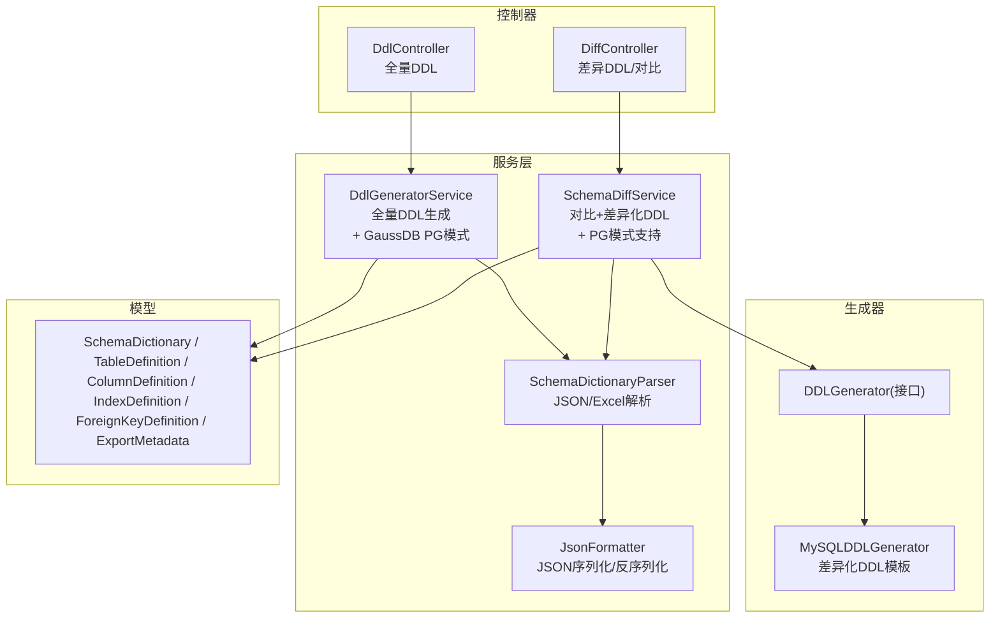
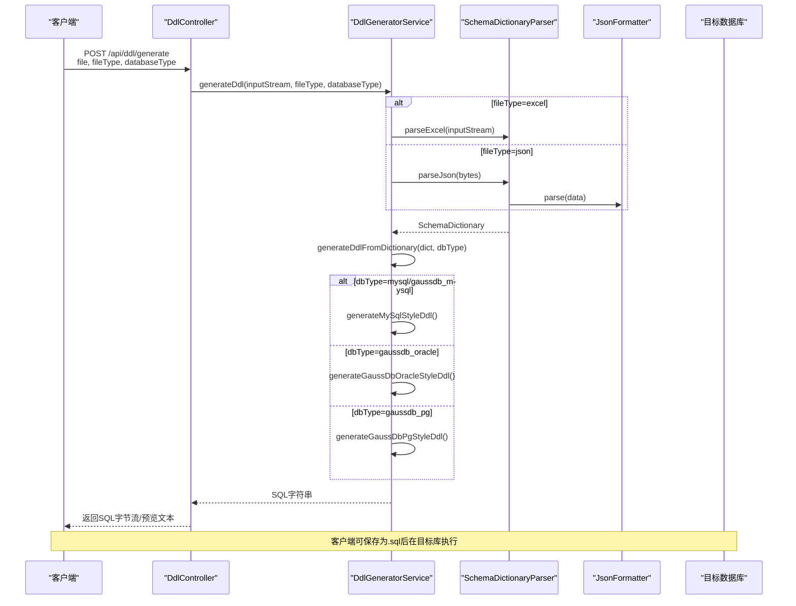
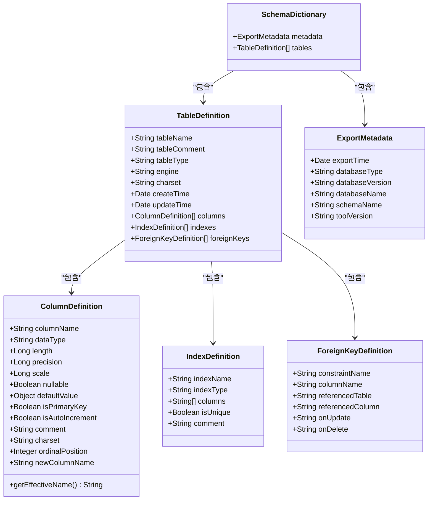
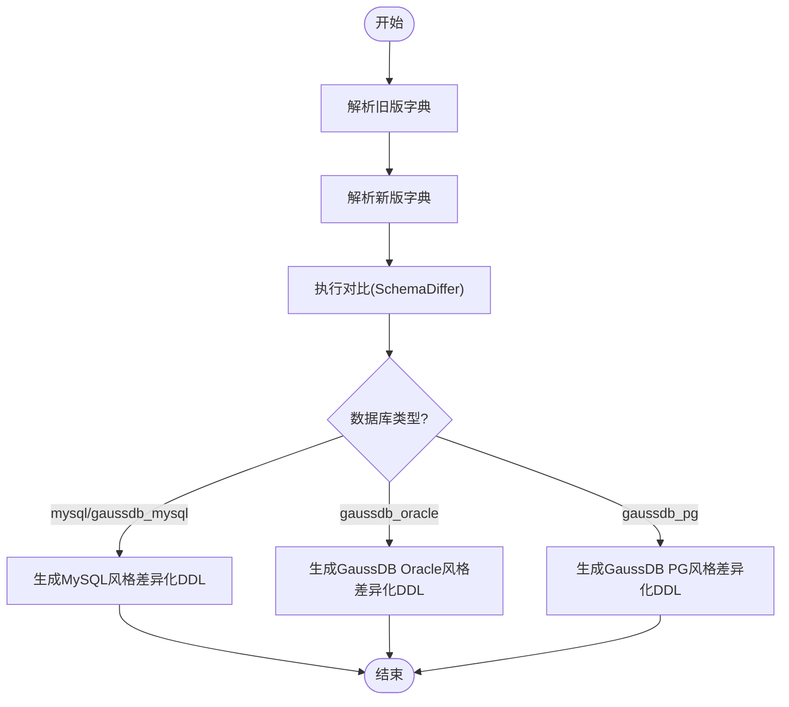
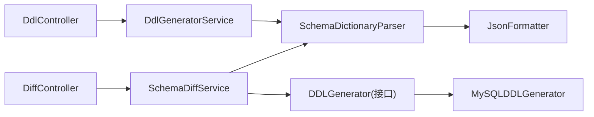

# DDL生成API

<cite>
**本文引用的文件**   
- [DdlController.java](file://schemasync-backend/src/main/java/com/schemasync/controller/DdlController.java)
- [DiffController.java](file://schemasync-backend/src/main/java/com/schemasync/controller/DiffController.java)
- [DdlGeneratorService.java](file://schemasync-backend/src/main/java/com/schemasync/service/DdlGeneratorService.java)
- [SchemaDiffService.java](file://schemasync-backend/src/main/java/com/schemasync/service/SchemaDiffService.java)
- [DDLGenerator.java](file://schemasync-backend/src/main/java/com/schemasync/generator/DDLGenerator.java)
- [MySQLDDLGenerator.java](file://schemasync-backend/src/main/java/com/schemasync/generator/MySQLDDLGenerator.java)
- [GenerationOptions.java](file://schemasync-backend/src/main/java/com/schemasync/generator/GenerationOptions.java)
- [SchemaDictionaryParser.java](file://schemasync-backend/src/main/java/com/schemasync/service/SchemaDictionaryParser.java)
- [JsonFormatter.java](file://schemasync-backend/src/main/java/com/schemasync/formatter/JsonFormatter.java)
- [SchemaDictionary.java](file://schemasync-backend/src/main/java/com/schemasync/model/dict/SchemaDictionary.java)
- [TableDefinition.java](file://schemasync-backend/src/main/java/com/schemasync/model/dict/TableDefinition.java)
- [ColumnDefinition.java](file://schemasync-backend/src/main/java/com/schemasync/model/dict/ColumnDefinition.java)
- [IndexDefinition.java](file://schemasync-backend/src/main/java/com/schemasync/model/dict/IndexDefinition.java)
- [ForeignKeyDefinition.java](file://schemasync-backend/src/main/java/com/schemasync/model/dict/ForeignKeyDefinition.java)
- [ExportMetadata.java](file://schemasync-backend/src/main/java/com/schemasync/model/dict/ExportMetadata.java)
- [GenerateView.vue](file://schemasync-frontend/src/views/GenerateView.vue)
- [DiffView.vue](file://schemasync-frontend/src/views/DiffView.vue)
</cite>

## 更新摘要
**所做更改**   
- 新增GaussDB PostgreSQL模式支持，databaseType参数现接受'gaussdb_pg'选项
- 完善PostgreSQL标准SQL语法的DDL生成逻辑
- 增强差异化DDL生成功能以支持PG模式
- 更新前端界面以提供PG模式选择选项
- 扩展数据类型映射以支持PostgreSQL标准类型

## 目录
1. [简介](#简介)
2. [项目结构](#项目结构)
3. [核心组件](#核心组件)
4. [架构总览](#架构总览)
5. [详细组件分析](#详细组件分析)
6. [依赖关系分析](#依赖关系分析)
7. [性能与执行建议](#性能与执行建议)
8. [故障排查指南](#故障排查指南)
9. [结论](#结论)
10. [附录：接口规范与最佳实践](#附录接口规范与最佳实践)

## 简介
本文件面向"DDL脚本生成API"的使用者与集成方，系统性说明以下能力：
- 变更检测接口的使用方法、输入数据字典格式要求、输出SQL脚本的生成规则
- 支持的数据库类型（MySQL、GaussDB MySQL兼容模式、GaussDB Oracle兼容模式、**GaussDB PostgreSQL模式**）及语法差异
- 回滚脚本的生成逻辑、事务控制选项与安全保护机制
- 完整的请求/响应示例（参数、目标数据库类型、脚本格式等）
- DDL生成的最佳实践（脚本验证、执行顺序、依赖关系处理）
- 自定义生成器的扩展指南与常见问题解决方案

**更新** 新增对GaussDB PostgreSQL模式的支持，提供符合PostgreSQL标准SQL语法的DDL生成能力。

## 项目结构
后端采用分层设计：控制器层暴露HTTP接口；服务层负责解析、对比与生成；模型层定义数据字典与差异对象；格式化器支持JSON/Excel；生成器提供差异化DDL模板。

**图表来源**
- [DdlController.java:1-106](file://schemasync-backend/src/main/java/com/schemasync/controller/DdlController.java#L1-L106)
- [DiffController.java:1-109](file://schemasync-backend/src/main/java/com/schemasync/controller/DiffController.java#L1-L109)
- [DdlGeneratorService.java:1-898](file://schemasync-backend/src/main/java/com/schemasync/service/DdlGeneratorService.java#L1-L898)
- [SchemaDiffService.java:1-1542](file://schemasync-backend/src/main/java/com/schemasync/service/SchemaDiffService.java#L1-L1542)

章节来源
- [DdlController.java:1-106](file://schemasync-backend/src/main/java/com/schemasync/controller/DdlController.java#L1-L106)
- [DiffController.java:1-109](file://schemasync-backend/src/main/java/com/schemasync/controller/DiffController.java#L1-L109)
- [DdlGeneratorService.java:1-898](file://schemasync-backend/src/main/java/com/schemasync/service/DdlGeneratorService.java#L1-L898)
- [SchemaDiffService.java:1-1542](file://schemasync-backend/src/main/java/com/schemasync/service/SchemaDiffService.java#L1-L1542)

## 核心组件
- 全量DDL生成
  - 入口：POST /api/ddl/{generate|preview|download}
  - 输入：MultipartFile(file)、fileType(excel/json)、databaseType(mysql/gaussdb_mysql/gaussdb_oracle/**gaussdb_pg**)
  - 输出：SQL文本或二进制下载
  - 实现：DdlController -> DdlGeneratorService -> SchemaDictionaryParser -> JSON/Excel解析 -> 生成MySQL/GaussDB风格DDL

- 差异DDL生成
  - 入口：POST /api/diff/ddl
  - 输入：oldFile、newFile、databaseType
  - 输出：仅包含变更的SQL脚本
  - 实现：DiffController -> SchemaDiffService -> 解析->对比->按数据库类型生成差异化DDL

- 数据字典解析
  - 支持JSON与Excel两种输入
  - Excel需包含若干Sheet（概述信息、表级别信息、字段级别信息、索引信息、约束信息），由SchemaDictionaryParser解析为SchemaDictionary

- 生成选项与回滚
  - GenerationOptions提供是否包含回滚、是否注释破坏性变更、是否使用事务、版本标识等
  - MySQLDDLGenerator.generateRollback提供基础回滚脚本骨架（删除新增表、提示恢复已删表）

**更新** 新增GaussDB PostgreSQL模式的全量和差异化DDL生成支持。

章节来源
- [DdlController.java:32-104](file://schemasync-backend/src/main/java/com/schemasync/controller/DdlController.java#L32-L104)
- [DdlGeneratorService.java:40-97](file://schemasync-backend/src/main/java/com/schemasync/service/DdlGeneratorService.java#L40-L97)
- [SchemaDictionaryParser.java:42-81](file://schemasync-backend/src/main/java/com/schemasync/service/SchemaDictionaryParser.java#L42-L81)
- [SchemaDiffService.java:203-227](file://schemasync-backend/src/main/java/com/schemasync/service/SchemaDiffService.java#L203-L227)
- [GenerationOptions.java:9-96](file://schemasync-backend/src/main/java/com/schemasync/generator/GenerationOptions.java#L9-L96)
- [MySQLDDLGenerator.java:70-104](file://schemasync-backend/src/main/java/com/schemasync/generator/MySQLDDLGenerator.java#L70-L104)

## 架构总览
下图展示从请求到DDL输出的关键调用链与数据流向。

**图表来源**
- [DdlController.java:32-60](file://schemasync-backend/src/main/java/com/schemasync/controller/DdlController.java#L32-L60)
- [DdlGeneratorService.java:40-97](file://schemasync-backend/src/main/java/com/schemasync/service/DdlGeneratorService.java#L40-L97)
- [SchemaDictionaryParser.java:35-81](file://schemasync-backend/src/main/java/com/schemasync/service/SchemaDictionaryParser.java#L35-L81)
- [JsonFormatter.java:61-68](file://schemasync-backend/src/main/java/com/schemasync/formatter/JsonFormatter.java#L61-L68)

## 详细组件分析

### 全量DDL生成接口（/api/ddl）
- 功能
  - generate：上传数据字典并生成全量DDL，返回二进制文件
  - preview：预览生成的DDL文本
  - download：同generate，用于下载
- 参数
  - file：MultipartFile，支持excel或json
  - fileType：excel|json（默认excel）
  - databaseType：mysql|gaussdb_mysql|gaussdb_oracle|**gaussdb_pg**（默认mysql）
- 行为
  - 根据fileType选择解析路径
  - 根据databaseType选择MySQL、GaussDB Oracle或**GaussDB PG**风格生成策略
  - 返回UTF-8编码的SQL内容

**更新** 新增gaussdb_pg选项，支持PostgreSQL标准SQL语法的DDL生成。

章节来源
- [DdlController.java:32-104](file://schemasync-backend/src/main/java/com/schemasync/controller/DdlController.java#L32-L104)
- [DdlGeneratorService.java:81-97](file://schemasync-backend/src/main/java/com/schemasync/service/DdlGeneratorService.java#L81-L97)

### 差异DDL生成接口（/api/diff/ddl）
- 功能
  - 基于旧版与新版数据字典的差异，生成最小化变更DDL
- 参数
  - oldFile/newFile：两个版本的字典文件（JSON或Excel）
  - databaseType：mysql|gaussdb_mysql|gaussdb_oracle|**gaussdb_pg**（默认mysql）
- 行为
  - 解析两版字典 -> 执行对比 -> 按数据库类型生成差异化DDL
  - 对破坏性变更（如DROP）默认以注释形式提示，避免误执行
  - **新增**：支持GaussDB PG模式的差异化DDL生成

**更新** 新增对GaussDB PostgreSQL模式的差异化DDL生成支持。

章节来源
- [DiffController.java:78-106](file://schemasync-backend/src/main/java/com/schemasync/controller/DiffController.java#L78-L106)
- [SchemaDiffService.java:203-227](file://schemasync-backend/src/main/java/com/schemasync/service/SchemaDiffService.java#L203-L227)

### 数据字典模型与解析
- 顶层模型
  - SchemaDictionary：包含导出元数据metadata与表列表tables
  - TableDefinition：表名、注释、类型、引擎、字符集、时间戳、列/索引/外键集合
  - ColumnDefinition：字段名、数据类型、长度/精度/小数位、NULL、默认值、主键、自增、注释、重命名(newColumnName)
  - IndexDefinition：索引名、类型、列集合、唯一标志、注释
  - ForeignKeyDefinition：约束名、本端字段、引用表/字段、更新/删除级联规则
  - ExportMetadata：导出时间、数据库类型/版本/名称、工具版本等
- 解析流程
  - JSON：通过JsonFormatter.parse直接反序列化为SchemaDictionary
  - Excel：SchemaDictionaryParser读取多个Sheet并按表名聚合列、索引、约束

**图表来源**
- [SchemaDictionary.java:1-28](file://schemasync-backend/src/main/java/com/schemasync/model/dict/SchemaDictionary.java#L1-L28)
- [TableDefinition.java:1-89](file://schemasync-backend/src/main/java/com/schemasync/model/dict/TableDefinition.java#L1-L89)
- [ColumnDefinition.java:1-116](file://schemasync-backend/src/main/java/com/schemasync/model/dict/ColumnDefinition.java#L1-L116)
- [IndexDefinition.java:1-49](file://schemasync-backend/src/main/java/com/schemasync/model/dict/IndexDefinition.java#L1-49)
- [ForeignKeyDefinition.java:1-54](file://schemasync-backend/src/main/java/com/schemasync/model/dict/ForeignKeyDefinition.java#L1-54)
- [ExportMetadata.java:1-59](file://schemasync-backend/src/main/java/com/schemasync/model/dict/ExportMetadata.java#L1-L59)

章节来源
- [SchemaDictionaryParser.java:42-81](file://schemasync-backend/src/main/java/com/schemasync/service/SchemaDictionaryParser.java#L42-L81)
- [JsonFormatter.java:61-68](file://schemasync-backend/src/main/java/com/schemasync/formatter/JsonFormatter.java#L61-L68)

### 生成规则与数据库语法差异
- MySQL风格（含GaussDB MySQL兼容模式）
  - 使用反引号包裹标识符
  - 支持ENGINE/DEFAULT CHARSET/COMMENT等表选项
  - 支持AUTO_INCREMENT、ON UPDATE/DELETE级联
  - 索引可在建表时内联定义（KEY/UNIQUE KEY）
- GaussDB Oracle兼容模式
  - 不使用反引号，标识符通常大写
  - 类型转换：VARCHAR->VARCHAR2、TEXT->CLOB、INT->NUMBER、BIGINT->NUMBER(19)、DATETIME/TIMESTAMP->TIMESTAMP、BLOB系列->BLOB、BOOLEAN/BOOL/BIT->NUMBER(1)等
  - 索引通常单独创建（DDL中作为注释提示）
  - ON UPDATE CASCADE不支持，会标注需要手动处理
  - 表注释使用COMMENT ON TABLE语句
- **GaussDB PostgreSQL模式（新增）**
  - 遵循PostgreSQL标准SQL语法，兼容性最好
  - 标识符不使用引号包裹，保持原始大小写
  - 类型转换：VARCHAR/VARCHAR2/NVARCHAR->VARCHAR、TEXT/LONGTEXT/MEDIUMTEXT/TINYTEXT->TEXT、INT/INTEGER/TINYINT/SMALLINT/MEDIUMINT->INTEGER、BIGINT->BIGINT、FLOAT->REAL、DOUBLE->DOUBLE PRECISION、DECIMAL/NUMERIC/NUMBER->NUMERIC、DATETIME/TIMESTAMP->TIMESTAMP、DATE->DATE、BLOB/LONGBLOB/MEDIUMBLOB/TINYBLOB->BYTEA、BOOLEAN/BOOL/BIT->BOOLEAN、JSON/JSONB->JSONB
  - 表注释和字段注释使用独立的COMMENT ON语句
  - 支持标准的PRIMARY KEY、NOT NULL、DEFAULT约束语法
  - 索引使用CREATE INDEX语句单独创建

**更新** 新增GaussDB PostgreSQL模式的完整DDL生成规则和类型映射支持。

章节来源
- [DdlGeneratorService.java:109-177](file://schemasync-backend/src/main/java/com/schemasync/service/DdlGeneratorService.java#L109-L177)
- [DdlGeneratorService.java:342-400](file://schemasync-backend/src/main/java/com/schemasync/service/DdlGeneratorService.java#L342-L400)
- [DdlGeneratorService.java:405-446](file://schemasync-backend/src/main/java/com/schemasync/service/DdlGeneratorService.java#L405-L446)
- [DdlGeneratorService.java:514-572](file://schemasync-backend/src/main/java/com/schemasync/service/DdlGeneratorService.java#L514-572)
- [DdlGeneratorService.java:721-898](file://schemasync-backend/src/main/java/com/schemasync/service/DdlGeneratorService.java#L721-898)

### 回滚脚本与事务控制
- 事务控制
  - GenerationOptions.useTransaction=true时，MySQLDDLGenerator会在脚本首尾添加START TRANSACTION/COMMIT
- 回滚脚本
  - MySQLDDLGenerator.generateRollback生成基础回滚脚本：删除新增表、提示恢复已删表
  - 破坏性变更可通过commentBreakingChanges进行注释保护，避免误执行
- 安全保护
  - DROP类操作默认以注释形式呈现，需手动取消注释确认
  - 建议在非生产环境先行测试，执行前备份数据库

章节来源
- [GenerationOptions.java:17-29](file://schemasync-backend/src/main/java/com/schemasync/generator/GenerationOptions.java#L17-L29)
- [MySQLDDLGenerator.java:25-68](file://schemasync-backend/src/main/java/com/schemasync/generator/MySQLDDLGenerator.java#L25-L68)
- [MySQLDDLGenerator.java:70-104](file://schemasync-backend/src/main/java/com/schemasync/generator/MySQLDDLGenerator.java#L70-L104)

### 差异化DDL生成流程

**图表来源**
- [SchemaDiffService.java:203-278](file://schemasync-backend/src/main/java/com/schemasync/service/SchemaDiffService.java#L203-L278)

**更新** 新增GaussDB PG模式的差异化DDL生成分支。

章节来源
- [SchemaDiffService.java:203-278](file://schemasync-backend/src/main/java/com/schemasync/service/SchemaDiffService.java#L203-L278)
- [SchemaDiffService.java:1227-1542](file://schemasync-backend/src/main/java/com/schemasync/service/SchemaDiffService.java#L1227-L1542)

## 依赖关系分析
- 控制器依赖服务层
- 服务层依赖解析器与格式化器
- 生成器接口与具体实现分离，便于扩展不同数据库方言
- 模型层贯穿解析、对比与生成全流程

**图表来源**
- [DdlController.java:1-106](file://schemasync-backend/src/main/java/com/schemasync/controller/DdlController.java#L1-L106)
- [DiffController.java:1-109](file://schemasync-backend/src/main/java/com/schemasync/controller/DiffController.java#L1-L109)
- [DdlGeneratorService.java:1-898](file://schemasync-backend/src/main/java/com/schemasync/service/DdlGeneratorService.java#L1-L898)
- [SchemaDiffService.java:1-1542](file://schemasync-backend/src/main/java/com/schemasync/service/SchemaDiffService.java#L1-L1542)
- [DDLGenerator.java:1-35](file://schemasync-backend/src/main/java/com/schemasync/generator/DDLGenerator.java#L1-L35)
- [MySQLDDLGenerator.java:1-354](file://schemasync-backend/src/main/java/com/schemasync/generator/MySQLDDLGenerator.java#L1-L354)
- [SchemaDictionaryParser.java:1-330](file://schemasync-backend/src/main/java/com/schemasync/service/SchemaDictionaryParser.java#L1-L330)
- [JsonFormatter.java:1-119](file://schemasync-backend/src/main/java/com/schemasync/formatter/JsonFormatter.java#L1-119)

章节来源
- [DDLGenerator.java:1-35](file://schemasync-backend/src/main/java/com/schemasync/generator/DDLGenerator.java#L1-L35)
- [MySQLDDLGenerator.java:1-354](file://schemasync-backend/src/main/java/com/schemasync/generator/MySQLDDLGenerator.java#L1-L354)

## 性能与执行建议
- 大文件处理
  - Excel解析涉及多Sheet遍历与聚合，建议分批导入或拆分大型字典
  - JSON解析为内存对象，注意JVM堆大小
- 生成策略
  - 优先使用差异化DDL减少变更范围
  - 对破坏性变更开启注释保护，降低误执行风险
- 执行顺序
  - 先新增表/视图，再修改结构，最后删除对象
  - 外键与索引变更放在结构变更之后
- 依赖关系
  - 外键依赖父表存在，确保被引用表先创建
  - 视图依赖底层表/视图，必要时调整顺序

[本节为通用指导，不直接分析具体文件]

## 故障排查指南
- 常见错误
  - 文件为空或未上传：抛出运行时异常，检查请求参数
  - 解析失败：Excel缺少必要Sheet或JSON结构不符，核对字段与类型
  - 数据库类型不支持：默认回退至MySQL风格，检查databaseType取值
- 日志定位
  - 服务层记录解析与生成过程的关键日志，结合异常栈定位问题
- 回滚与事务
  - 若脚本未包含事务控制，请自行在外部封装事务
  - 回滚脚本中的DROP操作需谨慎，建议先在测试环境验证

章节来源
- [DdlController.java:57-74](file://schemasync-backend/src/main/java/com/schemasync/controller/DdlController.java#L57-L74)
- [SchemaDiffService.java:97-104](file://schemasync-backend/src/main/java/com/schemasync/service/SchemaDiffService.java#L97-L104)
- [DdlGeneratorService.java:57-61](file://schemasync-backend/src/main/java/com/schemasync/service/DdlGeneratorService.java#L57-L61)

## 结论
本API提供从数据字典到DDL的全链路能力，覆盖全量与差异化生成、多数据库方言、回滚与事务控制、以及安全保护机制。**新增的GaussDB PostgreSQL模式支持**进一步增强了系统的兼容性和实用性。通过清晰的模型与分层架构，既满足快速落地，也便于后续扩展更多数据库类型与生成策略。

[本节为总结性内容，不直接分析具体文件]

## 附录：接口规范与最佳实践

### 接口清单与参数
- 全量DDL
  - POST /api/ddl/generate
    - 表单参数：file(MultipartFile), fileType(String, excel|json), databaseType(String, mysql|gaussdb_mysql|gaussdb_oracle|**gaussdb_pg**)
    - 响应：application/octet-stream，文件名ddl_时间戳_毫秒.sql
  - POST /api/ddl/preview
    - 同上参数
    - 响应：text/plain，DDL文本
  - POST /api/ddl/download
    - 同上参数
    - 响应：application/octet-stream，文件名ddl_时间戳_毫秒.sql
- 差异DDL
  - POST /api/diff/ddl
    - 表单参数：oldFile(MultipartFile), newFile(MultipartFile), databaseType(String, mysql|gaussdb_mysql|gaussdb_oracle|**gaussdb_pg**)
    - 响应：application/octet-stream，文件名ddl_时间戳_毫秒.sql

**更新** 新增gaussdb_pg数据库类型选项支持。

章节来源
- [DdlController.java:32-104](file://schemasync-backend/src/main/java/com/schemasync/controller/DdlController.java#L32-L104)
- [DiffController.java:78-106](file://schemasync-backend/src/main/java/com/schemasync/controller/DiffController.java#L78-L106)

### 数据字典输入格式要点
- JSON
  - 根节点包含metadata与tables
  - tables为TableDefinition数组，每个表包含columns/indexes/foreignKeys
  - ColumnDefinition支持newColumnName实现字段重命名
- Excel
  - 必须包含以下Sheet：概述信息、表级别信息、字段级别信息、索引信息、约束信息
  - 字段级别信息第11列可为"字段名称(新)"以支持重命名
  - 约束信息目前仅解析FK，且本端字段推断待完善

章节来源
- [SchemaDictionaryParser.java:86-110](file://schemasync-backend/src/main/java/com/schemasync/service/SchemaDictionaryParser.java#L86-L110)
- [SchemaDictionaryParser.java:115-156](file://schemasync-backend/src/main/java/com/schemasync/service/SchemaDictionaryParser.java#L115-L156)
- [SchemaDictionaryParser.java:161-213](file://schemasync-backend/src/main/java/com/schemasync/service/SchemaDictionaryParser.java#L161-L213)
- [SchemaDictionaryParser.java:218-244](file://schemasync-backend/src/main/java/com/schemasync/service/SchemaDictionaryParser.java#L218-L244)
- [SchemaDictionaryParser.java:249-298](file://schemasync-backend/src/main/java/com/schemasync/service/SchemaDictionaryParser.java#L249-L298)
- [ColumnDefinition.java:105-114](file://schemasync-backend/src/main/java/com/schemasync/model/dict/ColumnDefinition.java#L105-L114)

### 输出SQL生成规则
- 全量DDL
  - 表头注释包含数据库类型、版本、生成时间
  - 表定义包含字段、主键、索引、外键、表选项与注释
  - 视图使用CREATE OR REPLACE VIEW
- 差异化DDL
  - 按变更类型生成最小化ALTER/CREATE/DROP语句
  - 破坏性变更默认注释提示，需手动确认
  - 索引/外键变更遵循先删后建的顺序
- **GaussDB PostgreSQL模式特殊规则**
  - 使用PostgreSQL标准SQL语法
  - 表注释和字段注释使用独立的COMMENT ON语句
  - 数据类型转换为PostgreSQL标准类型
  - 支持标准的约束语法和索引创建方式

**更新** 新增GaussDB PostgreSQL模式的特殊生成规则。

章节来源
- [DdlGeneratorService.java:109-177](file://schemasync-backend/src/main/java/com/schemasync/service/DdlGeneratorService.java#L109-L177)
- [DdlGeneratorService.java:182-243](file://schemasync-backend/src/main/java/com/schemasync/service/DdlGeneratorService.java#L182-L243)
- [DdlGeneratorService.java:721-898](file://schemasync-backend/src/main/java/com/schemasync/service/DdlGeneratorService.java#L721-898)
- [SchemaDiffService.java:457-501](file://schemasync-backend/src/main/java/com/schemasync/service/SchemaDiffService.java#L457-L501)
- [SchemaDiffService.java:1227-1542](file://schemasync-backend/src/main/java/com/schemasync/service/SchemaDiffService.java#L1227-L1542)

### 事务控制与回滚
- 事务
  - 当useTransaction=true时，脚本首尾包含START TRANSACTION/COMMIT
- 回滚
  - 删除新增表、提示恢复已删表
  - 破坏性变更可通过commentBreakingChanges注释保护

章节来源
- [GenerationOptions.java:17-29](file://schemasync-backend/src/main/java/com/schemasync/generator/GenerationOptions.java#L17-L29)
- [MySQLDDLGenerator.java:25-68](file://schemasync-backend/src/main/java/com/schemasync/generator/MySQLDDLGenerator.java#L25-L68)
- [MySQLDDLGenerator.java:70-104](file://schemasync-backend/src/main/java/com/schemasync/generator/MySQLDDLGenerator.java#L70-L104)

### 请求/响应示例（文字描述）
- 全量DDL生成
  - 请求：multipart/form-data，file=xxx.xlsx，fileType=excel，databaseType=gaussdb_pg
  - 响应：二进制文件，文件名ddl_20260427123456_1714200000000.sql
- 差异DDL生成
  - 请求：multipart/form-data，oldFile=old.json，newFile=new.xlsx，databaseType=gaussdb_pg
  - 响应：二进制文件，文件名ddl_20260427123456_1714200000000.sql

**更新** 新增GaussDB PG模式的请求/响应示例。

章节来源
- [DdlController.java:46-56](file://schemasync-backend/src/main/java/com/schemasync/controller/DdlController.java#L46-L56)
- [DiffController.java:94-106](file://schemasync-backend/src/main/java/com/schemasync/controller/DiffController.java#L94-L106)

### 最佳实践
- 脚本验证
  - 先在测试库执行，校验结构与数据完整性
  - 关注破坏性变更注释，逐项确认
- 执行顺序
  - 新增对象 -> 修改结构 -> 索引/外键 -> 删除对象
- 依赖关系
  - 外键依赖父表，视图依赖底层对象，必要时调整顺序
- 版本管理
  - 使用sourceVersion/targetVersion标记脚本来源与目标版本
- **GaussDB PG模式最佳实践**
  - 确保目标数据库支持PostgreSQL标准SQL语法
  - 注意数据类型转换的兼容性
  - 利用PostgreSQL强大的JSON支持和全文搜索功能

**更新** 新增GaussDB PostgreSQL模式的最佳实践建议。

[本节为通用指导，不直接分析具体文件]

### 扩展指南：自定义生成器
- 扩展点
  - 实现DDLGenerator接口，提供generate/generateRollback/getDatabaseType
  - 在差异化生成流程中按数据库类型路由到对应实现
- 建议
  - 保持与现有GenerationOptions一致的行为（事务、破坏性变更注释）
  - 针对目标数据库特性处理类型映射、索引/外键语法差异

章节来源
- [DDLGenerator.java:11-34](file://schemasync-backend/src/main/java/com/schemasync/generator/DDLGenerator.java#L11-L34)
- [MySQLDDLGenerator.java:25-68](file://schemasync-backend/src/main/java/com/schemasync/generator/MySQLDDLGenerator.java#L25-L68)

### 前端界面支持
系统前端已完全支持GaussDB PostgreSQL模式的选择和使用：

- **全量DDL生成界面**（GenerateView.vue）
  - 数据库类型下拉框新增"GaussDB (PG模式)"选项
  - 支持实时预览生成的PostgreSQL标准DDL脚本
  - 提供一键下载功能

- **差异对比界面**（DiffView.vue）
  - 数据库类型选择支持gaussdb_pg选项
  - 基于差异结果生成PostgreSQL风格的变更脚本
  - 支持下载差异报告和DDL脚本

**更新** 前端界面已完全适配GaussDB PostgreSQL模式的用户体验。

章节来源
- [GenerateView.vue:23-30](file://schemasync-frontend/src/views/GenerateView.vue#L23-L30)
- [DiffView.vue:39-46](file://schemasync-frontend/src/views/DiffView.vue#L39-L46)