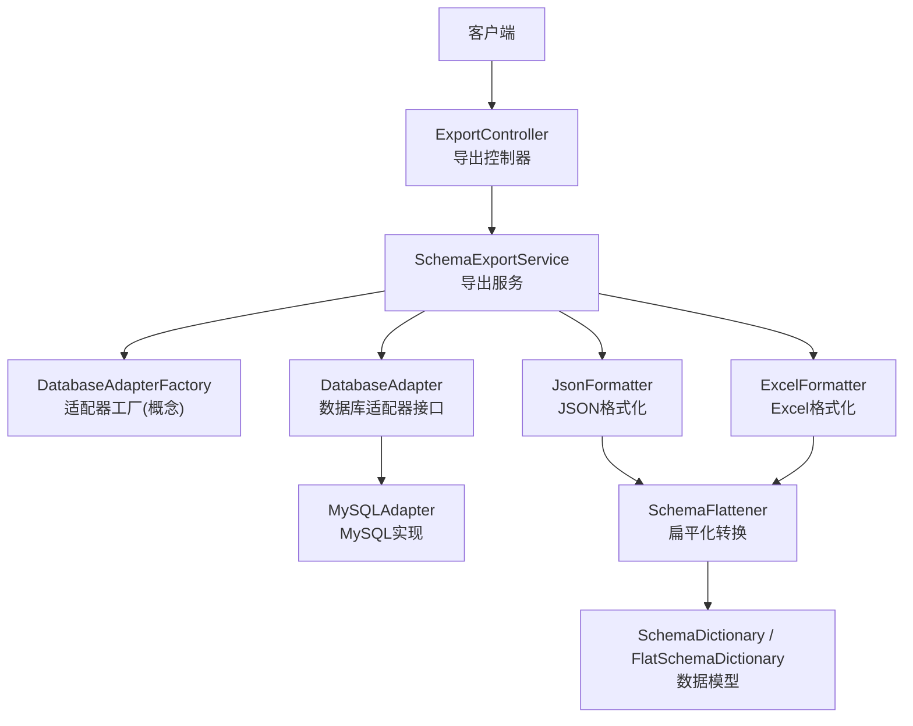
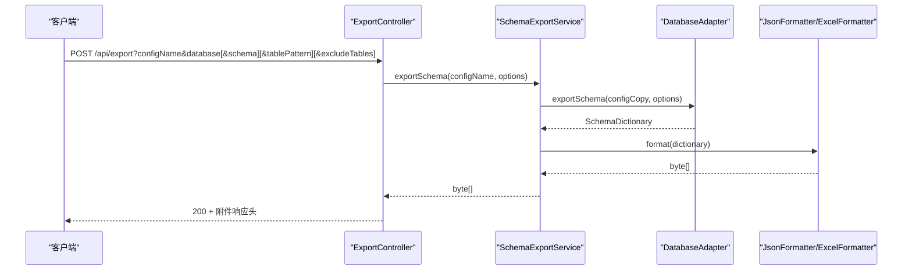
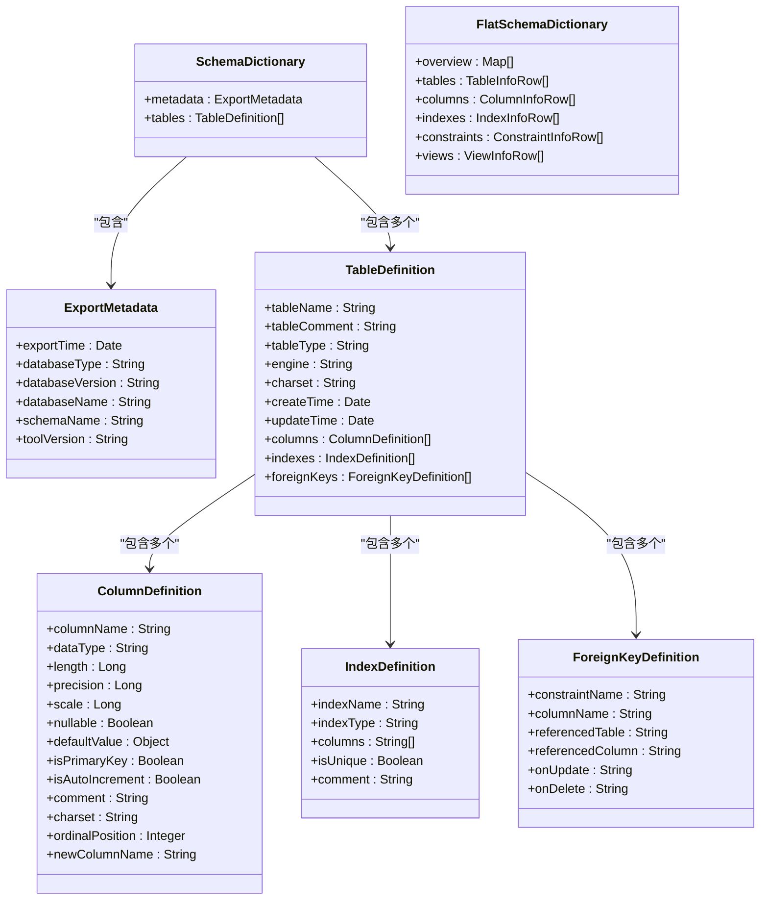
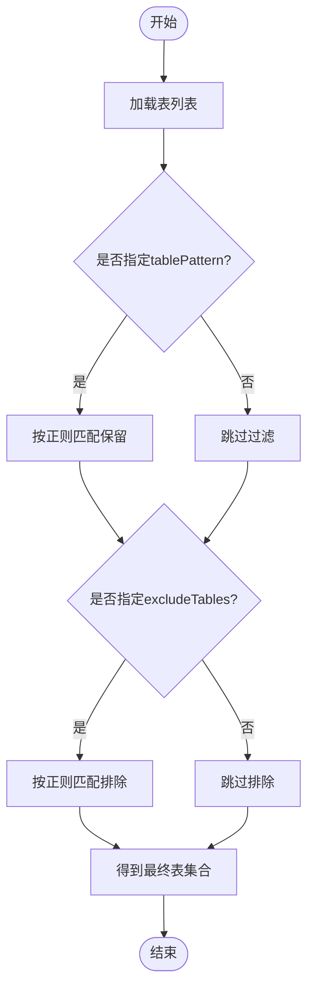
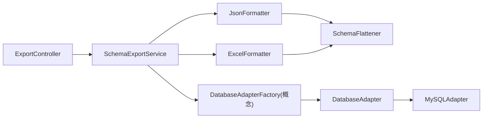

# 导出API

<cite>
**本文引用的文件**   
- [ExportController.java](file://schemasync-backend/src/main/java/com/schemasync/controller/ExportController.java)
- [SchemaExportService.java](file://schemasync-backend/src/main/java/com/schemasync/service/SchemaExportService.java)
- [ExportOptions.java](file://schemasync-backend/src/main/java/com/schemasync/adapter/ExportOptions.java)
- [DatabaseAdapter.java](file://schemasync-backend/src/main/java/com/schemasync/adapter/DatabaseAdapter.java)
- [MySQLAdapter.java](file://schemasync-backend/src/main/java/com/schemasync/adapter/MySQLAdapter.java)
- [JsonFormatter.java](file://schemasync-backend/src/main/java/com/schemasync/formatter/JsonFormatter.java)
- [ExcelFormatter.java](file://schemasync-backend/src/main/java/com/schemasync/formatter/ExcelFormatter.java)
- [SchemaDictionary.java](file://schemasync-backend/src/main/java/com/schemasync/model/dict/SchemaDictionary.java)
- [ExportMetadata.java](file://schemasync-backend/src/main/java/com/schemasync/model/dict/ExportMetadata.java)
- [TableDefinition.java](file://schemasync-backend/src/main/java/com/schemasync/model/dict/TableDefinition.java)
- [ColumnDefinition.java](file://schemasync-backend/src/main/java/com/schemasync/model/dict/ColumnDefinition.java)
- [IndexDefinition.java](file://schemasync-backend/src/main/java/com/schemasync/model/dict/IndexDefinition.java)
- [ForeignKeyDefinition.java](file://schemasync-backend/src/main/java/com/schemasync/model/dict/ForeignKeyDefinition.java)
- [FlatSchemaDictionary.java](file://schemasync-backend/src/main/java/com/schemasync/model/dict/FlatSchemaDictionary.java)
- [SchemaFlattener.java](file://schemasync-backend/src/main/java/com/schemasync/service/SchemaFlattener.java)
</cite>

## 目录
1. [简介](#简介)
2. [项目结构](#项目结构)
3. [核心组件](#核心组件)
4. [架构总览](#架构总览)
5. [详细组件分析](#详细组件分析)
6. [依赖关系分析](#依赖关系分析)
7. [性能考虑](#性能考虑)
8. [故障排查指南](#故障排查指南)
9. [结论](#结论)
10. [附录](#附录)

## 简介
本文件为数据字典导出API的完整技术文档，覆盖HTTP接口、参数规范、导出格式（JSON与Excel）、表过滤与排除规则、SCHEMA层级处理选项、进度监控、错误处理、性能优化建议、请求示例以及导出的数据结构定义。同时提供大数据库导出的最佳实践与分页处理策略建议。

## 项目结构
导出功能由控制器、服务、适配器、格式化器与模型共同组成：
- 控制器层：对外暴露REST接口，负责参数校验、响应头设置与文件下载
- 服务层：编排导出流程，管理配置解密、适配器选择、格式化输出
- 适配层：对接不同数据库类型，实现元数据采集与导出
- 格式化层：将内部数据模型序列化为JSON或Excel
- 模型层：描述导出数据结构与扁平化视图

图表来源
- [ExportController.java:32-99](file://schemasync-backend/src/main/java/com/schemasync/controller/ExportController.java#L32-L99)
- [SchemaExportService.java:46-111](file://schemasync-backend/src/main/java/com/schemasync/service/SchemaExportService.java#L46-L111)
- [DatabaseAdapter.java:17-133](file://schemasync-backend/src/main/java/com/schemasync/adapter/DatabaseAdapter.java#L17-L133)
- [MySQLAdapter.java:225-303](file://schemasync-backend/src/main/java/com/schemasync/adapter/MySQLAdapter.java#L225-L303)
- [JsonFormatter.java:44-53](file://schemasync-backend/src/main/java/com/schemasync/formatter/JsonFormatter.java#L44-L53)
- [ExcelFormatter.java:39-71](file://schemasync-backend/src/main/java/com/schemasync/formatter/ExcelFormatter.java#L39-L71)
- [SchemaFlattener.java:22-44](file://schemasync-backend/src/main/java/com/schemasync/service/SchemaFlattener.java#L22-L44)
- [SchemaDictionary.java:11-27](file://schemasync-backend/src/main/java/com/schemasync/model/dict/SchemaDictionary.java#L11-L27)
- [FlatSchemaDictionary.java:13-58](file://schemasync-backend/src/main/java/com/schemasync/model/dict/FlatSchemaDictionary.java#L13-L58)

章节来源
- [ExportController.java:32-99](file://schemasync-backend/src/main/java/com/schemasync/controller/ExportController.java#L32-L99)
- [SchemaExportService.java:46-111](file://schemasync-backend/src/main/java/com/schemasync/service/SchemaExportService.java#L46-L111)

## 核心组件
- 导出控制器：提供POST /api/export用于导出；GET /api/export/databases与GET /api/export/schemas用于枚举数据库与SCHEMA
- 导出服务：统一入口，负责配置加载、密码解密、适配器调用、格式化输出与耗时统计
- 导出选项：支持format、database、schema、tablePattern、excludeTables、includeIndexes、includeForeignKeys、includeViews等
- 数据库适配器：抽象出跨库能力，包含连接、元数据查询、完整导出等
- 格式化器：JSON与Excel两种输出方式；Excel采用六个工作表结构
- 数据模型：SchemaDictionary为嵌套结构，FlatSchemaDictionary为扁平化二维列表结构

章节来源
- [ExportController.java:48-99](file://schemasync-backend/src/main/java/com/schemasync/controller/ExportController.java#L48-L99)
- [ExportOptions.java:11-68](file://schemasync-backend/src/main/java/com/schemasync/adapter/ExportOptions.java#L11-L68)
- [DatabaseAdapter.java:17-133](file://schemasync-backend/src/main/java/com/schemasync/adapter/DatabaseAdapter.java#L17-L133)
- [JsonFormatter.java:44-53](file://schemasync-backend/src/main/java/com/schemasync/formatter/JsonFormatter.java#L44-L53)
- [ExcelFormatter.java:39-71](file://schemasync-backend/src/main/java/com/schemasync/formatter/ExcelFormatter.java#L39-L71)
- [SchemaDictionary.java:11-27](file://schemasync-backend/src/main/java/com/schemasync/model/dict/SchemaDictionary.java#L11-L27)
- [FlatSchemaDictionary.java:13-58](file://schemasync-backend/src/main/java/com/schemasync/model/dict/FlatSchemaDictionary.java#L13-L58)

## 架构总览
导出流程从控制器接收请求，进入服务层进行参数校验与配置准备，随后通过适配器完成数据库元数据采集，最后经格式化器生成目标文件并返回二进制流。

图表来源
- [ExportController.java:48-99](file://schemasync-backend/src/main/java/com/schemasync/controller/ExportController.java#L48-L99)
- [SchemaExportService.java:46-111](file://schemasync-backend/src/main/java/com/schemasync/service/SchemaExportService.java#L46-L111)
- [DatabaseAdapter.java:109-116](file://schemasync-backend/src/main/java/com/schemasync/adapter/DatabaseAdapter.java#L109-L116)
- [JsonFormatter.java:44-53](file://schemasync-backend/src/main/java/com/schemasync/formatter/JsonFormatter.java#L44-L53)
- [ExcelFormatter.java:39-71](file://schemasync-backend/src/main/java/com/schemasync/formatter/ExcelFormatter.java#L39-L71)

## 详细组件分析

### 导出接口定义
- HTTP方法：POST
- URL模式：/api/export
- 请求参数
  - configName：必填，字符串，数据源配置名称
  - database：必填，字符串，数据库名称
  - schema：可选，字符串，SCHEMA名称（仅支持SCHEMA的数据库）
  - tablePattern：可选，字符串，表名模式过滤（支持通配符*和?）
  - excludeTables：可选，字符串数组，排除的表名列表（支持通配符*和?）
- 响应
  - 成功：200，Content-Type为application/octet-stream，Content-Disposition为attachment，文件名含数据库名与时间戳
  - 失败：抛出异常，返回错误信息

章节来源
- [ExportController.java:48-99](file://schemasync-backend/src/main/java/com/schemasync/controller/ExportController.java#L48-L99)

### 辅助接口定义
- 获取数据库列表
  - 方法：GET
  - URL：/api/export/databases
  - 参数：configName（必填）
  - 返回：List<String>
- 获取SCHEMA列表
  - 方法：GET
  - URL：/api/export/schemas
  - 参数：configName（必填），database（必填）
  - 返回：List<String>
  - 注意：若数据库不支持SCHEMA，将抛出“此数据库类型不支持SCHEMA层级”

章节来源
- [ExportController.java:101-144](file://schemasync-backend/src/main/java/com/schemasync/controller/ExportController.java#L101-L144)
- [ExportController.java:146-201](file://schemasync-backend/src/main/java/com/schemasync/controller/ExportController.java#L146-L201)

### 导出选项与过滤规则
- 输出格式：json/excel（默认excel）
- SCHEMA层级：schema字段仅在supportsSchema()为true时生效
- 表过滤
  - tablePattern：按正则表达式匹配保留表（*替换为.*，?替换为.）
  - excludeTables：按正则表达式匹配排除表
- 元数据开关
  - includeIndexes：是否包含索引
  - includeForeignKeys：是否包含外键
  - includeViews：是否包含视图

章节来源
- [ExportOptions.java:11-68](file://schemasync-backend/src/main/java/com/schemasync/adapter/ExportOptions.java#L11-L68)
- [MySQLAdapter.java:347-365](file://schemasync-backend/src/main/java/com/schemasync/adapter/MySQLAdapter.java#L347-L365)

### 数据模型与导出结构
- 嵌套模型（SchemaDictionary）
  - metadata：导出元数据（数据库类型、版本、名称、实例名、导出时间、工具版本）
  - tables：表定义列表
- 表定义（TableDefinition）
  - 基本信息：表名、注释、类型、引擎、字符集、创建/更新时间
  - 关联集合：columns、indexes、foreignKeys
- 字段定义（ColumnDefinition）
  - 数据类型、长度、精度、小数位、可空、默认值、主键、自增、注释、字符集、位置、新字段名
- 索引定义（IndexDefinition）
  - 索引名、类型、字段列表、唯一性、备注
- 外键定义（ForeignKeyDefinition）
  - 约束名、字段名、引用表、引用字段、更新/删除级联规则
- 扁平化模型（FlatSchemaDictionary）
  - overview：概述信息（键值对）
  - tables：表级别行
  - columns：字段级别行（含表名）
  - indexes：索引级别行（含表名）
  - constraints：约束级别行（含表名）
  - views：视图定义行

图表来源
- [SchemaDictionary.java:11-27](file://schemasync-backend/src/main/java/com/schemasync/model/dict/SchemaDictionary.java#L11-L27)
- [ExportMetadata.java:13-58](file://schemasync-backend/src/main/java/com/schemasync/model/dict/ExportMetadata.java#L13-L58)
- [TableDefinition.java:14-88](file://schemasync-backend/src/main/java/com/schemasync/model/dict/TableDefinition.java#L14-L88)
- [ColumnDefinition.java:9-115](file://schemasync-backend/src/main/java/com/schemasync/model/dict/ColumnDefinition.java#L9-L115)
- [IndexDefinition.java:11-48](file://schemasync-backend/src/main/java/com/schemasync/model/dict/IndexDefinition.java#L11-L48)
- [ForeignKeyDefinition.java:9-53](file://schemasync-backend/src/main/java/com/schemasync/model/dict/ForeignKeyDefinition.java#L9-L53)
- [FlatSchemaDictionary.java:13-58](file://schemasync-backend/src/main/java/com/schemasync/model/dict/FlatSchemaDictionary.java#L13-L58)

### JSON导出结构说明
- 使用扁平化转换器将SchemaDictionary转为FlatSchemaDictionary后序列化
- 根节点包含六个二维列表：overview、tables、columns、indexes、constraints、views
- 日期字段以字符串形式输出（ISO风格）

章节来源
- [JsonFormatter.java:44-53](file://schemasync-backend/src/main/java/com/schemasync/formatter/JsonFormatter.java#L44-L53)
- [SchemaFlattener.java:22-44](file://schemasync-backend/src/main/java/com/schemasync/service/SchemaFlattener.java#L22-L44)
- [FlatSchemaDictionary.java:13-58](file://schemasync-backend/src/main/java/com/schemasync/model/dict/FlatSchemaDictionary.java#L13-L58)

### Excel导出结构说明
- 使用Apache POI生成XSSFWorkbook，包含六个Sheet：
  - 概述信息：键值对
  - 表级别信息：每表一行
  - 字段级别信息：每字段一行（含表名）
  - 索引信息：每索引一行（含表名）
  - 约束信息：每约束一行（含表名）
  - 视图定义：每视图一行
- 自动列宽与最小/最大宽度限制
- 特殊类型（TEXT/BLOB/JSON/空间类型/ENUM/SET）不显示长度与精度

章节来源
- [ExcelFormatter.java:39-71](file://schemasync-backend/src/main/java/com/schemasync/formatter/ExcelFormatter.java#L39-L71)
- [ExcelFormatter.java:76-103](file://schemasync-backend/src/main/java/com/schemasync/formatter/ExcelFormatter.java#L76-L103)
- [ExcelFormatter.java:108-137](file://schemasync-backend/src/main/java/com/schemasync/formatter/ExcelFormatter.java#L108-L137)
- [ExcelFormatter.java:142-203](file://schemasync-backend/src/main/java/com/schemasync/formatter/ExcelFormatter.java#L142-L203)
- [ExcelFormatter.java:208-233](file://schemasync-backend/src/main/java/com/schemasync/formatter/ExcelFormatter.java#L208-L233)
- [ExcelFormatter.java:238-265](file://schemasync-backend/src/main/java/com/schemasync/formatter/ExcelFormatter.java#L238-L265)
- [ExcelFormatter.java:270-293](file://schemasync-backend/src/main/java/com/schemasync/formatter/ExcelFormatter.java#L270-L293)
- [ExcelFormatter.java:351-362](file://schemasync-backend/src/main/java/com/schemasync/formatter/ExcelFormatter.java#L351-L362)
- [ExcelFormatter.java:371-406](file://schemasync-backend/src/main/java/com/schemasync/formatter/ExcelFormatter.java#L371-L406)

### 表过滤与排除算法
- 通配符转正则：*→.*，?→.
- 先按tablePattern保留，再按excludeTables排除
- 日志记录过滤前后数量变化

图表来源
- [MySQLAdapter.java:347-365](file://schemasync-backend/src/main/java/com/schemasync/adapter/MySQLAdapter.java#L347-L365)

章节来源
- [MySQLAdapter.java:347-365](file://schemasync-backend/src/main/java/com/schemasync/adapter/MySQLAdapter.java#L347-L365)

### SCHEMA层级处理
- supportsSchema()默认返回false（如MySQL）
- 当supportsSchema()为true时，可通过schema参数限定SCHEMA范围
- 获取SCHEMA列表接口会检查适配器是否支持SCHEMA，否则抛出异常

章节来源
- [DatabaseAdapter.java:46-63](file://schemasync-backend/src/main/java/com/schemasync/adapter/DatabaseAdapter.java#L46-L63)
- [ExportController.java:184-187](file://schemasync-backend/src/main/java/com/schemasync/controller/ExportController.java#L184-L187)

### 进度监控与日志
- 适配器在逐表导出过程中定期打印进度（每10张表或最后一张表）
- 服务层记录总体耗时、格式化耗时与文件大小
- 控制器记录生成的文件名与时间戳

章节来源
- [MySQLAdapter.java:281-287](file://schemasync-backend/src/main/java/com/schemasync/adapter/MySQLAdapter.java#L281-L287)
- [SchemaExportService.java:100-105](file://schemasync-backend/src/main/java/com/schemasync/service/SchemaExportService.java#L100-L105)
- [ExportController.java:89-90](file://schemasync-backend/src/main/java/com/schemasync/controller/ExportController.java#L89-L90)

### 错误处理
- 参数校验：缺失必填参数抛出非法参数异常
- 配置不存在：抛出运行时异常
- 密码解密失败：记录错误日志，继续尝试连接
- 数据库操作异常：包装为运行时异常并附带消息
- 格式化异常：包装为运行时异常

章节来源
- [ExportController.java:57-63](file://schemasync-backend/src/main/java/com/schemasync/controller/ExportController.java#L57-L63)
- [ExportController.java:112-115](file://schemasync-backend/src/main/java/com/schemasync/controller/ExportController.java#L112-L115)
- [ExportController.java:172-178](file://schemasync-backend/src/main/java/com/schemasync/controller/ExportController.java#L172-L178)
- [SchemaExportService.java:66-69](file://schemasync-backend/src/main/java/com/schemasync/service/SchemaExportService.java#L66-L69)
- [SchemaExportService.java:107-110](file://schemasync-backend/src/main/java/com/schemasync/service/SchemaExportService.java#L107-L110)
- [JsonFormatter.java:49-52](file://schemasync-backend/src/main/java/com/schemasync/formatter/JsonFormatter.java#L49-L52)
- [ExcelFormatter.java:67-70](file://schemasync-backend/src/main/java/com/schemasync/formatter/ExcelFormatter.java#L67-L70)

### 请求示例
- 导出为Excel（默认）
  - 方法：POST
  - URL：/api/export?configName=mydb&database=app_db
- 指定SCHEMA（适用于支持SCHEMA的数据库）
  - 方法：POST
  - URL：/api/export?configName=mydb&database=app_db&schema=public
- 按模式过滤表
  - 方法：POST
  - URL：/api/export?configName=mydb&database=app_db&tablePattern=user_*
- 排除特定表
  - 方法：POST
  - URL：/api/export?configName=mydb&database=app_db&excludeTables=audit_log%2Ctemp_%2A
- 导出为JSON
  - 方法：POST
  - URL：/api/export?configName=mydb&database=app_db&format=json
- 获取数据库列表
  - 方法：GET
  - URL：/api/export/databases?configName=mydb
- 获取SCHEMA列表
  - 方法：GET
  - URL：/api/export/schemas?configName=mydb&database=app_db

章节来源
- [ExportController.java:48-99](file://schemasync-backend/src/main/java/com/schemasync/controller/ExportController.java#L48-L99)
- [ExportController.java:101-144](file://schemasync-backend/src/main/java/com/schemasync/controller/ExportController.java#L101-L144)
- [ExportController.java:146-201](file://schemasync-backend/src/main/java/com/schemasync/controller/ExportController.java#L146-L201)

## 依赖关系分析
- 控制器依赖服务与适配器工厂
- 服务依赖配置服务、适配器工厂、JSON与Excel格式化器
- 格式化器依赖扁平化转换器
- 适配器实现具体数据库元数据采集逻辑

图表来源
- [ExportController.java:32-99](file://schemasync-backend/src/main/java/com/schemasync/controller/ExportController.java#L32-L99)
- [SchemaExportService.java:27-37](file://schemasync-backend/src/main/java/com/schemasync/service/SchemaExportService.java#L27-L37)
- [JsonFormatter.java:28-29](file://schemasync-backend/src/main/java/com/schemasync/formatter/JsonFormatter.java#L28-L29)
- [ExcelFormatter.java:30-31](file://schemasync-backend/src/main/java/com/schemasync/formatter/ExcelFormatter.java#L30-L31)
- [SchemaFlattener.java:16-17](file://schemasync-backend/src/main/java/com/schemasync/service/SchemaFlattener.java#L16-L17)
- [DatabaseAdapter.java:17-133](file://schemasync-backend/src/main/java/com/schemasync/adapter/DatabaseAdapter.java#L17-L133)
- [MySQLAdapter.java:24-26](file://schemasync-backend/src/main/java/com/schemasync/adapter/MySQLAdapter.java#L24-L26)

章节来源
- [ExportController.java:32-99](file://schemasync-backend/src/main/java/com/schemasync/controller/ExportController.java#L32-L99)
- [SchemaExportService.java:27-37](file://schemasync-backend/src/main/java/com/schemasync/service/SchemaExportService.java#L27-L37)

## 性能考虑
- 连接复用：通过连接池管理器获取连接，减少频繁建连开销
- 批量查询：优先使用INFORMATION_SCHEMA一次性拉取表、字段、索引、外键信息
- 选择性导出：通过includeIndexes/includeForeignKeys控制额外查询次数
- 过滤前置：先按tablePattern与excludeTables缩小表集合，降低后续查询量
- 进度日志：每10张表输出一次进度，便于监控大库导出
- 内存占用：Excel导出在内存中构建Workbook，大库场景需关注JVM堆大小
- 网络与时区：JDBC URL显式设置时区与编码，避免解析开销与乱码

章节来源
- [MySQLAdapter.java:59-61](file://schemasync-backend/src/main/java/com/schemasync/adapter/MySQLAdapter.java#L59-L61)
- [MySQLAdapter.java:244-259](file://schemasync-backend/src/main/java/com/schemasync/adapter/MySQLAdapter.java#L244-L259)
- [MySQLAdapter.java:281-287](file://schemasync-backend/src/main/java/com/schemasync/adapter/MySQLAdapter.java#L281-L287)
- [ExcelFormatter.java:39-71](file://schemasync-backend/src/main/java/com/schemasync/formatter/ExcelFormatter.java#L39-L71)

## 故障排查指南
- 参数缺失：检查configName与database是否为空
- 配置不存在：确认配置名称是否正确且已注册
- 密码解密失败：查看日志中的解密错误，确认密钥与密文格式
- 不支持SCHEMA：当调用获取SCHEMA列表时报错，说明当前数据库类型不支持SCHEMA
- 导出失败：查看服务层与适配器层的异常堆栈，定位具体SQL或IO问题
- JSON/Excel序列化失败：检查数据模型字段类型与格式化器配置

章节来源
- [ExportController.java:57-63](file://schemasync-backend/src/main/java/com/schemasync/controller/ExportController.java#L57-L63)
- [ExportController.java:112-115](file://schemasync-backend/src/main/java/com/schemasync/controller/ExportController.java#L112-L115)
- [ExportController.java:172-178](file://schemasync-backend/src/main/java/com/schemasync/controller/ExportController.java#L172-L178)
- [ExportController.java:184-187](file://schemasync-backend/src/main/java/com/schemasync/controller/ExportController.java#L184-L187)
- [SchemaExportService.java:107-110](file://schemasync-backend/src/main/java/com/schemasync/service/SchemaExportService.java#L107-L110)
- [JsonFormatter.java:49-52](file://schemasync-backend/src/main/java/com/schemasync/formatter/JsonFormatter.java#L49-L52)
- [ExcelFormatter.java:67-70](file://schemasync-backend/src/main/java/com/schemasync/formatter/ExcelFormatter.java#L67-L70)

## 结论
该导出API提供了统一的元数据导出能力，支持多数据库类型、灵活的表过滤与排除、SCHEMA层级控制，并提供JSON与Excel两种输出格式。通过适配器抽象与格式化器解耦，系统具备良好的扩展性与可维护性。针对大数据库导出，建议结合连接池、选择性导出与合理的JVM内存配置，以获得稳定高效的导出体验。

## 附录

### 大数据库导出最佳实践
- 合理设置JVM堆大小，避免OOM
- 优先使用tablePattern精确筛选目标表，减少扫描范围
- 关闭不必要的元数据导出（如索引、外键、视图）
- 分批次导出：按前缀或模块拆分多次调用
- 使用异步任务与进度回调（可在上层封装）
- 监控数据库负载，避开业务高峰时段

### 分页处理策略建议
- 当前实现未内置分页，建议在应用层按表名前缀分批调用
- 对于超大库，可将表集合切分为若干子集，串行或并行执行导出任务
- 合并结果：在服务层或外部调度器汇总各批次的导出文件