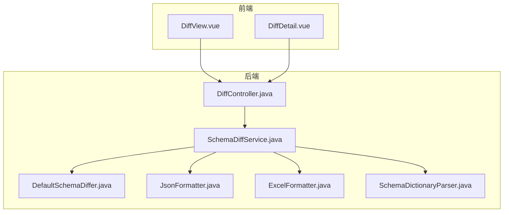
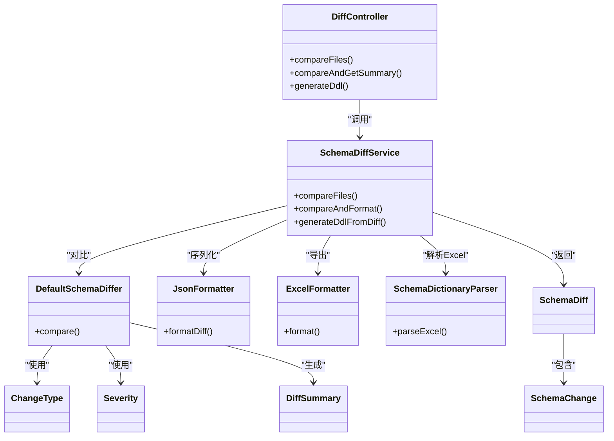

# 差异对比API

<cite>
**本文引用的文件**   
- [DiffController.java](file://schemasync-backend/src/main/java/com/schemasync/controller/DiffController.java)
- [SchemaDiffService.java](file://schemasync-backend/src/main/java/com/schemasync/service/SchemaDiffService.java)
- [DefaultSchemaDiffer.java](file://schemasync-backend/src/main/java/com/schemasync/differ/DefaultSchemaDiffer.java)
- [JsonFormatter.java](file://schemasync-backend/src/main/java/com/schemasync/formatter/JsonFormatter.java)
- [ExcelFormatter.java](file://schemasync-backend/src/main/java/com/schemasync/formatter/ExcelFormatter.java)
- [SchemaDictionaryParser.java](file://schemasync-backend/src/main/java/com/schemasync/service/SchemaDictionaryParser.java)
- [ChangeType.java](file://schemasync-backend/src/main/java/com/schemasync/model/diff/ChangeType.java)
- [Severity.java](file://schemasync-backend/src/main/java/com/schemasync/model/diff/Severity.java)
- [DiffSummary.java](file://schemasync-backend/src/main/java/com/schemasync/model/diff/DiffSummary.java)
- [SchemaDiff.java](file://schemasync-backend/src/main/java/com/schemasync/model/diff/SchemaDiff.java)
- [SchemaChange.java](file://schemasync-backend/src/main/java/com/schemasync/model/diff/SchemaChange.java)
- [DiffView.vue](file://schemasync-frontend/src/views/DiffView.vue)
- [DiffDetail.vue](file://schemasync-frontend/src/components/DiffDetail.vue)
</cite>

## 目录
1. [简介](#简介)
2. [项目结构](#项目结构)
3. [核心组件](#核心组件)
4. [架构总览](#架构总览)
5. [详细组件分析](#详细组件分析)
6. [依赖关系分析](#依赖关系分析)
7. [性能考虑](#性能考虑)
8. [故障排查指南](#故障排查指南)
9. [结论](#结论)
10. [附录](#附录)

## 简介
本文件面向“版本差异对比”能力，提供完整的接口说明、数据模型与结果结构定义、破坏性变更识别规则、批量与增量对比建议、客户端集成示例以及可视化展示建议。系统支持上传JSON或Excel格式的数据字典文件进行对比，返回结构化差异结果（包含变更类型、严重程度、差异统计等），并可导出为Excel或生成差异化DDL脚本。

## 项目结构
后端采用分层架构：控制器层暴露HTTP接口，服务层编排解析、对比与格式化流程，差异引擎负责具体比对逻辑，格式化器负责JSON/Excel输出，解析器负责从Excel反向构建内部模型。前端提供对比页面与详情展示组件。



图表来源
- [DiffController.java:1-108](file://schemasync-backend/src/main/java/com/schemasync/controller/DiffController.java#L1-L108)
- [SchemaDiffService.java:1-220](file://schemasync-backend/src/main/java/com/schemasync/service/SchemaDiffService.java#L1-L220)
- [DefaultSchemaDiffer.java:1-120](file://schemasync-backend/src/main/java/com/schemasync/differ/DefaultSchemaDiffer.java#L1-L120)
- [JsonFormatter.java:1-119](file://schemasync-backend/src/main/java/com/schemasync/formatter/JsonFormatter.java#L1-L119)
- [ExcelFormatter.java:1-120](file://schemasync-backend/src/main/java/com/schemasync/formatter/ExcelFormatter.java#L1-L120)
- [SchemaDictionaryParser.java:1-120](file://schemasync-backend/src/main/java/com/schemasync/service/SchemaDictionaryParser.java#L1-L120)
- [DiffView.vue:1-120](file://schemasync-frontend/src/views/DiffView.vue#L1-L120)
- [DiffDetail.vue:1-60](file://schemasync-frontend/src/components/DiffDetail.vue#L1-L60)

章节来源
- [DiffController.java:1-108](file://schemasync-backend/src/main/java/com/schemasync/controller/DiffController.java#L1-L108)
- [SchemaDiffService.java:1-220](file://schemasync-backend/src/main/java/com/schemasync/service/SchemaDiffService.java#L1-L220)

## 核心组件
- 控制器层
  - DiffController：对外暴露三个接口
    - POST /api/diff：上传两个文件并导出差异报告（默认Excel）
    - POST /api/diff/summary：上传两个文件并返回差异统计摘要（JSON）
    - POST /api/diff/ddl：基于对比结果生成差异化DDL脚本（SQL）
- 服务层
  - SchemaDiffService：统一编排解析、对比、格式化与DDL生成；支持JSON与Excel输入；支持按数据库类型生成DDL
- 差异引擎
  - DefaultSchemaDiffer：实现表、字段、索引、外键的对比，计算严重级别与统计信息
- 格式化与解析
  - JsonFormatter：差异对象序列化为JSON
  - ExcelFormatter：将数据字典导出为多Sheet的Excel
  - SchemaDictionaryParser：从Excel反向解析为内部SchemaDictionary
- 数据模型
  - ChangeType、Severity、DiffSummary、SchemaDiff、SchemaChange：描述变更类型、严重级别、统计与差异项

章节来源
- [DiffController.java:23-106](file://schemasync-backend/src/main/java/com/schemasync/controller/DiffController.java#L23-L106)
- [SchemaDiffService.java:77-220](file://schemasync-backend/src/main/java/com/schemasync/service/SchemaDiffService.java#L77-L220)
- [DefaultSchemaDiffer.java:24-120](file://schemasync-backend/src/main/java/com/schemasync/differ/DefaultSchemaDiffer.java#L24-L120)
- [JsonFormatter.java:95-118](file://schemasync-backend/src/main/java/com/schemasync/formatter/JsonFormatter.java#L95-L118)
- [ExcelFormatter.java:39-71](file://schemasync-backend/src/main/java/com/schemasync/formatter/ExcelFormatter.java#L39-L71)
- [SchemaDictionaryParser.java:42-81](file://schemasync-backend/src/main/java/com/schemasync/service/SchemaDictionaryParser.java#L42-L81)
- [ChangeType.java:1-43](file://schemasync-backend/src/main/java/com/schemasync/model/diff/ChangeType.java#L1-L43)
- [Severity.java:1-17](file://schemasync-backend/src/main/java/com/schemasync/model/diff/Severity.java#L1-L17)
- [DiffSummary.java:1-67](file://schemasync-backend/src/main/java/com/schemasync/model/diff/DiffSummary.java#L1-L67)
- [SchemaDiff.java:1-35](file://schemasync-backend/src/main/java/com/schemasync/model/diff/SchemaDiff.java#L1-L35)
- [SchemaChange.java:1-181](file://schemasync-backend/src/main/java/com/schemasync/model/diff/SchemaChange.java#L1-L181)

## 架构总览
下图展示了从前端发起请求到后端处理、对比、格式化与响应的完整调用链。

```mermaid
sequenceDiagram
participant FE as "前端(DiffView.vue)"
participant API as "DiffController"
participant SVC as "SchemaDiffService"
participant DIFF as "DefaultSchemaDiffer"
participant FMT as "JsonFormatter/ExcelFormatter"
participant PAR as "SchemaDictionaryParser"
FE->>API : "POST /api/diff/summary (oldFile, newFile)"
API->>SVC : "compareFiles(oldFile, newFile)"
SVC->>PAR : "parseFile(根据后缀选择JSON或Excel)"
PAR-->>SVC : "SchemaDictionary"
SVC->>DIFF : "compare(oldDict, newDict)"
DIFF-->>SVC : "SchemaDiff"
SVC-->>API : "SchemaDiff"
API-->>FE : "JSON响应(SchemaDiff)"
FE->>API : "POST /api/diff (exportFormat=excel/json)"
API->>SVC : "compareAndFormat(...)"
SVC->>FMT : "formatDiff(diff, format[, newDict])"
FMT-->>API : "字节数组"
API-->>FE : "下载文件(.xlsx/.json)"
FE->>API : "POST /api/diff/ddl (databaseType)"
API->>SVC : "generateDdlFromDiff(...)"
SVC->>DIFF : "compare(...)"
SVC->>FMT : "生成DDL(按数据库类型)"
FMT-->>API : "SQL字节数组"
API-->>FE : "下载.sql"
```

图表来源
- [DiffController.java:31-106](file://schemasync-backend/src/main/java/com/schemasync/controller/DiffController.java#L31-L106)
- [SchemaDiffService.java:77-220](file://schemasync-backend/src/main/java/com/schemasync/service/SchemaDiffService.java#L77-L220)
- [DefaultSchemaDiffer.java:24-52](file://schemasync-backend/src/main/java/com/schemasync/differ/DefaultSchemaDiffer.java#L24-L52)
- [JsonFormatter.java:95-118](file://schemasync-backend/src/main/java/com/schemasync/formatter/JsonFormatter.java#L95-L118)
- [ExcelFormatter.java:39-71](file://schemasync-backend/src/main/java/com/schemasync/formatter/ExcelFormatter.java#L39-L71)
- [SchemaDictionaryParser.java:42-81](file://schemasync-backend/src/main/java/com/schemasync/service/SchemaDictionaryParser.java#L42-L81)

## 详细组件分析

### 接口规范与使用方式
- 基础路径：/api/diff
- 公共参数
  - oldFile：旧版本数据字典文件（支持 .json、.xlsx、.xls）
  - newFile：新版本数据字典文件（支持 .json、.xlsx、.xls）
- 接口列表
  - POST /api/diff
    - 功能：对比并导出差异报告
    - 参数：oldFile, newFile, exportFormat（可选，默认excel）
    - 返回：二进制文件流（.xlsx 或 .json），文件名带时间戳
  - POST /api/diff/summary
    - 功能：对比并返回差异统计摘要（JSON）
    - 参数：oldFile, newFile
    - 返回：SchemaDiff（含diffMetadata、summary、changes）
  - POST /api/diff/ddl
    - 功能：基于对比结果生成差异化DDL脚本
    - 参数：oldFile, newFile, databaseType（可选，默认mysql；支持gaussdb_mysql、gaussdb_oracle）
    - 返回：二进制SQL文件流（.sql）

章节来源
- [DiffController.java:31-106](file://schemasync-backend/src/main/java/com/schemasync/controller/DiffController.java#L31-L106)
- [SchemaDiffService.java:114-220](file://schemasync-backend/src/main/java/com/schemasync/service/SchemaDiffService.java#L114-L220)

### 输入文件格式要求

#### JSON数据字典
- 由系统导出的扁平化结构，可直接用于对比
- 反序列化入口：JsonFormatter.parse(byte[])
- 注意：确保字段名与SchemaDictionary一致，避免缺失必要节点导致解析失败

章节来源
- [JsonFormatter.java:55-68](file://schemasync-backend/src/main/java/com/schemasync/formatter/JsonFormatter.java#L55-L68)

#### Excel数据字典
- 标准导出包含六个Sheet：概述信息、表级别信息、字段级别信息、索引信息、约束信息、视图定义
- 解析入口：SchemaDictionaryParser.parseExcel(InputStream)
- 关键字段约定
  - 字段级别信息：长度/精度列需符合数值型；布尔列以“是/否”表示；新字段名列可留空
  - 索引信息：columns列以逗号分隔字段名
  - 约束信息：仅FK参与对比；级联规则字符串解析存在容错
- 若自定义Excel，请严格遵循上述列顺序与命名

章节来源
- [ExcelFormatter.java:39-71](file://schemasync-backend/src/main/java/com/schemasync/formatter/ExcelFormatter.java#L39-L71)
- [SchemaDictionaryParser.java:42-81](file://schemasync-backend/src/main/java/com/schemasync/service/SchemaDictionaryParser.java#L42-L81)
- [SchemaDictionaryParser.java:115-298](file://schemasync-backend/src/main/java/com/schemasync/service/SchemaDictionaryParser.java#L115-L298)

### 差异结果结构与核心概念
- SchemaDiff
  - diffMetadata：元数据（生成时间、工具版本等）
  - summary：DiffSummary统计
  - changes：List<SchemaChange>变更明细
- SchemaChange
  - changeType：变更类型（见ChangeType枚举）
  - tableName：表名
  - columnName：字段名（字段级变更时）
  - severity：严重程度（BREAKING/NON_BREAKING）
  - details：变更详情（字符串或对象）
  - 其他：old/new数据类型、长度、精度、注释等
- ChangeType（变更类型）
  - 表级：TABLE_ADD、TABLE_DROP、TABLE_MODIFY
  - 字段级：COLUMN_ADD、COLUMN_DROP、COLUMN_MODIFY
  - 索引级：INDEX_ADD、INDEX_DROP、INDEX_MODIFY
  - 外键级：FOREIGN_KEY_ADD、FOREIGN_KEY_DROP、FOREIGN_KEY_MODIFY
- Severity（严重程度）
  - BREAKING：破坏性变更
  - NON_BREAKING：非破坏性变更
- DiffSummary（差异统计）
  - 新增/删除/修改的表、字段、索引、外键数量
  - breakingChanges：破坏性变更总数

章节来源
- [SchemaDiff.java:1-35](file://schemasync-backend/src/main/java/com/schemasync/model/diff/SchemaDiff.java#L1-L35)
- [SchemaChange.java:1-181](file://schemasync-backend/src/main/java/com/schemasync/model/diff/SchemaChange.java#L1-L181)
- [ChangeType.java:1-43](file://schemasync-backend/src/main/java/com/schemasync/model/diff/ChangeType.java#L1-L43)
- [Severity.java:1-17](file://schemasync-backend/src/main/java/com/schemasync/model/diff/Severity.java#L1-L17)
- [DiffSummary.java:1-67](file://schemasync-backend/src/main/java/com/schemasync/model/diff/DiffSummary.java#L1-L67)

### 破坏性变更识别规则与风险评估
- 表级
  - TABLE_DROP：标记为BREAKING
- 字段级
  - COLUMN_DROP：BREAKING
  - COLUMN_MODIFY中以下情况提升为BREAKING：
    - 数据类型变化
    - 长度缩小
    - 精度/小数位缩小
    - 新增NOT NULL约束（nullable由true变为false）
- 索引级
  - INDEX_DROP/MODIFY：当前实现为非破坏性（NON_BREAKING）
- 外键级
  - ADD/DROP/MODIFY：当前实现为非破坏性（NON_BREAKING）
- 统计
  - DiffSummary.breakingChanges汇总所有BREAKING变更数量

章节来源
- [DefaultSchemaDiffer.java:88-100](file://schemasync-backend/src/main/java/com/schemasync/differ/DefaultSchemaDiffer.java#L88-L100)
- [DefaultSchemaDiffer.java:182-214](file://schemasync-backend/src/main/java/com/schemasync/differ/DefaultSchemaDiffer.java#L182-L214)
- [DefaultSchemaDiffer.java:219-316](file://schemasync-backend/src/main/java/com/schemasync/differ/DefaultSchemaDiffer.java#L219-L316)
- [DefaultSchemaDiffer.java:321-389](file://schemasync-backend/src/main/java/com/schemasync/differ/DefaultSchemaDiffer.java#L321-L389)
- [DefaultSchemaDiffer.java:394-428](file://schemasync-backend/src/main/java/com/schemasync/differ/DefaultSchemaDiffer.java#L394-L428)
- [DefaultSchemaDiffer.java:433-455](file://schemasync-backend/src/main/java/com/schemasync/differ/DefaultSchemaDiffer.java#L433-L455)

### 差异结果示例（结构示意）
以下为典型JSON响应结构的字段说明（不展示具体值）：
- diffMetadata
  - generatedTime：生成时间
  - toolVersion：工具版本
- summary
  - tablesAdded/tablesDropped/tablesModified
  - columnsAdded/columnsDropped/columnsModified
  - indexesAdded/indexesDropped
  - foreignKeysAdded/foreignKeysDropped
  - breakingChanges
- changes
  - 元素为SchemaChange，包含changeType、tableName、columnName、severity、details及新旧属性字段

章节来源
- [SchemaDiff.java:1-35](file://schemasync-backend/src/main/java/com/schemasync/model/diff/SchemaDiff.java#L1-L35)
- [DiffSummary.java:1-67](file://schemasync-backend/src/main/java/com/schemasync/model/diff/DiffSummary.java#L1-L67)
- [SchemaChange.java:1-181](file://schemasync-backend/src/main/java/com/schemasync/model/diff/SchemaChange.java#L1-L181)

### 变更场景与表示方式
- 表结构变更
  - 新增表：changeType=TABLE_ADD，severity=NON_BREAKING，details包含表注释、字段数、索引数等
  - 删除表：changeType=TABLE_DROP，severity=BREAKING，details包含表注释
  - 修改表：changeType=TABLE_MODIFY（当前未自动合并表级属性变更，主要用于占位）
- 字段修改
  - 新增字段：changeType=COLUMN_ADD，severity=NON_BREAKING，包含新字段数据类型、长度、精度、注释等
  - 删除字段：changeType=COLUMN_DROP，severity=BREAKING，包含旧字段定义
  - 修改字段：changeType=COLUMN_MODIFY，severity依据规则判定，details为多条变化的拼接字符串，同时携带新旧属性字段
- 索引变化
  - 新增索引：changeType=INDEX_ADD，severity=NON_BREAKING，details为IndexDefinition对象
  - 删除索引：changeType=INDEX_DROP，severity=NON_BREAKING，details为IndexDefinition对象
  - 修改索引：changeType=INDEX_MODIFY，severity=NON_BREAKING，details为Map，包含indexName、oldValue、newValue

章节来源
- [DefaultSchemaDiffer.java:69-112](file://schemasync-backend/src/main/java/com/schemasync/differ/DefaultSchemaDiffer.java#L69-L112)
- [DefaultSchemaDiffer.java:150-214](file://schemasync-backend/src/main/java/com/schemasync/differ/DefaultSchemaDiffer.java#L150-L214)
- [DefaultSchemaDiffer.java:219-316](file://schemasync-backend/src/main/java/com/schemasync/differ/DefaultSchemaDiffer.java#L219-L316)
- [DefaultSchemaDiffer.java:321-389](file://schemasync-backend/src/main/java/com/schemasync/differ/DefaultSchemaDiffer.java#L321-L389)

### 差异化DDL生成
- 支持MySQL与GaussDB（MySQL兼容/Oracle兼容）三种风格
- 针对常见变更自动生成对应语句：
  - 新增表：CREATE TABLE/VIEW
  - 新增字段：ALTER TABLE ... ADD COLUMN
  - 修改字段：ALTER TABLE ... MODIFY COLUMN
  - 索引变更：DROP/CREATE INDEX（修改索引先删后建）
- 删除类操作默认注释提示，需人工确认后执行

章节来源
- [SchemaDiffService.java:203-278](file://schemasync-backend/src/main/java/com/schemasync/service/SchemaDiffService.java#L203-L278)
- [SchemaDiffService.java:288-452](file://schemasync-backend/src/main/java/com/schemasync/service/SchemaDiffService.java#L288-L452)
- [SchemaDiffService.java:457-546](file://schemasync-backend/src/main/java/com/schemasync/service/SchemaDiffService.java#L457-L546)

### 客户端集成示例（前端）
- 对比摘要
  - 使用FormData上传oldFile与newFile至/api/diff/summary，解析返回的JSON为SchemaDiff
- 下载差异报告
  - 调用/api/diff，设置exportFormat=excel，接收Blob并触发下载
- 生成DDL
  - 调用/api/diff/ddl，传入databaseType，接收SQL Blob并下载

章节来源
- [DiffView.vue:132-257](file://schemasync-frontend/src/views/DiffView.vue#L132-L257)

### 差异结果的可视化展示建议
- 概览面板
  - 使用Descriptions展示summary各计数，突出breakingChanges
- 明细表格
  - 按表分组折叠展示，列包括：变更类型、字段名、严重级别、详情
  - 变更类型映射标签颜色：新增=成功色，删除=危险色，修改=警告色
  - 严重级别：BREAKING=危险，NON_BREAKING=成功
- 详情渲染
  - details为字符串直接显示；为对象则展平为键值对

章节来源
- [DiffView.vue:56-93](file://schemasync-frontend/src/views/DiffView.vue#L56-L93)
- [DiffDetail.vue:12-53](file://schemasync-frontend/src/components/DiffDetail.vue#L12-L53)
- [DiffDetail.vue:87-117](file://schemasync-frontend/src/components/DiffDetail.vue#L87-L117)

## 依赖关系分析
- 控制器依赖服务层，服务层组合解析器、差异引擎与格式化器
- 差异引擎依赖数据模型枚举与定义
- 前端通过REST调用控制器，渲染差异结果



图表来源
- [DiffController.java:23-106](file://schemasync-backend/src/main/java/com/schemasync/controller/DiffController.java#L23-L106)
- [SchemaDiffService.java:77-220](file://schemasync-backend/src/main/java/com/schemasync/service/SchemaDiffService.java#L77-L220)
- [DefaultSchemaDiffer.java:24-120](file://schemasync-backend/src/main/java/com/schemasync/differ/DefaultSchemaDiffer.java#L24-L120)
- [JsonFormatter.java:95-118](file://schemasync-backend/src/main/java/com/schemasync/formatter/JsonFormatter.java#L95-L118)
- [ExcelFormatter.java:39-71](file://schemasync-backend/src/main/java/com/schemasync/formatter/ExcelFormatter.java#L39-L71)
- [SchemaDictionaryParser.java:42-81](file://schemasync-backend/src/main/java/com/schemasync/service/SchemaDictionaryParser.java#L42-L81)
- [ChangeType.java:1-43](file://schemasync-backend/src/main/java/com/schemasync/model/diff/ChangeType.java#L1-L43)
- [Severity.java:1-17](file://schemasync-backend/src/main/java/com/schemasync/model/diff/Severity.java#L1-L17)
- [DiffSummary.java:1-67](file://schemasync-backend/src/main/java/com/schemasync/model/diff/DiffSummary.java#L1-L67)
- [SchemaDiff.java:1-35](file://schemasync-backend/src/main/java/com/schemasync/model/diff/SchemaDiff.java#L1-L35)
- [SchemaChange.java:1-181](file://schemasync-backend/src/main/java/com/schemasync/model/diff/SchemaChange.java#L1-L181)

## 性能考虑
- 文件解析
  - Excel解析涉及多Sheet遍历与日期/数值转换，建议在服务端限制文件大小与超时
- 对比算法
  - 主要复杂度与表、字段、索引、外键规模线性相关；大数据量时可考虑分页或分批对比
- 输出格式化
  - Excel导出使用POI内存构建工作簿，大结果集可能占用较多内存；必要时可改为流式写入或分片导出
- DDL生成
  - 按变更粒度生成语句，避免全量重建；对删除类操作默认注释，减少误执行风险

[本节为通用指导，无需源码引用]

## 故障排查指南
- 文件为空或未上传
  - 控制器在参数校验失败时抛出运行时异常，前端应捕获并提示用户重新选择
- 解析失败
  - Excel列缺失或类型不符可能导致解析异常；检查Sheet名称与列顺序
- 对比失败
  - 差异引擎抛出的异常会被服务层包装为运行时异常；查看日志定位具体阶段
- 导出失败
  - 检查导出格式参数与响应头Content-Disposition是否正确设置

章节来源
- [DiffController.java:38-41](file://schemasync-backend/src/main/java/com/schemasync/controller/DiffController.java#L38-L41)
- [SchemaDiffService.java:97-103](file://schemasync-backend/src/main/java/com/schemasync/service/SchemaDiffService.java#L97-L103)
- [SchemaDiffService.java:138-144](file://schemasync-backend/src/main/java/com/schemasync/service/SchemaDiffService.java#L138-L144)

## 结论
该差异对比API提供了端到端的版本对比能力，涵盖输入解析、差异计算、结果统计、可视化与DDL生成。破坏性变更识别规则清晰，便于自动化审批与风险控制。结合前端的概览与明细展示，可有效支撑数据库结构演进过程中的变更评估与落地。

[本节为总结，无需源码引用]

## 附录

### 批量对比与增量对比建议
- 批量对比
  - 将多个版本的字典文件打包为ZIP上传，服务端循环对比并聚合结果；注意控制并发与内存占用
- 增量对比
  - 基于上次对比结果缓存，仅对比新增/变更的表或字段；可通过DiffSummary.breakingChanges快速判断是否阻断发布

[本节为通用建议，无需源码引用]