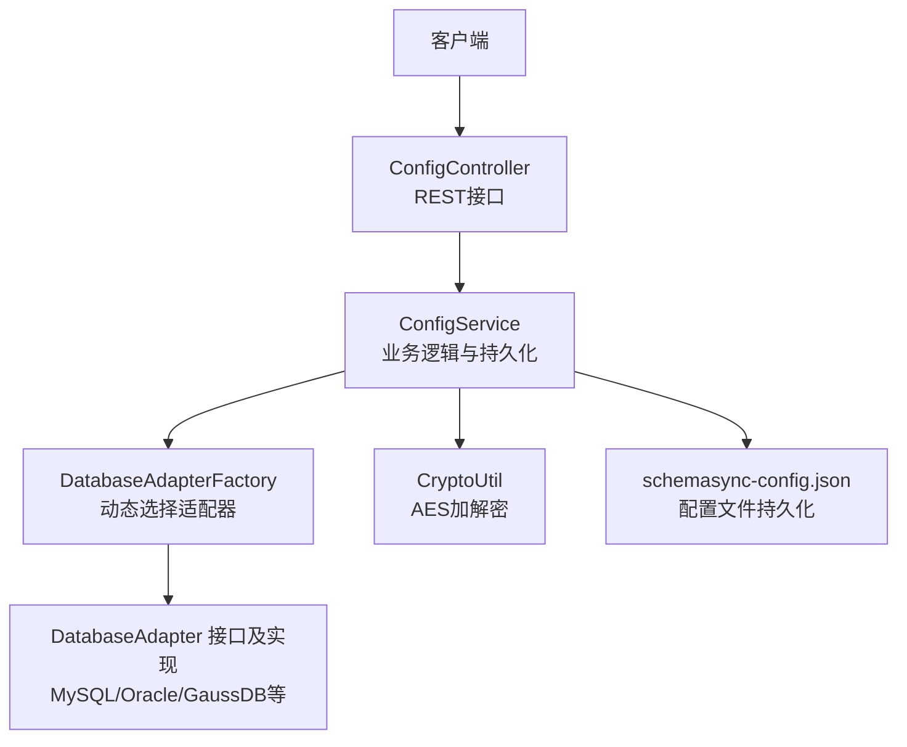
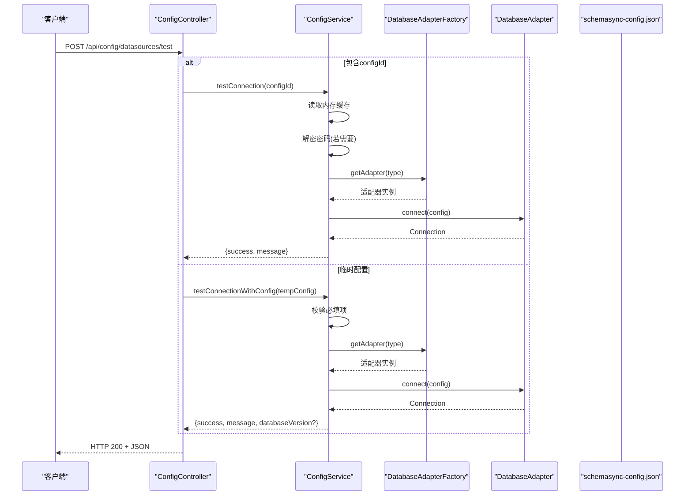
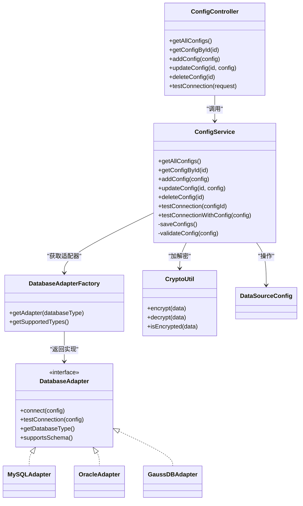

# 配置管理API

<cite>
**本文引用的文件列表**
- [ConfigController.java](file://schemasync-backend/src/main/java/com/schemasync/controller/ConfigController.java)
- [ConfigService.java](file://schemasync-backend/src/main/java/com/schemasync/service/ConfigService.java)
- [DataSourceConfig.java](file://schemasync-backend/src/main/java/com/schemasync/model/config/DataSourceConfig.java)
- [CryptoUtil.java](file://schemasync-backend/src/main/java/com/schemasync/util/CryptoUtil.java)
- [DatabaseAdapterFactory.java](file://schemasync-backend/src/main/java/com/schemasync/adapter/DatabaseAdapterFactory.java)
- [DatabaseAdapter.java](file://schemasync-backend/src/main/java/com/schemasync/adapter/DatabaseAdapter.java)
- [MySQLAdapter.java](file://schemasync-backend/src/main/java/com/schemasync/adapter/MySQLAdapter.java)
- [OracleAdapter.java](file://schemasync-backend/src/main/java/com/schemasync/adapter/OracleAdapter.java)
- [GaussDBAdapter.java](file://schemasync-backend/src/main/java/com/schemasync/adapter/GaussDBAdapter.java)
- [application.yml](file://schemasync-backend/src/main/resources/application.yml)
- [schemasync-config.json](file://schemasync-backend/src/main/resources/schemasync-config.json)
</cite>

## 目录
1. [简介](#简介)
2. [项目结构](#项目结构)
3. [核心组件](#核心组件)
4. [架构总览](#架构总览)
5. [详细接口说明](#详细接口说明)
6. [依赖关系分析](#依赖关系分析)
7. [性能与连接池配置](#性能与连接池配置)
8. [故障排查指南](#故障排查指南)
9. [结论](#结论)

## 简介
本文件为数据源配置管理的RESTful API文档，覆盖以下能力：
- 获取所有数据源配置
- 根据ID获取配置
- 新增配置
- 更新配置
- 删除配置
- 测试连接（支持两种模式：使用已保存配置、使用临时配置）

同时提供：
- DataSourceConfig对象的完整字段说明
- 支持的数据源类型列表
- 密码加密机制说明
- 连接池配置选项说明
- 请求/响应示例与错误码说明

## 项目结构
后端采用分层架构：控制器层暴露REST接口，服务层处理业务逻辑与持久化，适配器层对接不同数据库实现。配置以JSON文件形式持久化，启动时加载到内存缓存中。

图表来源
- [ConfigController.java:22-84](file://schemasync-backend/src/main/java/com/schemasync/controller/ConfigController.java#L22-L84)
- [ConfigService.java:26-101](file://schemasync-backend/src/main/java/com/schemasync/service/ConfigService.java#L26-L101)
- [DatabaseAdapterFactory.java:19-63](file://schemasync-backend/src/main/java/com/schemasync/adapter/DatabaseAdapterFactory.java#L19-L63)
- [DatabaseAdapter.java:17-133](file://schemasync-backend/src/main/java/com/schemasync/adapter/DatabaseAdapter.java#L17-L133)
- [CryptoUtil.java:16-83](file://schemasync-backend/src/main/java/com/schemasync/util/CryptoUtil.java#L16-L83)
- [schemasync-config.json:1-25](file://schemasync-backend/src/main/resources/schemasync-config.json#L1-L25)

章节来源
- [ConfigController.java:1-133](file://schemasync-backend/src/main/java/com/schemasync/controller/ConfigController.java#L1-L133)
- [ConfigService.java:1-383](file://schemasync-backend/src/main/java/com/schemasync/service/ConfigService.java#L1-L383)
- [DatabaseAdapterFactory.java:1-64](file://schemasync-backend/src/main/java/com/schemasync/adapter/DatabaseAdapterFactory.java#L1-L64)
- [DatabaseAdapter.java:1-134](file://schemasync-backend/src/main/java/com/schemasync/adapter/DatabaseAdapter.java#L1-L134)
- [CryptoUtil.java:1-84](file://schemasync-backend/src/main/java/com/schemasync/util/CryptoUtil.java#L1-L84)
- [schemasync-config.json:1-25](file://schemasync-backend/src/main/resources/schemasync-config.json#L1-L25)

## 核心组件
- ConfigController：定义REST端点，负责参数解析与结果封装。
- ConfigService：维护内存中的配置缓存，读写JSON配置文件，执行校验、加密、连接测试等。
- DatabaseAdapterFactory：注册并分发具体数据库适配器。
- DatabaseAdapter及其实现：针对不同数据库的连接与元数据访问。
- CryptoUtil：对敏感字段（如密码）进行AES加解密。
- DataSourceConfig：配置对象模型。

章节来源
- [ConfigController.java:22-84](file://schemasync-backend/src/main/java/com/schemasync/controller/ConfigController.java#L22-L84)
- [ConfigService.java:26-101](file://schemasync-backend/src/main/java/com/schemasync/service/ConfigService.java#L26-L101)
- [DatabaseAdapterFactory.java:19-63](file://schemasync-backend/src/main/java/com/schemasync/adapter/DatabaseAdapterFactory.java#L19-L63)
- [DatabaseAdapter.java:17-133](file://schemasync-backend/src/main/java/com/schemasync/adapter/DatabaseAdapter.java#L17-L133)
- [CryptoUtil.java:16-83](file://schemasync-backend/src/main/java/com/schemasync/util/CryptoUtil.java#L16-L83)
- [DataSourceConfig.java:13-128](file://schemasync-backend/src/main/java/com/schemasync/model/config/DataSourceConfig.java#L13-L128)

## 架构总览
配置管理API的核心流程如下：
- 读取/写入：服务层从JSON文件加载配置到内存Map；增删改后写回文件。
- 连接测试：根据传入的configId或临时配置，构造适配器并尝试建立连接，返回成功与否及可选的数据库版本信息。
- 安全：密码在新增/更新时自动加密存储；测试连接前按需解密。

图表来源
- [ConfigController.java:86-131](file://schemasync-backend/src/main/java/com/schemasync/controller/ConfigController.java#L86-L131)
- [ConfigService.java:221-271](file://schemasync-backend/src/main/java/com/schemasync/service/ConfigService.java#L221-L271)
- [DatabaseAdapterFactory.java:45-62](file://schemasync-backend/src/main/java/com/schemasync/adapter/DatabaseAdapterFactory.java#L45-L62)
- [DatabaseAdapter.java:26-34](file://schemasync-backend/src/main/java/com/schemasync/adapter/DatabaseAdapter.java#L26-L34)
- [schemasync-config.json:1-25](file://schemasync-backend/src/main/resources/schemasync-config.json#L1-L25)

## 详细接口说明

### 通用约定
- 基础路径：/api/config
- 内容类型：application/json
- 时间格式：yyyy-MM-dd HH:mm:ss（由Jackson配置控制）
- 统一HTTP状态码：
  - 200：成功
  - 404：资源不存在（仅“根据ID获取”）
  - 4xx/5xx：参数错误或服务器异常（见各接口说明）

章节来源
- [application.yml:11-16](file://schemasync-backend/src/main/resources/application.yml#L11-L16)

---

### 获取所有数据源配置
- 方法：GET
- 路径：/api/config/datasources
- 请求体：无
- 响应体：数组，元素为DataSourceConfig对象
- 特殊行为：
  - 每个配置会附加supportsSchema字段，表示是否支持SCHEMA层级（由适配器动态设置）。
- 错误码：
  - 200：成功
  - 500：内部异常（例如适配器初始化失败）

章节来源
- [ConfigController.java:33-51](file://schemasync-backend/src/main/java/com/schemasync/controller/ConfigController.java#L33-L51)
- [DatabaseAdapter.java:49-52](file://schemasync-backend/src/main/java/com/schemasync/adapter/DatabaseAdapter.java#L49-L52)

---

### 根据ID获取配置
- 方法：GET
- 路径：/api/config/datasources/{id}
- 路径参数：
  - id：字符串
- 响应体：DataSourceConfig对象
- 错误码：
  - 200：成功
  - 404：未找到对应ID的配置

章节来源
- [ConfigController.java:53-61](file://schemasync-backend/src/main/java/com/schemasync/controller/ConfigController.java#L53-L61)

---

### 新增配置
- 方法：POST
- 路径：/api/config/datasources
- 请求体：DataSourceConfig对象
- 服务端处理要点：
  - 必填校验：name、type、host、username不能为空。
  - 默认值：port=3306，timeout=30，charset=utf8mb4。
  - ID生成：若未提供，自动生成ds-xxxxxxxx格式。
  - 密码加密：若password非空且未加密，则进行AES加密后存储。
  - 创建/更新时间戳：自动填充。
  - 持久化：保存到JSON配置文件。
- 响应体：创建的DataSourceConfig对象
- 错误码：
  - 200：成功
  - 400：参数校验失败（非法参数异常）
  - 500：保存失败（IO或序列化异常）

章节来源
- [ConfigController.java:63-68](file://schemasync-backend/src/main/java/com/schemasync/controller/ConfigController.java#L63-L68)
- [ConfigService.java:133-180](file://schemasync-backend/src/main/java/com/schemasync/service/ConfigService.java#L133-L180)
- [CryptoUtil.java:37-48](file://schemasync-backend/src/main/java/com/schemasync/util/CryptoUtil.java#L37-L48)

---

### 更新配置
- 方法：PUT
- 路径：/api/config/datasources/{id}
- 路径参数：
  - id：字符串
- 请求体：DataSourceConfig对象
- 服务端处理要点：
  - 若目标ID不存在，抛出运行时异常。
  - 保留原createTime，更新updateTime。
  - 若password非空且未加密，则进行AES加密。
  - 持久化：保存到JSON配置文件。
- 响应体：更新后的DataSourceConfig对象
- 错误码：
  - 200：成功
  - 404：配置不存在
  - 500：保存失败

章节来源
- [ConfigController.java:70-77](file://schemasync-backend/src/main/java/com/schemasync/controller/ConfigController.java#L70-L77)
- [ConfigService.java:185-205](file://schemasync-backend/src/main/java/com/schemasync/service/ConfigService.java#L185-L205)
- [CryptoUtil.java:56-67](file://schemasync-backend/src/main/java/com/schemasync/util/CryptoUtil.java#L56-L67)

---

### 删除配置
- 方法：DELETE
- 路径：/api/config/datasources/{id}
- 路径参数：
  - id：字符串
- 服务端处理要点：
  - 从内存缓存移除，并写回JSON配置文件。
- 响应体：无
- 错误码：
  - 200：成功
  - 500：保存失败

章节来源
- [ConfigController.java:79-84](file://schemasync-backend/src/main/java/com/schemasync/controller/ConfigController.java#L79-L84)
- [ConfigService.java:210-213](file://schemasync-backend/src/main/java/com/schemasync/service/ConfigService.java#L210-L213)

---

### 测试连接
- 方法：POST
- 路径：/api/config/datasources/test
- 请求体：Map<String, Object>，支持两种模式：
  - 模式A：传入configId（字符串），测试已保存配置。
  - 模式B：传入临时配置字段（type、host、port、database、username、password等），用于新增/编辑前的快速验证。
- 服务端处理要点：
  - 模式A：
    - 根据configId从内存缓存加载配置。
    - 若密码已加密，先解密再连接。
    - 通过适配器工厂获取对应适配器，调用connect并验证连接有效性。
    - 返回{success, message}。
  - 模式B：
    - 校验必填字段（type、host、port、database、username），返回缺失字段列表。
    - 连接成功后，尝试获取数据库版本信息并返回。
    - 返回{success, message[, databaseVersion]}。
- 响应体：
  - success：布尔
  - message：提示信息
  - missingFields：仅在模式B校验失败时返回，包含缺失字段中文名称列表
  - databaseVersion：仅在模式B连接成功时返回
- 错误码：
  - 200：成功
  - 400：参数校验失败（模式B）
  - 404：配置不存在（模式A）
  - 500：内部异常（如适配器不支持、连接失败等）

章节来源
- [ConfigController.java:86-131](file://schemasync-backend/src/main/java/com/schemasync/controller/ConfigController.java#L86-L131)
- [ConfigService.java:221-271](file://schemasync-backend/src/main/java/com/schemasync/service/ConfigService.java#L221-L271)
- [DatabaseAdapterFactory.java:45-55](file://schemasync-backend/src/main/java/com/schemasync/adapter/DatabaseAdapterFactory.java#L45-L55)
- [DatabaseAdapter.java:26-34](file://schemasync-backend/src/main/java/com/schemasync/adapter/DatabaseAdapter.java#L26-L34)

#### 请求/响应示例（文本描述）
- 模式A（已保存配置）
  - 请求体：{"configId": "ds-001"}
  - 成功响应：{"success": true, "message": "连接成功"}
  - 失败响应：{"success": false, "message": "连接失败"}
- 模式B（临时配置）
  - 请求体：{"type": "mysql", "host": "localhost", "port": 3306, "database": "test_db", "username": "root", "password": "your_password"}
  - 成功响应：{"success": true, "message": "连接成功", "databaseVersion": "8.0.xx"}
  - 校验失败响应：{"success": false, "message": "请填写必填项: 端口", "missingFields": ["端口"]}

[以上示例为结构化描述，不包含具体代码片段]

## 依赖关系分析
- 控制器与服务解耦：控制器仅做路由与简单组装，核心逻辑在服务层。
- 适配器工厂集中管理：通过Spring注入List<DatabaseAdapter>，启动时注册，按类型检索。
- 配置持久化：服务层使用ObjectMapper将内存缓存序列化为JSON文件，支持相对路径与绝对路径。
- 安全：密码在新增/更新时加密，测试连接前按需解密。

图表来源
- [ConfigController.java:22-84](file://schemasync-backend/src/main/java/com/schemasync/controller/ConfigController.java#L22-L84)
- [ConfigService.java:26-101](file://schemasync-backend/src/main/java/com/schemasync/service/ConfigService.java#L26-L101)
- [DatabaseAdapterFactory.java:19-63](file://schemasync-backend/src/main/java/com/schemasync/adapter/DatabaseAdapterFactory.java#L19-L63)
- [DatabaseAdapter.java:17-133](file://schemasync-backend/src/main/java/com/schemasync/adapter/DatabaseAdapter.java#L17-L133)
- [MySQLAdapter.java:23-71](file://schemasync-backend/src/main/java/com/schemasync/adapter/MySQLAdapter.java#L23-L71)
- [OracleAdapter.java:22-96](file://schemasync-backend/src/main/java/com/schemasync/adapter/OracleAdapter.java#L22-L96)
- [GaussDBAdapter.java:23-174](file://schemasync-backend/src/main/java/com/schemasync/adapter/GaussDBAdapter.java#L23-L174)
- [CryptoUtil.java:16-83](file://schemasync-backend/src/main/java/com/schemasync/util/CryptoUtil.java#L16-L83)
- [DataSourceConfig.java:13-128](file://schemasync-backend/src/main/java/com/schemasync/model/config/DataSourceConfig.java#L13-L128)

章节来源
- [ConfigController.java:1-133](file://schemasync-backend/src/main/java/com/schemasync/controller/ConfigController.java#L1-L133)
- [ConfigService.java:1-383](file://schemasync-backend/src/main/java/com/schemasync/service/ConfigService.java#L1-L383)
- [DatabaseAdapterFactory.java:1-64](file://schemasync-backend/src/main/java/com/schemasync/adapter/DatabaseAdapterFactory.java#L1-L64)
- [DatabaseAdapter.java:1-134](file://schemasync-backend/src/main/java/com/schemasync/adapter/DatabaseAdapter.java#L1-L134)
- [MySQLAdapter.java:1-367](file://schemasync-backend/src/main/java/com/schemasync/adapter/MySQLAdapter.java#L1-L367)
- [OracleAdapter.java:1-381](file://schemasync-backend/src/main/java/com/schemasync/adapter/OracleAdapter.java#L1-L381)
- [GaussDBAdapter.java:1-550](file://schemasync-backend/src/main/java/com/schemasync/adapter/GaussDBAdapter.java#L1-L550)
- [CryptoUtil.java:1-84](file://schemasync-backend/src/main/java/com/schemasync/util/CryptoUtil.java#L1-L84)
- [DataSourceConfig.java:1-129](file://schemasync-backend/src/main/java/com/schemasync/model/config/DataSourceConfig.java#L1-L129)

## 性能与连接池配置
- 连接池策略：
  - 适配器实现通过统一的连接池管理器获取连接，避免频繁创建销毁。
  - 测试连接时使用短超时验证连接有效性，减少阻塞风险。
- 可配置项（application.yml）：
  - max-pool-size：最大连接池大小（每个数据源）
  - connection-timeout：连接超时时间（秒）
  - min-idle：最小空闲连接数
  - max-lifetime：连接最大存活时间（分钟）
- 高级连接池配置：
  - DataSourceConfig.poolConfig字段支持JSON格式的高级配置，可按需扩展。

章节来源
- [MySQLAdapter.java:58-71](file://schemasync-backend/src/main/java/com/schemasync/adapter/MySQLAdapter.java#L58-L71)
- [OracleAdapter.java:94-96](file://schemasync-backend/src/main/java/com/schemasync/adapter/OracleAdapter.java#L94-L96)
- [GaussDBAdapter.java:162-174](file://schemasync-backend/src/main/java/com/schemasync/adapter/GaussDBAdapter.java#L162-L174)
- [application.yml:51-61](file://schemasync-backend/src/main/resources/application.yml#L51-L61)
- [DataSourceConfig.java:75-79](file://schemasync-backend/src/main/java/com/schemasync/model/config/DataSourceConfig.java#L75-L79)

## 故障排查指南
- 常见错误与定位：
  - 参数校验失败：检查必填字段（name/type/host/username/port/database），确保类型正确。
  - 配置不存在：确认ID是否正确，或是否已被删除。
  - 连接失败：检查网络连通性、账号权限、JDBC URL与字符集、防火墙规则。
  - 不支持的数据库类型：确认type是否在支持的类型列表中。
- 日志位置：
  - 应用日志输出至logs/schemasync.log，级别可通过logging.level配置调整。
- 配置文件路径：
  - 支持相对路径（相对于用户主目录~/.schemasync/）与绝对路径，可在application.yml中指定。

章节来源
- [ConfigService.java:276-297](file://schemasync-backend/src/main/java/com/schemasync/service/ConfigService.java#L276-L297)
- [ConfigService.java:359-381](file://schemasync-backend/src/main/java/com/schemasync/service/ConfigService.java#L359-L381)
- [application.yml:24-34](file://schemasync-backend/src/main/resources/application.yml#L24-L34)
- [application.yml:37-46](file://schemasync-backend/src/main/resources/application.yml#L37-L46)

## 结论
配置管理API提供了完善的数据源配置CRUD与连接测试能力，结合适配器工厂与加密工具，实现了多数据库类型的统一接入与安全存储。建议在生产环境中：
- 合理配置连接池参数，避免资源耗尽。
- 定期备份schemasync-config.json。
- 使用强密码并妥善保管密钥（当前密钥硬编码，生产环境应改为外部配置）。