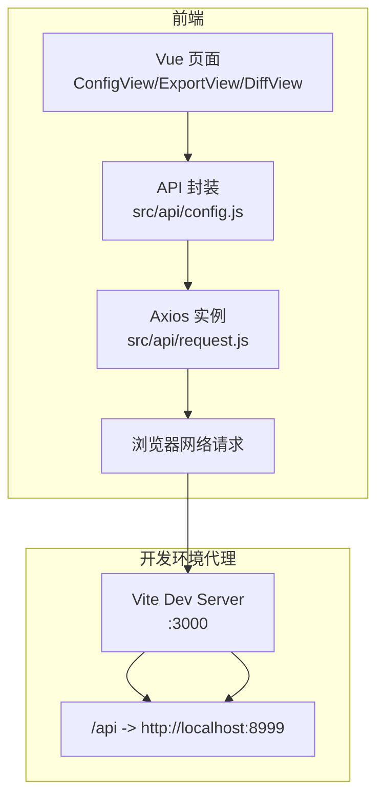
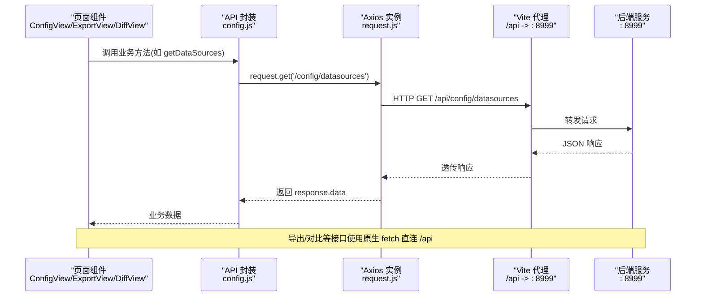
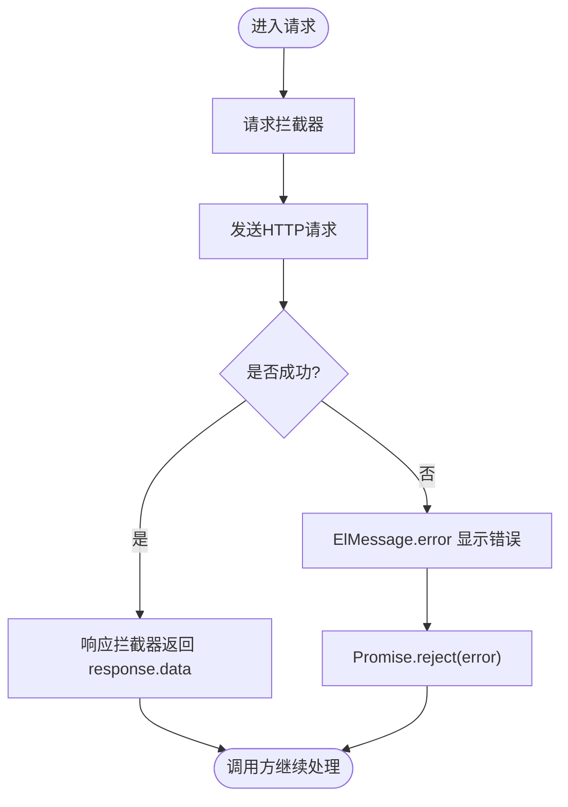
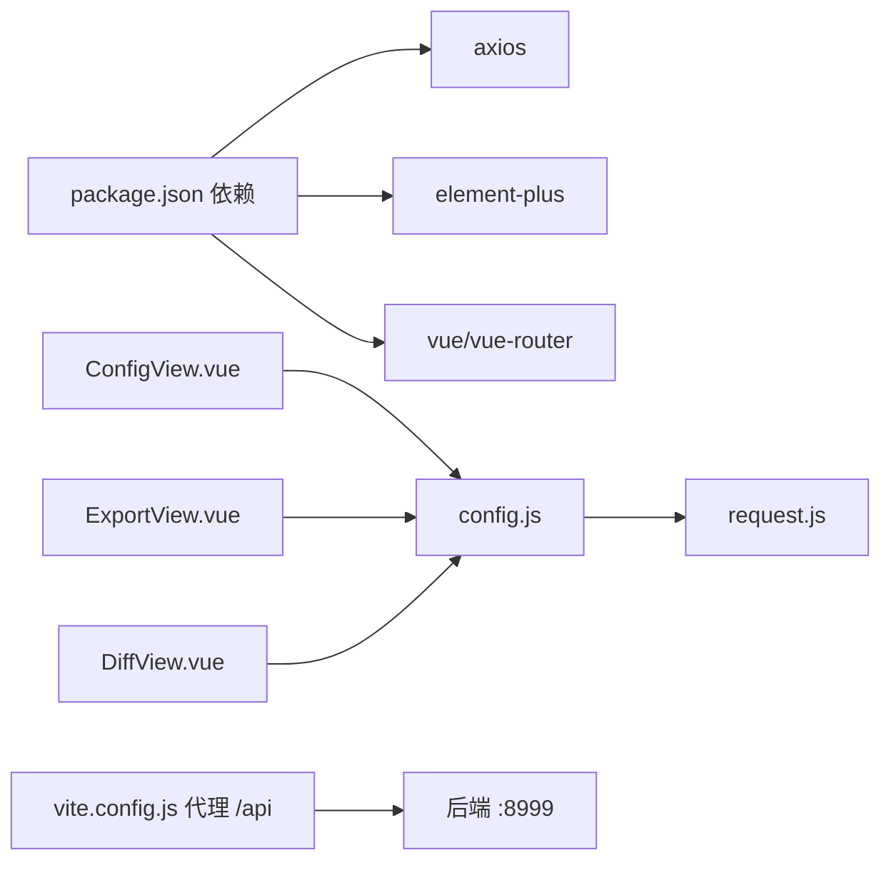

# API集成层

<cite>
**本文引用的文件**
- [request.js](file://schemasync-frontend/src/api/request.js)
- [config.js](file://schemasync-frontend/src/api/config.js)
- [vite.config.js](file://schemasync-frontend/vite.config.js)
- [package.json](file://schemasync-frontend/package.json)
- [ConfigView.vue](file://schemasync-frontend/src/views/ConfigView.vue)
- [ExportView.vue](file://schemasync-frontend/src/views/ExportView.vue)
- [DiffView.vue](file://schemasync-frontend/src/views/DiffView.vue)
</cite>

## 目录
1. [简介](#简介)
2. [项目结构](#项目结构)
3. [核心组件](#核心组件)
4. [架构总览](#架构总览)
5. [详细组件分析](#详细组件分析)
6. [依赖关系分析](#依赖关系分析)
7. [性能与体验优化](#性能与体验优化)
8. [故障排查指南](#故障排查指南)
9. [结论](#结论)
10. [附录：最佳实践与调试技巧](#附录最佳实践与调试技巧)

## 简介
本文件聚焦于 SchemaSync 前端 API 集成层，围绕 Axios 请求封装、API 配置管理、前后端数据格式约定、错误处理策略、异步状态管理与用户体验优化展开。文档旨在帮助开发者正确理解与维护现有实现，并提供可落地的扩展建议（如重试机制、统一错误码映射、离线与缓存策略等）。

## 项目结构
前端采用 Vite + Vue3 + Element Plus 技术栈，API 集成层位于 src/api 目录，包含：
- request.js：Axios 实例创建与拦截器
- config.js：业务 API 方法封装

开发环境通过 Vite 的 dev server 代理将 /api 转发至后端服务。

图表来源
- [vite.config.js:1-17](file://schemasync-frontend/vite.config.js#L1-L17)
- [request.js:1-31](file://schemasync-frontend/src/api/request.js#L1-L31)
- [config.js:1-50](file://schemasync-frontend/src/api/config.js#L1-L50)

章节来源
- [vite.config.js:1-17](file://schemasync-frontend/vite.config.js#L1-L17)
- [package.json:1-25](file://schemasync-frontend/package.json#L1-L25)

## 核心组件
本节对 API 集成层的两个核心文件进行深度解析。

### Axios 请求封装（request.js）
- 实例化
  - baseURL 设置为 /api，便于在开发环境与生产环境分别通过代理或网关路由到后端。
  - timeout 设置为 30 秒，避免长时间挂起。
- 请求拦截器
  - 当前未注入认证头或通用参数，可直接返回配置对象。
- 响应拦截器
  - 成功路径：直接返回 response.data，简化调用方使用。
  - 失败路径：统一弹出错误提示并拒绝 Promise，使上层 catch 能捕获异常。

可扩展点
- 统一认证令牌注入（请求拦截器中设置 Authorization 头）。
- 统一业务错误码处理（根据后端约定的 code/message 结构进行分支处理）。
- 重试机制（针对幂等 GET 请求或特定错误码进行有限次重试）。
- 取消重复请求（基于 URL 去重与 AbortController）。

章节来源
- [request.js:1-31](file://schemasync-frontend/src/api/request.js#L1-L31)

### API 配置管理（config.js）
- 提供数据源 CRUD、连接测试、数据库与 SCHEMA 列表获取等方法。
- 所有方法均基于 request.js 导出的 axios 实例，保持统一的超时与拦截行为。
- testConnection 支持两种模式：
  - 传入字符串：以 { configId } 形式发送，用于测试已保存的配置。
  - 传入对象：直接作为临时配置体发送，用于新增/编辑时的即时验证。

章节来源
- [config.js:1-50](file://schemasync-frontend/src/api/config.js#L1-L50)

## 架构总览
下图展示了从页面到后端的完整通信链路，包括开发环境的代理转发与下载类接口的特殊处理。

图表来源
- [config.js:1-50](file://schemasync-frontend/src/api/config.js#L1-L50)
- [request.js:1-31](file://schemasync-frontend/src/api/request.js#L1-L31)
- [vite.config.js:1-17](file://schemasync-frontend/vite.config.js#L1-L17)
- [ExportView.vue:190-270](file://schemasync-frontend/src/views/ExportView.vue#L190-L270)
- [DiffView.vue:132-257](file://schemasync-frontend/src/views/DiffView.vue#L132-L257)

## 详细组件分析

### 请求与响应流程
- 正常流程
  - 页面调用 config.js 中的方法。
  - Axios 发起请求，经过请求拦截器（当前为空操作）。
  - 后端返回 JSON，响应拦截器提取 data 并返回给调用方。
- 异常流程
  - 网络错误或 HTTP 非 2xx 时，响应拦截器弹出错误消息并拒绝 Promise。
  - 调用方可在业务层 catch 并进行二次处理（例如重试或降级）。

图表来源
- [request.js:10-28](file://schemasync-frontend/src/api/request.js#L10-L28)

章节来源
- [request.js:1-31](file://schemasync-frontend/src/api/request.js#L1-31)

### 认证与令牌管理
- 现状
  - 当前未在请求拦截器中注入认证信息。
- 建议方案
  - 在请求拦截器中读取本地存储的令牌并设置 Authorization 头。
  - 在响应拦截器中检测 401，触发重新登录或刷新令牌逻辑。
  - 注意跨域 Cookie 与 SameSite 策略，必要时启用 withCredentials。

章节来源
- [request.js:1-31](file://schemasync-frontend/src/api/request.js#L1-31)

### 错误处理与统一错误码映射
- 现状
  - 网络错误与 HTTP 错误由 Axios 拦截器统一提示“请求失败”。
  - 部分页面（如 ExportView、DiffView）使用原生 fetch 并自行解析错误信息。
- 建议方案
  - 约定后端统一响应结构（例如 { code, message, data }），在响应拦截器中按 code 分支处理。
  - 将业务错误码映射为友好的用户提示，并在日志中保留原始错误上下文。
  - 对关键接口增加错误上报埋点。

章节来源
- [request.js:20-28](file://schemasync-frontend/src/api/request.js#L20-L28)
- [ExportView.vue:210-242](file://schemasync-frontend/src/views/ExportView.vue#L210-L242)
- [DiffView.vue:144-159](file://schemasync-frontend/src/views/DiffView.vue#L144-L159)

### 重试机制设计
- 适用场景
  - 幂等请求（GET）或可安全重试的操作。
  - 瞬时性错误（网络抖动、服务端 503/504）。
- 建议实现
  - 在请求拦截器中判断是否需要重试（基于 URL 白名单或请求方法）。
  - 使用指数退避与最大重试次数限制，避免雪崩。
  - 结合 AbortController 支持取消。

章节来源
- [request.js:1-31](file://schemasync-frontend/src/api/request.js#L1-31)

### 前后端数据格式约定
- 常规 JSON 接口
  - 请求：application/json，参数随 body 或 query 传递。
  - 响应：JSON，推荐统一包装 { code, message, data }。
- 文件导出与上传
  - 导出：后端返回二进制流，前端通过 Blob 与 a.download 下载。
  - 上传：使用 FormData 分片上传大文件，注意 Content-Type 由浏览器自动设置。
- 差异对比
  - 使用 FormData 提交 Excel 文件，后端返回 JSON 摘要或文件流。

章节来源
- [ExportView.vue:190-270](file://schemasync-frontend/src/views/ExportView.vue#L190-L270)
- [DiffView.vue:132-257](file://schemasync-frontend/src/views/DiffView.vue#L132-L257)

### 异步状态管理与加载指示
- 现状
  - 页面级 loading 状态（如 ConfigView 的表格加载、ExportView 的数据库/SCHEMA 下拉加载）通过 ref 控制。
  - 按钮级 loading 状态（如测试连接、导出、对比）提升交互反馈。
- 建议
  - 将 loading 状态下沉到 API 层（可选），或在每个页面集中管理。
  - 对长耗时任务提供进度条或阶段性提示。

章节来源
- [ConfigView.vue:169-176](file://schemasync-frontend/src/views/ConfigView.vue#L169-L176)
- [ExportView.vue:130-148](file://schemasync-frontend/src/views/ExportView.vue#L130-L148)
- [ExportView.vue:170-188](file://schemasync-frontend/src/views/ExportView.vue#L170-L188)
- [DiffView.vue:132-160](file://schemasync-frontend/src/views/DiffView.vue#L132-L160)

### 下载与文件处理
- 现状
  - ExportView 与 DiffView 使用原生 fetch 获取二进制流，并通过 Blob 与 a.download 触发下载。
  - 文件名优先从响应头 Content-Disposition 解析，否则生成默认名称。
- 建议
  - 统一封装下载函数，复用错误处理与文件名解析逻辑。
  - 对超大文件考虑分块下载与断点续传。

章节来源
- [ExportView.vue:210-262](file://schemasync-frontend/src/views/ExportView.vue#L210-L262)
- [DiffView.vue:175-216](file://schemasync-frontend/src/views/DiffView.vue#L175-L216)

## 依赖关系分析
- 包依赖
  - axios：HTTP 客户端。
  - element-plus：UI 组件与消息提示。
  - vue/vue-router：框架与路由。
- 模块依赖
  - config.js 依赖 request.js。
  - 各页面依赖 config.js 暴露的方法。
  - 开发环境通过 vite.config.js 的 proxy 将 /api 转发到后端。

图表来源
- [package.json:11-18](file://schemasync-frontend/package.json#L11-L18)
- [config.js:1-50](file://schemasync-frontend/src/api/config.js#L1-L50)
- [request.js:1-31](file://schemasync-frontend/src/api/request.js#L1-L31)
- [vite.config.js:7-15](file://schemasync-frontend/vite.config.js#L7-L15)

章节来源
- [package.json:1-25](file://schemasync-frontend/package.json#L1-L25)
- [config.js:1-50](file://schemasync-frontend/src/api/config.js#L1-L50)
- [request.js:1-31](file://schemasync-frontend/src/api/request.js#L1-L31)
- [vite.config.js:1-17](file://schemasync-frontend/vite.config.js#L1-L17)

## 性能与体验优化
- 请求层面
  - 合并重复请求：基于 URL 去重，避免短时间内多次相同请求。
  - 合理超时：根据接口类型调整超时时间（导出/对比可适当延长）。
  - 取消请求：在路由切换或组件卸载时取消未完成请求。
- 渲染层面
  - 分页与懒加载：大数据列表按需加载。
  - 虚拟滚动：长列表优化。
- 资源层面
  - 静态资源压缩与缓存策略。
  - 图片与图标按需引入。

[本节为通用指导，不直接分析具体文件]

## 故障排查指南
- 常见问题
  - 跨域问题：确认 Vite 代理配置是否正确，目标地址可达。
  - 401/403：检查认证令牌是否存在且有效，必要时刷新或重新登录。
  - 超时：检查后端响应时间与网络状况，适当调整超时。
  - 下载失败：检查后端返回的是文件流还是错误 JSON，确保前端正确解析。
- 定位步骤
  - 打开浏览器开发者工具 Network 面板，查看请求 URL、状态码、请求/响应体。
  - 在响应拦截器处打印错误上下文（URL、方法、状态码、错误信息）。
  - 对于下载接口，检查 Content-Type 与 Content-Disposition。

章节来源
- [vite.config.js:7-15](file://schemasync-frontend/vite.config.js#L7-L15)
- [request.js:20-28](file://schemasync-frontend/src/api/request.js#L20-L28)
- [ExportView.vue:210-242](file://schemasync-frontend/src/views/ExportView.vue#L210-L242)
- [DiffView.vue:144-159](file://schemasync-frontend/src/views/DiffView.vue#L144-L159)

## 结论
当前 API 集成层简洁清晰，满足基础的数据交互需求。建议在现有基础上逐步完善认证注入、统一错误码映射、重试与取消机制，并对下载与上传流程进行统一封装，以提升稳定性与可维护性。同时，结合页面级的加载状态与错误提示，持续优化用户体验。

[本节为总结性内容，不直接分析具体文件]

## 附录：最佳实践与调试技巧
- 最佳实践
  - 统一 baseURL 与超时配置，避免分散硬编码。
  - 在请求拦截器中注入认证信息与通用参数。
  - 在响应拦截器中统一处理业务错误码与网络错误。
  - 对幂等请求实现有限次重试与指数退避。
  - 对大文件下载/上传进行进度反馈与错误恢复。
- 调试技巧
  - 使用浏览器 Network 面板过滤 /api 请求，快速定位问题。
  - 在拦截器中添加日志输出（URL、方法、状态码、耗时）。
  - 对关键接口增加错误上报与埋点，便于线上追踪。
  - 使用 Mock 数据与本地代理加速联调。

[本节为通用指导，不直接分析具体文件]