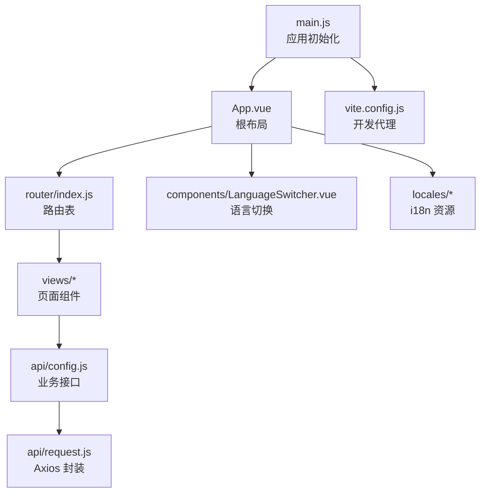
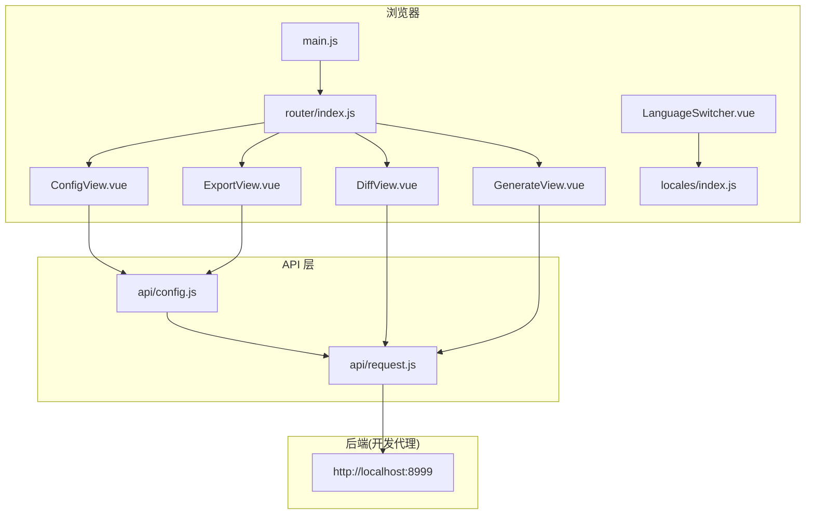
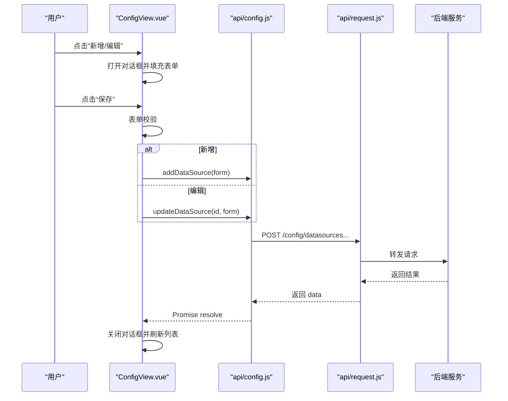
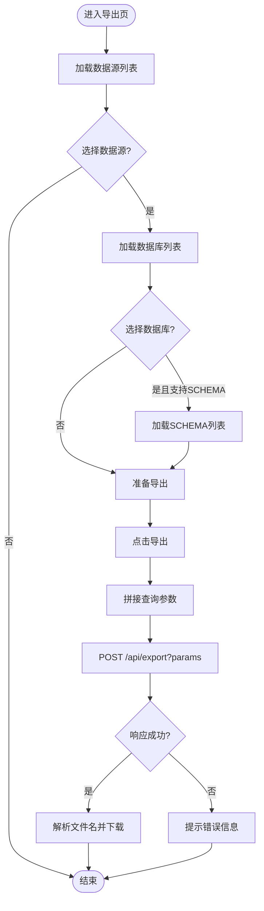
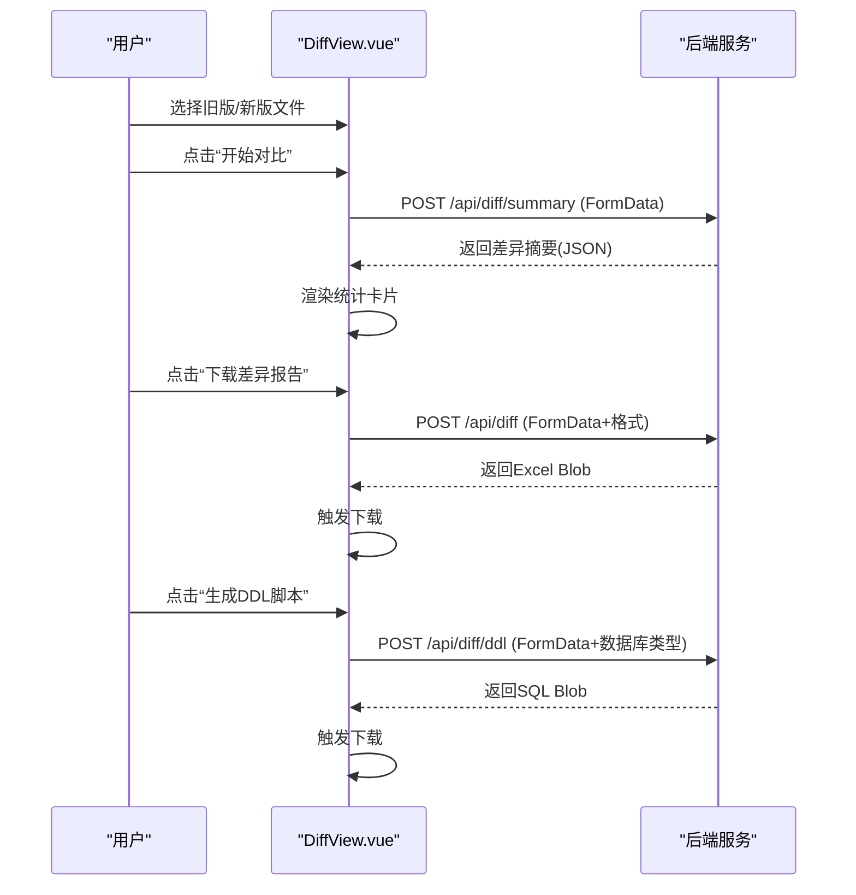
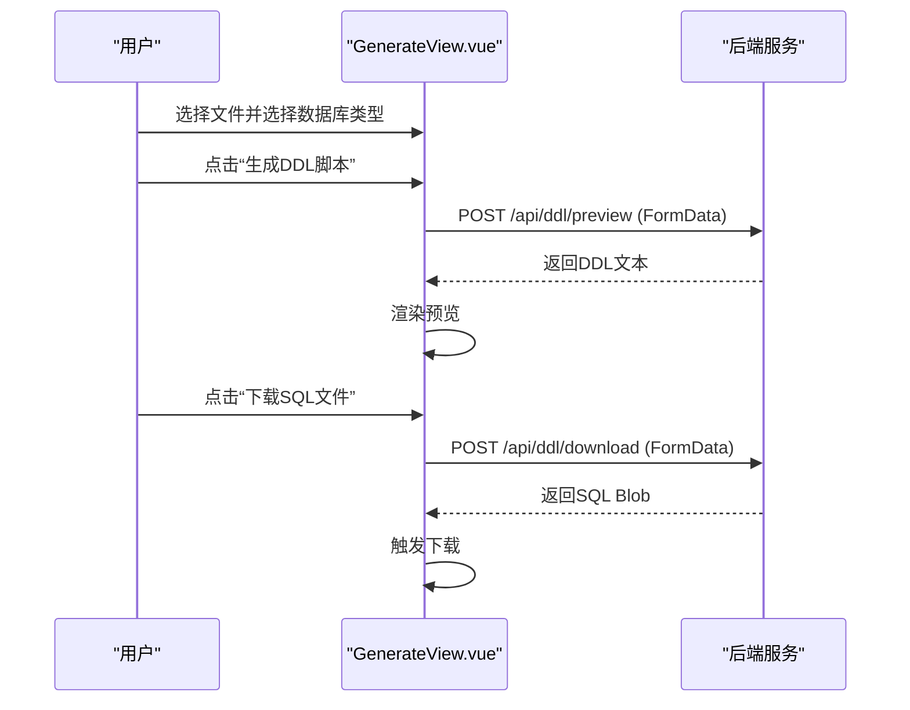
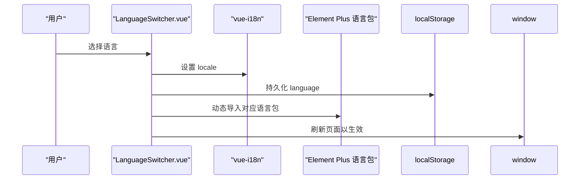
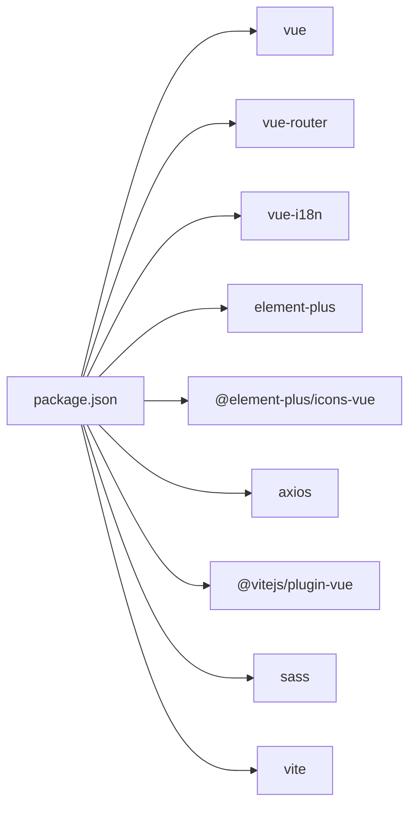

# 前端架构

<cite>
**本文引用的文件**   
- [main.js](file://schemasync-frontend/src/main.js)
- [App.vue](file://schemasync-frontend/src/App.vue)
- [index.js](file://schemasync-frontend/src/router/index.js)
- [vite.config.js](file://schemasync-frontend/vite.config.js)
- [package.json](file://schemasync-frontend/package.json)
- [ConfigView.vue](file://schemasync-frontend/src/views/ConfigView.vue)
- [ExportView.vue](file://schemasync-frontend/src/views/ExportView.vue)
- [DiffView.vue](file://schemasync-frontend/src/views/DiffView.vue)
- [GenerateView.vue](file://schemasync-frontend/src/views/GenerateView.vue)
- [LanguageSwitcher.vue](file://schemasync-frontend/src/components/LanguageSwitcher.vue)
- [request.js](file://schemasync-frontend/src/api/request.js)
- [config.js](file://schemasync-frontend/src/api/config.js)
- [index.js](file://schemasync-frontend/src/locales/index.js)
- [zh-CN.js](file://schemasync-frontend/src/locales/zh-CN.js)
- [en-US.js](file://schemasync-frontend/src/locales/en-US.js)
</cite>

## 目录
1. [简介](#简介)
2. [项目结构](#项目结构)
3. [核心组件](#核心组件)
4. [架构总览](#架构总览)
5. [详细组件分析](#详细组件分析)
6. [依赖分析](#依赖分析)
7. [性能考虑](#性能考虑)
8. [故障排查指南](#故障排查指南)
9. [结论](#结论)
10. [附录](#附录)

## 简介
本文件面向 SchemaSync 前端应用，基于 Vue 3 + Vite 技术栈，采用组件化与模块化设计。文档覆盖入口配置、根布局、路由组织、四大页面（数据源配置、字典导出、版本对比、DDL 生成）、国际化切换、API 请求封装与错误处理、状态管理策略、构建与部署建议等，帮助开发者快速理解并扩展功能。

## 项目结构
前端采用按“能力域”划分的目录组织：
- src/main.js：应用初始化、插件注册、挂载根组件
- src/App.vue：全局布局（头部、侧边栏、主内容区、底部）
- src/router/index.js：路由定义与导航映射
- src/views：页面级组件（ConfigView、ExportView、DiffView、GenerateView、SetTableView）
- src/components：通用组件（LanguageSwitcher 语言切换器）
- src/api：API 层（request 封装、config 业务接口）
- src/locales：多语言资源与 i18n 初始化
- vite.config.js：Vite 开发服务器与代理配置
- package.json：脚本与依赖声明

图表来源
- [main.js:1-20](file://schemasync-frontend/src/main.js#L1-L20)
- [App.vue:1-115](file://schemasync-frontend/src/App.vue#L1-L115)
- [index.js:1-46](file://schemasync-frontend/src/router/index.js#L1-L46)
- [vite.config.js:1-17](file://schemasync-frontend/vite.config.js#L1-L17)

章节来源
- [main.js:1-20](file://schemasync-frontend/src/main.js#L1-L20)
- [App.vue:1-115](file://schemasync-frontend/src/App.vue#L1-L115)
- [index.js:1-46](file://schemasync-frontend/src/router/index.js#L1-L46)
- [vite.config.js:1-17](file://schemasync-frontend/vite.config.js#L1-L17)
- [package.json:1-25](file://schemasync-frontend/package.json#L1-L25)

## 核心组件
- 应用入口 main.js
  - 创建 Vue 应用实例，注册 Element Plus 及其图标库、路由、i18n，挂载到 #app。
- 根布局 App.vue
  - 使用 Element Plus 容器搭建顶部、侧边栏、主内容区与底部；集成 LanguageSwitcher 组件；通过 router-view 渲染页面。
- 路由 index.js
  - 定义默认重定向与五个页面路由，统一使用 History 模式。
- API 层
  - request.js：基于 Axios 的封装，设置 baseURL、超时、响应拦截返回 data、错误提示。
  - config.js：暴露数据源 CRUD、连接测试、数据库/SCHEMA 列表获取等函数。
- 国际化 locales
  - index.js：创建 i18n 实例，读取本地存储或浏览器偏好，提供 zh-CN/en-US 两套消息。
  - zh-CN.js / en-US.js：各模块文案集合（common、menu、config、export、diff、generate、footer）。

章节来源
- [main.js:1-20](file://schemasync-frontend/src/main.js#L1-L20)
- [App.vue:1-115](file://schemasync-frontend/src/App.vue#L1-L115)
- [index.js:1-46](file://schemasync-frontend/src/router/index.js#L1-L46)
- [request.js:1-31](file://schemasync-frontend/src/api/request.js#L1-L31)
- [config.js:1-50](file://schemasync-frontend/src/api/config.js#L1-L50)
- [index.js:1-26](file://schemasync-frontend/src/locales/index.js#L1-L26)
- [zh-CN.js:1-150](file://schemasync-frontend/src/locales/zh-CN.js#L1-L150)
- [en-US.js:1-150](file://schemasync-frontend/src/locales/en-US.js#L1-L150)

## 架构总览
前端以 Vue 3 Composition API 为核心，结合 Element Plus 组件库与 vue-i18n 实现 UI 与国际化；通过 Vite 进行开发与构建，并在开发环境对后端 /api 路径进行代理转发。

图表来源
- [main.js:1-20](file://schemasync-frontend/src/main.js#L1-L20)
- [index.js:1-46](file://schemasync-frontend/src/router/index.js#L1-L46)
- [ConfigView.vue:1-344](file://schemasync-frontend/src/views/ConfigView.vue#L1-L344)
- [ExportView.vue:1-278](file://schemasync-frontend/src/views/ExportView.vue#L1-L278)
- [DiffView.vue:1-313](file://schemasync-frontend/src/views/DiffView.vue#L1-L313)
- [GenerateView.vue:1-153](file://schemasync-frontend/src/views/GenerateView.vue#L1-L153)
- [LanguageSwitcher.vue:1-76](file://schemasync-frontend/src/components/LanguageSwitcher.vue#L1-L76)
- [config.js:1-50](file://schemasync-frontend/src/api/config.js#L1-L50)
- [request.js:1-31](file://schemasync-frontend/src/api/request.js#L1-L31)
- [vite.config.js:1-17](file://schemasync-frontend/vite.config.js#L1-L17)

## 详细组件分析

### 数据源配置 ConfigView
职责
- 展示数据源列表，支持新增、编辑、删除、连接测试。
- 表单包含基础信息与高级配置（JDBC URL、连接池 JSON），并提供保存前校验与结果反馈。

交互流程
- 加载列表 → 打开对话框（新增/编辑）→ 表单校验 → 调用 API 保存 → 刷新列表。
- 行内“测试连接”与表单内“测试连接”分别调用同一接口，支持传入已保存 ID 或临时对象。

关键实现要点
- 使用 ref 管理表格数据、加载态、对话框可见性、表单模型与校验规则。
- 计算属性控制“测试连接”按钮可用状态。
- 通过 api/config 中的 getDataSources/addDataSource/updateDataSource/deleteDataSource/testConnection 完成数据交互。

图表来源
- [ConfigView.vue:1-344](file://schemasync-frontend/src/views/ConfigView.vue#L1-L344)
- [config.js:1-50](file://schemasync-frontend/src/api/config.js#L1-L50)
- [request.js:1-31](file://schemasync-frontend/src/api/request.js#L1-L31)

章节来源
- [ConfigView.vue:1-344](file://schemasync-frontend/src/views/ConfigView.vue#L1-L344)
- [config.js:1-50](file://schemasync-frontend/src/api/config.js#L1-L50)

### 数据字典导出 ExportView
职责
- 选择数据源后动态加载数据库列表，若目标数据库支持 SCHEMA，则进一步加载 SCHEMA 列表。
- 将所选参数提交至后端导出接口，下载 Excel 文件。

交互流程
- 选择数据源 → 自动加载数据库列表 → 选择数据库 → 可选加载 SCHEMA → 点击“导出数据字典” → 下载文件。

关键实现要点
- 使用 computed 判断是否显示 SCHEMA 选择框。
- 懒加载数据库/SCHEMA 列表，避免不必要的请求。
- 使用原生 fetch 发起导出请求，解析 Content-Disposition 文件名并触发下载。

图表来源
- [ExportView.vue:1-278](file://schemasync-frontend/src/views/ExportView.vue#L1-L278)
- [config.js:1-50](file://schemasync-frontend/src/api/config.js#L1-L50)

章节来源
- [ExportView.vue:1-278](file://schemasync-frontend/src/views/ExportView.vue#L1-L278)
- [config.js:1-50](file://schemasync-frontend/src/api/config.js#L1-L50)

### 版本对比 DiffView
职责
- 上传旧版/新版字典文件，调用差异摘要接口，展示变更统计。
- 支持下载差异报告与根据差异生成 DDL 脚本。

交互流程
- 选择两个文件 → 点击“开始对比” → 展示统计卡片 → 可下载差异报告或生成 DDL。

关键实现要点
- 使用 FormData 上传二进制文件，避免额外转码。
- 差异摘要与 DDL 生成分别调用不同后端接口。
- 对响应类型进行健壮性检查，确保下载行为正确。

图表来源
- [DiffView.vue:1-313](file://schemasync-frontend/src/views/DiffView.vue#L1-L313)

章节来源
- [DiffView.vue:1-313](file://schemasync-frontend/src/views/DiffView.vue#L1-L313)

### 全量DDL生成 GenerateView
职责
- 上传数据字典文件，选择目标数据库类型，预览生成的 DDL 文本，并支持下载 SQL 文件。

交互流程
- 选择文件 → 选择数据库类型 → 点击“生成DDL脚本” → 预览文本 → 下载 SQL。

关键实现要点
- 预览与下载分别调用不同接口，预览返回文本，下载返回二进制流。
- 使用 Blob 与 URL.createObjectURL 触发下载。

图表来源
- [GenerateView.vue:1-153](file://schemasync-frontend/src/views/GenerateView.vue#L1-L153)

章节来源
- [GenerateView.vue:1-153](file://schemasync-frontend/src/views/GenerateView.vue#L1-L153)

### 国际化组件 LanguageSwitcher
职责
- 提供语言切换下拉菜单，持久化用户语言偏好，并联动 Element Plus 语言包。

实现原理
- 通过 useI18n 获取 locale，切换时写入 localStorage 并更新当前语言。
- 动态导入 Element Plus 对应语言包，并通过刷新页面应用新语言。

图表来源
- [LanguageSwitcher.vue:1-76](file://schemasync-frontend/src/components/LanguageSwitcher.vue#L1-L76)
- [index.js:1-26](file://schemasync-frontend/src/locales/index.js#L1-L26)

章节来源
- [LanguageSwitcher.vue:1-76](file://schemasync-frontend/src/components/LanguageSwitcher.vue#L1-L76)
- [index.js:1-26](file://schemasync-frontend/src/locales/index.js#L1-L26)
- [zh-CN.js:1-150](file://schemasync-frontend/src/locales/zh-CN.js#L1-L150)
- [en-US.js:1-150](file://schemasync-frontend/src/locales/en-US.js#L1-L150)

## 依赖分析
- 运行时依赖
  - vue、vue-router、vue-i18n、element-plus、@element-plus/icons-vue、axios
- 开发依赖
  - @vitejs/plugin-vue、sass、vite
- 构建脚本
  - dev/build/preview 命令由 Vite 提供

图表来源
- [package.json:1-25](file://schemasync-frontend/package.json#L1-L25)

章节来源
- [package.json:1-25](file://schemasync-frontend/package.json#L1-L25)

## 性能考虑
- 按需引入与打包优化
  - 使用 Vite 按需编译，减少首屏体积；保持 Element Plus 按需引入图标与组件。
- 网络请求
  - 复用 axios 实例，合理设置超时；对大文件导出/下载使用原生 fetch 与 Blob 处理，避免内存峰值过高。
- 列表与表单
  - 大数据量表格建议使用虚拟滚动；表单校验尽量在输入阶段进行，减少无效请求。
- 缓存与懒加载
  - 对数据库/SCHEMA 列表采用懒加载与条件渲染，避免重复请求。
- 国际化
  - 语言包可按需加载，避免一次性加载全部文案。

[本节为通用指导，不直接分析具体文件]

## 故障排查指南
- 无法访问后端接口
  - 确认开发代理配置是否正确，/api 路径应转发至 http://localhost:8999。
- 请求失败无提示
  - 检查 request.js 响应拦截器是否被覆盖；确认后端返回结构与错误字段。
- 导出/下载失败
  - 检查响应头 Content-Disposition 是否存在；确认返回的是文件而非 JSON 错误体。
- 语言切换未生效
  - 确认 localStorage 中 language 值有效；Element Plus 语言包动态导入后需要刷新页面。

章节来源
- [vite.config.js:1-17](file://schemasync-frontend/vite.config.js#L1-L17)
- [request.js:1-31](file://schemasync-frontend/src/api/request.js#L1-L31)
- [ExportView.vue:1-278](file://schemasync-frontend/src/views/ExportView.vue#L1-L278)
- [LanguageSwitcher.vue:1-76](file://schemasync-frontend/src/components/LanguageSwitcher.vue#L1-L76)

## 结论
该前端应用以清晰的模块化与组件化设计为基础，结合 Vue 3 Composition API、Element Plus 与 vue-i18n，提供了完善的数据源管理、字典导出、版本对比与 DDL 生成功能。通过统一的 API 层与良好的错误处理机制，提升了可维护性与用户体验。建议在后续迭代中持续优化首屏性能、增强错误边界与单元测试覆盖。

[本节为总结性内容，不直接分析具体文件]

## 附录
- 构建与运行
  - 安装依赖：npm install
  - 启动开发服务：npm run dev（端口 3000，/api 代理至 8999）
  - 构建生产包：npm run build
  - 预览构建产物：npm run preview
- 部署建议
  - 静态资源部署至 Nginx/Apache，并将 /api 反向代理至后端服务。
  - 开启 gzip/brotli 压缩，合理设置缓存头。
  - 生产环境关闭调试日志，启用错误上报。

章节来源
- [vite.config.js:1-17](file://schemasync-frontend/vite.config.js#L1-L17)
- [package.json:1-25](file://schemasync-frontend/package.json#L1-L25)