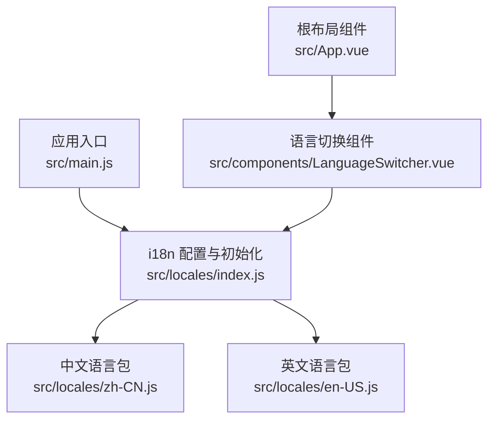
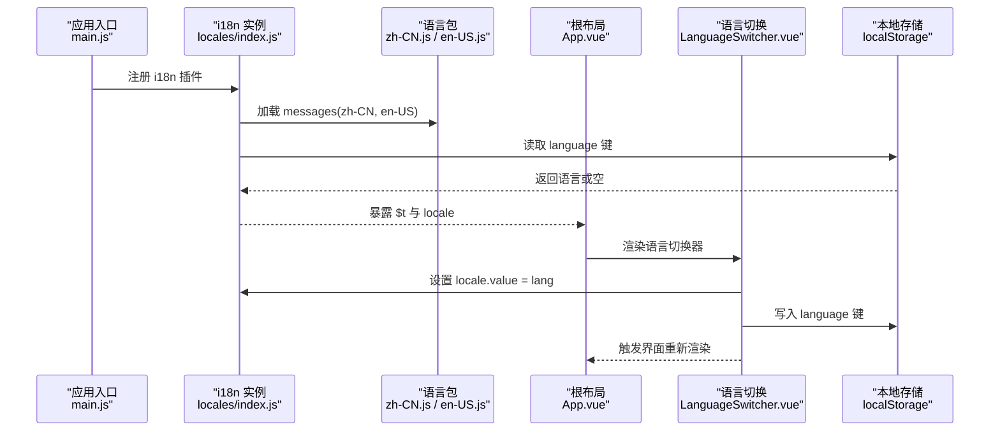
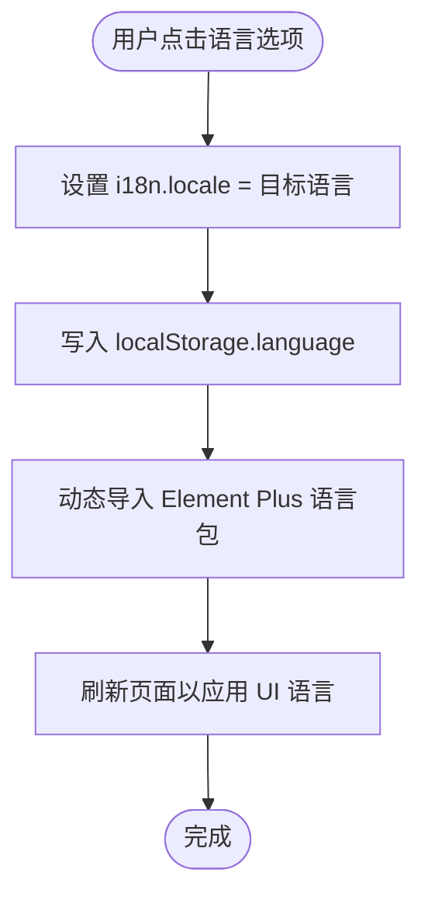
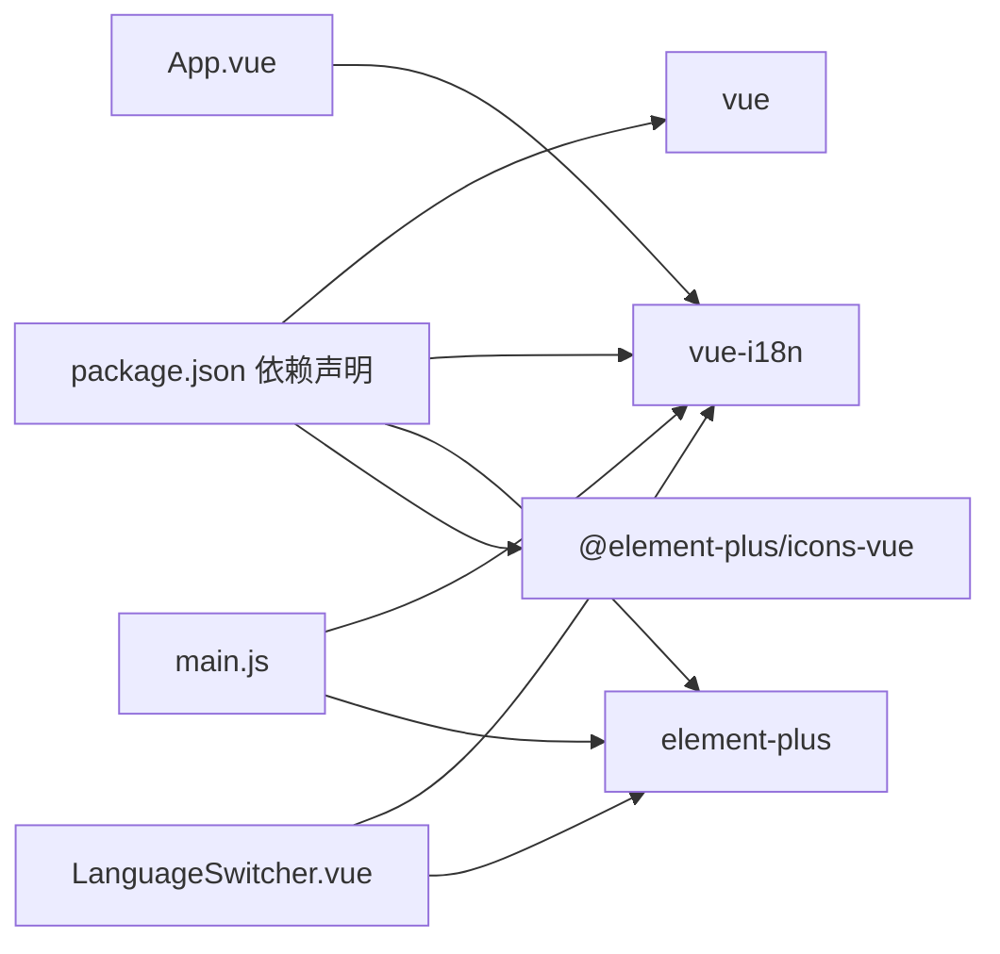

# 国际化支持

<cite>
**本文引用的文件**
- [index.js](file://schemasync-frontend/src/locales/index.js)
- [zh-CN.js](file://schemasync-frontend/src/locales/zh-CN.js)
- [en-US.js](file://schemasync-frontend/src/locales/en-US.js)
- [LanguageSwitcher.vue](file://schemasync-frontend/src/components/LanguageSwitcher.vue)
- [main.js](file://schemasync-frontend/src/main.js)
- [App.vue](file://schemasync-frontend/src/App.vue)
- [package.json](file://schemasync-frontend/package.json)
</cite>

## 目录
1. [简介](#简介)
2. [项目结构](#项目结构)
3. [核心组件](#核心组件)
4. [架构总览](#架构总览)
5. [详细组件分析](#详细组件分析)
6. [依赖关系分析](#依赖关系分析)
7. [性能考虑](#性能考虑)
8. [故障排查指南](#故障排查指南)
9. [结论](#结论)
10. [附录：开发规范与流程](#附录开发规范与流程)

## 简介
本文件面向 SchemaSync 前端项目的国际化（i18n）能力，系统性梳理基于 vue-i18n 的配置、语言包结构与命名规范、语言切换组件的实现逻辑与用户偏好存储机制，并给出在 Vue 组件中使用 $t() 进行文本国际化的最佳实践。同时提供新增语言包的开发指南、翻译工作流程与术语一致性管理建议，以及性能优化与常见问题解决方案，帮助团队高效维护与扩展多语言支持。

## 项目结构
前端的国际化相关代码集中在 locales 目录，并在应用入口注册 i18n 插件；语言切换通过独立组件实现，主布局中集成使用。

图表来源
- [main.js:1-20](file://schemasync-frontend/src/main.js#L1-L20)
- [index.js:1-26](file://schemasync-frontend/src/locales/index.js#L1-L26)
- [zh-CN.js:1-150](file://schemasync-frontend/src/locales/zh-CN.js#L1-L150)
- [en-US.js:1-150](file://schemasync-frontend/src/locales/en-US.js#L1-L150)
- [App.vue:1-115](file://schemasync-frontend/src/App.vue#L1-L115)
- [LanguageSwitcher.vue:1-76](file://schemasync-frontend/src/components/LanguageSwitcher.vue#L1-L76)

章节来源
- [main.js:1-20](file://schemasync-frontend/src/main.js#L1-L20)
- [index.js:1-26](file://schemasync-frontend/src/locales/index.js#L1-L26)

## 核心组件
- i18n 初始化与默认语言策略
  - 使用 createI18n 创建实例，启用 Composition API 模式，设置默认语言与回退语言，并注册 zh-CN 与 en-US 两个语言包。
  - 默认语言优先读取本地存储 language 键，若不存在或不在允许列表中则回退到中文。
- 语言包结构
  - 采用扁平化命名空间组织，如 common、menu、config、export、diff、generate、footer 等，便于按模块定位与维护。
- 语言切换组件
  - 提供下拉菜单切换当前语言，更新 i18n 的 locale，并将选择持久化到 localStorage。
  - 动态导入 Element Plus 对应语言包并刷新页面以应用 UI 库语言。
- 应用入口
  - 在 main.js 中安装 i18n 插件，使全局 $t 可用。
- 根布局使用
  - App.vue 通过 useI18n 获取 t 函数，用于渲染标题、副标题与菜单项等。

章节来源
- [index.js:1-26](file://schemasync-frontend/src/locales/index.js#L1-L26)
- [zh-CN.js:1-150](file://schemasync-frontend/src/locales/zh-CN.js#L1-L150)
- [en-US.js:1-150](file://schemasync-frontend/src/locales/en-US.js#L1-L150)
- [LanguageSwitcher.vue:1-76](file://schemasync-frontend/src/components/LanguageSwitcher.vue#L1-L76)
- [main.js:1-20](file://schemasync-frontend/src/main.js#L1-L20)
- [App.vue:1-115](file://schemasync-frontend/src/App.vue#L1-L115)

## 架构总览
下图展示了从应用启动到语言切换的关键数据流与依赖关系。

图表来源
- [main.js:1-20](file://schemasync-frontend/src/main.js#L1-L20)
- [index.js:1-26](file://schemasync-frontend/src/locales/index.js#L1-L26)
- [zh-CN.js:1-150](file://schemasync-frontend/src/locales/zh-CN.js#L1-L150)
- [en-US.js:1-150](file://schemasync-frontend/src/locales/en-US.js#L1-L150)
- [App.vue:1-115](file://schemasync-frontend/src/App.vue#L1-L115)
- [LanguageSwitcher.vue:1-76](file://schemasync-frontend/src/components/LanguageSwitcher.vue#L1-L76)

## 详细组件分析

### i18n 配置系统设计与实现
- 初始化参数
  - legacy: false，启用 Composition API 模式。
  - locale: 由 getLanguage() 决定，优先取 localStorage 中的 language，否则默认 zh-CN。
  - fallbackLocale: 当目标语言缺失键时回退到 zh-CN。
  - messages: 注册 zh-CN 与 en-US 两个语言包。
- 默认语言策略
  - 仅接受 zh-CN 与 en-US，其他值将被忽略并回退到默认中文。
- 可扩展性
  - 新增语言包只需在 index.js 中引入并加入 messages，同时在 getLanguage 的白名单中添加新语言标识。

章节来源
- [index.js:1-26](file://schemasync-frontend/src/locales/index.js#L1-L26)

### 语言包结构与命名规范
- 命名空间
  - common: 通用文案（按钮、提示、状态等）。
  - menu: 导航菜单项。
  - config: 数据源配置相关文案。
  - export: 导出功能相关文案。
  - diff: 版本对比相关文案。
  - generate: DDL 生成相关文案。
  - footer: 页脚信息。
- 键名风格
  - 使用小驼峰或下划线组合的短键，层级不超过三层，保持可读性与可维护性。
- 占位符
  - 使用双引号包裹的字符串占位符，例如 "{name}"，在调用 $t 时通过参数传入。
- 一致性要求
  - 同一概念在不同模块应复用相同键名，避免同义不同词。
  - 新增模块需遵循现有命名空间约定，必要时扩展新的顶级命名空间。

章节来源
- [zh-CN.js:1-150](file://schemasync-frontend/src/locales/zh-CN.js#L1-L150)
- [en-US.js:1-150](file://schemasync-frontend/src/locales/en-US.js#L1-L150)

### LanguageSwitcher 组件的语言切换逻辑与用户偏好存储
- 交互流程
  - 点击下拉菜单项后，将目标语言赋值给 i18n 的 locale，并同步更新组件内部 currentLanguage。
  - 将选择的语言写入 localStorage 的 language 键，确保刷新后仍保持用户偏好。
  - 动态导入 Element Plus 对应语言包，并通过刷新页面应用 UI 库语言。
- 用户体验
  - 切换成功后显示成功消息，提升反馈感。
- 注意事项
  - 由于使用了 window.location.reload()，切换会触发整页刷新，适用于快速落地 Element Plus 语言包变更的场景。

图表来源
- [LanguageSwitcher.vue:1-76](file://schemasync-frontend/src/components/LanguageSwitcher.vue#L1-L76)

章节来源
- [LanguageSwitcher.vue:1-76](file://schemasync-frontend/src/components/LanguageSwitcher.vue#L1-L76)

### 在 Vue 组件中使用 $t() 进行文本国际化
- 基本用法
  - 在模板中通过 {{ t('common.appName') }} 或 $t('common.appName') 访问语言包键值。
  - 在脚本中通过 useI18n() 获取 t 函数，用于动态拼接或条件渲染。
- 动态参数传递
  - 使用占位符形式，例如 deleteConfirm 键包含 "{name}"，调用时传入 { name } 参数即可替换。
- 复数形式处理
  - 当前语言包未使用复数规则，如需支持可在 i18n 配置中启用 pluralRules，并在语言包中以复数语法定义键值。
- 示例参考路径
  - 根布局中使用 t 渲染标题与菜单项：[App.vue:1-115](file://schemasync-frontend/src/App.vue#L1-L115)
  - 语言切换组件中根据当前语言展示不同文案：[LanguageSwitcher.vue:1-76](file://schemasync-frontend/src/components/LanguageSwitcher.vue#L1-L76)

章节来源
- [App.vue:1-115](file://schemasync-frontend/src/App.vue#L1-L115)
- [LanguageSwitcher.vue:1-76](file://schemasync-frontend/src/components/LanguageSwitcher.vue#L1-L76)

## 依赖关系分析
- 运行时依赖
  - vue-i18n：提供国际化能力与 $t 函数。
  - element-plus：UI 组件库，其语言包可通过动态导入切换。
  - @element-plus/icons-vue：图标资源。
- 构建与运行
  - Vite 作为构建工具，支持按需导入与热更新。
- 关键依赖图

图表来源
- [package.json:1-25](file://schemasync-frontend/package.json#L1-25)
- [main.js:1-20](file://schemasync-frontend/src/main.js#L1-L20)
- [App.vue:1-115](file://schemasync-frontend/src/App.vue#L1-L115)
- [LanguageSwitcher.vue:1-76](file://schemasync-frontend/src/components/LanguageSwitcher.vue#L1-L76)

章节来源
- [package.json:1-25](file://schemasync-frontend/package.json#L1-25)
- [main.js:1-20](file://schemasync-frontend/src/main.js#L1-L20)

## 性能考虑
- 语言包体积
  - 当前语言包较小，直接静态导入无显著开销。若未来语言包增多，可考虑按路由或页面懒加载语言包，减少首屏体积。
- 语言切换成本
  - 当前切换通过 window.location.reload() 刷新页面，简单可靠但体验略重。后续可改为非刷新方式：
    - 为 Element Plus 设置全局 locale 对象，无需刷新。
    - 对已挂载组件使用响应式更新，避免整页重建。
- 回退策略
  - 合理设置 fallbackLocale，避免缺失键导致的空白或异常。
- 缓存与持久化
  - 使用 localStorage 保存用户语言偏好，避免重复计算与网络请求。

[本节为通用指导，不直接分析具体文件]

## 故障排查指南
- 切换语言后 Element Plus 文案未生效
  - 现象：自定义文案已切换，但组件库文案仍为旧语言。
  - 原因：当前实现通过刷新页面应用语言包。
  - 解决：确认切换流程是否执行了刷新；或改为非刷新方式设置 Element Plus 全局 locale。
- 切换语言后部分文案未更新
  - 现象：某些区域未随语言变化而更新。
  - 原因：可能未在相应位置使用 $t() 或 t()。
  - 解决：检查组件模板与脚本中是否引用了对应的语言键。
- 默认语言不符合预期
  - 现象：首次打开不是期望语言。
  - 原因：getLanguage() 只接受 zh-CN 与 en-US，其他值会被忽略。
  - 解决：确保 localStorage 中的 language 值为白名单之一，或在 index.js 中扩展白名单。
- 新增语言包后不生效
  - 现象：新增语言包但未在应用中可见。
  - 原因：未在 index.js 中引入与注册，或未在 getLanguage 白名单中添加。
  - 解决：参照现有语言包格式，在 index.js 中引入、注册并更新白名单。

章节来源
- [index.js:1-26](file://schemasync-frontend/src/locales/index.js#L1-L26)
- [LanguageSwitcher.vue:1-76](file://schemasync-frontend/src/components/LanguageSwitcher.vue#L1-L76)

## 结论
SchemaSync 前端的国际化方案基于 vue-i18n，结构清晰、易于扩展。通过集中化的语言包管理与简洁的语言切换组件，实现了用户偏好的持久化与即时切换。建议在后续迭代中优化 Element Plus 语言切换体验（非刷新），并根据业务增长按需懒加载语言包以提升性能。

[本节为总结性内容，不直接分析具体文件]

## 附录：开发规范与流程

### 新增语言包开发指南
- 步骤
  - 在 locales 目录下新增语言文件，如 ja-JP.js，遵循现有命名空间与键名规范。
  - 在 index.js 中引入新语言包，并将其加入 messages 映射。
  - 在 getLanguage 的白名单中添加新语言标识，以便用户可选择。
  - 在 LanguageSwitcher 的下拉选项中添加新语言项。
- 验证
  - 切换语言后确认所有文案正确显示。
  - 检查 Element Plus 语言包是否可按需切换。

章节来源
- [index.js:1-26](file://schemasync-frontend/src/locales/index.js#L1-L26)
- [LanguageSwitcher.vue:1-76](file://schemasync-frontend/src/components/LanguageSwitcher.vue#L1-L76)

### 翻译工作流程
- 分工
  - 开发者负责键名设计与代码接入，翻译人员负责各语言包的内容填充。
- 协作
  - 使用统一的键名清单（可从现有语言包提取）作为翻译对照表。
  - 定期合并语言包变更，确保各语言键一致。
- 质量
  - 建立术语表，统一专业词汇翻译。
  - 通过自动化脚本校验语言包完整性（缺失键检测）。

[本节为流程建议，不直接分析具体文件]

### 术语一致性管理
- 建立术语表
  - 针对数据库类型、操作动词、状态描述等建立术语表，确保跨模块一致。
- 键名约束
  - 禁止在同一语义上使用多个键名，尽量复用已有键。
- 审查
  - 在 PR 阶段增加“国际化键一致性”检查，避免引入冗余或冲突键。

[本节为管理建议，不直接分析具体文件]

### 最佳实践
- 模板中使用 $t() 或 t()，避免硬编码字符串。
- 合理使用占位符，避免在语言包中拼接复杂逻辑。
- 对长文案进行分段与模块化，提高可维护性。
- 为错误提示与用户反馈提供明确、友好的文案。
- 谨慎使用复数与性别变体，必要时启用 vue-i18n 的复数规则。

[本节为通用建议，不直接分析具体文件]