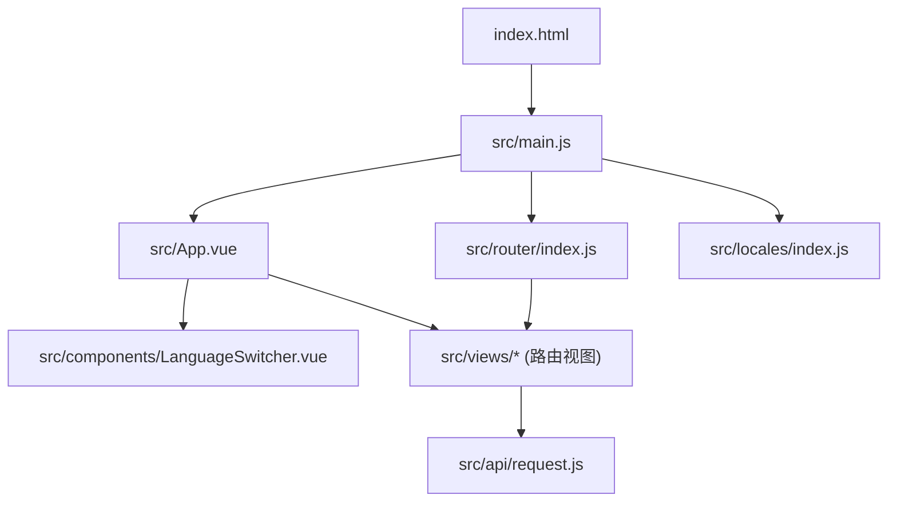
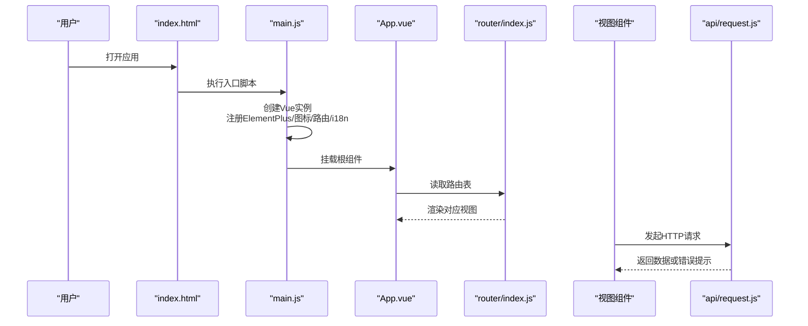
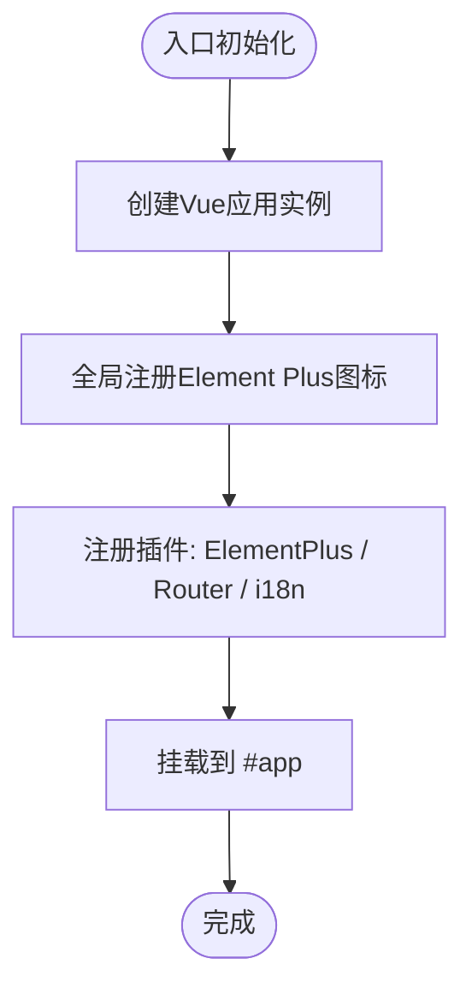
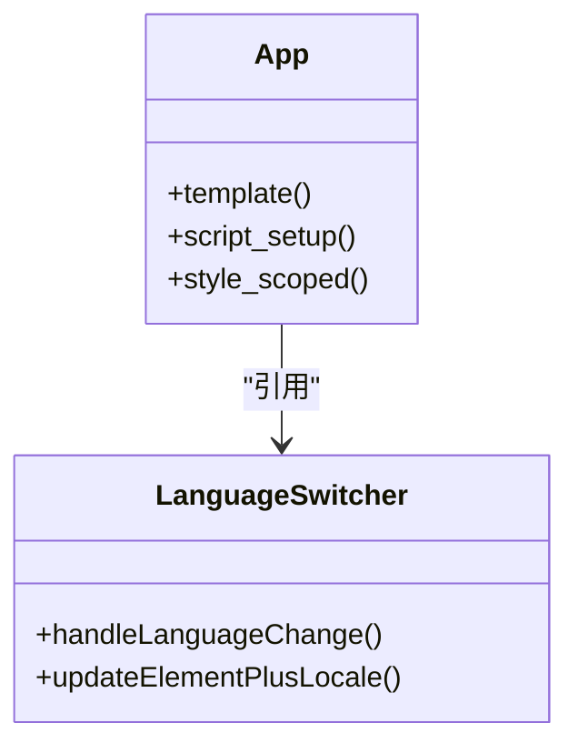
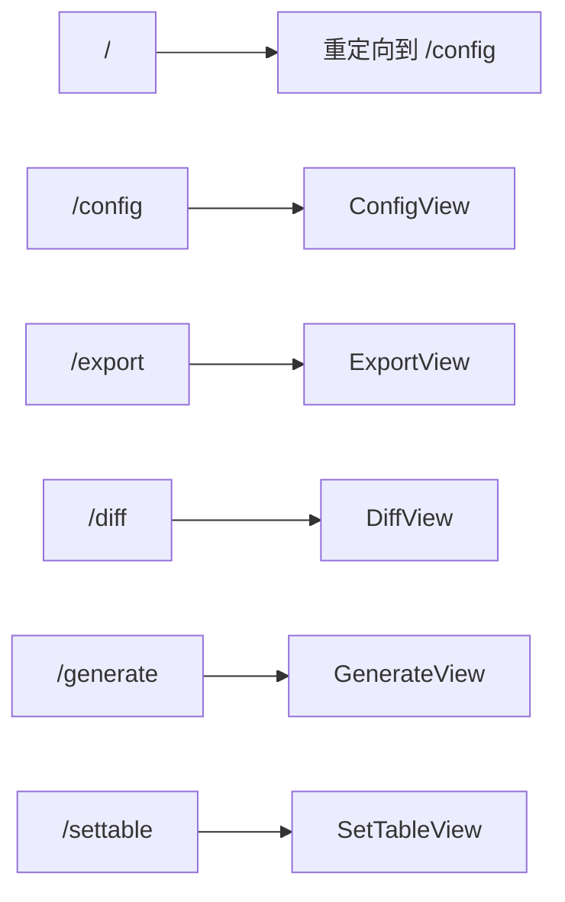
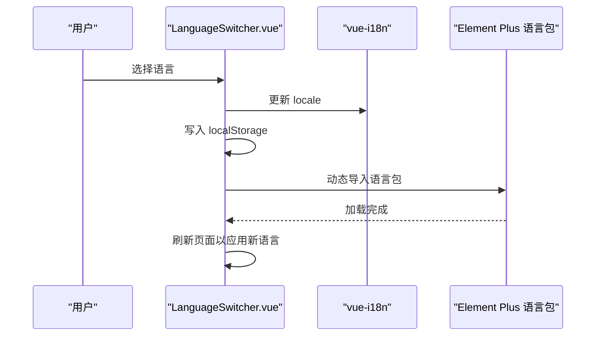
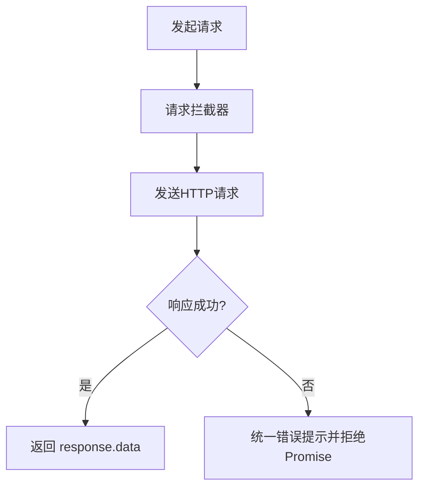
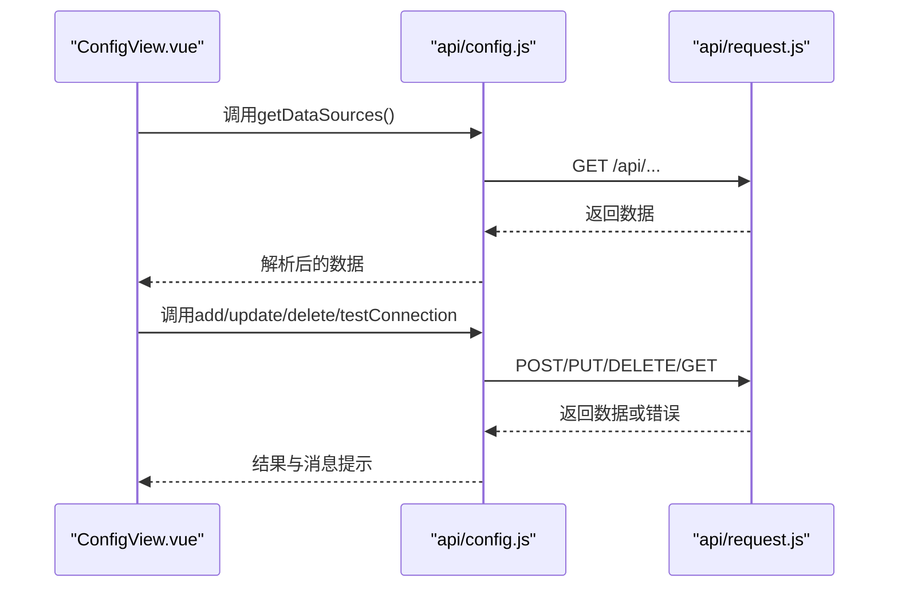

# 应用架构概览

<cite>
**本文引用的文件**   
- [package.json](file://schemasync-frontend/package.json)
- [vite.config.js](file://schemasync-frontend/vite.config.js)
- [index.html](file://schemasync-frontend/index.html)
- [main.js](file://schemasync-frontend/src/main.js)
- [App.vue](file://schemasync-frontend/src/App.vue)
- [router/index.js](file://schemasync-frontend/src/router/index.js)
- [locales/index.js](file://schemasync-frontend/src/locales/index.js)
- [components/LanguageSwitcher.vue](file://schemasync-frontend/src/components/LanguageSwitcher.vue)
- [api/request.js](file://schemasync-frontend/src/api/request.js)
- [views/ConfigView.vue](file://schemasync-frontend/src/views/ConfigView.vue)
- [README.md](file://schemasync-frontend/README.md)
</cite>

## 目录
1. [简介](#简介)
2. [项目结构](#项目结构)
3. [核心组件](#核心组件)
4. [架构总览](#架构总览)
5. [详细组件分析](#详细组件分析)
6. [依赖与构建分析](#依赖与构建分析)
7. [性能与可维护性建议](#性能与可维护性建议)
8. [故障排查指南](#故障排查指南)
9. [结论](#结论)

## 简介
本文件面向SchemaSync前端应用，基于Vue 3 + Vite + Element Plus技术栈，提供整体架构与设计思路的概览。内容涵盖入口初始化流程、根组件布局与样式管理、路由与国际化配置、Vite构建与开发服务器设置、依赖管理与脚本命令，以及目录结构与模块组织原则，帮助开发者快速理解并高效扩展本项目。

## 项目结构
前端采用按功能域划分的目录组织方式：
- src/api：HTTP客户端封装与API接口定义
- src/components：通用业务组件（如语言切换）
- src/locales：多语言资源与i18n初始化
- src/router：路由表与历史模式配置
- src/views：页面级视图组件
- 根目录：入口HTML、Vite配置、包描述与说明文档

图表来源
- [index.html:1-14](file://schemasync-frontend/index.html#L1-L14)
- [main.js:1-20](file://schemasync-frontend/src/main.js#L1-L20)
- [App.vue:1-115](file://schemasync-frontend/src/App.vue#L1-L115)
- [router/index.js:1-46](file://schemasync-frontend/src/router/index.js#L1-L46)
- [locales/index.js:1-26](file://schemasync-frontend/src/locales/index.js#L1-L26)
- [components/LanguageSwitcher.vue:1-76](file://schemasync-frontend/src/components/LanguageSwitcher.vue#L1-L76)
- [api/request.js:1-31](file://schemasync-frontend/src/api/request.js#L1-L31)

章节来源
- [README.md:42-63](file://schemasync-frontend/README.md#L42-L63)

## 核心组件
- 应用入口 main.js
  - 创建Vue应用实例
  - 全局注册Element Plus及其图标
  - 挂载路由与国际化插件
  - 挂载到DOM节点
- 根组件 App.vue
  - 使用Element Plus容器布局（头部、侧边栏、主区域、底部）
  - 集成菜单与路由视图
  - 引入语言切换组件
  - 通过i18n进行文案渲染
  - 包含全局布局样式（渐变头部、侧边菜单、主背景、页脚）
- 路由 router/index.js
  - 使用History模式
  - 定义首页重定向与功能页面路由
- 国际化 locales/index.js
  - 支持中文与英文
  - 从本地存储或浏览器环境获取当前语言
  - 默认回退为中文
- 语言切换 LanguageSwitcher.vue
  - 下拉选择语言
  - 更新i18n locale并持久化
  - 动态加载Element Plus语言包并刷新页面以生效
- HTTP请求 api/request.js
  - 基于Axios创建实例
  - 统一baseURL与超时
  - 响应拦截器返回data并统一错误提示

章节来源
- [main.js:1-20](file://schemasync-frontend/src/main.js#L1-L20)
- [App.vue:1-115](file://schemasync-frontend/src/App.vue#L1-L115)
- [router/index.js:1-46](file://schemasync-frontend/src/router/index.js#L1-L46)
- [locales/index.js:1-26](file://schemasync-frontend/src/locales/index.js#L1-L26)
- [components/LanguageSwitcher.vue:1-76](file://schemasync-frontend/src/components/LanguageSwitcher.vue#L1-L76)
- [api/request.js:1-31](file://schemasync-frontend/src/api/request.js#L1-L31)

## 架构总览
前端采用“单入口 + 模块化”的轻量架构：
- 入口层：index.html 引入 main.js
- 初始化层：main.js 装配UI库、图标、路由、国际化
- 布局层：App.vue 提供全局布局与导航
- 路由层：router/index.js 映射路径到视图
- 视图层：views/* 承载具体业务页面
- 服务层：api/* 封装网络请求与错误处理
- 国际化层：locales/* 提供多语言资源与切换逻辑

图表来源
- [index.html:1-14](file://schemasync-frontend/index.html#L1-L14)
- [main.js:1-20](file://schemasync-frontend/src/main.js#L1-L20)
- [App.vue:1-115](file://schemasync-frontend/src/App.vue#L1-L115)
- [router/index.js:1-46](file://schemasync-frontend/src/router/index.js#L1-L46)
- [api/request.js:1-31](file://schemasync-frontend/src/api/request.js#L1-L31)

## 详细组件分析

### 入口初始化流程（main.js）
- 创建应用实例后，遍历注册所有Element Plus图标，便于在模板中直接使用
- 依次调用use(ElementPlus)、use(router)、use(i18n)完成插件挂载
- 最后将应用挂载到#app节点

图表来源
- [main.js:1-20](file://schemasync-frontend/src/main.js#L1-L20)

章节来源
- [main.js:1-20](file://schemasync-frontend/src/main.js#L1-L20)

### 根组件与全局样式（App.vue）
- 布局结构：el-container/el-header/el-aside/el-main/el-footer
- 顶部：应用名称与副标题，右侧语言切换组件
- 左侧：菜单项绑定路由，图标来自@element-plus/icons-vue
- 主区域：router-view渲染当前路由视图
- 底部：版权信息
- 样式：使用scoped样式控制布局、渐变色头部、主背景与页脚

图表来源
- [App.vue:1-115](file://schemasync-frontend/src/App.vue#L1-L115)
- [components/LanguageSwitcher.vue:1-76](file://schemasync-frontend/src/components/LanguageSwitcher.vue#L1-L76)

章节来源
- [App.vue:1-115](file://schemasync-frontend/src/App.vue#L1-L115)

### 路由配置（router/index.js）
- 使用createWebHistory模式
- 定义首页重定向至配置页
- 为各功能页面声明路由与组件映射

图表来源
- [router/index.js:1-46](file://schemasync-frontend/src/router/index.js#L1-L46)

章节来源
- [router/index.js:1-46](file://schemasync-frontend/src/router/index.js#L1-L46)

### 国际化与语言切换（locales/index.js + LanguageSwitcher.vue）
- 初始化i18n，支持zh-CN与en-US，默认语言从本地存储或浏览器环境推断
- 语言切换组件：
  - 监听下拉选择事件
  - 更新locale并写入localStorage
  - 动态导入Element Plus语言包并刷新页面以应用新语言

图表来源
- [locales/index.js:1-26](file://schemasync-frontend/src/locales/index.js#L1-L26)
- [components/LanguageSwitcher.vue:1-76](file://schemasync-frontend/src/components/LanguageSwitcher.vue#L1-L76)

章节来源
- [locales/index.js:1-26](file://schemasync-frontend/src/locales/index.js#L1-L26)
- [components/LanguageSwitcher.vue:1-76](file://schemasync-frontend/src/components/LanguageSwitcher.vue#L1-L76)

### HTTP请求封装（api/request.js）
- 基于axios创建实例，统一baseURL与超时
- 请求拦截器：透传配置
- 响应拦截器：返回response.data，并在错误时统一提示

图表来源
- [api/request.js:1-31](file://schemasync-frontend/src/api/request.js#L1-L31)

章节来源
- [api/request.js:1-31](file://schemasync-frontend/src/api/request.js#L1-L31)

### 示例视图：数据源配置（views/ConfigView.vue）
- 展示数据源列表，支持新增、编辑、删除与连接测试
- 表单校验与异步操作结合，统一使用ElMessage反馈结果
- 通过api/config调用后端接口（由request.js统一封装）

图表来源
- [views/ConfigView.vue:1-344](file://schemasync-frontend/src/views/ConfigView.vue#L1-L344)
- [api/request.js:1-31](file://schemasync-frontend/src/api/request.js#L1-L31)

章节来源
- [views/ConfigView.vue:1-344](file://schemasync-frontend/src/views/ConfigView.vue#L1-L344)

## 依赖与构建分析

### 依赖与脚本（package.json）
- 运行时依赖：
  - vue、vue-router、vue-i18n、element-plus、@element-plus/icons-vue、axios
- 开发依赖：
  - vite、@vitejs/plugin-vue、sass
- 脚本命令：
  - dev：启动开发服务器
  - build：生产构建
  - preview：预览构建产物

章节来源
- [package.json:1-25](file://schemasync-frontend/package.json#L1-L25)

### Vite构建与开发服务器（vite.config.js）
- 启用Vue插件
- 开发服务器：
  - 端口：3000
  - 代理：将/api前缀请求转发至后端目标地址，开启跨域变更
- 构建产物输出目录遵循Vite默认约定（dist）

章节来源
- [vite.config.js:1-17](file://schemasync-frontend/vite.config.js#L1-L17)

### 入口HTML（index.html）
- 指定语言与图标
- 挂载#app节点
- 以ESM方式引入src/main.js

章节来源
- [index.html:1-14](file://schemasync-frontend/index.html#L1-L14)

## 性能与可维护性建议
- 按需引入与Tree Shaking
  - 若后续组件增多，建议对Element Plus与图标按需引入，减少首屏体积
- 路由懒加载
  - 对大型视图组件使用动态import实现路由级代码分割，降低初始加载时间
- 缓存策略
  - 对静态资源与API响应合理设置缓存头，提升二次访问速度
- 国际化优化
  - 语言包可按页面拆分并按需加载，避免一次性加载全部语言资源
- 错误边界与重试
  - 在网络异常场景增加重试与降级策略，提升用户体验

[本节为通用建议，不直接分析具体文件]

## 故障排查指南
- 开发服务器无法访问
  - 检查端口占用与防火墙设置；确认vite.config.js中的server.port与proxy.target配置
- 接口请求失败
  - 确认后端服务已启动且端口可达；检查代理规则是否匹配请求路径前缀
  - 查看浏览器控制台与Network面板的错误信息
- 国际化未生效
  - 确认localStorage中language键值有效；检查语言包是否正确导出与挂载
- 图标不显示
  - 确认已在入口全局注册图标；检查组件内使用的图标名是否存在

章节来源
- [vite.config.js:1-17](file://schemasync-frontend/vite.config.js#L1-L17)
- [api/request.js:1-31](file://schemasync-frontend/src/api/request.js#L1-L31)
- [locales/index.js:1-26](file://schemasync-frontend/src/locales/index.js#L1-L26)
- [main.js:1-20](file://schemasync-frontend/src/main.js#L1-L20)

## 结论
SchemaSync前端采用清晰的模块化架构与现代化的构建工具链，通过Vue 3组合式API、Element Plus UI库、Vue Router与vue-i18n构建了易扩展的前端应用。入口初始化流程简洁明确，根组件提供稳定的全局布局，路由与国际化配置完善，Vite提供了高效的开发与构建体验。建议在后续迭代中逐步引入按需引入、路由懒加载与更细粒度的错误处理，以进一步提升性能与可维护性。