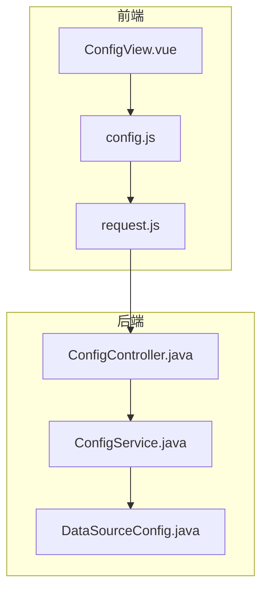
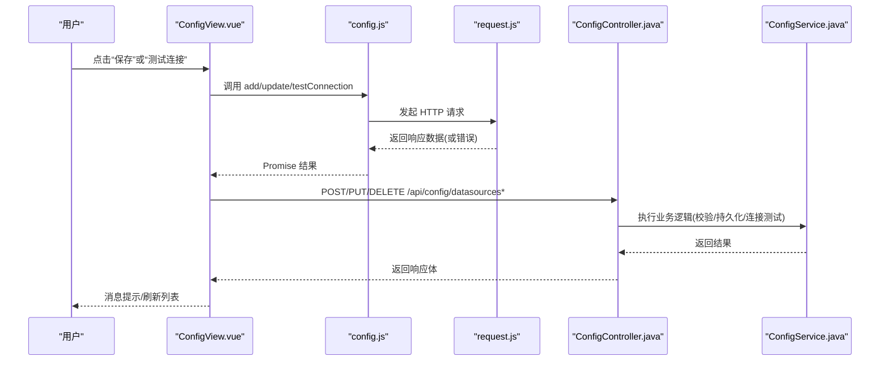
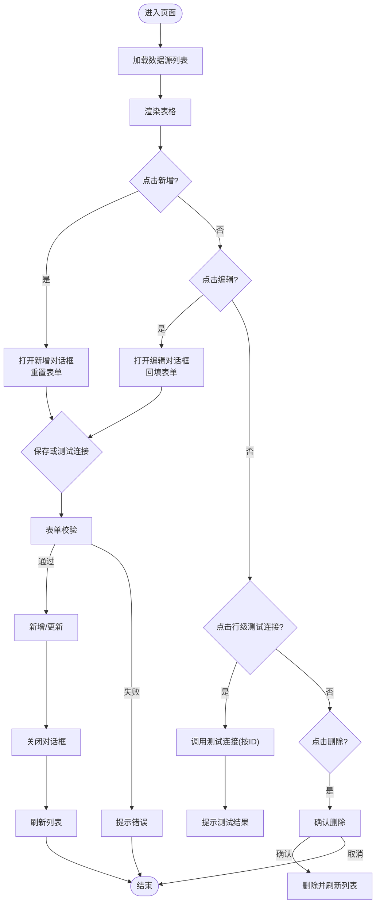
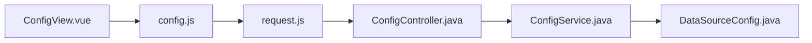

# ConfigView数据源配置页面

<cite>
**本文引用的文件**
- [ConfigView.vue](file://schemasync-frontend/src/views/ConfigView.vue)
- [config.js](file://schemasync-frontend/src/api/config.js)
- [request.js](file://schemasync-frontend/src/api/request.js)
- [DataSourceConfig.java](file://schemasync-backend/src/main/java/com/schemasync/model/config/DataSourceConfig.java)
- [ConfigController.java](file://schemasync-backend/src/main/java/com/schemasync/controller/ConfigController.java)
- [ConfigService.java](file://schemasync-backend/src/main/java/com/schemasync/service/ConfigService.java)
</cite>

## 目录
1. [简介](#简介)
2. [项目结构](#项目结构)
3. [核心组件](#核心组件)
4. [架构总览](#架构总览)
5. [详细组件分析](#详细组件分析)
6. [依赖关系分析](#依赖关系分析)
7. [性能考虑](#性能考虑)
8. [故障排查指南](#故障排查指南)
9. [结论](#结论)
10. [附录](#附录)

## 简介
本文件聚焦于前端“数据源配置”页面（ConfigView）的实现与前后端交互，系统性梳理数据源的增删改查、表单验证、连接测试、删除确认等关键流程；并深入解析 Element Plus 组件使用模式、前端状态管理、错误处理与用户反馈机制，以及高级配置项（JDBC URL 自定义、连接池 JSON 配置）的处理逻辑。

## 项目结构
该功能涉及前端视图、API 封装、后端控制器与服务层：
- 前端视图：ConfigView.vue 负责表格展示、新增/编辑对话框、表单校验、操作按钮事件处理
- API 封装：config.js 提供 REST 接口调用方法；request.js 统一 axios 实例与拦截器
- 后端模型：DataSourceConfig.java 定义数据源字段及默认值
- 后端控制层：ConfigController.java 暴露 /api/config/datasources 系列接口
- 后端服务层：ConfigService.java 实现持久化、校验、连接测试、加密存储等核心逻辑

图表来源
- [ConfigView.vue:1-344](file://schemasync-frontend/src/views/ConfigView.vue#L1-L344)
- [config.js:1-50](file://schemasync-frontend/src/api/config.js#L1-L50)
- [request.js:1-31](file://schemasync-frontend/src/api/request.js#L1-L31)
- [ConfigController.java:1-133](file://schemasync-backend/src/main/java/com/schemasync/controller/ConfigController.java#L1-L133)
- [ConfigService.java:1-383](file://schemasync-backend/src/main/java/com/schemasync/service/ConfigService.java#L1-L383)
- [DataSourceConfig.java:1-129](file://schemasync-backend/src/main/java/com/schemasync/model/config/DataSourceConfig.java#L1-L129)

章节来源
- [ConfigView.vue:1-344](file://schemasync-frontend/src/views/ConfigView.vue#L1-L344)
- [config.js:1-50](file://schemasync-frontend/src/api/config.js#L1-L50)
- [request.js:1-31](file://schemasync-frontend/src/api/request.js#L1-L31)
- [ConfigController.java:1-133](file://schemasync-backend/src/main/java/com/schemasync/controller/ConfigController.java#L1-L133)
- [ConfigService.java:1-383](file://schemasync-backend/src/main/java/com/schemasync/service/ConfigService.java#L1-L383)
- [DataSourceConfig.java:1-129](file://schemasync-backend/src/main/java/com/schemasync/model/config/DataSourceConfig.java#L1-L129)

## 核心组件
- 列表展示与操作
  - 使用 el-table 绑定 dataSources 数组，列定义包含 ID、名称、类型、主机、端口、数据库名，以及操作列（测试连接、编辑、删除）
  - 通过 v-loading 在加载期间显示全局 loading
- 新增/编辑对话框
  - 使用 el-dialog 控制显隐，动态标题区分新增/编辑
  - 使用 el-form + el-form-item 组织表单，绑定 form 对象与 rules 规则
  - 支持基础字段与高级配置（JDBC URL、连接池 JSON）
- 表单验证
  - 必填项：名称、类型、主机、端口、数据库名、用户名
  - 计算属性 isFormValid 用于控制“测试连接”按钮可用性
- 连接测试
  - 支持两种模式：对已保存配置按 ID 测试；对临时配置对象直接测试
  - 成功时提示结果，失败时给出错误信息
- 删除确认
  - 使用 ElMessageBox.confirm 二次确认后再执行删除
- 状态管理
  - dataSources、loading、dialogVisible、form、testingConnection、isEditMode 等响应式变量驱动 UI 更新
  - 异步请求完成后刷新列表

章节来源
- [ConfigView.vue:14-28](file://schemasync-frontend/src/views/ConfigView.vue#L14-L28)
- [ConfigView.vue:32-107](file://schemasync-frontend/src/views/ConfigView.vue#L32-L107)
- [ConfigView.vue:117-163](file://schemasync-frontend/src/views/ConfigView.vue#L117-L163)
- [ConfigView.vue:236-266](file://schemasync-frontend/src/views/ConfigView.vue#L236-L266)
- [ConfigView.vue:301-325](file://schemasync-frontend/src/views/ConfigView.vue#L301-L325)

## 架构总览
以下序列图展示了从前端到后端的完整数据流，包括新增/编辑保存与连接测试两个典型场景。

图表来源
- [ConfigView.vue:275-299](file://schemasync-frontend/src/views/ConfigView.vue#L275-L299)
- [config.js:13-39](file://schemasync-frontend/src/api/config.js#L13-L39)
- [request.js:19-28](file://schemasync-frontend/src/api/request.js#L19-L28)
- [ConfigController.java:63-131](file://schemasync-backend/src/main/java/com/schemasync/controller/ConfigController.java#L63-L131)
- [ConfigService.java:133-271](file://schemasync-backend/src/main/java/com/schemasync/service/ConfigService.java#L133-L271)

## 详细组件分析

### 前端视图：ConfigView.vue
- 表格展示
  - 数据绑定：el-table :data="dataSources"
  - 列定义：id/name/type/host/port/database 对应后端字段
  - 操作列：测试连接、编辑、删除
- 对话框与表单
  - el-dialog v-model 控制显隐，标题根据新增/编辑切换
  - el-form 绑定 model 与 rules，ref 引用用于 validate/clear/reset
  - 高级配置区：JDBC URL 文本域、连接池 JSON 文本域
- 状态与生命周期
  - onMounted 初始化加载列表
  - loading 控制表格加载态
  - testingConnection 控制“测试连接”按钮 loading
  - isEditMode 标记当前为新增还是编辑
- 表单验证
  - 必填规则：name/type/host/port/database/username
  - 计算属性 isFormValid 用于禁用未填写必要字段的“测试连接”
- 业务逻辑
  - showAddDialog/showEditDialog：打开对话框并重置/填充表单
  - handleSave：先校验表单，再根据模式调用新增或更新接口，成功后关闭对话框并刷新列表
  - testConnectionInForm：在表单内触发连接测试，优先校验必填项
  - testConn：对已有行进行连接测试
  - handleDelete：二次确认后删除并刷新列表

图表来源
- [ConfigView.vue:165-176](file://schemasync-frontend/src/views/ConfigView.vue#L165-L176)
- [ConfigView.vue:178-234](file://schemasync-frontend/src/views/ConfigView.vue#L178-L234)
- [ConfigView.vue:275-299](file://schemasync-frontend/src/views/ConfigView.vue#L275-L299)
- [ConfigView.vue:301-325](file://schemasync-frontend/src/views/ConfigView.vue#L301-L325)

章节来源
- [ConfigView.vue:1-344](file://schemasync-frontend/src/views/ConfigView.vue#L1-L344)

### 前端 API 封装：config.js 与 request.js
- config.js
  - getDataSources/getDataSource/addDataSource/updateDataSource/deleteDataSource/testConnection
  - testConnection 支持两种入参：字符串（配置ID）或对象（临时配置）
- request.js
  - 基于 axios 创建实例，设置 baseURL 与超时
  - 响应拦截器统一返回 response.data，并在错误时弹出全局错误提示

章节来源
- [config.js:1-50](file://schemasync-frontend/src/api/config.js#L1-L50)
- [request.js:1-31](file://schemasync-frontend/src/api/request.js#L1-L31)

### 后端模型：DataSourceConfig.java
- 字段说明
  - id/name/type/host/port/database/username/password
  - charset/timeout 带默认值
  - jdbcUrl/poolConfig 支持高级配置
  - createTime/updateTime 时间格式化
  - supportsSchema 非持久化标识，由适配器动态设置
- 设计要点
  - 密码采用加密存储
  - 支持可选的 JDBC URL 覆盖自动拼接
  - 连接池配置以 JSON 字符串形式传递

章节来源
- [DataSourceConfig.java:1-129](file://schemasync-backend/src/main/java/com/schemasync/model/config/DataSourceConfig.java#L1-L129)

### 后端控制层：ConfigController.java
- 路由
  - GET /api/config/datasources：获取全部，并为每个配置注入 supportsSchema
  - GET /api/config/datasources/{id}：按 ID 获取
  - POST /api/config/datasources：新增
  - PUT /api/config/datasources/{id}：更新
  - DELETE /api/config/datasources/{id}：删除
  - POST /api/config/datasources/test：测试连接（支持 configId 或完整配置对象）
- 测试连接分支
  - 若传入 configId：调用服务层按 ID 测试
  - 否则：将请求体映射为临时配置对象，交由服务层校验并测试

章节来源
- [ConfigController.java:33-131](file://schemasync-backend/src/main/java/com/schemasync/controller/ConfigController.java#L33-L131)

### 后端服务层：ConfigService.java
- 配置持久化
  - 启动时加载配置文件，内存缓存 Map<String, DataSourceConfig>
  - 新增/更新/删除后写回配置文件
- 参数校验与默认值
  - 新增时校验必填字段并设置默认端口/字符集/超时
  - 生成唯一 ID（如不存在）
- 安全
  - 写入前对明文密码进行加密，读取时按需解密
- 连接测试
  - testConnection(configId)：按 ID 查找并测试
  - testConnectionWithConfig(config)：对临时配置进行校验、连接测试，成功时尝试获取数据库版本信息
- 内部实现
  - 通过 DatabaseAdapterFactory 获取具体数据库适配器，建立连接并 isValid 检查
  - 异常捕获并记录日志

章节来源
- [ConfigService.java:44-101](file://schemasync-backend/src/main/java/com/schemasync/service/ConfigService.java#L44-L101)
- [ConfigService.java:133-213](file://schemasync-backend/src/main/java/com/schemasync/service/ConfigService.java#L133-L213)
- [ConfigService.java:221-271](file://schemasync-backend/src/main/java/com/schemasync/service/ConfigService.java#L221-L271)
- [ConfigService.java:302-334](file://schemasync-backend/src/main/java/com/schemasync/service/ConfigService.java#L302-L334)

## 依赖关系分析
- 前端模块依赖
  - ConfigView.vue 依赖 config.js 提供的 API 方法
  - config.js 依赖 request.js 的 axios 实例
- 前后端契约
  - 路径：/api/config/datasources*
  - 请求体：新增/更新使用 DataSourceConfig 字段；测试连接支持 {configId} 或完整配置对象
  - 响应体：统一包装在 response.data 中返回

图表来源
- [ConfigView.vue:115-116](file://schemasync-frontend/src/views/ConfigView.vue#L115-L116)
- [config.js:1-50](file://schemasync-frontend/src/api/config.js#L1-L50)
- [request.js:1-31](file://schemasync-frontend/src/api/request.js#L1-L31)
- [ConfigController.java:1-133](file://schemasync-backend/src/main/java/com/schemasync/controller/ConfigController.java#L1-L133)
- [ConfigService.java:1-383](file://schemasync-backend/src/main/java/com/schemasync/service/ConfigService.java#L1-L383)
- [DataSourceConfig.java:1-129](file://schemasync-backend/src/main/java/com/schemasync/model/config/DataSourceConfig.java#L1-L129)

章节来源
- [ConfigView.vue:115-116](file://schemasync-frontend/src/views/ConfigView.vue#L115-L116)
- [config.js:1-50](file://schemasync-frontend/src/api/config.js#L1-L50)
- [request.js:1-31](file://schemasync-frontend/src/api/request.js#L1-L31)
- [ConfigController.java:1-133](file://schemasync-backend/src/main/java/com/schemasync/controller/ConfigController.java#L1-L133)
- [ConfigService.java:1-383](file://schemasync-backend/src/main/java/com/schemasync/service/ConfigService.java#L1-L383)
- [DataSourceConfig.java:1-129](file://schemasync-backend/src/main/java/com/schemasync/model/config/DataSourceConfig.java#L1-L129)

## 性能考虑
- 列表加载
  - 使用 v-loading 提升用户体验，避免重复请求
- 连接测试
  - 服务端连接超时控制在合理范围，避免长时间阻塞
- 表单校验
  - 在提交前集中校验，减少无效网络请求
- 资源释放
  - 连接测试成功后及时关闭连接，避免资源泄漏

[本节为通用建议，不直接分析具体文件]

## 故障排查指南
- 前端错误提示
  - 全局错误拦截：当请求失败时，request.js 会弹出错误消息
  - 局部错误处理：保存/测试连接等异步操作 catch 分支中给出明确提示
- 常见错误定位
  - 表单未通过校验：检查必填项是否填写，观察 isFormValid 状态
  - 连接失败：核对主机、端口、数据库名、用户名、密码；必要时使用“测试连接”快速验证
  - 删除误操作：确认弹窗后再执行删除
- 后端问题定位
  - 查看服务日志，关注连接测试异常与配置文件读写异常
  - 检查密码加密/解密流程是否正常

章节来源
- [request.js:19-28](file://schemasync-frontend/src/api/request.js#L19-L28)
- [ConfigView.vue:236-266](file://schemasync-frontend/src/views/ConfigView.vue#L236-L266)
- [ConfigView.vue:275-299](file://schemasync-frontend/src/views/ConfigView.vue#L275-L299)
- [ConfigService.java:264-271](file://schemasync-backend/src/main/java/com/schemasync/service/ConfigService.java#L264-L271)
- [ConfigService.java:377-381](file://schemasync-backend/src/main/java/com/schemasync/service/ConfigService.java#L377-L381)

## 结论
ConfigView 数据源配置页面通过清晰的组件分层与前后端契约，实现了数据源的完整 CRUD 能力与连接测试、删除确认等关键交互。Element Plus 组件的使用规范、响应式状态管理与统一的错误处理策略，共同保障了良好的用户体验与可维护性。高级配置项（JDBC URL、连接池 JSON）为复杂场景提供了扩展空间。

[本节为总结性内容，不直接分析具体文件]

## 附录

### Element Plus 组件使用模式速览
- el-table
  - 数据绑定：:data="dataSources"
  - 列定义：el-table-column prop 对应字段
  - 操作列：template #default 插槽内放置按钮
- el-form
  - 表单绑定：:model="form"
  - 校验规则：:rules="formRules"
  - 表单引用：ref="formRef" 用于 validate/clear/resetFields
- el-dialog
  - 显隐控制：v-model="dialogVisible"
  - 动态标题：:title="dialogTitle"
  - 底部操作：footer 插槽放置按钮

章节来源
- [ConfigView.vue:14-28](file://schemasync-frontend/src/views/ConfigView.vue#L14-L28)
- [ConfigView.vue:32-107](file://schemasync-frontend/src/views/ConfigView.vue#L32-L107)
- [ConfigView.vue:117-163](file://schemasync-frontend/src/views/ConfigView.vue#L117-L163)

### 表单验证规则与自定义方法
- 内置规则
  - required、message、trigger 组合实现必填与触发时机
- 自定义方法
  - 可在 formRules 中扩展正则、长度、格式等校验
  - 可通过 computed 属性（如 isFormValid）聚合判断，控制按钮可用状态

章节来源
- [ConfigView.vue:137-163](file://schemasync-frontend/src/views/ConfigView.vue#L137-L163)

### 高级配置选项处理逻辑
- JDBC URL 自定义
  - 前端提供文本域输入，允许覆盖自动生成 URL
  - 后端接收 jdbcUrl 字段，若存在则优先使用
- 连接池配置 JSON 解析
  - 前端以 JSON 字符串形式输入
  - 后端以字符串字段接收，后续可按需解析为连接池参数

章节来源
- [ConfigView.vue:72-92](file://schemasync-frontend/src/views/ConfigView.vue#L72-L92)
- [DataSourceConfig.java:69-79](file://schemasync-backend/src/main/java/com/schemasync/model/config/DataSourceConfig.java#L69-L79)
- [ConfigController.java:118-121](file://schemasync-backend/src/main/java/com/schemasync/controller/ConfigController.java#L118-L121)