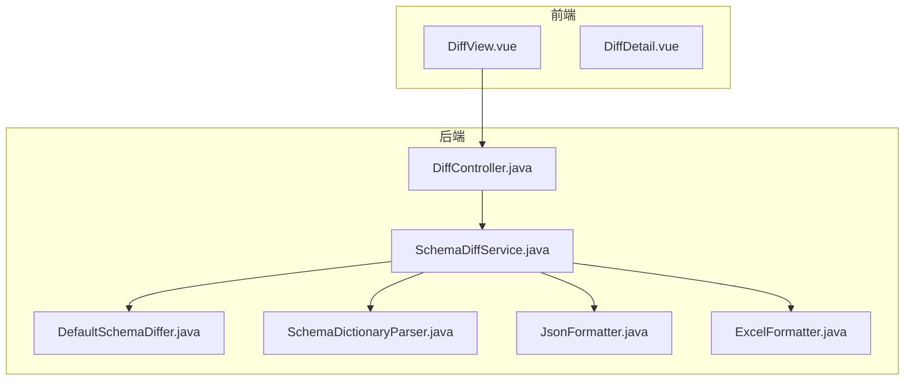
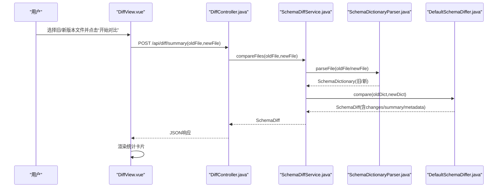
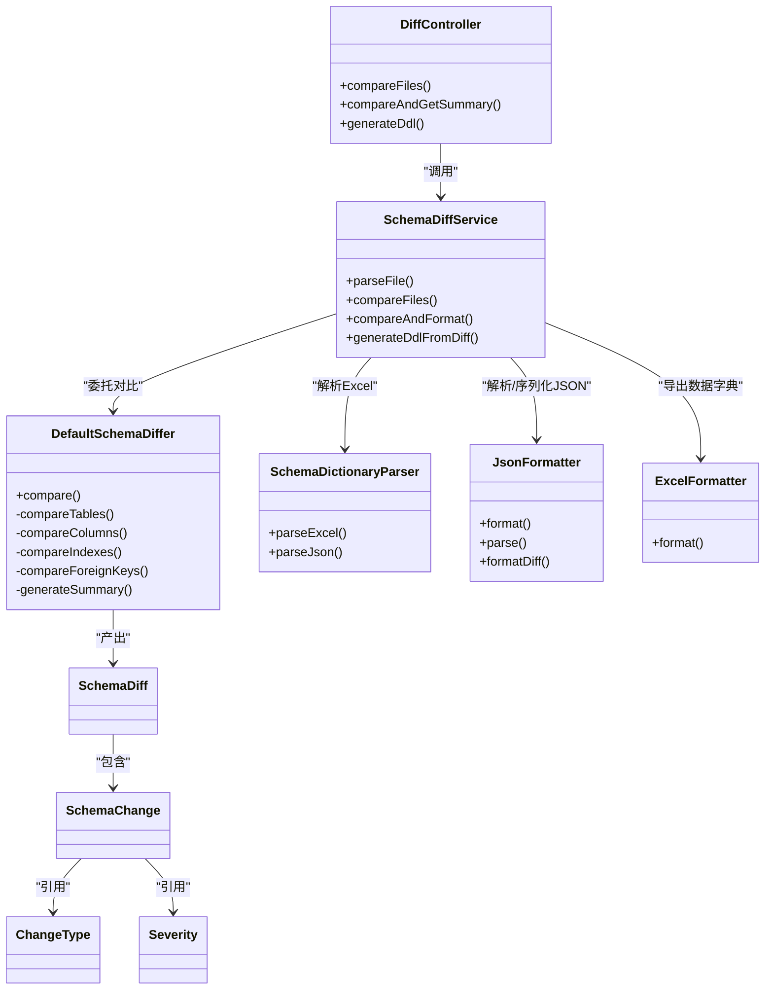

# DiffView版本差异对比页面

<cite>
**本文引用的文件列表**
- [DiffView.vue](file://schemasync-frontend/src/views/DiffView.vue)
- [DiffDetail.vue](file://schemasync-frontend/src/components/DiffDetail.vue)
- [DiffController.java](file://schemasync-backend/src/main/java/com/schemasync/controller/DiffController.java)
- [SchemaDiffService.java](file://schemasync-backend/src/main/java/com/schemasync/service/SchemaDiffService.java)
- [DefaultSchemaDiffer.java](file://schemasync-backend/src/main/java/com/schemasync/differ/DefaultSchemaDiffer.java)
- [SchemaDictionaryParser.java](file://schemasync-backend/src/main/java/com/schemasync/service/SchemaDictionaryParser.java)
- [JsonFormatter.java](file://schemasync-backend/src/main/java/com/schemasync/formatter/JsonFormatter.java)
- [ExcelFormatter.java](file://schemasync-backend/src/main/java/com/schemasync/formatter/ExcelFormatter.java)
- [SchemaDiff.java](file://schemasync-backend/src/main/java/com/schemasync/model/diff/SchemaDiff.java)
- [SchemaChange.java](file://schemasync-backend/src/main/java/com/schemasync/model/diff/SchemaChange.java)
- [ChangeType.java](file://schemasync-backend/src/main/java/com/schemasync/model/diff/ChangeType.java)
- [Severity.java](file://schemasync-backend/src/main/java/com/schemasync/model/diff/Severity.java)
</cite>

## 目录
1. [简介](#简介)
2. [项目结构](#项目结构)
3. [核心组件](#核心组件)
4. [架构总览](#架构总览)
5. [详细组件分析](#详细组件分析)
6. [依赖关系分析](#依赖关系分析)
7. [性能与可扩展性](#性能与可扩展性)
8. [故障排查指南](#故障排查指南)
9. [结论](#结论)

## 简介
本文件围绕“DiffView版本差异对比页面”进行系统化文档化，覆盖前端上传与解析、后端对比与导出、可视化展示、子组件复用机制、结果分析与用户体验优化等关键主题。重点说明：
- 多文件上传（当前实现为两个独立选择器）与后续对比流程
- JSON/Excel双格式解析与验证
- 差异类型标识、破坏性变更高亮、按表分组展示
- DiffDetail子组件的props与事件通信
- 差异统计、影响范围评估、DDL脚本生成
- 加载进度、错误提示与缓存策略建议

## 项目结构
前后端分离架构：
- 前端：Vue 3 + Element Plus，提供DiffView主视图与DiffDetail详情组件
- 后端：Spring Boot控制器与服务层，负责文件解析、差异计算、格式化输出与DDL生成



图表来源
- [DiffView.vue:1-313](file://schemasync-frontend/src/views/DiffView.vue#L1-L313)
- [DiffDetail.vue:1-125](file://schemasync-frontend/src/components/DiffDetail.vue#L1-L125)
- [DiffController.java:1-108](file://schemasync-backend/src/main/java/com/schemasync/controller/DiffController.java#L1-L108)
- [SchemaDiffService.java:1-800](file://schemasync-backend/src/main/java/com/schemasync/service/SchemaDiffService.java#L1-L800)
- [DefaultSchemaDiffer.java:1-512](file://schemasync-backend/src/main/java/com/schemasync/differ/DefaultSchemaDiffer.java#L1-L512)
- [SchemaDictionaryParser.java:1-330](file://schemasync-backend/src/main/java/com/schemasync/service/SchemaDictionaryParser.java#L1-L330)
- [JsonFormatter.java:1-119](file://schemasync-backend/src/main/java/com/schemasync/formatter/JsonFormatter.java#L1-L119)
- [ExcelFormatter.java:1-408](file://schemasync-backend/src/main/java/com/schemasync/formatter/ExcelFormatter.java#L1-L408)

章节来源
- [DiffView.vue:1-313](file://schemasync-frontend/src/views/DiffView.vue#L1-L313)
- [DiffDetail.vue:1-125](file://schemasync-frontend/src/components/DiffDetail.vue#L1-L125)
- [DiffController.java:1-108](file://schemasync-backend/src/main/java/com/schemasync/controller/DiffController.java#L1-L108)
- [SchemaDiffService.java:1-800](file://schemasync-backend/src/main/java/com/schemasync/service/SchemaDiffService.java#L1-L800)

## 核心组件
- DiffView.vue：承载上传表单、对比触发、统计展示、下载差异报告与生成DDL脚本
- DiffDetail.vue：以折叠面板+表格形式按表分组展示差异明细，支持返回事件
- DiffController.java：对外暴露三个接口：差异导出、差异统计、DDL生成
- SchemaDiffService.java：串联解析、对比、格式化与DDL生成
- DefaultSchemaDiffer.java：实现表/字段/索引/外键的对比逻辑与严重级别判定
- SchemaDictionaryParser.java：从Excel反向解析为内部数据模型
- JsonFormatter.java：JSON序列化/反序列化
- ExcelFormatter.java：Excel导出（用于数据字典导出，对比导出使用简单表格路径）

章节来源
- [DiffView.vue:1-313](file://schemasync-frontend/src/views/DiffView.vue#L1-L313)
- [DiffDetail.vue:1-125](file://schemasync-frontend/src/components/DiffDetail.vue#L1-L125)
- [DiffController.java:1-108](file://schemasync-backend/src/main/java/com/schemasync/controller/DiffController.java#L1-L108)
- [SchemaDiffService.java:1-800](file://schemasync-backend/src/main/java/com/schemasync/service/SchemaDiffService.java#L1-L800)
- [DefaultSchemaDiffer.java:1-512](file://schemasync-backend/src/main/java/com/schemasync/differ/DefaultSchemaDiffer.java#L1-L512)
- [SchemaDictionaryParser.java:1-330](file://schemasync-backend/src/main/java/com/schemasync/service/SchemaDictionaryParser.java#L1-L330)
- [JsonFormatter.java:1-119](file://schemasync-backend/src/main/java/com/schemasync/formatter/JsonFormatter.java#L1-L119)
- [ExcelFormatter.java:1-408](file://schemasync-backend/src/main/java/com/schemasync/formatter/ExcelFormatter.java#L1-L408)

## 架构总览
以下序列图展示了“开始对比”到“返回统计信息”的端到端调用链。



图表来源
- [DiffView.vue:132-160](file://schemasync-frontend/src/views/DiffView.vue#L132-L160)
- [DiffController.java:64-76](file://schemasync-backend/src/main/java/com/schemasync/controller/DiffController.java#L64-L76)
- [SchemaDiffService.java:77-104](file://schemasync-backend/src/main/java/com/schemasync/service/SchemaDiffService.java#L77-L104)
- [SchemaDictionaryParser.java:42-81](file://schemasync-backend/src/main/java/com/schemasync/service/SchemaDictionaryParser.java#L42-L81)
- [DefaultSchemaDiffer.java:24-52](file://schemasync-backend/src/main/java/com/schemasync/differ/DefaultSchemaDiffer.java#L24-L52)

## 详细组件分析

### 前端：DiffView.vue
- 上传与校验
  - 使用两个独立的el-upload组件分别接收旧/新版本文件，限制数量为1，accept为Excel扩展名
  - 通过arrayBuffer读取文件内容并缓存，避免重复IO
  - 未实现拖拽上传；如需多文件拖拽，可在模板中启用drag属性并在@change中处理多个file对象
- 对比请求
  - 将两个文件封装为FormData，POST至/api/diff/summary获取统计摘要
  - 失败时通过ElMessage提示，成功则渲染统计卡片
- 下载差异报告
  - 调用/api/diff，设置exportFormat=excel，解析响应头Content-Disposition中的文件名后触发浏览器下载
- 生成DDL脚本
  - 调用/api/diff/ddl，携带数据库类型参数，下载SQL文件
- 标签映射
  - 提供变更类型与严重级别的标签映射函数，便于UI渲染

章节来源
- [DiffView.vue:1-313](file://schemasync-frontend/src/views/DiffView.vue#L1-L313)

### 前端：DiffDetail.vue
- Props与事件
  - props.diffData：包含changes数组的差异数据
  - emits：back事件，用于返回上一级视图
- 展示逻辑
  - 使用computed按tableName对changes分组，形成树形层级（表→字段/索引/外键变更）
  - 变更类型与严重级别通过标签显示，BREAKING标记为“破坏性”
  - details字段若为对象，过滤oldDefinition后拼接为可读文本
- 交互
  - el-collapse按表展开/收起，配合小尺寸表格提升信息密度

章节来源
- [DiffDetail.vue:1-125](file://schemasync-frontend/src/components/DiffDetail.vue#L1-L125)

### 后端：DiffController.java
- 接口定义
  - POST /api/diff：导出差异报告（支持JSON/Excel），根据exportFormat决定后缀
  - POST /api/diff/summary：返回SchemaDiff统计与明细
  - POST /api/diff/ddl：基于对比结果生成差异化DDL脚本
- 响应头
  - 统一设置Content-Type为二进制流，并通过Content-Disposition指定文件名

章节来源
- [DiffController.java:1-108](file://schemasync-backend/src/main/java/com/schemasync/controller/DiffController.java#L1-L108)

### 后端：SchemaDiffService.java
- 文件解析
  - 根据文件名后缀判断Excel或JSON，分别走SchemaDictionaryParser或JsonFormatter
- 对比流程
  - 解析旧/新版本SchemaDictionary后，委托DefaultSchemaDiffer执行compare
- 格式化与导出
  - formatDiff/formatDiff(diff,format,newDict)：Excel走简单表格导出，JSON走JsonFormatter
- DDL生成
  - generateDdlFromDiff：解析→对比→按数据库类型生成差异化DDL（MySQL/GaussDB MySQL兼容/GaussDB Oracle兼容）
  - 针对新增/修改字段、索引增删改、表增删等场景生成具体SQL片段
  - 删除类操作默认注释，需人工确认后执行

章节来源
- [SchemaDiffService.java:1-800](file://schemasync-backend/src/main/java/com/schemasync/service/SchemaDiffService.java#L1-L800)

### 后端：DefaultSchemaDiffer.java
- 对比维度
  - 表：新增/删除/修改（修改由字段、索引、外键变化汇总）
  - 字段：新增/删除/修改（合并为一条记录，包含数据类型、长度、精度、小数位、NULL约束、默认值、注释的变化）
  - 索引：新增/删除/修改（忽略PRIMARY索引）
  - 外键：新增/删除
- 严重级别判定
  - 字段类型变更、长度缩小、精度/小数位变更、添加NOT NULL等标记为BREAKING
  - 其余多为NON_BREAKING
- 统计生成
  - 基于changes计数生成DiffSummary（表/字段/索引/外键增减与破坏性变更数量）

章节来源
- [DefaultSchemaDiffer.java:1-512](file://schemasync-backend/src/main/java/com/schemasync/differ/DefaultSchemaDiffer.java#L1-L512)

### 数据模型与枚举
- SchemaDiff：包含diffMetadata、summary、changes
- SchemaChange：包含changeType、tableName、columnName、severity、details及字段新旧属性
- ChangeType：TABLE_ADD/DROP/MODIFY、COLUMN_ADD/DROP/MODIFY、INDEX_ADD/DROP/MODIFY、FOREIGN_KEY_ADD/DROP/MODIFY
- Severity：BREAKING、NON_BREAKING

章节来源
- [SchemaDiff.java:1-35](file://schemasync-backend/src/main/java/com/schemasync/model/diff/SchemaDiff.java#L1-L35)
- [SchemaChange.java:1-181](file://schemasync-backend/src/main/java/com/schemasync/model/diff/SchemaChange.java#L1-L181)
- [ChangeType.java:1-43](file://schemasync-backend/src/main/java/com/schemasync/model/diff/ChangeType.java#L1-L43)
- [Severity.java:1-17](file://schemasync-backend/src/main/java/com/schemasync/model/diff/Severity.java#L1-L17)

### 解析与格式化
- SchemaDictionaryParser：从Excel的六个Sheet（概述信息、表级别信息、字段级别信息、索引信息、约束信息、视图定义）反向构建SchemaDictionary
- JsonFormatter：扁平化SchemaDictionary后序列化为JSON，或从JSON反序列化为SchemaDictionary
- ExcelFormatter：用于数据字典导出（非对比导出），对比导出采用简单表格路径

章节来源
- [SchemaDictionaryParser.java:1-330](file://schemasync-backend/src/main/java/com/schemasync/service/SchemaDictionaryParser.java#L1-L330)
- [JsonFormatter.java:1-119](file://schemasync-backend/src/main/java/com/schemasync/formatter/JsonFormatter.java#L1-L119)
- [ExcelFormatter.java:1-408](file://schemasync-backend/src/main/java/com/schemasync/formatter/ExcelFormatter.java#L1-L408)

## 依赖关系分析


图表来源
- [DiffController.java:1-108](file://schemasync-backend/src/main/java/com/schemasync/controller/DiffController.java#L1-L108)
- [SchemaDiffService.java:1-800](file://schemasync-backend/src/main/java/com/schemasync/service/SchemaDiffService.java#L1-L800)
- [DefaultSchemaDiffer.java:1-512](file://schemasync-backend/src/main/java/com/schemasync/differ/DefaultSchemaDiffer.java#L1-L512)
- [SchemaDictionaryParser.java:1-330](file://schemasync-backend/src/main/java/com/schemasync/service/SchemaDictionaryParser.java#L1-L330)
- [JsonFormatter.java:1-119](file://schemasync-backend/src/main/java/com/schemasync/formatter/JsonFormatter.java#L1-L119)
- [ExcelFormatter.java:1-408](file://schemasync-backend/src/main/java/com/schemasync/formatter/ExcelFormatter.java#L1-L408)
- [SchemaDiff.java:1-35](file://schemasync-backend/src/main/java/com/schemasync/model/diff/SchemaDiff.java#L1-L35)
- [SchemaChange.java:1-181](file://schemasync-backend/src/main/java/com/schemasync/model/diff/SchemaChange.java#L1-L181)
- [ChangeType.java:1-43](file://schemasync-backend/src/main/java/com/schemasync/model/diff/ChangeType.java#L1-L43)
- [Severity.java:1-17](file://schemasync-backend/src/main/java/com/schemasync/model/diff/Severity.java#L1-L17)

## 详细组件分析（代码级）

### 对比流程时序（前端→后端→对比引擎）
```mermaid
sequenceDiagram
participant FE as "DiffView.vue"
participant API as "DiffController.java"
participant SVC as "SchemaDiffService.java"
participant PAR as "SchemaDictionaryParser.java"
participant JF as "JsonFormatter.java"
participant DIFF as "DefaultSchemaDiffer.java"
FE->>API : POST /api/diff/summary (oldFile,newFile)
API->>SVC : compareFiles(oldFile,newFile)
alt Excel
SVC->>PAR : parseExcel(inputStream)
PAR-->>SVC : SchemaDictionary
else JSON
SVC->>JF : parse(bytes)
JF-->>SVC : SchemaDictionary
end
SVC->>DIFF : compare(oldDict,newDict)
DIFF-->>SVC : SchemaDiff
SVC-->>API : SchemaDiff
API-->>FE : JSON
```

图表来源
- [DiffView.vue:132-160](file://schemasync-frontend/src/views/DiffView.vue#L132-L160)
- [DiffController.java:64-76](file://schemasync-backend/src/main/java/com/schemasync/controller/DiffController.java#L64-L76)
- [SchemaDiffService.java:77-104](file://schemasync-backend/src/main/java/com/schemasync/service/SchemaDiffService.java#L77-L104)
- [SchemaDictionaryParser.java:42-81](file://schemasync-backend/src/main/java/com/schemasync/service/SchemaDictionaryParser.java#L42-L81)
- [JsonFormatter.java:61-68](file://schemasync-backend/src/main/java/com/schemasync/formatter/JsonFormatter.java#L61-L68)
- [DefaultSchemaDiffer.java:24-52](file://schemasync-backend/src/main/java/com/schemasync/differ/DefaultSchemaDiffer.java#L24-L52)

### 字段修改合并与严重级别判定流程

```mermaid
flowchart TD
Start(["进入字段对比"]) --> CheckType["比较数据类型"]
CheckType --> TypeChanged{"是否变更?"}
TypeChanged --> |是| MarkBreaking["标记BREAKING"]
TypeChanged --> |否| CheckLen["比较长度"]
MarkBreaking --> CheckLen
CheckLen --> LenDecreased{"长度是否缩小?"}
LenDecreased --> |是| MarkBreaking2["标记BREAKING"]
LenDecreased --> |否| CheckPrec["比较精度"]
MarkBreaking2 --> CheckPrec
CheckPrec --> PrecChanged{"是否变更?"}
PrecChanged --> |是| MarkBreaking3["标记BREAKING"]
PrecChanged --> |否| CheckScale["比较小数位"]
MarkBreaking3 --> CheckScale
CheckScale --> ScaleChanged{"是否变更?"}
ScaleChanged --> |是| MarkBreaking4["标记BREAKING"]
ScaleChanged --> |否| CheckNull["比较NULL约束"]
MarkBreaking4 --> CheckNull
CheckNull --> AddNotNull{"是否新增NOT NULL?"}
AddNotNull --> |是| MarkBreaking5["标记BREAKING"]
AddNotNull --> |否| CheckDefault["比较默认值"]
MarkBreaking5 --> CheckDefault
CheckDefault --> DefaultChanged{"是否变更?"}
DefaultChanged --> |是| Merge["收集变更细节"]
DefaultChanged --> |否| CheckComment["比较注释"]
Merge --> CheckComment
CheckComment --> CommentChanged{"是否变更?"}
CommentChanged --> |是| Merge
CommentChanged --> |否| End(["结束"])
Merge --> End
```


图表来源
- [DefaultSchemaDiffer.java:219-316](file://schemasync-backend/src/main/java/com/schemasync/differ/DefaultSchemaDiffer.java#L219-L316)

### 子组件复用机制（DiffDetail.vue）
- 数据传递
  - props.diffData：类型为Object，要求包含changes数组
- 事件通信
  - emits：back，用于父组件切换视图
- 动态渲染
  - computed groupedChanges：按tableName分组，形成“表→变更项”的树形结构
  - 标签颜色与文案映射：getChangeTypeLabel/getChangeTypeColor
  - 详情格式化：formatDetails过滤oldDefinition并拼接为字符串

章节来源
- [DiffDetail.vue:1-125](file://schemasync-frontend/src/components/DiffDetail.vue#L1-L125)

## 依赖关系分析
- 耦合度
  - DiffView与DiffDetail松耦合，通过props与事件通信
  - 后端DiffController仅作为HTTP入口，业务集中在SchemaDiffService
  - DefaultSchemaDiffer专注对比算法，易于替换或扩展
- 外部依赖
  - Apache POI用于Excel读写
  - Jackson用于JSON序列化/反序列化
- 潜在循环依赖
  - 未发现循环依赖，分层清晰

[本节为概念性分析，不直接引用具体行号]

## 性能与可扩展性
- 大文件处理优化建议
  - 前端：保持当前arrayBuffer缓存策略，避免重复读取；可考虑分片上传与断点续传（需后端改造）
  - 后端：在SchemaDiffService.compareFiles中增加文件大小校验与超时控制；对Excel解析引入流式处理以减少内存占用
- 并发与缓存
  - 对比结果可按(oldFileHash,newFileHash,databaseType)做短期缓存，减少重复计算
  - 对于频繁对比同一组文件的场景，可在Redis中缓存SchemaDiff摘要
- 导出性能
  - 差异报告导出使用简单表格路径，避免复杂样式；必要时分页或分批写入
- 可扩展性
  - 新增数据库类型：在SchemaDiffService.generateDdlForChangedTables分支中添加对应生成逻辑
  - 新增变更维度：在DefaultSchemaDiffer中扩展对比方法并更新统计

[本节为通用指导，不直接引用具体行号]

## 故障排查指南
- 常见错误与定位
  - 文件为空或未选择：后端抛出运行时异常，前端捕获并提示
  - 解析失败（Excel/JSON）：日志记录堆栈，返回统一错误消息
  - 下载失败：检查响应状态码与Content-Disposition头部，确认blob大小是否为0
- 日志与调试
  - 后端使用SLF4J记录关键步骤（解析、对比、格式化、DDL生成）
  - 前端通过console.error与ElMessage反馈错误信息
- 快速自检清单
  - 确认上传文件格式与扩展名匹配
  - 确认服务端接口路径与参数名称一致
  - 确认浏览器允许跨域与下载行为

章节来源
- [DiffController.java:31-62](file://schemasync-backend/src/main/java/com/schemasync/controller/DiffController.java#L31-L62)
- [SchemaDiffService.java:97-104](file://schemasync-backend/src/main/java/com/schemasync/service/SchemaDiffService.java#L97-L104)
- [DiffView.vue:149-160](file://schemasync-frontend/src/views/DiffView.vue#L149-L160)

## 结论
DiffView版本差异对比页面实现了从前端上传、后端解析与对比、到结果可视化与DDL生成的完整链路。当前实现已具备：
- 双文件上传与对比统计展示
- 差异类型与破坏性变更的高亮标识
- 按表分组的树形展示（DiffDetail）
- 差异报告下载与DDL脚本生成

建议在后续迭代中补充：
- 多文件拖拽上传与批量处理
- 更完善的JSON格式校验与大文件流式处理
- 对比结果缓存与增量对比能力
- 更丰富的影响范围评估与变更摘要生成