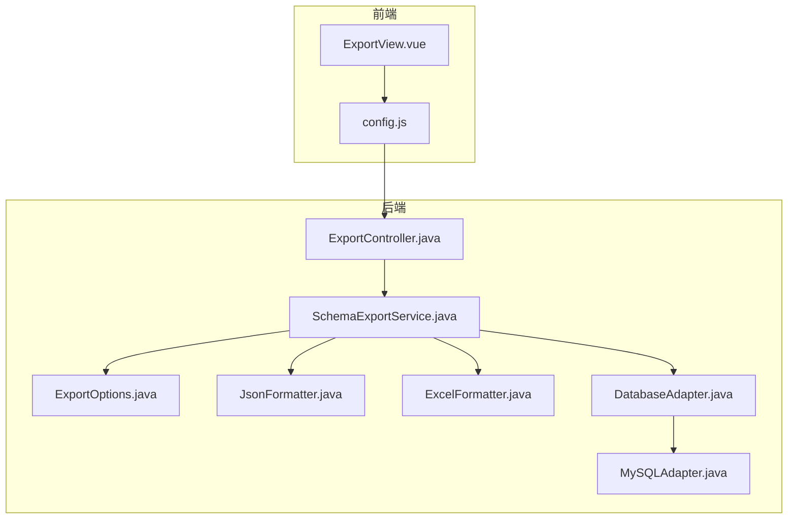
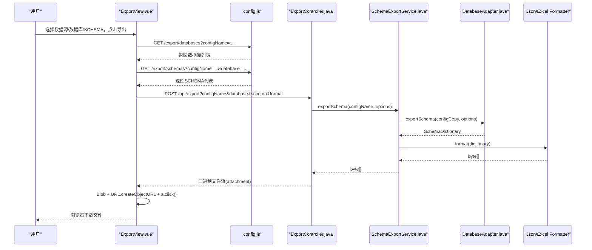
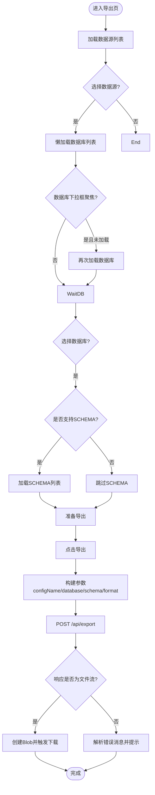
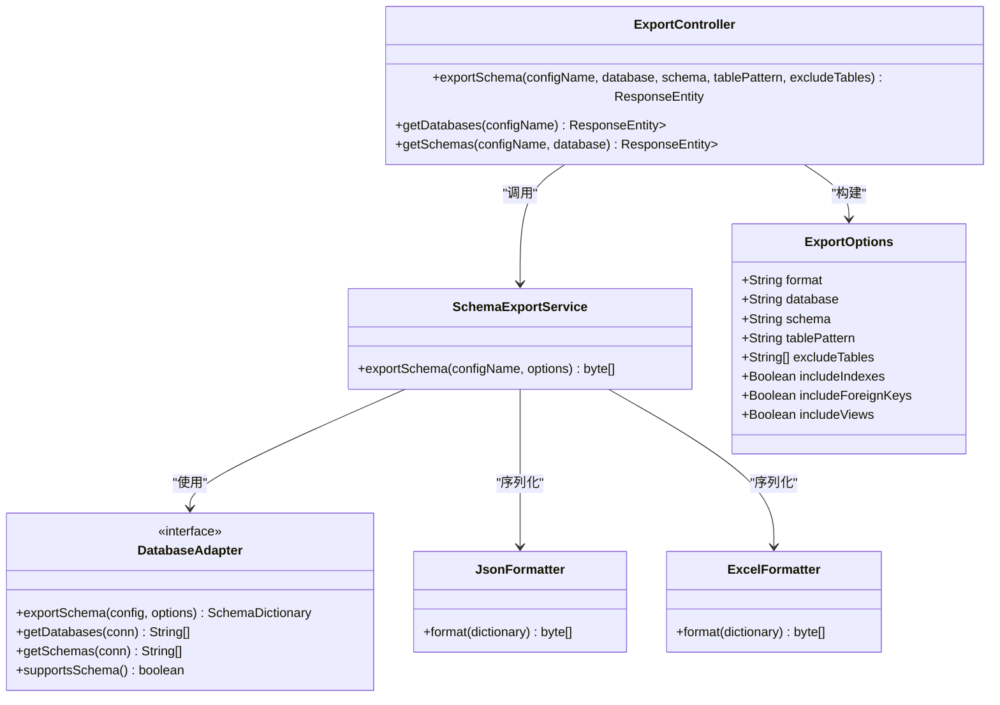
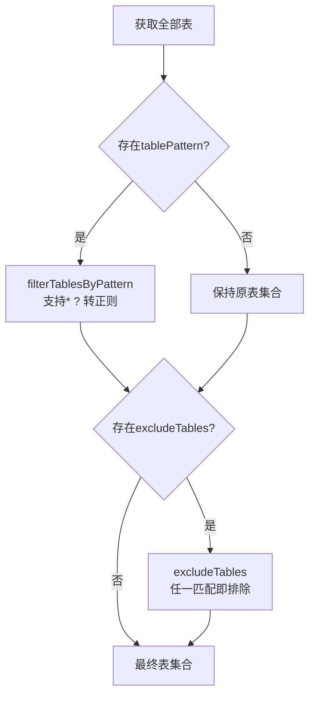
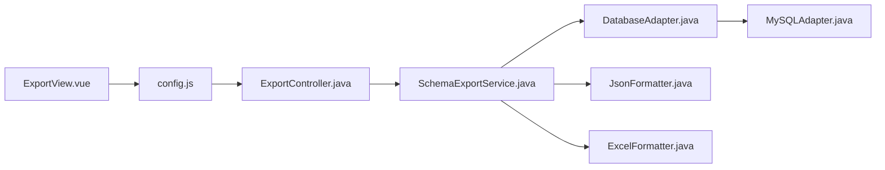

# ExportView数据字典导出页面

<cite>
**本文引用的文件列表**
- [ExportView.vue](file://schemasync-frontend/src/views/ExportView.vue)
- [config.js](file://schemasync-frontend/src/api/config.js)
- [ExportController.java](file://schemasync-backend/src/main/java/com/schemasync/controller/ExportController.java)
- [SchemaExportService.java](file://schemasync-backend/src/main/java/com/schemasync/service/SchemaExportService.java)
- [ExportOptions.java](file://schemasync-backend/src/main/java/com/schemasync/adapter/ExportOptions.java)
- [JsonFormatter.java](file://schemasync-backend/src/main/java/com/schemasync/formatter/JsonFormatter.java)
- [ExcelFormatter.java](file://schemasync-backend/src/main/java/com/schemasync/formatter/ExcelFormatter.java)
- [DatabaseAdapter.java](file://schemasync-backend/src/main/java/com/schemasync/adapter/DatabaseAdapter.java)
- [MySQLAdapter.java](file://schemasync-backend/src/main/java/com/schemasync/adapter/MySQLAdapter.java)
</cite>

## 目录
1. [简介](#简介)
2. [项目结构](#项目结构)
3. [核心组件](#核心组件)
4. [架构总览](#架构总览)
5. [详细组件分析](#详细组件分析)
6. [依赖关系分析](#依赖关系分析)
7. [性能与体验优化](#性能与体验优化)
8. [故障排查指南](#故障排查指南)
9. [结论](#结论)
10. [附录：API定义与交互约定](#附录api定义与交互约定)

## 简介
本文件聚焦于“ExportView数据字典导出页面”的完整实现与流程说明，覆盖以下关键主题：
- 数据源选择下拉框的动态加载机制
- 数据库与SCHEMA级联动态加载（按数据库类型是否支持SCHEMA）
- 导出格式选择（JSON/Excel），当前前端固定为Excel，后端同时支持两种格式
- 表过滤与排除功能（模式匹配、通配符）
- 文件下载机制（Blob对象处理、浏览器下载触发、大文件进度监控方案）
- 导出参数构建与传递（schema过滤、表名匹配规则、元数据选项配置）
- 用户交互体验优化（加载状态提示、错误信息展示、操作成功反馈）
- 文件预览与导出历史记录管理建议

## 项目结构
前后端协作的关键路径如下：
- 前端页面：ExportView.vue
- 前端API封装：config.js
- 后端控制器：ExportController.java
- 后端服务：SchemaExportService.java
- 导出选项模型：ExportOptions.java
- 格式化器：JsonFormatter.java、ExcelFormatter.java
- 数据库适配器接口与实现：DatabaseAdapter.java、MySQLAdapter.java

图表来源
- [ExportView.vue:1-278](file://schemasync-frontend/src/views/ExportView.vue#L1-L278)
- [config.js:1-50](file://schemasync-frontend/src/api/config.js#L1-L50)
- [ExportController.java:1-223](file://schemasync-backend/src/main/java/com/schemasync/controller/ExportController.java#L1-L223)
- [SchemaExportService.java:1-141](file://schemasync-backend/src/main/java/com/schemasync/service/SchemaExportService.java#L1-L141)
- [ExportOptions.java:1-122](file://schemasync-backend/src/main/java/com/schemasync/adapter/ExportOptions.java#L1-L122)
- [JsonFormatter.java:1-119](file://schemasync-backend/src/main/java/com/schemasync/formatter/JsonFormatter.java#L1-L119)
- [ExcelFormatter.java:1-408](file://schemasync-backend/src/main/java/com/schemasync/formatter/ExcelFormatter.java#L1-L408)
- [DatabaseAdapter.java:1-134](file://schemasync-backend/src/main/java/com/schemasync/adapter/DatabaseAdapter.java#L1-L134)
- [MySQLAdapter.java:240-367](file://schemasync-backend/src/main/java/com/schemasync/adapter/MySQLAdapter.java#L240-L367)

章节来源
- [ExportView.vue:1-278](file://schemasync-frontend/src/views/ExportView.vue#L1-L278)
- [config.js:1-50](file://schemasync-frontend/src/api/config.js#L1-L50)
- [ExportController.java:1-223](file://schemasync-backend/src/main/java/com/schemasync/controller/ExportController.java#L1-L223)
- [SchemaExportService.java:1-141](file://schemasync-backend/src/main/java/com/schemasync/service/SchemaExportService.java#L1-L141)
- [ExportOptions.java:1-122](file://schemasync-backend/src/main/java/com/schemasync/adapter/ExportOptions.java#L1-L122)
- [JsonFormatter.java:1-119](file://schemasync-backend/src/main/java/com/schemasync/formatter/JsonFormatter.java#L1-L119)
- [ExcelFormatter.java:1-408](file://schemasync-backend/src/main/java/com/schemasync/formatter/ExcelFormatter.java#L1-L408)
- [DatabaseAdapter.java:1-134](file://schemasync-backend/src/main/java/com/schemasync/adapter/DatabaseAdapter.java#L1-L134)
- [MySQLAdapter.java:240-367](file://schemasync-backend/src/main/java/com/schemasync/adapter/MySQLAdapter.java#L240-L367)

## 核心组件
- 前端导出视图：负责数据源、数据库、SCHEMA的选择与联动；发起导出请求并处理文件下载。
- 后端导出控制器：接收导出参数，校验输入，组装导出选项，调用服务层生成字节流并设置响应头。
- 导出服务：根据配置获取数据库适配器，执行导出，再交由格式化器输出JSON或Excel。
- 导出选项：承载格式、数据库、SCHEMA、表过滤与排除、索引/外键/视图包含等元数据。
- 格式化器：将内存中的SchemaDictionary转换为JSON或Excel字节数组。
- 数据库适配器：提供连接、枚举数据库/SCHEMA、导出SchemaDictionary的能力，并在具体实现中完成表过滤与排除。

章节来源
- [ExportView.vue:73-270](file://schemasync-frontend/src/views/ExportView.vue#L73-L270)
- [ExportController.java:48-99](file://schemasync-backend/src/main/java/com/schemasync/controller/ExportController.java#L48-L99)
- [SchemaExportService.java:46-111](file://schemasync-backend/src/main/java/com/schemasync/service/SchemaExportService.java#L46-L111)
- [ExportOptions.java:11-122](file://schemasync-backend/src/main/java/com/schemasync/adapter/ExportOptions.java#L11-L122)
- [JsonFormatter.java:44-53](file://schemasync-backend/src/main/java/com/schemasync/formatter/JsonFormatter.java#L44-L53)
- [ExcelFormatter.java:39-71](file://schemasync-backend/src/main/java/com/schemasync/formatter/ExcelFormatter.java#L39-L71)
- [DatabaseAdapter.java:109-116](file://schemasync-backend/src/main/java/com/schemasync/adapter/DatabaseAdapter.java#L109-L116)

## 架构总览
导出主流程时序如下：

图表来源
- [ExportView.vue:190-270](file://schemasync-frontend/src/views/ExportView.vue#L190-L270)
- [config.js:41-49](file://schemasync-frontend/src/api/config.js#L41-L49)
- [ExportController.java:48-99](file://schemasync-backend/src/main/java/com/schemasync/controller/ExportController.java#L48-L99)
- [SchemaExportService.java:46-111](file://schemasync-backend/src/main/java/com/schemasync/service/SchemaExportService.java#L46-L111)
- [DatabaseAdapter.java:109-116](file://schemasync-backend/src/main/java/com/schemasync/adapter/DatabaseAdapter.java#L109-L116)
- [JsonFormatter.java:44-53](file://schemasync-backend/src/main/java/com/schemasync/formatter/JsonFormatter.java#L44-L53)
- [ExcelFormatter.java:39-71](file://schemasync-backend/src/main/java/com/schemasync/formatter/ExcelFormatter.java#L39-L71)

## 详细组件分析

### 前端导出视图（ExportView.vue）
- 数据源下拉框
  - 页面挂载时加载数据源列表，失败时给出错误提示。
- 数据库下拉框
  - 支持可搜索、允许手动输入、首次聚焦时懒加载数据库列表，避免不必要的网络请求。
  - 自动显示已加载数量与提示信息。
- SCHEMA下拉框
  - 仅当当前数据源支持SCHEMA时显示；选择数据库后自动加载SCHEMA列表。
- 导出按钮
  - 构造URLSearchParams参数：configName、database、schema（可选）、format（当前固定excel）。
  - 使用fetch发起POST请求到/api/export，解析响应：
    - 若响应类型为application/json则视为错误消息，抛出异常并提示。
    - 否则创建Blob，从Content-Disposition提取文件名，使用URL.createObjectURL和a标签触发下载。
  - 统一的成功/失败提示与loading状态控制。

图表来源
- [ExportView.vue:101-188](file://schemasync-frontend/src/views/ExportView.vue#L101-L188)
- [ExportView.vue:190-270](file://schemasync-frontend/src/views/ExportView.vue#L190-L270)

章节来源
- [ExportView.vue:1-278](file://schemasync-frontend/src/views/ExportView.vue#L1-L278)

### 后端导出控制器（ExportController.java）
- 导出接口：POST /api/export
  - 入参：configName、database、schema（可选）、tablePattern（可选）、excludeTables（可选）。
  - 固定format为excel（当前前端仅传excel）。
  - 构建ExportOptions，调用SchemaExportService.exportSchema。
  - 设置响应头：Content-Type为octet-stream，Content-Disposition含文件名，Content-Length为字节长度。
- 辅助接口：
  - GET /export/databases：根据configName解密密码，通过适配器获取数据库列表。
  - GET /export/schemas：根据configName+database，检查supportsSchema后返回SCHEMA列表。

图表来源
- [ExportController.java:48-99](file://schemasync-backend/src/main/java/com/schemasync/controller/ExportController.java#L48-L99)
- [SchemaExportService.java:46-111](file://schemasync-backend/src/main/java/com/schemasync/service/SchemaExportService.java#L46-L111)
- [ExportOptions.java:11-122](file://schemasync-backend/src/main/java/com/schemasync/adapter/ExportOptions.java#L11-L122)
- [DatabaseAdapter.java:109-116](file://schemasync-backend/src/main/java/com/schemasync/adapter/DatabaseAdapter.java#L109-L116)
- [JsonFormatter.java:44-53](file://schemasync-backend/src/main/java/com/schemasync/formatter/JsonFormatter.java#L44-L53)
- [ExcelFormatter.java:39-71](file://schemasync-backend/src/main/java/com/schemasync/formatter/ExcelFormatter.java#L39-L71)

章节来源
- [ExportController.java:1-223](file://schemasync-backend/src/main/java/com/schemasync/controller/ExportController.java#L1-L223)

### 导出服务与格式化器（SchemaExportService、JsonFormatter、ExcelFormatter）
- SchemaExportService
  - 校验参数，默认format为excel。
  - 根据configName获取配置，解密密码，选择适配器。
  - 调用adapter.exportSchema生成SchemaDictionary。
  - 根据format选择JsonFormatter或ExcelFormatter进行序列化。
- JsonFormatter
  - 将SchemaDictionary扁平化后序列化为JSON字节数组。
- ExcelFormatter
  - 将SchemaDictionary扁平化后写入多Sheet的Excel工作簿，返回字节数组。

章节来源
- [SchemaExportService.java:46-111](file://schemasync-backend/src/main/java/com/schemasync/service/SchemaExportService.java#L46-L111)
- [JsonFormatter.java:44-53](file://schemasync-backend/src/main/java/com/schemasync/formatter/JsonFormatter.java#L44-L53)
- [ExcelFormatter.java:39-71](file://schemasync-backend/src/main/java/com/schemasync/formatter/ExcelFormatter.java#L39-L71)

### 表过滤与排除（MySQLAdapter）
- 模式匹配过滤：支持*与?通配符，内部转换为正则表达式进行匹配。
- 排除表：支持多个排除模式，任一匹配即排除。
- 过滤顺序：先按tablePattern筛选，再按excludeTables排除。

图表来源
- [MySQLAdapter.java:240-367](file://schemasync-backend/src/main/java/com/schemasync/adapter/MySQLAdapter.java#L240-L367)

章节来源
- [MySQLAdapter.java:240-367](file://schemasync-backend/src/main/java/com/schemasync/adapter/MySQLAdapter.java#L240-L367)

### 文件下载机制（前端）
- 使用fetch发起POST请求，接收二进制响应。
- 若响应类型为application/json，则解析错误消息并提示。
- 正常情况：
  - 从Content-Disposition解析文件名，否则使用默认命名规则。
  - 使用URL.createObjectURL创建临时URL，创建a标签并触发download属性下载。
  - 下载完成后释放URL与DOM引用。

章节来源
- [ExportView.vue:190-270](file://schemasync-frontend/src/views/ExportView.vue#L190-L270)

### 导出参数构建与传递
- 前端参数：
  - configName：数据源名称
  - database：数据库名
  - schema：SCHEMA名（可选，仅在支持SCHEMA的数据源出现）
  - format：固定为excel（当前实现）
- 后端参数扩展点：
  - tablePattern：表名模式过滤（支持通配符）
  - excludeTables：排除表列表（支持通配符）
  - includeIndexes/includeForeignKeys/includeViews：元数据开关（当前默认包含索引和外键）

章节来源
- [ExportView.vue:190-212](file://schemasync-frontend/src/views/ExportView.vue#L190-L212)
- [ExportController.java:48-76](file://schemasync-backend/src/main/java/com/schemasync/controller/ExportController.java#L48-L76)
- [ExportOptions.java:11-122](file://schemasync-backend/src/main/java/com/schemasync/adapter/ExportOptions.java#L11-L122)

## 依赖关系分析
- 前端依赖后端接口：
  - /config/datasources（数据源列表）
  - /export/databases（数据库列表）
  - /export/schemas（SCHEMA列表）
  - /api/export（导出文件）
- 后端依赖：
  - ConfigService（读取数据源配置）
  - DatabaseAdapterFactory（选择具体数据库适配器）
  - 各Formatter（JSON/Excel）
  - CryptoUtil（密码解密）

图表来源
- [ExportView.vue:1-278](file://schemasync-frontend/src/views/ExportView.vue#L1-L278)
- [config.js:1-50](file://schemasync-frontend/src/api/config.js#L1-L50)
- [ExportController.java:1-223](file://schemasync-backend/src/main/java/com/schemasync/controller/ExportController.java#L1-L223)
- [SchemaExportService.java:1-141](file://schemasync-backend/src/main/java/com/schemasync/service/SchemaExportService.java#L1-L141)
- [DatabaseAdapter.java:1-134](file://schemasync-backend/src/main/java/com/schemasync/adapter/DatabaseAdapter.java#L1-L134)
- [MySQLAdapter.java:240-367](file://schemasync-backend/src/main/java/com/schemasync/adapter/MySQLAdapter.java#L240-L367)
- [JsonFormatter.java:1-119](file://schemasync-backend/src/main/java/com/schemasync/formatter/JsonFormatter.java#L1-L119)
- [ExcelFormatter.java:1-408](file://schemasync-backend/src/main/java/com/schemasync/formatter/ExcelFormatter.java#L1-L408)

## 性能与体验优化
- 大文件下载进度监控
  - 当前实现使用fetch接收二进制流，不支持原生进度回调。
  - 推荐方案：使用XMLHttpRequest替代fetch，监听onprogress事件计算下载百分比，结合Element Plus的进度条组件展示。
- 分块导出与异步任务
  - 对于超大库，可在后端引入异步任务（如队列+轮询），前端通过任务ID查询进度与结果，避免长连接超时。
- 缓存与去抖
  - 对数据库/SCHEMA列表增加本地缓存与去抖策略，减少重复请求。
- 错误边界与重试
  - 对网络异常与服务器错误进行分类提示，并提供重试按钮。
- 用户体验增强
  - 在导出过程中禁用导出按钮并显示全局loading。
  - 导出成功后提供“打开文件所在目录”或“查看最近导出记录”入口。

[本节为通用优化建议，不直接分析具体文件]

## 故障排查指南
- 无法加载数据源
  - 检查/config/datasources接口连通性与权限。
- 数据库列表为空或报错
  - 确认数据源配置正确，密码是否加密；查看后端日志中解密与连接过程。
- SCHEMA列表不可用
  - 确认当前数据源类型是否支持SCHEMA（supportsSchema=false时不显示SCHEMA选择）。
- 导出失败
  - 若响应为JSON错误体，前端会解析message或error字段并提示；请核对后端日志与HTTP状态码。
- 文件名乱码或异常
  - 检查后端Content-Disposition编码与前端解码逻辑。

章节来源
- [ExportView.vue:214-242](file://schemasync-frontend/src/views/ExportView.vue#L214-L242)
- [ExportController.java:101-201](file://schemasync-backend/src/main/java/com/schemasync/controller/ExportController.java#L101-L201)

## 结论
ExportView实现了从数据源选择到文件下载的完整闭环，具备数据库与SCHEMA级联加载、灵活的表过滤与排除能力，以及稳健的错误处理与用户反馈。当前前端固定导出格式为Excel，后端同时支持JSON与Excel。针对大文件与复杂场景，建议引入异步任务与进度上报机制，进一步提升稳定性与用户体验。

[本节为总结性内容，不直接分析具体文件]

## 附录：API定义与交互约定
- 数据源相关
  - GET /config/datasources：返回所有数据源配置
  - GET /config/datasources/{id}：返回单个数据源配置
  - POST /config/datasources：新增数据源
  - PUT /config/datasources/{id}：更新数据源
  - DELETE /config/datasources/{id}：删除数据源
  - POST /config/datasources/test：测试连接（支持传入配置对象或配置ID）
- 导出相关
  - GET /export/databases?configName={name}：返回数据库列表
  - GET /export/schemas?configName={name}&database={db}：返回SCHEMA列表
  - POST /api/export?configName={name}&database={db}&schema={schema}&format={json|excel}&tablePattern={pattern}&excludeTables={list}：返回二进制文件流

章节来源
- [config.js:1-50](file://schemasync-frontend/src/api/config.js#L1-L50)
- [ExportController.java:48-201](file://schemasync-backend/src/main/java/com/schemasync/controller/ExportController.java#L48-L201)