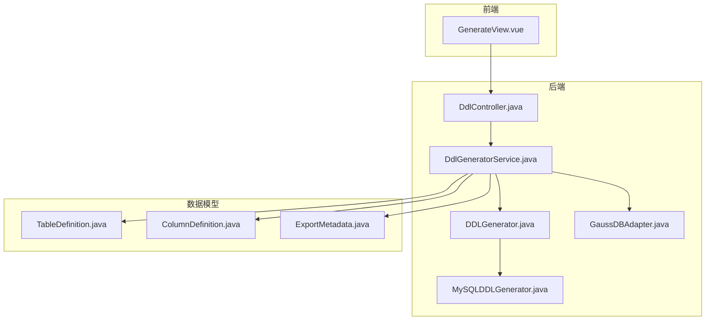
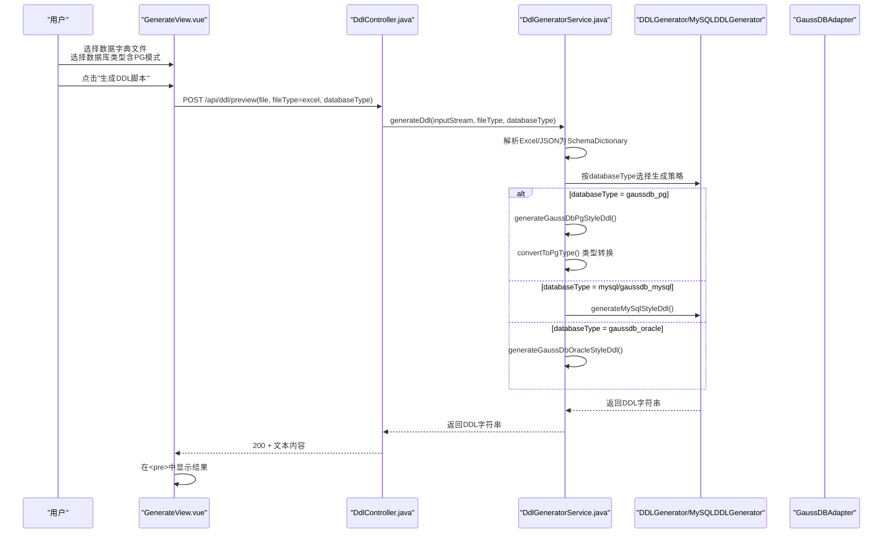
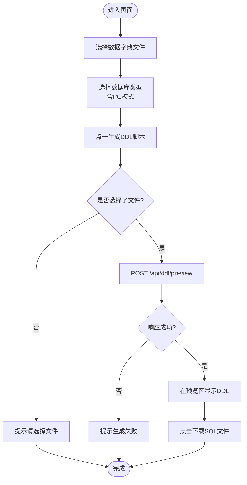
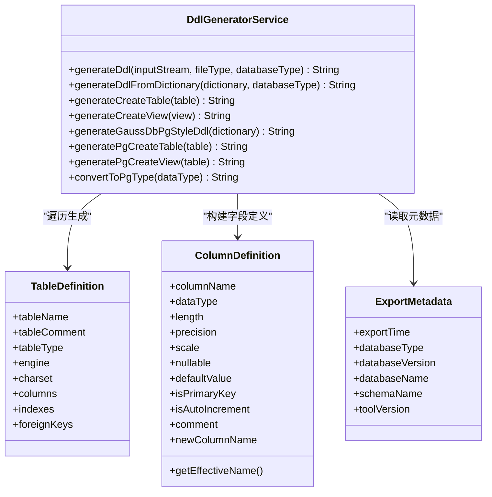
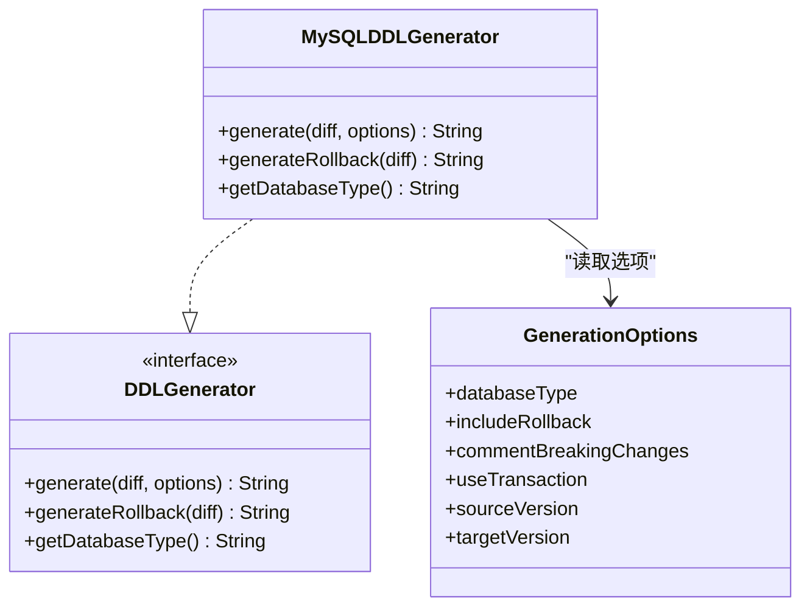
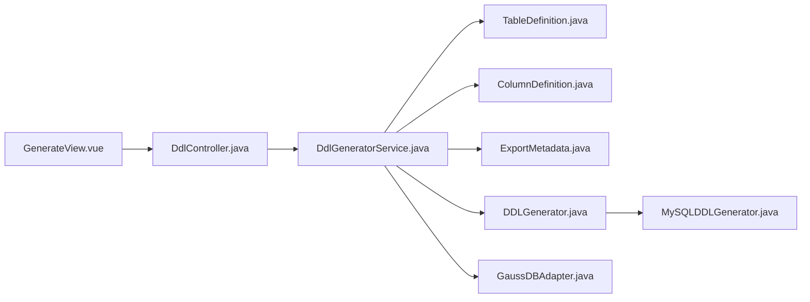

# GenerateView DDL生成页面

<cite>
**本文引用的文件列表**
- [GenerateView.vue](file://schemasync-frontend/src/views/GenerateView.vue)
- [DdlController.java](file://schemasync-backend/src/main/java/com/schemasync/controller/DdlController.java)
- [DdlGeneratorService.java](file://schemasync-backend/src/main/java/com/schemasync/service/DdlGeneratorService.java)
- [DDLGenerator.java](file://schemasync-backend/src/main/java/com/schemasync/generator/DDLGenerator.java)
- [GenerationOptions.java](file://schemasync-backend/src/main/java/com/schemasync/generator/GenerationOptions.java)
- [MySQLDDLGenerator.java](file://schemasync-backend/src/main/java/com/schemasync/generator/MySQLDDLGenerator.java)
- [GaussDBAdapter.java](file://schemasync-backend/src/main/java/com/schemasync/adapter/GaussDBAdapter.java)
- [TableDefinition.java](file://schemasync-backend/src/main/java/com/schemasync/model/dict/TableDefinition.java)
- [ColumnDefinition.java](file://schemasync-backend/src/main/java/com/schemasync/model/dict/ColumnDefinition.java)
- [ExportMetadata.java](file://schemasync-backend/src/main/java/com/schemasync/model/dict/ExportMetadata.java)
- [zh-CN.js](file://schemasync-frontend/src/locales/zh-CN.js)
- [en-US.js](file://schemasync-frontend/src/locales/en-US.js)
</cite>

## 更新摘要
**所做更改**
- 新增GaussDB PG模式支持，在前端下拉选项中添加"GaussDB (PG模式)"选项
- 完善后端PostgreSQL标准模式的DDL生成逻辑，包括类型转换、约束定义和注释处理
- 更新数据库类型选择界面，确保所有架构生成功能的PostgreSQL方言支持一致性
- 增强数据模型说明，包含新的PG模式特有字段和属性

## 目录
1. [简介](#简介)
2. [项目结构](#项目结构)
3. [核心组件](#核心组件)
4. [架构总览](#架构总览)
5. [详细组件分析](#详细组件分析)
6. [依赖关系分析](#依赖关系分析)
7. [性能与可用性建议](#性能与可用性建议)
8. [故障排查指南](#故障排查指南)
9. [结论](#结论)
10. [附录：用户操作引导与最佳实践](#附录用户操作引导与最佳实践)

## 简介
本文件面向"全量DDL脚本生成"页面（GenerateView），从前端交互、后端接口、服务层实现到数据模型进行系统化说明。重点覆盖：
- 目标数据库类型选择与参数配置（现已支持MySQL、GaussDB MySQL兼容模式、GaussDB Oracle兼容模式、GaussDB PG模式）
- 生成选项（事务控制、回滚脚本、破坏性变更注释）的语义与默认值
- SQL预览能力现状与增强建议（高亮、语法检查、行号、复制）
- 参数验证与转换逻辑
- 执行模拟能力（语法预检、依赖分析、风险评估）
- 国际化支持现状与扩展点
- 用户操作步骤、最佳实践与常见问题

## 项目结构
该功能涉及前后端协作：
- 前端：GenerateView.vue 提供上传数据字典、选择数据库类型、预览与下载DDL的能力
- 后端：DdlController 暴露 /api/ddl/* 接口；DdlGeneratorService 负责解析数据字典并生成SQL；DDLGenerator 与 MySQLDDLGenerator 提供差异化DDL生成能力（当前页面主要使用全量生成路径）
- 数据模型：TableDefinition、ColumnDefinition、ExportMetadata 等描述数据字典结构与元信息
- 国际化：zh-CN.js、en-US.js 提供菜单与提示文案，但当前页面尚未接入i18n

图表来源
- [GenerateView.vue:1-154](file://schemasync-frontend/src/views/GenerateView.vue#L1-L154)
- [DdlController.java:1-106](file://schemasync-backend/src/main/java/com/schemasync/controller/DdlController.java#L1-L106)
- [DdlGeneratorService.java:1-898](file://schemasync-backend/src/main/java/com/schemasync/service/DdlGeneratorService.java#L1-L898)
- [DDLGenerator.java:1-35](file://schemasync-backend/src/main/java/com/schemasync/generator/DDLGenerator.java#L1-L35)
- [MySQLDDLGenerator.java:1-354](file://schemasync-backend/src/main/java/com/schemasync/generator/MySQLDDLGenerator.java#L1-L354)
- [GaussDBAdapter.java:1-187](file://schemasync-backend/src/main/java/com/schemasync/adapter/GaussDBAdapter.java#L1-L187)
- [TableDefinition.java:1-89](file://schemasync-backend/src/main/java/com/schemasync/model/dict/TableDefinition.java#L1-L89)
- [ColumnDefinition.java:1-116](file://schemasync-backend/src/main/java/com/schemasync/model/dict/ColumnDefinition.java#L1-L116)
- [ExportMetadata.java:1-59](file://schemasync-backend/src/main/java/com/schemasync/model/dict/ExportMetadata.java#L1-L59)

章节来源
- [GenerateView.vue:1-154](file://schemasync-frontend/src/views/GenerateView.vue#L1-L154)
- [DdlController.java:1-106](file://schemasync-backend/src/main/java/com/schemasync/controller/DdlController.java#L1-L106)
- [DdlGeneratorService.java:1-898](file://schemasync-backend/src/main/java/com/schemasync/service/DdlGeneratorService.java#L1-L898)

## 核心组件
- 前端页面 GenerateView.vue
  - 表单字段：数据字典文件上传、数据库类型下拉（mysql、gaussdb_mysql、gaussdb_oracle、gaussdb_pg）
  - 动作：生成预览、下载SQL
  - 预览区：纯文本 <pre> 展示，无语法高亮、行号、复制按钮
- 后端控制器 DdlController.java
  - /api/ddl/generate：返回二进制流，触发浏览器下载
  - /api/ddl/preview：返回文本内容用于预览
  - /api/ddl/download：同 generate，返回二进制流
  - 参数：file、fileType（默认excel）、databaseType（默认mysql）
- 服务层 DdlGeneratorService.java
  - 根据 fileType 解析 Excel 或 JSON 为 SchemaDictionary
  - 根据 databaseType 路由到不同生成策略（MySQL风格、GaussDB Oracle风格、GaussDB PG模式）
  - 生成包含表、索引、外键、视图等的完整DDL
- 生成器接口与实现
  - DDLGenerator 定义 generate、generateRollback、getDatabaseType
  - MySQLDDLGenerator 实现差异DDL生成（含事务、回滚、破坏性变更注释等）
- 数据模型
  - TableDefinition、ColumnDefinition、ExportMetadata 承载数据字典与元信息

章节来源
- [GenerateView.vue:1-154](file://schemasync-frontend/src/views/GenerateView.vue#L1-L154)
- [DdlController.java:1-106](file://schemasync-backend/src/main/java/com/schemasync/controller/DdlController.java#L1-L106)
- [DdlGeneratorService.java:1-898](file://schemasync-backend/src/main/java/com/schemasync/service/DdlGeneratorService.java#L1-L898)
- [DDLGenerator.java:1-35](file://schemasync-backend/src/main/java/com/schemasync/generator/DDLGenerator.java#L1-L35)
- [MySQLDDLGenerator.java:1-354](file://schemasync-backend/src/main/java/com/schemasync/generator/MySQLDDLGenerator.java#L1-L354)
- [TableDefinition.java:1-89](file://schemasync-backend/src/main/java/com/schemasync/model/dict/TableDefinition.java#L1-L89)
- [ColumnDefinition.java:1-116](file://schemasync-backend/src/main/java/com/schemasync/model/dict/ColumnDefinition.java#L1-L116)
- [ExportMetadata.java:1-59](file://schemasync-backend/src/main/java/com/schemasync/model/dict/ExportMetadata.java#L1-L59)

## 架构总览
以下序列图展示了"预览DDL"的前端到后端调用链路与关键处理步骤。

图表来源
- [GenerateView.vue:76-104](file://schemasync-frontend/src/views/GenerateView.vue#L76-L104)
- [DdlController.java:62-74](file://schemasync-backend/src/main/java/com/schemasync/controller/DdlController.java#L62-L74)
- [DdlGeneratorService.java:81-100](file://schemasync-backend/src/main/java/com/schemasync/service/DdlGeneratorService.java#L81-L100)
- [DdlGeneratorService.java:724-756](file://schemasync-backend/src/main/java/com/schemasync/service/DdlGeneratorService.java#L724-L756)
- [DDLGenerator.java:11-34](file://schemasync-backend/src/main/java/com/schemasync/generator/DDLGenerator.java#L11-L34)
- [MySQLDDLGenerator.java:25-68](file://schemasync-backend/src/main/java/com/schemasync/generator/MySQLDDLGenerator.java#L25-L68)

## 详细组件分析

### 前端页面：GenerateView.vue
- 表单与状态
  - selectedFile：当前选择的Excel文件
  - generating：生成中标志
  - ddlScript：生成的DDL文本
  - form.databaseType：当前选择的数据库类型（默认 mysql，现支持 mysql、gaussdb_mysql、gaussdb_oracle、gaussdb_pg）
- 交互流程
  - 选择文件后，点击"生成DDL脚本"，校验文件是否已选
  - 构造 FormData，固定 fileType=excel，携带 databaseType
  - 调用 /api/ddl/preview，成功后将响应文本渲染至 <pre> 区域
  - 下载时调用 /api/ddl/download，通过 Blob 创建链接触发下载
- 预览能力现状
  - 仅纯文本展示，未集成代码高亮、语法检查、行号、一键复制等功能
  - 样式采用深色背景与等宽字体，便于阅读

**更新** 新增GaussDB PG模式支持，数据库类型下拉框现包含四个选项：MySQL、GaussDB (MySQL兼容模式)、GaussDB (Oracle兼容模式)、GaussDB (PG模式)

图表来源
- [GenerateView.vue:72-104](file://schemasync-frontend/src/views/GenerateView.vue#L72-L104)
- [GenerateView.vue:107-133](file://schemasync-frontend/src/views/GenerateView.vue#L107-L133)

章节来源
- [GenerateView.vue:1-154](file://schemasync-frontend/src/views/GenerateView.vue#L1-L154)

### 后端接口：DdlController.java
- 接口定义
  - /api/ddl/generate：返回二进制流，文件名带时间戳
  - /api/ddl/preview：返回文本内容
  - /api/ddl/download：返回二进制流，文件名带时间戳
- 参数约定
  - file：上传的数据字典文件
  - fileType：excel/json（默认 excel）
  - databaseType：mysql/gaussdb_mysql/gaussdb_oracle/gaussdb_pg（默认 mysql）
- 错误处理
  - 捕获异常并抛出运行时异常，由全局异常处理器统一返回错误信息（当前控制器未自定义错误码）

章节来源
- [DdlController.java:32-104](file://schemasync-backend/src/main/java/com/schemasync/controller/DdlController.java#L32-L104)

### 服务层：DdlGeneratorService.java
- 入口方法
  - generateDdl(inputStream, fileType, databaseType)：根据 fileType 解析数据字典，再调用 generateDdlFromDictionary
- 解析逻辑
  - fileType=excel：调用 parser.parseExcel
  - fileType=json：读取字节数组后调用 parser.parseJson
- 生成策略路由
  - databaseType=mysql/gaussdb_mysql：走 MySQL 风格生成
  - databaseType=gaussdb_oracle：走 GaussDB Oracle 风格生成
  - **新增** databaseType=gaussdb_pg：走 GaussDB PG模式（PostgreSQL标准模式）生成
  - 其他值：记录警告并使用 MySQL 默认模式
- 生成细节（MySQL风格）
  - 生成头部注释（包含数据库类型、名称、版本、生成时间）
  - 遍历表：区分表与视图，分别生成 CREATE TABLE 或 CREATE VIEW
  - 字段定义：数据类型、长度/精度、NULL约束、默认值、自增、注释
  - 主键、索引、外键：过滤主键索引重复生成，应用字段名映射（支持重命名）
  - 表选项：引擎、字符集、表注释
- 生成细节（GaussDB Oracle风格）
  - 不使用反引号，字段名大写
  - 类型转换：MySQL -> Oracle（如 VARCHAR->VARCHAR2、INT->NUMBER 等）
  - 索引以注释形式输出，外键级联规则部分需手动处理
  - 表注释使用 COMMENT ON TABLE 语句
- **新增** 生成细节（GaussDB PG模式）
  - 遵循PostgreSQL标准SQL语法，兼容性最好
  - 类型转换：MySQL类型 -> PostgreSQL标准类型（VARCHAR、TEXT、INTEGER、BIGINT、REAL、DOUBLE PRECISION、NUMERIC、TIMESTAMP、DATE、BYTEA、BOOLEAN、JSONB）
  - 支持主键约束、NOT NULL约束、DEFAULT默认值
  - 表注释和字段注释使用COMMENT ON语句
  - 视图生成使用CREATE OR REPLACE VIEW语法

**更新** 新增完整的GaussDB PG模式DDL生成逻辑，包括类型转换、约束处理和注释支持

图表来源
- [DdlGeneratorService.java:81-100](file://schemasync-backend/src/main/java/com/schemasync/service/DdlGeneratorService.java#L81-L100)
- [DdlGeneratorService.java:724-756](file://schemasync-backend/src/main/java/com/schemasync/service/DdlGeneratorService.java#L724-L756)
- [DdlGeneratorService.java:761-804](file://schemasync-backend/src/main/java/com/schemasync/service/DdlGeneratorService.java#L761-L804)
- [DdlGeneratorService.java:809-845](file://schemasync-backend/src/main/java/com/schemasync/service/DdlGeneratorService.java#L809-L845)
- [DdlGeneratorService.java:850-877](file://schemasync-backend/src/main/java/com/schemasync/service/DdlGeneratorService.java#L850-L877)
- [DdlGeneratorService.java:882-896](file://schemasync-backend/src/main/java/com/schemasync/service/DdlGeneratorService.java#L882-L896)
- [TableDefinition.java:1-89](file://schemasync-backend/src/main/java/com/schemasync/model/dict/TableDefinition.java#L1-L89)
- [ColumnDefinition.java:1-116](file://schemasync-backend/src/main/java/com/schemasync/model/dict/ColumnDefinition.java#L1-L116)
- [ExportMetadata.java:1-59](file://schemasync-backend/src/main/java/com/schemasync/model/dict/ExportMetadata.java#L1-L59)

章节来源
- [DdlGeneratorService.java:1-898](file://schemasync-backend/src/main/java/com/schemasync/service/DdlGeneratorService.java#L1-L898)
- [TableDefinition.java:1-89](file://schemasync-backend/src/main/java/com/schemasync/model/dict/TableDefinition.java#L1-L89)
- [ColumnDefinition.java:1-116](file://schemasync-backend/src/main/java/com/schemasync/model/dict/ColumnDefinition.java#L1-L116)
- [ExportMetadata.java:1-59](file://schemasync-backend/src/main/java/com/schemasync/model/dict/ExportMetadata.java#L1-L59)

### 生成器接口与实现：DDLGenerator 与 MySQLDDLGenerator
- DDLGenerator 接口
  - generate(diff, options)：基于差异对象与选项生成DDL
  - generateRollback(diff)：生成回滚脚本
  - getDatabaseType()：标识数据库类型
- MySQLDDLGenerator 实现
  - 生成顺序：新增表 -> 修改表结构 -> 索引变更 -> 外键变更 -> 删除表
  - 事务控制：根据 options.useTransaction 包裹 START TRANSACTION/COMMIT
  - 破坏性变更：当 options.commentBreakingChanges=true 时，对 DROP COLUMN、DROP TABLE 等添加注释提示，需人工确认
  - 回滚脚本：删除新增表，恢复删除表需手动从备份恢复

图表来源
- [DDLGenerator.java:11-34](file://schemasync-backend/src/main/java/com/schemasync/generator/DDLGenerator.java#L11-L34)
- [MySQLDDLGenerator.java:25-104](file://schemasync-backend/src/main/java/com/schemasync/generator/MySQLDDLGenerator.java#L25-L104)
- [GenerationOptions.java:9-96](file://schemasync-backend/src/main/java/com/schemasync/generator/GenerationOptions.java#L9-L96)

章节来源
- [DDLGenerator.java:1-35](file://schemasync-backend/src/main/java/com/schemasync/generator/DDLGenerator.java#L1-L35)
- [MySQLDDLGenerator.java:1-354](file://schemasync-backend/src/main/java/com/schemasync/generator/MySQLDDLGenerator.java#L1-L354)
- [GenerationOptions.java:1-96](file://schemasync-backend/src/main/java/com/schemasync/generator/GenerationOptions.java#L1-L96)

## 依赖关系分析
- 前端依赖
  - Element Plus 组件（表单、上传、消息提示、图标）
  - fetch API 直接调用后端接口
- 后端依赖
  - Spring Boot Web（@RestController、@PostMapping、MultipartFile）
  - Swagger 注解（Operation、Tag）
  - SLF4J 日志
  - Jackson（模型序列化/反序列化）
- 模块耦合
  - DdlController 仅依赖 DdlGeneratorService，职责清晰
  - DdlGeneratorService 依赖数据字典解析器与模型类，屏蔽具体生成器差异
  - 当前页面使用全量生成路径，不直接使用 DDLGenerator 接口族

图表来源
- [GenerateView.vue:1-154](file://schemasync-frontend/src/views/GenerateView.vue#L1-L154)
- [DdlController.java:1-106](file://schemasync-backend/src/main/java/com/schemasync/controller/DdlController.java#L1-L106)
- [DdlGeneratorService.java:1-898](file://schemasync-backend/src/main/java/com/schemasync/service/DdlGeneratorService.java#L1-L898)
- [DDLGenerator.java:1-35](file://schemasync-backend/src/main/java/com/schemasync/generator/DDLGenerator.java#L1-L35)
- [MySQLDDLGenerator.java:1-354](file://schemasync-backend/src/main/java/com/schemasync/generator/MySQLDDLGenerator.java#L1-L354)
- [GaussDBAdapter.java:1-187](file://schemasync-backend/src/main/java/com/schemasync/adapter/GaussDBAdapter.java#L1-L187)
- [TableDefinition.java:1-89](file://schemasync-backend/src/main/java/com/schemasync/model/dict/TableDefinition.java#L1-L89)
- [ColumnDefinition.java:1-116](file://schemasync-backend/src/main/java/com/schemasync/model/dict/ColumnDefinition.java#L1-L116)
- [ExportMetadata.java:1-59](file://schemasync-backend/src/main/java/com/schemasync/model/dict/ExportMetadata.java#L1-L59)

章节来源
- [DdlController.java:1-106](file://schemasync-backend/src/main/java/com/schemasync/controller/DdlController.java#L1-L106)
- [DdlGeneratorService.java:1-898](file://schemasync-backend/src/main/java/com/schemasync/service/DdlGeneratorService.java#L1-L898)

## 性能与可用性建议
- 大文件处理
  - 当前使用 InputStream 逐块读取，避免一次性加载大文件到内存，有利于稳定性
  - 建议在 Service 层增加文件大小限制与超时控制
- 生成耗时
  - 复杂字典（大量表/索引/外键）可能耗时较长，可在 Controller 层引入异步任务与进度查询
- 预览体验
  - 建议在前端引入代码编辑器（如 Monaco Editor）实现语法高亮、行号、复制、搜索替换
- 错误反馈
  - 建议在后端返回结构化错误码与消息，前端统一提示

[本节为通用建议，无需源码引用]

## 故障排查指南
- 常见错误
  - 未选择文件：前端会提示"请选择文件"
  - 生成失败：后端抛出运行时异常，前端提示"生成失败"
  - 下载失败：Blob 处理异常或网络问题导致
  - **新增** PG模式类型转换错误：检查数据类型是否在支持的转换列表中
- 定位步骤
  - 检查浏览器控制台网络请求，确认 /api/ddl/preview 与 /api/ddl/download 的状态码与响应体
  - 查看后端日志，确认解析与生成阶段是否报错
  - 核对上传文件格式是否为 Excel，且符合数据字典规范
  - **新增** 对于PG模式，检查数据类型是否符合PostgreSQL标准类型要求
- 快速修复
  - 重新上传正确格式的数据字典文件
  - 切换数据库类型重试（例如从 gaussdb_pg 切换到 mysql）
  - **新增** 对于PG模式，使用标准的PostgreSQL数据类型

章节来源
- [GenerateView.vue:76-104](file://schemasync-frontend/src/views/GenerateView.vue#L76-L104)
- [DdlController.java:57-74](file://schemasync-backend/src/main/java/com/schemasync/controller/DdlController.java#L57-L74)

## 结论
GenerateView 提供了简洁的全量DDL生成入口，支持多数据库类型选择与预览/下载。**现已全面支持GaussDB PG模式**，为用户提供PostgreSQL标准SQL语法的DDL生成能力。后端具备完善的解析与生成逻辑，能针对不同数据库风格输出相应DDL，包括最新的PG模式支持。当前页面在用户体验方面仍有提升空间，包括代码高亮、语法检查、行号、复制、国际化等。后续可结合 GenerationOptions 与 DDLGenerator 接口，逐步完善差异化DDL生成与执行模拟能力。

[本节为总结，无需源码引用]

## 附录：用户操作引导与最佳实践

### 操作步骤
- 准备数据字典文件（Excel）
- 打开"全量DDL脚本生成"页面
- 选择数据字典文件
- 选择目标数据库类型（MySQL/GaussDB MySQL兼容/GaussDB Oracle兼容/**GaussDB PG模式**）
- 点击"生成DDL脚本"，在预览区查看结果
- 如需保存，点击"下载SQL文件"

### 生成选项说明（概念）
- 事务控制：是否用事务包裹DDL，保证原子性
- 回滚脚本：是否生成回滚SQL，便于失败恢复
- 注释破坏性变更：对危险操作（如删表、删列）添加注释提示，需人工确认后再执行
- 源/目标版本：用于脚本头标注，便于审计与追溯

### 最佳实践
- 先在非生产环境执行测试，验证DDL是否符合预期
- 对破坏性变更务必人工审查，必要时分批执行
- 保留生成时间与版本信息的脚本，便于回溯
- 大型库建议分批次生成与执行，降低锁表风险
- **新增** 使用GaussDB PG模式时，确保数据类型符合PostgreSQL标准类型要求

### 常见问题
- Q：为什么预览没有语法高亮？
  A：当前为纯文本预览，后续可引入代码编辑器增强体验
- Q：如何切换数据库类型？
  A：在"数据库类型"下拉框中选择对应类型即可
- Q：下载的文件名是什么格式？
  A：ddl_时间戳_毫秒.sql
- **新增** Q：GaussDB PG模式与其他模式有什么区别？
  A：PG模式遵循PostgreSQL标准SQL语法，兼容性最好，使用标准数据类型和语法特性

### 国际化现状与建议
- 现状
  - zh-CN.js 与 en-US.js 提供菜单与通用文案
  - GenerateView.vue 尚未接入 i18n，界面文案仍为中文硬编码
- 建议
  - 将页面文案迁移到语言包，按 key 动态渲染
  - 为错误提示与成功提示增加多语言键值

章节来源
- [zh-CN.js:1-150](file://schemasync-frontend/src/locales/zh-CN.js#L1-L150)
- [en-US.js:1-150](file://schemasync-frontend/src/locales/en-US.js#L1-L150)
- [GenerateView.vue:1-154](file://schemasync-frontend/src/views/GenerateView.vue#L1-L154)