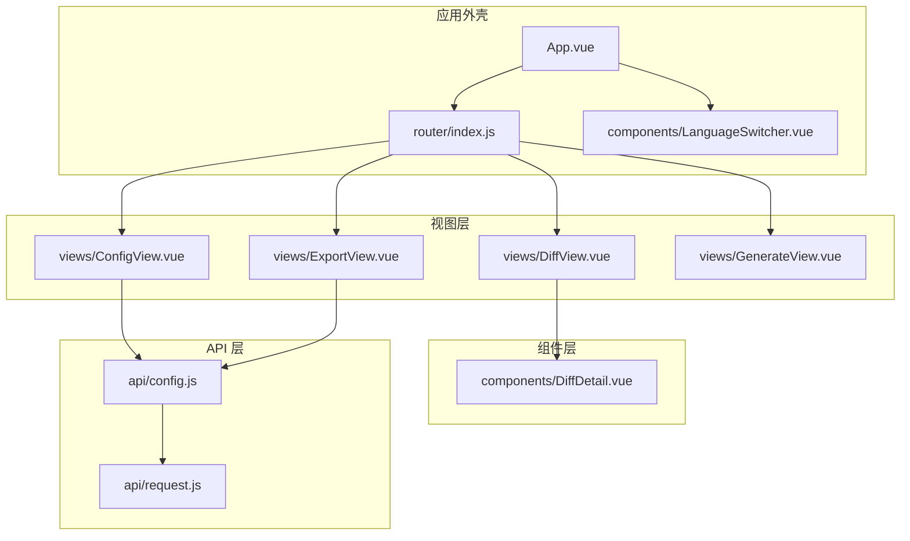
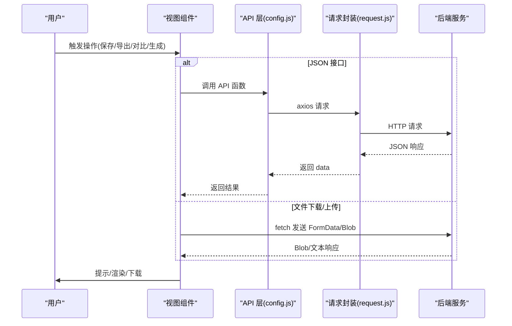
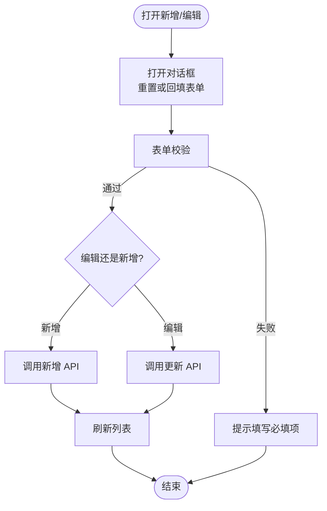
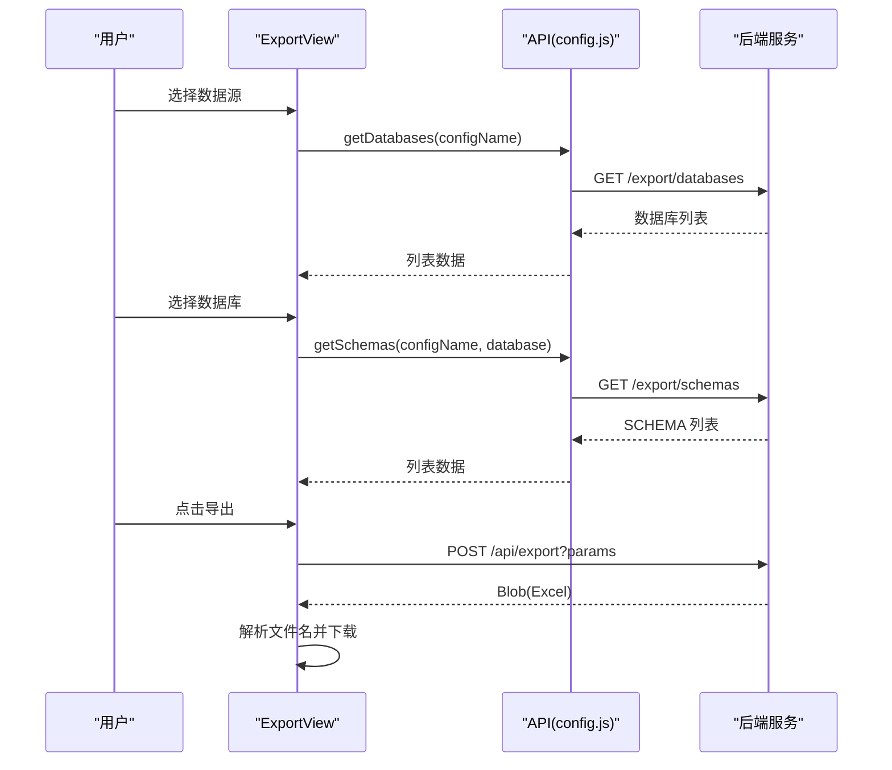
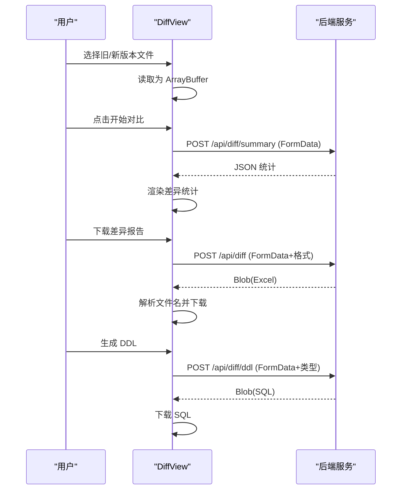
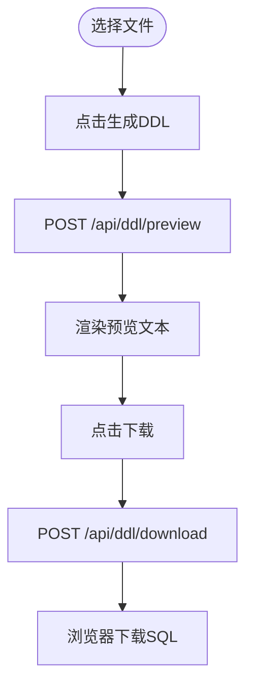
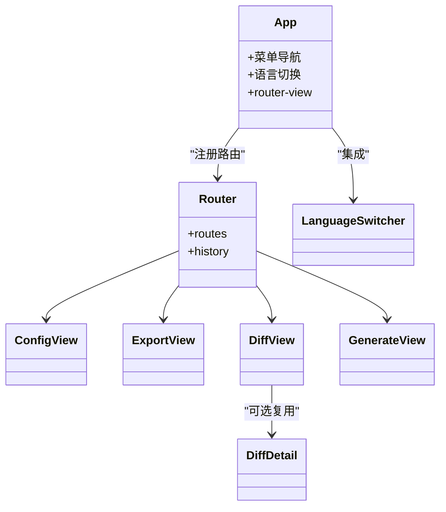
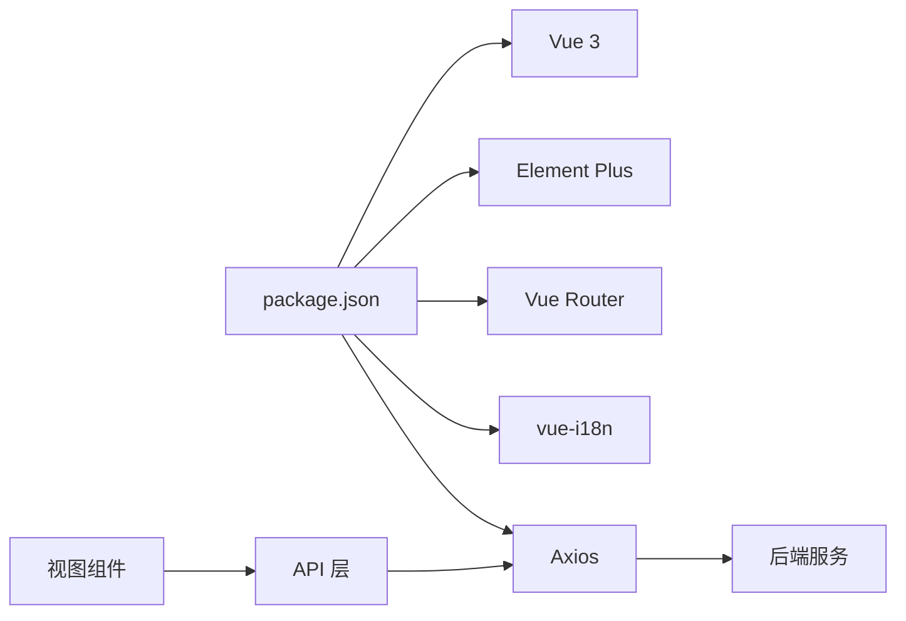

# 页面组件详解

<cite>
**本文引用的文件**   
- [ConfigView.vue](file://schemasync-frontend/src/views/ConfigView.vue)
- [ExportView.vue](file://schemasync-frontend/src/views/ExportView.vue)
- [DiffView.vue](file://schemasync-frontend/src/views/DiffView.vue)
- [GenerateView.vue](file://schemasync-frontend/src/views/GenerateView.vue)
- [DiffDetail.vue](file://schemasync-frontend/src/components/DiffDetail.vue)
- [config.js](file://schemasync-frontend/src/api/config.js)
- [request.js](file://schemasync-frontend/src/api/request.js)
- [index.js](file://schemasync-frontend/src/router/index.js)
- [App.vue](file://schemasync-frontend/src/App.vue)
- [LanguageSwitcher.vue](file://schemasync-frontend/src/components/LanguageSwitcher.vue)
- [package.json](file://schemasync-frontend/package.json)
</cite>

## 目录
1. [简介](#简介)
2. [项目结构](#项目结构)
3. [核心组件](#核心组件)
4. [架构总览](#架构总览)
5. [详细组件分析](#详细组件分析)
6. [依赖关系分析](#依赖关系分析)
7. [性能与可用性建议](#性能与可用性建议)
8. [故障排查指南](#故障排查指南)
9. [结论](#结论)
10. [附录：扩展与自定义开发指南](#附录扩展与自定义开发指南)

## 简介
本文件聚焦 SchemaSync 前端四个核心业务页面组件的实现与交互逻辑，覆盖以下能力：
- ConfigView（数据源配置）：表单校验、新增/编辑/删除、连接测试、列表加载与持久化调用。
- ExportView（数据字典导出）：数据源选择、数据库/SCHEMA 级联加载、Excel 导出与错误处理。
- DiffView（版本差异对比）：双文件上传、差异摘要展示、下载差异报告、生成 DDL。
- GenerateView（DDL 生成）：单文件上传、参数配置、脚本预览与下载。

文档同时说明组件间通信模式、数据流向、错误处理机制，并提供扩展与自定义页面开发示例，帮助开发者理解与维护前端业务逻辑。

## 项目结构
前端采用 Vue 3 + Element Plus + Vue Router + Axios 的轻量架构，路由驱动视图切换，API 层统一封装请求与响应拦截。

图表来源
- [App.vue:1-115](file://schemasync-frontend/src/App.vue#L1-L115)
- [index.js:1-46](file://schemasync-frontend/src/router/index.js#L1-L46)
- [ConfigView.vue:1-344](file://schemasync-frontend/src/views/ConfigView.vue#L1-L344)
- [ExportView.vue:1-278](file://schemasync-frontend/src/views/ExportView.vue#L1-L278)
- [DiffView.vue:1-313](file://schemasync-frontend/src/views/DiffView.vue#L1-L313)
- [GenerateView.vue:1-153](file://schemasync-frontend/src/views/GenerateView.vue#L1-L153)
- [DiffDetail.vue:1-125](file://schemasync-frontend/src/components/DiffDetail.vue#L1-L125)
- [config.js:1-50](file://schemasync-frontend/src/api/config.js#L1-L50)
- [request.js:1-31](file://schemasync-frontend/src/api/request.js#L1-L31)

章节来源
- [App.vue:1-115](file://schemasync-frontend/src/App.vue#L1-L115)
- [index.js:1-46](file://schemasync-frontend/src/router/index.js#L1-L46)
- [package.json:1-25](file://schemasync-frontend/package.json#L1-L25)

## 核心组件
本节概述四个核心页面的职责与关键状态：
- ConfigView：维护数据源列表、对话框表单、校验规则、操作按钮；通过 API 层完成增删改查与连接测试。
- ExportView：维护数据源、数据库、SCHEMA 三级联动；发起导出请求并处理 Blob 下载。
- DiffView：管理旧/新版本 Excel 文件及其 ArrayBuffer；发起差异摘要、下载差异报告、生成 DDL。
- GenerateView：管理单个字典文件与数据库类型参数；发起预览与下载。

章节来源
- [ConfigView.vue:1-344](file://schemasync-frontend/src/views/ConfigView.vue#L1-L344)
- [ExportView.vue:1-278](file://schemasync-frontend/src/views/ExportView.vue#L1-L278)
- [DiffView.vue:1-313](file://schemasync-frontend/src/views/DiffView.vue#L1-L313)
- [GenerateView.vue:1-153](file://schemasync-frontend/src/views/GenerateView.vue#L1-L153)

## 架构总览
前后端交互以 RESTful 为主，部分接口使用原生 fetch 直接处理二进制流（Blob），其余通过 Axios 封装的请求对象进行 JSON 交互。

图表来源
- [config.js:1-50](file://schemasync-frontend/src/api/config.js#L1-L50)
- [request.js:1-31](file://schemasync-frontend/src/api/request.js#L1-L31)
- [ExportView.vue:190-270](file://schemasync-frontend/src/views/ExportView.vue#L190-L270)
- [DiffView.vue:132-257](file://schemasync-frontend/src/views/DiffView.vue#L132-L257)
- [GenerateView.vue:75-132](file://schemasync-frontend/src/views/GenerateView.vue#L75-L132)

## 详细组件分析

### ConfigView（数据源配置）
- 组件结构
  - 顶部卡片：标题与“新增数据源”按钮。
  - 表格：展示数据源字段与操作列（测试连接、编辑、删除）。
  - 对话框：新增/编辑表单，含基础信息与高级配置（JDBC URL、连接池 JSON）。
- 状态管理
  - 列表与加载态：dataSources、loading。
  - 对话框与表单：dialogVisible、dialogTitle、formRef、form、isEditMode。
  - 连接测试态：testingConnection。
  - 计算属性：isFormValid 控制“测试连接”按钮可用。
- 表单验证与持久化
  - 必填项：名称、类型、主机、端口、数据库名、用户名。
  - 保存流程：先 validate，再根据 isEditMode 调用更新或新增 API，成功后刷新列表。
  - 删除流程：二次确认后调用删除 API，成功后刷新列表。
- 连接测试
  - 支持两种模式：传入已保存配置的 ID 或临时配置对象；成功时显示数据库版本信息。
- 错误处理
  - 网络异常与业务失败均通过消息提示；表单验证失败不抛错但阻止提交。

图表来源
- [ConfigView.vue:178-234](file://schemasync-frontend/src/views/ConfigView.vue#L178-L234)
- [ConfigView.vue:275-299](file://schemasync-frontend/src/views/ConfigView.vue#L275-L299)
- [ConfigView.vue:301-325](file://schemasync-frontend/src/views/ConfigView.vue#L301-L325)
- [config.js:14-39](file://schemasync-frontend/src/api/config.js#L14-L39)

章节来源
- [ConfigView.vue:1-344](file://schemasync-frontend/src/views/ConfigView.vue#L1-L344)
- [config.js:1-50](file://schemasync-frontend/src/api/config.js#L1-L50)

### ExportView（数据字典导出）
- 组件结构
  - 表单：数据源选择、数据库选择（可搜索/可新建）、SCHEMA 选择（条件显示）、导出按钮。
- 级联加载
  - 选择数据源后自动加载数据库列表；数据库下拉框获得焦点时若未加载则触发加载。
  - 选择数据库后，若当前数据源支持 SCHEMA，则自动加载 SCHEMA 列表。
- 导出流程
  - 构造查询参数（configName、database、schema、format=excel）。
  - 使用 fetch 发起 POST 请求，解析响应头 Content-Disposition 获取文件名。
  - 将 Blob 转为下载链接并触发浏览器下载。
- 错误处理
  - 对非 200 响应尝试解析 JSON 错误体；若为 JSON 类型的 Blob 也做错误分支。
  - 提供友好的失败提示。

图表来源
- [ExportView.vue:105-188](file://schemasync-frontend/src/views/ExportView.vue#L105-L188)
- [ExportView.vue:190-270](file://schemasync-frontend/src/views/ExportView.vue#L190-L270)
- [config.js:41-49](file://schemasync-frontend/src/api/config.js#L41-L49)

章节来源
- [ExportView.vue:1-278](file://schemasync-frontend/src/views/ExportView.vue#L1-L278)
- [config.js:41-49](file://schemasync-frontend/src/api/config.js#L41-L49)

### DiffView（版本差异对比）
- 组件结构
  - 两个上传区：旧版本/新版本 Excel 文件（限制 1 个，禁止自动上传）。
  - 数据库类型选择：MySQL/GaussDB(MySQL)/GaussDB(Oracle)。
  - 对比结果卡片：统计概览、下载差异报告、生成 DDL。
- 文件处理
  - 选择文件后读取为 ArrayBuffer 缓存，用于后续请求。
- 对比与下载
  - 对比摘要：POST /api/diff/summary，返回 JSON 统计。
  - 下载差异报告：POST /api/diff，返回 Excel Blob，解析文件名并下载。
  - 生成 DDL：POST /api/diff/ddl，返回 SQL Blob 并下载。
- 错误处理
  - 对非 200 响应抛出错误；下载前检查 Blob 有效性；统一消息提示。

图表来源
- [DiffView.vue:112-160](file://schemasync-frontend/src/views/DiffView.vue#L112-L160)
- [DiffView.vue:162-217](file://schemasync-frontend/src/views/DiffView.vue#L162-L217)
- [DiffView.vue:219-257](file://schemasync-frontend/src/views/DiffView.vue#L219-L257)

章节来源
- [DiffView.vue:1-313](file://schemasync-frontend/src/views/DiffView.vue#L1-L313)

### GenerateView（DDL 生成）
- 组件结构
  - 文件上传：数据字典文件（Excel）。
  - 数据库类型选择。
  - 生成按钮与预览区域（代码块样式）。
- 功能流程
  - 预览：POST /api/ddl/preview，返回文本内容渲染到预览区。
  - 下载：POST /api/ddl/download，返回 Blob 并触发下载。
- 错误处理
  - 非 200 响应抛出错误；下载失败给出提示。

图表来源
- [GenerateView.vue:75-104](file://schemasync-frontend/src/views/GenerateView.vue#L75-L104)
- [GenerateView.vue:106-132](file://schemasync-frontend/src/views/GenerateView.vue#L106-L132)

章节来源
- [GenerateView.vue:1-153](file://schemasync-frontend/src/views/GenerateView.vue#L1-L153)

### 组件间通信与数据流向
- 路由与布局
  - App.vue 作为外壳，包含侧边栏菜单与语言切换组件，通过 router-view 渲染当前视图。
  - router/index.js 定义五个页面路由，默认重定向至 /config。
- 组件复用
  - DiffDetail.vue 提供按表分组与变更详情展示，可作为 DiffView 的扩展子组件使用。
- 国际化
  - LanguageSwitcher.vue 基于 vue-i18n 切换语言，并动态加载 Element Plus 对应语言包。

图表来源
- [App.vue:1-115](file://schemasync-frontend/src/App.vue#L1-L115)
- [index.js:1-46](file://schemasync-frontend/src/router/index.js#L1-L46)
- [DiffDetail.vue:1-125](file://schemasync-frontend/src/components/DiffDetail.vue#L1-L125)
- [LanguageSwitcher.vue:1-76](file://schemasync-frontend/src/components/LanguageSwitcher.vue#L1-L76)

章节来源
- [App.vue:1-115](file://schemasync-frontend/src/App.vue#L1-L115)
- [index.js:1-46](file://schemasync-frontend/src/router/index.js#L1-L46)
- [DiffDetail.vue:1-125](file://schemasync-frontend/src/components/DiffDetail.vue#L1-L125)
- [LanguageSwitcher.vue:1-76](file://schemasync-frontend/src/components/LanguageSwitcher.vue#L1-L76)

## 依赖关系分析
- 运行时依赖
  - Vue 3、Element Plus、Vue Router、vue-i18n、Axios。
- 模块耦合
  - 视图层仅依赖 API 层与 Element Plus 组件，保持低耦合。
  - API 层集中封装请求与响应拦截，便于统一错误处理与鉴权扩展。
- 外部集成点
  - 后端 REST 接口：/api/config/*、/api/export/*、/api/diff/*、/api/ddl/*。
  - 浏览器下载：通过 Blob + URL.createObjectURL 实现。

图表来源
- [package.json:1-25](file://schemasync-frontend/package.json#L1-L25)
- [request.js:1-31](file://schemasync-frontend/src/api/request.js#L1-L31)
- [config.js:1-50](file://schemasync-frontend/src/api/config.js#L1-L50)

章节来源
- [package.json:1-25](file://schemasync-frontend/package.json#L1-L25)
- [request.js:1-31](file://schemasync-frontend/src/api/request.js#L1-L31)
- [config.js:1-50](file://schemasync-frontend/src/api/config.js#L1-L50)

## 性能与可用性建议
- 列表与级联加载
  - 数据库/SCHEMA 列表按需加载，避免首屏阻塞；在首次聚焦时加载可减少无效请求。
- 大文件处理
  - 对比与生成场景使用 ArrayBuffer/Blob，注意内存占用；必要时增加文件大小限制与进度反馈。
- 用户体验
  - 长耗时操作应提供 loading 与取消能力；下载失败时保留上次输入，减少重复操作。
- 错误提示
  - 区分网络错误与业务错误，尽量返回具体原因；对 JSON 错误体进行友好解析。

[本节为通用建议，无需源码引用]

## 故障排查指南
- 请求失败
  - 检查 request.js 的 baseURL 与超时配置；确认后端路径是否匹配。
  - 查看响应拦截器是否吞掉错误信息，确保 ElMessage 能正确弹出。
- 文件下载异常
  - 确认后端返回的是 Blob 且 Content-Type 正确；检查 Content-Disposition 文件名编码。
  - 若返回 JSON 错误体，需在前端识别并提示。
- 表单校验不生效
  - 确认 formRef 引用存在后再调用 validate/clear/resetFields。
  - 编辑模式下不要 resetFields，以免丢失已填值。
- 语言切换无效
  - 确认 vue-i18n 初始化与语言包动态导入；Element Plus 语言切换可能需要刷新页面。

章节来源
- [request.js:1-31](file://schemasync-frontend/src/api/request.js#L1-L31)
- [ExportView.vue:214-242](file://schemasync-frontend/src/views/ExportView.vue#L214-L242)
- [DiffView.vue:186-216](file://schemasync-frontend/src/views/DiffView.vue#L186-L216)
- [LanguageSwitcher.vue:45-57](file://schemasync-frontend/src/components/LanguageSwitcher.vue#L45-L57)

## 结论
四个核心页面围绕“配置—导出—对比—生成”的主线工作流展开，采用清晰的组件分层与统一的 API 封装，具备良好的可扩展性与可维护性。通过合理的表单校验、级联加载与错误处理，提升了用户体验与健壮性。

[本节为总结，无需源码引用]

## 附录：扩展与自定义开发指南
- 新增页面步骤
  - 在 views 下创建新组件，定义模板与逻辑。
  - 在 router/index.js 中注册路由与菜单项。
  - 如需与后端交互，可在 api/config.js 或新建 api/*.js 中封装函数，并通过 request.js 统一处理。
- 复用组件
  - 将通用 UI 与逻辑抽离到 components 目录，如 DiffDetail.vue 可按需被多个页面复用。
- 国际化
  - 在 locales 中添加文案键值，并在组件中使用 t('key') 进行替换；语言切换由 LanguageSwitcher.vue 统一管理。
- 最佳实践
  - 所有异步操作包裹 try/catch，并设置 loading 状态。
  - 文件类接口优先使用 fetch 处理 Blob，JSON 接口使用 Axios。
  - 表单校验规则集中在组件内，复杂校验可抽取为工具函数。

[本节为概念性指导，无需源码引用]