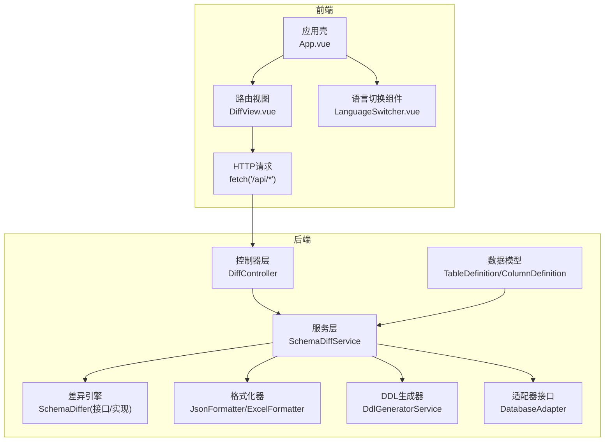
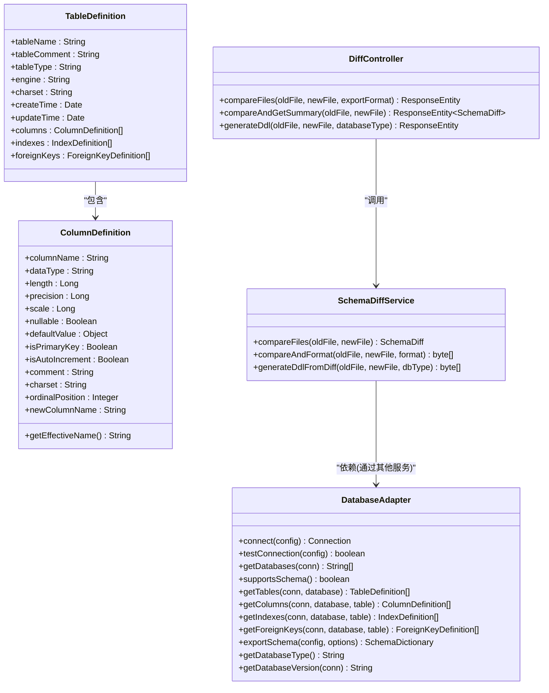
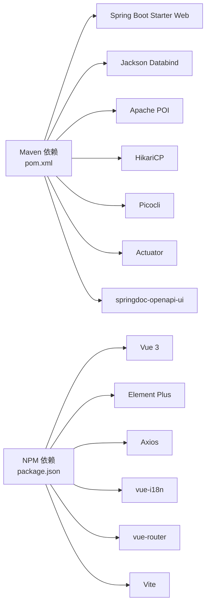
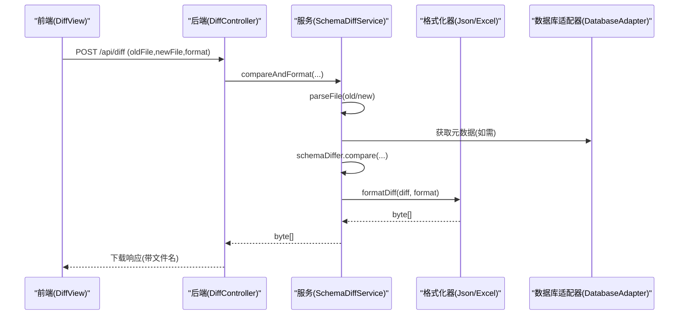
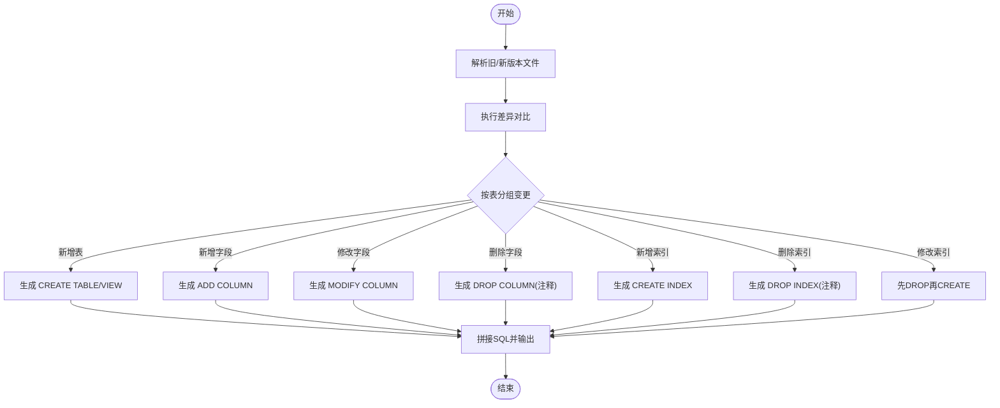

# 代码规范

<cite>
**本文引用的文件**   
- [SchemaSyncApplication.java](file://schemasync-backend/src/main/java/com/schemasync/SchemaSyncApplication.java)
- [pom.xml](file://schemasync-backend/pom.xml)
- [DatabaseAdapter.java](file://schemasync-backend/src/main/java/com/schemasync/adapter/DatabaseAdapter.java)
- [TableDefinition.java](file://schemasync-backend/src/main/java/com/schemasync/model/dict/TableDefinition.java)
- [ColumnDefinition.java](file://schemasync-backend/src/main/java/com/schemasync/model/dict/ColumnDefinition.java)
- [DiffController.java](file://schemasync-backend/src/main/java/com/schemasync/controller/DiffController.java)
- [SchemaDiffService.java](file://schemasync-backend/src/main/java/com/schemasync/service/SchemaDiffService.java)
- [package.json](file://schemasync-frontend/package.json)
- [App.vue](file://schemasync-frontend/src/App.vue)
- [LanguageSwitcher.vue](file://schemasync-frontend/src/components/LanguageSwitcher.vue)
- [DiffView.vue](file://schemasync-frontend/src/views/DiffView.vue)
</cite>

## 目录
1. [引言](#引言)
2. [项目结构](#项目结构)
3. [核心组件](#核心组件)
4. [架构总览](#架构总览)
5. [详细组件分析](#详细组件分析)
6. [依赖分析](#依赖分析)
7. [性能考虑](#性能考虑)
8. [故障排查指南](#故障排查指南)
9. [结论](#结论)
10. [附录](#附录)

## 引言
本规范面向 SchemaSync 前后端团队，统一 Java 与 Vue3 的编码标准、Git 工作流与质量门禁，确保可维护性、一致性与可演进性。文档覆盖：
- Java 编码规范（命名、类结构、注释、异常处理）
- Lombok 注解使用规范与最佳实践
- Vue3 组件开发规范（命名、Props、事件、样式组织）
- Git 提交规范（分支策略、提交信息格式、审查流程）
- 代码质量检查工具配置与使用（SonarQube、Checkstyle）
- 文件组织结构与包命名约定
- 重构建议与性能优化指导

## 项目结构
后端采用分层架构：controller -> service -> adapter/formatter/generator/differ -> model/util；前端基于 Vue3 + Element Plus + Vite。

图表来源
- [DiffController.java:1-108](file://schemasync-backend/src/main/java/com/schemasync/controller/DiffController.java#L1-L108)
- [SchemaDiffService.java:1-220](file://schemasync-backend/src/main/java/com/schemasync/service/SchemaDiffService.java#L1-L220)
- [DatabaseAdapter.java:1-134](file://schemasync-backend/src/main/java/com/schemasync/adapter/DatabaseAdapter.java#L1-L134)
- [TableDefinition.java:1-89](file://schemasync-backend/src/main/java/com/schemasync/model/dict/TableDefinition.java#L1-L89)
- [ColumnDefinition.java:1-116](file://schemasync-backend/src/main/java/com/schemasync/model/dict/ColumnDefinition.java#L1-L116)
- [App.vue:1-115](file://schemasync-frontend/src/App.vue#L1-L115)
- [DiffView.vue:1-313](file://schemasync-frontend/src/views/DiffView.vue#L1-L313)

章节来源
- [README.md:1-239](file://README.md#L1-L239)
- [PROJECT_STRUCTURE.md:1-222](file://schemasync-backend/PROJECT_STRUCTURE.md#L1-L222)

## 核心组件
- 启动入口：Spring Boot 主类负责环境初始化与版本输出。
- 控制器层：提供 REST 接口，接收上传文件并返回对比结果或下载产物。
- 服务层：编排解析、对比、格式化与 DDL 生成等流程。
- 适配器层：抽象数据库访问能力，支持多数据库类型扩展。
- 数据模型：表、字段、索引、外键等元数据对象。
- 前端应用：布局壳、页面视图与通用组件，通过 HTTP 调用后端。

章节来源
- [SchemaSyncApplication.java:1-30](file://schemasync-backend/src/main/java/com/schemasync/SchemaSyncApplication.java#L1-L30)
- [DiffController.java:1-108](file://schemasync-backend/src/main/java/com/schemasync/controller/DiffController.java#L1-L108)
- [SchemaDiffService.java:1-220](file://schemasync-backend/src/main/java/com/schemasync/service/SchemaDiffService.java#L1-L220)
- [DatabaseAdapter.java:1-134](file://schemasync-backend/src/main/java/com/schemasync/adapter/DatabaseAdapter.java#L1-L134)
- [TableDefinition.java:1-89](file://schemasync-backend/src/main/java/com/schemasync/model/dict/TableDefinition.java#L1-L89)
- [ColumnDefinition.java:1-116](file://schemasync-backend/src/main/java/com/schemasync/model/dict/ColumnDefinition.java#L1-L116)
- [App.vue:1-115](file://schemasync-frontend/src/App.vue#L1-L115)
- [DiffView.vue:1-313](file://schemasync-frontend/src/views/DiffView.vue#L1-L313)

## 架构总览
后端以“策略+工厂”模式扩展数据库适配，服务层聚合解析、对比、格式化与脚本生成；前端通过路由与组件组合完成交互。

图表来源
- [DatabaseAdapter.java:1-134](file://schemasync-backend/src/main/java/com/schemasync/adapter/DatabaseAdapter.java#L1-L134)
- [TableDefinition.java:1-89](file://schemasync-backend/src/main/java/com/schemasync/model/dict/TableDefinition.java#L1-L89)
- [ColumnDefinition.java:1-116](file://schemasync-backend/src/main/java/com/schemasync/model/dict/ColumnDefinition.java#L1-L116)
- [DiffController.java:1-108](file://schemasync-backend/src/main/java/com/schemasync/controller/DiffController.java#L1-L108)
- [SchemaDiffService.java:1-220](file://schemasync-backend/src/main/java/com/schemasync/service/SchemaDiffService.java#L1-L220)

## 详细组件分析

### Java 编码规范
- 包与命名
  - 包名全小写，按功能域划分：adapter、config、controller、differ、formatter、generator、model、service、util。
  - 类名大驼峰，方法/变量小驼峰，常量全大写加下划线。
  - 枚举值全大写，如 ChangeType、Severity。
- 类结构设计
  - 接口优先：DatabaseAdapter 定义统一能力边界，具体数据库实现按需扩展。
  - 单一职责：Controller 仅做参数校验与响应封装；Service 编排业务；Model 仅承载数据。
  - 不可变设计：对只读数据尽量提供只读访问，避免副作用。
- 注释规范
  - 类级 Javadoc 说明用途、作者、时间。
  - 公共方法需有参数、返回值、异常说明。
  - 复杂逻辑行内注释解释“为什么”，而非“是什么”。
- 异常处理
  - 对外抛出明确语义的运行时异常或自定义异常，携带上下文信息。
  - 在 Controller 层统一捕获并转换为标准响应体。
  - 记录错误日志时附带关键上下文（文件名、大小、类型）。
- 日志规范
  - 使用 SLF4J，区分 info/warn/error/debug。
  - 敏感信息脱敏（密码、密钥）。
- 资源管理
  - 连接、流等资源需在 finally 或 try-with-resources 中关闭。
- 并发与线程安全
  - Service 默认无状态；若引入共享状态，需显式同步。
- 国际化与本地化
  - 日期/数字格式化使用统一配置，避免硬编码。

章节来源
- [DatabaseAdapter.java:1-134](file://schemasync-backend/src/main/java/com/schemasync/adapter/DatabaseAdapter.java#L1-L134)
- [TableDefinition.java:1-89](file://schemasync-backend/src/main/java/com/schemasync/model/dict/TableDefinition.java#L1-L89)
- [ColumnDefinition.java:1-116](file://schemasync-backend/src/main/java/com/schemasync/model/dict/ColumnDefinition.java#L1-L116)
- [DiffController.java:1-108](file://schemasync-backend/src/main/java/com/schemasync/controller/DiffController.java#L1-L108)
- [SchemaDiffService.java:1-220](file://schemasync-backend/src/main/java/com/schemasync/service/SchemaDiffService.java#L1-L220)

### Lombok 注解使用规范
- 适用场景
  - 纯数据载体类（DTO/VO/Entity）优先使用 @Data/@Getter/@Setter/@ToString。
  - 构建者模式使用 @Builder，配合 @NoArgsConstructor/@AllArgsConstructor。
  - 日志注入使用 @Slf4j。
- 禁止滥用
  - 复杂业务类禁用 @Data，避免隐式行为。
  - 循环引用对象禁用 @ToString，防止栈溢出。
- 编译期配置
  - 在 maven-compiler-plugin 中声明 annotationProcessorPaths 启用 Lombok。
  - 打包时排除 lombok 依赖。
- 最佳实践
  - 对外暴露的 DTO 保持最小字段集，必要时拆分。
  - 对需要 JSON 序列化的字段使用 Jackson 注解控制格式。

章节来源
- [pom.xml:288-304](file://schemasync-backend/pom.xml#L288-L304)
- [pom.xml:265-286](file://schemasync-backend/pom.xml#L265-L286)
- [TableDefinition.java:1-89](file://schemasync-backend/src/main/java/com/schemasync/model/dict/TableDefinition.java#L1-L89)

### Vue3 组件开发规范
- 组件命名
  - 单文件组件使用 PascalCase 命名，如 LanguageSwitcher.vue。
  - 页面级组件放在 views，通用组件放在 components。
- Props 与事件
  - Props 明确类型与默认值，避免 undefined。
  - 事件命名使用动词短语，如 onConfirm、onCancel。
- 模板与脚本
  - 使用 <script setup> 语法，减少样板代码。
  - 模板中避免复杂表达式，复杂逻辑下沉到计算属性或函数。
- 样式组织
  - 使用 scoped 样式，避免全局污染。
  - 主题色、字号、间距集中管理，复用 CSS 变量。
- 国际化
  - 文案通过 i18n 的 t('key') 引用，避免硬编码文本。
- 网络请求
  - 统一封装 axios 实例，拦截器处理错误提示与重试。
  - 文件上传使用 FormData，注意文件名与 Content-Type。

章节来源
- [App.vue:1-115](file://schemasync-frontend/src/App.vue#L1-L115)
- [LanguageSwitcher.vue:1-76](file://schemasync-frontend/src/components/LanguageSwitcher.vue#L1-L76)
- [DiffView.vue:1-313](file://schemasync-frontend/src/views/DiffView.vue#L1-L313)
- [package.json:1-25](file://schemasync-frontend/package.json#L1-L25)

### Git 提交规范
- 分支策略
  - main：稳定发布分支，保护分支。
  - develop：集成开发分支。
  - feature/*：功能分支，从 develop 切出，完成后合并回 develop。
  - hotfix/*：紧急修复分支，从 main 切出，完成后合并回 main 与 develop。
- 提交信息格式
  - 类型: 描述 (scope): 细节
  - 类型：feat、fix、docs、style、refactor、perf、test、build、ci、chore、revert。
  - 示例：feat(diff): 支持导出差异报告为 Excel
- 代码审查流程
  - 所有变更需至少 1 人 Review，CI 通过后合并。
  - 合并前更新 CHANGELOG 与版本号。
- 标签与发布
  - 使用语义化版本 v1.0.3，打 tag 后发布制品。

[本节为概念性内容，不直接分析具体文件]

### 代码质量检查工具配置与使用
- SonarQube
  - 在 CI 中执行 mvn sonar:sonar，设置 SONAR_TOKEN 与服务器地址。
  - 规则集：Java 内置规则 + 自定义规则（命名、复杂度、重复度）。
  - 质量门禁：阻断条件（覆盖率、技术债、严重问题数）。
- Checkstyle
  - 在 pom.xml 中引入 checkstyle-maven-plugin，绑定 verify 阶段。
  - 规则文件：阿里 Java 规范或团队自定义规则。
- SpotBugs/PMD
  - 可选静态分析插件，发现潜在 Bug 与坏味道。
- 本地预检
  - IDE 集成 Checkstyle/SonarLint，提交前自动扫描。

[本节为概念性内容，不直接分析具体文件]

### 文件组织结构与包命名约定
- 后端
  - com.schemasync.adapter：数据库适配器接口与实现
  - com.schemasync.config：Web、Swagger 等配置
  - com.schemasync.controller：REST 控制器
  - com.schemasync.differ：差异对比引擎
  - com.schemasync.formatter：JSON/Excel 格式化器
  - com.schemasync.generator：DDL 生成器
  - com.schemasync.model.dict/diff/config：数据模型
  - com.schemasync.service：业务服务
  - com.schemasync.util：工具类
- 前端
  - src/api：API 封装
  - src/components：通用组件
  - src/router：路由配置
  - src/views：页面视图
  - src/locales：国际化文案

章节来源
- [PROJECT_STRUCTURE.md:1-222](file://schemasync-backend/PROJECT_STRUCTURE.md#L1-L222)

## 依赖分析
后端依赖 Spring Boot Web、Jackson、POI、HikariCP、Picocli、Actuator、Swagger 等；前端依赖 Vue3、Element Plus、Vite、Axios、i18n、Router。

图表来源
- [pom.xml:39-184](file://schemasync-backend/pom.xml#L39-L184)
- [package.json:11-23](file://schemasync-frontend/package.json#L11-L23)

章节来源
- [pom.xml:1-339](file://schemasync-backend/pom.xml#L1-L339)
- [package.json:1-25](file://schemasync-frontend/package.json#L1-L25)

## 性能考虑
- 数据库连接池
  - 合理配置 HikariCP 最大连接数、超时时间，避免连接泄漏。
- 文件处理
  - 大文件上传分块或流式处理，避免一次性加载到内存。
  - Excel 导出使用 SXSSFWorkbook 流式写入，降低内存占用。
- 序列化
  - 控制 JSON 输出字段，避免冗余数据。
  - 日期字段统一格式化，减少客户端转换开销。
- 缓存
  - 对频繁读取的配置或字典进行缓存，设置过期策略。
- 并发
  - 对比任务异步化，使用队列与限流，避免阻塞主线程。
- 前端
  - 路由懒加载，组件按需引入，减小首屏体积。
  - 列表分页与虚拟滚动，提升大数据渲染性能。

[本节为通用指导，不直接分析具体文件]

## 故障排查指南
- 常见问题
  - 文件上传失败：检查文件大小限制、Content-Type、跨域配置。
  - 对比结果为空：确认输入文件格式正确、字段映射完整。
  - DDL 生成异常：核对数据库类型参数与字段约束。
- 日志定位
  - 在关键路径添加 debug 日志，记录输入参数与中间结果。
  - 错误日志包含堆栈与上下文，便于快速定位。
- 单元测试
  - 针对解析、对比、格式化与 DDL 生成编写用例，覆盖边界条件。
- 健康检查
  - 使用 Actuator 暴露 /actuator/health，监控服务可用性。

章节来源
- [DiffController.java:1-108](file://schemasync-backend/src/main/java/com/schemasync/controller/DiffController.java#L1-L108)
- [SchemaDiffService.java:1-220](file://schemasync-backend/src/main/java/com/schemasync/service/SchemaDiffService.java#L1-L220)

## 结论
本规范明确了 SchemaSync 项目的编码标准、架构风格与工作流程，有助于提升团队协作效率与代码质量。建议在 CI 中固化质量门禁，持续改进规则与指标。

[本节为总结性内容，不直接分析具体文件]

## 附录

### 关键流程时序图（对比与导出）

图表来源
- [DiffController.java:1-108](file://schemasync-backend/src/main/java/com/schemasync/controller/DiffController.java#L1-L108)
- [SchemaDiffService.java:1-220](file://schemasync-backend/src/main/java/com/schemasync/service/SchemaDiffService.java#L1-L220)
- [DatabaseAdapter.java:1-134](file://schemasync-backend/src/main/java/com/schemasync/adapter/DatabaseAdapter.java#L1-L134)

### 差异化 DDL 生成流程图

图表来源
- [SchemaDiffService.java:232-546](file://schemasync-backend/src/main/java/com/schemasync/service/SchemaDiffService.java#L232-L546)