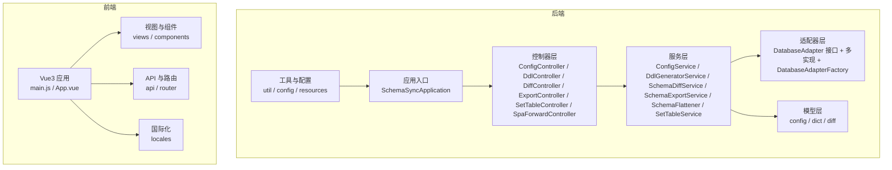
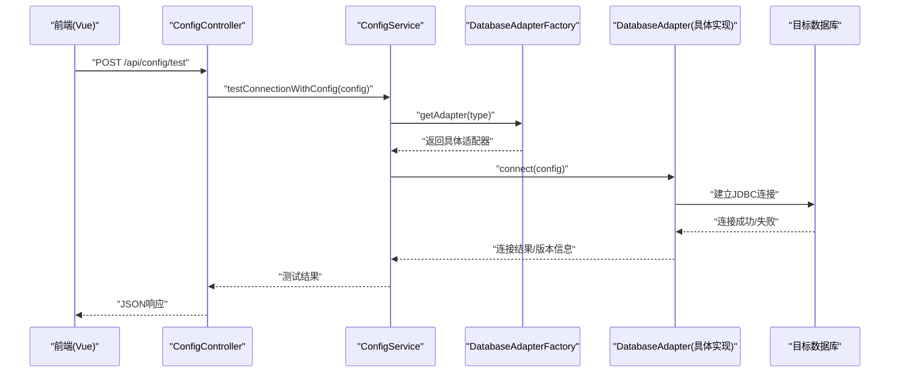
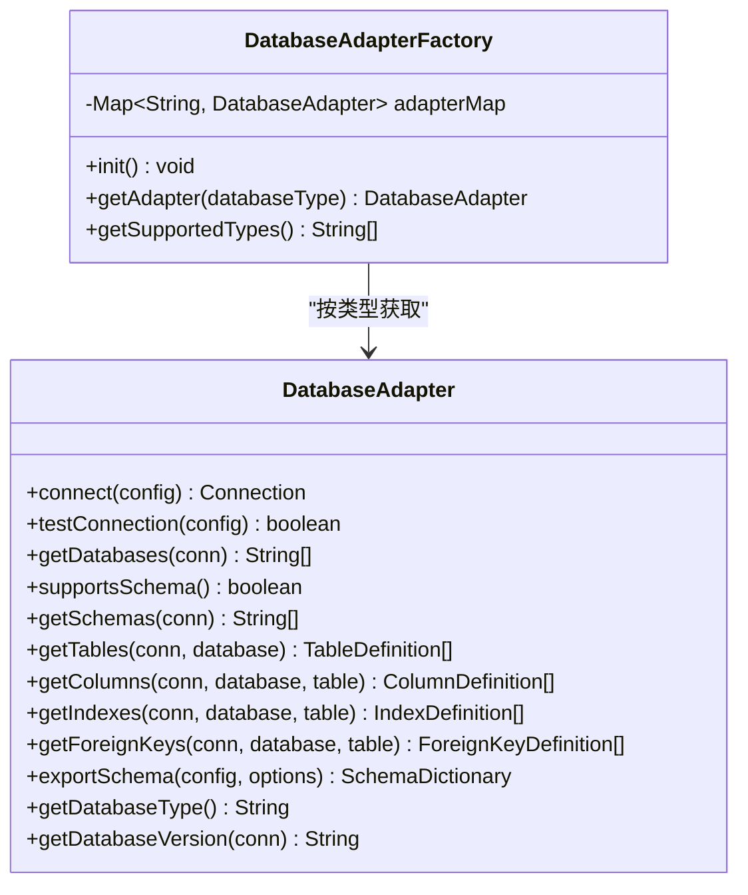
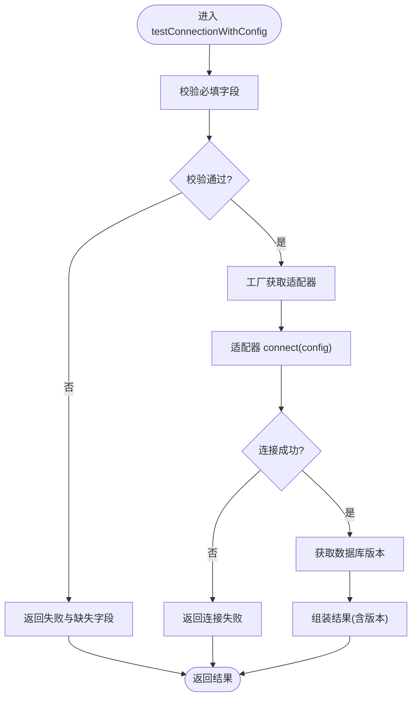
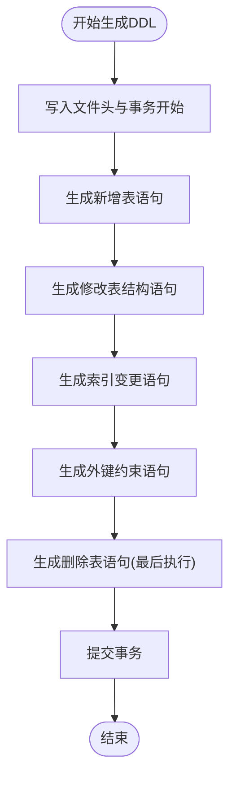
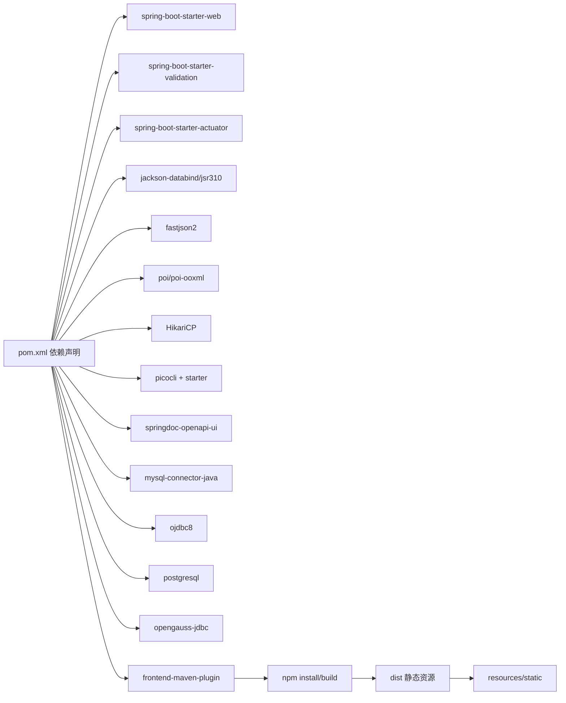

# 开发指南

<cite>
**本文引用的文件**   
- [README.md](file://README.md)
- [BUILD.md](file://BUILD.md)
- [pom.xml](file://schemasync-backend/pom.xml)
- [package.json](file://schemasync-frontend/package.json)
- [application.yml](file://schemasync-backend/src/main/resources/application.yml)
- [application-dev.yml](file://schemasync-backend/src/main/resources/application-dev.yml)
- [application-prod.yml](file://schemasync-backend/src/main/resources/application-prod.yml)
- [DatabaseAdapter.java](file://schemasync-backend/src/main/java/com/schemasync/adapter/DatabaseAdapter.java)
- [DatabaseAdapterFactory.java](file://schemasync-backend/src/main/java/com/schemasync/adapter/DatabaseAdapterFactory.java)
- [ConfigController.java](file://schemasync-backend/src/main/java/com/schemasync/controller/ConfigController.java)
- [ConfigService.java](file://schemasync-backend/src/main/java/com/schemasync/service/ConfigService.java)
- [DdlGeneratorService.java](file://schemasync-backend/src/main/java/com/schemasync/service/DdlGeneratorService.java)
- [DESIGN.md](file://DESIGN.md)
- [DefaultSchemaDifferTest.java](file://schemasync-backend/src/test/java/com/schemasync/differ/DefaultSchemaDifferTest.java)
- [JsonFormatterTest.java](file://schemasync-backend/src/test/java/com/schemasync/formatter/JsonFormatterTest.java)
- [MySQLDDLGeneratorTest.java](file://schemasync-backend/src/test/java/com/schemasync/generator/MySQLDDLGeneratorTest.java)
- [DataSourceConnectionIntegrationTest.java](file://schemasync-backend/src/test/java/com/schemasync/service/DataSourceConnectionIntegrationTest.java)
- [SchemaDiffServiceTest.java](file://schemasync-backend/src/test/java/com/schemasync/service/SchemaDiffServiceTest.java)
- [SchemaFlattenerTest.java](file://schemasync-backend/src/test/java/com/schemasync/service/SchemaFlattenerTest.java)
- [CryptoUtilTest.java](file://schemasync-backend/src/test/java/com/schemasync/util/CryptoUtilTest.java)
</cite>

## 目录
1. [简介](#简介)
2. [项目结构](#项目结构)
3. [核心组件](#核心组件)
4. [架构总览](#架构总览)
5. [详细组件分析](#详细组件分析)
6. [依赖分析](#依赖分析)
7. [性能考虑](#性能考虑)
8. [故障排查指南](#故障排查指南)
9. [结论](#结论)
10. [附录](#附录)

## 简介
本指南面向贡献者与二次开发者，提供 SchemaSync 的开发环境搭建、构建与打包流程、测试策略、新功能开发流程、代码规范与命名约定、调试技巧、扩展开发（数据库适配器、格式化器、插件）、持续集成与发布流程等完整说明。目标是帮助团队高效协作并保证代码质量。

## 项目结构
- 后端：Spring Boot 2.7.18 + Java 8，Maven 管理依赖，内置前端构建与静态资源复制，支持多环境配置与 Actuator/Swagger。
- 前端：Vue 3 + Vite 5，Element Plus，Axios，i18n，路由。
- 根目录提供跨平台一键构建脚本，自动完成前后端构建与部署包生成。

图表来源
- [pom.xml:1-339](file://schemasync-backend/pom.xml#L1-L339)
- [application.yml:1-83](file://schemasync-backend/src/main/resources/application.yml#L1-L83)
- [package.json:1-25](file://schemasync-frontend/package.json#L1-L25)

章节来源
- [README.md:1-239](file://README.md#L1-L239)
- [pom.xml:1-339](file://schemasync-backend/pom.xml#L1-L339)
- [package.json:1-25](file://schemasync-frontend/package.json#L1-L25)

## 核心组件
- 数据库适配器体系
  - 统一接口：DatabaseAdapter，定义连接、元数据导出、类型能力探测等方法。
  - 工厂模式：DatabaseAdapterFactory 在启动时扫描所有实现并注册到并发 Map，按类型获取具体适配器。
- 配置与服务
  - ConfigController 暴露数据源配置、连接测试等 REST 接口。
  - ConfigService 负责配置校验、连接测试、版本信息获取等。
- DDL 生成
  - DdlGeneratorService 提供表/字段/索引/外键的 DDL 生成逻辑，包含事务包裹与破坏性变更保护。
- 差异对比与导出
  - SchemaDiffService 负责 JSON/Excel 数据字典的差异计算。
  - SchemaExportService 负责导出为 JSON/Excel。
- 前端
  - Vue3 + Vite 开发体验良好，Element Plus 提供 UI 组件，Axios 调用后端 API。

章节来源
- [DatabaseAdapter.java:1-134](file://schemasync-backend/src/main/java/com/schemasync/adapter/DatabaseAdapter.java#L1-L134)
- [DatabaseAdapterFactory.java:1-64](file://schemasync-backend/src/main/java/com/schemasync/adapter/DatabaseAdapterFactory.java#L1-L64)
- [ConfigController.java:100-132](file://schemasync-backend/src/main/java/com/schemasync/controller/ConfigController.java#L100-L132)
- [ConfigService.java:228-295](file://schemasync-backend/src/main/java/com/schemasync/service/ConfigService.java#L228-L295)
- [DdlGeneratorService.java:290-454](file://schemasync-backend/src/main/java/com/schemasync/service/DdlGeneratorService.java#L290-L454)
- [DESIGN.md:357-395](file://DESIGN.md#L357-L395)

## 架构总览
整体采用“策略+工厂”的适配器模式，将不同数据库的差异封装在各自适配器中；服务层通过工厂选择对应适配器执行导出、对比与 DDL 生成；前端通过 REST 与后端交互。

图表来源
- [ConfigController.java:100-132](file://schemasync-backend/src/main/java/com/schemasync/controller/ConfigController.java#L100-L132)
- [ConfigService.java:228-295](file://schemasync-backend/src/main/java/com/schemasync/service/ConfigService.java#L228-L295)
- [DatabaseAdapterFactory.java:1-64](file://schemasync-backend/src/main/java/com/schemasync/adapter/DatabaseAdapterFactory.java#L1-L64)
- [DatabaseAdapter.java:1-134](file://schemasync-backend/src/main/java/com/schemasync/adapter/DatabaseAdapter.java#L1-L134)

## 详细组件分析

### 数据库适配器与工厂
- 设计要点
  - 接口抽象：DatabaseAdapter 定义连接、元数据导出、能力探测等统一方法。
  - 工厂注册：DatabaseAdapterFactory 使用 @PostConstruct 扫描 Spring 容器中的全部实现，注册到 ConcurrentHashMap。
  - 扩展友好：新增数据库只需实现接口并交由 Spring 管理，无需修改现有代码。
- 关键类关系

图表来源
- [DatabaseAdapter.java:1-134](file://schemasync-backend/src/main/java/com/schemasync/adapter/DatabaseAdapter.java#L1-L134)
- [DatabaseAdapterFactory.java:1-64](file://schemasync-backend/src/main/java/com/schemasync/adapter/DatabaseAdapterFactory.java#L1-L64)

章节来源
- [DatabaseAdapter.java:1-134](file://schemasync-backend/src/main/java/com/schemasync/adapter/DatabaseAdapter.java#L1-L134)
- [DatabaseAdapterFactory.java:1-64](file://schemasync-backend/src/main/java/com/schemasync/adapter/DatabaseAdapterFactory.java#L1-L64)
- [DESIGN.md:357-395](file://DESIGN.md#L357-L395)

### 配置与连接测试流程
- 流程说明
  - 控制器接收前端请求，组装临时配置对象。
  - 服务层进行必填项校验，调用工厂获取适配器，建立连接并尝试获取数据库版本。
  - 返回结构化结果，便于前端提示。

图表来源
- [ConfigController.java:100-132](file://schemasync-backend/src/main/java/com/schemasync/controller/ConfigController.java#L100-L132)
- [ConfigService.java:228-295](file://schemasync-backend/src/main/java/com/schemasync/service/ConfigService.java#L228-L295)
- [DatabaseAdapterFactory.java:1-64](file://schemasync-backend/src/main/java/com/schemasync/adapter/DatabaseAdapterFactory.java#L1-L64)
- [DatabaseAdapter.java:1-134](file://schemasync-backend/src/main/java/com/schemasync/adapter/DatabaseAdapter.java#L1-L134)

章节来源
- [ConfigController.java:100-132](file://schemasync-backend/src/main/java/com/schemasync/controller/ConfigController.java#L100-L132)
- [ConfigService.java:228-295](file://schemasync-backend/src/main/java/com/schemasync/service/ConfigService.java#L228-L295)

### DDL 生成逻辑
- 生成策略
  - 以事务包裹，分阶段生成：新增表、修改表结构、索引变更、外键约束、删除表。
  - 字段定义处理长度/精度、NULL 约束、默认值、自增、注释等。
  - 针对 GaussDB Oracle 兼容模式有专门生成路径。
- 复杂度与注意事项
  - 字符串默认值需转义单引号，数值型直接拼接。
  - 主键与索引生成顺序需遵循依赖关系，避免外键冲突。

图表来源
- [DdlGeneratorService.java:290-454](file://schemasync-backend/src/main/java/com/schemasync/service/DdlGeneratorService.java#L290-L454)
- [DESIGN.md:1237-1397](file://DESIGN.md#L1237-L1397)

章节来源
- [DdlGeneratorService.java:290-454](file://schemasync-backend/src/main/java/com/schemasync/service/DdlGeneratorService.java#L290-L454)
- [DESIGN.md:1237-1397](file://DESIGN.md#L1237-L1397)

### 单元测试框架与用例组织
- 框架与依赖
  - 基于 Spring Boot Test 与 JUnit，位于后端模块的 src/test 下。
- 用例分布与策略
  - differ：DefaultSchemaDifferTest，覆盖差异对比核心逻辑。
  - formatter：JsonFormatterTest，覆盖 JSON 序列化/反序列化与边界情况。
  - generator：MySQLDDLGeneratorTest，覆盖 MySQL DDL 生成场景。
  - service：
    - DataSourceConnectionIntegrationTest：端到端连接测试、配置完整性检查、类型支持验证。
    - SchemaDiffServiceTest：差异服务核心用例。
    - SchemaFlattenerTest：扁平化逻辑用例。
  - util：CryptoUtilTest：加密工具用例。
- 运行方式
  - Maven 命令：mvn test（或 mvn clean test）。
  - 覆盖率建议结合 JaCoCo 插件（可在 pom.xml 中引入并配置）。

章节来源
- [pom.xml:173-184](file://schemasync-backend/pom.xml#L173-L184)
- [DefaultSchemaDifferTest.java](file://schemasync-backend/src/test/java/com/schemasync/differ/DefaultSchemaDifferTest.java)
- [JsonFormatterTest.java](file://schemasync-backend/src/test/java/com/schemasync/formatter/JsonFormatterTest.java)
- [MySQLDDLGeneratorTest.java](file://schemasync-backend/src/test/java/com/schemasync/generator/MySQLDDLGeneratorTest.java)
- [DataSourceConnectionIntegrationTest.java:99-256](file://schemasync-backend/src/test/java/com/schemasync/service/DataSourceConnectionIntegrationTest.java#L99-L256)
- [SchemaDiffServiceTest.java](file://schemasync-backend/src/test/java/com/schemasync/service/SchemaDiffServiceTest.java)
- [SchemaFlattenerTest.java](file://schemasync-backend/src/test/java/com/schemasync/service/SchemaFlattenerTest.java)
- [CryptoUtilTest.java](file://schemasync-backend/src/test/java/com/schemasync/util/CryptoUtilTest.java)

## 依赖分析
- 后端依赖
  - Spring Boot Starter Web/Validation/Actuator、Jackson、Fastjson2、Apache POI、HikariCP、Picocli、各数据库驱动、Swagger/OpenAPI。
  - 构建期通过 frontend-maven-plugin 自动安装 Node/npm、安装前端依赖并构建，再将 dist 复制到后端 static 资源目录。
- 前端依赖
  - Vue 3、Element Plus、Axios、Vue Router、i18n、Vite 构建。

图表来源
- [pom.xml:39-184](file://schemasync-backend/pom.xml#L39-L184)
- [pom.xml:194-263](file://schemasync-backend/pom.xml#L194-L263)

章节来源
- [pom.xml:1-339](file://schemasync-backend/pom.xml#L1-L339)
- [package.json:1-25](file://schemasync-frontend/package.json#L1-L25)

## 性能考虑
- 连接池
  - HikariCP 作为默认连接池，可通过 application.yml 调整 max-pool-size、min-idle、max-lifetime、connection-timeout 等参数。
- 日志
  - 开发环境 com.schemasync 包日志级别为 DEBUG，生产环境调整为 INFO/WARN，避免过多 IO。
- 文件上传
  - 最大文件大小与请求大小已配置，注意大文件导出时的内存占用。
- 前端构建
  - 首次构建会下载 Node/npm 与前端依赖，后续可复用缓存。

章节来源
- [application.yml:1-83](file://schemasync-backend/src/main/resources/application.yml#L1-L83)
- [application-dev.yml:1-8](file://schemasync-backend/src/main/resources/application-dev.yml#L1-L8)
- [application-prod.yml:1-12](file://schemasync-backend/src/main/resources/application-prod.yml#L1-L12)

## 故障排查指南
- 构建失败
  - 检查 Java/Maven 版本是否符合要求。
  - 查看 Maven 输出错误信息，确认网络是否能访问中央仓库。
- 无法启动
  - 检查端口占用（默认 8999 开发、8080 生产）。
  - 查看日志文件 logs/schemasync.log。
  - 检查配置文件 deploy/application.yml 或当前环境的 application.yml。
- 连接测试失败
  - 确认必填字段是否齐全（类型、主机、端口、库名、用户名）。
  - 检查防火墙与白名单设置。
  - 查看异常堆栈与根本原因。

章节来源
- [BUILD.md:119-136](file://BUILD.md#L119-L136)
- [application.yml:1-83](file://schemasync-backend/src/main/resources/application.yml#L1-L83)
- [application-dev.yml:1-8](file://schemasync-backend/src/main/resources/application-dev.yml#L1-L8)
- [application-prod.yml:1-12](file://schemasync-backend/src/main/resources/application-prod.yml#L1-L12)
- [ConfigService.java:228-295](file://schemasync-backend/src/main/java/com/schemasync/service/ConfigService.java#L228-L295)

## 结论
SchemaSync 采用清晰的分层与可扩展的适配器模式，配合完善的构建脚本与多环境配置，能够快速交付与稳定运行。通过规范的测试与日志策略，有助于保障质量与可维护性。建议在扩展新数据库或功能时严格遵循接口契约与测试覆盖原则。

## 附录

### 构建与打包流程
- 一键构建
  - Windows：在项目根目录运行 build.bat。
  - Linux/Mac：赋予执行权限后运行 ./build.sh。
- 构建产物
  - deploy 目录包含 schemasync.jar、application.yml、启动脚本与部署文档。
- 手动构建
  - 后端：mvn clean package -P prod（或 dev）。
  - 前端：cd schemasync-frontend && npm run build。
- 启动
  - java -jar schemasync-backend/target/*.jar 或通过 start.sh/bat。

章节来源
- [BUILD.md:1-136](file://BUILD.md#L1-L136)
- [pom.xml:194-263](file://schemasync-backend/pom.xml#L194-L263)
- [package.json:1-25](file://schemasync-frontend/package.json#L1-L25)

### 测试执行命令
- 全量测试：mvn test
- 指定模块：mvn -pl schemasync-backend test
- 跳过前端构建仅测试：mvn -DskipFrontend=true test（如自定义 profile）

章节来源
- [pom.xml:173-184](file://schemasync-backend/pom.xml#L173-L184)

### 新功能开发流程（从需求到上线）
- 需求分析与设计
  - 明确输入/输出、边界条件、兼容性影响。
  - 评估是否需要新增适配器/格式化器/服务。
- 设计与建模
  - 若新增数据库：实现 DatabaseAdapter 接口，并在工厂中自动注册。
  - 若新增格式化器：实现相应 Formatter 接口（参考 JsonFormatter/ExcelFormatter）。
  - 更新数据模型（dict/diff/config）与 DTO。
- 编码实现
  - 控制器暴露必要 API，服务层实现业务逻辑。
  - 遵循事务与破坏性变更保护原则。
- 测试
  - 编写单元测试与必要的集成测试，确保核心路径与异常路径均覆盖。
- 文档与评审
  - 更新相关文档（README/DESIGN），提交 PR 并进行代码评审。
- 构建与发布
  - 本地构建并通过测试，生成 deploy 包，按发布流程发布。

章节来源
- [DatabaseAdapter.java:1-134](file://schemasync-backend/src/main/java/com/schemasync/adapter/DatabaseAdapter.java#L1-L134)
- [DatabaseAdapterFactory.java:1-64](file://schemasync-backend/src/main/java/com/schemasync/adapter/DatabaseAdapterFactory.java#L1-L64)
- [DdlGeneratorService.java:290-454](file://schemasync-backend/src/main/java/com/schemasync/service/DdlGeneratorService.java#L290-L454)

### 代码规范与命名约定
- Java 编码标准
  - 包名小写、类名大驼峰、方法与变量小驼峰、常量全大写。
  - 使用 Lombok 简化样板代码，但保持可读性与可维护性。
  - 对外暴露的 API 使用统一的响应结构与错误码。
- Vue3 组件开发规范
  - 组件文件以 PascalCase 命名，单一职责，props 明确类型与默认值。
  - 使用 Composition API，合理拆分逻辑与状态。
  - 路由与页面分离，视图聚焦展示与交互。
- Git 提交规范
  - 建议使用 Conventional Commits：feat/fix/docs/style/refactor/perf/test/build/ci/chore/revert。
  - 提交信息简洁明了，关联 Issue/PR 编号。

章节来源
- [README.md:1-239](file://README.md#L1-L239)
- [package.json:1-25](file://schemasync-frontend/package.json#L1-L25)

### 调试技巧与常用工具
- IDE 配置
  - 后端：启用 Lombok 注解处理器，配置 UTF-8 编码。
  - 前端：安装 Vite 插件，开启热重载。
- 日志分析
  - 开发环境 com.schemasync 包为 DEBUG，生产环境降低级别。
  - 关注 logs/schemasync.log 与 Actuator 健康检查。
- 性能监控
  - 使用 Actuator 的 health/info/metrics 端点。
  - 观察连接池指标与慢查询日志（数据库侧）。

章节来源
- [application.yml:1-83](file://schemasync-backend/src/main/resources/application.yml#L1-L83)
- [application-dev.yml:1-8](file://schemasync-backend/src/main/resources/application-dev.yml#L1-L8)
- [application-prod.yml:1-12](file://schemasync-backend/src/main/resources/application-prod.yml#L1-L12)

### 扩展开发指南
- 添加新的数据库适配器
  - 实现 DatabaseAdapter 接口，提供 connect、getDatabases、getTables、getColumns、getIndexes、getForeignKeys、exportSchema、getDatabaseType、getDatabaseVersion 等方法。
  - 通过 Spring 管理该实现，工厂会自动发现并注册。
  - 在 README/DESIGN 中补充支持列表与注意事项。
- 自定义格式化器
  - 参考 JsonFormatter/ExcelFormatter，实现新的 Formatter，并在服务层注册与调用。
- 插件开发
  - 基于策略模式扩展差异化规则或 DDL 生成策略，保持对现有代码的封闭性。

章节来源
- [DatabaseAdapter.java:1-134](file://schemasync-backend/src/main/java/com/schemasync/adapter/DatabaseAdapter.java#L1-L134)
- [DatabaseAdapterFactory.java:1-64](file://schemasync-backend/src/main/java/com/schemasync/adapter/DatabaseAdapterFactory.java#L1-L64)
- [DESIGN.md:357-395](file://DESIGN.md#L357-L395)

### 持续集成、代码质量与发布流程
- CI 建议
  - 触发条件：push/PR。
  - 步骤：安装 JDK/Maven/Node → 构建前端 → 编译后端 → 运行测试 → 生成报告。
- 代码质量
  - 引入 SonarQube 进行静态扫描，配置质量门禁。
  - 引入 SpotBugs/PMD 进行额外检查。
- 发布流程
  - 打 Tag 并构建 release 包，生成 changelog。
  - 将 deploy 产物归档，更新部署文档与版本说明。

章节来源
- [BUILD.md:1-136](file://BUILD.md#L1-L136)
- [pom.xml:194-263](file://schemasync-backend/pom.xml#L194-L263)