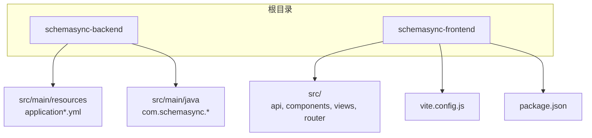
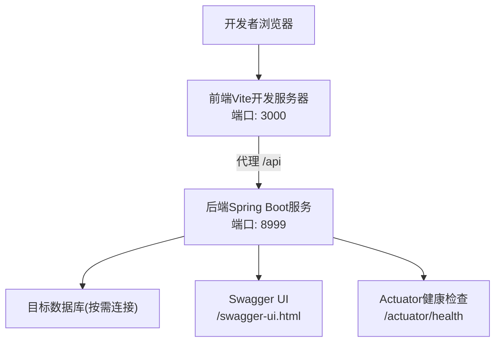
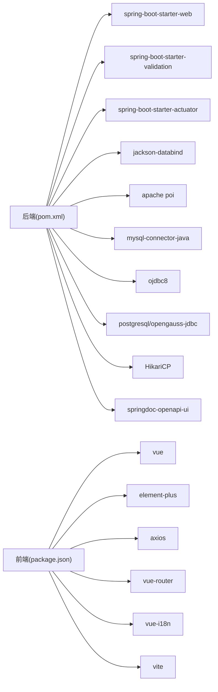

# 开发环境配置

<cite>
**本文引用的文件列表**
- [README.md](file://README.md)
- [QUICKSTART.md](file://QUICKSTART.md)
- [pom.xml](file://schemasync-backend/pom.xml)
- [package.json](file://schemasync-frontend/package.json)
- [application.yml](file://schemasync-backend/src/main/resources/application.yml)
- [application-dev.yml](file://schemasync-backend/src/main/resources/application-dev.yml)
- [application-prod.yml](file://schemasync-backend/src/main/resources/application-prod.yml)
- [vite.config.js](file://schemasync-frontend/vite.config.js)
- [SwaggerConfig.java](file://schemasync-backend/src/main/java/com/schemasync/config/SwaggerConfig.java)
- [CryptoUtil.java](file://schemasync-backend/src/main/java/com/schemasync/util/CryptoUtil.java)
</cite>

## 目录
1. [简介](#简介)
2. [项目结构](#项目结构)
3. [核心组件](#核心组件)
4. [架构总览](#架构总览)
5. [详细组件分析](#详细组件分析)
6. [依赖分析](#依赖分析)
7. [性能考虑](#性能考虑)
8. [故障排查指南](#故障排查指南)
9. [结论](#结论)
10. [附录](#附录)

## 简介
本指南面向SchemaSync项目的开发者，提供从零搭建本地开发环境的完整步骤与最佳实践。内容涵盖：
- 基础环境要求（JDK、Node.js、Maven）
- IDE推荐与插件、调试配置
- 项目克隆后的初始化流程（依赖安装、配置文件、数据库连接）
- 前后端分离启动方式（Spring Boot后端、Vue3前端）
- 环境变量、日志级别、Swagger文档等开发辅助工具配置
- 常见问题定位与解决方案

## 项目结构
本项目采用前后端分离的模块化结构：
- schemasync-backend：基于Spring Boot的后端服务，提供REST API、数据源管理、导出/对比/DDL生成等能力
- schemasync-frontend：基于Vue3 + Vite的前端应用，提供可视化操作界面

图表来源
- [pom.xml:1-339](file://schemasync-backend/pom.xml#L1-L339)
- [package.json:1-25](file://schemasync-frontend/package.json#L1-L25)
- [application.yml:1-83](file://schemasync-backend/src/main/resources/application.yml#L1-L83)
- [vite.config.js:1-17](file://schemasync-frontend/vite.config.js#L1-L17)

章节来源
- [README.md:66-98](file://README.md#L66-L98)

## 核心组件
- 后端技术栈
  - Spring Boot 2.7.18，Java 8
  - 多数据库驱动（MySQL、Oracle、PostgreSQL/OpenGauss等）
  - HikariCP连接池、Jackson JSON、Apache POI（Excel）、springdoc-openapi（Swagger UI）
- 前端技术栈
  - Vue 3 + Element Plus + Vite 5 + Axios + Vue Router + vue-i18n

章节来源
- [README.md:38-57](file://README.md#L38-L57)
- [pom.xml:23-37](file://schemasync-backend/pom.xml#L23-L37)
- [pom.xml:39-184](file://schemasync-backend/pom.xml#L39-L184)
- [package.json:11-23](file://schemasync-frontend/package.json#L11-L23)

## 架构总览
下图展示了开发环境下前后端交互与关键配置点：

图表来源
- [vite.config.js:7-15](file://schemasync-frontend/vite.config.js#L7-L15)
- [application.yml:1-4](file://schemasync-backend/src/main/resources/application.yml#L1-L4)
- [application.yml:76-83](file://schemasync-backend/src/main/resources/application.yml#L76-L83)

## 详细组件分析

### 环境与IDE准备
- 基础环境
  - JDK 8+（项目默认使用Java 8）
  - Node.js 18+（前端构建与开发）
  - Maven 3.6+（后端构建与运行）
- IDE推荐
  - IntelliJ IDEA
    - 安装Lombok插件
    - 启用注解处理（Enable annotation processing）
    - 导入maven模块：schemasync-backend
  - VS Code
    - 安装Extension Pack for Java、Lombok Annotations Support、Spring Boot Extension Pack
    - 打开工作区并加载maven项目
- 验证环境
  - java -version
  - mvn -version
  - node -v && npm -v

章节来源
- [README.md:104-108](file://README.md#L104-L108)
- [pom.xml:23-26](file://schemasync-backend/pom.xml#L23-L26)

### 项目初始化与依赖安装
- 克隆仓库后进入后端目录执行编译与打包（可选）
  - 在schemasync-backend下执行mvn相关命令
- 安装前端依赖
  - 在schemasync-frontend下执行npm install
- 构建产物集成（可选）
  - 通过Maven插件将前端dist复制到后端静态资源目录，便于打包部署

章节来源
- [QUICKSTART.md:15-20](file://QUICKSTART.md#L15-L20)
- [pom.xml:194-263](file://schemasync-backend/pom.xml#L194-L263)
- [package.json:6-9](file://schemasync-frontend/package.json#L6-L9)

### 配置文件与环境变量
- 后端主配置
  - application.yml定义服务端口、上下文路径、日志、自定义参数、Actuator与Swagger路径
- 环境Profile
  - application-dev.yml：开发环境日志级别更详细
  - application-prod.yml：生产环境端口与日志路径覆盖
- 自定义配置项
  - schemasync.data-source-config-file：数据源配置文件路径（支持相对/绝对路径）
  - schemasync.default-output-dir：导出文件默认输出目录
  - 连接池与超时参数：max-pool-size、connection-timeout、min-idle、max-lifetime
- 环境变量注入
  - 可通过-D或系统环境变量覆盖application.yml中的属性（如server.port、logging.level.*、schemasync.*）

章节来源
- [application.yml:1-83](file://schemasync-backend/src/main/resources/application.yml#L1-L83)
- [application-dev.yml:1-8](file://schemasync-backend/src/main/resources/application-dev.yml#L1-L8)
- [application-prod.yml:1-12](file://schemasync-backend/src/main/resources/application-prod.yml#L1-L12)

### 数据库连接配置
- 数据源配置文件
  - 默认读取启动目录下的schemasync-config.json（可在配置中指定其他路径）
  - 示例字段包括id、name、type、host、port、database、username、password、charset、timeout等
- 密码加密
  - 配置中的密码会进行AES-128加密存储；解密由工具类完成
- 连接测试
  - 通过API接口进行连接性校验（详见快速开始文档）

章节来源
- [QUICKSTART.md:22-44](file://QUICKSTART.md#L22-L44)
- [application.yml:36-65](file://schemasync-backend/src/main/resources/application.yml#L36-L65)
- [CryptoUtil.java:1-84](file://schemasync-backend/src/main/java/com/schemasync/util/CryptoUtil.java#L1-L84)

### 前后端分离启动
- 启动后端（Spring Boot）
  - 在schemasync-backend目录下执行mvn spring-boot:run
  - 默认访问地址：http://localhost:8999
- 启动前端（Vue3 + Vite）
  - 在schemasync-frontend目录下执行npm run dev
  - 默认访问地址：http://localhost:3000
  - 前端通过Vite代理将/api请求转发到后端8999端口
- 独立打包运行（可选）
  - 后端可打包为jar并通过java -jar运行
  - 前端可执行npm run build并在静态服务器上预览

章节来源
- [README.md:110-125](file://README.md#L110-L125)
- [QUICKSTART.md:46-56](file://QUICKSTART.md#L46-L56)
- [vite.config.js:7-15](file://schemasync-frontend/vite.config.js#L7-L15)

### 开发辅助工具配置
- Swagger文档
  - 访问路径：/swagger-ui.html
  - OpenAPI元数据路径：/api-docs
  - 可在application.yml中调整路径与开关
- Actuator监控
  - 暴露健康检查等端点，默认包含health、info、metrics
  - 健康检查路径：/actuator/health
- 日志
  - 控制台与文件双输出，开发环境建议开启DEBUG级别以便排障
  - 日志文件路径与滚动策略在application.yml中配置

章节来源
- [application.yml:24-34](file://schemasync-backend/src/main/resources/application.yml#L24-L34)
- [application.yml:66-75](file://schemasync-backend/src/main/resources/application.yml#L66-L75)
- [application.yml:76-83](file://schemasync-backend/src/main/resources/application.yml#L76-L83)
- [SwaggerConfig.java:1-34](file://schemasync-backend/src/main/java/com/schemasync/config/SwaggerConfig.java#L1-L34)

### 调试与断点
- 后端调试
  - 在IDE中以Spring Boot方式运行主类，设置断点后通过Swagger或curl触发接口
- 前端调试
  - 使用浏览器开发者工具查看网络请求与页面状态
  - 确认Vite代理规则是否正确转发/api到后端

章节来源
- [vite.config.js:9-14](file://schemasync-frontend/vite.config.js#L9-L14)
- [application.yml:1-4](file://schemasync-backend/src/main/resources/application.yml#L1-L4)

## 依赖分析
- 后端依赖要点
  - Spring Boot Starter Web/Validation/Actuator
  - Jackson、Fastjson2（备用）
  - Apache POI（Excel）
  - 多数据库驱动（MySQL、Oracle、PostgreSQL/OpenGauss）
  - HikariCP连接池
  - springdoc-openapi-ui（Swagger UI）
- 前端依赖要点
  - Vue 3、Element Plus、Axios、Vue Router、vue-i18n
  - Vite构建与Vue插件

图表来源
- [pom.xml:39-184](file://schemasync-backend/pom.xml#L39-L184)
- [package.json:11-23](file://schemasync-frontend/package.json#L11-L23)

章节来源
- [pom.xml:39-184](file://schemasync-backend/pom.xml#L39-L184)
- [package.json:11-23](file://schemasync-frontend/package.json#L11-L23)

## 性能考虑
- 连接池参数
  - 根据并发与数据库负载调整max-pool-size、min-idle、max-lifetime与connection-timeout
- 日志级别
  - 开发阶段使用DEBUG提升排障效率，生产建议降低至INFO/WARN以减少IO开销
- 大对象导出
  - Excel导出涉及大量内存占用，建议在导出时限制表数量或分页处理（业务侧实现）

[本节为通用指导，不直接分析具体文件]

## 故障排查指南
- 无法访问Swagger
  - 确认后端已启动且端口正确
  - 访问路径应为/swagger-ui.html
- 前端请求跨域或404
  - 检查Vite代理是否指向正确的后端端口
  - 确认后端context-path与接口前缀一致
- 数据库连接失败
  - 核对数据源配置文件中的host、port、database、username、password
  - 确认目标库INFORMATION_SCHEMA权限
- 日志无输出或过大
  - 检查application.yml中日志路径与滚动策略
  - 调整日志级别避免过多输出

章节来源
- [QUICKSTART.md:58-83](file://QUICKSTART.md#L58-L83)
- [QUICKSTART.md:136-158](file://QUICKSTART.md#L136-L158)
- [application.yml:24-34](file://schemasync-backend/src/main/resources/application.yml#L24-L34)
- [vite.config.js:9-14](file://schemasync-frontend/vite.config.js#L9-L14)

## 结论
按照本指南完成基础环境、IDE、依赖与配置后，即可在本地高效开展SchemaSync的前后端开发与联调。建议结合Swagger与Actuator进行接口与健康检查，利用日志与代理机制快速定位问题。

[本节为总结性内容，不直接分析具体文件]

## 附录
- 常用命令速查
  - 后端：cd schemasync-backend && mvn spring-boot:run
  - 前端：cd schemasync-frontend && npm install && npm run dev
- 访问地址
  - 后端：http://localhost:8999
  - 前端：http://localhost:3000
  - Swagger：http://localhost:8999/swagger-ui.html
  - 健康检查：http://localhost:8999/actuator/health

章节来源
- [README.md:110-125](file://README.md#L110-L125)
- [application.yml:1-4](file://schemasync-backend/src/main/resources/application.yml#L1-L4)
- [application.yml:76-83](file://schemasync-backend/src/main/resources/application.yml#L76-L83)
- [application.yml:66-75](file://schemasync-backend/src/main/resources/application.yml#L66-L75)