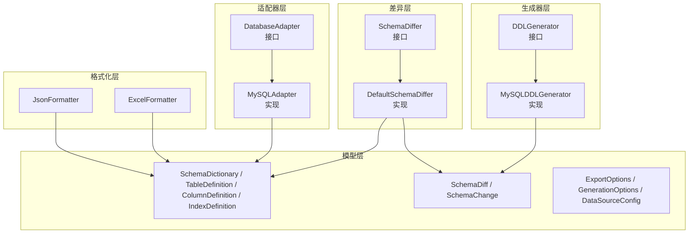
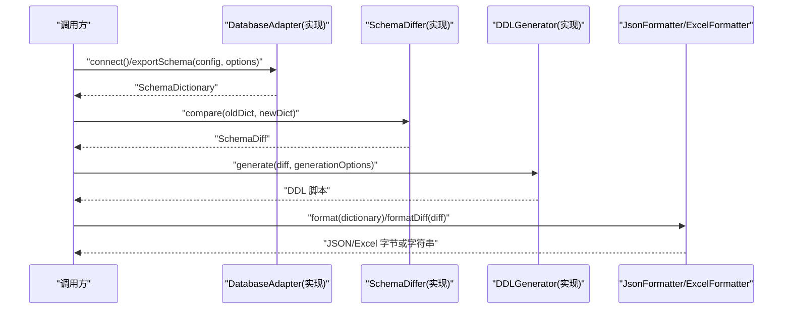
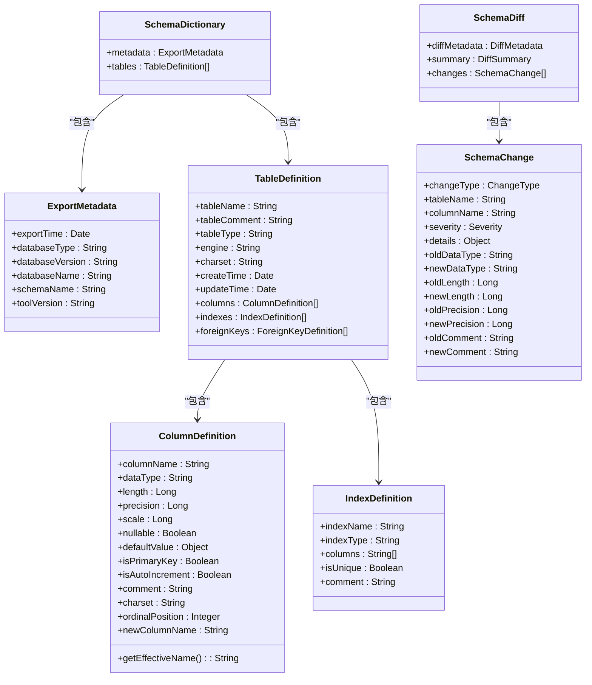
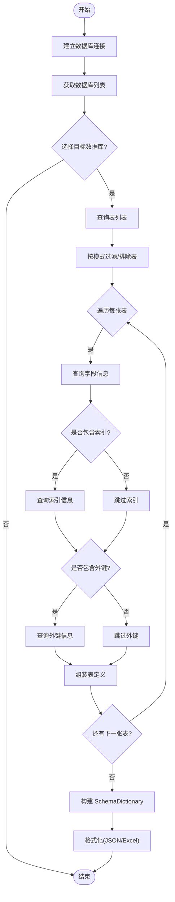
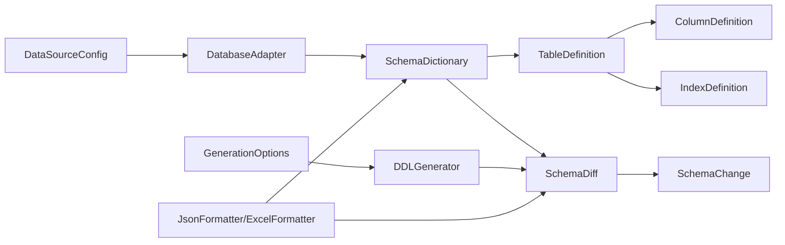

# 扩展开发

<cite>
**本文引用的文件**   
- [DatabaseAdapter.java](file://schemasync-backend/src/main/java/com/schemasync/adapter/DatabaseAdapter.java)
- [MySQLAdapter.java](file://schemasync-backend/src/main/java/com/schemasync/adapter/MySQLAdapter.java)
- [ExportOptions.java](file://schemasync-backend/src/main/java/com/schemasync/adapter/ExportOptions.java)
- [DDLGenerator.java](file://schemasync-backend/src/main/java/com/schemasync/generator/DDLGenerator.java)
- [GenerationOptions.java](file://schemasync-backend/src/main/java/com/schemasync/generator/GenerationOptions.java)
- [MySQLDDLGenerator.java](file://schemasync-backend/src/main/java/com/schemasync/generator/MySQLDDLGenerator.java)
- [JsonFormatter.java](file://schemasync-backend/src/main/java/com/schemasync/formatter/JsonFormatter.java)
- [ExcelFormatter.java](file://schemasync-backend/src/main/java/com/schemasync/formatter/ExcelFormatter.java)
- [SchemaDiffer.java](file://schemasync-backend/src/main/java/com/schemasync/differ/SchemaDiffer.java)
- [DefaultSchemaDiffer.java](file://schemasync-backend/src/main/java/com/schemasync/differ/DefaultSchemaDiffer.java)
- [SchemaDictionary.java](file://schemasync-backend/src/main/java/com/schemasync/model/dict/SchemaDictionary.java)
- [TableDefinition.java](file://schemasync-backend/src/main/java/com/schemasync/model/dict/TableDefinition.java)
- [ColumnDefinition.java](file://schemasync-backend/src/main/java/com/schemasync/model/dict/ColumnDefinition.java)
- [IndexDefinition.java](file://schemasync-backend/src/main/java/com/schemasync/model/dict/IndexDefinition.java)
- [ExportMetadata.java](file://schemasync-backend/src/main/java/com/schemasync/model/dict/ExportMetadata.java)
- [SchemaDiff.java](file://schemasync-backend/src/main/java/com/schemasync/model/diff/SchemaDiff.java)
- [SchemaChange.java](file://schemasync-backend/src/main/java/com/schemasync/model/diff/SchemaChange.java)
- [DataSourceConfig.java](file://schemasync-backend/src/main/java/com/schemasync/model/config/DataSourceConfig.java)
</cite>

## 目录
1. [简介](#简介)
2. [项目结构](#项目结构)
3. [核心组件](#核心组件)
4. [架构总览](#架构总览)
5. [详细组件分析](#详细组件分析)
6. [依赖关系分析](#依赖关系分析)
7. [性能考虑](#性能考虑)
8. [故障排查指南](#故障排查指南)
9. [结论](#结论)
10. [附录](#附录)

## 简介
本指南面向希望为 SchemaSync 添加新功能或扩展现有能力的开发者。内容覆盖：
- 新增数据库适配器（实现 DatabaseAdapter 接口、JDBC 查询编写、数据类型映射）
- 自定义格式化器（导出格式转换、Excel 模板定制）
- DDL 生成器扩展（不同数据库 SQL 语法适配、生成选项配置）
- 插件化最佳实践（依赖注入、配置管理、错误处理）
- API 扩展方法（新增 REST 接口、参数校验、响应格式）
- 完整示例与测试方法
- 向后兼容性与版本升级指导

## 项目结构
后端采用分层与模块化组织，关键包职责如下：
- adapter：数据库适配器抽象与具体实现，负责连接、元数据抽取与导出
- generator：DDL 生成器抽象与 MySQL 实现，负责差异到脚本的转换
- formatter：输出格式化器（JSON、Excel），负责将内部模型转换为外部格式
- differ：差异对比器抽象与默认实现，负责两个数据字典的差异计算
- model：领域模型，包括数据字典、差异结果、配置等
- service：业务服务层（不在本次扩展重点范围内）
- util：工具类（如连接池、加密等）

图表来源
- [DatabaseAdapter.java:1-134](file://schemasync-backend/src/main/java/com/schemasync/adapter/DatabaseAdapter.java#L1-L134)
- [MySQLAdapter.java:1-367](file://schemasync-backend/src/main/java/com/schemasync/adapter/MySQLAdapter.java#L1-L367)
- [SchemaDiffer.java:1-24](file://schemasync-backend/src/main/java/com/schemasync/differ/SchemaDiffer.java#L1-L24)
- [DefaultSchemaDiffer.java:1-512](file://schemasync-backend/src/main/java/com/schemasync/differ/DefaultSchemaDiffer.java#L1-L512)
- [DDLGenerator.java:1-35](file://schemasync-backend/src/main/java/com/schemasync/generator/DDLGenerator.java#L1-L35)
- [MySQLDDLGenerator.java:1-354](file://schemasync-backend/src/main/java/com/schemasync/generator/MySQLDDLGenerator.java#L1-L354)
- [JsonFormatter.java:1-119](file://schemasync-backend/src/main/java/com/schemasync/formatter/JsonFormatter.java#L1-L119)
- [ExcelFormatter.java:1-408](file://schemasync-backend/src/main/java/com/schemasync/formatter/ExcelFormatter.java#L1-L408)
- [SchemaDictionary.java:1-28](file://schemasync-backend/src/main/java/com/schemasync/model/dict/SchemaDictionary.java#L1-L28)
- [TableDefinition.java:1-89](file://schemasync-backend/src/main/java/com/schemasync/model/dict/TableDefinition.java#L1-L89)
- [ColumnDefinition.java:1-116](file://schemasync-backend/src/main/java/com/schemasync/model/dict/ColumnDefinition.java#L1-L116)
- [IndexDefinition.java:1-49](file://schemasync-backend/src/main/java/com/schemasync/model/dict/IndexDefinition.java#L1-L49)
- [SchemaDiff.java:1-35](file://schemasync-backend/src/main/java/com/schemasync/model/diff/SchemaDiff.java#L1-L35)
- [SchemaChange.java:1-181](file://schemasync-backend/src/main/java/com/schemasync/model/diff/SchemaChange.java#L1-L181)
- [ExportOptions.java:1-122](file://schemasync-backend/src/main/java/com/schemasync/adapter/ExportOptions.java#L1-L122)
- [GenerationOptions.java:1-96](file://schemasync-backend/src/main/java/com/schemasync/generator/GenerationOptions.java#L1-L96)
- [DataSourceConfig.java:1-129](file://schemasync-backend/src/main/java/com/schemasync/model/config/DataSourceConfig.java#L1-L129)

章节来源
- [DatabaseAdapter.java:1-134](file://schemasync-backend/src/main/java/com/schemasync/adapter/DatabaseAdapter.java#L1-L134)
- [MySQLAdapter.java:1-367](file://schemasync-backend/src/main/java/com/schemasync/adapter/MySQLAdapter.java#L1-L367)
- [SchemaDiffer.java:1-24](file://schemasync-backend/src/main/java/com/schemasync/differ/SchemaDiffer.java#L1-L24)
- [DefaultSchemaDiffer.java:1-512](file://schemasync-backend/src/main/java/com/schemasync/differ/DefaultSchemaDiffer.java#L1-L512)
- [DDLGenerator.java:1-35](file://schemasync-backend/src/main/java/com/schemasync/generator/DDLGenerator.java#L1-L35)
- [MySQLDDLGenerator.java:1-354](file://schemasync-backend/src/main/java/com/schemasync/generator/MySQLDDLGenerator.java#L1-L354)
- [JsonFormatter.java:1-119](file://schemasync-backend/src/main/java/com/schemasync/formatter/JsonFormatter.java#L1-L119)
- [ExcelFormatter.java:1-408](file://schemasync-backend/src/main/java/com/schemasync/formatter/ExcelFormatter.java#L1-L408)
- [SchemaDictionary.java:1-28](file://schemasync-backend/src/main/java/com/schemasync/model/dict/SchemaDictionary.java#L1-L28)
- [TableDefinition.java:1-89](file://schemasync-backend/src/main/java/com/schemasync/model/dict/TableDefinition.java#L1-L89)
- [ColumnDefinition.java:1-116](file://schemasync-backend/src/main/java/com/schemasync/model/dict/ColumnDefinition.java#L1-L116)
- [IndexDefinition.java:1-49](file://schemasync-backend/src/main/java/com/schemasync/model/dict/IndexDefinition.java#L1-L49)
- [SchemaDiff.java:1-35](file://schemasync-backend/src/main/java/com/schemasync/model/diff/SchemaDiff.java#L1-L35)
- [SchemaChange.java:1-181](file://schemasync-backend/src/main/java/com/schemasync/model/diff/SchemaChange.java#L1-L181)
- [ExportOptions.java:1-122](file://schemasync-backend/src/main/java/com/schemasync/adapter/ExportOptions.java#L1-L122)
- [GenerationOptions.java:1-96](file://schemasync-backend/src/main/java/com/schemasync/generator/GenerationOptions.java#L1-L96)
- [DataSourceConfig.java:1-129](file://schemasync-backend/src/main/java/com/schemasync/model/config/DataSourceConfig.java#L1-L129)

## 核心组件
- 数据库适配器（DatabaseAdapter）
  - 定义统一的数据源访问契约：连接、测试、库/表/字段/索引/外键获取、导出完整数据字典、类型与版本信息。
  - 提供 supportsSchema() 默认行为，便于区分是否支持 SCHEMA 层级。
- 数据字典与差异模型
  - SchemaDictionary：包含导出元信息与表集合。
  - TableDefinition/ColumnDefinition/IndexDefinition：描述表、字段、索引的结构。
  - SchemaDiff/SchemaChange：描述差异结果与变更项，含严重程度与详情。
- 差异对比器（SchemaDiffer）
  - 对比新旧数据字典，产出差异对象，统计破坏性变更与非破坏性变更。
- DDL 生成器（DDLGenerator）
  - 根据差异与生成选项，输出目标数据库的 DDL 脚本与回滚脚本。
- 格式化器（JsonFormatter/ExcelFormatter）
  - 将数据字典序列化为 JSON 字节/字符串，或生成 Excel 工作簿。
- 配置与选项
  - DataSourceConfig：数据源连接配置（含可选 JDBC URL 与连接池配置）。
  - ExportOptions：导出过滤与包含项控制。
  - GenerationOptions：DDL 生成开关与版本标识。

章节来源
- [DatabaseAdapter.java:1-134](file://schemasync-backend/src/main/java/com/schemasync/adapter/DatabaseAdapter.java#L1-L134)
- [SchemaDictionary.java:1-28](file://schemasync-backend/src/main/java/com/schemasync/model/dict/SchemaDictionary.java#L1-L28)
- [TableDefinition.java:1-89](file://schemasync-backend/src/main/java/com/schemasync/model/dict/TableDefinition.java#L1-L89)
- [ColumnDefinition.java:1-116](file://schemasync-backend/src/main/java/com/schemasync/model/dict/ColumnDefinition.java#L1-L116)
- [IndexDefinition.java:1-49](file://schemasync-backend/src/main/java/com/schemasync/model/dict/IndexDefinition.java#L1-L49)
- [SchemaDiff.java:1-35](file://schemasync-backend/src/main/java/com/schemasync/model/diff/SchemaDiff.java#L1-L35)
- [SchemaChange.java:1-181](file://schemasync-backend/src/main/java/com/schemasync/model/diff/SchemaChange.java#L1-L181)
- [SchemaDiffer.java:1-24](file://schemasync-backend/src/main/java/com/schemasync/differ/SchemaDiffer.java#L1-L24)
- [DDLGenerator.java:1-35](file://schemasync-backend/src/main/java/com/schemasync/generator/DDLGenerator.java#L1-L35)
- [JsonFormatter.java:1-119](file://schemasync-backend/src/main/java/com/schemasync/formatter/JsonFormatter.java#L1-L119)
- [ExcelFormatter.java:1-408](file://schemasync-backend/src/main/java/com/schemasync/formatter/ExcelFormatter.java#L1-L408)
- [ExportOptions.java:1-122](file://schemasync-backend/src/main/java/com/schemasync/adapter/ExportOptions.java#L1-L122)
- [GenerationOptions.java:1-96](file://schemasync-backend/src/main/java/com/schemasync/generator/GenerationOptions.java#L1-L96)
- [DataSourceConfig.java:1-129](file://schemasync-backend/src/main/java/com/schemasync/model/config/DataSourceConfig.java#L1-L129)

## 架构总览
下图展示了从“数据源配置”到“导出/对比/生成/格式化”的整体流程与组件交互。

图表来源
- [MySQLAdapter.java:1-367](file://schemasync-backend/src/main/java/com/schemasync/adapter/MySQLAdapter.java#L1-L367)
- [DefaultSchemaDiffer.java:1-512](file://schemasync-backend/src/main/java/com/schemasync/differ/DefaultSchemaDiffer.java#L1-L512)
- [MySQLDDLGenerator.java:1-354](file://schemasync-backend/src/main/java/com/schemasync/generator/MySQLDDLGenerator.java#L1-L354)
- [JsonFormatter.java:1-119](file://schemasync-backend/src/main/java/com/schemasync/formatter/JsonFormatter.java#L1-L119)
- [ExcelFormatter.java:1-408](file://schemasync-backend/src/main/java/com/schemasync/formatter/ExcelFormatter.java#L1-L408)

## 详细组件分析

### 新增数据库适配器（实现 DatabaseAdapter）
步骤概览：
- 新建类实现 DatabaseAdapter 接口，使用 Spring 注解注册为 Bean。
- 实现 connect/testConnection/getDatabases 等方法；若数据库支持 SCHEMA，重写 supportsSchema 与 getSchemas。
- 实现 getTables/getColumns/getIndexes/getForeignKeys，通过 INFORMATION_SCHEMA 或等价系统视图读取元数据。
- 实现 exportSchema，按 ExportOptions 进行过滤与组装 SchemaDictionary。
- 实现 getDatabaseType/getDatabaseVersion，返回类型标识与版本字符串。

JDBC 查询编写要点：
- 使用 PreparedStatement 防注入，绑定 database/table 等参数。
- 对大字段长度使用 Long 类型接收，避免溢出。
- 对时间戳转换为 java.util.Date 并记录创建/更新时间。
- 对索引列顺序使用聚合函数拼接后拆分。

数据类型映射建议：
- 统一大写 DATA_TYPE，保持跨库一致性。
- 分离 length/precision/scale，便于后续比较与生成。
- 布尔型 nullable 以 YES/NO 或 true/false 标准化。
- 主键/自增标记来自 COLUMN_KEY 与 EXTRA 字段。

错误处理与健壮性：
- 捕获 SQLException 并记录日志，向上抛出运行时异常以便上层统一处理。
- 空结果集时返回空列表而非 null，简化调用方逻辑。

参考路径
- [DatabaseAdapter.java:1-134](file://schemasync-backend/src/main/java/com/schemasync/adapter/DatabaseAdapter.java#L1-L134)
- [MySQLAdapter.java:1-367](file://schemasync-backend/src/main/java/com/schemasync/adapter/MySQLAdapter.java#L1-L367)

章节来源
- [DatabaseAdapter.java:1-134](file://schemasync-backend/src/main/java/com/schemasync/adapter/DatabaseAdapter.java#L1-L134)
- [MySQLAdapter.java:1-367](file://schemasync-backend/src/main/java/com/schemasync/adapter/MySQLAdapter.java#L1-L367)

### 自定义格式化器（JSON/Excel）
- JSON 格式化器
  - 使用 Jackson ObjectMapper 序列化/反序列化 SchemaDictionary 与 SchemaDiff。
  - 可结合扁平化工具将复杂结构转为扁平根节点，便于前端展示。
  - 注意日期模块注册与缩进输出配置。
- Excel 格式化器
  - 基于 Apache POI 创建工作簿与多个 Sheet（概述、表、字段、索引、约束、视图）。
  - 自动设置样式、列宽，并对数值/文本/日期进行类型化处理。
  - 针对特定类型（TEXT/BLOB/JSON/空间类型/ENUM/SET）不显示长度。

扩展点：
- 新增其他导出格式（CSV、Markdown、HTML）只需实现新的 Formatter 类，并在服务层注册。
- Excel 模板定制可通过调整列头、排序、合并单元格与条件样式实现。

参考路径
- [JsonFormatter.java:1-119](file://schemasync-backend/src/main/java/com/schemasync/formatter/JsonFormatter.java#L1-L119)
- [ExcelFormatter.java:1-408](file://schemasync-backend/src/main/java/com/schemasync/formatter/ExcelFormatter.java#L1-L408)

章节来源
- [JsonFormatter.java:1-119](file://schemasync-backend/src/main/java/com/schemasync/formatter/JsonFormatter.java#L1-L119)
- [ExcelFormatter.java:1-408](file://schemasync-backend/src/main/java/com/schemasync/formatter/ExcelFormatter.java#L1-L408)

### DDL 生成器扩展（多数据库适配）
- 接口约定
  - generate(SchemaDiff, GenerationOptions)：生成正向迁移脚本。
  - generateRollback(SchemaDiff)：生成回滚脚本。
  - getDatabaseType()：返回数据库类型标识。
- 生成策略
  - 按变更类型分组（表、字段、索引、外键），遵循执行顺序（先建表、再改结构、索引、外键、最后删除）。
  - 支持事务包裹与破坏性变更注释提示。
- 多数据库适配
  - 为每种数据库提供独立实现（如 MySQLDDLGenerator），在实现中处理方言差异（关键字、引号、约束语法等）。
  - 通过 GenerationOptions 控制是否包含回滚、是否注释破坏性变更、是否使用事务、版本标识等。

参考路径
- [DDLGenerator.java:1-35](file://schemasync-backend/src/main/java/com/schemasync/generator/DDLGenerator.java#L1-L35)
- [GenerationOptions.java:1-96](file://schemasync-backend/src/main/java/com/schemasync/generator/GenerationOptions.java#L1-L96)
- [MySQLDDLGenerator.java:1-354](file://schemasync-backend/src/main/java/com/schemasync/generator/MySQLDDLGenerator.java#L1-L354)

章节来源
- [DDLGenerator.java:1-35](file://schemasync-backend/src/main/java/com/schemasync/generator/DDLGenerator.java#L1-L35)
- [GenerationOptions.java:1-96](file://schemasync-backend/src/main/java/com/schemasync/generator/GenerationOptions.java#L1-L96)
- [MySQLDDLGenerator.java:1-354](file://schemasync-backend/src/main/java/com/schemasync/generator/MySQLDDLGenerator.java#L1-L354)

### 差异对比器（SchemaDiffer）
- 默认实现
  - 对比表集合（新增/删除/修改），字段集合（新增/删除/修改），索引与外键集合（新增/删除/修改）。
  - 合并同一字段的多次属性变化为一条变更记录，并计算最大严重程度（破坏性/非破坏性）。
  - 生成 DiffSummary 统计各类变更数量与破坏性变更数。
- 扩展点
  - 自定义对比规则（忽略某些字段、特殊类型转换、命名规范化等）。
  - 增加新实体类型的对比（如视图、存储过程、触发器等）。

参考路径
- [SchemaDiffer.java:1-24](file://schemasync-backend/src/main/java/com/schemasync/differ/SchemaDiffer.java#L1-L24)
- [DefaultSchemaDiffer.java:1-512](file://schemasync-backend/src/main/java/com/schemasync/differ/DefaultSchemaDiffer.java#L1-L512)

章节来源
- [SchemaDiffer.java:1-24](file://schemasync-backend/src/main/java/com/schemasync/differ/SchemaDiffer.java#L1-L24)
- [DefaultSchemaDiffer.java:1-512](file://schemasync-backend/src/main/java/com/schemasync/differ/DefaultSchemaDiffer.java#L1-L512)

### 数据模型与关系

图表来源
- [SchemaDictionary.java:1-28](file://schemasync-backend/src/main/java/com/schemasync/model/dict/SchemaDictionary.java#L1-L28)
- [ExportMetadata.java:1-59](file://schemasync-backend/src/main/java/com/schemasync/model/dict/ExportMetadata.java#L1-L59)
- [TableDefinition.java:1-89](file://schemasync-backend/src/main/java/com/schemasync/model/dict/TableDefinition.java#L1-L89)
- [ColumnDefinition.java:1-116](file://schemasync-backend/src/main/java/com/schemasync/model/dict/ColumnDefinition.java#L1-L116)
- [IndexDefinition.java:1-49](file://schemasync-backend/src/main/java/com/schemasync/model/dict/IndexDefinition.java#L1-L49)
- [SchemaDiff.java:1-35](file://schemasync-backend/src/main/java/com/schemasync/model/diff/SchemaDiff.java#L1-L35)
- [SchemaChange.java:1-181](file://schemasync-backend/src/main/java/com/schemasync/model/diff/SchemaChange.java#L1-L181)

章节来源
- [SchemaDictionary.java:1-28](file://schemasync-backend/src/main/java/com/schemasync/model/dict/SchemaDictionary.java#L1-L28)
- [ExportMetadata.java:1-59](file://schemasync-backend/src/main/java/com/schemasync/model/dict/ExportMetadata.java#L1-L59)
- [TableDefinition.java:1-89](file://schemasync-backend/src/main/java/com/schemasync/model/dict/TableDefinition.java#L1-L89)
- [ColumnDefinition.java:1-116](file://schemasync-backend/src/main/java/com/schemasync/model/dict/ColumnDefinition.java#L1-L116)
- [IndexDefinition.java:1-49](file://schemasync-backend/src/main/java/com/schemasync/model/dict/IndexDefinition.java#L1-L49)
- [SchemaDiff.java:1-35](file://schemasync-backend/src/main/java/com/schemasync/model/diff/SchemaDiff.java#L1-L35)
- [SchemaChange.java:1-181](file://schemasync-backend/src/main/java/com/schemasync/model/diff/SchemaChange.java#L1-L181)

### 导出流程（算法流程图）

图表来源
- [MySQLAdapter.java:1-367](file://schemasync-backend/src/main/java/com/schemasync/adapter/MySQLAdapter.java#L1-L367)
- [ExportOptions.java:1-122](file://schemasync-backend/src/main/java/com/schemasync/adapter/ExportOptions.java#L1-L122)
- [JsonFormatter.java:1-119](file://schemasync-backend/src/main/java/com/schemasync/formatter/JsonFormatter.java#L1-L119)
- [ExcelFormatter.java:1-408](file://schemasync-backend/src/main/java/com/schemasync/formatter/ExcelFormatter.java#L1-L408)

## 依赖关系分析
- 适配器依赖模型（TableDefinition/ColumnDefinition/IndexDefinition）与配置（DataSourceConfig）。
- 差异器依赖模型（SchemaDictionary/SchemaDiff/SchemaChange）。
- 生成器依赖差异模型与生成选项（GenerationOptions）。
- 格式化器依赖模型（SchemaDictionary/SchemaDiff）与工具（Jackson/POI）。

图表来源
- [DataSourceConfig.java:1-129](file://schemasync-backend/src/main/java/com/schemasync/model/config/DataSourceConfig.java#L1-L129)
- [DatabaseAdapter.java:1-134](file://schemasync-backend/src/main/java/com/schemasync/adapter/DatabaseAdapter.java#L1-L134)
- [SchemaDictionary.java:1-28](file://schemasync-backend/src/main/java/com/schemasync/model/dict/SchemaDictionary.java#L1-L28)
- [TableDefinition.java:1-89](file://schemasync-backend/src/main/java/com/schemasync/model/dict/TableDefinition.java#L1-L89)
- [ColumnDefinition.java:1-116](file://schemasync-backend/src/main/java/com/schemasync/model/dict/ColumnDefinition.java#L1-L116)
- [IndexDefinition.java:1-49](file://schemasync-backend/src/main/java/com/schemasync/model/dict/IndexDefinition.java#L1-L49)
- [SchemaDiff.java:1-35](file://schemasync-backend/src/main/java/com/schemasync/model/diff/SchemaDiff.java#L1-L35)
- [SchemaChange.java:1-181](file://schemasync-backend/src/main/java/com/schemasync/model/diff/SchemaChange.java#L1-L181)
- [DDLGenerator.java:1-35](file://schemasync-backend/src/main/java/com/schemasync/generator/DDLGenerator.java#L1-L35)
- [GenerationOptions.java:1-96](file://schemasync-backend/src/main/java/com/schemasync/generator/GenerationOptions.java#L1-L96)
- [JsonFormatter.java:1-119](file://schemasync-backend/src/main/java/com/schemasync/formatter/JsonFormatter.java#L1-L119)
- [ExcelFormatter.java:1-408](file://schemasync-backend/src/main/java/com/schemasync/formatter/ExcelFormatter.java#L1-L408)

章节来源
- [DataSourceConfig.java:1-129](file://schemasync-backend/src/main/java/com/schemasync/model/config/DataSourceConfig.java#L1-L129)
- [DatabaseAdapter.java:1-134](file://schemasync-backend/src/main/java/com/schemasync/adapter/DatabaseAdapter.java#L1-L134)
- [SchemaDictionary.java:1-28](file://schemasync-backend/src/main/java/com/schemasync/model/dict/SchemaDictionary.java#L1-L28)
- [TableDefinition.java:1-89](file://schemasync-backend/src/main/java/com/schemasync/model/dict/TableDefinition.java#L1-L89)
- [ColumnDefinition.java:1-116](file://schemasync-backend/src/main/java/com/schemasync/model/dict/ColumnDefinition.java#L1-L116)
- [IndexDefinition.java:1-49](file://schemasync-backend/src/main/java/com/schemasync/model/dict/IndexDefinition.java#L1-L49)
- [SchemaDiff.java:1-35](file://schemasync-backend/src/main/java/com/schemasync/model/diff/SchemaDiff.java#L1-L35)
- [SchemaChange.java:1-181](file://schemasync-backend/src/main/java/com/schemasync/model/diff/SchemaChange.java#L1-L181)
- [DDLGenerator.java:1-35](file://schemasync-backend/src/main/java/com/schemasync/generator/DDLGenerator.java#L1-L35)
- [GenerationOptions.java:1-96](file://schemasync-backend/src/main/java/com/schemasync/generator/GenerationOptions.java#L1-L96)
- [JsonFormatter.java:1-119](file://schemasync-backend/src/main/java/com/schemasync/formatter/JsonFormatter.java#L1-L119)
- [ExcelFormatter.java:1-408](file://schemasync-backend/src/main/java/com/schemasync/formatter/ExcelFormatter.java#L1-L408)

## 性能考虑
- 批量查询与分页：对于大型库，优先使用批处理与分页拉取元数据，减少单次查询负载。
- 选择性导出：通过 ExportOptions 控制 includeIndexes/includeForeignKeys/includeViews，降低 IO 压力。
- 连接复用：复用连接池，避免频繁创建/销毁连接。
- 内存优化：在生成 Excel 时按需写入行，避免一次性加载全部数据到内存。
- 日志级别：生产环境降低日志级别，仅保留关键指标与错误信息。

[本节为通用指导，无需源码引用]

## 故障排查指南
- 连接失败
  - 检查 DataSourceConfig 中的 host/port/database/username/password/jdbcUrl 是否正确。
  - 确认网络连通性与防火墙策略。
- 元数据缺失
  - 核对用户权限（SELECT 对 INFORMATION_SCHEMA 或系统视图的访问）。
  - 确认数据库类型与适配器匹配。
- 导出异常
  - 查看 JSON/Excel 序列化异常堆栈，确认字段类型与日期格式。
- 差异误报
  - 检查字段名称大小写、字符集差异、NULL 默认值语义差异。
- 生成脚本不可用
  - 确认 DDL 生成器与目标数据库版本兼容，必要时调整方言细节。

章节来源
- [MySQLAdapter.java:1-367](file://schemasync-backend/src/main/java/com/schemasync/adapter/MySQLAdapter.java#L1-L367)
- [JsonFormatter.java:1-119](file://schemasync-backend/src/main/java/com/schemasync/formatter/JsonFormatter.java#L1-L119)
- [ExcelFormatter.java:1-408](file://schemasync-backend/src/main/java/com/schemasync/formatter/ExcelFormatter.java#L1-L408)
- [DefaultSchemaDiffer.java:1-512](file://schemasync-backend/src/main/java/com/schemasync/differ/DefaultSchemaDiffer.java#L1-L512)
- [MySQLDDLGenerator.java:1-354](file://schemasync-backend/src/main/java/com/schemasync/generator/MySQLDDLGenerator.java#L1-L354)

## 结论
通过统一的接口与清晰的模型，SchemaSync 提供了良好的扩展点：
- 新增数据库适配器仅需实现 DatabaseAdapter 接口，聚焦于元数据抽取与类型映射。
- 差异化对比与 DDL 生成解耦，可按需替换实现以适配更多数据库。
- 格式化器可扩展多种输出格式，满足多样化需求。
- 借助 Spring 依赖注入与配置管理，插件化开发简洁可靠。

[本节为总结，无需源码引用]

## 附录

### 插件开发最佳实践
- 依赖注入
  - 使用 @Component/@Service 注册 Bean，通过构造器或字段注入依赖。
- 配置管理
  - 使用 DataSourceConfig 集中管理连接参数，必要时提供 jdbcUrl 覆盖默认 URL。
  - 使用 ExportOptions/GenerationOptions 作为功能开关与过滤条件。
- 错误处理
  - 捕获底层异常并包装为业务异常，附带上下文信息（数据库名、表名、操作类型）。
  - 记录结构化日志，便于定位问题。
- 单元测试
  - 针对适配器：使用内存数据库或 Mock 连接验证元数据解析。
  - 针对差异器：构造旧/新数据字典断言差异结果。
  - 针对生成器：断言生成的 DDL 片段是否符合预期。
  - 针对格式化器：断言 JSON/Excel 输出结构与内容。

[本节为通用指导，无需源码引用]

### API 扩展方法（新增 REST 接口）
- 新增控制器类，定义 REST 端点（GET/POST/PUT/DELETE）。
- 参数校验
  - 使用请求体 DTO 与校验注解（如 @NotNull/@Size/@Pattern）。
  - 对数据库名、表名模式等进行白名单或正则校验。
- 响应格式
  - 统一封装成功/失败响应体，包含状态码、消息与数据。
  - 对大体积响应（如 Excel）采用流式下载。
- 安全与限流
  - 鉴权与授权控制敏感操作。
  - 对导出/生成接口实施限流与超时控制。

[本节为通用指导，无需源码引用]

### 向后兼容性与版本升级指导
- 模型演进
  - 新增字段应提供默认值或兼容反序列化策略，避免破坏旧客户端。
  - 对枚举与常量变更，保留旧值映射并提供迁移脚本。
- 接口稳定
  - 对外暴露的接口尽量保持向后兼容，新增能力通过可选参数或新版本端点提供。
- 配置迁移
  - 对 DataSourceConfig/ExportOptions/GenerationOptions 的新增字段提供默认值。
- 数据库方言
  - 针对不同版本的数据库特性，在生成器中做兼容性判断与降级策略。

[本节为通用指导，无需源码引用]