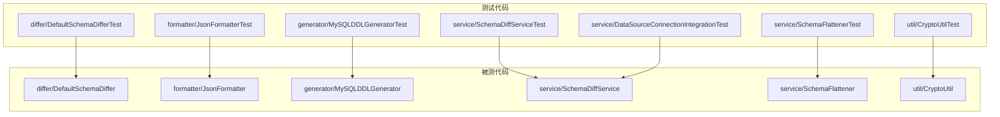
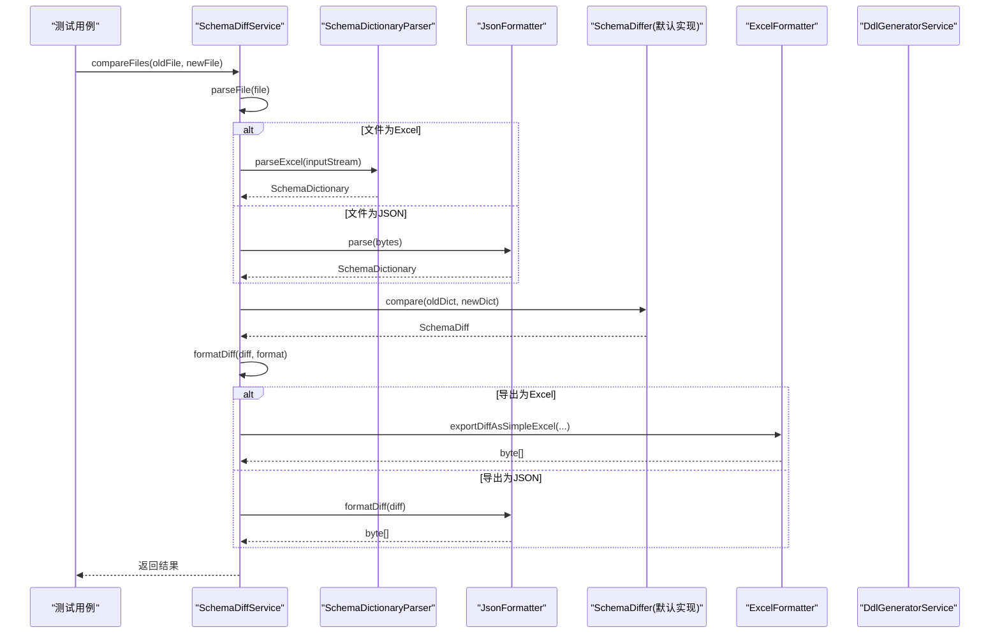
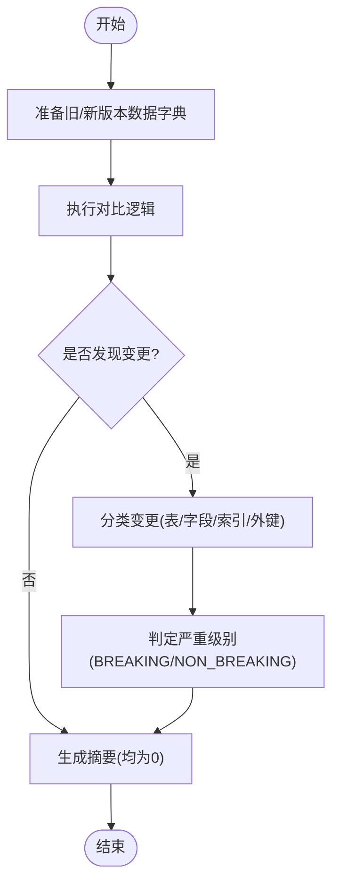
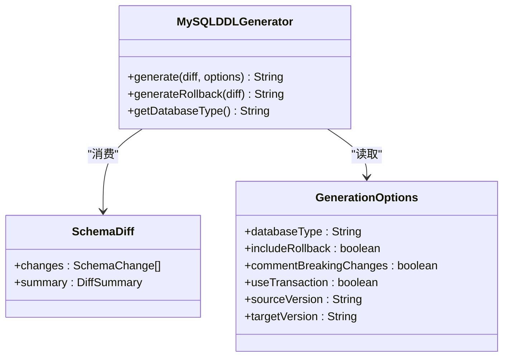
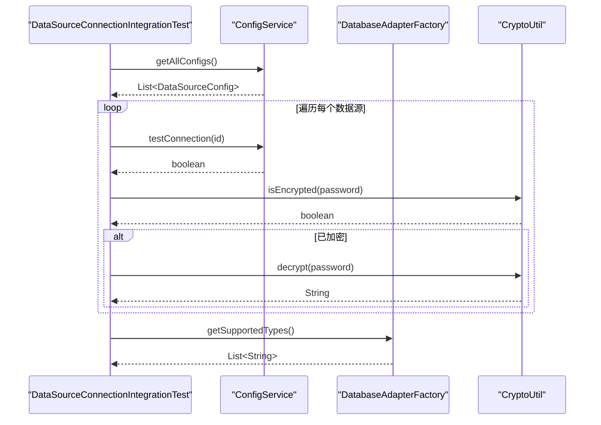
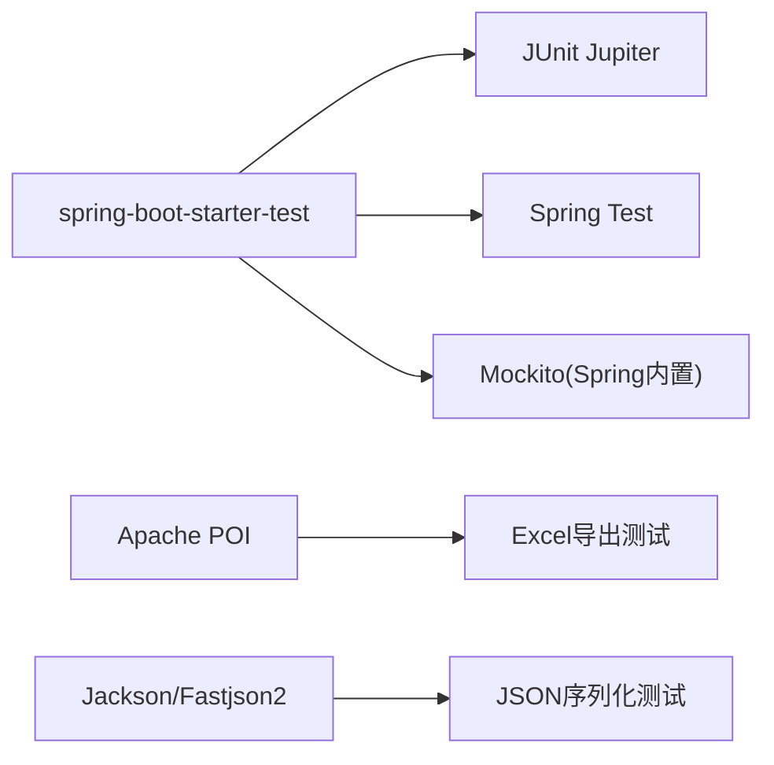

# 测试指南

<cite>
**本文引用的文件列表**
- [DefaultSchemaDifferTest.java](file://schemasync-backend/src/test/java/com/schemasync/differ/DefaultSchemaDifferTest.java)
- [JsonFormatterTest.java](file://schemasync-backend/src/test/java/com/schemasync/formatter/JsonFormatterTest.java)
- [MySQLDDLGeneratorTest.java](file://schemasync-backend/src/test/java/com/schemasync/generator/MySQLDDLGeneratorTest.java)
- [SchemaDiffServiceTest.java](file://schemasync-backend/src/test/java/com/schemasync/service/SchemaDiffServiceTest.java)
- [DataSourceConnectionIntegrationTest.java](file://schemasync-backend/src/test/java/com/schemasync/service/DataSourceConnectionIntegrationTest.java)
- [SchemaFlattenerTest.java](file://schemasync-backend/src/test/java/com/schemasync/service/SchemaFlattenerTest.java)
- [CryptoUtilTest.java](file://schemasync-backend/src/test/java/com/schemasync/util/CryptoUtilTest.java)
- [pom.xml](file://schemasync-backend/pom.xml)
- [application.yml](file://schemasync-backend/src/main/resources/application.yml)
- [DefaultSchemaDiffer.java](file://schemasync-backend/src/main/java/com/schemasync/differ/DefaultSchemaDiffer.java)
- [JsonFormatter.java](file://schemasync-backend/src/main/java/com/schemasync/formatter/JsonFormatter.java)
- [MySQLDDLGenerator.java](file://schemasync-backend/src/main/java/com/schemasync/generator/MySQLDDLGenerator.java)
- [SchemaDiffService.java](file://schemasync-backend/src/main/java/com/schemasync/service/SchemaDiffService.java)
</cite>

## 目录
1. [简介](#简介)
2. [项目结构](#项目结构)
3. [核心组件](#核心组件)
4. [架构总览](#架构总览)
5. [详细组件分析](#详细组件分析)
6. [依赖分析](#依赖分析)
7. [性能考虑](#性能考虑)
8. [故障排查指南](#故障排查指南)
9. [结论](#结论)
10. [附录](#附录)

## 简介
本指南面向SchemaSync后端项目的测试实践，覆盖单元测试、集成测试的编写与运行策略，结合现有测试用例的组织结构与实现方式，提供可操作的编写规范、断言方法、Mock建议、覆盖率统计与质量检查配置思路，以及性能与兼容性测试建议。文档同时给出关键流程的时序图与流程图，帮助读者快速理解并扩展测试体系。

## 项目结构
后端测试位于 schemasync-backend/src/test 下，按包结构组织：
- differ: 数据字典差异对比逻辑的单元测试
- formatter: JSON序列化/反序列化的格式化器测试
- generator: DDL生成器的单元测试
- service: 服务层单元测试与集成测试（含数据库连接）
- util: 工具类加密解密等功能的单元测试

图表来源
- [DefaultSchemaDifferTest.java](file://schemasync-backend/src/test/java/com/schemasync/differ/DefaultSchemaDifferTest.java)
- [JsonFormatterTest.java](file://schemasync-backend/src/test/java/com/schemasync/formatter/JsonFormatterTest.java)
- [MySQLDDLGeneratorTest.java](file://schemasync-backend/src/test/java/com/schemasync/generator/MySQLDDLGeneratorTest.java)
- [SchemaDiffServiceTest.java](file://schemasync-backend/src/test/java/com/schemasync/service/SchemaDiffServiceTest.java)
- [DataSourceConnectionIntegrationTest.java](file://schemasync-backend/src/test/java/com/schemasync/service/DataSourceConnectionIntegrationTest.java)
- [SchemaFlattenerTest.java](file://schemasync-backend/src/test/java/com/schemasync/service/SchemaFlattenerTest.java)
- [CryptoUtilTest.java](file://schemasync-backend/src/test/java/com/schemasync/util/CryptoUtilTest.java)
- [DefaultSchemaDiffer.java](file://schemasync-backend/src/main/java/com/schemasync/differ/DefaultSchemaDiffer.java)
- [JsonFormatter.java](file://schemasync-backend/src/main/java/com/schemasync/formatter/JsonFormatter.java)
- [MySQLDDLGenerator.java](file://schemasync-backend/src/main/java/com/schemasync/generator/MySQLDDLGenerator.java)
- [SchemaDiffService.java](file://schemasync-backend/src/main/java/com/schemasync/service/SchemaDiffService.java)

章节来源
- [pom.xml](file://schemasync-backend/pom.xml)
- [application.yml](file://schemasync-backend/src/main/resources/application.yml)

## 核心组件
本节概述当前测试框架与关键测试用例的组织方式，说明如何基于现有模式扩展新测试。

- 测试框架与注解
  - 使用 JUnit Jupiter（Junit 5）进行单元测试，常见注解包括 @Test、@BeforeEach。
  - 服务层集成测试使用 Spring Boot Test，通过 @SpringBootTest 启动应用上下文，配合 @Autowired 注入服务。
  - 集成测试中可通过 @TestPropertySource 指定配置文件路径，动态加载外部配置。

- 测试资源与配置
  - 集成测试读取 test/resources 下的 schemasync-config.json 作为数据源配置来源。
  - 应用主配置 application.yml 定义了端口、日志、Actuator、Swagger等通用配置。

- 断言与验证
  - 使用 JUnit 5 提供的 assert* 方法进行结果断言，如 assertNotNull、assertEquals、assertTrue、assertThrows 等。
  - 针对字节数组输出（如Excel），可对首字节进行格式校验（例如PK开头）。

- Mock与外部依赖
  - 当前测试以直接实例化被测对象为主，未引入 Mockito；对于需要隔离外部依赖的场景，建议引入 Mockito 或 Spring 的 @MockBean。
  - 对文件上传场景，使用 MockMultipartFile 构造请求体，避免真实IO。

章节来源
- [DefaultSchemaDifferTest.java](file://schemasync-backend/src/test/java/com/schemasync/differ/DefaultSchemaDifferTest.java)
- [JsonFormatterTest.java](file://schemasync-backend/src/test/java/com/schemasync/formatter/JsonFormatterTest.java)
- [MySQLDDLGeneratorTest.java](file://schemasync-backend/src/test/java/com/schemasync/generator/MySQLDDLGeneratorTest.java)
- [SchemaDiffServiceTest.java](file://schemasync-backend/src/test/java/com/schemasync/service/SchemaDiffServiceTest.java)
- [DataSourceConnectionIntegrationTest.java](file://schemasync-backend/src/test/java/com/schemasync/service/DataSourceConnectionIntegrationTest.java)
- [SchemaFlattenerTest.java](file://schemasync-backend/src/test/java/com/schemasync/service/SchemaFlattenerTest.java)
- [CryptoUtilTest.java](file://schemasync-backend/src/test/java/com/schemasync/util/CryptoUtilTest.java)
- [pom.xml](file://schemasync-backend/pom.xml)
- [application.yml](file://schemasync-backend/src/main/resources/application.yml)

## 架构总览
下图展示 SchemaDiffService 在测试中的调用链：从接收两个文件到解析、对比、格式化与DDL生成。

图表来源
- [SchemaDiffService.java](file://schemasync-backend/src/main/java/com/schemasync/service/SchemaDiffService.java)
- [JsonFormatter.java](file://schemasync-backend/src/main/java/com/schemasync/formatter/JsonFormatter.java)
- [DefaultSchemaDiffer.java](file://schemasync-backend/src/main/java/com/schemasync/differ/DefaultSchemaDiffer.java)

章节来源
- [SchemaDiffServiceTest.java](file://schemasync-backend/src/test/java/com/schemasync/service/SchemaDiffServiceTest.java)

## 详细组件分析

### Differ 包测试（DefaultSchemaDiffer）
- 目标：验证表、字段、索引、外键的新增/删除/修改及破坏性变更判定。
- 要点：
  - 构造两套 SchemaDictionary，分别模拟“无变更”、“新增表”、“删除表”、“新增字段”、“删除字段”、“修改字段类型/长度/可空性”等场景。
  - 断言变更数量、变更类型、严重级别（BREAKING/NON_BREAKING）与摘要统计一致。
  - 处理边界情况：null 表列表、多变更组合。

图表来源
- [DefaultSchemaDiffer.java](file://schemasync-backend/src/main/java/com/schemasync/differ/DefaultSchemaDiffer.java)
- [DefaultSchemaDifferTest.java](file://schemasync-backend/src/test/java/com/schemasync/differ/DefaultSchemaDifferTest.java)

章节来源
- [DefaultSchemaDifferTest.java](file://schemasync-backend/src/test/java/com/schemasync/differ/DefaultSchemaDifferTest.java)
- [DefaultSchemaDiffer.java](file://schemasync-backend/src/main/java/com/schemasync/differ/DefaultSchemaDiffer.java)

### Formatter 包测试（JsonFormatter）
- 目标：验证 JSON 序列化/反序列化、扁平化结构、异常处理与格式美观性。
- 要点：
  - 构造包含元数据与表的 SchemaDictionary，验证 format/formatToString 输出包含必要节点。
  - 验证 parse 对合法/非法/空输入的处理，确保异常抛出或返回合理对象。
  - RoundTrip 测试保证序列化与反序列化一致性。

章节来源
- [JsonFormatterTest.java](file://schemasync-backend/src/test/java/com/schemasync/formatter/JsonFormatterTest.java)
- [JsonFormatter.java](file://schemasync-backend/src/main/java/com/schemasync/formatter/JsonFormatter.java)

### Generator 包测试（MySQLDDLGenerator）
- 目标：验证不同变更场景下DDL脚本生成的正确性与完整性。
- 要点：
  - 空差异、新增表、删除表、新增/删除/修改字段、索引与外键变更。
  - 事务开关、回滚脚本、版本信息、头部/尾部注释、破坏性变更注释控制。
  - 复杂变更与多表变更场景，验证统计信息与内容片段存在性。

图表来源
- [MySQLDDLGenerator.java](file://schemasync-backend/src/main/java/com/schemasync/generator/MySQLDDLGenerator.java)
- [MySQLDDLGeneratorTest.java](file://schemasync-backend/src/test/java/com/schemasync/generator/MySQLDDLGeneratorTest.java)

章节来源
- [MySQLDDLGeneratorTest.java](file://schemasync-backend/src/test/java/com/schemasync/generator/MySQLDDLGeneratorTest.java)
- [MySQLDDLGenerator.java](file://schemasync-backend/src/main/java/com/schemasync/generator/MySQLDDLGenerator.java)

### Service 包测试（SchemaDiffService 与 SchemaFlattener）
- SchemaDiffService 测试
  - 使用 @SpringBootTest 启动上下文，注入服务。
  - 通过 MockMultipartFile 构造JSON/Excel输入，验证 compareFiles、formatDiff、generateDdlFromDiff 等行为。
  - 对Excel输出进行二进制头校验（PK开头）。

- SchemaFlattener 测试
  - 验证扁平化后的概览、表、字段、索引、约束集合的数量与内容。
  - 处理空字典场景，确保返回空集合而非null。

章节来源
- [SchemaDiffServiceTest.java](file://schemasync-backend/src/test/java/com/schemasync/service/SchemaDiffServiceTest.java)
- [SchemaFlattenerTest.java](file://schemasync-backend/src/test/java/com/schemasync/service/SchemaFlattenerTest.java)
- [SchemaDiffService.java](file://schemasync-backend/src/main/java/com/schemasync/service/SchemaDiffService.java)

### Util 包测试（CryptoUtil）
- 目标：验证加解密一致性、特殊字符与中文支持、长文本处理、无效输入异常。
- 要点：
  - 相同输入在相同密钥下应产生相同密文；不同输入应产生不同密文。
  - 解密无效输入应抛出异常。
  - 预留 isEncrypted 方法的测试位置，便于后续扩展。

章节来源
- [CryptoUtilTest.java](file://schemasync-backend/src/test/java/com/schemasync/util/CryptoUtilTest.java)

### 集成测试（DataSourceConnectionIntegrationTest）
- 特点：
  - 不硬编码配置，动态读取 test/resources/schemasync-config.json。
  - 遍历所有数据源，测试连接、密码加密状态、支持的数据库类型、配置完整性。
  - 打印详细日志，便于定位失败原因。

图表来源
- [DataSourceConnectionIntegrationTest.java](file://schemasync-backend/src/test/java/com/schemasync/service/DataSourceConnectionIntegrationTest.java)

章节来源
- [DataSourceConnectionIntegrationTest.java](file://schemasync-backend/src/test/java/com/schemasync/service/DataSourceConnectionIntegrationTest.java)

## 依赖分析
- 测试依赖
  - spring-boot-starter-test：提供 Spring Boot Test、MockMvc、Assertions 等能力。
  - junit：保留兼容依赖，但实际测试主要使用 JUnit Jupiter。
- 运行时依赖
  - Jackson、Fastjson2、Apache POI、HikariCP、各数据库驱动等。
- 构建与打包
  - 前端构建插件与静态资源复制不影响测试执行。
  - Actuator 暴露健康、指标端点，可用于集成环境监控。

图表来源
- [pom.xml](file://schemasync-backend/pom.xml)

章节来源
- [pom.xml](file://schemasync-backend/pom.xml)

## 性能考虑
- 单元测试应避免真实网络与IO，优先使用内存对象与Mock数据。
- 集成测试中数据库连接测试需设置合理的超时与重试策略，避免阻塞CI流水线。
- 批量对比与DDL生成时，注意大对象序列化与字符串拼接的性能开销，必要时采用流式处理或分块处理。
- 使用 @SpringBootTest 的轻量级启动策略（如 @WebMvcTest/@DataJpaTest）可减少上下文初始化时间。

[本节为通用指导，无需源码引用]

## 故障排查指南
- 常见问题
  - 配置文件路径错误：集成测试需确认 @TestPropertySource 指向正确的 test/resources 文件。
  - 数据库连接失败：检查主机、端口、用户名、密码（明文或加密）、字符集与超时配置。
  - JSON解析异常：确认输入是否为合法JSON，空对象{}应能正常解析。
  - Excel导出格式不符：验证输出字节首两位是否为“PK”。
- 调试技巧
  - 在集成测试中增加详细日志输出，记录耗时与异常根本原因。
  - 使用断点与IDE调试器逐步跟踪服务调用链。
  - 将失败场景的最小复现数据放入 test/resources，便于回归验证。

章节来源
- [DataSourceConnectionIntegrationTest.java](file://schemasync-backend/src/test/java/com/schemasync/service/DataSourceConnectionIntegrationTest.java)
- [SchemaDiffServiceTest.java](file://schemasync-backend/src/test/java/com/schemasync/service/SchemaDiffServiceTest.java)

## 结论
本项目测试体系以 JUnit Jupiter 为主，辅以 Spring Boot Test 进行服务层与集成测试。现有测试覆盖了差异对比、格式化、DDL生成、服务编排、工具类等核心模块。建议在后续迭代中引入 Mockito 增强隔离能力，完善覆盖率统计与质量门禁，并补充API接口与性能测试用例，进一步提升系统稳定性与可维护性。

[本节为总结性内容，无需源码引用]

## 附录

### 编写新测试用例的指导
- 选择合适层级
  - 纯函数/工具类：放在对应包的 *Test 类中，使用 JUnit Jupiter。
  - 服务层：使用 @SpringBootTest 或更细粒度的切片测试（如 @WebMvcTest/@DataJpaTest）。
  - 集成测试：使用 @TestPropertySource 指定外部配置，避免硬编码。
- 数据准备
  - 使用工厂方法或私有辅助方法构造最小可用数据对象。
  - 对文件上传场景，使用 MockMultipartFile 构造输入。
- Mock对象
  - 引入 Mockito 或 Spring 的 @MockBean 隔离外部依赖（如数据库、HTTP客户端）。
  - 对第三方库行为进行桩化，确保测试稳定。
- 断言方法
  - 使用 assertNotNull、assertEquals、assertTrue、assertFalse、assertThrows 等。
  - 对二进制输出进行格式校验（如Excel头字节）。
- 命名与可读性
  - 测试方法名清晰表达场景，如 testCompare_AddColumn、testParse_InvalidJson。
  - 每个测试只关注一个职责，保持单一断言原则。

章节来源
- [DefaultSchemaDifferTest.java](file://schemasync-backend/src/test/java/com/schemasync/differ/DefaultSchemaDifferTest.java)
- [JsonFormatterTest.java](file://schemasync-backend/src/test/java/com/schemasync/formatter/JsonFormatterTest.java)
- [MySQLDDLGeneratorTest.java](file://schemasync-backend/src/test/java/com/schemasync/generator/MySQLDDLGeneratorTest.java)
- [SchemaDiffServiceTest.java](file://schemasync-backend/src/test/java/com/schemasync/service/SchemaDiffServiceTest.java)
- [DataSourceConnectionIntegrationTest.java](file://schemasync-backend/src/test/java/com/schemasync/service/DataSourceConnectionIntegrationTest.java)

### 集成测试编写方法
- 数据库连接测试
  - 使用 @TestPropertySource 指定配置文件路径。
  - 遍历所有数据源，调用 testConnection 并记录耗时与异常。
  - 校验密码加密状态与解密成功。
- API接口测试
  - 使用 @WebMvcTest 或 @SpringBootTest + MockMvc 发起HTTP请求。
  - 构造JSON/Excel输入，断言响应码、响应体与文件格式。
  - 对异常路径（非法输入、权限不足）进行断言。

章节来源
- [DataSourceConnectionIntegrationTest.java](file://schemasync-backend/src/test/java/com/schemasync/service/DataSourceConnectionIntegrationTest.java)
- [SchemaDiffServiceTest.java](file://schemasync-backend/src/test/java/com/schemasync/service/SchemaDiffServiceTest.java)

### 测试覆盖率统计与质量检查
- 覆盖率统计
  - 推荐引入 JaCoCo 插件，在 Maven 生命周期中生成覆盖率报告。
  - 配置阈值（行覆盖率、分支覆盖率）并在CI中阻断低覆盖率提交。
- 质量检查
  - 引入 SonarQube 进行静态分析与质量门禁。
  - 结合 Checkstyle/PMD 统一代码风格与潜在问题检测。
- 持续集成
  - 在CI流水线中并行执行单元测试与集成测试。
  - 对集成测试使用独立数据库实例或容器化数据库，确保隔离与可重复性。

[本节为通用指导，无需源码引用]

### 性能测试与兼容性测试建议
- 性能测试
  - 使用 JMH 对核心算法（差异对比、DDL生成）进行基准测试。
  - 对大数据量场景进行端到端压测，评估序列化与IO瓶颈。
- 兼容性测试
  - 针对不同数据库类型（MySQL、Oracle、PostgreSQL/GaussDB、OpenGauss）准备最小数据集，验证解析与对比逻辑。
  - 对不同版本的数据库驱动进行矩阵测试，确保向后兼容。

[本节为通用指导，无需源码引用]