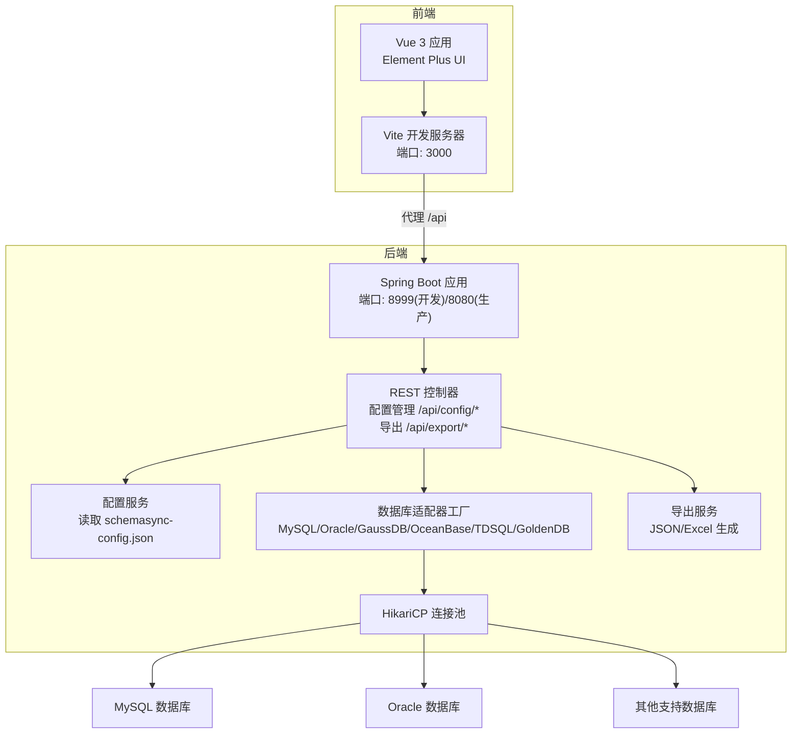
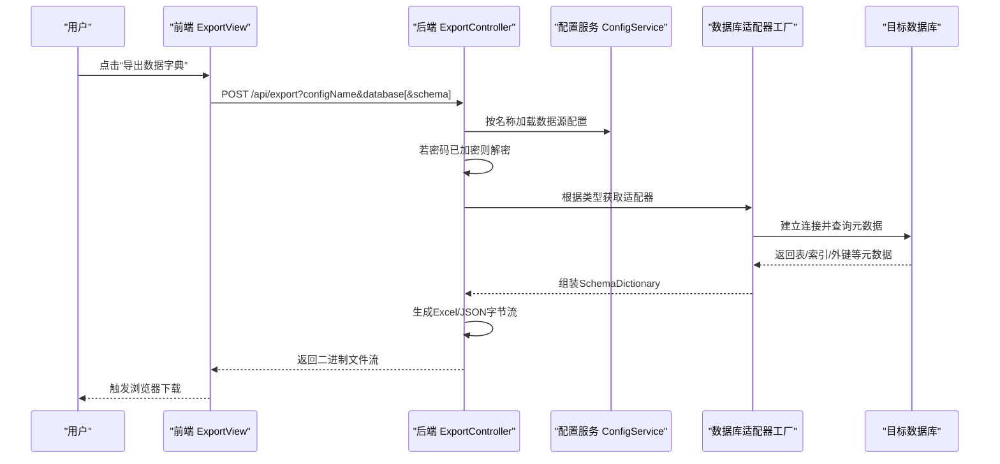
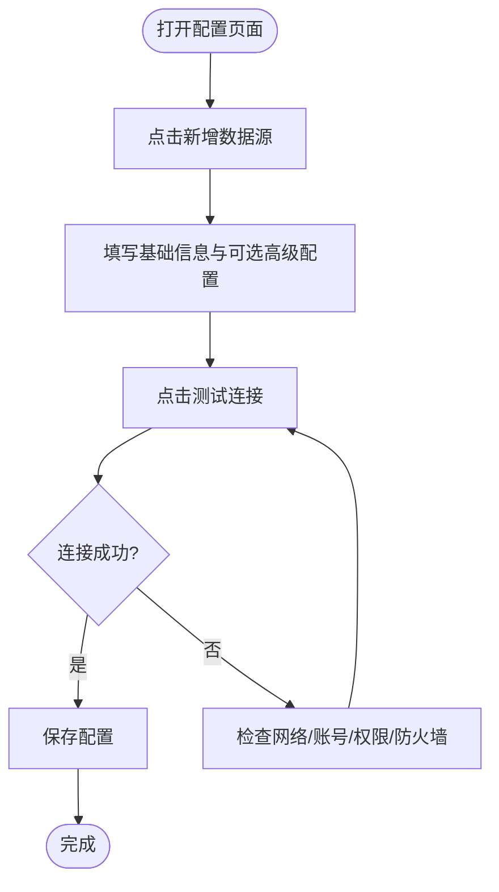
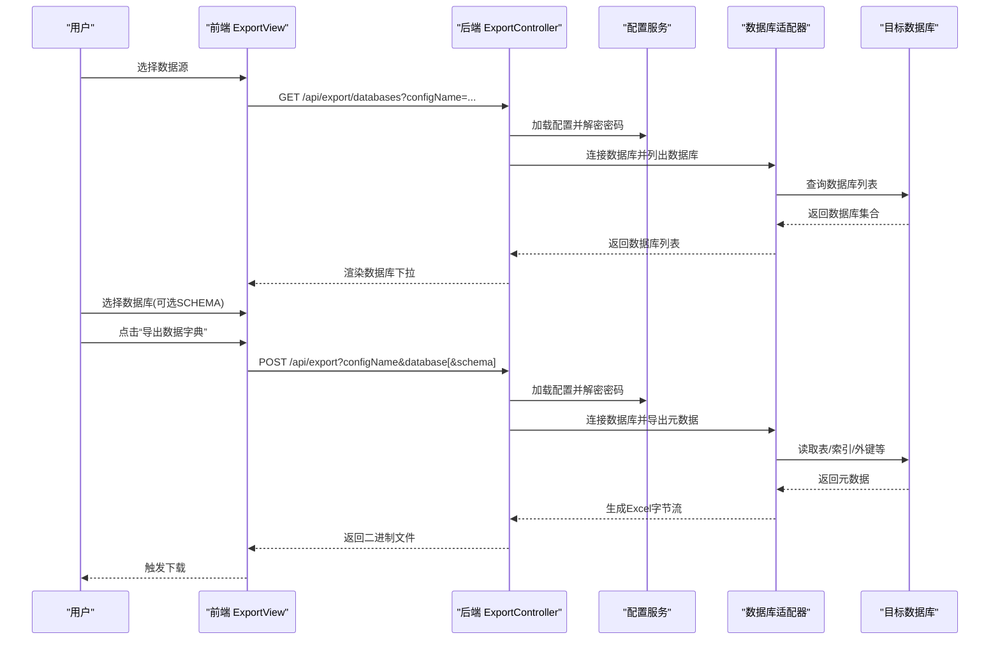
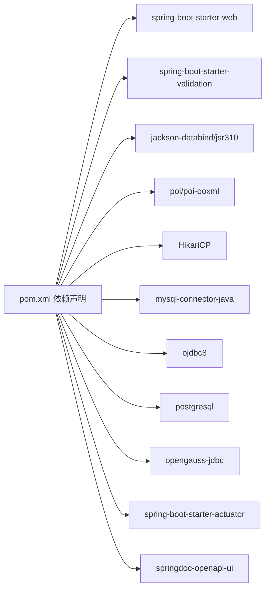

# 快速开始

<cite>
**本文引用的文件列表**
- [README.md](file://README.md)
- [QUICKSTART.md](file://QUICKSTART.md)
- [pom.xml](file://schemasync-backend/pom.xml)
- [application.yml](file://schemasync-backend/src/main/resources/application.yml)
- [application-dev.yml](file://schemasync-backend/src/main/resources/application-dev.yml)
- [application-prod.yml](file://schemasync-backend/src/main/resources/application-prod.yml)
- [schemasync-config.json](file://schemasync-backend/src/main/resources/schemasync-config.json)
- [vite.config.js](file://schemasync-frontend/vite.config.js)
- [package.json](file://schemasync-frontend/package.json)
- [ConfigController.java](file://schemasync-backend/src/main/java/com/schemasync/controller/ConfigController.java)
- [ExportController.java](file://schemasync-backend/src/main/java/com/schemasync/controller/ExportController.java)
- [ConfigView.vue](file://schemasync-frontend/src/views/ConfigView.vue)
- [ExportView.vue](file://schemasync-frontend/src/views/ExportView.vue)
</cite>

## 目录
1. [简介](#简介)
2. [项目结构](#项目结构)
3. [核心组件](#核心组件)
4. [架构总览](#架构总览)
5. [详细组件分析](#详细组件分析)
6. [依赖分析](#依赖分析)
7. [性能考虑](#性能考虑)
8. [故障排查指南](#故障排查指南)
9. [结论](#结论)
10. [附录](#附录)

## 简介
本指南面向首次使用者，帮助你在10分钟内完成环境搭建、后端与前端启动、数据源配置（含密码加密存储与连接测试）、以及一次完整的数据字典导出体验。你将学会：
- 准备JDK 8+、Node.js 16+、Maven 3.6+环境
- 启动后端服务并访问Swagger文档
- 启动前端开发服务器并进行跨域代理
- 新增MySQL/Oracle等数据库连接、保存并测试连接
- 从选择数据源到下载Excel文件的完整导出流程

## 项目结构
本项目采用前后端分离的单体工程组织方式：
- 后端：Spring Boot 应用，提供REST API，内置HikariCP连接池、多数据库驱动、AES密码加密、JSON/Excel导出能力
- 前端：Vue 3 + Element Plus + Vite，提供可视化配置管理与导出操作界面，并通过Vite代理转发至后端

图表来源
- [application.yml:1-83](file://schemasync-backend/src/main/resources/application.yml#L1-L83)
- [vite.config.js:1-17](file://schemasync-frontend/vite.config.js#L1-L17)
- [pom.xml:1-339](file://schemasync-backend/pom.xml#L1-L339)

章节来源
- [README.md:1-239](file://README.md#L1-L239)
- [pom.xml:1-339](file://schemasync-backend/pom.xml#L1-L339)
- [application.yml:1-83](file://schemasync-backend/src/main/resources/application.yml#L1-L83)
- [vite.config.js:1-17](file://schemasync-frontend/vite.config.js#L1-L17)

## 核心组件
- 配置管理接口：提供数据源的增删改查、连接测试、获取数据库/SCHEMA列表
- 导出接口：根据配置导出数据字典为Excel或JSON
- 数据源配置文件：本地JSON文件，用于持久化数据源连接信息
- 前端页面：数据源配置页与导出页，提供可视化操作

章节来源
- [ConfigController.java:1-133](file://schemasync-backend/src/main/java/com/schemasync/controller/ConfigController.java#L1-L133)
- [ExportController.java:1-223](file://schemasync-backend/src/main/java/com/schemasync/controller/ExportController.java#L1-L223)
- [schemasync-config.json:1-25](file://schemasync-backend/src/main/resources/schemasync-config.json#L1-L25)
- [ConfigView.vue:1-344](file://schemasync-frontend/src/views/ConfigView.vue#L1-L344)
- [ExportView.vue:1-278](file://schemasync-frontend/src/views/ExportView.vue#L1-L278)

## 架构总览
下图展示了“导出数据字典”的关键调用链：前端触发 → 后端控制器 → 解密密码 → 通过适配器连接数据库 → 生成Excel/JSON → 返回二进制流供浏览器下载。

图表来源
- [ExportController.java:48-99](file://schemasync-backend/src/main/java/com/schemasync/controller/ExportController.java#L48-L99)
- [ExportView.vue:190-270](file://schemasync-frontend/src/views/ExportView.vue#L190-L270)

## 详细组件分析

### 环境要求与安装
- JDK 8+
- Node.js 16+
- Maven 3.6+
- 任意受支持的数据库实例（如 MySQL、Oracle）

章节来源
- [README.md:102-126](file://README.md#L102-L126)

### 后端服务启动
- 进入后端目录执行：mvn spring-boot:run
- 默认开发端口为8999；生产环境可通过profile切换至8080
- Swagger文档路径：/swagger-ui.html

章节来源
- [application.yml:1-10](file://schemasync-backend/src/main/resources/application.yml#L1-L10)
- [application-dev.yml:1-8](file://schemasync-backend/src/main/resources/application-dev.yml#L1-L8)
- [application-prod.yml:1-12](file://schemasync-backend/src/main/resources/application-prod.yml#L1-L12)
- [QUICKSTART.md:46-63](file://QUICKSTART.md#L46-L63)

### 前端开发环境配置
- 进入前端目录执行：npm install && npm run dev
- 开发服务器端口为3000，自动将/api请求代理至后端8999端口

章节来源
- [package.json:1-25](file://schemasync-frontend/package.json#L1-L25)
- [vite.config.js:1-17](file://schemasync-frontend/vite.config.js#L1-L17)

### 数据源配置流程（新增/编辑/测试/保存）
- 打开前端“数据源配置”页面，点击“新增数据源”
- 填写名称、数据库类型（MySQL/Oracle/OceanBase/TDSQL/GaussDB/GoldenDB）、主机、端口、数据库名、用户名、可选密码
- 可展开高级配置自定义JDBC URL与连接池参数
- 点击“测试连接”，后端会尝试连接并返回结果
- 保存后，配置写入本地JSON文件，密码以AES加密形式存储

图表来源
- [ConfigView.vue:1-344](file://schemasync-frontend/src/views/ConfigView.vue#L1-L344)
- [ConfigController.java:86-131](file://schemasync-backend/src/main/java/com/schemasync/controller/ConfigController.java#L86-L131)
- [schemasync-config.json:1-25](file://schemasync-backend/src/main/resources/schemasync-config.json#L1-L25)

章节来源
- [ConfigView.vue:1-344](file://schemasync-frontend/src/views/ConfigView.vue#L1-L344)
- [ConfigController.java:1-133](file://schemasync-backend/src/main/java/com/schemasync/controller/ConfigController.java#L1-L133)
- [schemasync-config.json:1-25](file://schemasync-backend/src/main/resources/schemasync-config.json#L1-L25)

### 基本数据字典导出（选择数据源→下载Excel）
- 打开前端“数据字典导出”页面
- 选择数据源后，系统会自动拉取该数据源下的数据库列表；若当前数据库类型支持SCHEMA，还会显示SCHEMA下拉框
- 选择数据库（及可选SCHEMA），点击“导出数据字典”
- 后端生成Excel文件并以附件形式返回，浏览器自动下载

图表来源
- [ExportView.vue:105-270](file://schemasync-frontend/src/views/ExportView.vue#L105-L270)
- [ExportController.java:48-99](file://schemasync-backend/src/main/java/com/schemasync/controller/ExportController.java#L48-L99)
- [ExportController.java:101-201](file://schemasync-backend/src/main/java/com/schemasync/controller/ExportController.java#L101-L201)

章节来源
- [ExportView.vue:1-278](file://schemasync-frontend/src/views/ExportView.vue#L1-L278)
- [ExportController.java:1-223](file://schemasync-backend/src/main/java/com/schemasync/controller/ExportController.java#L1-L223)

## 依赖分析
- 后端依赖：Spring Boot Web、Validation、Jackson、Fastjson2、Apache POI、HikariCP、多种数据库驱动、Actuator、SpringDoc OpenAPI
- 构建插件：前端Maven插件负责在打包阶段构建前端资源并复制到静态目录；Spring Boot插件用于重打包可执行Jar
- 运行期：开发环境默认启用dev profile，日志级别更详细，便于调试

图表来源
- [pom.xml:39-184](file://schemasync-backend/pom.xml#L39-L184)

章节来源
- [pom.xml:1-339](file://schemasync-backend/pom.xml#L1-L339)

## 性能考虑
- 连接池大小与超时：可在配置文件中调整最大连接数、最小空闲、连接超时与最大存活时间
- 大库导出耗时：大型数据库导出需要一定时间，请耐心等待；建议合理设置超时与连接池参数
- 日志级别：开发环境开启DEBUG便于定位问题，生产环境建议降低日志级别以减少IO开销

章节来源
- [application.yml:36-65](file://schemasync-backend/src/main/resources/application.yml#L36-L65)
- [application-dev.yml:1-8](file://schemasync-backend/src/main/resources/application-dev.yml#L1-L8)
- [application-prod.yml:1-12](file://schemasync-backend/src/main/resources/application-prod.yml#L1-L12)

## 故障排查指南
- 无法连接数据库
  - 检查主机、端口、用户名、密码是否正确
  - 确认数据库允许远程访问且防火墙放行对应端口
  - 确保对INFORMATION_SCHEMA具有SELECT权限（部分数据库）
- 导出结果为空
  - 确认选择的数据库名称正确且存在表
  - 若使用SCHEMA过滤，请确认SCHEMA名称正确
- Swagger无法访问
  - 确认后端已启动，访问路径为 http://localhost:8999/swagger-ui.html
- 前端无法请求后端
  - 确认Vite代理已生效（/api → http://localhost:8999）
  - 检查浏览器控制台是否有跨域或网络错误
- 密码相关错误
  - 保存时密码会被加密存储；若手动修改JSON中的密文，可能导致解密失败
- 查看日志
  - 开发环境日志输出到 logs/schemasync.log，可按需调整日志级别

章节来源
- [QUICKSTART.md:136-163](file://QUICKSTART.md#L136-L163)
- [application.yml:24-35](file://schemasync-backend/src/main/resources/application.yml#L24-L35)

## 结论
通过以上步骤，你可以在10分钟内完成环境准备、前后端启动、数据源配置与连接测试，并完成一次完整的Excel数据字典导出。后续可根据需要扩展更多数据库类型、优化导出性能或集成差异对比与DDL生成功能。

## 附录
- 环境变量与Profile
  - 开发环境：默认激活dev profile，端口8999，日志级别DEBUG
  - 生产环境：激活prod profile，端口8080，日志级别WARN/INFO
- 配置文件位置
  - 数据源配置文件默认位于 resources/schemasync-config.json，也可通过配置项指定绝对或相对路径
- 常用命令
  - 后端启动：mvn spring-boot:run
  - 前端开发：npm install && npm run dev

章节来源
- [application.yml:1-83](file://schemasync-backend/src/main/resources/application.yml#L1-L83)
- [application-dev.yml:1-8](file://schemasync-backend/src/main/resources/application-dev.yml#L1-L8)
- [application-prod.yml:1-12](file://schemasync-backend/src/main/resources/application-prod.yml#L1-L12)
- [schemasync-config.json:1-25](file://schemasync-backend/src/main/resources/schemasync-config.json#L1-L25)
- [QUICKSTART.md:15-63](file://QUICKSTART.md#L15-L63)