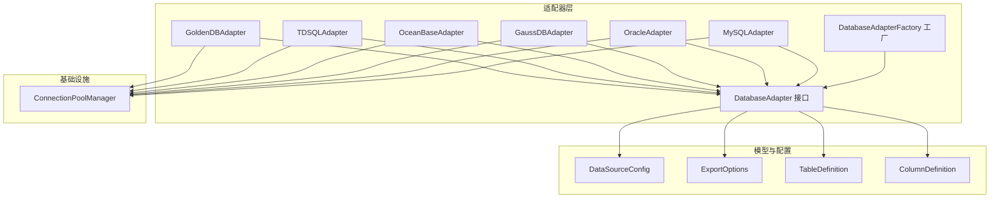
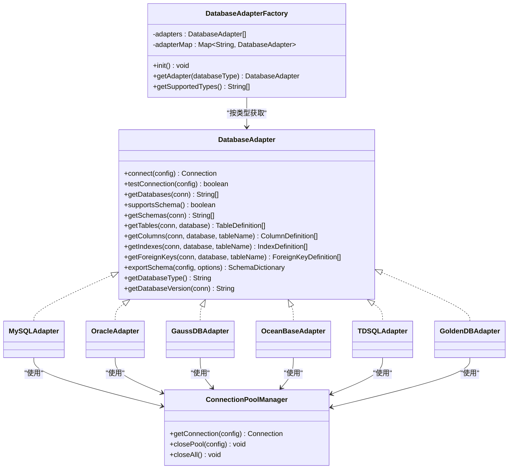
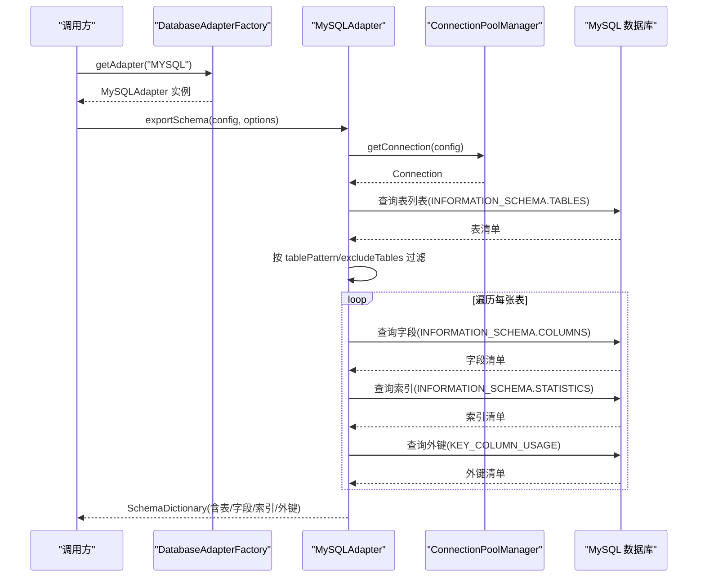
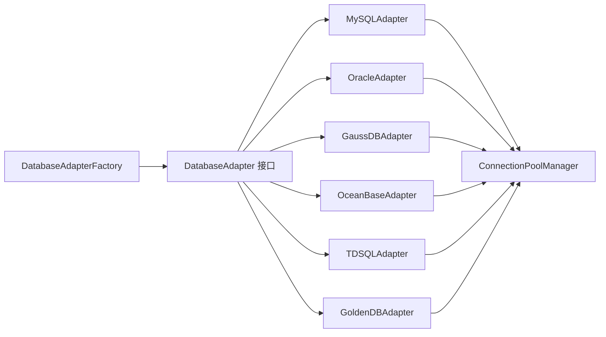

# 数据库适配器

<cite>
**本文引用的文件**   
- [DatabaseAdapter.java](file://schemasync-backend/src/main/java/com/schemasync/adapter/DatabaseAdapter.java)
- [DatabaseAdapterFactory.java](file://schemasync-backend/src/main/java/com/schemasync/adapter/DatabaseAdapterFactory.java)
- [MySQLAdapter.java](file://schemasync-backend/src/main/java/com/schemasync/adapter/MySQLAdapter.java)
- [OracleAdapter.java](file://schemasync-backend/src/main/java/com/schemasync/adapter/OracleAdapter.java)
- [GaussDBAdapter.java](file://schemasync-backend/src/main/java/com/schemasync/adapter/GaussDBAdapter.java)
- [OceanBaseAdapter.java](file://schemasync-backend/src/main/java/com/schemasync/adapter/OceanBaseAdapter.java)
- [TDSQLAdapter.java](file://schemasync-backend/src/main/java/com/schemasync/adapter/TDSQLAdapter.java)
- [GoldenDBAdapter.java](file://schemasync-backend/src/main/java/com/schemasync/adapter/GoldenDBAdapter.java)
- [ExportOptions.java](file://schemasync-backend/src/main/java/com/schemasync/adapter/ExportOptions.java)
- [DataSourceConfig.java](file://schemasync-backend/src/main/java/com/schemasync/model/config/DataSourceConfig.java)
- [TableDefinition.java](file://schemasync-backend/src/main/java/com/schemasync/model/dict/TableDefinition.java)
- [ColumnDefinition.java](file://schemasync-backend/src/main/java/com/schemasync/model/dict/ColumnDefinition.java)
- [ConnectionPoolManager.java](file://schemasync-backend/src/main/java/com/schemasync/util/ConnectionPoolManager.java)
</cite>

## 目录
1. [简介](#简介)
2. [项目结构](#项目结构)
3. [核心组件](#核心组件)
4. [架构总览](#架构总览)
5. [详细组件分析](#详细组件分析)
6. [依赖关系分析](#依赖关系分析)
7. [性能与连接池配置](#性能与连接池配置)
8. [故障排查指南](#故障排查指南)
9. [结论](#结论)
10. [附录：新数据库适配器开发指南](#附录新数据库适配器开发指南)

## 简介
本技术文档聚焦于数据库适配器层，系统性阐述策略模式在 DatabaseAdapter 接口中的实现，以及 MySQL、Oracle、GaussDB、OceanBase、TDSQL、GoldenDB 六种适配器的设计要点与扩展机制。文档覆盖各数据库的特殊处理逻辑（如 MySQL 原生协议、Oracle 的元数据查询、GaussDB 的 PostgreSQL 协议适配、OceanBase/TDSQL/GoldenDB 的 MySQL 兼容模式），并提供适配器注册机制、工厂模式使用、连接池配置与性能调优建议，辅以调试技巧与扩展开发规范，帮助开发者快速理解并扩展新的数据库支持。

## 项目结构
适配器层位于 adapter 包下，采用“接口 + 具体实现”的策略模式；通过 Spring 自动装配将多个适配器注入到工厂类中，由工厂根据数据库类型返回对应适配器实例。连接池统一由 ConnectionPoolManager 管理，基于 HikariCP 构建多数据源连接池。

图表来源
- [DatabaseAdapter.java:1-134](file://schemasync-backend/src/main/java/com/schemasync/adapter/DatabaseAdapter.java#L1-L134)
- [DatabaseAdapterFactory.java:1-64](file://schemasync-backend/src/main/java/com/schemasync/adapter/DatabaseAdapterFactory.java#L1-L64)
- [MySQLAdapter.java:1-367](file://schemasync-backend/src/main/java/com/schemasync/adapter/MySQLAdapter.java#L1-L367)
- [OracleAdapter.java:1-381](file://schemasync-backend/src/main/java/com/schemasync/adapter/OracleAdapter.java#L1-L381)
- [GaussDBAdapter.java:1-550](file://schemasync-backend/src/main/java/com/schemasync/adapter/GaussDBAdapter.java#L1-L550)
- [OceanBaseAdapter.java:1-316](file://schemasync-backend/src/main/java/com/schemasync/adapter/OceanBaseAdapter.java#L1-L316)
- [TDSQLAdapter.java:1-311](file://schemasync-backend/src/main/java/com/schemasync/adapter/TDSQLAdapter.java#L1-L311)
- [GoldenDBAdapter.java:1-312](file://schemasync-backend/src/main/java/com/schemasync/adapter/GoldenDBAdapter.java#L1-L312)
- [DataSourceConfig.java:1-129](file://schemasync-backend/src/main/java/com/schemasync/model/config/DataSourceConfig.java#L1-L129)
- [ExportOptions.java:1-122](file://schemasync-backend/src/main/java/com/schemasync/adapter/ExportOptions.java#L1-L122)
- [TableDefinition.java:1-89](file://schemasync-backend/src/main/java/com/schemasync/model/dict/TableDefinition.java#L1-L89)
- [ColumnDefinition.java:1-116](file://schemasync-backend/src/main/java/com/schemasync/model/dict/ColumnDefinition.java#L1-L116)
- [ConnectionPoolManager.java:1-258](file://schemasync-backend/src/main/java/com/schemasync/util/ConnectionPoolManager.java#L1-L258)

章节来源
- [DatabaseAdapter.java:1-134](file://schemasync-backend/src/main/java/com/schemasync/adapter/DatabaseAdapter.java#L1-L134)
- [DatabaseAdapterFactory.java:1-64](file://schemasync-backend/src/main/java/com/schemasync/adapter/DatabaseAdapterFactory.java#L1-L64)

## 核心组件
- 策略接口：DatabaseAdapter 定义了统一的数据库访问契约，包括连接、测试、获取数据库/表/字段/索引/外键、导出完整数据字典、获取类型与版本等能力。
- 工厂模式：DatabaseAdapterFactory 通过 Spring 注入所有 DatabaseAdapter 实现，启动时完成注册，运行时按数据库类型返回具体适配器。
- 连接池：ConnectionPoolManager 统一管理 HikariCP 连接池，支持自定义 JDBC URL 与 JSON 形式的连接池参数覆盖。
- 模型对象：ExportOptions 控制导出行为（是否包含索引/外键/视图、表名过滤等）；TableDefinition 与 ColumnDefinition 承载导出的元数据结构。

章节来源
- [DatabaseAdapter.java:1-134](file://schemasync-backend/src/main/java/com/schemasync/adapter/DatabaseAdapter.java#L1-L134)
- [DatabaseAdapterFactory.java:1-64](file://schemasync-backend/src/main/java/com/schemasync/adapter/DatabaseAdapterFactory.java#L1-L64)
- [ConnectionPoolManager.java:1-258](file://schemasync-backend/src/main/java/com/schemasync/util/ConnectionPoolManager.java#L1-L258)
- [ExportOptions.java:1-122](file://schemasync-backend/src/main/java/com/schemasync/adapter/ExportOptions.java#L1-L122)
- [TableDefinition.java:1-89](file://schemasync-backend/src/main/java/com/schemasync/model/dict/TableDefinition.java#L1-L89)
- [ColumnDefinition.java:1-116](file://schemasync-backend/src/main/java/com/schemasync/model/dict/ColumnDefinition.java#L1-L116)

## 架构总览
适配器层遵循“接口抽象 + 多实现 + 工厂分发”的设计。每个适配器负责特定数据库的元数据查询与差异处理，对外暴露一致的 SchemaDictionary 导出结果。连接池管理器屏蔽底层驱动差异，提供统一的连接获取与生命周期管理。

图表来源
- [DatabaseAdapter.java:1-134](file://schemasync-backend/src/main/java/com/schemasync/adapter/DatabaseAdapter.java#L1-L134)
- [DatabaseAdapterFactory.java:1-64](file://schemasync-backend/src/main/java/com/schemasync/adapter/DatabaseAdapterFactory.java#L1-L64)
- [MySQLAdapter.java:1-367](file://schemasync-backend/src/main/java/com/schemasync/adapter/MySQLAdapter.java#L1-L367)
- [OracleAdapter.java:1-381](file://schemasync-backend/src/main/java/com/schemasync/adapter/OracleAdapter.java#L1-L381)
- [GaussDBAdapter.java:1-550](file://schemasync-backend/src/main/java/com/schemasync/adapter/GaussDBAdapter.java#L1-L550)
- [OceanBaseAdapter.java:1-316](file://schemasync-backend/src/main/java/com/schemasync/adapter/OceanBaseAdapter.java#L1-L316)
- [TDSQLAdapter.java:1-311](file://schemasync-backend/src/main/java/com/schemasync/adapter/TDSQLAdapter.java#L1-L311)
- [GoldenDBAdapter.java:1-312](file://schemasync-backend/src/main/java/com/schemasync/adapter/GoldenDBAdapter.java#L1-L312)
- [ConnectionPoolManager.java:1-258](file://schemasync-backend/src/main/java/com/schemasync/util/ConnectionPoolManager.java#L1-L258)

## 详细组件分析

### 策略接口与工厂
- 策略接口：定义跨数据库的统一方法集，默认 supportsSchema() 返回 false，GaussDB 等支持 SCHEMA 的数据库可重写为 true 并提供 getSchemas() 实现。
- 工厂：Spring 自动注入所有适配器实现，@PostConstruct 初始化时将 getDatabaseType() 作为 key 注册到并发安全映射中，getAdapter() 按类型返回实现，未注册则抛出异常提示支持的类型集合。

章节来源
- [DatabaseAdapter.java:1-134](file://schemasync-backend/src/main/java/com/schemasync/adapter/DatabaseAdapter.java#L1-L134)
- [DatabaseAdapterFactory.java:1-64](file://schemasync-backend/src/main/java/com/schemasync/adapter/DatabaseAdapterFactory.java#L1-L64)

### MySQL 适配器
- 协议与连接：使用 MySQL 原生协议，JDBC URL 由连接池管理器统一生成，默认开启 UTF-8 编码与时区设置。
- 元数据查询：基于 INFORMATION_SCHEMA.TABLES/COLUMNS/STATISTICS/KEY_COLUMN_USAGE 获取表、字段、索引、外键信息；系统库过滤避免干扰。
- 特殊处理：
  - 长度/精度/小数位读取使用 Long 以支持超大值（如 TEXT）。
  - 自增列通过 EXTRA 字段判断 auto_increment。
  - 表级时间戳转换为 Java Date。
- 导出流程：按 ExportOptions 进行表过滤与排除，逐表填充字段、索引、外键，记录进度与耗时日志。

章节来源
- [MySQLAdapter.java:1-367](file://schemasync-backend/src/main/java/com/schemasync/adapter/MySQLAdapter.java#L1-L367)
- [ConnectionPoolManager.java:100-132](file://schemasync-backend/src/main/java/com/schemasync/util/ConnectionPoolManager.java#L100-L132)

### Oracle 适配器
- 协议与连接：使用 Oracle Thin 驱动，JDBC URL 格式为 jdbc:oracle:thin:@host:port:sid。
- 元数据查询：
  - 表：ALL_TABLES 与 ALL_TAB_COMMENTS 关联获取表注释。
  - 字段：ALL_TAB_COLUMNS 与 ALL_COL_COMMENTS 关联获取字段注释，结合主键约束表 ALL_CONSTRAINTS/ALL_CONS_COLUMNS 标记主键。
  - 索引：ALL_INDEXES 与 ALL_IND_COLUMNS 聚合列名。
  - 外键：ALL_CONSTRAINTS 关联自身与引用端，获取 R 类型约束。
- 特殊处理：
  - 字符类型长度判定：仅对 CHAR/VARCHAR/CLOB/NCHAR/NVARCHAR 等类型设置 length。
  - 主键识别：先查主键列集合，再回填 ColumnDefinition.isPrimaryKey。
  - 用户即 Schema：getDatabases() 返回当前用户下的所有用户名作为“数据库”列表。

章节来源
- [OracleAdapter.java:1-381](file://schemasync-backend/src/main/java/com/schemasync/adapter/OracleAdapter.java#L1-L381)
- [ConnectionPoolManager.java:117-121](file://schemasync-backend/src/main/java/com/schemasync/util/ConnectionPoolManager.java#L117-L121)

### GaussDB 适配器（PostgreSQL 协议适配）
- 协议与连接：兼容 PostgreSQL 协议，使用 postgresql 驱动，JDBC URL 关闭 SSL 并关闭日志输出以提升兼容性。
- 元数据查询：
  - 表：information_schema.tables 配合 obj_description 获取表注释，过滤 BASE TABLE/VIEW。
  - 字段：pg_attribute/pg_class/pg_type/pg_namespace 联合 pg_attrdef 与主键约束子查询，获取字段类型、默认值、主键标记、注释与顺序。
  - 索引：pg_index/pg_class/pg_attribute 聚合列名，区分唯一与主键。
  - 外键：information_schema.table_constraints/key_column_usage/constraint_column_usage 三表关联。
- 特殊处理：
  - 类型标准化：convertToStandardTypeName 将内部类型名映射为标准 DDL 类型名（如 int4→integer、bpchar→char 等）。
  - 长度/精度解析：parseTypeLengthAndPrecision 从 format_type 括号内解析 numeric(precision,scale) 或 varchar(length)，并对异常大值做边界保护。
  - SCHEMA 支持：supportsSchema() 返回 true，并提供 getSchemas() 列出非系统 schema，若为空回退 public。
  - 自动检测：detectSchema() 优先选择有用户表的 schema，否则返回 public。

章节来源
- [GaussDBAdapter.java:1-550](file://schemasync-backend/src/main/java/com/schemasync/adapter/GaussDBAdapter.java#L1-L550)
- [ConnectionPoolManager.java:122-128](file://schemasync-backend/src/main/java/com/schemasync/util/ConnectionPoolManager.java#L122-L128)

### OceanBase / TDSQL / GoldenDB 适配器（MySQL 兼容模式）
- 协议与连接：均使用 MySQL 驱动与原生协议，JDBC URL 由连接池管理器统一生成。
- 元数据查询：复用 MySQL 的 INFORMATION_SCHEMA 查询语句，分别在不同适配器的常量中声明。
- 特殊处理：
  - OceanBase：额外过滤 oceanbase 系统库。
  - GoldenDB：额外过滤 goldendb 系统库。
  - TDSQL：与 MySQL 一致的系统库过滤。
- 导出流程：与 MySQL 类似，按选项过滤表并逐表填充字段、索引、外键，记录进度与耗时。

章节来源
- [OceanBaseAdapter.java:1-316](file://schemasync-backend/src/main/java/com/schemasync/adapter/OceanBaseAdapter.java#L1-L316)
- [TDSQLAdapter.java:1-311](file://schemasync-backend/src/main/java/com/schemasync/adapter/TDSQLAdapter.java#L1-L311)
- [GoldenDBAdapter.java:1-312](file://schemasync-backend/src/main/java/com/schemasync/adapter/GoldenDBAdapter.java#L1-L312)
- [ConnectionPoolManager.java:107-116](file://schemasync-backend/src/main/java/com/schemasync/util/ConnectionPoolManager.java#L107-L116)

### 导出流程时序（以 MySQL 为例）

图表来源
- [MySQLAdapter.java:225-303](file://schemasync-backend/src/main/java/com/schemasync/adapter/MySQLAdapter.java#L225-L303)
- [ConnectionPoolManager.java:36-49](file://schemasync-backend/src/main/java/com/schemasync/util/ConnectionPoolManager.java#L36-L49)

## 依赖关系分析
- 耦合与内聚：
  - 适配器之间无直接依赖，仅共同实现同一接口，内聚度高、耦合度低。
  - 工厂与适配器间松耦合，新增适配器无需修改工厂代码。
  - 连接池管理器独立于业务适配器，提供统一资源管理。
- 外部依赖：
  - HikariCP 用于连接池。
  - SLF4J 用于日志。
  - Spring 注解用于组件扫描与依赖注入。
- 潜在循环依赖：未发现循环导入或循环调用。

图表来源
- [DatabaseAdapterFactory.java:1-64](file://schemasync-backend/src/main/java/com/schemasync/adapter/DatabaseAdapterFactory.java#L1-L64)
- [DatabaseAdapter.java:1-134](file://schemasync-backend/src/main/java/com/schemasync/adapter/DatabaseAdapter.java#L1-L134)
- [ConnectionPoolManager.java:1-258](file://schemasync-backend/src/main/java/com/schemasync/util/ConnectionPoolManager.java#L1-L258)

章节来源
- [DatabaseAdapterFactory.java:1-64](file://schemasync-backend/src/main/java/com/schemasync/adapter/DatabaseAdapterFactory.java#L1-L64)
- [ConnectionPoolManager.java:1-258](file://schemasync-backend/src/main/java/com/schemasync/util/ConnectionPoolManager.java#L1-L258)

## 性能与连接池配置
- 连接池默认参数：
  - 最大连接数：10
  - 最小空闲：2
  - 连接超时：config.timeout（秒）×1000
  - 空闲超时：600000ms
  - 最大生命周期：1800000ms
- 自定义连接池参数：
  - 通过 DataSourceConfig.poolConfig(JSON) 覆盖 maximumPoolSize、minimumIdle、connectionTimeout、idleTimeout、maxLifetime。
- 性能调优建议：
  - 高并发场景适当提升 maximumPoolSize，并结合数据库最大连接限制。
  - 合理设置 idleTimeout 与 maxLifetime，避免长事务导致的连接泄漏风险。
  - 针对大库导出，启用 includeIndexes/includeForeignKeys 按需开关以减少 IO。
  - 使用 tablePattern/excludeTables 缩小导出范围，降低查询压力。
  - 对于 Oracle/GaussDB 等大对象类型，注意 DATA_LENGTH/FORMAT_TYPE 解析开销，必要时缓存中间结果。

章节来源
- [ConnectionPoolManager.java:54-90](file://schemasync-backend/src/main/java/com/schemasync/util/ConnectionPoolManager.java#L54-L90)
- [ConnectionPoolManager.java:146-186](file://schemasync-backend/src/main/java/com/schemasync/util/ConnectionPoolManager.java#L146-L186)
- [ExportOptions.java:1-122](file://schemasync-backend/src/main/java/com/schemasync/adapter/ExportOptions.java#L1-L122)

## 故障排查指南
- 连接失败：
  - 检查 JDBC URL 是否正确（不同数据库类型由连接池管理器自动生成）。
  - 确认网络连通性与防火墙规则。
  - 查看日志中“创建数据库连接池”和“连接测试失败”的输出定位问题。
- 不支持的数据库类型：
  - 工厂 getAdapter() 会抛出异常并列出已支持的类型集合，确认传入类型是否在注册表中。
- 元数据缺失：
  - Oracle：确认用户权限是否能访问 ALL_* 视图。
  - GaussDB：确认目标 schema 存在且非系统 schema。
  - MySQL 兼容型：确认 INFORMATION_SCHEMA 可用且未被禁用。
- 数据类型异常：
  - GaussDB：关注 parseTypeLengthAndPrecision 中对异常大值的保护逻辑，必要时调整阈值。
  - Oracle：确认字符类型判定逻辑是否覆盖实际使用的类型。

章节来源
- [DatabaseAdapterFactory.java:45-55](file://schemasync-backend/src/main/java/com/schemasync/adapter/DatabaseAdapterFactory.java#L45-L55)
- [ConnectionPoolManager.java:54-90](file://schemasync-backend/src/main/java/com/schemasync/util/ConnectionPoolManager.java#L54-L90)
- [GaussDBAdapter.java:372-429](file://schemasync-backend/src/main/java/com/schemasync/adapter/GaussDBAdapter.java#L372-L429)
- [OracleAdapter.java:372-379](file://schemasync-backend/src/main/java/com/schemasync/adapter/OracleAdapter.java#L372-L379)

## 结论
该适配器层通过清晰的策略接口与工厂分发机制，实现了多数据库的统一接入与差异化处理。MySQL 原生协议、Oracle 的 ALL_* 元数据、GaussDB 的 PostgreSQL 协议适配、以及 OceanBase/TDSQL/GoldenDB 的 MySQL 兼容模式均在各自适配器中得到妥善实现。连接池管理器提供了稳定高效的资源管理，配合 ExportOptions 的灵活过滤，能够满足大规模元数据导出与对比需求。

## 附录：新数据库适配器开发指南

### 接口实现规范
- 新建类实现 DatabaseAdapter 接口，并通过 @Component 注册，使工厂能自动发现。
- 必须实现的方法：
  - connect(DataSourceConfig): 使用 ConnectionPoolManager.getConnection(config)。
  - testConnection(DataSourceConfig): 尝试获取连接并判断是否关闭。
  - getDatabases(Connection): 返回数据库列表（或 Schema 列表，视数据库特性而定）。
  - getTables/getColumns/getIndexes/getForeignKeys: 按数据库元数据视图编写 SQL。
  - exportSchema(DataSourceConfig, ExportOptions): 组装 SchemaDictionary，记录进度与耗时。
  - getDatabaseType(): 返回唯一类型标识（大写），例如 “NEWDB”。
  - getDatabaseVersion(Connection): 返回版本字符串。
- 可选方法：
  - supportsSchema(): 若支持 SCHEMA，返回 true 并实现 getSchemas()。

章节来源
- [DatabaseAdapter.java:1-134](file://schemasync-backend/src/main/java/com/schemasync/adapter/DatabaseAdapter.java#L1-L134)
- [DatabaseAdapterFactory.java:29-37](file://schemasync-backend/src/main/java/com/schemasync/adapter/DatabaseAdapterFactory.java#L29-L37)

### 元数据查询语句编写
- MySQL 兼容型：参考 INFORMATION_SCHEMA.TABLES/COLUMNS/STATISTICS/KEY_COLUMN_USAGE 的写法。
- Oracle：参考 ALL_TABLES/ALL_TAB_COLUMNS/ALL_INDEXES/ALL_CONSTRAINTS 的关联方式。
- GaussDB：参考 information_schema 与 pg_* 系统表的组合，注意类型转换与注释函数。

章节来源
- [MySQLAdapter.java:28-56](file://schemasync-backend/src/main/java/com/schemasync/adapter/MySQLAdapter.java#L28-L56)
- [OracleAdapter.java:27-62](file://schemasync-backend/src/main/java/com/schemasync/adapter/OracleAdapter.java#L27-L62)
- [GaussDBAdapter.java:28-90](file://schemasync-backend/src/main/java/com/schemasync/adapter/GaussDBAdapter.java#L28-L90)

### 数据类型映射规则
- 保持 ColumnDefinition.dataType 为不含长度/精度的标准类型名。
- 长度/精度/小数位分别写入 length/precision/scale，注意使用 Long 以支持超大值。
- 对特殊类型（如 Oracle 字符类型、GaussDB 内部类型）进行专门解析与标准化。

章节来源
- [ColumnDefinition.java:1-116](file://schemasync-backend/src/main/java/com/schemasync/model/dict/ColumnDefinition.java#L1-L116)
- [OracleAdapter.java:372-379](file://schemasync-backend/src/main/java/com/schemasync/adapter/OracleAdapter.java#L372-L379)
- [GaussDBAdapter.java:434-497](file://schemasync-backend/src/main/java/com/schemasync/adapter/GaussDBAdapter.java#L434-L497)

### 适配器注册机制与工厂模式
- 确保类上标注 @Component，Spring 启动时会将其注入到 DatabaseAdapterFactory 的 List<DatabaseAdapter> 中。
- 工厂 init() 阶段调用每个适配器的 getDatabaseType().toUpperCase() 作为 key 注册。
- 运行时通过 getAdapter(type) 获取实现，未注册则抛出异常并列出支持类型。

章节来源
- [DatabaseAdapterFactory.java:24-37](file://schemasync-backend/src/main/java/com/schemasync/adapter/DatabaseAdapterFactory.java#L24-L37)
- [DatabaseAdapterFactory.java:45-55](file://schemasync-backend/src/main/java/com/schemasync/adapter/DatabaseAdapterFactory.java#L45-L55)

### 连接池配置与性能调优
- 基础配置：maximumPoolSize、minimumIdle、connectionTimeout、idleTimeout、maxLifetime。
- 高级配置：通过 DataSourceConfig.poolConfig(JSON) 动态覆盖。
- 调优建议：
  - 根据并发量与数据库最大连接数设定 maximumPoolSize。
  - 大库导出时按需关闭索引/外键导出，减少 IO。
  - 使用 tablePattern/excludeTables 精准过滤，缩短导出时间。

章节来源
- [ConnectionPoolManager.java:54-90](file://schemasync-backend/src/main/java/com/schemasync/util/ConnectionPoolManager.java#L54-L90)
- [ConnectionPoolManager.java:146-186](file://schemasync-backend/src/main/java/com/schemasync/util/ConnectionPoolManager.java#L146-L186)
- [ExportOptions.java:1-122](file://schemasync-backend/src/main/java/com/schemasync/adapter/ExportOptions.java#L1-L122)

### 调试技巧
- 开启 SLF4J 日志，观察“开始导出”、“进度”、“总计耗时”等关键日志。
- 针对连接问题，检查“创建数据库连接池”与“连接测试失败”日志。
- 针对类型解析问题，关注 parseTypeLengthAndPrecision 与 convertToStandardTypeName 的边界保护与警告日志。
- 使用 ExportOptions 的 includeIndexes/includeForeignKeys/includeViews 逐步打开功能，定位慢查询点。

章节来源
- [MySQLAdapter.java:225-303](file://schemasync-backend/src/main/java/com/schemasync/adapter/MySQLAdapter.java#L225-L303)
- [GaussDBAdapter.java:372-429](file://schemasync-backend/src/main/java/com/schemasync/adapter/GaussDBAdapter.java#L372-L429)
- [ConnectionPoolManager.java:54-90](file://schemasync-backend/src/main/java/com/schemasync/util/ConnectionPoolManager.java#L54-L90)