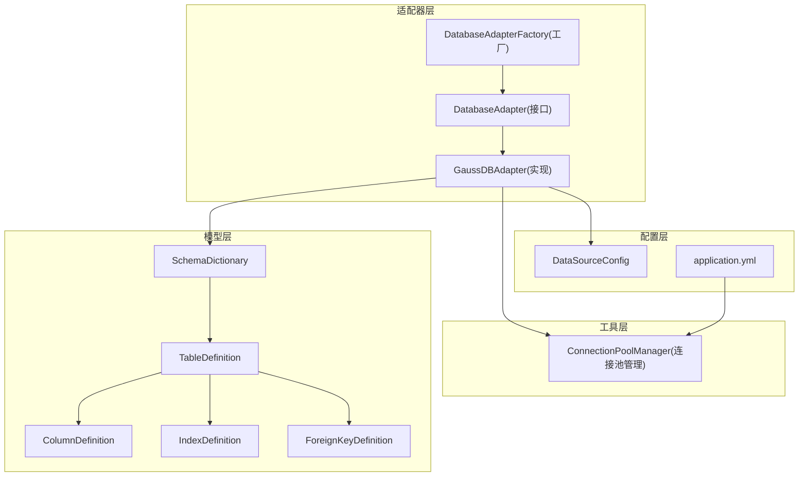
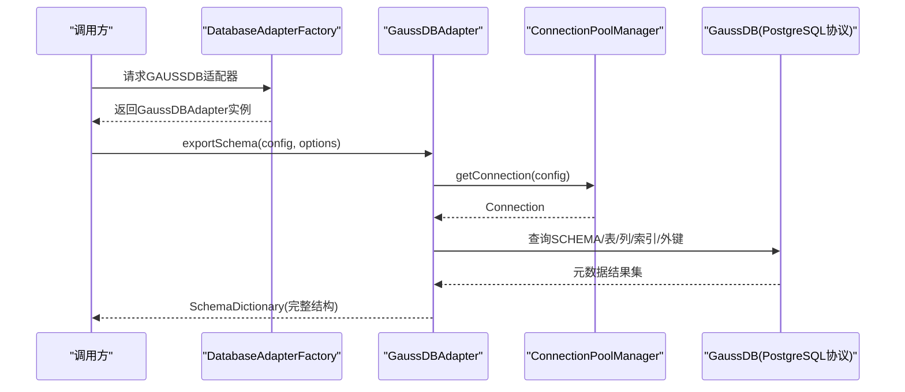
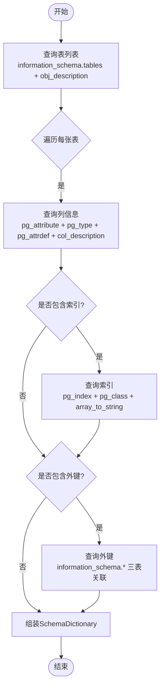
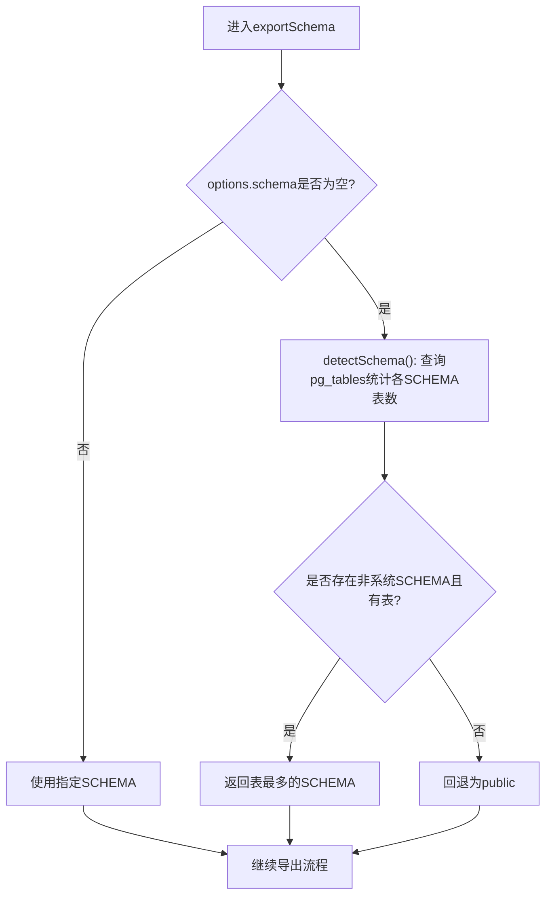
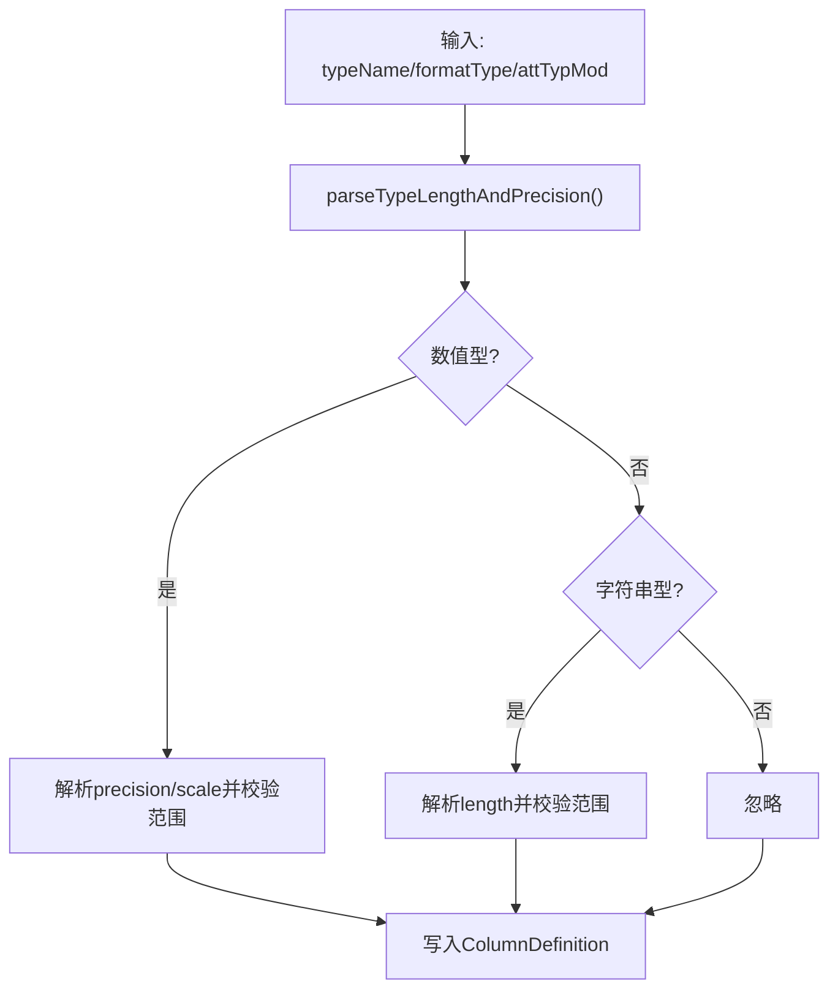
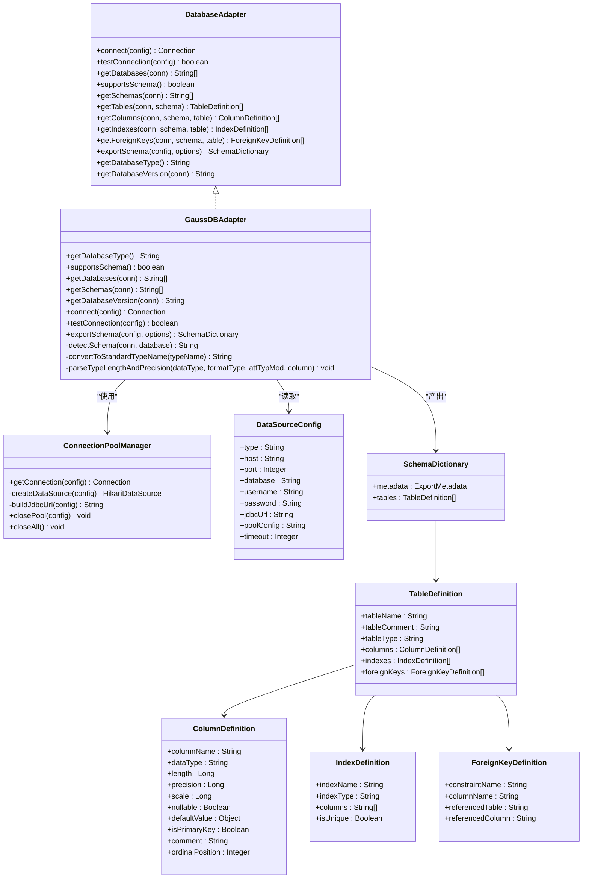
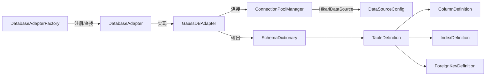

# GaussDB适配器实现

<cite>
**本文引用的文件**   
- [GaussDBAdapter.java](file://schemasync-backend/src/main/java/com/schemasync/adapter/GaussDBAdapter.java)
- [DatabaseAdapter.java](file://schemasync-backend/src/main/java/com/schemasync/adapter/DatabaseAdapter.java)
- [DatabaseAdapterFactory.java](file://schemasync-backend/src/main/java/com/schemasync/adapter/DatabaseAdapterFactory.java)
- [ConnectionPoolManager.java](file://schemasync-backend/src/main/java/com/schemasync/util/ConnectionPoolManager.java)
- [DataSourceConfig.java](file://schemasync-backend/src/main/java/com/schemasync/model/config/DataSourceConfig.java)
- [SchemaDictionary.java](file://schemasync-backend/src/main/java/com/schemasync/model/dict/SchemaDictionary.java)
- [TableDefinition.java](file://schemasync-backend/src/main/java/com/schemasync/model/dict/TableDefinition.java)
- [ColumnDefinition.java](file://schemasync-backend/src/main/java/com/schemasync/model/dict/ColumnDefinition.java)
- [IndexDefinition.java](file://schemasync-backend/src/main/java/com/schemasync/model/dict/IndexDefinition.java)
- [ForeignKeyDefinition.java](file://schemasync-backend/src/main/java/com/schemasync/model/dict/ForeignKeyDefinition.java)
- [application.yml](file://schemasync-backend/src/main/resources/application.yml)
</cite>

## 目录
1. [简介](#简介)
2. [项目结构](#项目结构)
3. [核心组件](#核心组件)
4. [架构总览](#架构总览)
5. [详细组件分析](#详细组件分析)
6. [依赖关系分析](#依赖关系分析)
7. [性能与连接池调优](#性能与连接池调优)
8. [故障排查指南](#故障排查指南)
9. [结论](#结论)
10. [附录：配置示例与兼容性说明](#附录配置示例与兼容性说明)

## 简介
本文件聚焦于项目中GaussDB数据库适配器的实现，系统梳理其基于PostgreSQL协议的元数据查询机制、数据类型映射、SCHEMA权限模型、扩展对象支持以及与标准PostgreSQL的差异点。同时给出JDBC连接配置、SSL安全连接设置、连接池调优参数建议，并涵盖企业版与社区版的兼容性考量、版本升级影响评估与迁移注意事项，帮助开发者高效使用GaussDB适配器完成数据字典导出、差异对比与DDL生成等任务。

## 项目结构
本项目采用分层与按功能域组织的方式，GaussDB相关代码主要位于适配器层与工具层：
- 适配器层：定义统一接口与具体数据库实现（含GaussDB）
- 工具层：连接池管理与通用工具
- 模型层：数据字典与导出元数据模型
- 配置层：应用与运行期配置

图表来源
- [DatabaseAdapter.java:1-134](file://schemasync-backend/src/main/java/com/schemasync/adapter/DatabaseAdapter.java#L1-L134)
- [GaussDBAdapter.java:1-550](file://schemasync-backend/src/main/java/com/schemasync/adapter/GaussDBAdapter.java#L1-L550)
- [DatabaseAdapterFactory.java:1-64](file://schemasync-backend/src/main/java/com/schemasync/adapter/DatabaseAdapterFactory.java#L1-L64)
- [ConnectionPoolManager.java:1-258](file://schemasync-backend/src/main/java/com/schemasync/util/ConnectionPoolManager.java#L1-L258)
- [SchemaDictionary.java:1-28](file://schemasync-backend/src/main/java/com/schemasync/model/dict/SchemaDictionary.java#L1-L28)
- [TableDefinition.java:1-89](file://schemasync-backend/src/main/java/com/schemasync/model/dict/TableDefinition.java#L1-L89)
- [ColumnDefinition.java:1-116](file://schemasync-backend/src/main/java/com/schemasync/model/dict/ColumnDefinition.java#L1-L116)
- [IndexDefinition.java:1-49](file://schemasync-backend/src/main/java/com/schemasync/model/dict/IndexDefinition.java#L1-L49)
- [ForeignKeyDefinition.java:1-54](file://schemasync-backend/src/main/java/com/schemasync/model/dict/ForeignKeyDefinition.java#L1-L54)
- [DataSourceConfig.java:1-129](file://schemasync-backend/src/main/java/com/schemasync/model/config/DataSourceConfig.java#L1-L129)
- [application.yml:1-83](file://schemasync-backend/src/main/resources/application.yml#L1-L83)

章节来源
- [DatabaseAdapter.java:1-134](file://schemasync-backend/src/main/java/com/schemasync/adapter/DatabaseAdapter.java#L1-L134)
- [GaussDBAdapter.java:1-550](file://schemasync-backend/src/main/java/com/schemasync/adapter/GaussDBAdapter.java#L1-L550)
- [DatabaseAdapterFactory.java:1-64](file://schemasync-backend/src/main/java/com/schemasync/adapter/DatabaseAdapterFactory.java#L1-L64)
- [ConnectionPoolManager.java:1-258](file://schemasync-backend/src/main/java/com/schemasync/util/ConnectionPoolManager.java#L1-L258)
- [SchemaDictionary.java:1-28](file://schemasync-backend/src/main/java/com/schemasync/model/dict/SchemaDictionary.java#L1-L28)
- [TableDefinition.java:1-89](file://schemasync-backend/src/main/java/com/schemasync/model/dict/TableDefinition.java#L1-L89)
- [ColumnDefinition.java:1-116](file://schemasync-backend/src/main/java/com/schemasync/model/dict/ColumnDefinition.java#L1-L116)
- [IndexDefinition.java:1-49](file://schemasync-backend/src/main/java/com/schemasync/model/dict/IndexDefinition.java#L1-L49)
- [ForeignKeyDefinition.java:1-54](file://schemasync-backend/src/main/java/com/schemasync/model/dict/ForeignKeyDefinition.java#L1-L54)
- [DataSourceConfig.java:1-129](file://schemasync-backend/src/main/java/com/schemasync/model/config/DataSourceConfig.java#L1-L129)
- [application.yml:1-83](file://schemasync-backend/src/main/resources/application.yml#L1-L83)

## 核心组件
- DatabaseAdapter接口：统一抽象了连接、测试、元数据导出、表/列/索引/外键获取、数据库类型与版本识别等能力。
- GaussDBAdapter：面向GaussDB/OpenGauss的具体实现，基于PG系统表与information_schema进行元数据采集，提供SCHEMA感知与自动检测逻辑。
- ConnectionPoolManager：基于HikariCP的连接池管理器，负责按数据源维度创建、缓存、复用和关闭连接池，并提供自定义连接池参数注入。
- 数据字典模型：SchemaDictionary、TableDefinition、ColumnDefinition、IndexDefinition、ForeignKeyDefinition用于承载导出的完整结构信息。
- 数据源配置：DataSourceConfig承载连接参数、超时、字符集、自定义JDBC URL与连接池高级配置。

章节来源
- [DatabaseAdapter.java:1-134](file://schemasync-backend/src/main/java/com/schemasync/adapter/DatabaseAdapter.java#L1-L134)
- [GaussDBAdapter.java:1-550](file://schemasync-backend/src/main/java/com/schemasync/adapter/GaussDBAdapter.java#L1-L550)
- [ConnectionPoolManager.java:1-258](file://schemasync-backend/src/main/java/com/schemasync/util/ConnectionPoolManager.java#L1-L258)
- [SchemaDictionary.java:1-28](file://schemasync-backend/src/main/java/com/schemasync/model/dict/SchemaDictionary.java#L1-L28)
- [TableDefinition.java:1-89](file://schemasync-backend/src/main/java/com/schemasync/model/dict/TableDefinition.java#L1-L89)
- [ColumnDefinition.java:1-116](file://schemasync-backend/src/main/java/com/schemasync/model/dict/ColumnDefinition.java#L1-L116)
- [IndexDefinition.java:1-49](file://schemasync-backend/src/main/java/com/schemasync/model/dict/IndexDefinition.java#L1-L49)
- [ForeignKeyDefinition.java:1-54](file://schemasync-backend/src/main/java/com/schemasync/model/dict/ForeignKeyDefinition.java#L1-L54)
- [DataSourceConfig.java:1-129](file://schemasync-backend/src/main/java/com/schemasync/model/config/DataSourceConfig.java#L1-L129)

## 架构总览
GaussDB适配器通过工厂注册与发现，在运行时根据数据库类型选择对应实现；连接由连接池管理器统一管控；元数据导出流程串联表、列、索引、外键的查询与组装。

图表来源
- [DatabaseAdapterFactory.java:1-64](file://schemasync-backend/src/main/java/com/schemasync/adapter/DatabaseAdapterFactory.java#L1-L64)
- [GaussDBAdapter.java:176-264](file://schemasync-backend/src/main/java/com/schemasync/adapter/GaussDBAdapter.java#L176-L264)
- [ConnectionPoolManager.java:36-49](file://schemasync-backend/src/main/java/com/schemasync/util/ConnectionPoolManager.java#L36-L49)

## 详细组件分析

### 元数据查询机制（基于PG系统表与information_schema）
- 表列表：优先使用information_schema.tables，兼容性强；注释通过obj_description结合regclass解析。
- 列信息：通过pg_attribute/pg_class/pg_type/pg_namespace关联，结合pg_attrdef获取默认值，pg_constraint定位主键；列注释通过col_description获取。
- 索引信息：通过pg_index/pg_class/pg_namespace聚合，区分唯一/主键索引，并按字段顺序拼接列名。
- 外键信息：通过information_schema.table_constraints/key_column_usage/constraint_column_usage三表关联获取。

图表来源
- [GaussDBAdapter.java:30-90](file://schemasync-backend/src/main/java/com/schemasync/adapter/GaussDBAdapter.java#L30-L90)
- [GaussDBAdapter.java:290-366](file://schemasync-backend/src/main/java/com/schemasync/adapter/GaussDBAdapter.java#L290-L366)
- [GaussDBAdapter.java:500-548](file://schemasync-backend/src/main/java/com/schemasync/adapter/GaussDBAdapter.java#L500-L548)

章节来源
- [GaussDBAdapter.java:30-90](file://schemasync-backend/src/main/java/com/schemasync/adapter/GaussDBAdapter.java#L30-L90)
- [GaussDBAdapter.java:290-366](file://schemasync-backend/src/main/java/com/schemasync/adapter/GaussDBAdapter.java#L290-L366)
- [GaussDBAdapter.java:500-548](file://schemasync-backend/src/main/java/com/schemasync/adapter/GaussDBAdapter.java#L500-L548)

### SCHEMA权限模型与自动检测
- 支持SCHEMA层级：supportsSchema()返回true，适配GaussDB/OpenGauss的“数据库→SCHEMA→表”模型。
- SCHEMA列表：从pg_namespace过滤系统命名空间后返回用户可见SCHEMA；若无则回退到public。
- 自动检测：当未指定SCHEMA时，优先选择存在用户表的非系统SCHEMA，否则回退public。

图表来源
- [GaussDBAdapter.java:125-148](file://schemasync-backend/src/main/java/com/schemasync/adapter/GaussDBAdapter.java#L125-L148)
- [GaussDBAdapter.java:270-287](file://schemasync-backend/src/main/java/com/schemasync/adapter/GaussDBAdapter.java#L270-L287)
- [GaussDBAdapter.java:195-201](file://schemasync-backend/src/main/java/com/schemasync/adapter/GaussDBAdapter.java#L195-L201)

章节来源
- [GaussDBAdapter.java:98-100](file://schemasync-backend/src/main/java/com/schemasync/adapter/GaussDBAdapter.java#L98-L100)
- [GaussDBAdapter.java:125-148](file://schemasync-backend/src/main/java/com/schemasync/adapter/GaussDBAdapter.java#L125-L148)
- [GaussDBAdapter.java:270-287](file://schemasync-backend/src/main/java/com/schemasync/adapter/GaussDBAdapter.java#L270-L287)

### 数据类型映射与精度长度解析
- 内部类型到标准DDL类型的映射：如int2/int4/int8→smallint/integer/bigint；float4/float8→real/double precision；bool→boolean；timestamptz/timetz→带时区时间类型；json/jsonb/uuid/xml/inet/macaddr/cidr等均保留或标准化。
- 长度与精度解析：从format_type中解析括号参数，针对numeric/decimal/number设置precision/scale；对varchar/char/nvarchar2/bpchar设置length；对异常大值进行边界保护与日志记录。

图表来源
- [GaussDBAdapter.java:372-429](file://schemasync-backend/src/main/java/com/schemasync/adapter/GaussDBAdapter.java#L372-L429)
- [GaussDBAdapter.java:434-497](file://schemasync-backend/src/main/java/com/schemasync/adapter/GaussDBAdapter.java#L434-L497)

章节来源
- [GaussDBAdapter.java:372-429](file://schemasync-backend/src/main/java/com/schemasync/adapter/GaussDBAdapter.java#L372-L429)
- [GaussDBAdapter.java:434-497](file://schemasync-backend/src/main/java/com/schemasync/adapter/GaussDBAdapter.java#L434-L497)

### 扩展对象支持与差异处理
- 注释支持：表注释通过obj_description(regclass,'pg_class')获取；列注释通过col_description获取。
- 视图支持：查询条件包含'VIEW'类型，便于导出视图结构。
- 索引类型：区分PRIMARY与INDEX，并标识唯一性。
- 外键约束：通过information_schema三表关联获取引用关系。

章节来源
- [GaussDBAdapter.java:30-39](file://schemasync-backend/src/main/java/com/schemasync/adapter/GaussDBAdapter.java#L30-L39)
- [GaussDBAdapter.java:41-63](file://schemasync-backend/src/main/java/com/schemasync/adapter/GaussDBAdapter.java#L41-L63)
- [GaussDBAdapter.java:65-77](file://schemasync-backend/src/main/java/com/schemasync/adapter/GaussDBAdapter.java#L65-L77)
- [GaussDBAdapter.java:79-90](file://schemasync-backend/src/main/java/com/schemasync/adapter/GaussDBAdapter.java#L79-L90)

### 与标准PostgreSQL的差异与增强
- 协议与驱动：GaussDB兼容PostgreSQL协议，使用postgresql JDBC驱动连接。
- 安全增强：可通过JDBC URL参数控制SSL模式；生产环境建议启用sslmode=require或verify-full，并结合服务端证书与客户端认证策略。
- 分布式与高可用：GaussDB企业版具备分布式与读写分离能力，但本适配器以单库视角采集元数据；跨分片/多节点场景需关注目标库一致性。
- 性能优化选项：可结合连接池参数与JDBC URL参数（如loggerLevel）降低开销；大批量导出时可考虑分批与并发策略（当前实现为串行逐表）。

章节来源
- [ConnectionPoolManager.java:122-131](file://schemasync-backend/src/main/java/com/schemasync/util/ConnectionPoolManager.java#L122-L131)
- [GaussDBAdapter.java:151-159](file://schemasync-backend/src/main/java/com/schemasync/adapter/GaussDBAdapter.java#L151-L159)

### 类图（GaussDB适配器与模型）

图表来源
- [DatabaseAdapter.java:1-134](file://schemasync-backend/src/main/java/com/schemasync/adapter/DatabaseAdapter.java#L1-L134)
- [GaussDBAdapter.java:1-550](file://schemasync-backend/src/main/java/com/schemasync/adapter/GaussDBAdapter.java#L1-L550)
- [ConnectionPoolManager.java:1-258](file://schemasync-backend/src/main/java/com/schemasync/util/ConnectionPoolManager.java#L1-L258)
- [DataSourceConfig.java:1-129](file://schemasync-backend/src/main/java/com/schemasync/model/config/DataSourceConfig.java#L1-L129)
- [SchemaDictionary.java:1-28](file://schemasync-backend/src/main/java/com/schemasync/model/dict/SchemaDictionary.java#L1-L28)
- [TableDefinition.java:1-89](file://schemasync-backend/src/main/java/com/schemasync/model/dict/TableDefinition.java#L1-L89)
- [ColumnDefinition.java:1-116](file://schemasync-backend/src/main/java/com/schemasync/model/dict/ColumnDefinition.java#L1-L116)
- [IndexDefinition.java:1-49](file://schemasync-backend/src/main/java/com/schemasync/model/dict/IndexDefinition.java#L1-L49)
- [ForeignKeyDefinition.java:1-54](file://schemasync-backend/src/main/java/com/schemasync/model/dict/ForeignKeyDefinition.java#L1-L54)

## 依赖关系分析
- 适配器与工厂：工厂扫描所有DatabaseAdapter实现，按getDatabaseType()注册到Map，供外部按类型获取。
- 适配器与连接池：GaussDBAdapter.connect()委托ConnectionPoolManager.getConnection()，后者根据DataSourceConfig构建HikariDataSource并缓存。
- 适配器与模型：导出流程将元数据填充至SchemaDictionary及子模型，供上层服务消费。

图表来源
- [DatabaseAdapterFactory.java:1-64](file://schemasync-backend/src/main/java/com/schemasync/adapter/DatabaseAdapterFactory.java#L1-L64)
- [GaussDBAdapter.java:162-174](file://schemasync-backend/src/main/java/com/schemasync/adapter/GaussDBAdapter.java#L162-L174)
- [ConnectionPoolManager.java:36-90](file://schemasync-backend/src/main/java/com/schemasync/util/ConnectionPoolManager.java#L36-L90)
- [SchemaDictionary.java:1-28](file://schemasync-backend/src/main/java/com/schemasync/model/dict/SchemaDictionary.java#L1-L28)

章节来源
- [DatabaseAdapterFactory.java:1-64](file://schemasync-backend/src/main/java/com/schemasync/adapter/DatabaseAdapterFactory.java#L1-L64)
- [GaussDBAdapter.java:162-174](file://schemasync-backend/src/main/java/com/schemasync/adapter/GaussDBAdapter.java#L162-L174)
- [ConnectionPoolManager.java:36-90](file://schemasync-backend/src/main/java/com/schemasync/util/ConnectionPoolManager.java#L36-L90)

## 性能与连接池调优
- 连接池默认参数：最大连接数10、最小空闲2、连接超时取配置（秒）、空闲超时10分钟、最大存活30分钟。
- 自定义连接池参数：支持JSON格式覆盖maximumPoolSize、minimumIdle、connectionTimeout、idleTimeout、maxLifetime。
- 日志级别：GaussDB JDBC URL默认关闭loggerLevel以降低开销。
- 导出性能：当前为串行逐表导出，若表数量较大，可在业务侧增加批处理或并发策略（注意目标库负载与锁竞争）。

章节来源
- [ConnectionPoolManager.java:54-90](file://schemasync-backend/src/main/java/com/schemasync/util/ConnectionPoolManager.java#L54-L90)
- [ConnectionPoolManager.java:146-186](file://schemasync-backend/src/main/java/com/schemasync/util/ConnectionPoolManager.java#L146-L186)
- [GaussDBAdapter.java:222-264](file://schemasync-backend/src/main/java/com/schemasync/adapter/GaussDBAdapter.java#L222-L264)

## 故障排查指南
- 连接失败
  - 检查JDBC URL是否正确（主机、端口、数据库名），确认GAUSSDB类型下使用postgresql协议。
  - 若启用SSL，需在JDBC URL中设置合适的sslmode，并确保服务端证书与客户端信任链正确。
  - 查看连接池日志，确认是否因超时或最大连接数不足导致拒绝。
- 元数据缺失
  - 确认当前用户具备目标SCHEMA的读取权限；若未显式指定SCHEMA，系统将尝试自动检测，必要时手动指定。
  - 检查表/列注释是否已添加，部分旧版本可能不支持注释函数。
- 数据类型异常
  - numeric/decimal超长精度或字符串超长长度会被限制并记录日志，建议核对DDL定义。
  - 特殊类型（如inet/macaddr/cidr）会保持原样映射，确保下游生成器能正确处理。
- 版本兼容
  - getDatabaseVersion()返回GaussDB版本前缀，若出现未知版本，请检查驱动与服务端版本匹配情况。

章节来源
- [GaussDBAdapter.java:151-159](file://schemasync-backend/src/main/java/com/schemasync/adapter/GaussDBAdapter.java#L151-L159)
- [GaussDBAdapter.java:372-429](file://schemasync-backend/src/main/java/com/schemasync/adapter/GaussDBAdapter.java#L372-L429)
- [ConnectionPoolManager.java:122-131](file://schemasync-backend/src/main/java/com/schemasync/util/ConnectionPoolManager.java#L122-L131)

## 结论
GaussDB适配器在现有架构中以最小侵入方式实现了GaussDB/OpenGauss的元数据导出能力，充分利用PG系统表与information_schema，兼顾兼容性与扩展性。通过连接池管理与灵活的JDBC URL参数，可满足多种部署与安全需求。建议在大规模导出场景中结合并发与批处理策略，并在生产环境启用SSL与合理的连接池参数，以获得稳定高效的体验。

## 附录：配置示例与兼容性说明

### JDBC连接配置要点（GAUSSDB）
- 协议与驱动：使用postgresql协议，JDBC URL形如 jdbc:postgresql://host:port/db?sslmode=disable&loggerLevel=OFF。
- SSL安全连接：生产环境建议将sslmode设置为require或verify-full，并配置相应证书与认证策略。
- 自定义URL：DataSourceConfig支持jdbcUrl字段覆盖自动生成URL，便于精细化控制。

章节来源
- [ConnectionPoolManager.java:122-131](file://schemasync-backend/src/main/java/com/schemasync/util/ConnectionPoolManager.java#L122-L131)
- [DataSourceConfig.java:69-73](file://schemasync-backend/src/main/java/com/schemasync/model/config/DataSourceConfig.java#L69-L73)

### 连接池调优参数建议
- maximumPoolSize：根据并发与目标库容量调整，避免过大导致资源争用。
- minimumIdle：保持一定空闲连接，减少冷启动延迟。
- connectionTimeout/idleTimeout/maxLifetime：依据网络与后端会话生命周期合理设置。
- JSON覆盖：通过poolConfig传入上述参数，动态覆盖默认值。

章节来源
- [ConnectionPoolManager.java:54-90](file://schemasync-backend/src/main/java/com/schemasync/util/ConnectionPoolManager.java#L54-L90)
- [ConnectionPoolManager.java:146-186](file://schemasync-backend/src/main/java/com/schemasync/util/ConnectionPoolManager.java#L146-L186)

### 企业版与社区版兼容性
- 元数据差异：注释函数与某些系统视图在不同版本可能存在差异，当前实现已做兼容处理；如遇异常，建议升级到较新版本或按需调整SQL。
- 分布式能力：企业版具备分布式特性，但本适配器以单库视角工作，跨分片一致性需在上层保证。
- 版本升级影响：升级前后建议验证SCHEMA自动检测、数据类型映射与注释导出结果的一致性。

章节来源
- [GaussDBAdapter.java:30-39](file://schemasync-backend/src/main/java/com/schemasync/adapter/GaussDBAdapter.java#L30-L39)
- [GaussDBAdapter.java:125-148](file://schemasync-backend/src/main/java/com/schemasync/adapter/GaussDBAdapter.java#L125-L148)
- [GaussDBAdapter.java:151-159](file://schemasync-backend/src/main/java/com/schemasync/adapter/GaussDBAdapter.java#L151-L159)

### 应用配置参考
- 全局应用配置（端口、日志、Jackson序列化等）见application.yml。
- 开发/生产环境差异化配置可按需加载。

章节来源
- [application.yml:1-83](file://schemasync-backend/src/main/resources/application.yml#L1-L83)