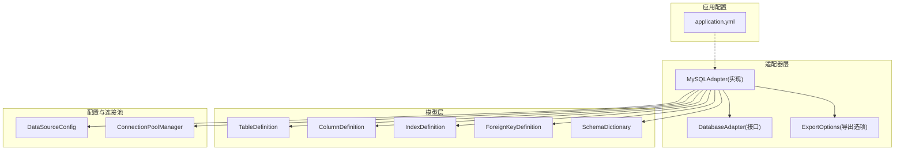
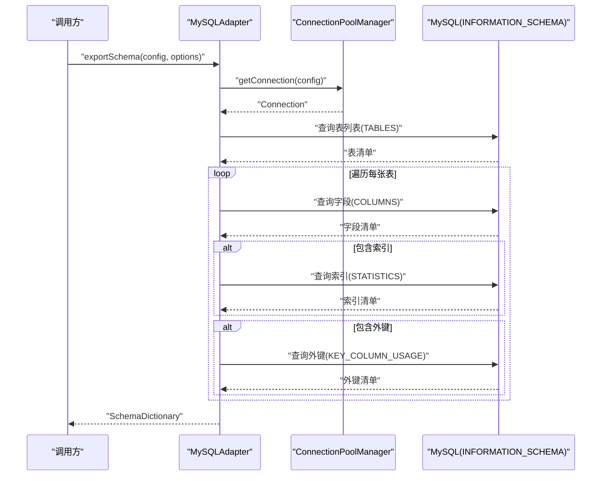
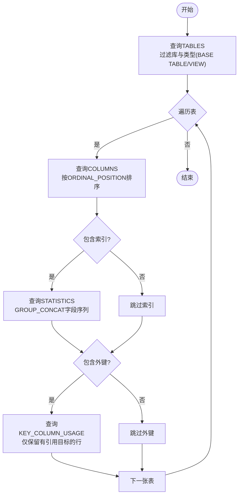
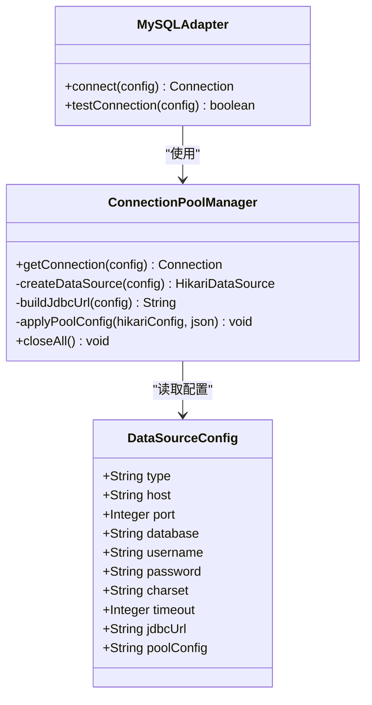
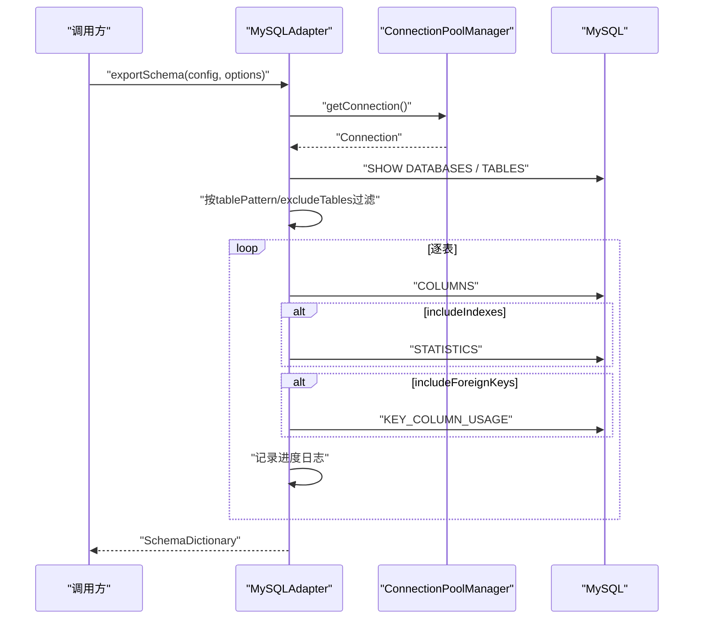
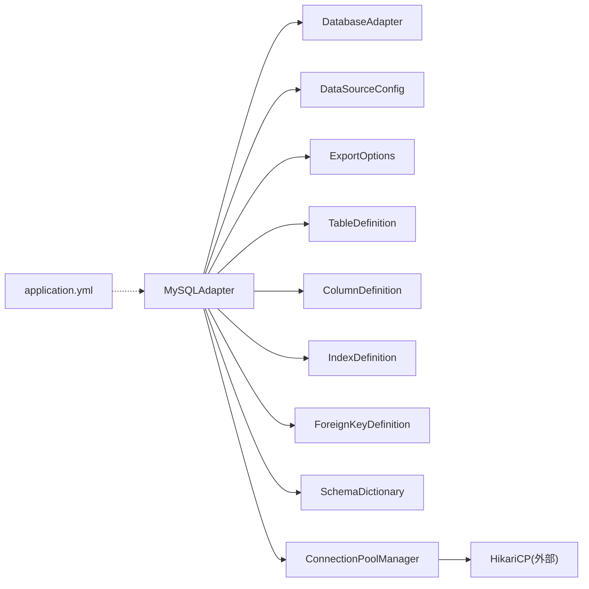

# MySQL适配器实现

<cite>
**本文引用的文件**   
- [MySQLAdapter.java](file://schemasync-backend/src/main/java/com/schemasync/adapter/MySQLAdapter.java)
- [DatabaseAdapter.java](file://schemasync-backend/src/main/java/com/schemasync/adapter/DatabaseAdapter.java)
- [ExportOptions.java](file://schemasync-backend/src/main/java/com/schemasync/adapter/ExportOptions.java)
- [ConnectionPoolManager.java](file://schemasync-backend/src/main/java/com/schemasync/util/ConnectionPoolManager.java)
- [DataSourceConfig.java](file://schemasync-backend/src/main/java/com/schemasync/model/config/DataSourceConfig.java)
- [TableDefinition.java](file://schemasync-backend/src/main/java/com/schemasync/model/dict/TableDefinition.java)
- [ColumnDefinition.java](file://schemasync-backend/src/main/java/com/schemasync/model/dict/ColumnDefinition.java)
- [IndexDefinition.java](file://schemasync-backend/src/main/java/com/schemasync/model/dict/IndexDefinition.java)
- [ForeignKeyDefinition.java](file://schemasync-backend/src/main/java/com/schemasync/model/dict/ForeignKeyDefinition.java)
- [SchemaDictionary.java](file://schemasync-backend/src/main/java/com/schemasync/model/dict/SchemaDictionary.java)
- [application.yml](file://schemasync-backend/src/main/resources/application.yml)
</cite>

## 目录
1. [简介](#简介)
2. [项目结构](#项目结构)
3. [核心组件](#核心组件)
4. [架构总览](#架构总览)
5. [详细组件分析](#详细组件分析)
6. [依赖关系分析](#依赖关系分析)
7. [性能考虑](#性能考虑)
8. [故障排查指南](#故障排查指南)
9. [结论](#结论)
10. [附录](#附录)

## 简介
本文件聚焦于MySQL数据库适配器的技术实现，系统性阐述其基于INFORMATION_SCHEMA的元数据查询机制、JDBC连接与连接池管理、表结构与索引/外键信息提取、数据类型映射（含TEXT超大长度支持）、视图处理、字符集与自增字段识别等特性。同时提供导出流程的性能优化策略、进度监控与日志记录建议，并给出配置示例与常见问题排查方法，帮助开发者快速理解与扩展MySQL适配器。

## 项目结构
围绕MySQL适配器的关键代码分布在以下包与文件中：
- 适配器层：MySQLAdapter、DatabaseAdapter接口、ExportOptions
- 模型层：TableDefinition、ColumnDefinition、IndexDefinition、ForeignKeyDefinition、SchemaDictionary
- 配置与连接池：DataSourceConfig、ConnectionPoolManager
- 应用配置：application.yml

图表来源
- [MySQLAdapter.java:1-367](file://schemasync-backend/src/main/java/com/schemasync/adapter/MySQLAdapter.java#L1-L367)
- [DatabaseAdapter.java:1-134](file://schemasync-backend/src/main/java/com/schemasync/adapter/DatabaseAdapter.java#L1-L134)
- [ExportOptions.java:1-122](file://schemasync-backend/src/main/java/com/schemasync/adapter/ExportOptions.java#L1-L122)
- [ConnectionPoolManager.java:1-258](file://schemasync-backend/src/main/java/com/schemasync/util/ConnectionPoolManager.java#L1-L258)
- [DataSourceConfig.java:1-129](file://schemasync-backend/src/main/java/com/schemasync/model/config/DataSourceConfig.java#L1-L129)
- [TableDefinition.java:1-89](file://schemasync-backend/src/main/java/com/schemasync/model/dict/TableDefinition.java#L1-L89)
- [ColumnDefinition.java:1-116](file://schemasync-backend/src/main/java/com/schemasync/model/dict/ColumnDefinition.java#L1-L116)
- [IndexDefinition.java:1-49](file://schemasync-backend/src/main/java/com/schemasync/model/dict/IndexDefinition.java#L1-L49)
- [ForeignKeyDefinition.java:1-54](file://schemasync-backend/src/main/java/com/schemasync/model/dict/ForeignKeyDefinition.java#L1-L54)
- [SchemaDictionary.java:1-28](file://schemasync-backend/src/main/java/com/schemasync/model/dict/SchemaDictionary.java#L1-L28)
- [application.yml:1-83](file://schemasync-backend/src/main/resources/application.yml#L1-L83)

章节来源
- [MySQLAdapter.java:1-367](file://schemasync-backend/src/main/java/com/schemasync/adapter/MySQLAdapter.java#L1-L367)
- [DatabaseAdapter.java:1-134](file://schemasync-backend/src/main/java/com/schemasync/adapter/DatabaseAdapter.java#L1-L134)
- [ConnectionPoolManager.java:1-258](file://schemasync-backend/src/main/java/com/schemasync/util/ConnectionPoolManager.java#L1-L258)
- [DataSourceConfig.java:1-129](file://schemasync-backend/src/main/java/com/schemasync/model/config/DataSourceConfig.java#L1-L129)
- [application.yml:1-83](file://schemasync-backend/src/main/resources/application.yml#L1-L83)

## 核心组件
- DatabaseAdapter接口：定义跨数据库的统一能力契约，包括连接、库/表/列/索引/外键获取、版本查询、完整字典导出等。
- MySQLAdapter：面向MySQL的具体实现，使用INFORMATION_SCHEMA进行元数据读取，封装JDBC调用与结果映射。
- ConnectionPoolManager：基于HikariCP的连接池管理器，负责按数据源维度缓存连接池、构建JDBC URL、应用自定义池参数。
- ExportOptions：导出控制开关，如是否包含索引/外键、表名过滤模式、排除列表等。
- 模型类：TableDefinition、ColumnDefinition、IndexDefinition、ForeignKeyDefinition、SchemaDictionary用于承载导出的结构化元数据。

章节来源
- [DatabaseAdapter.java:1-134](file://schemasync-backend/src/main/java/com/schemasync/adapter/DatabaseAdapter.java#L1-L134)
- [MySQLAdapter.java:1-367](file://schemasync-backend/src/main/java/com/schemasync/adapter/MySQLAdapter.java#L1-L367)
- [ConnectionPoolManager.java:1-258](file://schemasync-backend/src/main/java/com/schemasync/util/ConnectionPoolManager.java#L1-L258)
- [ExportOptions.java:1-122](file://schemasync-backend/src/main/java/com/schemasync/adapter/ExportOptions.java#L1-L122)
- [TableDefinition.java:1-89](file://schemasync-backend/src/main/java/com/schemasync/model/dict/TableDefinition.java#L1-L89)
- [ColumnDefinition.java:1-116](file://schemasync-backend/src/main/java/com/schemasync/model/dict/ColumnDefinition.java#L1-L116)
- [IndexDefinition.java:1-49](file://schemasync-backend/src/main/java/com/schemasync/model/dict/IndexDefinition.java#L1-L49)
- [ForeignKeyDefinition.java:1-54](file://schemasync-backend/src/main/java/com/schemasync/model/dict/ForeignKeyDefinition.java#L1-L54)
- [SchemaDictionary.java:1-28](file://schemasync-backend/src/main/java/com/schemasync/model/dict/SchemaDictionary.java#L1-L28)

## 架构总览
MySQL适配器在整体架构中的职责与交互如下：
- 上层服务通过DatabaseAdapterFactory选择具体适配器（此处为MySQLAdapter）。
- MySQLAdapter通过ConnectionPoolManager获取Hikari连接，执行INFORMATION_SCHEMA查询，填充模型对象，最终组装SchemaDictionary返回。

图表来源
- [MySQLAdapter.java:225-303](file://schemasync-backend/src/main/java/com/schemasync/adapter/MySQLAdapter.java#L225-L303)
- [ConnectionPoolManager.java:36-49](file://schemasync-backend/src/main/java/com/schemasync/util/ConnectionPoolManager.java#L36-L49)

## 详细组件分析

### 元数据查询机制（INFORMATION_SCHEMA）
- 表列表：从INFORMATION_SCHEMA.TABLES筛选指定库且类型为BASE TABLE或VIEW，返回表名、注释、类型、引擎、排序规则、创建/更新时间等。
- 字段列表：从INFORMATION_SCHEMA.COLUMNS获取字段名、数据类型、最大长度、数值精度/小数位、可空性、默认值、主键标记、自增标记、注释、字符集、顺序等。
- 索引列表：从INFORMATION_SCHEMA.STATISTICS聚合每索引的字段序列，得到唯一性、索引类型与字段集合。
- 外键列表：从INFORMATION_SCHEMA.KEY_COLUMN_USAGE筛选引用目标非空的行，得到约束名、字段、引用表/列。

图表来源
- [MySQLAdapter.java:28-56](file://schemasync-backend/src/main/java/com/schemasync/adapter/MySQLAdapter.java#L28-L56)
- [MySQLAdapter.java:90-222](file://schemasync-backend/src/main/java/com/schemasync/adapter/MySQLAdapter.java#L90-L222)

章节来源
- [MySQLAdapter.java:28-56](file://schemasync-backend/src/main/java/com/schemasync/adapter/MySQLAdapter.java#L28-L56)
- [MySQLAdapter.java:90-222](file://schemasync-backend/src/main/java/com/schemasync/adapter/MySQLAdapter.java#L90-L222)

### JDBC连接配置与连接池管理
- 连接获取：MySQLAdapter.connect委托给ConnectionPoolManager.getConnection，由后者维护Hikari连接池缓存。
- 连接池构建：
  - 若DataSourceConfig提供jdbcUrl则直接使用，否则根据type自动生成URL；MySQL兼容型数据库统一走mysql驱动URL模板，开启useUnicode、设置characterEncoding、时区等。
  - 基础池参数：最大池大小、最小空闲、连接超时、空闲超时、最大生命周期、连接测试语句。
  - 支持通过poolConfig(JSON字符串)动态覆盖部分池参数（如maximumPoolSize、minimumIdle、connectionTimeout、idleTimeout、maxLifetime）。
- 连接池生命周期：按“类型+主机+端口+库+用户名”作为key缓存；关闭时逐个释放。

图表来源
- [ConnectionPoolManager.java:36-90](file://schemasync-backend/src/main/java/com/schemasync/util/ConnectionPoolManager.java#L36-L90)
- [ConnectionPoolManager.java:103-132](file://schemasync-backend/src/main/java/com/schemasync/util/ConnectionPoolManager.java#L103-L132)
- [ConnectionPoolManager.java:146-186](file://schemasync-backend/src/main/java/com/schemasync/util/ConnectionPoolManager.java#L146-L186)
- [MySQLAdapter.java:58-71](file://schemasync-backend/src/main/java/com/schemasync/adapter/MySQLAdapter.java#L58-L71)
- [DataSourceConfig.java:1-129](file://schemasync-backend/src/main/java/com/schemasync/model/config/DataSourceConfig.java#L1-L129)

章节来源
- [ConnectionPoolManager.java:36-90](file://schemasync-backend/src/main/java/com/schemasync/util/ConnectionPoolManager.java#L36-L90)
- [ConnectionPoolManager.java:103-132](file://schemasync-backend/src/main/java/com/schemasync/util/ConnectionPoolManager.java#L103-L132)
- [ConnectionPoolManager.java:146-186](file://schemasync-backend/src/main/java/com/schemasync/util/ConnectionPoolManager.java#L146-L186)
- [MySQLAdapter.java:58-71](file://schemasync-backend/src/main/java/com/schemasync/adapter/MySQLAdapter.java#L58-L71)
- [DataSourceConfig.java:1-129](file://schemasync-backend/src/main/java/com/schemasync/model/config/DataSourceConfig.java#L1-L129)

### 数据类型映射与特殊字段处理
- 长度字段：使用Long类型承载CHARACTER_MAXIMUM_LENGTH，以支持TEXT等大文本类型的超长长度值。
- 精度/小数位：NUMERIC_PRECISION与NUMERIC_SCALE分别映射到precision与scale。
- 可空性与默认值：IS_NULLABLE映射为Boolean；COLUMN_DEFAULT直接取原始对象。
- 主键与自增：COLUMN_KEY为PRI标记为主键；EXTRA包含auto_increment标识自增字段。
- 字符集：字段级CHARACTER_SET_NAME与表级TABLE_COLLATION分别记录。
- 视图处理：TABLE_TYPE包含VIEW，导出时可结合ExportOptions.includeViews控制是否纳入。

章节来源
- [ColumnDefinition.java:1-116](file://schemasync-backend/src/main/java/com/schemasync/model/dict/ColumnDefinition.java#L1-L116)
- [TableDefinition.java:1-89](file://schemasync-backend/src/main/java/com/schemasync/model/dict/TableDefinition.java#L1-L89)
- [MySQLAdapter.java:124-169](file://schemasync-backend/src/main/java/com/schemasync/adapter/MySQLAdapter.java#L124-L169)
- [MySQLAdapter.java:28-33](file://schemasync-backend/src/main/java/com/schemasync/adapter/MySQLAdapter.java#L28-L33)

### 索引与外键信息提取
- 索引：
  - 使用INFORMATION_SCHEMA.STATISTICS，按INDEX_NAME分组，利用GROUP_CONCAT拼接字段序列，得到columns列表。
  - NON_UNIQUE=false表示唯一索引；INDEX_TYPE反映索引类型（如BTREE、FULLTEXT等）。
- 外键：
  - 使用INFORMATION_SCHEMA.KEY_COLUMN_USAGE，限定REFERENCED_TABLE_NAME非空，得到约束名、字段、引用表/列。
  - 当前实现未解析更新/删除规则（onUpdate/onDelete），可在后续扩展中补充。

章节来源
- [MySQLAdapter.java:44-56](file://schemasync-backend/src/main/java/com/schemasync/adapter/MySQLAdapter.java#L44-L56)
- [MySQLAdapter.java:171-222](file://schemasync-backend/src/main/java/com/schemasync/adapter/MySQLAdapter.java#L171-L222)
- [IndexDefinition.java:1-49](file://schemasync-backend/src/main/java/com/schemasync/model/dict/IndexDefinition.java#L1-L49)
- [ForeignKeyDefinition.java:1-54](file://schemasync-backend/src/main/java/com/schemasync/model/dict/ForeignKeyDefinition.java#L1-L54)

### MySQL特有功能支持情况
- 存储引擎：ENGINE字段被读取并写入TableDefinition.engine，可用于区分InnoDB/MyISAM等。
- 字符集：表级TABLE_COLLATION与字段级CHARACTER_SET_NAME均被记录。
- 自增字段：通过EXTRA包含auto_increment识别。
- 视图：TABLE_TYPE=VIEW的条目会被列出，可通过ExportOptions.includeViews决定是否参与导出。
- 系统库过滤：getDatabases会过滤information_schema、mysql、performance_schema、sys等系统库。

章节来源
- [MySQLAdapter.java:90-121](file://schemasync-backend/src/main/java/com/schemasync/adapter/MySQLAdapter.java#L90-L121)
- [MySQLAdapter.java:74-87](file://schemasync-backend/src/main/java/com/schemasync/adapter/MySQLAdapter.java#L74-L87)
- [MySQLAdapter.java:337-342](file://schemasync-backend/src/main/java/com/schemasync/adapter/MySQLAdapter.java#L337-L342)

### 导出流程与进度监控
- 步骤：
  1) 建立连接并记录耗时；
  2) 查询表清单并按模式过滤/排除；
  3) 逐表导出字段、索引、外键；
  4) 组装SchemaDictionary并输出总体耗时统计。
- 进度日志：每处理10张表或最后一张表时输出进度百分比、当前表名与耗时。
- 可选开关：includeIndexes、includeForeignKeys、includeViews控制导出范围。

图表来源
- [MySQLAdapter.java:225-303](file://schemasync-backend/src/main/java/com/schemasync/adapter/MySQLAdapter.java#L225-L303)
- [ExportOptions.java:1-122](file://schemasync-backend/src/main/java/com/schemasync/adapter/ExportOptions.java#L1-L122)

章节来源
- [MySQLAdapter.java:225-303](file://schemasync-backend/src/main/java/com/schemasync/adapter/MySQLAdapter.java#L225-L303)
- [ExportOptions.java:1-122](file://schemasync-backend/src/main/java/com/schemasync/adapter/ExportOptions.java#L1-L122)

## 依赖关系分析
- MySQLAdapter依赖：
  - 接口：DatabaseAdapter
  - 模型：TableDefinition、ColumnDefinition、IndexDefinition、ForeignKeyDefinition、SchemaDictionary
  - 配置：DataSourceConfig、ExportOptions
  - 工具：ConnectionPoolManager
- 连接池依赖：
  - HikariCP（外部库）
  - 应用配置：application.yml（日志级别、上下文路径等）

图表来源
- [MySQLAdapter.java:1-367](file://schemasync-backend/src/main/java/com/schemasync/adapter/MySQLAdapter.java#L1-L367)
- [ConnectionPoolManager.java:1-258](file://schemasync-backend/src/main/java/com/schemasync/util/ConnectionPoolManager.java#L1-L258)
- [application.yml:1-83](file://schemasync-backend/src/main/resources/application.yml#L1-L83)

章节来源
- [MySQLAdapter.java:1-367](file://schemasync-backend/src/main/java/com/schemasync/adapter/MySQLAdapter.java#L1-L367)
- [ConnectionPoolManager.java:1-258](file://schemasync-backend/src/main/java/com/schemasync/util/ConnectionPoolManager.java#L1-L258)
- [application.yml:1-83](file://schemasync-backend/src/main/resources/application.yml#L1-L83)

## 性能考虑
- 批量查询优化
  - 表清单一次性拉取后，再按需对每张表发起字段/索引/外键查询，避免N+1多次小查询带来的开销。
  - 索引查询使用GROUP_CONCAT减少多行聚合后的客户端处理成本。
- 大库导出优化
  - 启用includeIndexes/includeForeignKeys按需开关，降低不必要查询。
  - 使用tablePattern/excludeTables提前裁剪表集合，减少后续IO。
  - 合理设置连接池参数（maximumPoolSize、connectionTimeout、idleTimeout、maxLifetime）以匹配并发与网络延迟。
- 进度监控与日志
  - 每10张表或最后一张表输出进度百分比、当前表名与耗时，便于定位慢表。
  - 建议在导出前后记录总耗时与阶段耗时，辅助性能回归分析。
- 字符集与时区
  - JDBC URL中显式设置useUnicode与characterEncoding，避免隐式转换导致额外开销。
  - serverTimezone设置为Asia/Shanghai，避免时区换算带来的潜在问题。

[本节为通用指导，不直接分析具体文件]

## 故障排查指南
- 连接失败
  - 检查DataSourceConfig的host/port/database/username/password是否正确。
  - 确认防火墙/安全组放行3306端口。
  - 若使用自定义jdbcUrl，确保参数完整（如useSSL、serverTimezone等）。
- 字符集乱码
  - 确认JDBC URL的characterEncoding与服务器端字符集一致（utf8mb4推荐）。
  - 检查表/字段级字符集配置是否与期望一致。
- 自增字段未识别
  - 核对EXTRA字段是否包含auto_increment；必要时检查权限是否能访问INFORMATION_SCHEMA。
- 视图未导出
  - 确认ExportOptions.includeViews=true；同时确保TABLE_TYPE包含VIEW。
- 连接池耗尽
  - 观察日志中连接池状态，适当调高maximumPoolSize与connectionTimeout。
  - 检查是否存在未正确关闭的连接（try-with-resources已保证大部分场景安全）。
- 外键规则缺失
  - 当前实现未解析ON UPDATE/DELETE规则，如需可在KEY_COLUMN_USAGE基础上关联相关视图补充。

章节来源
- [MySQLAdapter.java:58-71](file://schemasync-backend/src/main/java/com/schemasync/adapter/MySQLAdapter.java#L58-L71)
- [ConnectionPoolManager.java:103-132](file://schemasync-backend/src/main/java/com/schemasync/util/ConnectionPoolManager.java#L103-L132)
- [MySQLAdapter.java:225-303](file://schemasync-backend/src/main/java/com/schemasync/adapter/MySQLAdapter.java#L225-L303)

## 结论
MySQL适配器通过标准化接口与清晰的模块划分，实现了基于INFORMATION_SCHEMA的高效元数据采集。其在长度/精度/自增/字符集/视图等细节上具备良好覆盖，并通过连接池管理与进度日志提升了稳定性与可观测性。针对大库导出，建议按需开关、合理裁剪表集合与优化连接池参数，以获得更优性能表现。

[本节为总结性内容，不直接分析具体文件]

## 附录

### 配置示例（参考）
- 数据源配置（DataSourceConfig关键字段）
  - type: mysql
  - host/port/database/username/password
  - charset: utf8mb4
  - timeout: 30
  - jdbcUrl: 可选，覆盖自动生成的URL
  - poolConfig: JSON字符串，如{"maximumPoolSize":20,"minimumIdle":5,"idleTimeout":600000}
- 应用配置（application.yml）
  - server.port: 8999
  - logging.level.root: INFO
  - schemasync.max-pool-size/min-idle/max-lifetime/connection-timeout等

章节来源
- [DataSourceConfig.java:1-129](file://schemasync-backend/src/main/java/com/schemasync/model/config/DataSourceConfig.java#L1-L129)
- [application.yml:1-83](file://schemasync-backend/src/main/resources/application.yml#L1-L83)