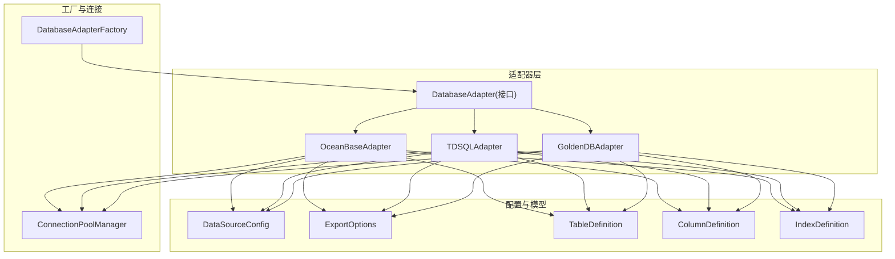
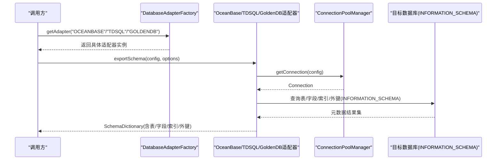
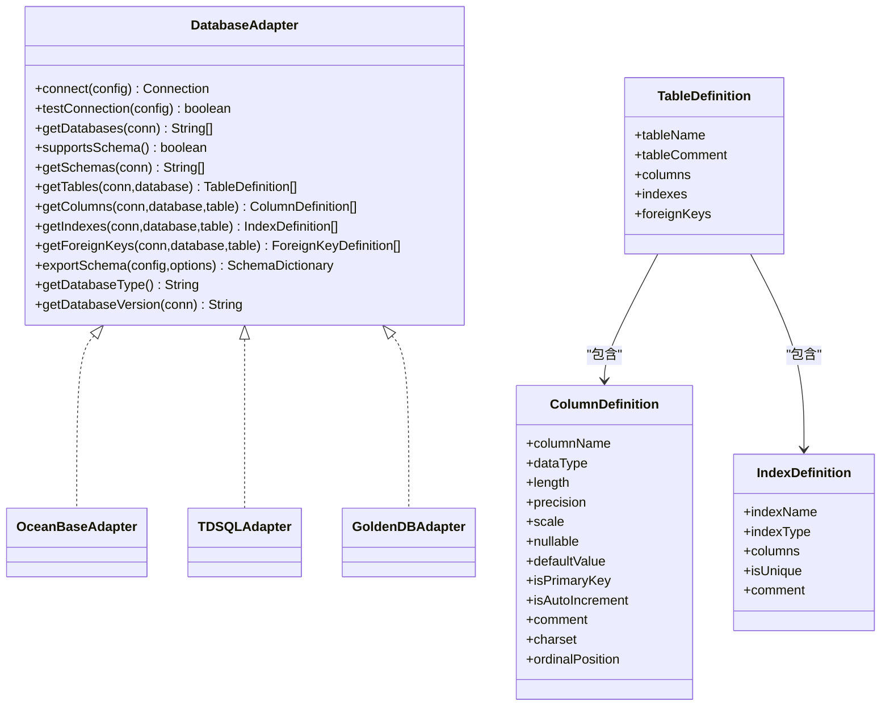
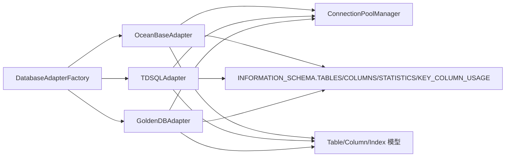

# OceanBase/TDSQL/GoldenDB适配器实现

<cite>
**本文引用的文件**   
- [DatabaseAdapter.java](file://schemasync-backend/src/main/java/com/schemasync/adapter/DatabaseAdapter.java)
- [OceanBaseAdapter.java](file://schemasync-backend/src/main/java/com/schemasync/adapter/OceanBaseAdapter.java)
- [TDSQLAdapter.java](file://schemasync-backend/src/main/java/com/schemasync/adapter/TDSQLAdapter.java)
- [GoldenDBAdapter.java](file://schemasync-backend/src/main/java/com/schemasync/adapter/GoldenDBAdapter.java)
- [DatabaseAdapterFactory.java](file://schemasync-backend/src/main/java/com/schemasync/adapter/DatabaseAdapterFactory.java)
- [ConnectionPoolManager.java](file://schemasync-backend/src/main/java/com/schemasync/util/ConnectionPoolManager.java)
- [DataSourceConfig.java](file://schemasync-backend/src/main/java/com/schemasync/model/config/DataSourceConfig.java)
- [ExportOptions.java](file://schemasync-backend/src/main/java/com/schemasync/adapter/ExportOptions.java)
- [TableDefinition.java](file://schemasync-backend/src/main/java/com/schemasync/model/dict/TableDefinition.java)
- [ColumnDefinition.java](file://schemasync-backend/src/main/java/com/schemasync/model/dict/ColumnDefinition.java)
- [IndexDefinition.java](file://schemasync-backend/src/main/java/com/schemasync/model/dict/IndexDefinition.java)
- [application.yml](file://schemasync-backend/src/main/resources/application.yml)
- [schemasync-config.json](file://schemasync-backend/src/main/resources/schemasync-config.json)
</cite>

## 目录
1. [简介](#简介)
2. [项目结构](#项目结构)
3. [核心组件](#核心组件)
4. [架构总览](#架构总览)
5. [详细组件分析](#详细组件分析)
6. [依赖关系分析](#依赖关系分析)
7. [性能与优化建议](#性能与优化建议)
8. [故障转移与高可用](#故障转移与高可用)
9. [监控与告警建议](#监控与告警建议)
10. [配置模板与示例](#配置模板与示例)
11. [常见问题排查](#常见问题排查)
12. [结论](#结论)

## 简介
本技术文档聚焦于基于MySQL兼容模式的分布式数据库适配器的统一实现与差异点，覆盖OceanBase、TDSQL、GoldenDB三类产品。文档从协议兼容性、元数据查询、SCHEMA层级处理、连接URL构建、连接池与超时、数据类型与索引/外键支持等维度进行系统化对比，并提供统一的配置模板与差异化示例，帮助开发者在分布式环境中正确配置和使用适配器。

## 项目结构
后端采用策略+工厂模式组织数据库适配器：
- 接口层：DatabaseAdapter定义统一能力（连接、导出、元数据查询）
- 实现层：OceanBaseAdapter、TDSQLAdapter、GoldenDBAdapter分别实现具体查询逻辑
- 工厂层：DatabaseAdapterFactory自动注册并分发适配器
- 连接层：ConnectionPoolManager统一管理HikariCP连接池与JDBC URL构建
- 模型层：DataSourceConfig、ExportOptions、TableDefinition、ColumnDefinition、IndexDefinition等承载配置与导出结果

图表来源
- [DatabaseAdapter.java:1-134](file://schemasync-backend/src/main/java/com/schemasync/adapter/DatabaseAdapter.java#L1-L134)
- [OceanBaseAdapter.java:1-316](file://schemasync-backend/src/main/java/com/schemasync/adapter/OceanBaseAdapter.java#L1-L316)
- [TDSQLAdapter.java:1-311](file://schemasync-backend/src/main/java/com/schemasync/adapter/TDSQLAdapter.java#L1-L311)
- [GoldenDBAdapter.java:1-312](file://schemasync-backend/src/main/java/com/schemasync/adapter/GoldenDBAdapter.java#L1-L312)
- [DatabaseAdapterFactory.java:1-64](file://schemasync-backend/src/main/java/com/schemasync/adapter/DatabaseAdapterFactory.java#L1-L64)
- [ConnectionPoolManager.java:1-258](file://schemasync-backend/src/main/java/com/schemasync/util/ConnectionPoolManager.java#L1-L258)
- [DataSourceConfig.java:1-129](file://schemasync-backend/src/main/java/com/schemasync/model/config/DataSourceConfig.java#L1-L129)
- [ExportOptions.java:1-122](file://schemasync-backend/src/main/java/com/schemasync/adapter/ExportOptions.java#L1-L122)
- [TableDefinition.java:1-89](file://schemasync-backend/src/main/java/com/schemasync/model/dict/TableDefinition.java#L1-L89)
- [ColumnDefinition.java:1-116](file://schemasync-backend/src/main/java/com/schemasync/model/dict/ColumnDefinition.java#L1-L116)
- [IndexDefinition.java:1-49](file://schemasync-backend/src/main/java/com/schemasync/model/dict/IndexDefinition.java#L1-L49)

章节来源
- [README.md:1-239](file://README.md#L1-L239)
- [schemasync-backend/README.md:1-197](file://schemasync-backend/README.md#L1-L197)

## 核心组件
- DatabaseAdapter：统一抽象，定义连接、测试、数据库/表/字段/索引/外键查询、版本获取、导出入口等能力；默认不支持SCHEMA层级，可被具体适配器覆写。
- OceanBaseAdapter/TDSQLAdapter/GoldenDBAdapter：均通过INFORMATION_SCHEMA标准视图完成元数据读取，遵循MySQL兼容语义；各自在getDatabases中过滤系统库略有差异。
- DatabaseAdapterFactory：启动时扫描所有DatabaseAdapter实现，按getDatabaseType()注册到并发Map，提供按类型获取适配器的能力。
- ConnectionPoolManager：集中管理HikariCP连接池，按“类型:主机:端口:库:用户”作为缓存Key；根据DataSourceConfig自动生成或接受自定义JDBC URL；支持JSON片段注入连接池参数。
- DataSourceConfig：描述数据源基础信息、字符集、超时、自定义JDBC URL、连接池高级配置等。
- ExportOptions：控制导出范围（数据库、可选schema、表名模式、排除表、是否包含索引/外键/视图）。
- 字典模型：TableDefinition/ColumnDefinition/IndexDefinition用于承载导出的元数据。

章节来源
- [DatabaseAdapter.java:1-134](file://schemasync-backend/src/main/java/com/schemasync/adapter/DatabaseAdapter.java#L1-L134)
- [OceanBaseAdapter.java:1-316](file://schemasync-backend/src/main/java/com/schemasync/adapter/OceanBaseAdapter.java#L1-L316)
- [TDSQLAdapter.java:1-311](file://schemasync-backend/src/main/java/com/schemasync/adapter/TDSQLAdapter.java#L1-L311)
- [GoldenDBAdapter.java:1-312](file://schemasync-backend/src/main/java/com/schemasync/adapter/GoldenDBAdapter.java#L1-L312)
- [DatabaseAdapterFactory.java:1-64](file://schemasync-backend/src/main/java/com/schemasync/adapter/DatabaseAdapterFactory.java#L1-L64)
- [ConnectionPoolManager.java:1-258](file://schemasync-backend/src/main/java/com/schemasync/util/ConnectionPoolManager.java#L1-L258)
- [DataSourceConfig.java:1-129](file://schemasync-backend/src/main/java/com/schemasync/model/config/DataSourceConfig.java#L1-L129)
- [ExportOptions.java:1-122](file://schemasync-backend/src/main/java/com/schemasync/adapter/ExportOptions.java#L1-L122)
- [TableDefinition.java:1-89](file://schemasync-backend/src/main/java/com/schemasync/model/dict/TableDefinition.java#L1-L89)
- [ColumnDefinition.java:1-116](file://schemasync-backend/src/main/java/com/schemasync/model/dict/ColumnDefinition.java#L1-L116)
- [IndexDefinition.java:1-49](file://schemasync-backend/src/main/java/com/schemasync/model/dict/IndexDefinition.java#L1-L49)

## 架构总览
整体流程：控制器或服务层选择适配器后，调用exportSchema，内部依次查询表、字段、索引、外键，组装为SchemaDictionary返回。连接由ConnectionPoolManager提供，JDBC URL由该管理器根据类型与配置生成。

图表来源
- [DatabaseAdapterFactory.java:1-64](file://schemasync-backend/src/main/java/com/schemasync/adapter/DatabaseAdapterFactory.java#L1-L64)
- [OceanBaseAdapter.java:107-185](file://schemasync-backend/src/main/java/com/schemasync/adapter/OceanBaseAdapter.java#L107-L185)
- [TDSQLAdapter.java:106-184](file://schemasync-backend/src/main/java/com/schemasync/adapter/TDSQLAdapter.java#L106-L184)
- [GoldenDBAdapter.java:107-185](file://schemasync-backend/src/main/java/com/schemasync/adapter/GoldenDBAdapter.java#L107-L185)
- [ConnectionPoolManager.java:36-90](file://schemasync-backend/src/main/java/com/schemasync/util/ConnectionPoolManager.java#L36-L90)

## 详细组件分析

### 协议与驱动兼容性
- 三者均声明“兼容MySQL协议，使用MySQL驱动连接”。
- JDBC URL构建：在ConnectionPoolManager中对MYSQL/OCEANBASE/TDSQL/GOLDENDB走同一分支，默认拼接useUnicode=true&characterEncoding=utf8&serverTimezone=Asia/Shanghai&allowPublicKeyRetrieval=true等参数。
- 版本探测：各适配器通过SELECT VERSION()返回带厂商前缀的版本字符串。

章节来源
- [OceanBaseAdapter.java:80-89](file://schemasync-backend/src/main/java/com/schemasync/adapter/OceanBaseAdapter.java#L80-L89)
- [TDSQLAdapter.java:80-88](file://schemasync-backend/src/main/java/com/schemasync/adapter/TDSQLAdapter.java#L80-L88)
- [GoldenDBAdapter.java:81-89](file://schemasync-backend/src/main/java/com/schemasync/adapter/GoldenDBAdapter.java#L81-L89)
- [ConnectionPoolManager.java:103-132](file://schemasync-backend/src/main/java/com/schemasync/util/ConnectionPoolManager.java#L103-L132)

### 元数据查询与INFORMATION_SCHEMA
- 表列表：均查询INFORMATION_SCHEMA.TABLES，按TABLE_SCHEMA过滤，筛选BASE TABLE与VIEW。
- 字段信息：均查询INFORMATION_SCHEMA.COLUMNS，解析长度/精度/小数位/默认值/主键/自增/注释/位置等。
- 索引信息：均查询INFORMATION_SCHEMA.STATISTICS，使用GROUP_CONCAT聚合列名。
- 外键信息：均查询INFORMATION_SCHEMA.KEY_COLUMN_USAGE，仅保留有引用表的记录。

章节来源
- [OceanBaseAdapter.java:29-53](file://schemasync-backend/src/main/java/com/schemasync/adapter/OceanBaseAdapter.java#L29-L53)
- [TDSQLAdapter.java:29-53](file://schemasync-backend/src/main/java/com/schemasync/adapter/TDSQLAdapter.java#L29-L53)
- [GoldenDBAdapter.java:29-53](file://schemasync-backend/src/main/java/com/schemasync/adapter/GoldenDBAdapter.java#L29-L53)

### SCHEMA层级处理
- 接口默认supportsSchema=false，且getSchemas默认抛出不支持异常。
- 三个适配器均未覆写supportsSchema/getSchemas，因此当前对SCHEMA层级视为不支持（以database为粒度）。

章节来源
- [DatabaseAdapter.java:46-63](file://schemasync-backend/src/main/java/com/schemasync/adapter/DatabaseAdapter.java#L46-L63)
- [OceanBaseAdapter.java:1-316](file://schemasync-backend/src/main/java/com/schemasync/adapter/OceanBaseAdapter.java#L1-L316)
- [TDSQLAdapter.java:1-311](file://schemasync-backend/src/main/java/com/schemasync/adapter/TDSQLAdapter.java#L1-L311)
- [GoldenDBAdapter.java:1-312](file://schemasync-backend/src/main/java/com/schemasync/adapter/GoldenDBAdapter.java#L1-L312)

### 连接与连接池
- 连接获取：适配器connect方法委托给ConnectionPoolManager.getConnection(config)。
- 连接池缓存：以“类型:主机:端口:库:用户”为Key，避免重复创建。
- URL构建：若DataSourceConfig提供jdbcUrl则直接使用，否则按类型拼接默认URL。
- 超时与池参数：connectionTimeout来自config.timeout(秒)，默认最大池大小10、最小空闲2、idle/maxLifetime固定值；支持通过poolConfig(JSON片段)覆盖关键参数。

章节来源
- [OceanBaseAdapter.java:92-104](file://schemasync-backend/src/main/java/com/schemasync/adapter/OceanBaseAdapter.java#L92-L104)
- [TDSQLAdapter.java:91-103](file://schemasync-backend/src/main/java/com/schemasync/adapter/TDSQLAdapter.java#L91-L103)
- [GoldenDBAdapter.java:92-104](file://schemasync-backend/src/main/java/com/schemasync/adapter/GoldenDBAdapter.java#L92-L104)
- [ConnectionPoolManager.java:36-90](file://schemasync-backend/src/main/java/com/schemasync/util/ConnectionPoolManager.java#L36-L90)
- [ConnectionPoolManager.java:146-186](file://schemasync-backend/src/main/java/com/schemasync/util/ConnectionPoolManager.java#L146-L186)
- [DataSourceConfig.java:68-79](file://schemasync-backend/src/main/java/com/schemasync/model/config/DataSourceConfig.java#L68-L79)

### 导出流程与进度日志
- 三者的exportSchema流程一致：构造元数据、建立连接、查表、按模式过滤、逐表拉取字段/索引/外键、输出进度日志、汇总耗时。
- 进度打印阈值：每10张表或最后一张表打印一次。

章节来源
- [OceanBaseAdapter.java:107-185](file://schemasync-backend/src/main/java/com/schemasync/adapter/OceanBaseAdapter.java#L107-L185)
- [TDSQLAdapter.java:106-184](file://schemasync-backend/src/main/java/com/schemasync/adapter/TDSQLAdapter.java#L106-L184)
- [GoldenDBAdapter.java:107-185](file://schemasync-backend/src/main/java/com/schemasync/adapter/GoldenDBAdapter.java#L107-L185)

### 类图（适配器与模型）

图表来源
- [DatabaseAdapter.java:17-133](file://schemasync-backend/src/main/java/com/schemasync/adapter/DatabaseAdapter.java#L17-L133)
- [OceanBaseAdapter.java:24-316](file://schemasync-backend/src/main/java/com/schemasync/adapter/OceanBaseAdapter.java#L24-L316)
- [TDSQLAdapter.java:24-311](file://schemasync-backend/src/main/java/com/schemasync/adapter/TDSQLAdapter.java#L24-L311)
- [GoldenDBAdapter.java:24-312](file://schemasync-backend/src/main/java/com/schemasync/adapter/GoldenDBAdapter.java#L24-L312)
- [TableDefinition.java:14-89](file://schemasync-backend/src/main/java/com/schemasync/model/dict/TableDefinition.java#L14-L89)
- [ColumnDefinition.java:9-116](file://schemasync-backend/src/main/java/com/schemasync/model/dict/ColumnDefinition.java#L9-L116)
- [IndexDefinition.java:11-49](file://schemasync-backend/src/main/java/com/schemasync/model/dict/IndexDefinition.java#L11-L49)

## 依赖关系分析
- 适配器依赖：
  - 均依赖ConnectionPoolManager获取连接
  - 均依赖INFORMATION_SCHEMA视图进行元数据抽取
  - 均依赖导出选项ExportOptions与字典模型TableDefinition/ColumnDefinition/IndexDefinition
- 工厂依赖：
  - 通过Spring容器注入List<DatabaseAdapter>，在@PostConstruct阶段注册
- 连接池依赖：
  - HikariCP作为底层连接池
  - 根据DataSourceConfig动态构建JDBC URL或接受自定义URL

图表来源
- [OceanBaseAdapter.java:1-316](file://schemasync-backend/src/main/java/com/schemasync/adapter/OceanBaseAdapter.java#L1-L316)
- [TDSQLAdapter.java:1-311](file://schemasync-backend/src/main/java/com/schemasync/adapter/TDSQLAdapter.java#L1-L311)
- [GoldenDBAdapter.java:1-312](file://schemasync-backend/src/main/java/com/schemasync/adapter/GoldenDBAdapter.java#L1-L312)
- [DatabaseAdapterFactory.java:1-64](file://schemasync-backend/src/main/java/com/schemasync/adapter/DatabaseAdapterFactory.java#L1-L64)
- [ConnectionPoolManager.java:1-258](file://schemasync-backend/src/main/java/com/schemasync/util/ConnectionPoolManager.java#L1-L258)

章节来源
- [DatabaseAdapterFactory.java:29-37](file://schemasync-backend/src/main/java/com/schemasync/adapter/DatabaseAdapterFactory.java#L29-L37)
- [ConnectionPoolManager.java:103-132](file://schemasync-backend/src/main/java/com/schemasync/util/ConnectionPoolManager.java#L103-L132)

## 性能与优化建议
- 连接池参数调优
  - maximumPoolSize：根据并发导出任务数与目标库容量调整，避免过大导致目标库压力上升
  - minimumIdle：保持一定空闲连接，降低冷启动延迟
  - connectionTimeout/idleTimeout/maxLifetime：结合网络与目标库会话限制设置
  - 可通过DataSourceConfig.poolConfig(JSON片段)动态覆盖上述参数
- 导出批控与过滤
  - 使用ExportOptions.tablePattern/excludeTables减少不必要的数据量
  - 关闭includeIndexes/includeForeignKeys可降低大库导出时间
- SQL层面
  - 已使用Prepared Statement与INFORMATION_SCHEMA标准视图，具备良好可移植性
  - 统计信息聚合使用GROUP_CONCAT，注意超长索引列名的拼接长度限制
- 应用侧
  - 合理设置日志级别，避免大量进度日志影响性能
  - 针对超大库可考虑分批次导出（多次调用，缩小范围）

章节来源
- [ConnectionPoolManager.java:70-89](file://schemasync-backend/src/main/java/com/schemasync/util/ConnectionPoolManager.java#L70-L89)
- [ConnectionPoolManager.java:146-186](file://schemasync-backend/src/main/java/com/schemasync/util/ConnectionPoolManager.java#L146-L186)
- [OceanBaseAdapter.java:130-141](file://schemasync-backend/src/main/java/com/schemasync/adapter/OceanBaseAdapter.java#L130-L141)
- [TDSQLAdapter.java:129-140](file://schemasync-backend/src/main/java/com/schemasync/adapter/TDSQLAdapter.java#L129-L140)
- [GoldenDBAdapter.java:130-141](file://schemasync-backend/src/main/java/com/schemasync/adapter/GoldenDBAdapter.java#L130-L141)

## 故障转移与高可用
- 连接失败重试：当前未内置重试逻辑，建议在调用侧封装重试与退避策略
- 多节点访问：
  - 对于OceanBase/TDSQL/GoldenDB的读写分离或集群地址，可在DataSourceConfig.jdbcUrl中直接传入包含多个节点的JDBC URL（由目标驱动负责路由）
- 连接池健康检查：
  - 已启用connectionTestQuery="SELECT 1"，有助于快速发现失效连接
- 资源清理：
  - 提供closePool/closeAll方法，便于在应用退出或数据源变更时释放连接池

章节来源
- [ConnectionPoolManager.java:77-79](file://schemasync-backend/src/main/java/com/schemasync/util/ConnectionPoolManager.java#L77-L79)
- [ConnectionPoolManager.java:221-249](file://schemasync-backend/src/main/java/com/schemasync/util/ConnectionPoolManager.java#L221-L249)

## 监控与告警建议
- 指标采集
  - 连接池：活跃连接数、等待队列、连接泄漏检测（HikariCP自带）
  - 导出耗时：单次导出总耗时、单表平均耗时、SQL执行耗时
- 日志规范
  - 关键路径打点：连接建立、表/字段/索引/外键查询耗时、过滤前后表数量
  - 错误堆栈：连接失败、SQL异常、JSON解析异常等
- 外部集成
  - 将应用Actuator端点暴露至监控系统
  - 结合业务日志平台进行趋势分析与阈值告警

章节来源
- [application.yml:66-75](file://schemasync-backend/src/main/resources/application.yml#L66-L75)
- [OceanBaseAdapter.java:107-185](file://schemasync-backend/src/main/java/com/schemasync/adapter/OceanBaseAdapter.java#L107-L185)
- [TDSQLAdapter.java:106-184](file://schemasync-backend/src/main/java/com/schemasync/adapter/TDSQLAdapter.java#L106-L184)
- [GoldenDBAdapter.java:107-185](file://schemasync-backend/src/main/java/com/schemasync/adapter/GoldenDBAdapter.java#L107-L185)

## 配置模板与示例

### 统一配置模板（DataSourceConfig）
- 必填项：type、host、port、database、username、password
- 常用项：charset、timeout、jdbcUrl（覆盖自动拼接）、poolConfig（连接池JSON片段）
- 运行时属性：supportsSchema（由适配器动态设置，不持久化）

章节来源
- [DataSourceConfig.java:13-96](file://schemasync-backend/src/main/java/com/schemasync/model/config/DataSourceConfig.java#L13-L96)

### 通用JDBC URL说明
- 当未提供jdbcUrl时，ConnectionPoolManager会根据type自动拼接默认URL
- MySQL兼容型（mysql/oceanbase/tdsql/goldendb）默认开启utf8编码与时区设置，允许公钥检索

章节来源
- [ConnectionPoolManager.java:103-132](file://schemasync-backend/src/main/java/com/schemasync/util/ConnectionPoolManager.java#L103-L132)

### 各数据库定制化要点
- OceanBase
  - 系统库过滤包含oceanbase
  - 默认端口通常为2883（实际以配置为准）
  - 建议使用集群VIP或负载均衡地址接入
- TDSQL
  - 系统库过滤不包含goldendb/oceanbase
  - 云环境建议开启SSL并在jdbcUrl中追加ssl相关参数
- GoldenDB
  - 系统库过滤包含goldendb
  - 生产环境建议显式指定serverTimezone与连接超时

章节来源
- [OceanBaseAdapter.java:61-78](file://schemasync-backend/src/main/java/com/schemasync/adapter/OceanBaseAdapter.java#L61-L78)
- [TDSQLAdapter.java:61-77](file://schemasync-backend/src/main/java/com/schemasync/adapter/TDSQLAdapter.java#L61-L77)
- [GoldenDBAdapter.java:61-78](file://schemasync-backend/src/main/java/com/schemasync/adapter/GoldenDBAdapter.java#L61-L78)

### 连接池高级配置（JSON片段）
- 支持覆盖：maximumPoolSize、minimumIdle、connectionTimeout、idleTimeout、maxLifetime
- 示例键值对（仅示意，非代码片段）：{"maximumPoolSize":20,"minimumIdle":5,"connectionTimeout":30000}

章节来源
- [ConnectionPoolManager.java:146-186](file://schemasync-backend/src/main/java/com/schemasync/util/ConnectionPoolManager.java#L146-L186)
- [DataSourceConfig.java:76-79](file://schemasync-backend/src/main/java/com/schemasync/model/config/DataSourceConfig.java#L76-L79)

### 配置文件参考
- application.yml：服务端口、上下文路径、Jackson序列化、日志、连接池全局默认值、Actuator/Swagger开关
- schemasync-config.json：数据源清单与全局设置示例

章节来源
- [application.yml:1-83](file://schemasync-backend/src/main/resources/application.yml#L1-L83)
- [schemasync-config.json:1-25](file://schemasync-backend/src/main/resources/schemasync-config.json#L1-L25)

## 常见问题排查
- 连接失败
  - 检查host/port/database/username/password是否正确
  - 确认防火墙/安全组放行
  - 查看连接池日志与connectionTimeout设置
- 导出为空或过慢
  - 核对database参数与权限（需INFORMATION_SCHEMA读权限）
  - 使用tablePattern/excludeTables缩小范围
  - 关闭includeIndexes/includeForeignKeys验证是否为元数据量大导致
- 字符集乱码
  - 确认客户端与服务端字符集一致，必要时在jdbcUrl中显式指定characterEncoding
- 版本识别
  - 通过getDatabaseVersion确认目标库版本，便于定位特性差异

章节来源
- [QUICKSTART.md:136-163](file://QUICKSTART.md#L136-L163)
- [OceanBaseAdapter.java:80-89](file://schemasync-backend/src/main/java/com/schemasync/adapter/OceanBaseAdapter.java#L80-L89)
- [TDSQLAdapter.java:80-88](file://schemasync-backend/src/main/java/com/schemasync/adapter/TDSQLAdapter.java#L80-L88)
- [GoldenDBAdapter.java:81-89](file://schemasync-backend/src/main/java/com/schemasync/adapter/GoldenDBAdapter.java#L81-L89)

## 结论
OceanBase、TDSQL、GoldenDB在本项目中均以MySQL兼容模式接入，共享相同的适配器接口、工厂机制与连接池管理。其差异主要体现在：
- 系统库过滤集合不同
- 版本字符串前缀不同
- 生产部署时的JDBC URL与连接参数可能因厂商/云环境而异
在分布式环境下，建议：
- 通过DataSourceConfig.jdbcUrl灵活接入集群地址与SSL
- 依据负载与目标库能力调优连接池参数
- 利用ExportOptions精细控制导出范围，保障性能与稳定性
- 完善监控与告警，确保问题可观测、可追溯