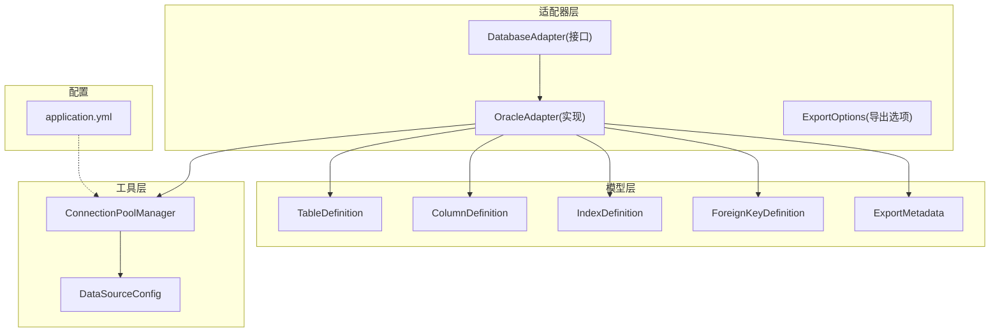
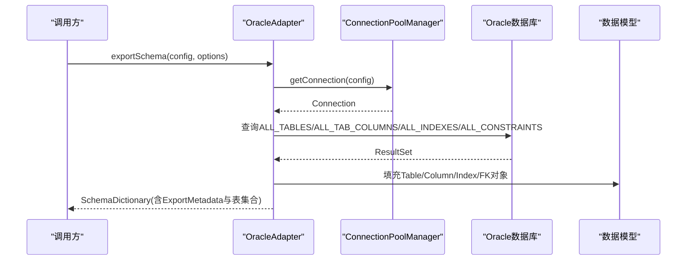
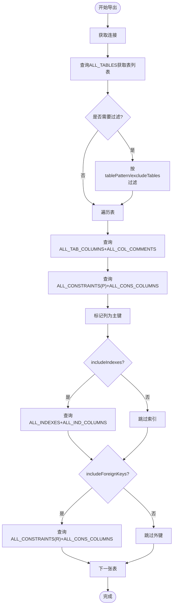
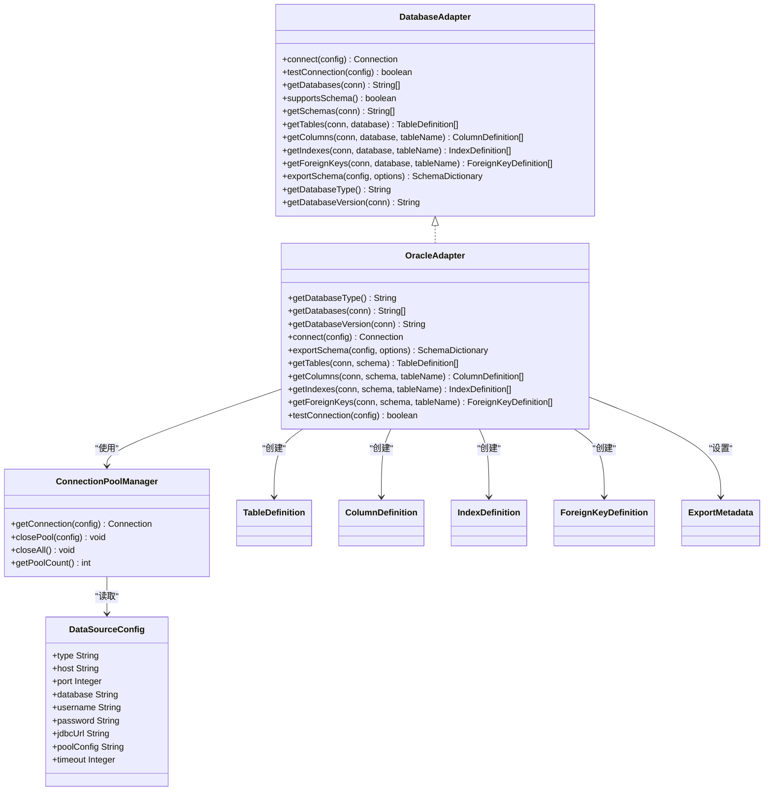

# Oracle适配器实现

<cite>
**本文引用的文件列表**
- [OracleAdapter.java](file://schemasync-backend/src/main/java/com/schemasync/adapter/OracleAdapter.java)
- [DatabaseAdapter.java](file://schemasync-backend/src/main/java/com/schemasync/adapter/DatabaseAdapter.java)
- [ExportOptions.java](file://schemasync-backend/src/main/java/com/schemasync/adapter/ExportOptions.java)
- [ConnectionPoolManager.java](file://schemasync-backend/src/main/java/com/schemasync/util/ConnectionPoolManager.java)
- [DataSourceConfig.java](file://schemasync-backend/src/main/java/com/schemasync/model/config/DataSourceConfig.java)
- [TableDefinition.java](file://schemasync-backend/src/main/java/com/schemasync/model/dict/TableDefinition.java)
- [ColumnDefinition.java](file://schemasync-backend/src/main/java/com/schemasync/model/dict/ColumnDefinition.java)
- [IndexDefinition.java](file://schemasync-backend/src/main/java/com/schemasync/model/dict/IndexDefinition.java)
- [ForeignKeyDefinition.java](file://schemasync-backend/src/main/java/com/schemasync/model/dict/ForeignKeyDefinition.java)
- [ExportMetadata.java](file://schemasync-backend/src/main/java/com/schemasync/model/dict/ExportMetadata.java)
- [application.yml](file://schemasync-backend/src/main/resources/application.yml)
</cite>

## 目录
1. [简介](#简介)
2. [项目结构](#项目结构)
3. [核心组件](#核心组件)
4. [架构总览](#架构总览)
5. [详细组件分析](#详细组件分析)
6. [依赖关系分析](#依赖关系分析)
7. [性能考量](#性能考量)
8. [故障排查指南](#故障排查指南)
9. [结论](#结论)
10. [附录](#附录)

## 简介
本文件聚焦于Oracle数据库适配器的技术实现，围绕其基于数据字典视图的元数据查询、数据类型映射、SCHEMA层级支持机制、与标准SQL的差异处理（大小写敏感性、约束命名规范等）、连接参数配置、性能调优建议以及常见问题解决方案展开。文档旨在帮助开发者正确、高效地使用Oracle适配器进行数据字典导出与差异分析。

## 项目结构
本项目采用分层与模块化组织方式：
- adapter层：提供各数据库类型的适配器实现，OracleAdapter为Oracle专用实现
- model层：定义数据字典模型（表、字段、索引、外键、导出元数据等）
- util层：连接池管理与工具类
- resources：应用配置文件

图表来源
- [OracleAdapter.java:1-381](file://schemasync-backend/src/main/java/com/schemasync/adapter/OracleAdapter.java#L1-L381)
- [DatabaseAdapter.java:1-134](file://schemasync-backend/src/main/java/com/schemasync/adapter/DatabaseAdapter.java#L1-L134)
- [ConnectionPoolManager.java:1-258](file://schemasync-backend/src/main/java/com/schemasync/util/ConnectionPoolManager.java#L1-L258)
- [DataSourceConfig.java:1-129](file://schemasync-backend/src/main/java/com/schemasync/model/config/DataSourceConfig.java#L1-L129)
- [TableDefinition.java:1-89](file://schemasync-backend/src/main/java/com/schemasync/model/dict/TableDefinition.java#L1-L89)
- [ColumnDefinition.java:1-116](file://schemasync-backend/src/main/java/com/schemasync/model/dict/ColumnDefinition.java#L1-L116)
- [IndexDefinition.java:1-49](file://schemasync-backend/src/main/java/com/schemasync/model/dict/IndexDefinition.java#L1-L49)
- [ForeignKeyDefinition.java:1-54](file://schemasync-backend/src/main/java/com/schemasync/model/dict/ForeignKeyDefinition.java#L1-L54)
- [ExportMetadata.java:1-59](file://schemasync-backend/src/main/java/com/schemasync/model/dict/ExportMetadata.java#L1-L59)
- [application.yml:1-83](file://schemasync-backend/src/main/resources/application.yml#L1-L83)

章节来源
- [OracleAdapter.java:1-381](file://schemasync-backend/src/main/java/com/schemasync/adapter/OracleAdapter.java#L1-L381)
- [DatabaseAdapter.java:1-134](file://schemasync-backend/src/main/java/com/schemasync/adapter/DatabaseAdapter.java#L1-L134)
- [ConnectionPoolManager.java:100-132](file://schemasync-backend/src/main/java/com/schemasync/util/ConnectionPoolManager.java#L100-L132)
- [application.yml:1-83](file://schemasync-backend/src/main/resources/application.yml#L1-L83)

## 核心组件
- OracleAdapter：实现Oracle特有的元数据导出逻辑，包括表、列、索引、外键、主键等；通过ALL_*数据字典视图获取信息；支持按模式过滤和排除表；记录导出进度与耗时。
- DatabaseAdapter：统一适配器接口，定义连接、测试、导出、版本获取等能力。
- ConnectionPoolManager：HikariCP连接池管理，负责JDBC URL构建、连接池创建与缓存、超时与自定义配置注入。
- 数据模型：TableDefinition、ColumnDefinition、IndexDefinition、ForeignKeyDefinition、ExportMetadata用于承载导出的数据字典。
- ExportOptions：导出选项，包含是否包含索引/外键、表名模式过滤、排除表列表等。

章节来源
- [OracleAdapter.java:98-177](file://schemasync-backend/src/main/java/com/schemasync/adapter/OracleAdapter.java#L98-L177)
- [DatabaseAdapter.java:17-133](file://schemasync-backend/src/main/java/com/schemasync/adapter/DatabaseAdapter.java#L17-L133)
- [ConnectionPoolManager.java:54-90](file://schemasync-backend/src/main/java/com/schemasync/util/ConnectionPoolManager.java#L54-L90)
- [ExportOptions.java:1-122](file://schemasync-backend/src/main/java/com/schemasync/adapter/ExportOptions.java#L1-L122)

## 架构总览
Oracle适配器在整体架构中的角色如下：
- 上层服务调用OracleAdapter.exportSchema(config, options)触发导出流程
- OracleAdapter使用ConnectionPoolManager建立连接并执行数据字典查询
- 查询结果映射到TableDefinition、ColumnDefinition、IndexDefinition、ForeignKeyDefinition等模型
- 最终返回SchemaDictionary（由框架组装），其中包含ExportMetadata与表集合

图表来源
- [OracleAdapter.java:98-177](file://schemasync-backend/src/main/java/com/schemasync/adapter/OracleAdapter.java#L98-L177)
- [ConnectionPoolManager.java:36-49](file://schemasync-backend/src/main/java/com/schemasync/util/ConnectionPoolManager.java#L36-L49)

## 详细组件分析

### OracleAdapter核心逻辑
- 数据库类型标识：getDatabaseType()返回“ORACLE”
- SCHEMA支持：getDatabases()通过ALL_USERS枚举用户作为SCHEMA；所有查询均限定OWNER=当前用户（config.getUsername()）
- 版本获取：getDatabaseVersion()从V$INSTANCE读取VERSION
- 连接：connect()委托给ConnectionPoolManager.getConnection()
- 导出流程：exportSchema()
  - 初始化SchemaDictionary与ExportMetadata
  - 获取表列表（ALL_TABLES + ALL_TAB_COMMENTS）
  - 可选按tablePattern正则过滤与excludeTables排除
  - 遍历表，依次获取列（ALL_TAB_COLUMNS + ALL_COL_COMMENTS）、索引（ALL_INDEXES + ALL_IND_COLUMNS）、外键（ALL_CONSTRAINTS + ALL_CONS_COLUMNS）
  - 记录进度与耗时日志
- 主键识别：getPrimaryKeys()通过ALL_CONSTRAINTS(CONSTRAINT_TYPE='P')与ALL_CONS_COLUMNS关联得到主键字段集，并在列级别标记isPrimaryKey
- 字符类型判断：isCharType()用于决定是否设置length属性（CHAR/VARCHAR/CLOB/NCHAR/NVARCHAR等）

图表来源
- [OracleAdapter.java:180-197](file://schemasync-backend/src/main/java/com/schemasync/adapter/OracleAdapter.java#L180-L197)
- [OracleAdapter.java:199-256](file://schemasync-backend/src/main/java/com/schemasync/adapter/OracleAdapter.java#L199-L256)
- [OracleAdapter.java:258-296](file://schemasync-backend/src/main/java/com/schemasync/adapter/OracleAdapter.java#L258-L296)
- [OracleAdapter.java:298-337](file://schemasync-backend/src/main/java/com/schemasync/adapter/OracleAdapter.java#L298-L337)
- [OracleAdapter.java:352-367](file://schemasync-backend/src/main/java/com/schemasync/adapter/OracleAdapter.java#L352-L367)
- [OracleAdapter.java:372-379](file://schemasync-backend/src/main/java/com/schemasync/adapter/OracleAdapter.java#L372-L379)

章节来源
- [OracleAdapter.java:64-96](file://schemasync-backend/src/main/java/com/schemasync/adapter/OracleAdapter.java#L64-L96)
- [OracleAdapter.java:98-177](file://schemasync-backend/src/main/java/com/schemasync/adapter/OracleAdapter.java#L98-L177)
- [OracleAdapter.java:180-197](file://schemasync-backend/src/main/java/com/schemasync/adapter/OracleAdapter.java#L180-L197)
- [OracleAdapter.java:199-256](file://schemasync-backend/src/main/java/com/schemasync/adapter/OracleAdapter.java#L199-L256)
- [OracleAdapter.java:258-296](file://schemasync-backend/src/main/java/com/schemasync/adapter/OracleAdapter.java#L258-L296)
- [OracleAdapter.java:298-337](file://schemasync-backend/src/main/java/com/schemasync/adapter/OracleAdapter.java#L298-L337)
- [OracleAdapter.java:352-367](file://schemasync-backend/src/main/java/com/schemasync/adapter/OracleAdapter.java#L352-L367)
- [OracleAdapter.java:372-379](file://schemasync-backend/src/main/java/com/schemasync/adapter/OracleAdapter.java#L372-L379)

### 数据字典查询与映射
- 表查询：ALL_TABLES + ALL_TAB_COMMENTS，按OWNER过滤，返回表名与注释
- 列查询：ALL_TAB_COLUMNS + ALL_COL_COMMENTS，按OWNER与TABLE_NAME过滤，返回列名、数据类型、长度、精度、小数位、可空性、默认值、顺序、注释；结合主键集合标记主键
- 索引查询：ALL_INDEXES + ALL_IND_COLUMNS，聚合列名为逗号分隔字符串，解析为List<String>
- 外键查询：ALL_CONSTRAINTS(CONSTRAINT_TYPE='R') + ALL_CONS_COLUMNS，获取约束名、字段、引用表与引用字段
- 主键查询：ALL_CONSTRAINTS(CONSTRAINT_TYPE='P') + ALL_CONS_COLUMNS，得到主键字段列表

章节来源
- [OracleAdapter.java:28-33](file://schemasync-backend/src/main/java/com/schemasync/adapter/OracleAdapter.java#L28-L33)
- [OracleAdapter.java:36-52](file://schemasync-backend/src/main/java/com/schemasync/adapter/OracleAdapter.java#L36-L52)
- [OracleAdapter.java:55-62](file://schemasync-backend/src/main/java/com/schemasync/adapter/OracleAdapter.java#L55-L62)
- [OracleAdapter.java:262-272](file://schemasync-backend/src/main/java/com/schemasync/adapter/OracleAdapter.java#L262-L272)
- [OracleAdapter.java:302-318](file://schemasync-backend/src/main/java/com/schemasync/adapter/OracleAdapter.java#L302-L318)

### 数据类型映射与长度/精度处理
- 长度设置：仅当数据类型为字符类型时设置length（CHAR/VARCHAR/CLOB/NCHAR/NVARCHAR等）
- 精度与小数位：从DATA_PRECISION与DATA_SCALE读取，非空则设置precision与scale
- 可空性与默认值：NULLABLE为'Y'表示允许NULL；DATA_DEFAULT非空则设置默认值
- 主键标记：根据主键字段集合将对应列的isPrimaryKey设为true
- 位置顺序：COLUMN_ID作为ordinalPosition

章节来源
- [OracleAdapter.java:215-248](file://schemasync-backend/src/main/java/com/schemasync/adapter/OracleAdapter.java#L215-L248)
- [ColumnDefinition.java:18-70](file://schemasync-backend/src/main/java/com/schemasync/model/dict/ColumnDefinition.java#L18-L70)

### SCHEMA层级支持机制
- getDatabases()通过ALL_USERS枚举用户名作为SCHEMA列表
- 所有元数据查询均以OWNER=当前用户（config.getUsername()）进行限定，确保只导出当前用户的对象
- 注意：当前实现未提供独立的getSchemas()覆盖，但可通过getDatabases()获得可用SCHEMA

章节来源
- [OracleAdapter.java:70-80](file://schemasync-backend/src/main/java/com/schemasync/adapter/OracleAdapter.java#L70-L80)
- [DatabaseAdapter.java:46-63](file://schemasync-backend/src/main/java/com/schemasync/adapter/DatabaseAdapter.java#L46-L63)

### 与标准SQL的差异处理
- 大小写敏感性：Oracle默认以大写存储未加引号的标识符；适配器在查询时将schema.toUpperCase()传入，保证匹配一致性
- 约束命名规范：通过CONSTRAINT_TYPE区分主键('P')、外键('R')等；索引唯一性通过UNIQUENESS字段判断
- 序列与触发器：当前适配器未直接查询序列与触发器；如需扩展可在后续版本增加对ALL_SEQUENCES与ALL_TRIGGERS的查询
- PL/SQL对象处理：当前适配器不导出PL/SQL对象；若需要，可扩展查询ALL_OBJECTS并按OBJECT_TYPE过滤

章节来源
- [OracleAdapter.java:184-185](file://schemasync-backend/src/main/java/com/schemasync/adapter/OracleAdapter.java#L184-L185)
- [OracleAdapter.java:283](file://schemasync-backend/src/main/java/com/schemasync/adapter/OracleAdapter.java#L283)
- [OracleAdapter.java:352-367](file://schemasync-backend/src/main/java/com/schemasync/adapter/OracleAdapter.java#L352-L367)

### 连接参数配置与兼容性
- JDBC URL构建：当type为ORACLE时，使用jdbc:oracle:thin:@host:port:sid格式
- 自定义URL：DataSourceConfig.jdbcUrl可覆盖自动生成的URL，便于高级参数配置
- 连接池参数：HikariCP默认最大连接数10、最小空闲2、连接超时取config.timeout秒、idleTimeout与maxLifetime分别为10分钟与30分钟；支持通过poolConfig(JSON)动态覆盖
- 全局配置：application.yml中定义了日志、Actuator、Swagger等通用配置

章节来源
- [ConnectionPoolManager.java:117-121](file://schemasync-backend/src/main/java/com/schemasync/util/ConnectionPoolManager.java#L117-L121)
- [ConnectionPoolManager.java:70-88](file://schemasync-backend/src/main/java/com/schemasync/util/ConnectionPoolManager.java#L70-L88)
- [DataSourceConfig.java:69-79](file://schemasync-backend/src/main/java/com/schemasync/model/config/DataSourceConfig.java#L69-L79)
- [application.yml:1-83](file://schemasync-backend/src/main/resources/application.yml#L1-L83)

### 使用场景示例（步骤说明）
- 准备数据源配置：设置type=ORACLE、host/port/database、username/password，必要时提供jdbcUrl与poolConfig
- 调用导出：构造ExportOptions（指定database/schema、tablePattern、excludeTables、includeIndexes/includeForeignKeys），调用OracleAdapter.exportSchema(config, options)
- 查看结果：返回的SchemaDictionary中包含ExportMetadata与表集合，可用于后续生成DDL或对比差异

章节来源
- [ExportOptions.java:11-68](file://schemasync-backend/src/main/java/com/schemasync/adapter/ExportOptions.java#L11-L68)
- [OracleAdapter.java:98-177](file://schemasync-backend/src/main/java/com/schemasync/adapter/OracleAdapter.java#L98-L177)

## 依赖关系分析
- OracleAdapter依赖：
  - DatabaseAdapter接口（实现其方法）
  - ConnectionPoolManager（获取连接）
  - 数据模型（TableDefinition、ColumnDefinition、IndexDefinition、ForeignKeyDefinition、ExportMetadata）
  - DataSourceConfig（连接参数）
- ConnectionPoolManager依赖：
  - HikariCP（连接池）
  - DataSourceConfig（JDBC URL与池参数）

图表来源
- [DatabaseAdapter.java:17-133](file://schemasync-backend/src/main/java/com/schemasync/adapter/DatabaseAdapter.java#L17-L133)
- [OracleAdapter.java:23-381](file://schemasync-backend/src/main/java/com/schemasync/adapter/OracleAdapter.java#L23-L381)
- [ConnectionPoolManager.java:20-258](file://schemasync-backend/src/main/java/com/schemasync/util/ConnectionPoolManager.java#L20-L258)
- [DataSourceConfig.java:13-129](file://schemasync-backend/src/main/java/com/schemasync/model/config/DataSourceConfig.java#L13-L129)
- [TableDefinition.java:14-89](file://schemasync-backend/src/main/java/com/schemasync/model/dict/TableDefinition.java#L14-L89)
- [ColumnDefinition.java:9-116](file://schemasync-backend/src/main/java/com/schemasync/model/dict/ColumnDefinition.java#L9-L116)
- [IndexDefinition.java:11-49](file://schemasync-backend/src/main/java/com/schemasync/model/dict/IndexDefinition.java#L11-L49)
- [ForeignKeyDefinition.java:9-54](file://schemasync-backend/src/main/java/com/schemasync/model/dict/ForeignKeyDefinition.java#L9-L54)
- [ExportMetadata.java:13-59](file://schemasync-backend/src/main/java/com/schemasync/model/dict/ExportMetadata.java#L13-L59)

章节来源
- [OracleAdapter.java:23-381](file://schemasync-backend/src/main/java/com/schemasync/adapter/OracleAdapter.java#L23-L381)
- [ConnectionPoolManager.java:20-258](file://schemasync-backend/src/main/java/com/schemasync/util/ConnectionPoolManager.java#L20-L258)

## 性能考量
- 批量导出优化：
  - 使用PreparedStatement减少重复解析开销
  - 仅在需要时查询索引与外键（includeIndexes/includeForeignKeys）
  - 每10张表输出一次进度日志，避免频繁I/O
- 连接池调优：
  - 根据并发需求调整maximumPoolSize与minimumIdle
  - 合理设置connectionTimeout、idleTimeout、maxLifetime
  - 对于大库导出，可适当增大连接池上限以减少等待时间
- 查询优化：
  - 利用ALL_*视图的索引与统计信息，确保OWNER与TABLE_NAME条件命中
  - 避免不必要的JOIN与函数计算，保持查询简洁

[本节为通用指导，无需特定文件来源]

## 故障排查指南
- 连接失败：
  - 检查type是否为ORACLE，host/port/database是否正确
  - 确认用户名具备访问ALL_*视图的权限
  - 如使用自定义JDBC URL，验证参数语法与网络可达性
- 无表或表为空：
  - 确认当前用户拥有目标对象的SELECT权限
  - 检查schema.toUpperCase()是否与对象实际所有者一致
- 索引/外键缺失：
  - 确认includeIndexes/includeForeignKeys已启用
  - 检查ALL_INDEXES/ALL_CONSTRAINTS中是否存在相应记录
- 连接池问题：
  - 观察日志中“创建数据库连接池”与“关闭数据库连接池”的输出
  - 通过getPoolCount()监控活跃连接池数量

章节来源
- [ConnectionPoolManager.java:54-90](file://schemasync-backend/src/main/java/com/schemasync/util/ConnectionPoolManager.java#L54-L90)
- [ConnectionPoolManager.java:221-249](file://schemasync-backend/src/main/java/com/schemasync/util/ConnectionPoolManager.java#L221-L249)
- [OracleAdapter.java:340-347](file://schemasync-backend/src/main/java/com/schemasync/adapter/OracleAdapter.java#L340-L347)

## 结论
Oracle适配器通过ALL_*数据字典视图实现了完整的表、列、索引、外键与主键元数据导出，具备SCHEMA层级支持与灵活的导出选项。其连接池管理与JDBC URL构建提供了良好的兼容性与可配置性。针对大型库导出，建议合理配置连接池与查询选项以获得更佳性能。未来可扩展对序列、触发器与PL/SQL对象的导出能力，以满足更全面的元数据同步需求。

[本节为总结，无需特定文件来源]

## 附录
- 关键查询路径参考：
  - 表列表：[OracleAdapter.java:28-33](file://schemasync-backend/src/main/java/com/schemasync/adapter/OracleAdapter.java#L28-L33)
  - 列信息：[OracleAdapter.java:36-52](file://schemasync-backend/src/main/java/com/schemasync/adapter/OracleAdapter.java#L36-L52)
  - 主键字段：[OracleAdapter.java:55-62](file://schemasync-backend/src/main/java/com/schemasync/adapter/OracleAdapter.java#L55-L62)
  - 索引信息：[OracleAdapter.java:262-272](file://schemasync-backend/src/main/java/com/schemasync/adapter/OracleAdapter.java#L262-L272)
  - 外键信息：[OracleAdapter.java:302-318](file://schemasync-backend/src/main/java/com/schemasync/adapter/OracleAdapter.java#L302-L318)
- 连接与配置：
  - JDBC URL构建（ORACLE）：[ConnectionPoolManager.java:117-121](file://schemasync-backend/src/main/java/com/schemasync/util/ConnectionPoolManager.java#L117-L121)
  - 连接池基础配置：[ConnectionPoolManager.java:70-88](file://schemasync-backend/src/main/java/com/schemasync/util/ConnectionPoolManager.java#L70-L88)
  - 自定义JDBC URL与池配置字段：[DataSourceConfig.java:69-79](file://schemasync-backend/src/main/java/com/schemasync/model/config/DataSourceConfig.java#L69-L79)