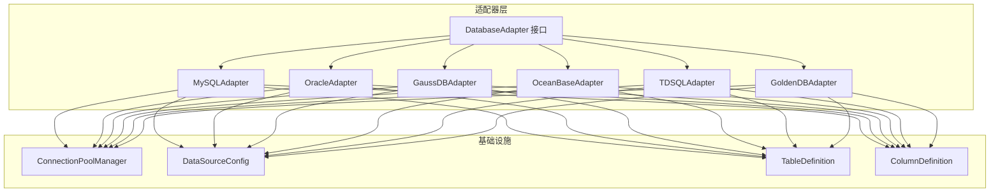
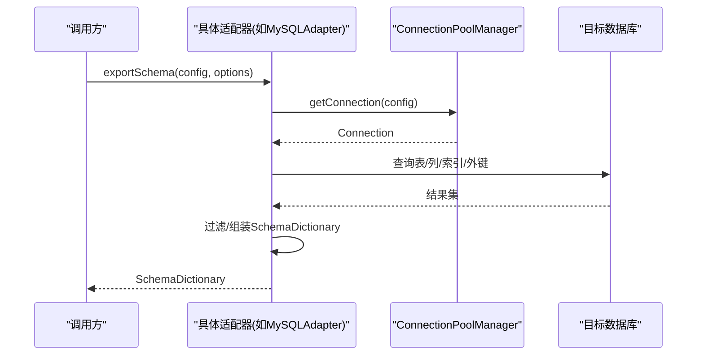
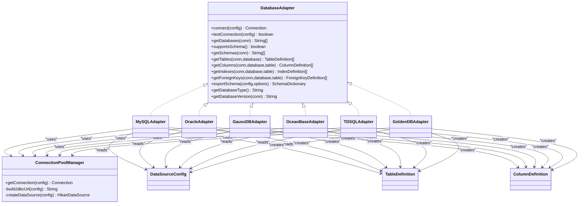

# 数据库适配器实现

<cite>
**本文引用的文件**   
- [DatabaseAdapter.java](file://schemasync-backend/src/main/java/com/schemasync/adapter/DatabaseAdapter.java)
- [MySQLAdapter.java](file://schemasync-backend/src/main/java/com/schemasync/adapter/MySQLAdapter.java)
- [OracleAdapter.java](file://schemasync-backend/src/main/java/com/schemasync/adapter/OracleAdapter.java)
- [GaussDBAdapter.java](file://schemasync-backend/src/main/java/com/schemasync/adapter/GaussDBAdapter.java)
- [OceanBaseAdapter.java](file://schemasync-backend/src/main/java/com/schemasync/adapter/OceanBaseAdapter.java)
- [GoldenDBAdapter.java](file://schemasync-backend/src/main/java/com/schemasync/adapter/GoldenDBAdapter.java)
- [TDSQLAdapter.java](file://schemasync-backend/src/main/java/com/schemasync/adapter/TDSQLAdapter.java)
- [ConnectionPoolManager.java](file://schemasync-backend/src/main/java/com/schemasync/util/ConnectionPoolManager.java)
- [DataSourceConfig.java](file://schemasync-backend/src/main/java/com/schemasync/model/config/DataSourceConfig.java)
- [TableDefinition.java](file://schemasync-backend/src/main/java/com/schemasync/model/dict/TableDefinition.java)
- [ColumnDefinition.java](file://schemasync-backend/src/main/java/com/schemasync/model/dict/ColumnDefinition.java)
- [application.yml](file://schemasync-backend/src/main/resources/application.yml)
</cite>

## 更新摘要
**所做更改**   
- 更新了 GaussDB PostgreSQL 模式实现的详细文档，包括完整的表创建语法和 PostgreSQL 数据类型转换支持
- 新增了约束处理和 COMMENT ON TABLE/COLUMN 语法支持的详细说明
- 完善了数据类型映射规则，涵盖 VARCHAR、TEXT、INTEGER、BIGINT、REAL、DOUBLE PRECISION、NUMERIC、TIMESTAMP、DATE、BYTEA、BOOLEAN、JSONB 等类型
- 增强了元数据查询语句差异的说明，特别是 PostgreSQL 系统表的联合查询

## 目录
1. [引言](#引言)
2. [项目结构](#项目结构)
3. [核心组件](#核心组件)
4. [架构总览](#架构总览)
5. [详细组件分析](#详细组件分析)
6. [依赖关系分析](#依赖关系分析)
7. [性能与连接池调优](#性能与连接池调优)
8. [故障处理与排障指南](#故障处理与排障指南)
9. [结论](#结论)
10. [附录：使用场景与配置示例](#附录使用场景与配置示例)

## 引言
本文件聚焦于 SchemaSync 后端的"数据库适配器"实现，系统性梳理 MySQL、Oracle、GaussDB（PostgreSQL 协议）、以及 OceanBase/TDSQL/GoldenDB（MySQL 兼容模式）的适配差异。文档覆盖元数据查询语句差异、数据类型映射规则、SCHEMA 层级支持情况、连接参数配置、性能优化策略、连接池调优与故障处理机制，并提供面向开发者的使用场景与配置示例，帮助快速理解不同数据库的特性差异与适配要点。

**更新** 本次更新重点完善了 GaussDB PostgreSQL 模式的实现细节，包括完整的数据类型转换、约束处理和注释语法支持。

## 项目结构
后端采用"接口 + 多实现"的适配器模式，统一对外暴露导出元数据的 API；底层通过连接池管理器统一管理连接池生命周期与 JDBC URL 构建；模型层提供统一的表/字段/索引/外键定义对象，屏蔽各数据库差异。

图表来源
- [DatabaseAdapter.java:1-134](file://schemasync-backend/src/main/java/com/schemasync/adapter/DatabaseAdapter.java#L1-L134)
- [MySQLAdapter.java:1-367](file://schemasync-backend/src/main/java/com/schemasync/adapter/MySQLAdapter.java#L1-L367)
- [OracleAdapter.java:1-381](file://schemasync-backend/src/main/java/com/schemasync/adapter/OracleAdapter.java#L1-L381)
- [GaussDBAdapter.java:1-550](file://schemasync-backend/src/main/java/com/schemasync/adapter/GaussDBAdapter.java#L1-L550)
- [OceanBaseAdapter.java:1-316](file://schemasync-backend/src/main/java/com/schemasync/adapter/OceanBaseAdapter.java#L1-L316)
- [GoldenDBAdapter.java:1-312](file://schemasync-backend/src/main/java/com/schemasync/adapter/GoldenDBAdapter.java#L1-L312)
- [TDSQLAdapter.java:1-311](file://schemasync-backend/src/main/java/com/schemasync/adapter/TDSQLAdapter.java#L1-L311)
- [ConnectionPoolManager.java:1-258](file://schemasync-backend/src/main/java/com/schemasync/util/ConnectionPoolManager.java#L1-L258)
- [DataSourceConfig.java:1-129](file://schemasync-backend/src/main/java/com/schemasync/model/config/DataSourceConfig.java#L1-L129)
- [TableDefinition.java:1-89](file://schemasync-backend/src/main/java/com/schemasync/model/dict/TableDefinition.java#L1-L89)
- [ColumnDefinition.java:1-116](file://schemasync-backend/src/main/java/com/schemasync/model/dict/ColumnDefinition.java#L1-L116)

章节来源
- [DatabaseAdapter.java:1-134](file://schemasync-backend/src/main/java/com/schemasync/adapter/DatabaseAdapter.java#L1-L134)
- [ConnectionPoolManager.java:1-258](file://schemasync-backend/src/main/java/com/schemasync/util/ConnectionPoolManager.java#L1-L258)
- [DataSourceConfig.java:1-129](file://schemasync-backend/src/main/java/com/schemasync/model/config/DataSourceConfig.java#L1-L129)

## 核心组件
- 适配器接口 DatabaseAdapter：定义连接、测试、获取数据库/SCHEMA、表/列/索引/外键、导出完整字典等能力。
- 具体适配器实现：MySQL、Oracle、GaussDB、OceanBase、TDSQL、GoldenDB。
- 连接池管理器 ConnectionPoolManager：按数据源维度缓存 Hikari 连接池，负责 JDBC URL 构建、超时与池化参数设置。
- 数据源配置 DataSourceConfig：包含类型、主机、端口、库名、用户名、密码、字符集、超时、自定义 JDBC URL、连接池 JSON 配置等。
- 元数据模型 TableDefinition/ColumnDefinition：统一表示表与字段信息，屏蔽底层差异。

章节来源
- [DatabaseAdapter.java:1-134](file://schemasync-backend/src/main/java/com/schemasync/adapter/DatabaseAdapter.java#L1-L134)
- [ConnectionPoolManager.java:1-258](file://schemasync-backend/src/main/java/com/schemasync/util/ConnectionPoolManager.java#L1-L258)
- [DataSourceConfig.java:1-129](file://schemasync-backend/src/main/java/com/schemasync/model/config/DataSourceConfig.java#L1-L129)
- [TableDefinition.java:1-89](file://schemasync-backend/src/main/java/com/schemasync/model/dict/TableDefinition.java#L1-L89)
- [ColumnDefinition.java:1-116](file://schemasync-backend/src/main/java/com/schemasync/model/dict/ColumnDefinition.java#L1-L116)

## 架构总览
整体流程：上层调用 exportSchema(config, options)，由对应适配器完成连接、元数据读取、过滤与组装，返回统一的数据字典对象。连接池在 ConnectionPoolManager 中按数据源 key 缓存，避免重复创建。

图表来源
- [MySQLAdapter.java:225-303](file://schemasync-backend/src/main/java/com/schemasync/adapter/MySQLAdapter.java#L225-L303)
- [ConnectionPoolManager.java:36-49](file://schemasync-backend/src/main/java/com/schemasync/util/ConnectionPoolManager.java#L36-L49)

## 详细组件分析

### 通用接口与工厂
- DatabaseAdapter 定义了跨数据库的统一能力边界，包括 supportsSchema() 默认 false，getSchemas() 默认抛出异常，便于子类按需扩展。
- 工厂类负责扫描所有实现并注册到 Map，根据 getDatabaseType() 返回的类型进行分发。

章节来源
- [DatabaseAdapter.java:1-134](file://schemasync-backend/src/main/java/com/schemasync/adapter/DatabaseAdapter.java#L1-L134)

### MySQL 适配器
- 协议与驱动：基于 MySQL 原生协议，JDBC URL 以 jdbc:mysql 开头，默认开启 useUnicode=true、characterEncoding=utf8、serverTimezone=Asia/Shanghai。
- 元数据查询：
  - 表：INFORMATION_SCHEMA.TABLES，按 TABLE_SCHEMA 过滤。
  - 列：INFORMATION_SCHEMA.COLUMNS，含长度、精度、小数位、可空、默认值、主键标记、自增标记、字符集、顺序。
  - 索引：INFORMATION_SCHEMA.STATISTICS，GROUP_CONCAT 聚合列名。
  - 外键：INFORMATION_SCHEMA.KEY_COLUMN_USAGE，仅取外键约束。
- SCHEMA 支持：不支持 SCHEMA 层级，getDatabases 返回数据库列表。
- 版本获取：SELECT VERSION()。
- 连接池：复用 ConnectionPoolManager 的 MySQL URL 构建逻辑。
- 性能优化：
  - 使用 PreparedStatement 预编译 SQL。
  - 大字段长度使用 Long 接收，避免溢出。
  - 可选启用索引/外键导出以减少 IO。
  - 进度日志便于定位慢点。

章节来源
- [MySQLAdapter.java:28-57](file://schemasync-backend/src/main/java/com/schemasync/adapter/MySQLAdapter.java#L28-L57)
- [MySQLAdapter.java:74-87](file://schemasync-backend/src/main/java/com/schemasync/adapter/MySQLAdapter.java#L74-L87)
- [MySQLAdapter.java:90-121](file://schemasync-backend/src/main/java/com/schemasync/adapter/MySQLAdapter.java#L90-L121)
- [MySQLAdapter.java:124-169](file://schemasync-backend/src/main/java/com/schemasync/adapter/MySQLAdapter.java#L124-L169)
- [MySQLAdapter.java:172-198](file://schemasync-backend/src/main/java/com/schemasync/adapter/MySQLAdapter.java#L172-L198)
- [MySQLAdapter.java:201-222](file://schemasync-backend/src/main/java/com/schemasync/adapter/MySQLAdapter.java#L201-L222)
- [MySQLAdapter.java:311-319](file://schemasync-backend/src/main/java/com/schemasync/adapter/MySQLAdapter.java#L311-L319)
- [ConnectionPoolManager.java:103-132](file://schemasync-backend/src/main/java/com/schemasync/util/ConnectionPoolManager.java#L103-L132)

### Oracle 适配器
- 协议与驱动：使用 Oracle Thin 驱动，JDBC URL 为 jdbc:oracle:thin:@host:port:sid。
- 元数据查询：
  - 表：ALL_TABLES 与 ALL_TAB_COMMENTS 关联，按 OWNER 过滤。
  - 列：ALL_TAB_COLUMNS 与 ALL_COL_COMMENTS 关联，含长度、精度、小数位、可空、默认值、顺序。
  - 主键：ALL_CONSTRAINTS + ALL_CONS_COLUMNS，约束类型为 P。
  - 索引：ALL_INDEXES + ALL_IND_COLUMNS，LISTAGG 聚合列名。
  - 外键：ALL_CONSTRAINTS 自连接，约束类型为 R。
- SCHEMA 支持：Oracle 以用户作为 Schema 边界，getDatabases 返回当前用户可见的所有用户名（即 Schema）。
- 版本获取：V$INSTANCE.VERSION。
- 数据类型映射：
  - 字符类型判断 isCharType 包含 CHAR/VARCHAR/CLOB/NCHAR/NVARCHAR 等。
  - 主键通过额外查询标注 ColumnDefinition.isPrimaryKey。
- 性能优化：
  - 使用 LISTAGG 减少应用层拼接开销。
  - 对字符类型长度单独判断，避免数值类型误用长度字段。

章节来源
- [OracleAdapter.java:28-62](file://schemasync-backend/src/main/java/com/schemasync/adapter/OracleAdapter.java#L28-L62)
- [OracleAdapter.java:70-91](file://schemasync-backend/src/main/java/com/schemasync/adapter/OracleAdapter.java#L70-L91)
- [OracleAdapter.java:180-197](file://schemasync-backend/src/main/java/com/schemasync/adapter/OracleAdapter.java#L180-L197)
- [OracleAdapter.java:200-256](file://schemasync-backend/src/main/java/com/schemasync/adapter/OracleAdapter.java#L200-L256)
- [OracleAdapter.java:259-296](file://schemasync-backend/src/main/java/com/schemasync/adapter/OracleAdapter.java#L259-L296)
- [OracleAdapter.java:299-337](file://schemasync-backend/src/main/java/com/schemasync/adapter/OracleAdapter.java#L299-L337)
- [OracleAdapter.java:352-379](file://schemasync-backend/src/main/java/com/schemasync/adapter/OracleAdapter.java#L352-L379)
- [ConnectionPoolManager.java:117-121](file://schemasync-backend/src/main/java/com/schemasync/util/ConnectionPoolManager.java#L117-L121)

### GaussDB 适配器（PostgreSQL 协议）

**更新** 本次更新大幅完善了 GaussDB PostgreSQL 模式的实现细节，包括完整的数据类型转换、约束处理和注释语法支持。

- 协议与驱动：兼容 PostgreSQL 协议，JDBC URL 为 jdbc:postgresql://host:port/db，关闭 SSL 要求以提升兼容性。
- 元数据查询：
  - 表：information_schema.tables，结合 obj_description 获取注释。
  - 列：pg_attribute/pg_class/pg_type/pg_namespace 等系统表联合查询，pg_get_expr 获取默认值，col_description 获取注释，主键通过 pg_constraint 识别。
  - 索引：pg_index + pg_class + pg_attribute，array_to_string 聚合列名。
  - 外键：information_schema.table_constraints + key_column_usage + constraint_column_usage。
- SCHEMA 支持：supportsSchema() 返回 true，提供 getSchemas() 从 pg_namespace 获取非系统 schema，若为空则回退 public。
- 版本获取：VERSION() 前缀标识为 GaussDB。
- **数据类型映射与转换**：
  - convertToStandardTypeName 将内部类型名标准化为常见 DDL 类型名，支持完整的 PostgreSQL 类型映射：
    - 字符串类型：varchar、char、bpchar → varchar/char/nvarchar2
    - 整数类型：int2/int4/int8 → smallint/integer/bigint
    - 浮点类型：float4/float8 → real/double precision
    - 布尔类型：bool → boolean
    - 时间类型：timestamp/timestamptz/timetz → timestamp/time with time zone
    - 数值类型：numeric/decimal/number → numeric/number
    - 文本类型：text → text
    - 二进制类型：bytea → bytea
    - JSON 类型：json/jsonb → json/jsonb
    - 其他类型：uuid/xml/inet/macaddr/cidr 等
  - parseTypeLengthAndPrecision 从 format_type 解析括号内参数，区分 numeric/decimal/number 与 varchar/char/nvarchar2/bpchar 等，并对异常大值做安全限制。
- **约束处理**：
  - 主键约束：通过 pg_constraint 的 contype = 'p' 识别主键约束
  - 非空约束：通过 pg_attribute.attnotnull 判断
  - 默认值：通过 pg_attrdef.adbin 获取表达式
  - 注释支持：obj_description 获取表注释，col_description 获取列注释
- **COMMENT ON 语法支持**：
  - 表注释：obj_description((t.table_schema || '.' || t.table_name)::regclass, 'pg_class')
  - 列注释：col_description(a.attrelid, a.attnum)
- 性能优化：
  - 优先使用 information_schema 提升兼容性。
  - 对超长精度/长度进行阈值保护，避免异常值导致下游问题。
  - 自动检测 schema，降低配置复杂度。

**新增** 完整的 PostgreSQL 数据类型转换支持，涵盖所有常用类型的标准 DDL 映射。

**Section sources**
- [GaussDBAdapter.java:30-90](file://schemasync-backend/src/main/java/com/schemasync/adapter/GaussDBAdapter.java#L30-L90)
- [GaussDBAdapter.java:98-148](file://schemasync-backend/src/main/java/com/schemasync/adapter/GaussDBAdapter.java#L98-L148)
- [GaussDBAdapter.java:151-159](file://schemasync-backend/src/main/java/com/schemasync/adapter/GaussDBAdapter.java#L151-L159)
- [GaussDBAdapter.java:270-287](file://schemasync-backend/src/main/java/com/schemasync/adapter/GaussDBAdapter.java#L270-287)
- [GaussDBAdapter.java:323-366](file://schemasync-backend/src/main/java/com/schemasync/adapter/GaussDBAdapter.java#L323-L366)
- [GaussDBAdapter.java:372-429](file://schemasync-backend/src/main/java/com/schemasync/adapter/GaussDBAdapter.java#L372-L429)
- [GaussDBAdapter.java:434-497](file://schemasync-backend/src/main/java/com/schemasync/adapter/GaussDBAdapter.java#L434-L497)
- [ConnectionPoolManager.java:122-128](file://schemasync-backend/src/main/java/com/schemasync/util/ConnectionPoolManager.java#L122-L128)

### OceanBase / TDSQL / GoldenDB（MySQL 兼容模式）
- 协议与驱动：均兼容 MySQL 协议，JDBC URL 同 MySQL，字符编码 utf8，时区 Asia/Shanghai。
- 元数据查询：与 MySQL 一致，使用 INFORMATION_SCHEMA 的 TABLES/COLUMNS/STATISTICS/KEY_COLUMN_USAGE。
- SCHEMA 支持：不支持 SCHEMA 层级，getDatabases 返回数据库列表。
- 版本获取：SELECT VERSION() 前缀标识各自产品名。
- 差异点：
  - OceanBase 排除 oceanbase 系统库。
  - GoldenDB 排除 goldendb 系统库。
  - TDSQL 排除 sys 系统库。
- 性能优化：与 MySQL 相同，使用预编译、Long 接收大字段、可选导出索引/外键。

章节来源
- [OceanBaseAdapter.java:29-53](file://schemasync-backend/src/main/java/com/schemasync/adapter/OceanBaseAdapter.java#L29-L53)
- [OceanBaseAdapter.java:61-78](file://schemasync-backend/src/main/java/com/schemasync/adapter/OceanBaseAdapter.java#L61-L78)
- [GoldenDBAdapter.java:29-53](file://schemasync-backend/src/main/java/com/schemasync/adapter/GoldenDBAdapter.java#L29-L53)
- [GoldenDBAdapter.java:61-78](file://schemasync-backend/src/main/java/com/schemasync/adapter/GoldenDBAdapter.java#L61-L78)
- [TDSQLAdapter.java:29-53](file://schemasync-backend/src/main/java/com/schemasync/adapter/TDSQLAdapter.java#L29-L53)
- [TDSQLAdapter.java:61-77](file://schemasync-backend/src/main/java/com/schemasync/adapter/TDSQLAdapter.java#L61-L77)
- [ConnectionPoolManager.java:107-116](file://schemasync-backend/src/main/java/com/schemasync/util/ConnectionPoolManager.java#L107-L116)

### 连接池与 URL 构建
- 连接池缓存：按 type:host:port:database:username 生成唯一 key，ConcurrentHashMap 管理 HikariDataSource。
- URL 构建：
  - MySQL/OceanBase/TDSQL/GoldenDB：jdbc:mysql，开启 useUnicode=true、characterEncoding=utf8、serverTimezone=Asia/Shanghai、allowPublicKeyRetrieval=true。
  - Oracle：jdbc:oracle:thin:@host:port:sid。
  - **GaussDB**：jdbc:postgresql，sslmode=disable，loggerLevel=OFF。
- 池化参数：默认最大池大小 10、最小空闲 2、连接超时取自配置、idleTimeout 10 分钟、maxLifetime 30 分钟；支持通过 poolConfig JSON 动态覆盖。

**更新** 完善了 GaussDB 的 PostgreSQL 协议 URL 构建，添加了 sslmode=disable 和 loggerLevel=OFF 参数以提升兼容性。

章节来源
- [ConnectionPoolManager.java:36-90](file://schemasync-backend/src/main/java/com/schemasync/util/ConnectionPoolManager.java#L36-L90)
- [ConnectionPoolManager.java:103-132](file://schemasync-backend/src/main/java/com/schemasync/util/ConnectionPoolManager.java#L103-L132)
- [ConnectionPoolManager.java:146-186](file://schemasync-backend/src/main/java/com/schemasync/util/ConnectionPoolManager.java#L146-L186)
- [DataSourceConfig.java:68-79](file://schemasync-backend/src/main/java/com/schemasync/model/config/DataSourceConfig.java#L68-L79)

## 依赖关系分析
- 适配器依赖 ConnectionPoolManager 获取连接，依赖模型对象封装元数据。
- 连接池管理器依赖 HikariCP，不直接依赖 Spring 容器，保持轻量。
- 适配器之间无相互依赖，耦合度低，易于扩展新数据库类型。

图表来源
- [DatabaseAdapter.java:1-134](file://schemasync-backend/src/main/java/com/schemasync/adapter/DatabaseAdapter.java#L1-L134)
- [MySQLAdapter.java:1-367](file://schemasync-backend/src/main/java/com/schemasync/adapter/MySQLAdapter.java#L1-L367)
- [OracleAdapter.java:1-381](file://schemasync-backend/src/main/java/com/schemasync/adapter/OracleAdapter.java#L1-L381)
- [GaussDBAdapter.java:1-550](file://schemasync-backend/src/main/java/com/schemasync/adapter/GaussDBAdapter.java#L1-L550)
- [OceanBaseAdapter.java:1-316](file://schemasync-backend/src/main/java/com/schemasync/adapter/OceanBaseAdapter.java#L1-L316)
- [GoldenDBAdapter.java:1-312](file://schemasync-backend/src/main/java/com/schemasync/adapter/GoldenDBAdapter.java#L1-L312)
- [TDSQLAdapter.java:1-311](file://schemasync-backend/src/main/java/com/schemasync/adapter/TDSQLAdapter.java#L1-L311)
- [ConnectionPoolManager.java:1-258](file://schemasync-backend/src/main/java/com/schemasync/util/ConnectionPoolManager.java#L1-L258)
- [DataSourceConfig.java:1-129](file://schemasync-backend/src/main/java/com/schemasync/model/config/DataSourceConfig.java#L1-L129)
- [TableDefinition.java:1-89](file://schemasync-backend/src/main/java/com/schemasync/model/dict/TableDefinition.java#L1-L89)
- [ColumnDefinition.java:1-116](file://schemasync-backend/src/main/java/com/schemasync/model/dict/ColumnDefinition.java#L1-L116)

## 性能与连接池调优
- 连接池参数建议：
  - maximumPoolSize：根据并发导出任务数与数据库承载能力调整，默认 10。
  - minimumIdle：保持一定空闲连接，减少冷启动延迟，默认 2。
  - connectionTimeout：网络或鉴权较慢时可适当增大，默认 30 秒。
  - idleTimeout/maxLifetime：控制连接回收与存活时间，避免长期占用。
- 自定义池配置：通过 DataSourceConfig.poolConfig 传入 JSON 覆盖默认值，例如 {"maximumPoolSize":20,"minimumIdle":5}。
- 查询优化：
  - 使用预编译语句，避免重复解析。
  - 选择性导出索引/外键，减少 I/O。
  - 对大字段使用 Long 接收，避免截断。
  - Oracle 使用 LISTAGG 聚合，减少应用层字符串拼接。
  - **GaussDB** 对超长精度/长度做阈值保护，防止异常值影响后续处理。

**更新** 强调了 GaussDB 适配器对超长精度/长度的阈值保护机制，确保在处理异常大的数值时不会导致下游问题。

章节来源
- [ConnectionPoolManager.java:54-90](file://schemasync-backend/src/main/java/com/schemasync/util/ConnectionPoolManager.java#L54-L90)
- [ConnectionPoolManager.java:146-186](file://schemasync-backend/src/main/java/com/schemasync/util/ConnectionPoolManager.java#L146-L186)
- [MySQLAdapter.java:124-169](file://schemasync-backend/src/main/java/com/schemasync/adapter/MySQLAdapter.java#L124-L169)
- [OracleAdapter.java:259-296](file://schemasync-backend/src/main/java/com/schemasync/adapter/OracleAdapter.java#L259-L296)
- [GaussDBAdapter.java:372-429](file://schemasync-backend/src/main/java/com/schemasync/adapter/GaussDBAdapter.java#L372-L429)

## 故障处理与排障指南
- 连接失败：
  - 检查 host/port/database/username/password 是否正确。
  - 确认防火墙与安全组放行端口。
  - Oracle 需确保 SID 正确；**GaussDB** 需确认 PostgreSQL 兼容端口。
- 权限不足：
  - Oracle 需要访问 ALL_* 视图的权限。
  - **GaussDB** 需要访问 information_schema 与相关系统表的权限。
- 字符集与时区：
  - MySQL 系列默认 utf8 与 Asia/Shanghai，必要时通过自定义 JDBC URL 覆盖。
- 连接池耗尽：
  - 观察日志中的连接创建与关闭记录，适当提高 maximumPoolSize。
  - 检查是否存在未释放的连接（应使用 try-with-resources）。
- 元数据缺失：
  - 某些分布式数据库可能部分 INFORMATION_SCHEMA 字段不完整，可考虑降级策略或跳过该特性。

**更新** 补充了 GaussDB 的权限要求和 PostgreSQL 端口配置注意事项。

章节来源
- [ConnectionPoolManager.java:36-49](file://schemasync-backend/src/main/java/com/schemasync/util/ConnectionPoolManager.java#L36-L49)
- [OracleAdapter.java:70-91](file://schemasync-backend/src/main/java/com/schemasync/adapter/OracleAdapter.java#L70-L91)
- [GaussDBAdapter.java:103-118](file://schemasync-backend/src/main/java/com/schemasync/adapter/GaussDBAdapter.java#L103-L118)

## 结论
本项目通过统一的 DatabaseAdapter 接口与 ConnectionPoolManager 实现了多数据库元数据导出的可扩展架构。MySQL 系列与 Oracle、GaussDB 在元数据查询、SCHEMA 语义、类型映射上存在显著差异，但通过适配器隔离，上层无需感知细节。连接池与 URL 构建集中管理，提升了稳定性与可维护性。建议在大规模导出场景中合理调优连接池参数，并结合业务需求选择性导出索引/外键，以获得更佳性能。

**更新** 本次更新特别强化了 GaussDB PostgreSQL 模式的实现，提供了完整的数据类型转换支持和约束处理能力，使其能够更好地兼容 PostgreSQL 生态系统的各种特性。

## 附录：使用场景与配置示例

### 典型使用场景
- 跨库迁移前的结构比对：分别导出源库与目标库的 SchemaDictionary，再进行差异分析。
- 合规审计：定期导出生产库的结构快照，留存审计证据。
- 文档自动化：将导出的字典转换为 Excel/JSON，自动生成数据库设计文档。

### 配置要点与示例
- 数据源配置（DataSourceConfig）关键字段：
  - type：mysql/oracle/oceanbase/tdsql/goldendb/**gaussdb**
  - host/port/database/username/password
  - charset：utf8mb4（MySQL 系列推荐）
  - timeout：连接超时秒数
  - jdbcUrl：可选，用于高级参数覆盖
  - poolConfig：可选，JSON 格式覆盖连接池参数
- 全局配置（application.yml）：
  - schemasync.max-pool-size/min-idle/connection-timeout/max-lifetime 可作为默认值参考。

**更新** 新增了 gaussdb 作为支持的数据库类型选项。

章节来源
- [DataSourceConfig.java:26-79](file://schemasync-backend/src/main/java/com/schemasync/model/config/DataSourceConfig.java#L26-L79)
- [application.yml:51-61](file://schemasync-backend/src/main/resources/application.yml#L51-L61)