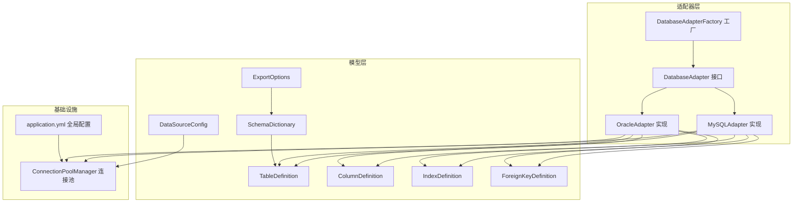
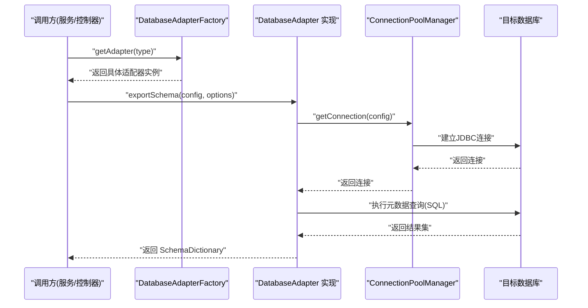
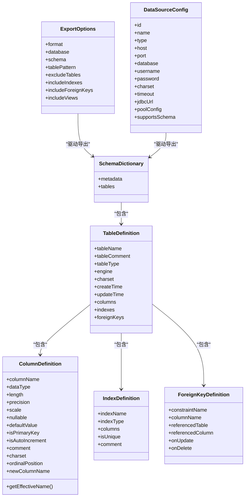
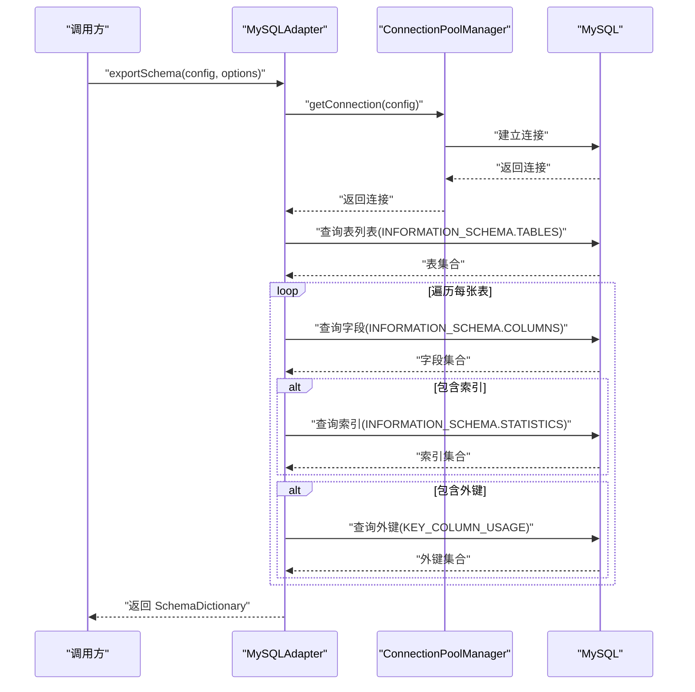
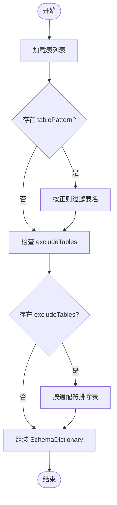
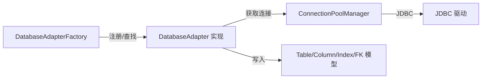

# 新数据库接入指南

<cite>
**本文引用的文件**
- [DatabaseAdapter.java](file://schemasync-backend/src/main/java/com/schemasync/adapter/DatabaseAdapter.java)
- [DatabaseAdapterFactory.java](file://schemasync-backend/src/main/java/com/schemasync/adapter/DatabaseAdapterFactory.java)
- [MySQLAdapter.java](file://schemasync-backend/src/main/java/com/schemasync/adapter/MySQLAdapter.java)
- [OracleAdapter.java](file://schemasync-backend/src/main/java/com/schemasync/adapter/OracleAdapter.java)
- [ExportOptions.java](file://schemasync-backend/src/main/java/com/schemasync/adapter/ExportOptions.java)
- [DataSourceConfig.java](file://schemasync-backend/src/main/java/com/schemasync/model/config/DataSourceConfig.java)
- [TableDefinition.java](file://schemasync-backend/src/main/java/com/schemasync/model/dict/TableDefinition.java)
- [ColumnDefinition.java](file://schemasync-backend/src/main/java/com/schemasync/model/dict/ColumnDefinition.java)
- [IndexDefinition.java](file://schemasync-backend/src/main/java/com/schemasync/model/dict/IndexDefinition.java)
- [ForeignKeyDefinition.java](file://schemasync-backend/src/main/java/com/schemasync/model/dict/ForeignKeyDefinition.java)
- [SchemaDictionary.java](file://schemasync-backend/src/main/java/com/schemasync/model/dict/SchemaDictionary.java)
- [ConnectionPoolManager.java](file://schemasync-backend/src/main/java/com/schemasync/util/ConnectionPoolManager.java)
- [application.yml](file://schemasync-backend/src/main/resources/application.yml)
- [README.md](file://README.md)
- [DataSourceConnectionIntegrationTest.java](file://schemasync-backend/src/test/java/com/schemasync/service/DataSourceConnectionIntegrationTest.java)
</cite>

## 目录
1. [简介](#简介)
2. [项目结构](#项目结构)
3. [核心组件](#核心组件)
4. [架构总览](#架构总览)
5. [详细组件分析](#详细组件分析)
6. [依赖关系分析](#依赖关系分析)
7. [性能与连接池配置](#性能与连接池配置)
8. [单元测试与调试](#单元测试与调试)
9. [常见问题与排障](#常见问题与排障)
10. [结论](#结论)
11. [附录：实现清单与最佳实践](#附录实现清单与最佳实践)

## 简介
本指南面向需要为 SchemaSync 新增数据库适配器的开发者，提供从零开始的完整步骤与规范。内容涵盖接口契约、元数据查询语句编写、数据类型映射规则、业务逻辑适配、连接与超时、字符集与事务支持、注册与依赖管理、版本兼容性考虑，以及测试与调试方法。读者可据此快速完成一个新数据库的接入并稳定运行。

## 项目结构
本项目采用分层与策略模式组织代码：
- adapter 层定义统一适配器接口并提供多种数据库实现
- model 层定义导出模型（表、字段、索引、外键等）
- util 层提供连接池管理与工具类
- service/controller/generator/differ/formatter 等模块消费适配器能力

图表来源
- [DatabaseAdapter.java:1-134](file://schemasync-backend/src/main/java/com/schemasync/adapter/DatabaseAdapter.java#L1-L134)
- [DatabaseAdapterFactory.java:1-64](file://schemasync-backend/src/main/java/com/schemasync/adapter/DatabaseAdapterFactory.java#L1-L64)
- [MySQLAdapter.java:1-367](file://schemasync-backend/src/main/java/com/schemasync/adapter/MySQLAdapter.java#L1-L367)
- [OracleAdapter.java:1-381](file://schemasync-backend/src/main/java/com/schemasync/adapter/OracleAdapter.java#L1-L381)
- [ConnectionPoolManager.java:1-258](file://schemasync-backend/src/main/java/com/schemasync/util/ConnectionPoolManager.java#L1-L258)
- [TableDefinition.java:1-89](file://schemasync-backend/src/main/java/com/schemasync/model/dict/TableDefinition.java#L1-L89)
- [ColumnDefinition.java:1-116](file://schemasync-backend/src/main/java/com/schemasync/model/dict/ColumnDefinition.java#L1-L116)
- [IndexDefinition.java:1-49](file://schemasync-backend/src/main/java/com/schemasync/model/dict/IndexDefinition.java#L1-L49)
- [ForeignKeyDefinition.java:1-54](file://schemasync-backend/src/main/java/com/schemasync/model/dict/ForeignKeyDefinition.java#L1-L54)
- [SchemaDictionary.java:1-28](file://schemasync-backend/src/main/java/com/schemasync/model/dict/SchemaDictionary.java#L1-L28)
- [ExportOptions.java:1-122](file://schemasync-backend/src/main/java/com/schemasync/adapter/ExportOptions.java#L1-L122)
- [DataSourceConfig.java:1-129](file://schemasync-backend/src/main/java/com/schemasync/model/config/DataSourceConfig.java#L1-L129)
- [application.yml:1-83](file://schemasync-backend/src/main/resources/application.yml#L1-L83)

章节来源
- [README.md:1-239](file://README.md#L1-L239)

## 核心组件
- DatabaseAdapter 接口：定义所有数据库适配器必须实现的统一契约，包括连接、元数据查询、导出、类型与版本获取等。
- 具体适配器实现：以 MySQLAdapter 和 OracleAdapter 为代表，展示不同数据库的元数据查询差异与特性处理。
- DatabaseAdapterFactory：基于 Spring 自动发现所有实现并注册，按 getDatabaseType() 返回的类型进行查找。
- 连接池 ConnectionPoolManager：统一管理 HikariCP 连接池，支持自定义 JDBC URL、超时、连接池参数等。
- 导出模型：SchemaDictionary、TableDefinition、ColumnDefinition、IndexDefinition、ForeignKeyDefinition、ExportOptions、DataSourceConfig。

章节来源
- [DatabaseAdapter.java:1-134](file://schemasync-backend/src/main/java/com/schemasync/adapter/DatabaseAdapter.java#L1-L134)
- [DatabaseAdapterFactory.java:1-64](file://schemasync-backend/src/main/java/com/schemasync/adapter/DatabaseAdapterFactory.java#L1-L64)
- [MySQLAdapter.java:1-367](file://schemasync-backend/src/main/java/com/schemasync/adapter/MySQLAdapter.java#L1-L367)
- [OracleAdapter.java:1-381](file://schemasync-backend/src/main/java/com/schemasync/adapter/OracleAdapter.java#L1-L381)
- [ConnectionPoolManager.java:1-258](file://schemasync-backend/src/main/java/com/schemasync/util/ConnectionPoolManager.java#L1-L258)
- [TableDefinition.java:1-89](file://schemasync-backend/src/main/java/com/schemasync/model/dict/TableDefinition.java#L1-L89)
- [ColumnDefinition.java:1-116](file://schemasync-backend/src/main/java/com/schemasync/model/dict/ColumnDefinition.java#L1-L116)
- [IndexDefinition.java:1-49](file://schemasync-backend/src/main/java/com/schemasync/model/dict/IndexDefinition.java#L1-L49)
- [ForeignKeyDefinition.java:1-54](file://schemasync-backend/src/main/java/com/schemasync/model/dict/ForeignKeyDefinition.java#L1-L54)
- [SchemaDictionary.java:1-28](file://schemasync-backend/src/main/java/com/schemasync/model/dict/SchemaDictionary.java#L1-L28)
- [ExportOptions.java:1-122](file://schemasync-backend/src/main/java/com/schemasync/adapter/ExportOptions.java#L1-L122)
- [DataSourceConfig.java:1-129](file://schemasync-backend/src/main/java/com/schemasync/model/config/DataSourceConfig.java#L1-L129)

## 架构总览
下图展示了从调用方到适配器再到连接池与目标数据库的整体流程。

图表来源
- [DatabaseAdapterFactory.java:1-64](file://schemasync-backend/src/main/java/com/schemasync/adapter/DatabaseAdapterFactory.java#L1-L64)
- [DatabaseAdapter.java:1-134](file://schemasync-backend/src/main/java/com/schemasync/adapter/DatabaseAdapter.java#L1-L134)
- [ConnectionPoolManager.java:1-258](file://schemasync-backend/src/main/java/com/schemasync/util/ConnectionPoolManager.java#L1-L258)
- [MySQLAdapter.java:1-367](file://schemasync-backend/src/main/java/com/schemasync/adapter/MySQLAdapter.java#L1-L367)
- [OracleAdapter.java:1-381](file://schemasync-backend/src/main/java/com/schemasync/adapter/OracleAdapter.java#L1-L381)

## 详细组件分析

### 接口契约：DatabaseAdapter
- 连接与测试
  - connect(DataSourceConfig): 通过连接池获取连接
  - testConnection(DataSourceConfig): 尝试获取连接并判断是否可用
- 库/Schema 列表
  - getDatabases(Connection): 列出数据库或Schema（由具体实现决定语义）
  - supportsSchema()/getSchemas(): 可选扩展，用于支持 Schema 层级
- 元数据查询
  - getTables/getColumns/getIndexes/getForeignKeys: 分别返回表、字段、索引、外键定义
- 导出与识别
  - exportSchema(DataSourceConfig, ExportOptions): 组装完整数据字典
  - getDatabaseType(): 返回大写类型标识，供工厂注册与匹配
  - getDatabaseVersion(Connection): 返回数据库版本字符串

章节来源
- [DatabaseAdapter.java:1-134](file://schemasync-backend/src/main/java/com/schemasync/adapter/DatabaseAdapter.java#L1-L134)

### 工厂与注册：DatabaseAdapterFactory
- 使用 Spring 注入 List<DatabaseAdapter>，在 @PostConstruct 中遍历注册
- 根据 getDatabaseType().toUpperCase() 作为 key 缓存适配器
- 提供 getSupportedTypes() 暴露已支持的类型集合

章节来源
- [DatabaseAdapterFactory.java:1-64](file://schemasync-backend/src/main/java/com/schemasync/adapter/DatabaseAdapterFactory.java#L1-L64)

### 连接池：ConnectionPoolManager
- 连接池缓存：以 type:host:port:database:username 作为 key
- 构建 JDBC URL：
  - 若 DataSourceConfig 提供了 jdbcUrl，则优先使用
  - 否则根据 type 自动生成默认 URL（含字符集、时区、SSL 等参数）
- 连接池参数：
  - 默认最大池大小、最小空闲、连接超时、空闲超时、最大生命周期
  - 支持通过 poolConfig(JSON) 覆盖关键参数
- 关闭与统计：提供 closePool/closeAll/getPoolCount

章节来源
- [ConnectionPoolManager.java:1-258](file://schemasync-backend/src/main/java/com/schemasync/util/ConnectionPoolManager.java#L1-L258)
- [DataSourceConfig.java:1-129](file://schemasync-backend/src/main/java/com/schemasync/model/config/DataSourceConfig.java#L1-L129)

### 适配器实现要点：MySQLAdapter
- 元数据查询
  - 表：INFORMATION_SCHEMA.TABLES
  - 字段：INFORMATION_SCHEMA.COLUMNS
  - 索引：INFORMATION_SCHEMA.STATISTICS + GROUP_CONCAT
  - 外键：INFORMATION_SCHEMA.KEY_COLUMN_USAGE
- 导出流程
  - 连接 -> 获取表列表 -> 可选过滤 -> 逐表填充字段/索引/外键 -> 组装 SchemaDictionary
- 类型与长度
  - 使用 Long 承载长度/精度/小数位，兼容大文本类型
- 字符集与时区
  - 默认拼接 useUnicode=true&characterEncoding=utf8&serverTimezone=Asia/Shanghai
- 系统库过滤
  - 排除 information_schema/mysql/performance_schema/sys

章节来源
- [MySQLAdapter.java:1-367](file://schemasync-backend/src/main/java/com/schemasync/adapter/MySQLAdapter.java#L1-L367)

### 适配器实现要点：OracleAdapter
- 元数据查询
  - 表：ALL_TABLES + ALL_TAB_COMMENTS
  - 字段：ALL_TAB_COLUMNS + ALL_COL_COMMENTS
  - 主键：ALL_CONSTRAINTS + ALL_CONS_COLUMNS (约束类型 'P')
  - 索引：ALL_INDEXES + ALL_IND_COLUMNS + LISTAGG
  - 外键：ALL_CONSTRAINTS 自关联 + ALL_CONS_COLUMNS
- 类型与长度
  - 仅对字符类型设置 length；数值型使用 precision/scale
- Schema 语义
  - 以用户/Schema 作为“数据库”维度，getDatabases 返回当前用户可见的所有用户名

章节来源
- [OracleAdapter.java:1-381](file://schemasync-backend/src/main/java/com/schemasync/adapter/OracleAdapter.java#L1-L381)

### 数据模型关系

图表来源
- [SchemaDictionary.java:1-28](file://schemasync-backend/src/main/java/com/schemasync/model/dict/SchemaDictionary.java#L1-L28)
- [TableDefinition.java:1-89](file://schemasync-backend/src/main/java/com/schemasync/model/dict/TableDefinition.java#L1-L89)
- [ColumnDefinition.java:1-116](file://schemasync-backend/src/main/java/com/schemasync/model/dict/ColumnDefinition.java#L1-L116)
- [IndexDefinition.java:1-49](file://schemasync-backend/src/main/java/com/schemasync/model/dict/IndexDefinition.java#L1-L49)
- [ForeignKeyDefinition.java:1-54](file://schemasync-backend/src/main/java/com/schemasync/model/dict/ForeignKeyDefinition.java#L1-L54)
- [ExportOptions.java:1-122](file://schemasync-backend/src/main/java/com/schemasync/adapter/ExportOptions.java#L1-L122)
- [DataSourceConfig.java:1-129](file://schemasync-backend/src/main/java/com/schemasync/model/config/DataSourceConfig.java#L1-L129)

### 导出流程时序（以 MySQL 为例）

图表来源
- [MySQLAdapter.java:1-367](file://schemasync-backend/src/main/java/com/schemasync/adapter/MySQLAdapter.java#L1-L367)
- [ConnectionPoolManager.java:1-258](file://schemasync-backend/src/main/java/com/schemasync/util/ConnectionPoolManager.java#L1-L258)

### 复杂逻辑流程图：表过滤与排除

图表来源
- [MySQLAdapter.java:1-367](file://schemasync-backend/src/main/java/com/schemasync/adapter/MySQLAdapter.java#L1-L367)

## 依赖关系分析
- 适配器与工厂
  - 工厂通过 Spring 注入所有 DatabaseAdapter 实现，并按类型注册
- 适配器与连接池
  - 各适配器通过 ConnectionPoolManager 获取连接，避免重复创建连接池
- 适配器与模型
  - 适配器将数据库元数据映射到统一的模型对象，供上层服务消费
- 外部依赖
  - HikariCP 连接池、JDBC 驱动（由 DataSourceConfig.type 决定）

图表来源
- [DatabaseAdapterFactory.java:1-64](file://schemasync-backend/src/main/java/com/schemasync/adapter/DatabaseAdapterFactory.java#L1-L64)
- [ConnectionPoolManager.java:1-258](file://schemasync-backend/src/main/java/com/schemasync/util/ConnectionPoolManager.java#L1-L258)
- [TableDefinition.java:1-89](file://schemasync-backend/src/main/java/com/schemasync/model/dict/TableDefinition.java#L1-L89)
- [ColumnDefinition.java:1-116](file://schemasync-backend/src/main/java/com/schemasync/model/dict/ColumnDefinition.java#L1-L116)
- [IndexDefinition.java:1-49](file://schemasync-backend/src/main/java/com/schemasync/model/dict/IndexDefinition.java#L1-L49)
- [ForeignKeyDefinition.java:1-54](file://schemasync-backend/src/main/java/com/schemasync/model/dict/ForeignKeyDefinition.java#L1-L54)

章节来源
- [README.md:1-239](file://README.md#L1-L239)

## 性能与连接池配置
- 连接池默认值
  - maximumPoolSize/minIdle/connectionTimeout/idleTimeout/maxLifetime 均有合理默认
- 自定义连接池参数
  - 通过 DataSourceConfig.poolConfig(JSON) 覆盖关键参数
- 连接超时
  - 可通过 DataSourceConfig.timeout 控制连接超时秒数
- 日志与监控
  - application.yml 中 root 与 com.schemasync 级别便于定位问题

章节来源
- [ConnectionPoolManager.java:1-258](file://schemasync-backend/src/main/java/com/schemasync/util/ConnectionPoolManager.java#L1-L258)
- [application.yml:1-83](file://schemasync-backend/src/main/resources/application.yml#L1-L83)

## 单元测试与调试
- 集成测试示例
  - 动态读取配置、遍历数据源、测试连接、校验密码加密状态、验证支持的数据库类型
- 建议的测试用例
  - 连接成功/失败路径
  - 元数据查询空结果/异常场景
  - 过滤与排除逻辑边界
  - 字符集与时区影响
  - 连接池参数覆盖行为
- 调试技巧
  - 开启 DEBUG 日志，关注连接建立与 SQL 执行耗时
  - 针对特定数据库，打印元数据查询结果样例，确认字段映射正确性

章节来源
- [DataSourceConnectionIntegrationTest.java:1-296](file://schemasync-backend/src/test/java/com/schemasync/service/DataSourceConnectionIntegrationTest.java#L1-L296)
- [application.yml:1-83](file://schemasync-backend/src/main/resources/application.yml#L1-L83)

## 常见问题与排障
- 无法连接
  - 检查 host/port/database/username/password 是否正确
  - 确认防火墙/白名单/SSL 要求
  - 查看连接池日志与异常堆栈
- 字符集乱码
  - 确保 JDBC URL 包含 characterEncoding 参数
  - 核对数据库与表的字符集配置
- 元数据缺失
  - 确认用户具备 INFORMATION_SCHEMA/ALL_* 视图访问权限
  - 核对表名大小写与 schema 限定
- 性能问题
  - 调整连接池大小与超时
  - 减少不必要的索引/外键导出
  - 使用 tablePattern/excludeTables 缩小范围

[本节为通用指导，不直接分析具体文件]

## 结论
通过实现 DatabaseAdapter 接口、遵循统一的模型约定、利用工厂自动注册与连接池管理，即可快速接入新的数据库。重点在于：准确的元数据查询、稳健的类型映射、合理的连接与超时配置、完善的测试与日志。

[本节为总结性内容，不直接分析具体文件]

## 附录：实现清单与最佳实践

### 从零实现新适配器的步骤
1. 新建适配器类
   - 实现 DatabaseAdapter 接口
   - 标注为 Spring 组件以便被工厂扫描注册
   - 实现 getDatabaseType() 返回唯一的大写类型标识
2. 实现连接与测试
   - connect 委托给 ConnectionPoolManager.getConnection(config)
   - testConnection 捕获异常并返回布尔结果
3. 实现元数据查询
   - getTables/getColumns/getIndexes/getForeignKeys
   - 针对不同数据库编写对应的元数据 SQL
   - 将结果映射到 TableDefinition/ColumnDefinition/IndexDefinition/ForeignKeyDefinition
4. 实现导出
   - exportSchema 组装 SchemaDictionary，支持 includeIndexes/includeForeignKeys/includeViews 等选项
   - 支持 tablePattern/excludeTables 过滤
5. 字符集与时区
   - 若未提供 jdbcUrl，确保 buildJdbcUrl 中包含必要的字符集与时区参数
6. 连接池与超时
   - 通过 DataSourceConfig.timeout/poolConfig 控制连接池行为
7. 注册与依赖
   - 无需手动注册，Spring 会自动发现并注册
   - 确保 JDBC 驱动依赖存在于项目中
8. 版本兼容性
   - 针对不同版本差异，可在适配器内做分支判断或提示
9. 单元测试
   - 参考现有集成测试，覆盖连接、元数据、过滤、异常路径
10. 文档与日志
    - 记录关键 SQL 与耗时，便于后续优化与排障

章节来源
- [DatabaseAdapter.java:1-134](file://schemasync-backend/src/main/java/com/schemasync/adapter/DatabaseAdapter.java#L1-L134)
- [DatabaseAdapterFactory.java:1-64](file://schemasync-backend/src/main/java/com/schemasync/adapter/DatabaseAdapterFactory.java#L1-L64)
- [MySQLAdapter.java:1-367](file://schemasync-backend/src/main/java/com/schemasync/adapter/MySQLAdapter.java#L1-L367)
- [OracleAdapter.java:1-381](file://schemasync-backend/src/main/java/com/schemasync/adapter/OracleAdapter.java#L1-L381)
- [ConnectionPoolManager.java:1-258](file://schemasync-backend/src/main/java/com/schemasync/util/ConnectionPoolManager.java#L1-L258)
- [DataSourceConfig.java:1-129](file://schemasync-backend/src/main/java/com/schemasync/model/config/DataSourceConfig.java#L1-L129)
- [ExportOptions.java:1-122](file://schemasync-backend/src/main/java/com/schemasync/adapter/ExportOptions.java#L1-L122)
- [SchemaDictionary.java:1-28](file://schemasync-backend/src/main/java/com/schemasync/model/dict/SchemaDictionary.java#L1-L28)
- [TableDefinition.java:1-89](file://schemasync-backend/src/main/java/com/schemasync/model/dict/TableDefinition.java#L1-L89)
- [ColumnDefinition.java:1-116](file://schemasync-backend/src/main/java/com/schemasync/model/dict/ColumnDefinition.java#L1-L116)
- [IndexDefinition.java:1-49](file://schemasync-backend/src/main/java/com/schemasync/model/dict/IndexDefinition.java#L1-L49)
- [ForeignKeyDefinition.java:1-54](file://schemasync-backend/src/main/java/com/schemasync/model/dict/ForeignKeyDefinition.java#L1-L54)
- [DataSourceConnectionIntegrationTest.java:1-296](file://schemasync-backend/src/test/java/com/schemasync/service/DataSourceConnectionIntegrationTest.java#L1-L296)