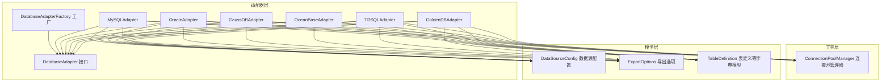
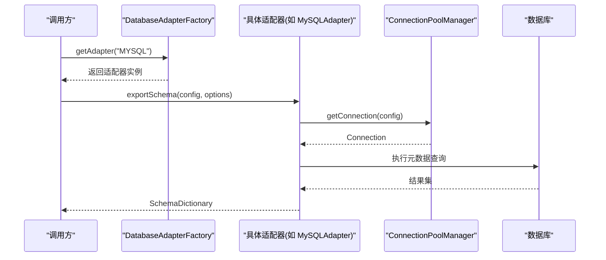
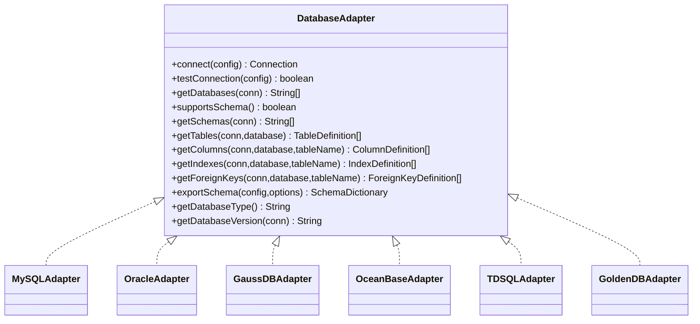
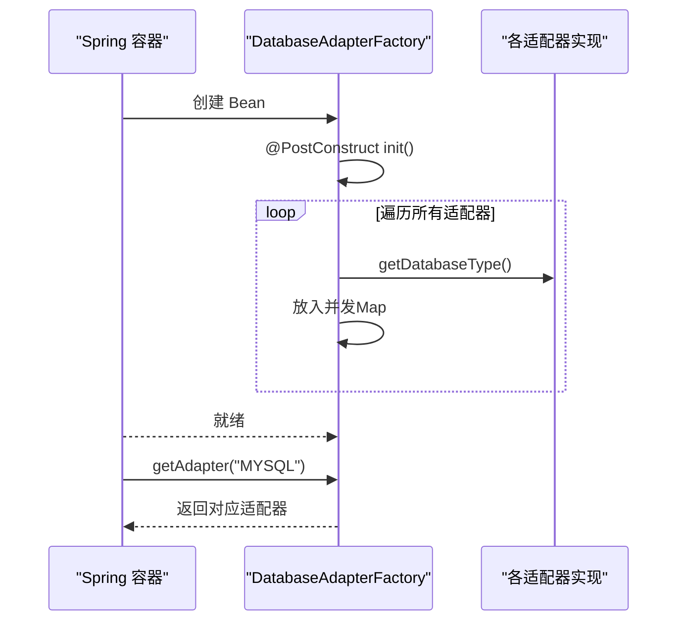
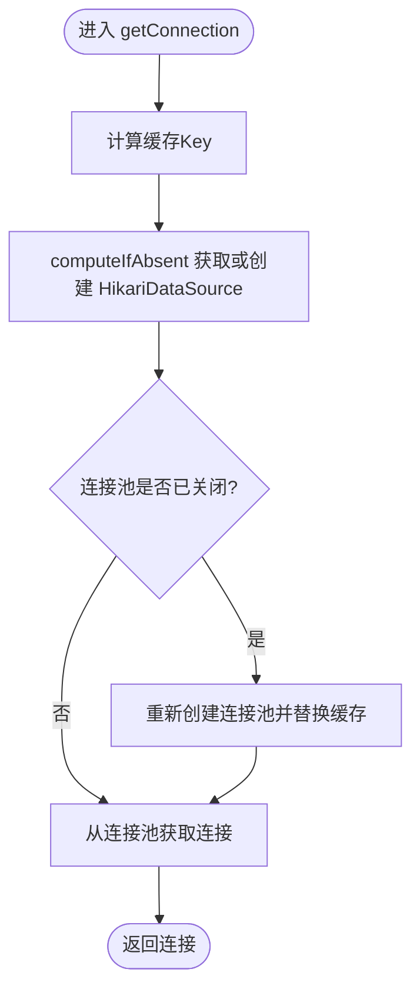
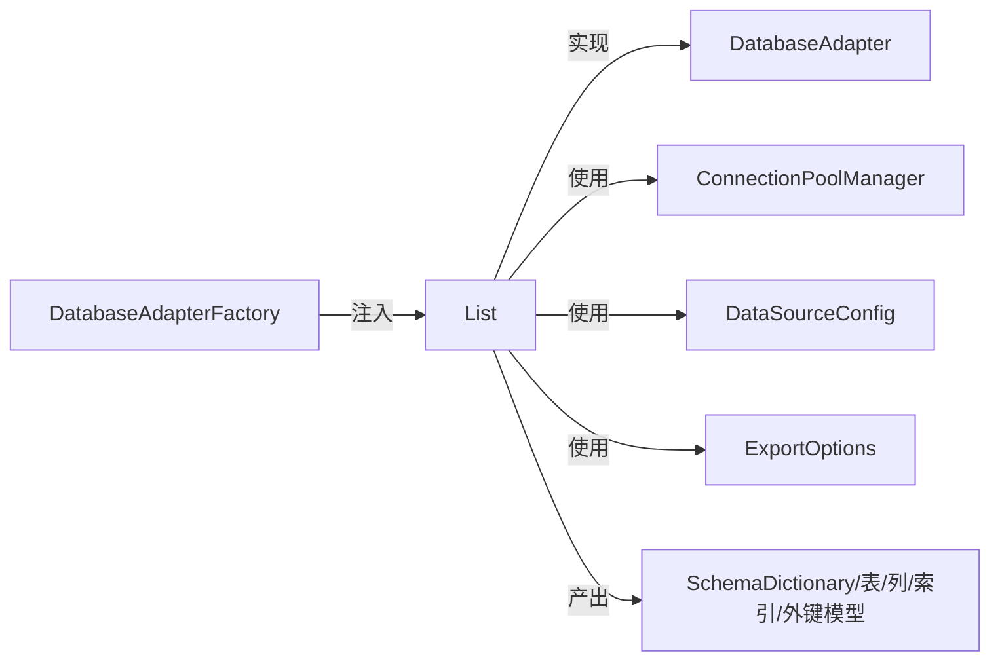

# 适配器架构设计

<cite>
**本文引用的文件列表**
- [DatabaseAdapter.java](file://schemasync-backend/src/main/java/com/schemasync/adapter/DatabaseAdapter.java)
- [DatabaseAdapterFactory.java](file://schemasync-backend/src/main/java/com/schemasync/adapter/DatabaseAdapterFactory.java)
- [MySQLAdapter.java](file://schemasync-backend/src/main/java/com/schemasync/adapter/MySQLAdapter.java)
- [OracleAdapter.java](file://schemasync-backend/src/main/java/com/schemasync/adapter/OracleAdapter.java)
- [GaussDBAdapter.java](file://schemasync-backend/src/main/java/com/schemasync/adapter/GaussDBAdapter.java)
- [OceanBaseAdapter.java](file://schemasync-backend/src/main/java/com/schemasync/adapter/OceanBaseAdapter.java)
- [TDSQLAdapter.java](file://schemasync-backend/src/main/java/com/schemasync/adapter/TDSQLAdapter.java)
- [GoldenDBAdapter.java](file://schemasync-backend/src/main/java/com/schemasync/adapter/GoldenDBAdapter.java)
- [ConnectionPoolManager.java](file://schemasync-backend/src/main/java/com/schemasync/util/ConnectionPoolManager.java)
- [DataSourceConfig.java](file://schemasync-backend/src/main/java/com/schemasync/model/config/DataSourceConfig.java)
- [ExportOptions.java](file://schemasync-backend/src/main/java/com/schemasync/adapter/ExportOptions.java)
- [TableDefinition.java](file://schemasync-backend/src/main/java/com/schemasync/model/dict/TableDefinition.java)
</cite>

## 目录
1. [引言](#引言)
2. [项目结构](#项目结构)
3. [核心组件](#核心组件)
4. [架构总览](#架构总览)
5. [详细组件分析](#详细组件分析)
6. [依赖关系分析](#依赖关系分析)
7. [性能与连接池集成](#性能与连接池集成)
8. [异常处理策略](#异常处理策略)
9. [最佳实践](#最佳实践)
10. [结论](#结论)
11. [附录：示例用法路径](#附录示例用法路径)

## 引言
本文件围绕数据库适配器的架构设计展开，重点阐述以下方面：
- 策略模式在 DatabaseAdapter 接口中的设计理念、方法定义、默认实现机制与扩展点。
- 工厂模式在 DatabaseAdapterFactory 的实现原理，包括自动注册、查找算法与生命周期管理。
- 连接池集成方案（HikariCP）、异常处理策略与性能优化考虑。
- 适配器设计的最佳实践：线程安全、资源管理与错误恢复。
- 通过代码片段路径展示如何实现标准适配器以及如何使用工厂获取实例。

## 项目结构
本项目采用分层与特性组织方式，适配器相关代码集中在 adapter 包下，配合 util 层的连接池管理器与 model 层的数据模型共同构成多数据库兼容的导出能力。

图表来源
- [DatabaseAdapter.java:1-134](file://schemasync-backend/src/main/java/com/schemasync/adapter/DatabaseAdapter.java#L1-L134)
- [DatabaseAdapterFactory.java:1-64](file://schemasync-backend/src/main/java/com/schemasync/adapter/DatabaseAdapterFactory.java#L1-L64)
- [MySQLAdapter.java:1-367](file://schemasync-backend/src/main/java/com/schemasync/adapter/MySQLAdapter.java#L1-L367)
- [OracleAdapter.java:1-381](file://schemasync-backend/src/main/java/com/schemasync/adapter/OracleAdapter.java#L1-L381)
- [GaussDBAdapter.java:1-550](file://schemasync-backend/src/main/java/com/schemasync/adapter/GaussDBAdapter.java#L1-L550)
- [OceanBaseAdapter.java:1-316](file://schemasync-backend/src/main/java/com/schemasync/adapter/OceanBaseAdapter.java#L1-L316)
- [TDSQLAdapter.java:1-311](file://schemasync-backend/src/main/java/com/schemasync/adapter/TDSQLAdapter.java#L1-L311)
- [GoldenDBAdapter.java:1-312](file://schemasync-backend/src/main/java/com/schemasync/adapter/GoldenDBAdapter.java#L1-L312)
- [ConnectionPoolManager.java:1-258](file://schemasync-backend/src/main/java/com/schemasync/util/ConnectionPoolManager.java#L1-L258)
- [DataSourceConfig.java:1-129](file://schemasync-backend/src/main/java/com/schemasync/model/config/DataSourceConfig.java#L1-L129)
- [ExportOptions.java:1-122](file://schemasync-backend/src/main/java/com/schemasync/adapter/ExportOptions.java#L1-L122)
- [TableDefinition.java:1-89](file://schemasync-backend/src/main/java/com/schemasync/model/dict/TableDefinition.java#L1-L89)

章节来源
- [DatabaseAdapter.java:1-134](file://schemasync-backend/src/main/java/com/schemasync/adapter/DatabaseAdapter.java#L1-L134)
- [DatabaseAdapterFactory.java:1-64](file://schemasync-backend/src/main/java/com/schemasync/adapter/DatabaseAdapterFactory.java#L1-L64)

## 核心组件
- 策略接口：DatabaseAdapter 定义了统一的数据库访问契约，屏蔽不同数据库差异。
- 工厂类：DatabaseAdapterFactory 基于 Spring 容器注入所有适配器实现，完成自动注册与按类型查找。
- 具体适配器：MySQL/Oracle/GaussDB/OceanBase/TDSQL/GoldenDB 各自实现查询元数据的 SQL 与解析逻辑。
- 连接池：ConnectionPoolManager 统一管理 HikariCP 连接池，提供连接复用与生命周期控制。
- 配置与选项：DataSourceConfig 描述数据源连接参数；ExportOptions 控制导出范围与内容。
- 数据模型：TableDefinition 及其关联模型承载导出的数据字典结构。

章节来源
- [DatabaseAdapter.java:1-134](file://schemasync-backend/src/main/java/com/schemasync/adapter/DatabaseAdapter.java#L1-L134)
- [DatabaseAdapterFactory.java:1-64](file://schemasync-backend/src/main/java/com/schemasync/adapter/DatabaseAdapterFactory.java#L1-L64)
- [ConnectionPoolManager.java:1-258](file://schemasync-backend/src/main/java/com/schemasync/util/ConnectionPoolManager.java#L1-L258)
- [DataSourceConfig.java:1-129](file://schemasync-backend/src/main/java/com/schemasync/model/config/DataSourceConfig.java#L1-L129)
- [ExportOptions.java:1-122](file://schemasync-backend/src/main/java/com/schemasync/adapter/ExportOptions.java#L1-L122)
- [TableDefinition.java:1-89](file://schemasync-backend/src/main/java/com/schemasync/model/dict/TableDefinition.java#L1-L89)

## 架构总览
下图展示了从调用方到适配器再到连接池的整体交互流程。

图表来源
- [DatabaseAdapterFactory.java:29-55](file://schemasync-backend/src/main/java/com/schemasync/adapter/DatabaseAdapterFactory.java#L29-L55)
- [MySQLAdapter.java:225-303](file://schemasync-backend/src/main/java/com/schemasync/adapter/MySQLAdapter.java#L225-L303)
- [ConnectionPoolManager.java:36-49](file://schemasync-backend/src/main/java/com/schemasync/util/ConnectionPoolManager.java#L36-L49)

## 详细组件分析

### 策略接口：DatabaseAdapter
- 设计要点
  - 统一抽象：connect、testConnection、getDatabases、getTables、getColumns、getIndexes、getForeignKeys、exportSchema、getDatabaseType、getDatabaseVersion。
  - 默认实现与扩展点：supportsSchema() 默认返回 false；getSchemas() 默认抛出“不支持”异常，便于按需覆盖。
  - 可插拔：新增数据库只需实现该接口并交由 Spring 管理即可被工厂发现。
- 复杂度与行为
  - 时间复杂度取决于底层 SQL 与结果集大小；空间复杂度与导出的元数据规模成正比。
- 线程安全性
  - 接口本身无状态，线程安全由具体实现保证（建议避免持有可变共享状态）。

章节来源
- [DatabaseAdapter.java:17-133](file://schemasync-backend/src/main/java/com/schemasync/adapter/DatabaseAdapter.java#L17-L133)

#### 类图（接口与实现）

图表来源
- [DatabaseAdapter.java:17-133](file://schemasync-backend/src/main/java/com/schemasync/adapter/DatabaseAdapter.java#L17-L133)
- [MySQLAdapter.java:24-367](file://schemasync-backend/src/main/java/com/schemasync/adapter/MySQLAdapter.java#L24-L367)
- [OracleAdapter.java:23-381](file://schemasync-backend/src/main/java/com/schemasync/adapter/OracleAdapter.java#L23-L381)
- [GaussDBAdapter.java:24-550](file://schemasync-backend/src/main/java/com/schemasync/adapter/GaussDBAdapter.java#L24-L550)
- [OceanBaseAdapter.java:24-316](file://schemasync-backend/src/main/java/com/schemasync/adapter/OceanBaseAdapter.java#L24-L316)
- [TDSQLAdapter.java:24-311](file://schemasync-backend/src/main/java/com/schemasync/adapter/TDSQLAdapter.java#L24-L311)
- [GoldenDBAdapter.java:24-312](file://schemasync-backend/src/main/java/com/schemasync/adapter/GoldenDBAdapter.java#L24-L312)

### 工厂：DatabaseAdapterFactory
- 自动注册机制
  - 使用 Spring 的 @Component 注解，并在构造后通过 @PostConstruct 初始化。
  - 通过注入 List<DatabaseAdapter> 自动收集所有实现，调用每个实现的 getDatabaseType() 作为键存入并发 Map。
- 查找算法
  - getAdapter(databaseType) 将输入转为大写后在 Map 中查找，未命中则抛出“不支持的数据库类型”异常。
- 生命周期管理
  - 工厂为单例 Bean，内部 Map 在应用启动时填充，运行期只读，线程安全。
- 扩展点
  - 新增适配器仅需实现接口并标注 @Component，无需修改工厂代码。

章节来源
- [DatabaseAdapterFactory.java:19-63](file://schemasync-backend/src/main/java/com/schemasync/adapter/DatabaseAdapterFactory.java#L19-L63)

#### 序列图（工厂注册与获取）

图表来源
- [DatabaseAdapterFactory.java:29-55](file://schemasync-backend/src/main/java/com/schemasync/adapter/DatabaseAdapterFactory.java#L29-L55)

### 连接池：ConnectionPoolManager
- 职责
  - 根据 DataSourceConfig 构建或复用 HikariDataSource。
  - 支持自定义 JDBC URL 与 JSON 形式的连接池参数覆盖。
- 关键流程
  - getConnection(config)：计算缓存 key -> computeIfAbsent 获取或创建 -> 若已关闭则重建 -> 返回连接。
  - buildJdbcUrl(config)：根据 type 生成默认 URL（MySQL 兼容型、Oracle、GaussDB）。
  - applyPoolConfig(hikariConfig, poolConfigJson)：简单解析 JSON 字段以覆盖默认池参数。
- 生命周期
  - closePool(config)、closeAll() 用于显式释放资源；运行时通过 isClosed() 判断并重建。
- 线程安全
  - 使用 ConcurrentHashMap 存储连接池，computeIfAbsent 保证原子性。

章节来源
- [ConnectionPoolManager.java:36-90](file://schemasync-backend/src/main/java/com/schemasync/util/ConnectionPoolManager.java#L36-L90)
- [ConnectionPoolManager.java:103-132](file://schemasync-backend/src/main/java/com/schemasync/util/ConnectionPoolManager.java#L103-L132)
- [ConnectionPoolManager.java:146-186](file://schemasync-backend/src/main/java/com/schemasync/util/ConnectionPoolManager.java#L146-L186)
- [ConnectionPoolManager.java:221-249](file://schemasync-backend/src/main/java/com/schemasync/util/ConnectionPoolManager.java#L221-L249)

#### 流程图（连接获取与池重建）

图表来源
- [ConnectionPoolManager.java:36-49](file://schemasync-backend/src/main/java/com/schemasync/util/ConnectionPoolManager.java#L36-L49)

### 典型适配器实现要点

- MySQLAdapter
  - 通过 INFORMATION_SCHEMA 查询表、列、索引、外键；支持表名过滤与排除；版本查询使用 SELECT VERSION()。
  - connect 委托给 ConnectionPoolManager.getConnection。
  - supportsSchema 保持默认 false。
- OracleAdapter
  - 使用 ALL_* 视图族查询元数据；getDatabases 返回当前用户可见的所有 Schema；支持主键识别与字符类型长度判断。
- GaussDBAdapter
  - 基于 PostgreSQL 协议与 pg_* 系统表；支持 SCHEMA 层级（supportsSchema 返回 true），并提供 getSchemas 与 detectSchema 逻辑。
  - 对 numeric/varchar 等类型的精度与长度进行健壮解析与边界校验。
- OceanBaseAdapter / TDSQLAdapter / GoldenDBAdapter
  - 均兼容 MySQL 协议，复用 INFORMATION_SCHEMA 查询；各自在 getDatabases 中过滤自身系统库。

章节来源
- [MySQLAdapter.java:59-71](file://schemasync-backend/src/main/java/com/schemasync/adapter/MySQLAdapter.java#L59-L71)
- [MySQLAdapter.java:225-303](file://schemasync-backend/src/main/java/com/schemasync/adapter/MySQLAdapter.java#L225-L303)
- [OracleAdapter.java:70-91](file://schemasync-backend/src/main/java/com/schemasync/adapter/OracleAdapter.java#L70-L91)
- [OracleAdapter.java:99-177](file://schemasync-backend/src/main/java/com/schemasync/adapter/OracleAdapter.java#L99-L177)
- [GaussDBAdapter.java:98-148](file://schemasync-backend/src/main/java/com/schemasync/adapter/GaussDBAdapter.java#L98-L148)
- [GaussDBAdapter.java:177-264](file://schemasync-backend/src/main/java/com/schemasync/adapter/GaussDBAdapter.java#L177-L264)
- [OceanBaseAdapter.java:61-89](file://schemasync-backend/src/main/java/com/schemasync/adapter/OceanBaseAdapter.java#L61-L89)
- [TDSQLAdapter.java:61-88](file://schemasync-backend/src/main/java/com/schemasync/adapter/TDSQLAdapter.java#L61-L88)
- [GoldenDBAdapter.java:61-89](file://schemasync-backend/src/main/java/com/schemasync/adapter/GoldenDBAdapter.java#L61-L89)

## 依赖关系分析
- 耦合与内聚
  - 适配器仅依赖接口与通用模型，内聚于各自数据库方言。
  - 工厂与适配器松耦合，通过 Spring 注入与约定（getDatabaseType）解耦。
- 外部依赖
  - HikariCP 作为连接池实现；SLF4J 日志；Jackson 序列化（模型层）。
- 潜在循环依赖
  - 适配器不反向依赖工厂，不存在循环依赖。

图表来源
- [DatabaseAdapterFactory.java:24-37](file://schemasync-backend/src/main/java/com/schemasync/adapter/DatabaseAdapterFactory.java#L24-L37)
- [ConnectionPoolManager.java:1-258](file://schemasync-backend/src/main/java/com/schemasync/util/ConnectionPoolManager.java#L1-L258)
- [DataSourceConfig.java:1-129](file://schemasync-backend/src/main/java/com/schemasync/model/config/DataSourceConfig.java#L1-L129)
- [ExportOptions.java:1-122](file://schemasync-backend/src/main/java/com/schemasync/adapter/ExportOptions.java#L1-L122)

## 性能与连接池集成
- 连接池参数
  - 默认最大池大小 10、最小空闲 2、连接超时取自配置（秒转毫秒）、空闲超时 10 分钟、最大生命周期 30 分钟。
  - 支持通过 poolConfig JSON 动态覆盖 maximumPoolSize、minimumIdle、connectionTimeout、idleTimeout、maxLifetime。
- URL 构建
  - MySQL 兼容型（含 OceanBase/TDSQL/GoldenDB）使用 utf8 编码与时区 Asia/Shanghai。
  - Oracle 使用 thin 驱动 SID 格式。
  - GaussDB 使用 PostgreSQL 驱动并禁用 SSL 以提升兼容性。
- 性能建议
  - 合理设置最大池大小与超时，避免连接耗尽。
  - 大库导出时优先使用 tablePattern/excludeTables 减少扫描范围。
  - 对于高延迟网络，适当增大 connectionTimeout。

章节来源
- [ConnectionPoolManager.java:54-90](file://schemasync-backend/src/main/java/com/schemasync/util/ConnectionPoolManager.java#L54-L90)
- [ConnectionPoolManager.java:103-132](file://schemasync-backend/src/main/java/com/schemasync/util/ConnectionPoolManager.java#L103-L132)
- [ConnectionPoolManager.java:146-186](file://schemasync-backend/src/main/java/com/schemasync/util/ConnectionPoolManager.java#L146-L186)

## 异常处理策略
- 工厂层
  - 找不到适配器时抛出“不支持的数据库类型”异常，包含可用类型集合，便于快速定位问题。
- 适配器层
  - testConnection 捕获异常并记录日志，返回布尔值表示连通性。
  - 各导出流程在关键步骤输出耗时与进度日志，便于排障。
- 连接池层
  - 连接池关闭检测与重建；JSON 配置解析失败回退默认配置并记录错误。

章节来源
- [DatabaseAdapterFactory.java:45-55](file://schemasync-backend/src/main/java/com/schemasync/adapter/DatabaseAdapterFactory.java#L45-L55)
- [MySQLAdapter.java:64-71](file://schemasync-backend/src/main/java/com/schemasync/adapter/MySQLAdapter.java#L64-L71)
- [OracleAdapter.java:340-347](file://schemasync-backend/src/main/java/com/schemasync/adapter/OracleAdapter.java#L340-L347)
- [ConnectionPoolManager.java:81-87](file://schemasync-backend/src/main/java/com/schemasync/util/ConnectionPoolManager.java#L81-L87)

## 最佳实践
- 线程安全性
  - 适配器应保持无状态或确保共享状态线程安全；连接来自连接池，每次操作独立获取与归还。
- 资源管理
  - 使用 try-with-resources 管理 Statement/ResultSet；连接由连接池负责回收。
- 错误恢复
  - 连接池自动检测关闭并重建；对外暴露 testConnection 做前置健康检查。
- 可扩展性
  - 新增数据库：实现 DatabaseAdapter 并标注 @Component；必要时重写 supportsSchema/getSchemas。
  - 使用 ExportOptions 控制导出粒度，避免全量扫描。
- 性能调优
  - 针对大库导出，结合 tablePattern/excludeTables 缩小范围；调整连接池参数匹配负载。

[本节为通用指导，不直接分析具体文件]

## 结论
该适配器架构通过清晰的策略接口与工厂装配，实现了多数据库的统一抽象与灵活扩展；借助 HikariCP 连接池提升资源利用率与稳定性；完善的异常与日志策略保障可观测性与可维护性。遵循上述最佳实践，可在保证线程安全与资源管理的前提下，高效地扩展新的数据库支持。

[本节为总结，不直接分析具体文件]

## 附录：示例用法路径
- 实现一个标准数据库适配器
  - 参考路径：[MySQLAdapter.java:24-367](file://schemasync-backend/src/main/java/com/schemasync/adapter/MySQLAdapter.java#L24-L367)
  - 关键点：实现接口方法、使用 INFORMATION_SCHEMA 或系统视图、connect 委托连接池、导出流程封装。
- 使用工厂获取适配器实例
  - 参考路径：[DatabaseAdapterFactory.java:45-55](file://schemasync-backend/src/main/java/com/schemasync/adapter/DatabaseAdapterFactory.java#L45-L55)
  - 关键点：getAdapter("MYSQL") 返回对应实现。
- 导出数据字典
  - 参考路径：[MySQLAdapter.exportSchema:225-303](file://schemasync-backend/src/main/java/com/schemasync/adapter/MySQLAdapter.java#L225-L303)
  - 关键点：组装 Metadata、查询表/列/索引/外键、按选项过滤与统计耗时。
- 连接池配置与自定义
  - 参考路径：[ConnectionPoolManager.createDataSource:54-90](file://schemasync-backend/src/main/java/com/schemasync/util/ConnectionPoolManager.java#L54-L90)
  - 参考路径：[ConnectionPoolManager.applyPoolConfig:146-186](file://schemasync-backend/src/main/java/com/schemasync/util/ConnectionPoolManager.java#L146-L186)
- 数据源与导出选项
  - 参考路径：[DataSourceConfig.java:13-129](file://schemasync-backend/src/main/java/com/schemasync/model/config/DataSourceConfig.java#L13-L129)
  - 参考路径：[ExportOptions.java:11-122](file://schemasync-backend/src/main/java/com/schemasync/adapter/ExportOptions.java#L11-L122)