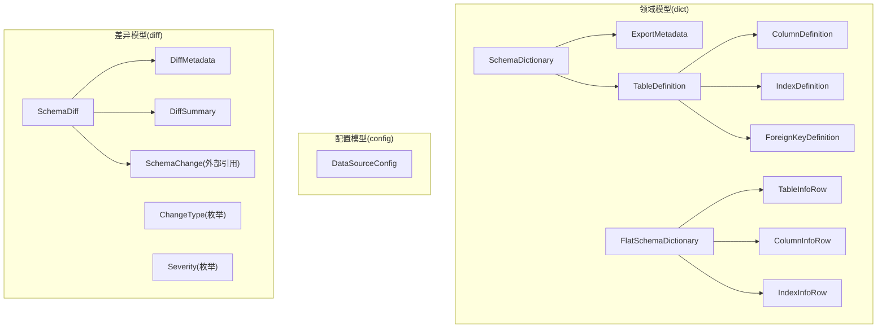
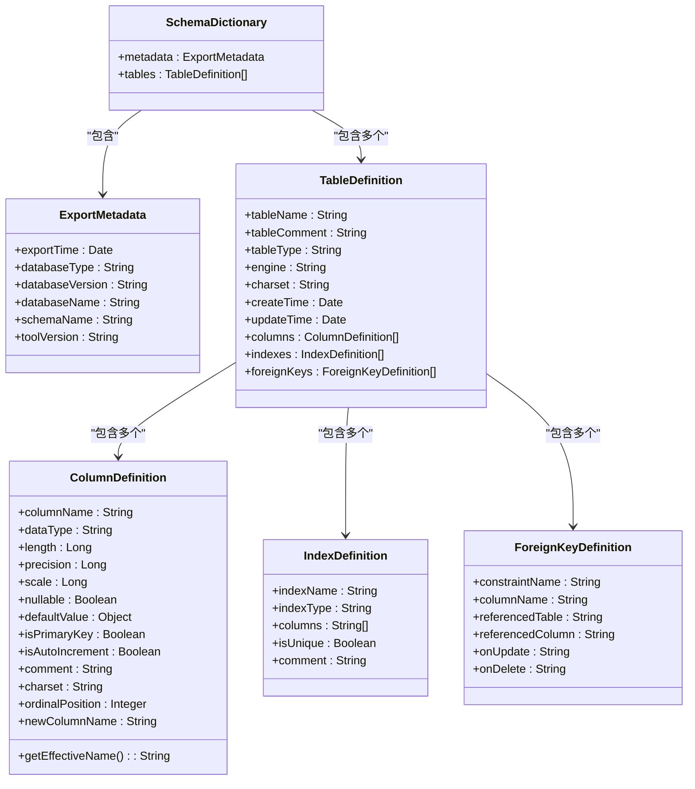
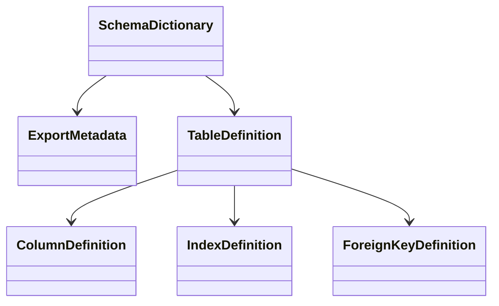
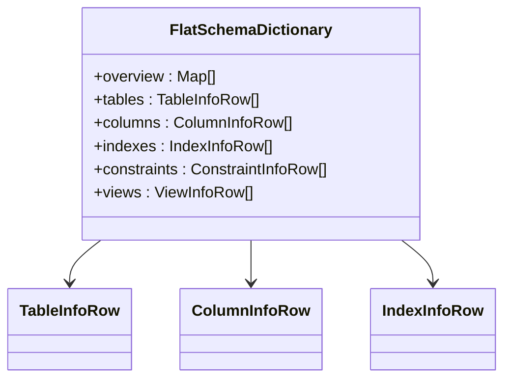
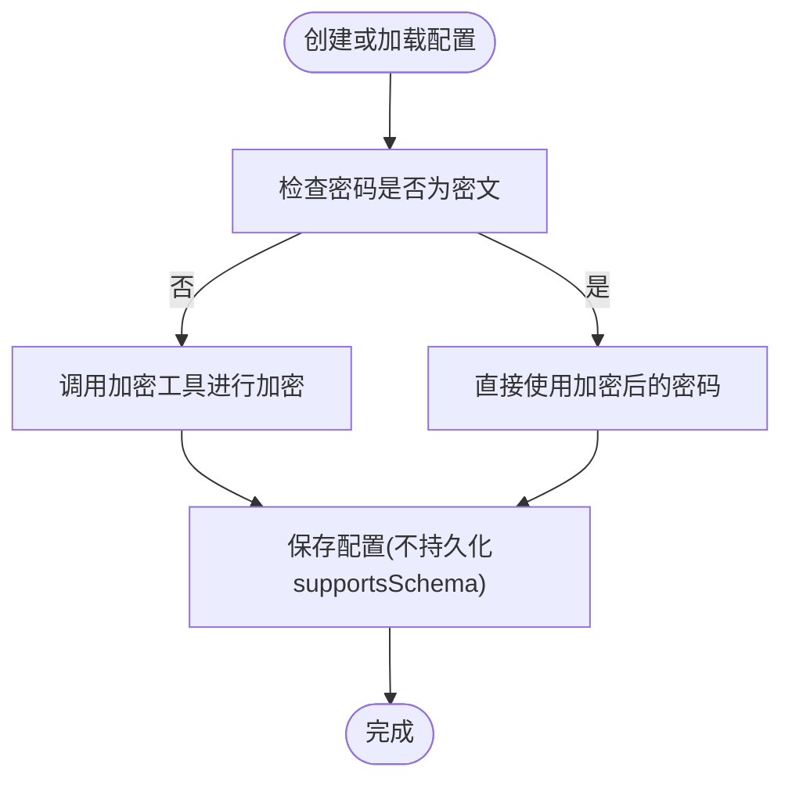
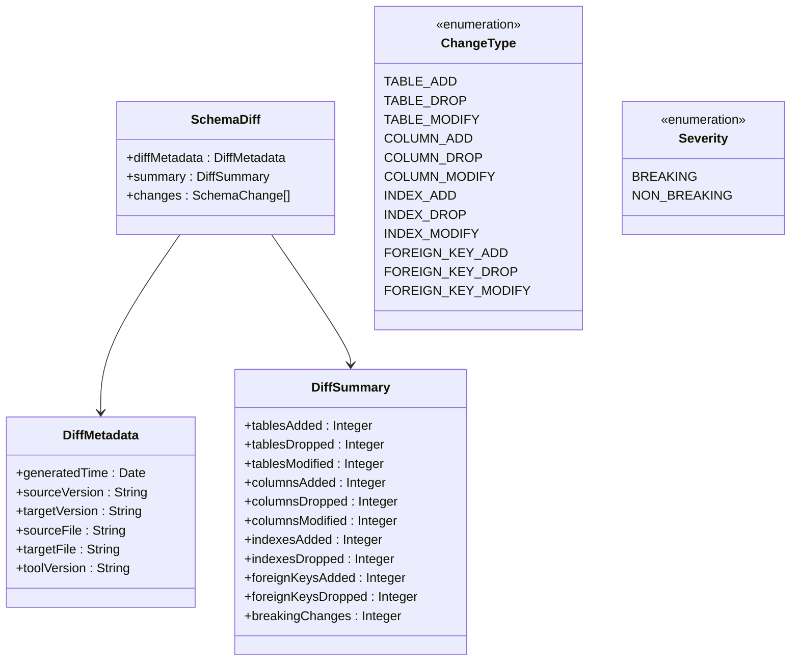
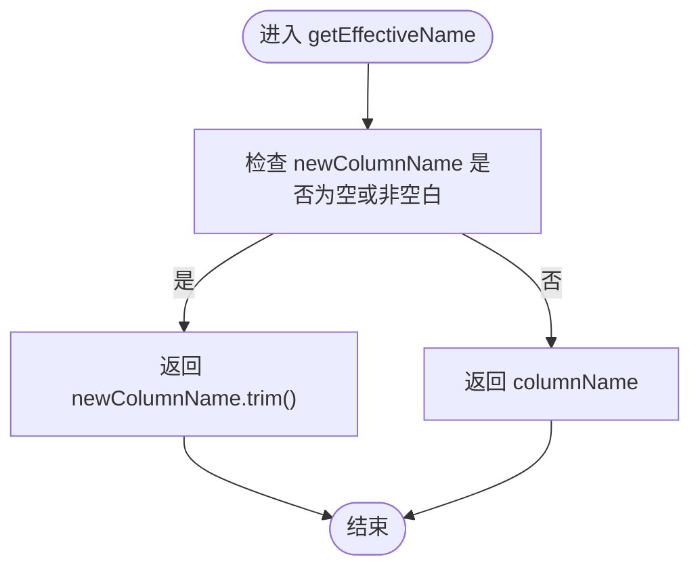
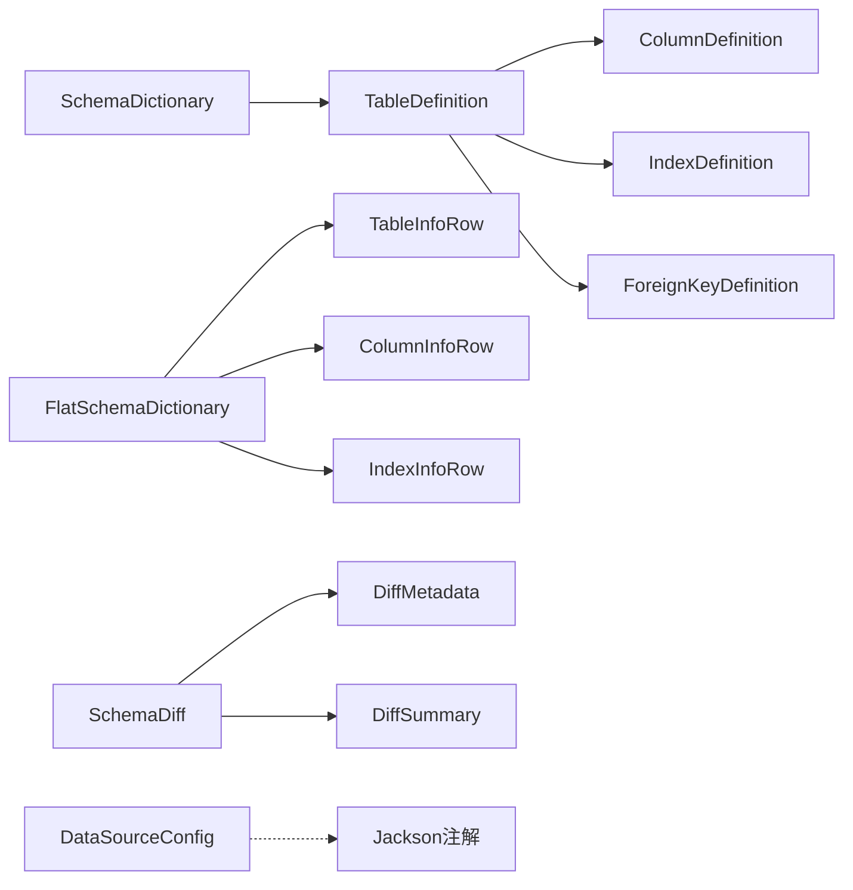

# 数据模型

<cite>
**本文引用的文件**   
- [SchemaDictionary.java](file://schemasync-backend/src/main/java/com/schemasync/model/dict/SchemaDictionary.java)
- [ExportMetadata.java](file://schemasync-backend/src/main/java/com/schemasync/model/dict/ExportMetadata.java)
- [TableDefinition.java](file://schemasync-backend/src/main/java/com/schemasync/model/dict/TableDefinition.java)
- [ColumnDefinition.java](file://schemasync-backend/src/main/java/com/schemasync/model/dict/ColumnDefinition.java)
- [IndexDefinition.java](file://schemasync-backend/src/main/java/com/schemasync/model/dict/IndexDefinition.java)
- [ForeignKeyDefinition.java](file://schemasync-backend/src/main/java/com/schemasync/model/dict/ForeignKeyDefinition.java)
- [FlatSchemaDictionary.java](file://schemasync-backend/src/main/java/com/schemasync/model/dict/FlatSchemaDictionary.java)
- [TableInfoRow.java](file://schemasync-backend/src/main/java/com/schemasync/model/dict/TableInfoRow.java)
- [ColumnInfoRow.java](file://schemasync-backend/src/main/java/com/schemasync/model/dict/ColumnInfoRow.java)
- [IndexInfoRow.java](file://schemasync-backend/src/main/java/com/schemasync/model/dict/IndexInfoRow.java)
- [DataSourceConfig.java](file://schemasync-backend/src/main/java/com/schemasync/model/config/DataSourceConfig.java)
- [SchemaDiff.java](file://schemasync-backend/src/main/java/com/schemasync/model/diff/SchemaDiff.java)
- [DiffMetadata.java](file://schemasync-backend/src/main/java/com/schemasync/model/diff/DiffMetadata.java)
- [DiffSummary.java](file://schemasync-backend/src/main/java/com/schemasync/model/diff/DiffSummary.java)
- [ChangeType.java](file://schemasync-backend/src/main/java/com/schemasync/model/diff/ChangeType.java)
- [Severity.java](file://schemasync-backend/src/main/java/com/schemasync/model/diff/Severity.java)
</cite>

## 目录
1. [简介](#简介)
2. [项目结构](#项目结构)
3. [核心组件](#核心组件)
4. [架构总览](#架构总览)
5. [详细组件分析](#详细组件分析)
6. [依赖关系分析](#依赖关系分析)
7. [性能考虑](#性能考虑)
8. [故障排查指南](#故障排查指南)
9. [结论](#结论)
10. [附录](#附录)

## 简介
本文件面向 SchemaSync 的数据模型，系统性阐述领域模型与差异模型的设计、字段含义、约束规则、相互关系以及序列化格式。重点覆盖：
- 核心领域模型：SchemaDictionary（数据字典根对象）、TableDefinition（表定义）、ColumnDefinition（字段定义）、IndexDefinition（索引定义）、ForeignKeyDefinition（外键定义）
- 扁平化导出模型：FlatSchemaDictionary 及其行级视图 TableInfoRow、ColumnInfoRow、IndexInfoRow 等
- 配置模型：DataSourceConfig 的安全特性与序列化约定
- 差异模型：SchemaDiff、DiffMetadata、DiffSummary、ChangeType、Severity 的结构与语义
- JSON 序列化示例、数据验证规则与性能考量，帮助理解数据流转与扩展点

## 项目结构
数据模型主要位于后端模块的 model 包下，按职责分为三类：
- dict：描述数据库结构的领域模型与扁平化导出模型
- config：数据源连接配置模型
- diff：差异结果模型与枚举

图表来源
- [SchemaDictionary.java:1-28](file://schemasync-backend/src/main/java/com/schemasync/model/dict/SchemaDictionary.java#L1-L28)
- [ExportMetadata.java:1-59](file://schemasync-backend/src/main/java/com/schemasync/model/dict/ExportMetadata.java#L1-L59)
- [TableDefinition.java:1-89](file://schemasync-backend/src/main/java/com/schemasync/model/dict/TableDefinition.java#L1-L89)
- [ColumnDefinition.java:1-116](file://schemasync-backend/src/main/java/com/schemasync/model/dict/ColumnDefinition.java#L1-L116)
- [IndexDefinition.java:1-49](file://schemasync-backend/src/main/java/com/schemasync/model/dict/IndexDefinition.java#L1-L49)
- [ForeignKeyDefinition.java:1-54](file://schemasync-backend/src/main/java/com/schemasync/model/dict/ForeignKeyDefinition.java#L1-L54)
- [FlatSchemaDictionary.java:1-59](file://schemasync-backend/src/main/java/com/schemasync/model/dict/FlatSchemaDictionary.java#L1-L59)
- [TableInfoRow.java:1-74](file://schemasync-backend/src/main/java/com/schemasync/model/dict/TableInfoRow.java#L1-L74)
- [ColumnInfoRow.java:1-103](file://schemasync-backend/src/main/java/com/schemasync/model/dict/ColumnInfoRow.java#L1-L103)
- [IndexInfoRow.java:1-47](file://schemasync-backend/src/main/java/com/schemasync/model/dict/IndexInfoRow.java#L1-L47)
- [DataSourceConfig.java:1-129](file://schemasync-backend/src/main/java/com/schemasync/model/config/DataSourceConfig.java#L1-L129)
- [SchemaDiff.java:1-35](file://schemasync-backend/src/main/java/com/schemasync/model/diff/SchemaDiff.java#L1-L35)
- [DiffMetadata.java:1-59](file://schemasync-backend/src/main/java/com/schemasync/model/diff/DiffMetadata.java#L1-L59)
- [DiffSummary.java:1-67](file://schemasync-backend/src/main/java/com/schemasync/model/diff/DiffSummary.java#L1-L67)
- [ChangeType.java:1-43](file://schemasync-backend/src/main/java/com/schemasync/model/diff/ChangeType.java#L1-L43)
- [Severity.java:1-17](file://schemasync-backend/src/main/java/com/schemasync/model/diff/Severity.java#L1-L17)

章节来源
- [SchemaDictionary.java:1-28](file://schemasync-backend/src/main/java/com/schemasync/model/dict/SchemaDictionary.java#L1-L28)
- [TableDefinition.java:1-89](file://schemasync-backend/src/main/java/com/schemasync/model/dict/TableDefinition.java#L1-L89)
- [FlatSchemaDictionary.java:1-59](file://schemasync-backend/src/main/java/com/schemasync/model/dict/FlatSchemaDictionary.java#L1-L59)
- [DataSourceConfig.java:1-129](file://schemasync-backend/src/main/java/com/schemasync/model/config/DataSourceConfig.java#L1-L129)
- [SchemaDiff.java:1-35](file://schemasync-backend/src/main/java/com/schemasync/model/diff/SchemaDiff.java#L1-L35)

## 核心组件
本节聚焦核心领域模型的职责与字段语义，说明其设计意图与约束。

- SchemaDictionary（数据字典根对象）
  - 作用：完整描述一个数据库的结构，包含导出元数据与表集合
  - 关键属性：导出元数据 ExportMetadata；表定义列表 List<TableDefinition>
  - 设计要点：作为顶层聚合根，统一承载导出上下文与实体集合

- ExportMetadata（导出元数据）
  - 作用：记录导出时间、数据库类型/版本/名称、Schema 名称、工具版本
  - 关键点：时间字段使用格式化注解，便于 JSON 输出为可读字符串

- TableDefinition（表结构定义）
  - 作用：描述单张表的元信息与结构
  - 关键属性：表名、注释、类型、存储引擎、字符集、创建/更新时间、字段列表、索引列表、外键列表
  - 设计要点：将列、索引、外键以列表形式组织，便于遍历与生成 DDL

- ColumnDefinition（字段定义）
  - 作用：描述字段的数据类型、长度、精度、小数位、可空性、默认值、主键、自增、注释、字符集、位置及重命名支持
  - 关键属性：数据类型（不含长度精度）、长度/精度/小数位（Long 支持超大值）、是否允许 NULL、默认值、是否主键、是否自增、注释、字符集、顺序位置、新字段名
  - 行为：提供“实际使用的字段名称”计算逻辑，优先返回新字段名（若存在且非空白），否则返回原字段名

- IndexDefinition（索引定义）
  - 作用：描述索引的名称、类型、字段列表、唯一性与备注
  - 关键属性：索引名、类型（PRIMARY/UNIQUE/INDEX/FULLTEXT）、字段列表、是否唯一、备注

- ForeignKeyDefinition（外键定义）
  - 作用：描述外键约束的关联关系与更新/删除策略
  - 关键属性：约束名、当前表字段、引用表、引用字段、更新规则、删除规则（支持 CASCADE/RESTRICT/SET NULL/NO ACTION）

章节来源
- [SchemaDictionary.java:1-28](file://schemasync-backend/src/main/java/com/schemasync/model/dict/SchemaDictionary.java#L1-L28)
- [ExportMetadata.java:1-59](file://schemasync-backend/src/main/java/com/schemasync/model/dict/ExportMetadata.java#L1-L59)
- [TableDefinition.java:1-89](file://schemasync-backend/src/main/java/com/schemasync/model/dict/TableDefinition.java#L1-L89)
- [ColumnDefinition.java:1-116](file://schemasync-backend/src/main/java/com/schemasync/model/dict/ColumnDefinition.java#L1-L116)
- [IndexDefinition.java:1-49](file://schemasync-backend/src/main/java/com/schemasync/model/dict/IndexDefinition.java#L1-L49)
- [ForeignKeyDefinition.java:1-54](file://schemasync-backend/src/main/java/com/schemasync/model/dict/ForeignKeyDefinition.java#L1-L54)

## 架构总览
下图展示核心领域模型之间的组合关系与层级结构，体现从数据库到结构化对象的映射方式。

图表来源
- [SchemaDictionary.java:1-28](file://schemasync-backend/src/main/java/com/schemasync/model/dict/SchemaDictionary.java#L1-L28)
- [ExportMetadata.java:1-59](file://schemasync-backend/src/main/java/com/schemasync/model/dict/ExportMetadata.java#L1-L59)
- [TableDefinition.java:1-89](file://schemasync-backend/src/main/java/com/schemasync/model/dict/TableDefinition.java#L1-L89)
- [ColumnDefinition.java:1-116](file://schemasync-backend/src/main/java/com/schemasync/model/dict/ColumnDefinition.java#L1-L116)
- [IndexDefinition.java:1-49](file://schemasync-backend/src/main/java/com/schemasync/model/dict/IndexDefinition.java#L1-L49)
- [ForeignKeyDefinition.java:1-54](file://schemasync-backend/src/main/java/com/schemasync/model/dict/ForeignKeyDefinition.java#L1-L54)

## 详细组件分析

### 领域模型类图与关系
- 聚合关系：SchemaDictionary 聚合 ExportMetadata 与多张 TableDefinition
- 组合关系：TableDefinition 组合 ColumnDefinition、IndexDefinition、ForeignKeyDefinition
- 行为方法：ColumnDefinition 提供 getEffectiveName() 用于字段重命名的兼容处理

图表来源
- [SchemaDictionary.java:1-28](file://schemasync-backend/src/main/java/com/schemasync/model/dict/SchemaDictionary.java#L1-L28)
- [TableDefinition.java:1-89](file://schemasync-backend/src/main/java/com/schemasync/model/dict/TableDefinition.java#L1-L89)
- [ColumnDefinition.java:1-116](file://schemasync-backend/src/main/java/com/schemasync/model/dict/ColumnDefinition.java#L1-L116)
- [IndexDefinition.java:1-49](file://schemasync-backend/src/main/java/com/schemasync/model/dict/IndexDefinition.java#L1-L49)
- [ForeignKeyDefinition.java:1-54](file://schemasync-backend/src/main/java/com/schemasync/model/dict/ForeignKeyDefinition.java#L1-L54)

章节来源
- [SchemaDictionary.java:1-28](file://schemasync-backend/src/main/java/com/schemasync/model/dict/SchemaDictionary.java#L1-L28)
- [TableDefinition.java:1-89](file://schemasync-backend/src/main/java/com/schemasync/model/dict/TableDefinition.java#L1-L89)
- [ColumnDefinition.java:1-116](file://schemasync-backend/src/main/java/com/schemasync/model/dict/ColumnDefinition.java#L1-L116)
- [IndexDefinition.java:1-49](file://schemasync-backend/src/main/java/com/schemasync/model/dict/IndexDefinition.java#L1-L49)
- [ForeignKeyDefinition.java:1-54](file://schemasync-backend/src/main/java/com/schemasync/model/dict/ForeignKeyDefinition.java#L1-L54)

### 扁平化数据结构 FlatSchemaDictionary
- 设计目的：将嵌套的树形结构转换为六个独立的二维列表，便于 Excel 加工与报表导出
- 组成：
  - overview：概述信息（键值对列表），包含数据库类型/版本/名称/实例/导出时间/工具版本等
  - tables：表级别信息（每表一行）
  - columns：字段级别信息（每字段一行，含表名）
  - indexes：索引信息（每索引一行，含表名）
  - constraints：约束信息（每约束一行，含表名）
  - views：视图定义（每视图一行）
- 行级视图：
  - TableInfoRow：表名、注释、类型、创建/更新时间、引擎、字符集、排序规则
  - ColumnInfoRow：表名、字段名、数据类型、长度/精度/小数位、可空、默认值、主键、自增、注释、字符集、新字段名
  - IndexInfoRow：表名、索引名、类型、字段序列（逗号分隔）、备注

图表来源
- [FlatSchemaDictionary.java:1-59](file://schemasync-backend/src/main/java/com/schemasync/model/dict/FlatSchemaDictionary.java#L1-L59)
- [TableInfoRow.java:1-74](file://schemasync-backend/src/main/java/com/schemasync/model/dict/TableInfoRow.java#L1-L74)
- [ColumnInfoRow.java:1-103](file://schemasync-backend/src/main/java/com/schemasync/model/dict/ColumnInfoRow.java#L1-L103)
- [IndexInfoRow.java:1-47](file://schemasync-backend/src/main/java/com/schemasync/model/dict/IndexInfoRow.java#L1-L47)

章节来源
- [FlatSchemaDictionary.java:1-59](file://schemasync-backend/src/main/java/com/schemasync/model/dict/FlatSchemaDictionary.java#L1-L59)
- [TableInfoRow.java:1-74](file://schemasync-backend/src/main/java/com/schemasync/model/dict/TableInfoRow.java#L1-L74)
- [ColumnInfoRow.java:1-103](file://schemasync-backend/src/main/java/com/schemasync/model/dict/ColumnInfoRow.java#L1-L103)
- [IndexInfoRow.java:1-47](file://schemasync-backend/src/main/java/com/schemasync/model/dict/IndexInfoRow.java#L1-L47)

### 配置模型 DataSourceConfig 安全特性与序列化
- 安全特性：
  - 密码字段采用加密存储（字段注释明确“加密存储”）
  - supportsSchema 标记为 transient，不参与持久化，由适配器动态设置
- 序列化约定：
  - 时间字段使用格式化注解，JSON 输出为标准日期时间字符串
  - poolConfig 为 JSON 字符串，支持连接池高级配置
  - jdbcUrl 可选，若提供则覆盖自动生成的 URL，支持高级参数
- 默认值：
  - port 默认 3306
  - charset 默认 utf8mb4
  - timeout 默认 30 秒

图表来源
- [DataSourceConfig.java:1-129](file://schemasync-backend/src/main/java/com/schemasync/model/config/DataSourceConfig.java#L1-L129)

章节来源
- [DataSourceConfig.java:1-129](file://schemasync-backend/src/main/java/com/schemasync/model/config/DataSourceConfig.java#L1-L129)

### 差异模型 SchemaDiff、DiffMetadata、DiffSummary、ChangeType、Severity
- SchemaDiff：差异结果容器，包含差异元数据、统计摘要与变更列表
- DiffMetadata：差异元数据，包含生成时间、源/目标版本标识、源/目标文件路径、工具版本
- DiffSummary：差异统计，涵盖表/字段/索引/外键的新增、删除、修改数量，以及破坏性变更计数
- ChangeType：变更类型枚举，覆盖表、字段、索引、外键三个层级的新增/删除/修改
- Severity：严重程度枚举，区分破坏性与非破坏性变更

图表来源
- [SchemaDiff.java:1-35](file://schemasync-backend/src/main/java/com/schemasync/model/diff/SchemaDiff.java#L1-L35)
- [DiffMetadata.java:1-59](file://schemasync-backend/src/main/java/com/schemasync/model/diff/DiffMetadata.java#L1-L59)
- [DiffSummary.java:1-67](file://schemasync-backend/src/main/java/com/schemasync/model/diff/DiffSummary.java#L1-L67)
- [ChangeType.java:1-43](file://schemasync-backend/src/main/java/com/schemasync/model/diff/ChangeType.java#L1-L43)
- [Severity.java:1-17](file://schemasync-backend/src/main/java/com/schemasync/model/diff/Severity.java#L1-L17)

章节来源
- [SchemaDiff.java:1-35](file://schemasync-backend/src/main/java/com/schemasync/model/diff/SchemaDiff.java#L1-L35)
- [DiffMetadata.java:1-59](file://schemasync-backend/src/main/java/com/schemasync/model/diff/DiffMetadata.java#L1-L59)
- [DiffSummary.java:1-67](file://schemasync-backend/src/main/java/com/schemasync/model/diff/DiffSummary.java#L1-L67)
- [ChangeType.java:1-43](file://schemasync-backend/src/main/java/com/schemasync/model/diff/ChangeType.java#L1-L43)
- [Severity.java:1-17](file://schemasync-backend/src/main/java/com/schemasync/model/diff/Severity.java#L1-L17)

### 字段重命名流程（ColumnDefinition.getEffectiveName）
该流程展示了在字段重命名场景下，如何确定最终使用的字段名。

图表来源
- [ColumnDefinition.java:105-115](file://schemasync-backend/src/main/java/com/schemasync/model/dict/ColumnDefinition.java#L105-L115)

章节来源
- [ColumnDefinition.java:1-116](file://schemasync-backend/src/main/java/com/schemasync/model/dict/ColumnDefinition.java#L1-L116)

## 依赖关系分析
- 低耦合高内聚：每个模型类职责单一，仅暴露必要的 getter/setter，便于序列化与测试
- 组合优于继承：通过组合表达“包含”关系，避免复杂的继承层次
- 枚举独立：ChangeType 与 Severity 作为独立枚举，降低耦合度，提升可扩展性
- 外部依赖：
  - Jackson 注解用于时间格式化与 JSON 序列化
  - 配置项中的 poolConfig 为 JSON 字符串，需上层解析为具体连接池配置对象

图表来源
- [SchemaDictionary.java:1-28](file://schemasync-backend/src/main/java/com/schemasync/model/dict/SchemaDictionary.java#L1-L28)
- [TableDefinition.java:1-89](file://schemasync-backend/src/main/java/com/schemasync/model/dict/TableDefinition.java#L1-L89)
- [FlatSchemaDictionary.java:1-59](file://schemasync-backend/src/main/java/com/schemasync/model/dict/FlatSchemaDictionary.java#L1-L59)
- [SchemaDiff.java:1-35](file://schemasync-backend/src/main/java/com/schemasync/model/diff/SchemaDiff.java#L1-L35)
- [DataSourceConfig.java:1-129](file://schemasync-backend/src/main/java/com/schemasync/model/config/DataSourceConfig.java#L1-L129)

章节来源
- [SchemaDictionary.java:1-28](file://schemasync-backend/src/main/java/com/schemasync/model/dict/SchemaDictionary.java#L1-L28)
- [TableDefinition.java:1-89](file://schemasync-backend/src/main/java/com/schemasync/model/dict/TableDefinition.java#L1-L89)
- [FlatSchemaDictionary.java:1-59](file://schemasync-backend/src/main/java/com/schemasync/model/dict/FlatSchemaDictionary.java#L1-L59)
- [SchemaDiff.java:1-35](file://schemasync-backend/src/main/java/com/schemasync/model/diff/SchemaDiff.java#L1-L35)
- [DataSourceConfig.java:1-129](file://schemasync-backend/src/main/java/com/schemasync/model/config/DataSourceConfig.java#L1-L129)

## 性能考虑
- 大数据量导出
  - 扁平化模型适合流式写入与分批处理，避免一次性构建过大的嵌套对象树
  - 使用 Long 表示 length/precision/scale，避免溢出并减少转换开销
- 序列化性能
  - 时间字段使用格式化注解，建议在批量导出时复用 SimpleDateFormat 或使用线程安全的日期格式器
  - 对于超大型 JSON 输出，考虑分块输出或压缩传输
- 内存占用
  - 扁平化模型将复杂树拆分为多个二维列表，有利于下游表格工具处理，但需注意内存中同时持有六份数据
- 差异计算
  - 建议对变更列表进行增量比较与去重，避免重复条目影响统计准确性

[本节为通用指导，无需特定文件来源]

## 故障排查指南
- 字段名称冲突
  - 当 newColumnName 为空或空白时，系统回退到 columnName；请确保业务侧正确设置 newColumnName
- 外键约束异常
  - 检查 referencedTable 与 referencedColumn 是否存在于目标库，并确保 onUpdate/onDelete 策略符合预期
- 索引字段顺序
  - IndexDefinition.columns 的顺序会影响索引选择与性能，请确认字段顺序与业务查询匹配
- 配置连接失败
  - 校验 host/port/database/jdbcUrl 是否正确；如使用自定义 JDBC URL，注意参数拼接与时区设置
  - 密码字段应为密文，若明文传入，请在保存前进行加密

章节来源
- [ColumnDefinition.java:105-115](file://schemasync-backend/src/main/java/com/schemasync/model/dict/ColumnDefinition.java#L105-L115)
- [ForeignKeyDefinition.java:1-54](file://schemasync-backend/src/main/java/com/schemasync/model/dict/ForeignKeyDefinition.java#L1-L54)
- [IndexDefinition.java:1-49](file://schemasync-backend/src/main/java/com/schemasync/model/dict/IndexDefinition.java#L1-L49)
- [DataSourceConfig.java:1-129](file://schemasync-backend/src/main/java/com/schemasync/model/config/DataSourceConfig.java#L1-L129)

## 结论
SchemaSync 的数据模型围绕“清晰表达数据库结构、便于导出与对比”的目标设计。核心领域模型以组合方式表达表、字段、索引与外键的关系；扁平化模型服务于 Excel 等二维数据处理场景；配置模型强调安全与灵活性；差异模型提供完整的变更描述与统计。整体结构简洁、职责清晰，具备良好的可扩展性与工程实践价值。

[本节为总结性内容，无需特定文件来源]

## 附录

### JSON 序列化示例（示意）
以下为典型 JSON 片段示意，展示各模型的关键字段与格式约定（不包含具体代码内容）：
- SchemaDictionary
  - metadata：包含 exportTime、databaseType、databaseVersion、databaseName、schemaName、toolVersion
  - tables：数组，每项包含 tableName、tableComment、tableType、engine、charset、createTime、updateTime、columns、indexes、foreignKeys
- ColumnDefinition
  - dataType、length、precision、scale、nullable、defaultValue、isPrimaryKey、isAutoIncrement、comment、charset、ordinalPosition、newColumnName
- IndexDefinition
  - indexName、indexType、columns（字符串数组）、isUnique、comment
- ForeignKeyDefinition
  - constraintName、columnName、referencedTable、referencedColumn、onUpdate、onDelete
- FlatSchemaDictionary
  - overview：键值对数组
  - tables/columns/indexes/constraints/views：各自对应的行列表
- DataSourceConfig
  - id、name、type、host、port、database、username、password（密文）、charset、timeout、jdbcUrl、poolConfig（JSON 字符串）、createTime、updateTime
- SchemaDiff
  - diffMetadata：包含 generatedTime、sourceVersion、targetVersion、sourceFile、targetFile、toolVersion
  - summary：包含各类新增/删除/修改计数与 breakingChanges
  - changes：变更列表（SchemaChange 为外部引用）

[本节为概念性示例，无需特定文件来源]

### 数据验证规则（建议）
- 必填字段
  - SchemaDictionary.tables 非空
  - TableDefinition.tableName 非空
  - ColumnDefinition.columnName 非空
  - IndexDefinition.indexName 非空
  - ForeignKeyDefinition.constraintName/referencedTable/referencedColumn 非空
- 取值范围
  - ChangeType 与 Severity 必须为枚举定义的值
  - ForeignKeyDefinition.onUpdate/onDelete 应属于支持的策略集合
- 一致性
  - ColumnDefinition.newColumnName 若存在，应与 ColumnDefinition.columnName 在同一表中有效
  - IndexDefinition.columns 中的字段应在 TableDefinition.columns 中存在

[本节为通用指导，无需特定文件来源]