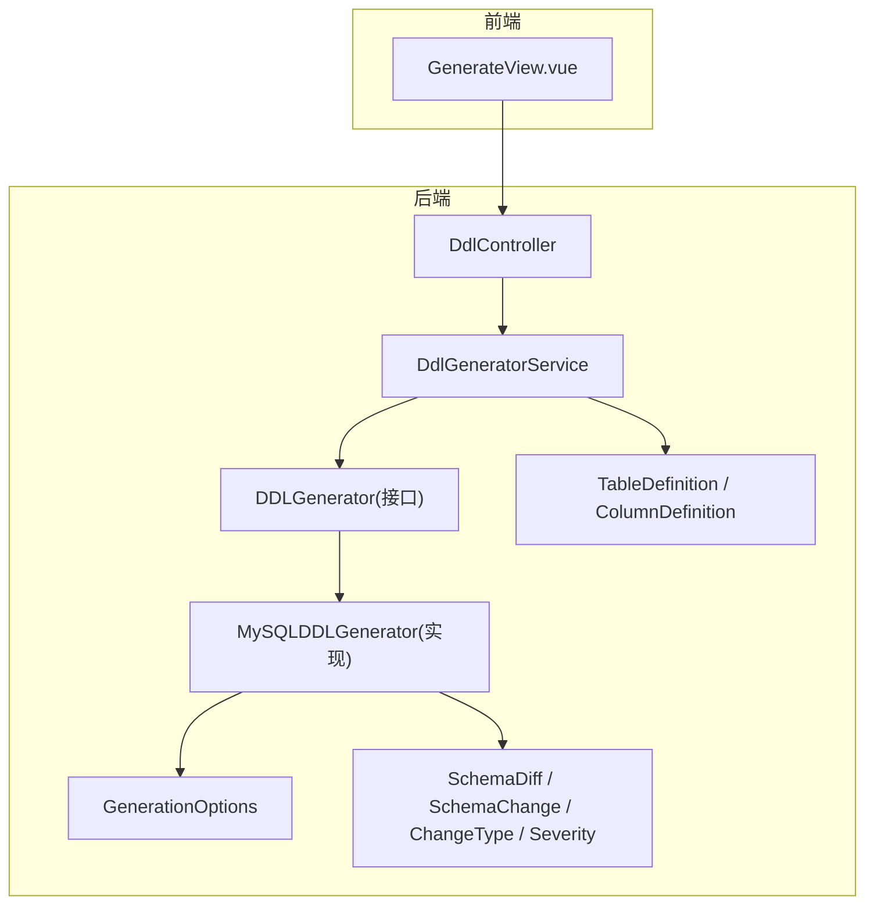
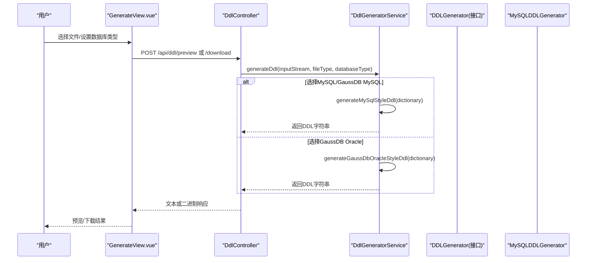
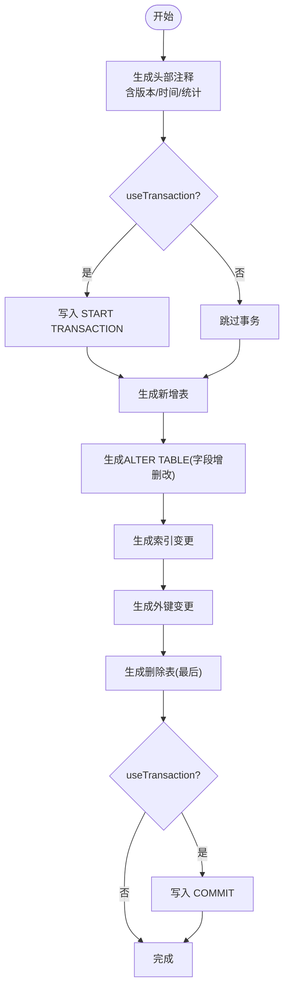
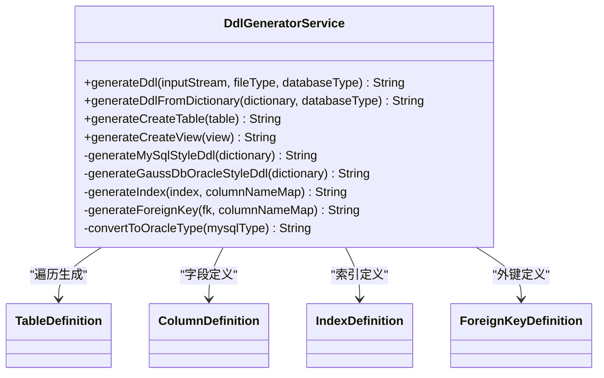
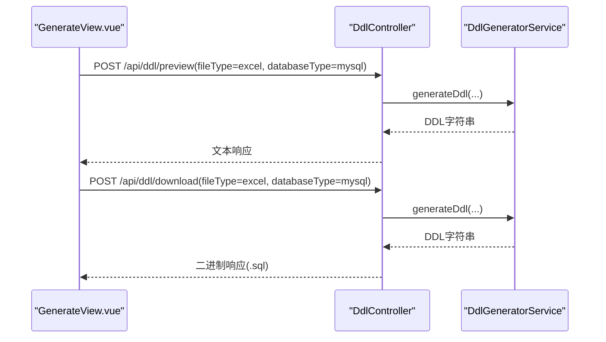
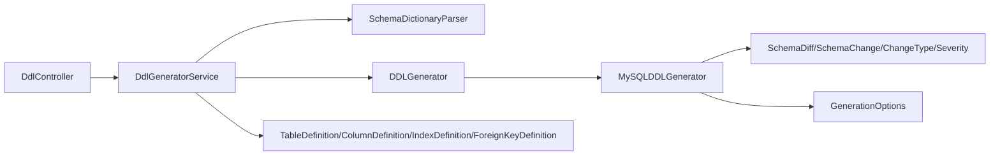

# DDL脚本生成

<cite>
**本文引用的文件**   
- [DDLGenerator.java](file://schemasync-backend/src/main/java/com/schemasync/generator/DDLGenerator.java)
- [MySQLDDLGenerator.java](file://schemasync-backend/src/main/java/com/schemasync/generator/MySQLDDLGenerator.java)
- [GenerationOptions.java](file://schemasync-backend/src/main/java/com/schemasync/generator/GenerationOptions.java)
- [DdlGeneratorService.java](file://schemasync-backend/src/main/java/com/schemasync/service/DdlGeneratorService.java)
- [DdlController.java](file://schemasync-backend/src/main/java/com/schemasync/controller/DdlController.java)
- [SchemaDiff.java](file://schemasync-backend/src/main/java/com/schemasync/model/diff/SchemaDiff.java)
- [SchemaChange.java](file://schemasync-backend/src/main/java/com/schemasync/model/diff/SchemaChange.java)
- [ChangeType.java](file://schemasync-backend/src/main/java/com/schemasync/model/diff/ChangeType.java)
- [Severity.java](file://schemasync-backend/src/main/java/com/schemasync/model/diff/Severity.java)
- [TableDefinition.java](file://schemasync-backend/src/main/java/com/schemasync/model/dict/TableDefinition.java)
- [ColumnDefinition.java](file://schemasync-backend/src/main/java/com/schemasync/model/dict/ColumnDefinition.java)
- [GenerateView.vue](file://schemasync-frontend/src/views/GenerateView.vue)
- [MySQLDDLGeneratorTest.java](file://schemasync-backend/src/test/java/com/schemasync/generator/MySQLDDLGeneratorTest.java)
</cite>

## 目录
1. [简介](#简介)
2. [项目结构](#项目结构)
3. [核心组件](#核心组件)
4. [架构总览](#架构总览)
5. [详细组件分析](#详细组件分析)
6. [依赖关系分析](#依赖关系分析)
7. [性能与执行策略](#性能与执行策略)
8. [安全与保护机制](#安全与保护机制)
9. [语法规范与数据库差异](#语法规范与数据库差异)
10. [验证方法与回滚保障](#验证方法与回滚保障)
11. [API调用示例](#api调用示例)
12. [前端界面操作指南](#前端界面操作指南)
13. [故障排查](#故障排查)
14. [结论](#结论)

## 简介
本章节面向“全量DDL脚本生成”能力，覆盖自动变更SQL生成机制、回滚脚本创建、事务控制支持、接口设计、具体实现、配置选项、生成流程、脚本语法规范、安全保护机制、执行策略、不同数据库类型DDL差异、约束处理规则、索引重建逻辑、脚本验证方法、执行顺序建议与回滚保障措施。文档同时提供API调用示例与前端界面操作指南，帮助开发者快速集成与使用。

## 项目结构
后端采用分层架构：控制器暴露REST API，服务层编排解析与生成逻辑，生成器负责按数据库方言输出DDL；模型层承载数据字典与差异对象；前端提供可视化上传、预览与下载能力。

图表来源
- [DdlController.java](file://schemasync-backend/src/main/java/com/schemasync/controller/DdlController.java)
- [DdlGeneratorService.java](file://schemasync-backend/src/main/java/com/schemasync/service/DdlGeneratorService.java)
- [DDLGenerator.java](file://schemasync-backend/src/main/java/com/schemasync/generator/DDLGenerator.java)
- [MySQLDDLGenerator.java](file://schemasync-backend/src/main/java/com/schemasync/generator/MySQLDDLGenerator.java)
- [GenerationOptions.java](file://schemasync-backend/src/main/java/com/schemasync/generator/GenerationOptions.java)
- [SchemaDiff.java](file://schemasync-backend/src/main/java/com/schemasync/model/diff/SchemaDiff.java)
- [SchemaChange.java](file://schemasync-backend/src/main/java/com/schemasync/model/diff/SchemaChange.java)
- [ChangeType.java](file://schemasync-backend/src/main/java/com/schemasync/model/diff/ChangeType.java)
- [Severity.java](file://schemasync-backend/src/main/java/com/schemasync/model/diff/Severity.java)
- [TableDefinition.java](file://schemasync-backend/src/main/java/com/schemasync/model/dict/TableDefinition.java)
- [ColumnDefinition.java](file://schemasync-backend/src/main/java/com/schemasync/model/dict/ColumnDefinition.java)
- [GenerateView.vue](file://schemasync-frontend/src/views/GenerateView.vue)

章节来源
- [DdlController.java](file://schemasync-backend/src/main/java/com/schemasync/controller/DdlController.java)
- [DdlGeneratorService.java](file://schemasync-backend/src/main/java/com/schemasync/service/DdlGeneratorService.java)
- [DDLGenerator.java](file://schemasync-backend/src/main/java/com/schemasync/generator/DDLGenerator.java)
- [MySQLDDLGenerator.java](file://schemasync-backend/src/main/java/com/schemasync/generator/MySQLDDLGenerator.java)
- [GenerationOptions.java](file://schemasync-backend/src/main/java/com/schemasync/generator/GenerationOptions.java)
- [SchemaDiff.java](file://schemasync-backend/src/main/java/com/schemasync/model/diff/SchemaDiff.java)
- [SchemaChange.java](file://schemasync-backend/src/main/java/com/schemasync/model/diff/SchemaChange.java)
- [ChangeType.java](file://schemasync-backend/src/main/java/com/schemasync/model/diff/ChangeType.java)
- [Severity.java](file://schemasync-backend/src/main/java/com/schemasync/model/diff/Severity.java)
- [TableDefinition.java](file://schemasync-backend/src/main/java/com/schemasync/model/dict/TableDefinition.java)
- [ColumnDefinition.java](file://schemasync-backend/src/main/java/com/schemasync/model/dict/ColumnDefinition.java)
- [GenerateView.vue](file://schemasync-frontend/src/views/GenerateView.vue)

## 核心组件
- DDLGenerator接口：定义生成正向DDL、回滚DDL与数据库类型标识的契约。
- MySQLDDLGenerator：基于差异对象生成MySQL风格变更脚本，包含事务包裹、破坏性变更注释、回滚脚本生成等。
- GenerationOptions：生成选项，包括是否包含回滚、是否注释破坏性变更、是否启用事务、版本信息等。
- DdlGeneratorService：从数据字典（Excel/JSON）生成全量DDL，支持MySQL与GaussDB Oracle兼容模式。
- DdlController：对外暴露生成、预览、下载三个接口。
- 模型层：SchemaDiff/SchemaChange/ChangeType/Severity描述差异；TableDefinition/ColumnDefinition描述表结构与字段。

章节来源
- [DDLGenerator.java](file://schemasync-backend/src/main/java/com/schemasync/generator/DDLGenerator.java)
- [MySQLDDLGenerator.java](file://schemasync-backend/src/main/java/com/schemasync/generator/MySQLDDLGenerator.java)
- [GenerationOptions.java](file://schemasync-backend/src/main/java/com/schemasync/generator/GenerationOptions.java)
- [DdlGeneratorService.java](file://schemasync-backend/src/main/java/com/schemasync/service/DdlGeneratorService.java)
- [DdlController.java](file://schemasync-backend/src/main/java/com/schemasync/controller/DdlController.java)
- [SchemaDiff.java](file://schemasync-backend/src/main/java/com/schemasync/model/diff/SchemaDiff.java)
- [SchemaChange.java](file://schemasync-backend/src/main/java/com/schemasync/model/diff/SchemaChange.java)
- [ChangeType.java](file://schemasync-backend/src/main/java/com/schemasync/model/diff/ChangeType.java)
- [Severity.java](file://schemasync-backend/src/main/java/com/schemasync/model/diff/Severity.java)
- [TableDefinition.java](file://schemasync-backend/src/main/java/com/schemasync/model/dict/TableDefinition.java)
- [ColumnDefinition.java](file://schemasync-backend/src/main/java/com/schemasync/model/dict/ColumnDefinition.java)

## 架构总览
整体流程：前端上传数据字典文件 -> 控制器接收并转发至服务 -> 服务根据数据库类型选择生成策略 -> 生成器输出DDL或回滚脚本 -> 返回给前端进行预览或下载。

图表来源
- [DdlController.java](file://schemasync-backend/src/main/java/com/schemasync/controller/DdlController.java)
- [DdlGeneratorService.java](file://schemasync-backend/src/main/java/com/schemasync/service/DdlGeneratorService.java)
- [DDLGenerator.java](file://schemasync-backend/src/main/java/com/schemasync/generator/DDLGenerator.java)
- [MySQLDDLGenerator.java](file://schemasync-backend/src/main/java/com/schemasync/generator/MySQLDDLGenerator.java)
- [GenerateView.vue](file://schemasync-frontend/src/views/GenerateView.vue)

## 详细组件分析

### DDLGenerator接口设计
- 职责：统一DDL生成契约，屏蔽不同数据库方言差异。
- 关键方法：
  - generate(SchemaDiff diff, GenerationOptions options)：生成正向DDL。
  - generateRollback(SchemaDiff diff)：生成回滚DDL。
  - getDatabaseType()：返回数据库类型标识。

章节来源
- [DDLGenerator.java](file://schemasync-backend/src/main/java/com/schemasync/generator/DDLGenerator.java)

### MySQLDDLGenerator具体实现
- 生成顺序：
  1) 新增表
  2) 修改表结构（字段增删改）
  3) 索引变更
  4) 外键约束变更
  5) 删除表（最后执行）
- 事务控制：当options.useTransaction为true时，脚本以START TRANSACTION开始、COMMIT结束。
- 破坏性变更保护：当options.commentBreakingChanges为true时，DROP TABLE、DROP COLUMN等破坏性语句会被注释，需手动取消注释确认。
- 回滚脚本：生成反向操作，如删除新增表；对删除表的恢复需要人工介入。
- 统计信息：在头部注释中汇总新增/删除/修改数量及破坏性变更数量。

图表来源
- [MySQLDDLGenerator.java](file://schemasync-backend/src/main/java/com/schemasync/generator/MySQLDDLGenerator.java)
- [GenerationOptions.java](file://schemasync-backend/src/main/java/com/schemasync/generator/GenerationOptions.java)

章节来源
- [MySQLDDLGenerator.java](file://schemasync-backend/src/main/java/com/schemasync/generator/MySQLDDLGenerator.java)
- [GenerationOptions.java](file://schemasync-backend/src/main/java/com/schemasync/generator/GenerationOptions.java)

### GenerationOptions配置选项
- databaseType：数据库类型标识（用于扩展多方言）。
- includeRollback：是否包含回滚脚本（当前由调用方组合）。
- commentBreakingChanges：是否注释破坏性变更（默认开启）。
- useTransaction：是否添加事务控制（默认开启）。
- sourceVersion/targetVersion：源/目标版本标识，用于脚本头部记录。

章节来源
- [GenerationOptions.java](file://schemasync-backend/src/main/java/com/schemasync/generator/GenerationOptions.java)

### DdlGeneratorService（全量DDL生成）
- 输入：Excel或JSON格式的数据字典文件流。
- 解析：通过SchemaDictionaryParser解析为SchemaDictionary。
- 路由：根据databaseType选择MySQL风格或GaussDB Oracle风格生成。
- 输出：完整DDL SQL字符串，包含表、视图、索引、外键、注释等。

图表来源
- [DdlGeneratorService.java](file://schemasync-backend/src/main/java/com/schemasync/service/DdlGeneratorService.java)
- [TableDefinition.java](file://schemasync-backend/src/main/java/com/schemasync/model/dict/TableDefinition.java)
- [ColumnDefinition.java](file://schemasync-backend/src/main/java/com/schemasync/model/dict/ColumnDefinition.java)

章节来源
- [DdlGeneratorService.java](file://schemasync-backend/src/main/java/com/schemasync/service/DdlGeneratorService.java)
- [TableDefinition.java](file://schemasync-backend/src/main/java/com/schemasync/model/dict/TableDefinition.java)
- [ColumnDefinition.java](file://schemasync-backend/src/main/java/com/schemasync/model/dict/ColumnDefinition.java)

### 控制器与前端交互
- 控制器提供三个端点：
  - /api/ddl/generate：生成并返回二进制文件（下载）。
  - /api/ddl/preview：生成并返回文本（预览）。
  - /api/ddl/download：生成并返回二进制文件（下载）。
- 前端页面：
  - 支持选择Excel文件、选择数据库类型。
  - 调用预览接口显示SQL内容，支持一键下载。

图表来源
- [DdlController.java](file://schemasync-backend/src/main/java/com/schemasync/controller/DdlController.java)
- [DdlGeneratorService.java](file://schemasync-backend/src/main/java/com/schemasync/service/DdlGeneratorService.java)
- [GenerateView.vue](file://schemasync-frontend/src/views/GenerateView.vue)

章节来源
- [DdlController.java](file://schemasync-backend/src/main/java/com/schemasync/controller/DdlController.java)
- [GenerateView.vue](file://schemasync-frontend/src/views/GenerateView.vue)

## 依赖关系分析
- 控制器依赖服务层，服务层依赖解析器与生成器。
- 生成器依赖差异模型与选项对象。
- 全量生成服务依赖数据字典模型（表、字段、索引、外键）。

图表来源
- [DdlController.java](file://schemasync-backend/src/main/java/com/schemasync/controller/DdlController.java)
- [DdlGeneratorService.java](file://schemasync-backend/src/main/java/com/schemasync/service/DdlGeneratorService.java)
- [DDLGenerator.java](file://schemasync-backend/src/main/java/com/schemasync/generator/DDLGenerator.java)
- [MySQLDDLGenerator.java](file://schemasync-backend/src/main/java/com/schemasync/generator/MySQLDDLGenerator.java)
- [SchemaDiff.java](file://schemasync-backend/src/main/java/com/schemasync/model/diff/SchemaDiff.java)
- [SchemaChange.java](file://schemasync-backend/src/main/java/com/schemasync/model/diff/SchemaChange.java)
- [ChangeType.java](file://schemasync-backend/src/main/java/com/schemasync/model/diff/ChangeType.java)
- [Severity.java](file://schemasync-backend/src/main/java/com/schemasync/model/diff/Severity.java)
- [GenerationOptions.java](file://schemasync-backend/src/main/java/com/schemasync/generator/GenerationOptions.java)
- [TableDefinition.java](file://schemasync-backend/src/main/java/com/schemasync/model/dict/TableDefinition.java)
- [ColumnDefinition.java](file://schemasync-backend/src/main/java/com/schemasync/model/dict/ColumnDefinition.java)

章节来源
- [DdlController.java](file://schemasync-backend/src/main/java/com/schemasync/controller/DdlController.java)
- [DdlGeneratorService.java](file://schemasync-backend/src/main/java/com/schemasync/service/DdlGeneratorService.java)
- [DDLGenerator.java](file://schemasync-backend/src/main/java/com/schemasync/generator/DDLGenerator.java)
- [MySQLDDLGenerator.java](file://schemasync-backend/src/main/java/com/schemasync/generator/MySQLDDLGenerator.java)
- [SchemaDiff.java](file://schemasync-backend/src/main/java/com/schemasync/model/diff/SchemaDiff.java)
- [SchemaChange.java](file://schemasync-backend/src/main/java/com/schemasync/model/diff/SchemaChange.java)
- [ChangeType.java](file://schemasync-backend/src/main/java/com/schemasync/model/diff/ChangeType.java)
- [Severity.java](file://schemasync-backend/src/main/java/com/schemasync/model/diff/Severity.java)
- [GenerationOptions.java](file://schemasync-backend/src/main/java/com/schemasync/generator/GenerationOptions.java)
- [TableDefinition.java](file://schemasync-backend/src/main/java/com/schemasync/model/dict/TableDefinition.java)
- [ColumnDefinition.java](file://schemasync-backend/src/main/java/com/schemasync/model/dict/ColumnDefinition.java)

## 性能与执行策略
- 生成顺序优化：先建后改再删，避免依赖冲突；删除表放在最后，确保引用完整性。
- 事务控制：可选的事务包裹提升一致性，但大脚本可能受限于数据库事务大小限制。
- 破坏性变更注释：默认注释危险语句，降低误执行风险。
- 批量生成：服务层一次性构建完整DDL，减少多次往返开销。

[本节为通用指导，不直接分析具体文件]

## 安全与保护机制
- 破坏性变更保护：DROP TABLE、DROP COLUMN等默认被注释，需手动确认。
- 事务控制：可开启事务保证原子性，失败可回滚。
- 版本追踪：脚本头部记录源/目标版本与生成时间，便于审计。
- 字符转义：默认值与注释中的单引号进行转义，防止SQL注入与语法错误。

章节来源
- [MySQLDDLGenerator.java](file://schemasync-backend/src/main/java/com/schemasync/generator/MySQLDDLGenerator.java)
- [GenerationOptions.java](file://schemasync-backend/src/main/java/com/schemasync/generator/GenerationOptions.java)
- [DdlGeneratorService.java](file://schemasync-backend/src/main/java/com/schemasync/service/DdlGeneratorService.java)

## 语法规范与数据库差异
- MySQL风格：
  - 表名/字段名使用反引号。
  - 主键、唯一索引、普通索引在建表内定义。
  - 外键约束支持ON UPDATE/ON DELETE。
  - TEXT/BLOB/JSON/空间类型无需长度。
- GaussDB Oracle兼容模式：
  - 不使用反引号，字段名通常大写。
  - 数据类型转换（如VARCHAR->VARCHAR2，INT->NUMBER，TEXT->CLOB等）。
  - 索引通常单独创建，建表内仅保留注释提示。
  - ON UPDATE CASCADE不支持，需手动处理。

章节来源
- [DdlGeneratorService.java](file://schemasync-backend/src/main/java/com/schemasync/service/DdlGeneratorService.java)

## 验证方法与回滚保障
- 验证方法：
  - 使用预览接口查看生成的DDL，检查语法与注释。
  - 在非生产环境执行测试，核对表结构、索引、外键与注释。
  - 对比生成前后元数据，确保无遗漏。
- 执行顺序建议：
  - 先执行新增表与索引，再执行字段修改，最后执行删除操作。
  - 破坏性变更需人工确认后再执行。
- 回滚保障：
  - 使用回滚脚本删除新增对象；对已删除对象的恢复需从备份恢复。
  - 结合事务控制，确保变更原子性。

章节来源
- [MySQLDDLGenerator.java](file://schemasync-backend/src/main/java/com/schemasync/generator/MySQLDDLGenerator.java)
- [DdlController.java](file://schemasync-backend/src/main/java/com/schemasync/controller/DdlController.java)

## API调用示例
- 预览DDL
  - 请求：POST /api/ddl/preview
  - 参数：file(MultipartFile), fileType=excel, databaseType=mysql|gaussdb_mysql|gaussdb_oracle
  - 响应：文本DDL
- 下载DDL
  - 请求：POST /api/ddl/download
  - 参数：同上
  - 响应：二进制.sql文件

章节来源
- [DdlController.java](file://schemasync-backend/src/main/java/com/schemasync/controller/DdlController.java)

## 前端界面操作指南
- 打开“全量DDL脚本生成”页面。
- 选择Excel数据字典文件。
- 选择数据库类型（MySQL/GaussDB MySQL/GaussDB Oracle）。
- 点击“生成DDL脚本”，在预览区查看SQL。
- 点击“下载SQL文件”保存本地。

章节来源
- [GenerateView.vue](file://schemasync-frontend/src/views/GenerateView.vue)

## 故障排查
- 生成失败：
  - 检查上传文件格式是否为Excel或JSON。
  - 检查数据库类型参数是否正确。
  - 查看服务端日志定位异常。
- 预览为空或内容不完整：
  - 检查数据字典是否包含必要字段（表名、字段、索引、外键）。
  - 确认解析器能正确读取文件。
- 破坏性变更未生效：
  - 检查commentBreakingChanges配置，必要时手动取消注释。
- 事务相关错误：
  - 若数据库不支持或事务过大，关闭useTransaction。

章节来源
- [DdlController.java](file://schemasync-backend/src/main/java/com/schemasync/controller/DdlController.java)
- [DdlGeneratorService.java](file://schemasync-backend/src/main/java/com/schemasync/service/DdlGeneratorService.java)
- [MySQLDDLGenerator.java](file://schemasync-backend/src/main/java/com/schemasync/generator/MySQLDDLGenerator.java)

## 结论
本方案通过接口抽象与具体实现分离，实现了可扩展的DDL生成能力；结合事务控制与破坏性变更保护，提升了安全性与可维护性；同时提供MySQL与GaussDB Oracle两种风格的生成策略，满足多数据库场景需求。配合前端界面与API，形成完整的端到端解决方案。