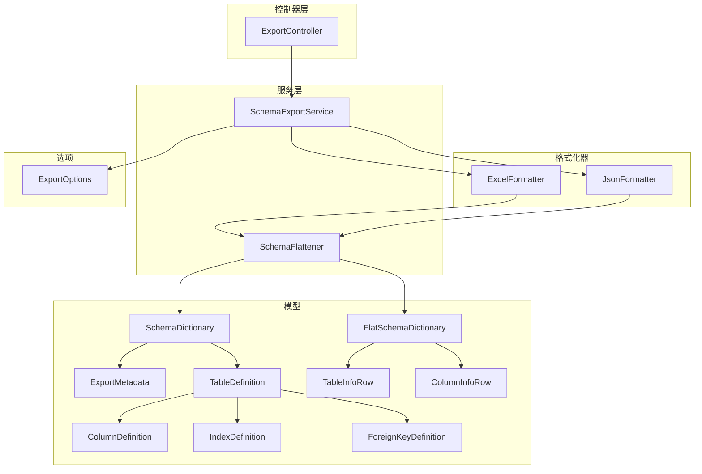
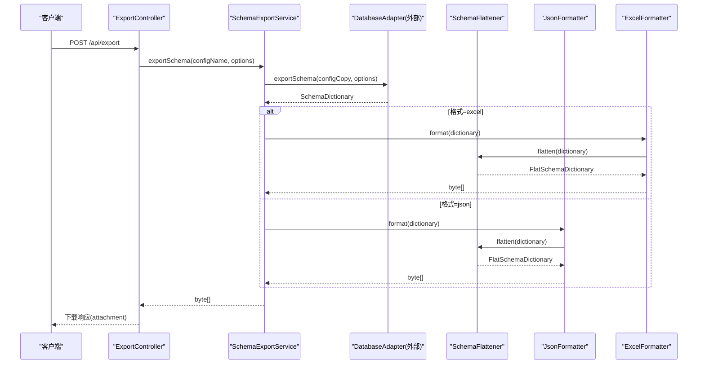
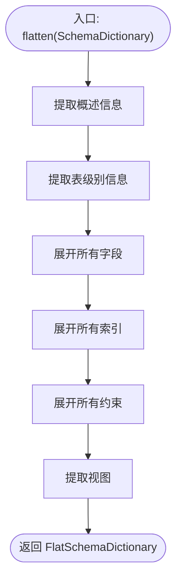
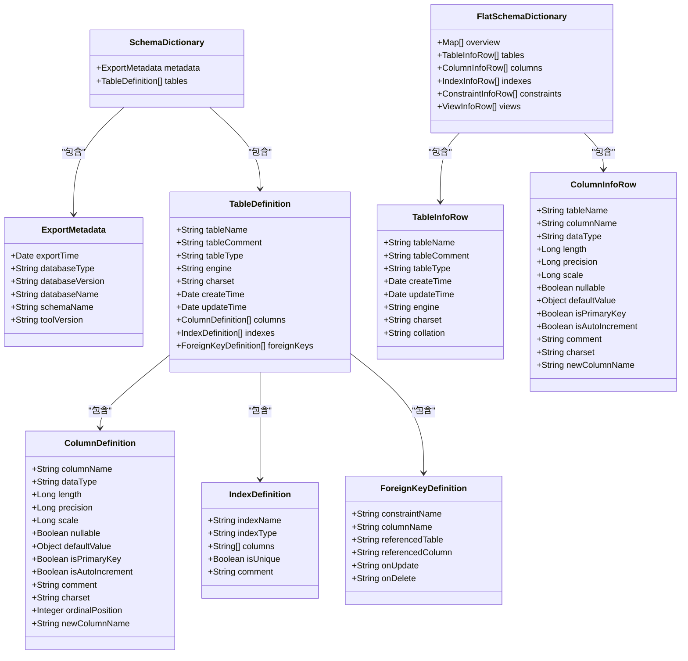
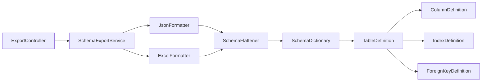

# 导出格式说明

<cite>
**本文引用的文件**   
- [JsonFormatter.java](file://schemasync-backend/src/main/java/com/schemasync/formatter/JsonFormatter.java)
- [ExcelFormatter.java](file://schemasync-backend/src/main/java/com/schemasync/formatter/ExcelFormatter.java)
- [SchemaFlattener.java](file://schemasync-backend/src/main/java/com/schemasync/service/SchemaFlattener.java)
- [FlatSchemaDictionary.java](file://schemasync-backend/src/main/java/com/schemasync/model/dict/FlatSchemaDictionary.java)
- [SchemaDictionary.java](file://schemasync-backend/src/main/java/com/schemasync/model/dict/SchemaDictionary.java)
- [ExportMetadata.java](file://schemasync-backend/src/main/java/com/schemasync/model/dict/ExportMetadata.java)
- [TableDefinition.java](file://schemasync-backend/src/main/java/com/schemasync/model/dict/TableDefinition.java)
- [ColumnDefinition.java](file://schemasync-backend/src/main/java/com/schemasync/model/dict/ColumnDefinition.java)
- [IndexDefinition.java](file://schemasync-backend/src/main/java/com/schemasync/model/dict/IndexDefinition.java)
- [ForeignKeyDefinition.java](file://schemasync-backend/src/main/java/com/schemasync/model/dict/ForeignKeyDefinition.java)
- [TableInfoRow.java](file://schemasync-backend/src/main/java/com/schemasync/model/dict/TableInfoRow.java)
- [ColumnInfoRow.java](file://schemasync-backend/src/main/java/com/schemasync/model/dict/ColumnInfoRow.java)
- [ExportOptions.java](file://schemasync-backend/src/main/java/com/schemasync/adapter/ExportOptions.java)
- [SchemaExportService.java](file://schemasync-backend/src/main/java/com/schemasync/service/SchemaExportService.java)
- [ExportController.java](file://schemasync-backend/src/main/java/com/schemasync/controller/ExportController.java)
</cite>

## 目录
1. [简介](#简介)
2. [项目结构](#项目结构)
3. [核心组件](#核心组件)
4. [架构总览](#架构总览)
5. [详细组件分析](#详细组件分析)
6. [依赖关系分析](#依赖关系分析)
7. [性能与内存优化](#性能与内存优化)
8. [故障排查指南](#故障排查指南)
9. [结论](#结论)
10. [附录：API与文件格式规范](#附录api与文件格式规范)

## 简介
本文件面向“导出格式系统”，聚焦 JSON 与 Excel 两种输出格式的序列化机制、数据结构定义与格式化器实现原理。重点阐述 SchemaDictionary 到扁平化结构的转换算法、字段映射关系与数据完整性保证，并提供格式选项配置、自定义格式化器开发指南、大文件处理策略、批量导出最佳实践以及示例与 API 调用方式。

## 项目结构
导出相关代码主要分布在以下包中：
- formatter：JSON/Excel 格式化器
- service：扁平化转换器与导出服务编排
- model.dict：数据字典模型与扁平化行模型
- adapter：导出选项与数据库适配器（用于获取数据）
- controller：对外暴露的导出接口

图表来源
- [ExportController.java:1-223](file://schemasync-backend/src/main/java/com/schemasync/controller/ExportController.java#L1-L223)
- [SchemaExportService.java:1-141](file://schemasync-backend/src/main/java/com/schemasync/service/SchemaExportService.java#L1-L141)
- [JsonFormatter.java:1-119](file://schemasync-backend/src/main/java/com/schemasync/formatter/JsonFormatter.java#L1-L119)
- [ExcelFormatter.java:1-408](file://schemasync-backend/src/main/java/com/schemasync/formatter/ExcelFormatter.java#L1-L408)
- [SchemaFlattener.java:1-235](file://schemasync-backend/src/main/java/com/schemasync/service/SchemaFlattener.java#L1-L235)
- [SchemaDictionary.java:1-28](file://schemasync-backend/src/main/java/com/schemasync/model/dict/SchemaDictionary.java#L1-L28)
- [FlatSchemaDictionary.java:1-59](file://schemasync-backend/src/main/java/com/schemasync/model/dict/FlatSchemaDictionary.java#L1-L59)
- [ExportMetadata.java:1-59](file://schemasync-backend/src/main/java/com/schemasync/model/dict/ExportMetadata.java#L1-L59)
- [TableDefinition.java:1-89](file://schemasync-backend/src/main/java/com/schemasync/model/dict/TableDefinition.java#L1-L89)
- [ColumnDefinition.java:1-116](file://schemasync-backend/src/main/java/com/schemasync/model/dict/ColumnDefinition.java#L1-L116)
- [IndexDefinition.java:1-49](file://schemasync-backend/src/main/java/com/schemasync/model/dict/IndexDefinition.java#L1-L49)
- [ForeignKeyDefinition.java:1-54](file://schemasync-backend/src/main/java/com/schemasync/model/dict/ForeignKeyDefinition.java#L1-L54)
- [TableInfoRow.java:1-74](file://schemasync-backend/src/main/java/com/schemasync/model/dict/TableInfoRow.java#L1-L74)
- [ColumnInfoRow.java:1-103](file://schemasync-backend/src/main/java/com/schemasync/model/dict/ColumnInfoRow.java#L1-L103)
- [ExportOptions.java:1-122](file://schemasync-backend/src/main/java/com/schemasync/adapter/ExportOptions.java#L1-L122)

章节来源
- [ExportController.java:1-223](file://schemasync-backend/src/main/java/com/schemasync/controller/ExportController.java#L1-L223)
- [SchemaExportService.java:1-141](file://schemasync-backend/src/main/java/com/schemasync/service/SchemaExportService.java#L1-L141)
- [JsonFormatter.java:1-119](file://schemasync-backend/src/main/java/com/schemasync/formatter/JsonFormatter.java#L1-L119)
- [ExcelFormatter.java:1-408](file://schemasync-backend/src/main/java/com/schemasync/formatter/ExcelFormatter.java#L1-L408)
- [SchemaFlattener.java:1-235](file://schemasync-backend/src/main/java/com/schemasync/service/SchemaFlattener.java#L1-L235)

## 核心组件
- 导出服务编排：负责参数校验、连接解密、选择适配器导出数据、按格式选择格式化器并返回字节数组。
- 扁平化转换器：将嵌套的 SchemaDictionary 转换为便于二维展示的 FlatSchemaDictionary（概述、表、字段、索引、约束、视图）。
- JSON 格式化器：基于 Jackson 对扁平化结构进行序列化，支持时间模块与缩进输出。
- Excel 格式化器：基于 Apache POI 生成包含六个 Sheet 的 .xlsx 文件，并对日期、列宽、样式进行处理。
- 数据模型：SchemaDictionary 为根对象，包含元数据与表集合；FlatSchemaDictionary 为扁平化结果，包含六类列表。

章节来源
- [SchemaExportService.java:1-141](file://schemasync-backend/src/main/java/com/schemasync/service/SchemaExportService.java#L1-L141)
- [SchemaFlattener.java:1-235](file://schemasync-backend/src/main/java/com/schemasync/service/SchemaFlattener.java#L1-L235)
- [JsonFormatter.java:1-119](file://schemasync-backend/src/main/java/com/schemasync/formatter/JsonFormatter.java#L1-L119)
- [ExcelFormatter.java:1-408](file://schemasync-backend/src/main/java/com/schemasync/formatter/ExcelFormatter.java#L1-L408)
- [SchemaDictionary.java:1-28](file://schemasync-backend/src/main/java/com/schemasync/model/dict/SchemaDictionary.java#L1-L28)
- [FlatSchemaDictionary.java:1-59](file://schemasync-backend/src/main/java/com/schemasync/model/dict/FlatSchemaDictionary.java#L1-L59)

## 架构总览
导出流程从控制器开始，进入服务层，根据格式选择对应格式化器；格式化器统一通过扁平化转换器将嵌套结构转为扁平结构后再进行序列化或写入 Excel。

图表来源
- [ExportController.java:48-99](file://schemasync-backend/src/main/java/com/schemasync/controller/ExportController.java#L48-L99)
- [SchemaExportService.java:46-111](file://schemasync-backend/src/main/java/com/schemasync/service/SchemaExportService.java#L46-L111)
- [JsonFormatter.java:44-53](file://schemasync-backend/src/main/java/com/schemasync/formatter/JsonFormatter.java#L44-L53)
- [ExcelFormatter.java:39-71](file://schemasync-backend/src/main/java/com/schemasync/formatter/ExcelFormatter.java#L39-L71)
- [SchemaFlattener.java:22-44](file://schemasync-backend/src/main/java/com/schemasync/service/SchemaFlattener.java#L22-L44)

## 详细组件分析

### 扁平化转换器（SchemaFlattener）
职责与算法要点：
- 概述信息：从 ExportMetadata 提取键值对，固定字段包括数据库类型、版本、名称、实例名、导出时间、工具版本。
- 表级别：将 TableDefinition 映射为 TableInfoRow，保留表名、注释、类型、创建/更新时间、引擎、字符集等。
- 字段级别：遍历所有表的 columns，映射为 ColumnInfoRow，包含数据类型、长度、精度、小数位、是否允许NULL、默认值、主键、自增、注释、字符集、新字段名等。
- 索引级别：遍历 indexes，将 columns 列表拼接为字符串，形成 IndexInfoRow。
- 约束级别：遍历 foreignKeys，组合 ON UPDATE/ON DELETE 规则为级联规则字符串，形成 ConstraintInfoRow。
- 视图：过滤 tableType 为 VIEW 的表，映射为 ViewInfoRow（当前视图定义为空占位）。

复杂度分析：
- 时间复杂度：O(T + C + I + F)，其中 T 为表数，C 为字段总数，I 为索引总数，F 为外键总数。
- 空间复杂度：与扁平化结果规模线性相关。

图表来源
- [SchemaFlattener.java:22-44](file://schemasync-backend/src/main/java/com/schemasync/service/SchemaFlattener.java#L22-L44)
- [SchemaFlattener.java:49-63](file://schemasync-backend/src/main/java/com/schemasync/service/SchemaFlattener.java#L49-L63)
- [SchemaFlattener.java:75-97](file://schemasync-backend/src/main/java/com/schemasync/service/SchemaFlattener.java#L75-L97)
- [SchemaFlattener.java:102-135](file://schemasync-backend/src/main/java/com/schemasync/service/SchemaFlattener.java#L102-L135)
- [SchemaFlattener.java:140-165](file://schemasync-backend/src/main/java/com/schemasync/service/SchemaFlattener.java#L140-L165)
- [SchemaFlattener.java:170-209](file://schemasync-backend/src/main/java/com/schemasync/service/SchemaFlattener.java#L170-L209)
- [SchemaFlattener.java:214-233](file://schemasync-backend/src/main/java/com/schemasync/service/SchemaFlattener.java#L214-L233)

章节来源
- [SchemaFlattener.java:1-235](file://schemasync-backend/src/main/java/com/schemasync/service/SchemaFlattener.java#L1-L235)

### JSON 格式化器（JsonFormatter）
- 使用 Jackson ObjectMapper，注册 JavaTimeModule，禁用时间戳输出，启用缩进。
- 提供 format/formatToString 方法，内部先调用扁平化转换器得到 FlatSchemaDictionary，再序列化为字节或字符串。
- 提供 parse/parseString 方法，将 JSON 反序列化为 SchemaDictionary（注意：解析目标为原始嵌套结构）。
- 差异结果序列化方法用于 SchemaDiff 对象。

注意事项：
- 序列化路径始终经过扁平化，确保输出结构一致。
- 异常统一包装为运行时异常并记录日志。

章节来源
- [JsonFormatter.java:1-119](file://schemasync-backend/src/main/java/com/schemasync/formatter/JsonFormatter.java#L1-L119)

### Excel 格式化器（ExcelFormatter）
- 使用 Apache POI XSSFWorkbook 生成 .xlsx。
- 创建六个 Sheet：概述信息、表级别信息、字段级别信息、索引信息、约束信息、视图定义。
- 样式：表头加粗、背景色、边框；数据单元格带边框。
- 自动列宽：设置最小/最大宽度，避免过窄或过宽。
- 特殊类型处理：TEXT/BLOB/JSON/空间类型/ENUM/SET 不显示长度和精度；numeric/decimal 的长度=precision，精度=scale。
- 日期格式化：使用 yyyy-MM-dd HH:mm:ss 模式。

章节来源
- [ExcelFormatter.java:1-408](file://schemasync-backend/src/main/java/com/schemasync/formatter/ExcelFormatter.java#L1-L408)

### 数据模型与映射关系
- SchemaDictionary：根对象，包含 ExportMetadata 与 List<TableDefinition>。
- FlatSchemaDictionary：扁平化结果，包含 overview、tables、columns、indexes、constraints、views 六个列表。
- 行模型：TableInfoRow、ColumnInfoRow 等用于二维展示。
- 字段定义：ColumnDefinition 支持 length/precision/scale 分离，newColumnName 用于重命名场景。
- 索引/外键：IndexDefinition、ForeignKeyDefinition 分别描述索引与外键约束。

图表来源
- [SchemaDictionary.java:1-28](file://schemasync-backend/src/main/java/com/schemasync/model/dict/SchemaDictionary.java#L1-L28)
- [FlatSchemaDictionary.java:1-59](file://schemasync-backend/src/main/java/com/schemasync/model/dict/FlatSchemaDictionary.java#L1-L59)
- [ExportMetadata.java:1-59](file://schemasync-backend/src/main/java/com/schemasync/model/dict/ExportMetadata.java#L1-L59)
- [TableDefinition.java:1-89](file://schemasync-backend/src/main/java/com/schemasync/model/dict/TableDefinition.java#L1-L89)
- [ColumnDefinition.java:1-116](file://schemasync-backend/src/main/java/com/schemasync/model/dict/ColumnDefinition.java#L1-L116)
- [IndexDefinition.java:1-49](file://schemasync-backend/src/main/java/com/schemasync/model/dict/IndexDefinition.java#L1-L49)
- [ForeignKeyDefinition.java:1-54](file://schemasync-backend/src/main/java/com/schemasync/model/dict/ForeignKeyDefinition.java#L1-L54)
- [TableInfoRow.java:1-74](file://schemasync-backend/src/main/java/com/schemasync/model/dict/TableInfoRow.java#L1-L74)
- [ColumnInfoRow.java:1-103](file://schemasync-backend/src/main/java/com/schemasync/model/dict/ColumnInfoRow.java#L1-L103)

章节来源
- [SchemaDictionary.java:1-28](file://schemasync-backend/src/main/java/com/schemasync/model/dict/SchemaDictionary.java#L1-L28)
- [FlatSchemaDictionary.java:1-59](file://schemasync-backend/src/main/java/com/schemasync/model/dict/FlatSchemaDictionary.java#L1-L59)
- [ExportMetadata.java:1-59](file://schemasync-backend/src/main/java/com/schemasync/model/dict/ExportMetadata.java#L1-L59)
- [TableDefinition.java:1-89](file://schemasync-backend/src/main/java/com/schemasync/model/dict/TableDefinition.java#L1-L89)
- [ColumnDefinition.java:1-116](file://schemasync-backend/src/main/java/com/schemasync/model/dict/ColumnDefinition.java#L1-L116)
- [IndexDefinition.java:1-49](file://schemasync-backend/src/main/java/com/schemasync/model/dict/IndexDefinition.java#L1-L49)
- [ForeignKeyDefinition.java:1-54](file://schemasync-backend/src/main/java/com/schemasync/model/dict/ForeignKeyDefinition.java#L1-L54)
- [TableInfoRow.java:1-74](file://schemasync-backend/src/main/java/com/schemasync/model/dict/TableInfoRow.java#L1-L74)
- [ColumnInfoRow.java:1-103](file://schemasync-backend/src/main/java/com/schemasync/model/dict/ColumnInfoRow.java#L1-L103)

### 导出选项配置（ExportOptions）
- 支持格式选择：json/excel（默认 excel）。
- 支持数据库、schema、表名模式过滤、排除表列表。
- 开关控制：是否包含索引、外键、视图。
- 提供 Builder 构建器以链式设置。

章节来源
- [ExportOptions.java:1-122](file://schemasync-backend/src/main/java/com/schemasync/adapter/ExportOptions.java#L1-L122)

## 依赖关系分析
- 控制器依赖服务层，服务层依赖适配器工厂与格式化器。
- 格式化器依赖扁平化转换器。
- 扁平化转换器依赖数据模型。
- 无循环依赖，耦合清晰，职责单一。

图表来源
- [ExportController.java:1-223](file://schemasync-backend/src/main/java/com/schemasync/controller/ExportController.java#L1-L223)
- [SchemaExportService.java:1-141](file://schemasync-backend/src/main/java/com/schemasync/service/SchemaExportService.java#L1-L141)
- [JsonFormatter.java:1-119](file://schemasync-backend/src/main/java/com/schemasync/formatter/JsonFormatter.java#L1-L119)
- [ExcelFormatter.java:1-408](file://schemasync-backend/src/main/java/com/schemasync/formatter/ExcelFormatter.java#L1-L408)
- [SchemaFlattener.java:1-235](file://schemasync-backend/src/main/java/com/schemasync/service/SchemaFlattener.java#L1-L235)
- [SchemaDictionary.java:1-28](file://schemasync-backend/src/main/java/com/schemasync/model/dict/SchemaDictionary.java#L1-L28)
- [TableDefinition.java:1-89](file://schemasync-backend/src/main/java/com/schemasync/model/dict/TableDefinition.java#L1-L89)
- [ColumnDefinition.java:1-116](file://schemasync-backend/src/main/java/com/schemasync/model/dict/ColumnDefinition.java#L1-L116)
- [IndexDefinition.java:1-49](file://schemasync-backend/src/main/java/com/schemasync/model/dict/IndexDefinition.java#L1-L49)
- [ForeignKeyDefinition.java:1-54](file://schemasync-backend/src/main/java/com/schemasync/model/dict/ForeignKeyDefinition.java#L1-L54)

章节来源
- [ExportController.java:1-223](file://schemasync-backend/src/main/java/com/schemasync/controller/ExportController.java#L1-L223)
- [SchemaExportService.java:1-141](file://schemasync-backend/src/main/java/com/schemasync/service/SchemaExportService.java#L1-L141)

## 性能与内存优化
- 流式写入建议：当前 Excel 生成在内存中构建 Workbook 后一次性写出，适合中小规模数据。对于大规模数据，可考虑分批次写入或使用 SXSSFWorkbook 流式模式以降低峰值内存占用。
- 列宽优化：autoSizeColumn 会遍历内容计算宽度，数据量大时可限制列数或采用固定宽度策略减少计算开销。
- 日期格式化：避免重复创建 SimpleDateFormat，可在类级别复用或改用线程安全的时间格式化方案。
- JSON 序列化：Jackson 已启用缩进，生产环境可按需关闭以提升吞吐。
- 批处理导出：建议按 schema 或表前缀分批调用导出接口，降低单次请求负载。

[本节为通用指导，无需源码引用]

## 故障排查指南
- 参数校验失败：configName 或 database 为空时抛出非法参数异常。
- 配置不存在：找不到数据源配置时抛出运行时异常。
- 密码解密失败：加密字段解密异常会被捕获并记录日志，不影响后续流程但可能导致连接失败。
- 导出失败：统一捕获异常并记录错误堆栈，返回包含错误信息的运行时异常。
- Excel 生成失败：IO 异常被捕获并包装为运行时异常，附带消息。

章节来源
- [ExportController.java:57-64](file://schemasync-backend/src/main/java/com/schemasync/controller/ExportController.java#L57-L64)
- [ExportController.java:107-115](file://schemasync-backend/src/main/java/com/schemasync/controller/ExportController.java#L107-L115)
- [SchemaExportService.java:49-57](file://schemasync-backend/src/main/java/com/schemasync/service/SchemaExportService.java#L49-L57)
- [SchemaExportService.java:66-69](file://schemasync-backend/src/main/java/com/schemasync/service/SchemaExportService.java#L66-L69)
- [SchemaExportService.java:75-83](file://schemasync-backend/src/main/java/com/schemasync/service/SchemaExportService.java#L75-L83)
- [SchemaExportService.java:107-110](file://schemasync-backend/src/main/java/com/schemasync/service/SchemaExportService.java#L107-L110)
- [ExcelFormatter.java:67-70](file://schemasync-backend/src/main/java/com/schemasync/formatter/ExcelFormatter.java#L67-L70)

## 结论
导出格式系统通过清晰的层次划分与可扩展的格式化器设计，实现了 JSON 与 Excel 双格式输出。扁平化转换器确保了数据的一致性与可读性，配合完善的选项配置与错误处理，能够满足多数据库类型的导出需求。针对大数据量场景，建议在 Excel 侧引入流式写入与列宽优化策略，进一步提升性能与稳定性。

[本节为总结，无需源码引用]

## 附录：API与文件格式规范

### API 调用示例
- 导出接口
  - 方法：POST
  - 路径：/api/export
  - 参数：
    - configName：数据源配置名称（必填）
    - database：数据库名称（必填）
    - schema：SCHEMA 名称（可选）
    - tablePattern：表名模式过滤（可选）
    - excludeTables：排除表列表（可选）
  - 响应：二进制文件下载（application/octet-stream），文件名含数据库名与时间戳，扩展名为 .xlsx 或 .json

- 获取数据库列表
  - 方法：GET
  - 路径：/api/export/databases
  - 参数：configName（必填）
  - 响应：数据库名称列表

- 获取 SCHEMA 列表
  - 方法：GET
  - 路径：/api/export/schemas
  - 参数：configName（必填）、database（必填）
  - 响应：SCHEMA 名称列表

章节来源
- [ExportController.java:48-99](file://schemasync-backend/src/main/java/com/schemasync/controller/ExportController.java#L48-L99)
- [ExportController.java:101-144](file://schemasync-backend/src/main/java/com/schemasync/controller/ExportController.java#L101-L144)
- [ExportController.java:146-201](file://schemasync-backend/src/main/java/com/schemasync/controller/ExportController.java#L146-L201)

### JSON 文件格式规范
- 根节点：由扁平化转换器生成的 FlatSchemaDictionary 结构，包含六个顶级列表：overview、tables、columns、indexes、constraints、views。
- 概述信息：键值对列表，字段包括数据库类型、版本、名称、实例名、导出时间、工具版本。
- 表级别：每个表一行，包含表名、注释、类型、创建/更新时间、引擎、字符集等。
- 字段级别：每个字段一行，包含数据类型、长度、精度、小数位、是否允许NULL、默认值、主键、自增、注释、字符集、新字段名等。
- 索引级别：每个索引一行，包含索引名、类型、字段列表（逗号分隔）、备注。
- 约束级别：每个外键一行，包含约束名、类型（FK）、引用表、引用字段、级联规则（组合 ON UPDATE/DELETE）、备注。
- 视图：每个视图一行，包含视图名、视图定义（当前为空占位）、备注。

章节来源
- [FlatSchemaDictionary.java:1-59](file://schemasync-backend/src/main/java/com/schemasync/model/dict/FlatSchemaDictionary.java#L1-L59)
- [SchemaFlattener.java:49-63](file://schemasync-backend/src/main/java/com/schemasync/service/SchemaFlattener.java#L49-L63)
- [SchemaFlattener.java:75-97](file://schemasync-backend/src/main/java/com/schemasync/service/SchemaFlattener.java#L75-L97)
- [SchemaFlattener.java:102-135](file://schemasync-backend/src/main/java/com/schemasync/service/SchemaFlattener.java#L102-L135)
- [SchemaFlattener.java:140-165](file://schemasync-backend/src/main/java/com/schemasync/service/SchemaFlattener.java#L140-L165)
- [SchemaFlattener.java:170-209](file://schemasync-backend/src/main/java/com/schemasync/service/SchemaFlattener.java#L170-L209)
- [SchemaFlattener.java:214-233](file://schemasync-backend/src/main/java/com/schemasync/service/SchemaFlattener.java#L214-L233)

### Excel 文件格式规范
- 工作簿包含六个 Sheet：
  - 概述信息：两列（字段名、值）
  - 表级别信息：八列（表名、表注释、表类型、创建时间、更新时间、存储引擎、字符集、排序规则）
  - 字段级别信息：十二列（表名、字段名称、数据类型、长度、精度、是否允许NULL、默认值、是否主键、是否自增、字段注释、字符集、字段名称(新)）
  - 索引信息：五列（表名、索引名称、索引类型、索引字段及顺序、索引备注）
  - 约束信息：七列（表名、约束名称、约束类型、引用表、引用字段、级联规则、备注）
  - 视图定义：三列（视图名称、视图SQL定义、备注）
- 样式与列宽：表头加粗与背景色，数据单元格带边框；自动列宽并限制最小/最大宽度。
- 特殊类型处理：TEXT/BLOB/JSON/空间类型/ENUM/SET 不显示长度与精度；numeric/decimal 的长度=precision，精度=scale。

章节来源
- [ExcelFormatter.java:76-103](file://schemasync-backend/src/main/java/com/schemasync/formatter/ExcelFormatter.java#L76-L103)
- [ExcelFormatter.java:108-137](file://schemasync-backend/src/main/java/com/schemasync/formatter/ExcelFormatter.java#L108-L137)
- [ExcelFormatter.java:142-203](file://schemasync-backend/src/main/java/com/schemasync/formatter/ExcelFormatter.java#L142-L203)
- [ExcelFormatter.java:208-233](file://schemasync-backend/src/main/java/com/schemasync/formatter/ExcelFormatter.java#L208-L233)
- [ExcelFormatter.java:238-265](file://schemasync-backend/src/main/java/com/schemasync/formatter/ExcelFormatter.java#L238-L265)
- [ExcelFormatter.java:270-293](file://schemasync-backend/src/main/java/com/schemasync/formatter/ExcelFormatter.java#L270-L293)
- [ExcelFormatter.java:298-323](file://schemasync-backend/src/main/java/com/schemasync/formatter/ExcelFormatter.java#L298-L323)
- [ExcelFormatter.java:351-362](file://schemasync-backend/src/main/java/com/schemasync/formatter/ExcelFormatter.java#L351-L362)
- [ExcelFormatter.java:371-406](file://schemasync-backend/src/main/java/com/schemasync/formatter/ExcelFormatter.java#L371-L406)

### 自定义格式化器开发指南
- 新增格式步骤：
  - 新建格式化器类，注入 SchemaFlattener。
  - 实现 format(SchemaDictionary) 方法，内部调用扁平化转换器获取 FlatSchemaDictionary。
  - 在 SchemaExportService 中添加格式分支，路由到新格式化器。
- 注意事项：
  - 保持与现有格式化器一致的异常处理与日志记录。
  - 若涉及大量数据，优先考虑流式写入与内存优化。
  - 遵循统一的字段映射与命名约定，确保下游消费方一致性。

章节来源
- [JsonFormatter.java:44-53](file://schemasync-backend/src/main/java/com/schemasync/formatter/JsonFormatter.java#L44-L53)
- [ExcelFormatter.java:39-71](file://schemasync-backend/src/main/java/com/schemasync/formatter/ExcelFormatter.java#L39-L71)
- [SchemaExportService.java:93-97](file://schemasync-backend/src/main/java/com/schemasync/service/SchemaExportService.java#L93-L97)