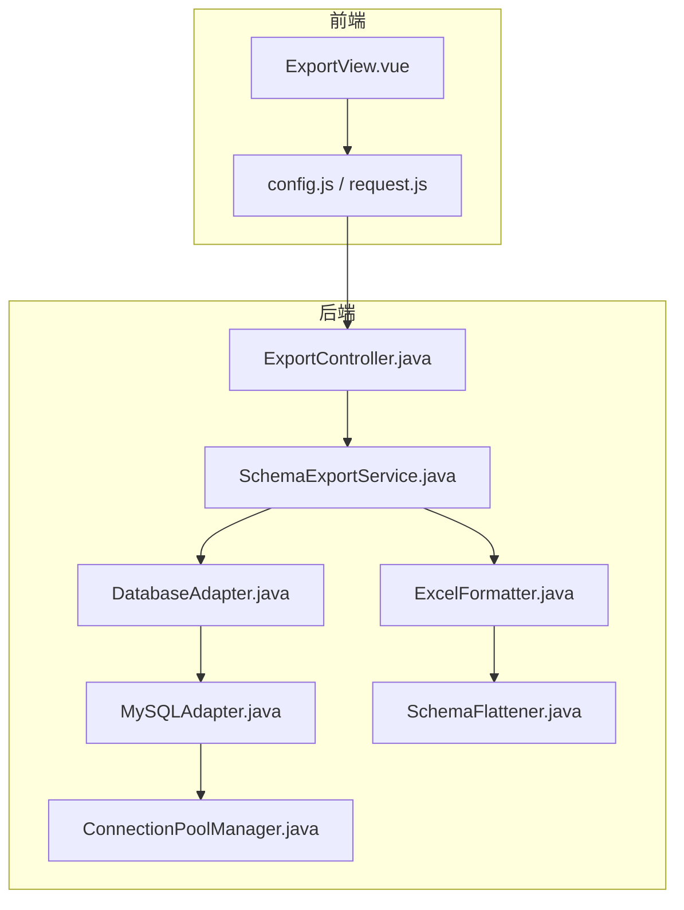
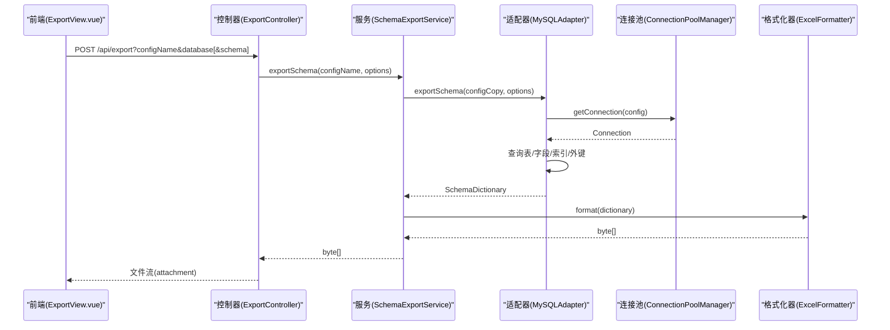
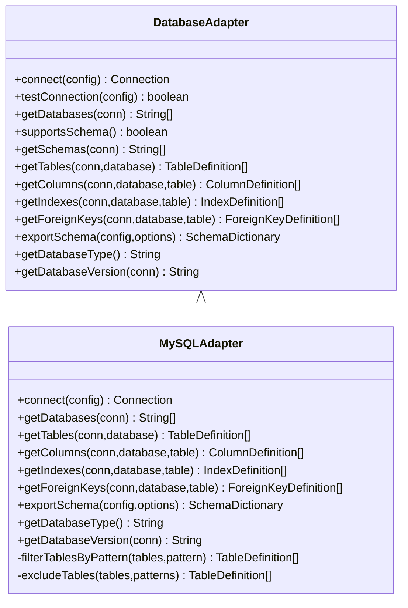
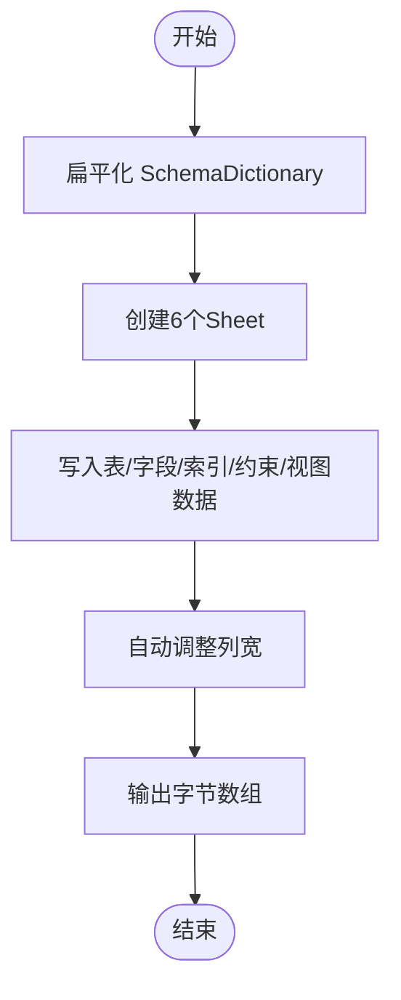
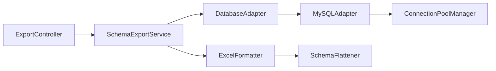

# 导出流程与配置

<cite>
**本文引用的文件**   
- [ExportController.java](file://schemasync-backend/src/main/java/com/schemasync/controller/ExportController.java)
- [SchemaExportService.java](file://schemasync-backend/src/main/java/com/schemasync/service/SchemaExportService.java)
- [ExportOptions.java](file://schemasync-backend/src/main/java/com/schemasync/adapter/ExportOptions.java)
- [DatabaseAdapter.java](file://schemasync-backend/src/main/java/com/schemasync/adapter/DatabaseAdapter.java)
- [MySQLAdapter.java](file://schemasync-backend/src/main/java/com/schemasync/adapter/MySQLAdapter.java)
- [ExcelFormatter.java](file://schemasync-backend/src/main/java/com/schemasync/formatter/ExcelFormatter.java)
- [SchemaFlattener.java](file://schemasync-backend/src/main/java/com/schemasync/service/SchemaFlattener.java)
- [SchemaDictionary.java](file://schemasync-backend/src/main/java/com/schemasync/model/dict/SchemaDictionary.java)
- [TableDefinition.java](file://schemasync-backend/src/main/java/com/schemasync/model/dict/TableDefinition.java)
- [ConnectionPoolManager.java](file://schemasync-backend/src/main/java/com/schemasync/util/ConnectionPoolManager.java)
- [application.yml](file://schemasync-backend/src/main/resources/application.yml)
- [ExportView.vue](file://schemasync-frontend/src/views/ExportView.vue)
- [config.js](file://schemasync-frontend/src/api/config.js)
- [request.js](file://schemasync-frontend/src/api/request.js)
</cite>

## 目录
1. [简介](#简介)
2. [项目结构](#项目结构)
3. [核心组件](#核心组件)
4. [架构总览](#架构总览)
5. [详细组件分析](#详细组件分析)
6. [依赖关系分析](#依赖关系分析)
7. [性能与优化](#性能与优化)
8. [故障排查指南](#故障排查指南)
9. [结论](#结论)
10. [附录：API规范与使用示例](#附录api规范与使用示例)

## 简介
本文件面向数据字典导出工作流，覆盖从前端界面操作到后端服务处理、数据库连接与元数据提取的完整链路。重点说明 ExportOptions 配置参数、表过滤与排除规则、进度监控机制、错误处理策略；提供 RESTful API 接口规范、请求响应格式与前端操作指南；并给出大数据库导出的优化建议、并发控制、事务管理与资源清理机制，以及端到端使用示例和常见问题排查方法。

## 项目结构
后端采用分层架构：控制器层暴露REST接口，服务层编排导出流程，适配器层对接不同数据库类型，格式化器负责将内存中的 SchemaDictionary 转换为 Excel/JSON 输出；前端基于 Vue + Element Plus 提供可视化选择与下载能力。

图表来源
- [ExportView.vue:1-278](file://schemasync-frontend/src/views/ExportView.vue#L1-L278)
- [config.js:1-50](file://schemasync-frontend/src/api/config.js#L1-L50)
- [request.js:1-31](file://schemasync-frontend/src/api/request.js#L1-L31)
- [ExportController.java:1-223](file://schemasync-backend/src/main/java/com/schemasync/controller/ExportController.java#L1-L223)
- [SchemaExportService.java:1-141](file://schemasync-backend/src/main/java/com/schemasync/service/SchemaExportService.java#L1-L141)
- [DatabaseAdapter.java:1-134](file://schemasync-backend/src/main/java/com/schemasync/adapter/DatabaseAdapter.java#L1-L134)
- [MySQLAdapter.java:1-367](file://schemasync-backend/src/main/java/com/schemasync/adapter/MySQLAdapter.java#L1-L367)
- [ExcelFormatter.java:1-408](file://schemasync-backend/src/main/java/com/schemasync/formatter/ExcelFormatter.java#L1-L408)
- [SchemaFlattener.java:1-235](file://schemasync-backend/src/main/java/com/schemasync/service/SchemaFlattener.java#L1-L235)
- [ConnectionPoolManager.java:1-258](file://schemasync-backend/src/main/java/com/schemasync/util/ConnectionPoolManager.java#L1-L258)

章节来源
- [ExportController.java:1-223](file://schemasync-backend/src/main/java/com/schemasync/controller/ExportController.java#L1-L223)
- [SchemaExportService.java:1-141](file://schemasync-backend/src/main/java/com/schemasync/service/SchemaExportService.java#L1-L141)
- [ExportOptions.java:1-122](file://schemasync-backend/src/main/java/com/schemasync/adapter/ExportOptions.java#L1-L122)
- [DatabaseAdapter.java:1-134](file://schemasync-backend/src/main/java/com/schemasync/adapter/DatabaseAdapter.java#L1-L134)
- [MySQLAdapter.java:1-367](file://schemasync-backend/src/main/java/com/schemasync/adapter/MySQLAdapter.java#L1-L367)
- [ExcelFormatter.java:1-408](file://schemasync-backend/src/main/java/com/schemasync/formatter/ExcelFormatter.java#L1-L408)
- [SchemaFlattener.java:1-235](file://schemasync-backend/src/main/java/com/schemasync/service/SchemaFlattener.java#L1-L235)
- [SchemaDictionary.java:1-28](file://schemasync-backend/src/main/java/com/schemasync/model/dict/SchemaDictionary.java#L1-L28)
- [TableDefinition.java:1-89](file://schemasync-backend/src/main/java/com/schemasync/model/dict/TableDefinition.java#L1-L89)
- [ConnectionPoolManager.java:1-258](file://schemasync-backend/src/main/java/com/schemasync/util/ConnectionPoolManager.java#L1-L258)
- [application.yml:1-83](file://schemasync-backend/src/main/resources/application.yml#L1-L83)
- [ExportView.vue:1-278](file://schemasync-frontend/src/views/ExportView.vue#L1-L278)
- [config.js:1-50](file://schemasync-frontend/src/api/config.js#L1-L50)
- [request.js:1-31](file://schemasync-frontend/src/api/request.js#L1-L31)

## 核心组件
- 控制器层
  - 提供导出入口与辅助查询（数据库列表、SCHEMA列表）接口，负责参数校验、构建导出选项、生成文件名与响应头。
- 服务层
  - 统一编排导出流程：加载配置、解密密码、获取适配器、执行导出、选择格式化器、统计耗时。
- 适配器层
  - 抽象数据库差异，实现具体数据库的元数据读取与导出逻辑；支持表模式匹配与排除。
- 格式化器与扁平化
  - 将嵌套的 SchemaDictionary 扁平化为多Sheet表格结构，便于阅读与二次加工。
- 连接池管理
  - 基于 HikariCP 管理连接池生命周期，避免泄漏，支持自定义JDBC URL与连接池参数。

章节来源
- [ExportController.java:1-223](file://schemasync-backend/src/main/java/com/schemasync/controller/ExportController.java#L1-L223)
- [SchemaExportService.java:1-141](file://schemasync-backend/src/main/java/com/schemasync/service/SchemaExportService.java#L1-L141)
- [DatabaseAdapter.java:1-134](file://schemasync-backend/src/main/java/com/schemasync/adapter/DatabaseAdapter.java#L1-L134)
- [MySQLAdapter.java:1-367](file://schemasync-backend/src/main/java/com/schemasync/adapter/MySQLAdapter.java#L1-L367)
- [ExcelFormatter.java:1-408](file://schemasync-backend/src/main/java/com/schemasync/formatter/ExcelFormatter.java#L1-L408)
- [SchemaFlattener.java:1-235](file://schemasync-backend/src/main/java/com/schemasync/service/SchemaFlattener.java#L1-L235)
- [ConnectionPoolManager.java:1-258](file://schemasync-backend/src/main/java/com/schemasync/util/ConnectionPoolManager.java#L1-L258)

## 架构总览
以下序列图展示一次完整的导出调用链：前端发起请求 → 控制器校验与构建选项 → 服务层编排 → 适配器读取元数据 → 格式化器生成文件 → 返回二进制流。

图表来源
- [ExportController.java:48-99](file://schemasync-backend/src/main/java/com/schemasync/controller/ExportController.java#L48-L99)
- [SchemaExportService.java:46-111](file://schemasync-backend/src/main/java/com/schemasync/service/SchemaExportService.java#L46-L111)
- [MySQLAdapter.java:225-303](file://schemasync-backend/src/main/java/com/schemasync/adapter/MySQLAdapter.java#L225-L303)
- [ConnectionPoolManager.java:36-49](file://schemasync-backend/src/main/java/com/schemasync/util/ConnectionPoolManager.java#L36-L49)
- [ExcelFormatter.java:39-71](file://schemasync-backend/src/main/java/com/schemasync/formatter/ExcelFormatter.java#L39-L71)

## 详细组件分析

### 导出选项 ExportOptions
- 字段与作用
  - format: 输出格式(json/excel)，默认excel
  - database: 目标数据库名
  - schema: SCHEMA名称（仅支持SCHEMA的数据库）
  - tablePattern: 表名模式过滤（支持通配符*、?）
  - excludeTables: 排除表名列表（支持通配符）
  - includeIndexes/includeForeignKeys/includeViews: 是否包含索引/外键/视图
- 构建方式
  - 通过 Builder 模式逐步设置后 build() 生成不可变对象

章节来源
- [ExportOptions.java:1-122](file://schemasync-backend/src/main/java/com/schemasync/adapter/ExportOptions.java#L1-L122)

### 控制器 ExportController
- 主要职责
  - 接收导出请求，校验必填参数，构建 ExportOptions
  - 调用服务层执行导出，设置响应头与文件名
  - 提供 /databases 与 /schemas 辅助接口，用于前端级联选择
- 关键行为
  - 固定当前导出格式为 excel
  - 文件名包含数据库名、时间戳与毫秒值，扩展名由格式决定
  - 对数据库/SCHEMA列表接口进行权限与连通性检查，必要时解密密码

章节来源
- [ExportController.java:48-99](file://schemasync-backend/src/main/java/com/schemasync/controller/ExportController.java#L48-L99)
- [ExportController.java:101-144](file://schemasync-backend/src/main/java/com/schemasync/controller/ExportController.java#L101-L144)
- [ExportController.java:146-201](file://schemasync-backend/src/main/java/com/schemasync/controller/ExportController.java#L146-L201)

### 服务层 SchemaExportService
- 主要职责
  - 校验输入参数，解析配置，解密密码
  - 根据配置类型选择适配器，执行导出
  - 根据 format 选择 JSON/Excel 格式化器
  - 记录各阶段耗时与总体耗时
- 异常处理
  - 参数非法抛出运行时异常
  - 导出失败包装原始异常并向上抛出

章节来源
- [SchemaExportService.java:46-111](file://schemasync-backend/src/main/java/com/schemasync/service/SchemaExportService.java#L46-L111)

### 适配器 DatabaseAdapter 与 MySQLAdapter
- 接口约定
  - connect/testConnection/getDatabases/supportsSchema/getSchemas
  - getTables/getColumns/getIndexes/getForeignKeys
  - exportSchema(getDatabaseType/getDatabaseVersion)
- MySQL 实现要点
  - 通过 INFORMATION_SCHEMA 查询表、字段、索引、外键
  - 支持按 tablePattern 过滤与 excludeTables 排除（通配符转正则）
  - 在导出过程中逐表收集详情，并按每10张表或完成时打印进度日志
  - 连接通过 ConnectionPoolManager 获取

图表来源
- [DatabaseAdapter.java:17-133](file://schemasync-backend/src/main/java/com/schemasync/adapter/DatabaseAdapter.java#L17-L133)
- [MySQLAdapter.java:24-367](file://schemasync-backend/src/main/java/com/schemasync/adapter/MySQLAdapter.java#L24-L367)

章节来源
- [DatabaseAdapter.java:1-134](file://schemasync-backend/src/main/java/com/schemasync/adapter/DatabaseAdapter.java#L1-L134)
- [MySQLAdapter.java:1-367](file://schemasync-backend/src/main/java/com/schemasync/adapter/MySQLAdapter.java#L1-L367)

### 格式化器与扁平化 ExcelFormatter / SchemaFlattener
- SchemaFlattener
  - 将嵌套的 SchemaDictionary 展开为概述、表、字段、索引、约束、视图等扁平集合
- ExcelFormatter
  - 创建6个Sheet：概述信息、表级别信息、字段级别信息、索引信息、约束信息、视图定义
  - 自动调整列宽，处理日期与数值类型，兼容多种数据类型长度/精度显示

图表来源
- [SchemaFlattener.java:22-44](file://schemasync-backend/src/main/java/com/schemasync/service/SchemaFlattener.java#L22-L44)
- [ExcelFormatter.java:39-71](file://schemasync-backend/src/main/java/com/schemasync/formatter/ExcelFormatter.java#L39-L71)

章节来源
- [ExcelFormatter.java:1-408](file://schemasync-backend/src/main/java/com/schemasync/formatter/ExcelFormatter.java#L1-L408)
- [SchemaFlattener.java:1-235](file://schemasync-backend/src/main/java/com/schemasync/service/SchemaFlattener.java#L1-L235)

### 模型 SchemaDictionary / TableDefinition
- SchemaDictionary
  - 包含导出元数据 metadata 与表定义列表 tables
- TableDefinition
  - 表基本信息、字段/索引/外键集合、时间与字符集等

章节来源
- [SchemaDictionary.java:1-28](file://schemasync-backend/src/main/java/com/schemasync/model/dict/SchemaDictionary.java#L1-L28)
- [TableDefinition.java:1-89](file://schemasync-backend/src/main/java/com/schemasync/model/dict/TableDefinition.java#L1-L89)

### 连接池 ConnectionPoolManager
- 功能
  - 基于 HikariCP 管理连接池缓存，按“类型:主机:端口:库:用户”作为key
  - 支持自定义JDBC URL与连接池参数（maximumPoolSize、minimumIdle、connectionTimeout、idleTimeout、maxLifetime）
  - 提供关闭单个/全部连接池的能力，防止资源泄漏

章节来源
- [ConnectionPoolManager.java:1-258](file://schemasync-backend/src/main/java/com/schemasync/util/ConnectionPoolManager.java#L1-L258)

## 依赖关系分析
- 组件耦合
  - 控制器依赖服务与工厂；服务依赖配置、适配器与格式化器；适配器依赖连接池
- 外部依赖
  - Apache POI（Excel生成）、HikariCP（连接池）、Jackson（序列化）
- 潜在循环
  - 当前分层清晰，未发现循环依赖

图表来源
- [ExportController.java:1-223](file://schemasync-backend/src/main/java/com/schemasync/controller/ExportController.java#L1-L223)
- [SchemaExportService.java:1-141](file://schemasync-backend/src/main/java/com/schemasync/service/SchemaExportService.java#L1-L141)
- [DatabaseAdapter.java:1-134](file://schemasync-backend/src/main/java/com/schemasync/adapter/DatabaseAdapter.java#L1-L134)
- [MySQLAdapter.java:1-367](file://schemasync-backend/src/main/java/com/schemasync/adapter/MySQLAdapter.java#L1-L367)
- [ExcelFormatter.java:1-408](file://schemasync-backend/src/main/java/com/schemasync/formatter/ExcelFormatter.java#L1-L408)
- [SchemaFlattener.java:1-235](file://schemasync-backend/src/main/java/com/schemasync/service/SchemaFlattener.java#L1-L235)
- [ConnectionPoolManager.java:1-258](file://schemasync-backend/src/main/java/com/schemasync/util/ConnectionPoolManager.java#L1-L258)

## 性能与优化
- 大数据库导出优化
  - 使用连接池复用连接，减少握手开销
  - 按需导出：通过 tablePattern 与 excludeTables 缩小范围
  - 选择性导出：关闭 includeIndexes/includeForeignKeys/includeViews 以减少IO
  - 分批次处理：适配器内部已按每10张表输出进度日志，便于观察与定位瓶颈
- 并发控制
  - 当前导出为同步串行处理单库；如需并发，可在服务层引入线程池并对不同库并行导出，注意连接池上限与数据库负载
- 事务管理
  - 导出为只读查询，无需显式事务；若后续增加写操作，需结合业务设计事务边界
- 资源清理
  - 连接使用 try-with-resources 释放；连接池提供 closeAll/closePool 确保无泄漏
- 网络与序列化
  - 大文件下载建议使用流式传输；当前以字节数组返回，适合中小规模导出

章节来源
- [MySQLAdapter.java:225-303](file://schemasync-backend/src/main/java/com/schemasync/adapter/MySQLAdapter.java#L225-L303)
- [ConnectionPoolManager.java:218-258](file://schemasync-backend/src/main/java/com/schemasync/util/ConnectionPoolManager.java#L218-L258)
- [application.yml:1-83](file://schemasync-backend/src/main/resources/application.yml#L1-L83)

## 故障排查指南
- 常见错误与定位
  - 参数缺失：configName/database为空会抛异常，检查前端表单与URL参数
  - 配置不存在：服务层找不到配置，检查配置中心或配置文件
  - 密码解密失败：查看日志中“密码解密失败”，确认加密算法与密钥
  - 数据库不支持SCHEMA：非PG/GaussDB类数据库不支持，前端应隐藏SCHEMA选择
  - 连接超时/拒绝：检查host/port/用户名/密码/JDBC URL与防火墙
  - 导出失败：查看服务层日志堆栈，定位具体步骤（连接/查询/格式化）
- 日志与监控
  - 应用日志级别：root INFO，com.schemasync DEBUG
  - 关键日志点：导出开始/结束、各阶段耗时、进度日志、连接池创建/关闭
- 前端错误提示
  - 请求拦截器统一捕获错误并提示；导出失败时会尝试解析错误消息

章节来源
- [ExportController.java:57-64](file://schemasync-backend/src/main/java/com/schemasync/controller/ExportController.java#L57-L64)
- [SchemaExportService.java:46-111](file://schemasync-backend/src/main/java/com/schemasync/service/SchemaExportService.java#L46-L111)
- [ExportView.vue:190-270](file://schemasync-frontend/src/views/ExportView.vue#L190-L270)
- [request.js:20-28](file://schemasync-frontend/src/api/request.js#L20-L28)
- [application.yml:25-35](file://schemasync-backend/src/main/resources/application.yml#L25-L35)

## 结论
该导出流程以清晰的层次划分与可扩展的适配器模式支撑多数据库类型，配合连接池与格式化器实现了稳定高效的字典导出。通过合理的过滤与选择性导出，可显著降低大库导出压力。建议在后续版本中增强进度回调与断点续传能力，以满足更大规模场景。

## 附录：API规范与使用示例

### RESTful 接口规范
- 导出数据字典
  - 方法：POST
  - 路径：/api/export
  - 参数
    - configName: 字符串，必填
    - database: 字符串，必填
    - schema: 字符串，可选（仅支持SCHEMA的数据库）
    - tablePattern: 字符串，可选（通配符*、?）
    - excludeTables: 字符串，可选（逗号分隔或多参，视前端拼装）
  - 响应
    - 成功：HTTP 200，Content-Type: application/octet-stream，Content-Disposition: attachment; filename=...
    - 失败：HTTP 4xx/5xx，响应体可能为JSON错误信息
- 获取数据库列表
  - 方法：GET
  - 路径：/api/export/databases
  - 参数：configName（必填）
  - 响应：List<String>
- 获取SCHEMA列表
  - 方法：GET
  - 路径：/api/export/schemas
  - 参数：configName（必填）、database（必填）
  - 响应：List<String>

章节来源
- [ExportController.java:48-99](file://schemasync-backend/src/main/java/com/schemasync/controller/ExportController.java#L48-L99)
- [ExportController.java:101-144](file://schemasync-backend/src/main/java/com/schemasync/controller/ExportController.java#L101-L144)
- [ExportController.java:146-201](file://schemasync-backend/src/main/java/com/schemasync/controller/ExportController.java#L146-L201)

### 前端界面操作指南
- 打开“数据字典导出”页面
- 选择数据源后自动加载数据库列表；如数据库支持SCHEMA，则进一步加载SCHEMA列表
- 填写/选择数据库与SCHEMA（可选），点击“导出数据字典”
- 浏览器将触发下载，文件名包含数据库名与时间戳

章节来源
- [ExportView.vue:1-278](file://schemasync-frontend/src/views/ExportView.vue#L1-L278)
- [config.js:41-49](file://schemasync-frontend/src/api/config.js#L41-L49)
- [request.js:1-31](file://schemasync-frontend/src/api/request.js#L1-L31)

### 端到端使用示例
- 步骤
  - 启动后端服务（默认端口8999）
  - 在前端选择数据源与数据库
  - 点击导出，等待下载完成
- 验证
  - 打开下载的Excel，检查“概述信息”、“表级别信息”、“字段级别信息”等Sheet内容是否符合预期

章节来源
- [application.yml:1-10](file://schemasync-backend/src/main/resources/application.yml#L1-L10)
- [ExportView.vue:190-270](file://schemasync-frontend/src/views/ExportView.vue#L190-L270)