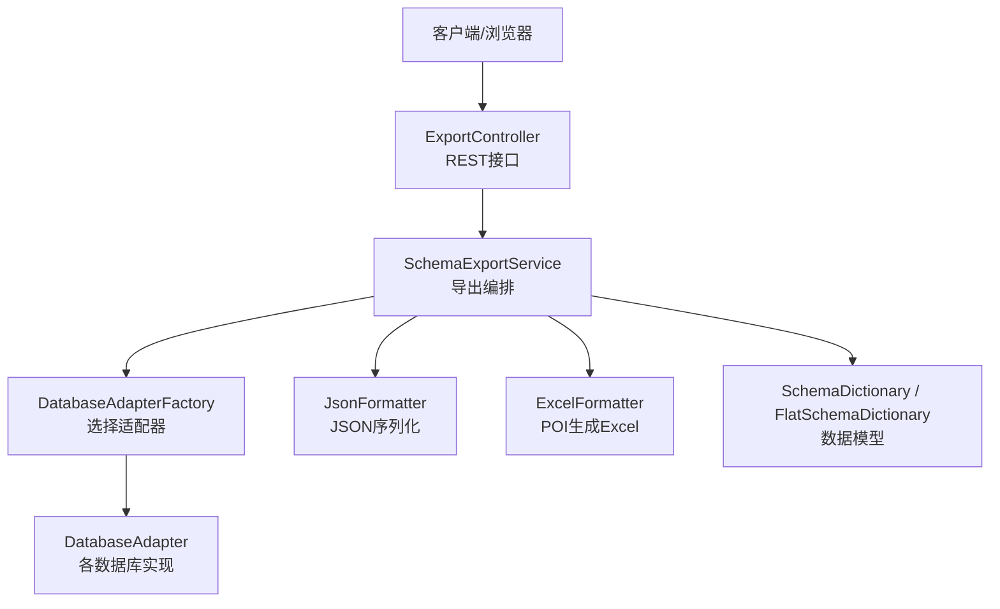
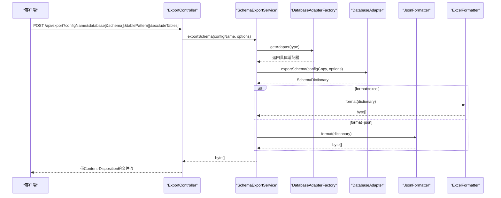
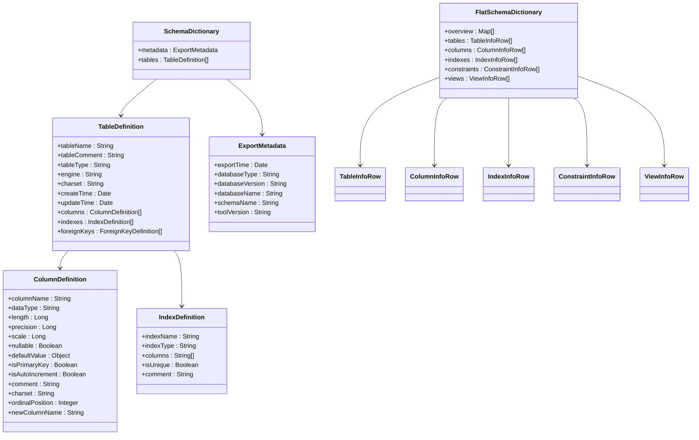
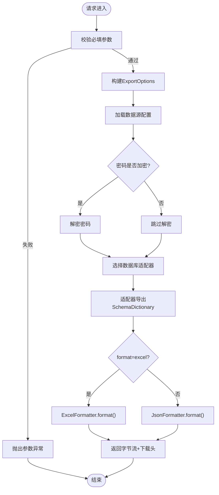
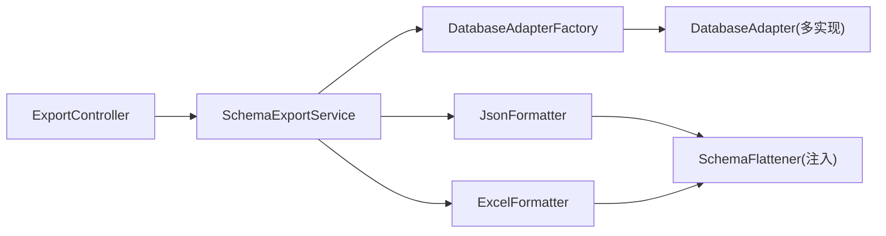

# 数据字典导出

<cite>
**本文引用的文件**
- [ExportController.java](file://schemasync-backend/src/main/java/com/schemasync/controller/ExportController.java)
- [SchemaExportService.java](file://schemasync-backend/src/main/java/com/schemasync/service/SchemaExportService.java)
- [DatabaseAdapter.java](file://schemasync-backend/src/main/java/com/schemasync/adapter/DatabaseAdapter.java)
- [DatabaseAdapterFactory.java](file://schemasync-backend/src/main/java/com/schemasync/adapter/DatabaseAdapterFactory.java)
- [ExportOptions.java](file://schemasync-backend/src/main/java/com/schemasync/adapter/ExportOptions.java)
- [JsonFormatter.java](file://schemasync-backend/src/main/java/com/schemasync/formatter/JsonFormatter.java)
- [ExcelFormatter.java](file://schemasync-backend/src/main/java/com/schemasync/formatter/ExcelFormatter.java)
- [SchemaDictionary.java](file://schemasync-backend/src/main/java/com/schemasync/model/dict/SchemaDictionary.java)
- [FlatSchemaDictionary.java](file://schemasync-backend/src/main/java/com/schemasync/model/dict/FlatSchemaDictionary.java)
- [TableDefinition.java](file://schemasync-backend/src/main/java/com/schemasync/model/dict/TableDefinition.java)
- [ColumnDefinition.java](file://schemasync-backend/src/main/java/com/schemasync/model/dict/ColumnDefinition.java)
- [IndexDefinition.java](file://schemasync-backend/src/main/java/com/schemasync/model/dict/IndexDefinition.java)
- [ExportMetadata.java](file://schemasync-backend/src/main/java/com/schemasync/model/dict/ExportMetadata.java)
- [TableInfoRow.java](file://schemasync-backend/src/main/java/com/schemasync/model/dict/TableInfoRow.java)
- [ColumnInfoRow.java](file://schemasync-backend/src/main/java/com/schemasync/model/dict/ColumnInfoRow.java)
- [IndexInfoRow.java](file://schemasync-backend/src/main/java/com/schemasync/model/dict/IndexInfoRow.java)
- [ConstraintInfoRow.java](file://schemasync-backend/src/main/java/com/schemasync/model/dict/ConstraintInfoRow.java)
- [ViewInfoRow.java](file://schemasync-backend/src/main/java/com/schemasync/model/dict/ViewInfoRow.java)
</cite>

## 目录
1. [简介](#简介)
2. [项目结构](#项目结构)
3. [核心组件](#核心组件)
4. [架构总览](#架构总览)
5. [详细组件分析](#详细组件分析)
6. [依赖关系分析](#依赖关系分析)
7. [性能与优化](#性能与优化)
8. [故障排查指南](#故障排查指南)
9. [结论](#结论)
10. [附录：API与前端操作指南](#附录api与前端操作指南)

## 简介
本文件面向“数据字典导出”功能，系统性阐述以下要点：
- 6种数据库适配器的元数据提取机制（接口契约与扩展方式）
- 多格式输出支持（JSON/Excel）及扁平化转换算法
- 表过滤与排除能力（包含模式匹配与排除列表）
- SchemaDictionary数据结构、扁平化模型与格式化器实现原理
- 完整导出流程、参数配置、进度监控与错误处理
- 不同数据库类型的特殊处理逻辑、大库优化策略与批量导出最佳实践
- API调用示例与前端界面操作指引

## 项目结构
导出相关代码主要分布在控制器、服务、适配器、格式化器与模型层：
- 控制器：对外暴露HTTP接口，负责参数校验、响应头设置与下载文件名生成
- 服务：编排导出流程，协调适配器、格式化器，记录耗时与日志
- 适配器：统一抽象数据库元数据抽取能力，具体由各类数据库实现
- 格式化器：将内部数据模型转换为JSON或Excel字节流
- 模型：定义嵌套的SchemaDictionary与扁平化的FlatSchemaDictionary，以及行级展示对象

图表来源
- [ExportController.java:48-99](file://schemasync-backend/src/main/java/com/schemasync/controller/ExportController.java#L48-L99)
- [SchemaExportService.java:46-111](file://schemasync-backend/src/main/java/com/schemasync/service/SchemaExportService.java#L46-L111)
- [DatabaseAdapterFactory.java:29-55](file://schemasync-backend/src/main/java/com/schemasync/adapter/DatabaseAdapterFactory.java#L29-L55)
- [DatabaseAdapter.java:17-133](file://schemasync-backend/src/main/java/com/schemasync/adapter/DatabaseAdapter.java#L17-L133)
- [JsonFormatter.java:44-53](file://schemasync-backend/src/main/java/com/schemasync/formatter/JsonFormatter.java#L44-L53)
- [ExcelFormatter.java:39-71](file://schemasync-backend/src/main/java/com/schemasync/formatter/ExcelFormatter.java#L39-L71)

章节来源
- [ExportController.java:48-99](file://schemasync-backend/src/main/java/com/schemasync/controller/ExportController.java#L48-L99)
- [SchemaExportService.java:46-111](file://schemasync-backend/src/main/java/com/schemasync/service/SchemaExportService.java#L46-L111)

## 核心组件
- 导出选项 ExportOptions：控制输出格式、目标数据库/Schema、表名模式过滤、排除表列表、是否包含索引/外键/视图等。
- 适配器 DatabaseAdapter：定义连接、获取数据库/Schema、表/字段/索引/外键、版本信息、完整导出等统一方法；默认不支持Schema层级，子类可覆盖。
- 工厂 DatabaseAdapterFactory：启动时注册所有适配器实现，按类型返回对应适配器。
- 服务 SchemaExportService：校验参数、解密密码、选择适配器、执行导出、选择格式化器并输出结果，记录关键耗时。
- 格式化器
  - JsonFormatter：通过Jackson将扁平化后的FlatSchemaDictionary序列化为JSON字节数组。
  - ExcelFormatter：基于Apache POI创建6个Sheet（概述、表、字段、索引、约束、视图），写入样式与列宽。
- 数据模型
  - SchemaDictionary：顶层容器，包含导出元数据与表定义集合。
  - FlatSchemaDictionary：扁平化后用于导出的六类二维数据集合（概述、表、字段、索引、约束、视图）。
  - 行级模型：TableInfoRow、ColumnInfoRow、IndexInfoRow、ConstraintInfoRow、ViewInfoRow。
  - 嵌套模型：TableDefinition、ColumnDefinition、IndexDefinition、ExportMetadata。

章节来源
- [ExportOptions.java:11-122](file://schemasync-backend/src/main/java/com/schemasync/adapter/ExportOptions.java#L11-L122)
- [DatabaseAdapter.java:17-133](file://schemasync-backend/src/main/java/com/schemasync/adapter/DatabaseAdapter.java#L17-L133)
- [DatabaseAdapterFactory.java:19-64](file://schemasync-backend/src/main/java/com/schemasync/adapter/DatabaseAdapterFactory.java#L19-L64)
- [SchemaExportService.java:22-141](file://schemasync-backend/src/main/java/com/schemasync/service/SchemaExportService.java#L22-L141)
- [JsonFormatter.java:21-119](file://schemasync-backend/src/main/java/com/schemasync/formatter/JsonFormatter.java#L21-L119)
- [ExcelFormatter.java:25-408](file://schemasync-backend/src/main/java/com/schemasync/formatter/ExcelFormatter.java#L25-L408)
- [SchemaDictionary.java:11-27](file://schemasync-backend/src/main/java/com/schemasync/model/dict/SchemaDictionary.java#L11-L27)
- [FlatSchemaDictionary.java:13-58](file://schemasync-backend/src/main/java/com/schemasync/model/dict/FlatSchemaDictionary.java#L13-L58)
- [TableDefinition.java:14-89](file://schemasync-backend/src/main/java/com/schemasync/model/dict/TableDefinition.java#L14-L89)
- [ColumnDefinition.java:9-116](file://schemasync-backend/src/main/java/com/schemasync/model/dict/ColumnDefinition.java#L9-L116)
- [IndexDefinition.java:11-49](file://schemasync-backend/src/main/java/com/schemasync/model/dict/IndexDefinition.java#L11-L49)
- [ExportMetadata.java:13-58](file://schemasync-backend/src/main/java/com/schemasync/model/dict/ExportMetadata.java#L13-L58)
- [TableInfoRow.java:13-74](file://schemasync-backend/src/main/java/com/schemasync/model/dict/TableInfoRow.java#L13-L74)
- [ColumnInfoRow.java:9-103](file://schemasync-backend/src/main/java/com/schemasync/model/dict/ColumnInfoRow.java#L9-L103)
- [IndexInfoRow.java:9-47](file://schemasync-backend/src/main/java/com/schemasync/model/dict/IndexInfoRow.java#L9-L47)
- [ConstraintInfoRow.java:9-61](file://schemasync-backend/src/main/java/com/schemasync/model/dict/ConstraintInfoRow.java#L9-L61)
- [ViewInfoRow.java:9-33](file://schemasync-backend/src/main/java/com/schemasync/model/dict/ViewInfoRow.java#L9-L33)

## 架构总览
导出主流程时序如下：

图表来源
- [ExportController.java:48-99](file://schemasync-backend/src/main/java/com/schemasync/controller/ExportController.java#L48-L99)
- [SchemaExportService.java:46-111](file://schemasync-backend/src/main/java/com/schemasync/service/SchemaExportService.java#L46-L111)
- [DatabaseAdapterFactory.java:45-55](file://schemasync-backend/src/main/java/com/schemasync/adapter/DatabaseAdapterFactory.java#L45-L55)
- [DatabaseAdapter.java:116-116](file://schemasync-backend/src/main/java/com/schemasync/adapter/DatabaseAdapter.java#L116-L116)
- [JsonFormatter.java:44-53](file://schemasync-backend/src/main/java/com/schemasync/formatter/JsonFormatter.java#L44-L53)
- [ExcelFormatter.java:39-71](file://schemasync-backend/src/main/java/com/schemasync/formatter/ExcelFormatter.java#L39-L71)

## 详细组件分析

### 数据模型与扁平化
- SchemaDictionary为嵌套结构，包含导出元数据与表定义集合；每个表定义包含字段、索引、外键等子集合。
- FlatSchemaDictionary将嵌套结构展开为六个二维列表：概述、表、字段、索引、约束、视图，便于Excel加工与JSON直出。
- 行级模型（TableInfoRow、ColumnInfoRow、IndexInfoRow、ConstraintInfoRow、ViewInfoRow）提供扁平化后的字段映射。

图表来源
- [SchemaDictionary.java:11-27](file://schemasync-backend/src/main/java/com/schemasync/model/dict/SchemaDictionary.java#L11-L27)
- [TableDefinition.java:14-89](file://schemasync-backend/src/main/java/com/schemasync/model/dict/TableDefinition.java#L14-L89)
- [ColumnDefinition.java:9-116](file://schemasync-backend/src/main/java/com/schemasync/model/dict/ColumnDefinition.java#L9-L116)
- [IndexDefinition.java:11-49](file://schemasync-backend/src/main/java/com/schemasync/model/dict/IndexDefinition.java#L11-L49)
- [ExportMetadata.java:13-58](file://schemasync-backend/src/main/java/com/schemasync/model/dict/ExportMetadata.java#L13-L58)
- [FlatSchemaDictionary.java:13-58](file://schemasync-backend/src/main/java/com/schemasync/model/dict/FlatSchemaDictionary.java#L13-L58)
- [TableInfoRow.java:13-74](file://schemasync-backend/src/main/java/com/schemasync/model/dict/TableInfoRow.java#L13-L74)
- [ColumnInfoRow.java:9-103](file://schemasync-backend/src/main/java/com/schemasync/model/dict/ColumnInfoRow.java#L9-L103)
- [IndexInfoRow.java:9-47](file://schemasync-backend/src/main/java/com/schemasync/model/dict/IndexInfoRow.java#L9-L47)
- [ConstraintInfoRow.java:9-61](file://schemasync-backend/src/main/java/com/schemasync/model/dict/ConstraintInfoRow.java#L9-L61)
- [ViewInfoRow.java:9-33](file://schemasync-backend/src/main/java/com/schemasync/model/dict/ViewInfoRow.java#L9-L33)

章节来源
- [SchemaDictionary.java:11-27](file://schemasync-backend/src/main/java/com/schemasync/model/dict/SchemaDictionary.java#L11-L27)
- [FlatSchemaDictionary.java:13-58](file://schemasync-backend/src/main/java/com/schemasync/model/dict/FlatSchemaDictionary.java#L13-L58)
- [TableDefinition.java:14-89](file://schemasync-backend/src/main/java/com/schemasync/model/dict/TableDefinition.java#L14-L89)
- [ColumnDefinition.java:9-116](file://schemasync-backend/src/main/java/com/schemasync/model/dict/ColumnDefinition.java#L9-L116)
- [IndexDefinition.java:11-49](file://schemasync-backend/src/main/java/com/schemasync/model/dict/IndexDefinition.java#L11-L49)
- [ExportMetadata.java:13-58](file://schemasync-backend/src/main/java/com/schemasync/model/dict/ExportMetadata.java#L13-L58)
- [TableInfoRow.java:13-74](file://schemasync-backend/src/main/java/com/schemasync/model/dict/TableInfoRow.java#L13-L74)
- [ColumnInfoRow.java:9-103](file://schemasync-backend/src/main/java/com/schemasync/model/dict/ColumnInfoRow.java#L9-L103)
- [IndexInfoRow.java:9-47](file://schemasync-backend/src/main/java/com/schemasync/model/dict/IndexInfoRow.java#L9-L47)
- [ConstraintInfoRow.java:9-61](file://schemasync-backend/src/main/java/com/schemasync/model/dict/ConstraintInfoRow.java#L9-L61)
- [ViewInfoRow.java:9-33](file://schemasync-backend/src/main/java/com/schemasync/model/dict/ViewInfoRow.java#L9-L33)

### 导出流程与参数
- 入口：POST /api/export，必填参数 configName、database；可选 schema、tablePattern、excludeTables。
- 参数校验：缺失必填项抛出异常；format未传则默认excel。
- 构建导出选项：使用Builder填充format、database、schema、tablePattern、includeIndexes、includeForeignKeys等。
- 服务编排：加载配置、克隆并解密密码、选择适配器、调用exportSchema、根据format选择格式化器、记录耗时并返回字节流。
- 响应：设置Content-Type为二进制流，Content-Disposition包含动态生成的文件名（含时间戳与毫秒）。

图表来源
- [ExportController.java:48-99](file://schemasync-backend/src/main/java/com/schemasync/controller/ExportController.java#L48-L99)
- [SchemaExportService.java:46-111](file://schemasync-backend/src/main/java/com/schemasync/service/SchemaExportService.java#L46-L111)
- [JsonFormatter.java:44-53](file://schemasync-backend/src/main/java/com/schemasync/formatter/JsonFormatter.java#L44-L53)
- [ExcelFormatter.java:39-71](file://schemasync-backend/src/main/java/com/schemasync/formatter/ExcelFormatter.java#L39-L71)

章节来源
- [ExportController.java:48-99](file://schemasync-backend/src/main/java/com/schemasync/controller/ExportController.java#L48-L99)
- [SchemaExportService.java:46-111](file://schemasync-backend/src/main/java/com/schemasync/service/SchemaExportService.java#L46-L111)

### 表过滤与排除
- 表名模式过滤 tablePattern：在导出选项中传入，用于限定要导出的表集合（通配符支持取决于具体适配器实现）。
- 排除表 excludeTables：以列表形式传入，用于从候选表中剔除指定名称（支持通配符取决于具体适配器实现）。
- 建议：在大库场景下优先使用tablePattern缩小范围，再结合excludeTables精细剔除，以降低元数据扫描开销。

章节来源
- [ExportOptions.java:28-36](file://schemasync-backend/src/main/java/com/schemasync/adapter/ExportOptions.java#L28-L36)

### 多格式输出与扁平化转换
- JSON输出：JsonFormatter先调用扁平化器将SchemaDictionary转为FlatSchemaDictionary，再用Jackson序列化为字节数组。
- Excel输出：ExcelFormatter同样先扁平化，然后创建6个Sheet，分别写入概述、表、字段、索引、约束、视图，并应用样式与列宽。
- 扁平化优势：避免深层嵌套导致的序列化体积膨胀与解析复杂度提升，同时利于表格工具直接消费。

章节来源
- [JsonFormatter.java:44-53](file://schemasync-backend/src/main/java/com/schemasync/formatter/JsonFormatter.java#L44-L53)
- [ExcelFormatter.java:39-71](file://schemasync-backend/src/main/java/com/schemasync/formatter/ExcelFormatter.java#L39-L71)
- [FlatSchemaDictionary.java:13-58](file://schemasync-backend/src/main/java/com/schemasync/model/dict/FlatSchemaDictionary.java#L13-L58)

### 数据库适配器与元数据提取
- 接口契约：DatabaseAdapter定义了connect、getDatabases、supportsSchema/getSchemas、getTables、getColumns、getIndexes、getForeignKeys、exportSchema、getDatabaseType、getDatabaseVersion等方法。
- 工厂注册：DatabaseAdapterFactory在启动时将Spring注入的所有适配器实例按类型注册到并发Map中，后续按类型快速查找。
- Schema层级：默认不支持，若数据库支持（如GaussDB等），需覆盖supportsSchema与getSchemas。
- 扩展方式：新增数据库类型只需实现DatabaseAdapter并在容器中注册，无需修改现有流程。

章节来源
- [DatabaseAdapter.java:17-133](file://schemasync-backend/src/main/java/com/schemasync/adapter/DatabaseAdapter.java#L17-L133)
- [DatabaseAdapterFactory.java:29-55](file://schemasync-backend/src/main/java/com/schemasync/adapter/DatabaseAdapterFactory.java#L29-L55)

### 进度监控与错误处理
- 进度监控：当前实现通过日志记录关键阶段耗时（导出开始、完成、格式化耗时、总耗时），便于外部监控采集。
- 错误处理：参数校验失败抛非法参数异常；配置不存在抛运行时异常；密码解密失败记录错误并继续；整体导出异常捕获后包装为运行时异常返回。
- 建议：如需更细粒度进度，可在服务层引入回调或事件总线，向客户端推送阶段性进度。

章节来源
- [SchemaExportService.java:46-111](file://schemasync-backend/src/main/java/com/schemasync/service/SchemaExportService.java#L46-L111)

## 依赖关系分析
- 控制器依赖服务与工厂，服务依赖配置服务、工厂、两个格式化器。
- 格式化器依赖扁平化器（未在已读文件中出现，但被注入使用）。
- 适配器通过工厂统一管理，屏蔽底层差异。

图表来源
- [ExportController.java:39-46](file://schemasync-backend/src/main/java/com/schemasync/controller/ExportController.java#L39-L46)
- [SchemaExportService.java:27-37](file://schemasync-backend/src/main/java/com/schemasync/service/SchemaExportService.java#L27-L37)
- [DatabaseAdapterFactory.java:24-36](file://schemasync-backend/src/main/java/com/schemasync/adapter/DatabaseAdapterFactory.java#L24-L36)
- [JsonFormatter.java:28-29](file://schemasync-backend/src/main/java/com/schemasync/formatter/JsonFormatter.java#L28-L29)
- [ExcelFormatter.java:30-31](file://schemasync-backend/src/main/java/com/schemasync/formatter/ExcelFormatter.java#L30-L31)

章节来源
- [ExportController.java:39-46](file://schemasync-backend/src/main/java/com/schemasync/controller/ExportController.java#L39-L46)
- [SchemaExportService.java:27-37](file://schemasync-backend/src/main/java/com/schemasync/service/SchemaExportService.java#L27-L37)
- [DatabaseAdapterFactory.java:24-36](file://schemasync-backend/src/main/java/com/schemasync/adapter/DatabaseAdapterFactory.java#L24-L36)
- [JsonFormatter.java:28-29](file://schemasync-backend/src/main/java/com/schemasync/formatter/JsonFormatter.java#L28-L29)
- [ExcelFormatter.java:30-31](file://schemasync-backend/src/main/java/com/schemasync/formatter/ExcelFormatter.java#L30-L31)

## 性能与优化
- 减少元数据扫描范围：优先使用tablePattern精确匹配，必要时配合excludeTables剔除无关表。
- 选择性导出：按需关闭includeIndexes/includeForeignKeys/includeViews，降低查询与序列化成本。
- 内存与IO：Excel生成过程会一次性构建Workbook，建议在大批量场景考虑分页或分批导出（例如按Schema或表前缀拆分多次导出）。
- 网络传输：后端已设置Content-Length，有助于客户端正确显示下载进度。
- 日志与监控：利用服务层记录的耗时日志，结合APM系统追踪瓶颈点（数据库元数据查询、序列化、POI写入）。

[本节为通用指导，不直接分析具体文件]

## 故障排查指南
- 参数缺失：检查configName、database是否为空；format未传会被设为excel。
- 配置不存在：确认配置名称是否正确且已持久化。
- 密码解密失败：查看日志中的解密错误，确认密钥与密文格式。
- 不支持的数据库类型：确认配置type与工厂注册的适配器一致。
- 不支持SCHEMA：当调用获取Schema列表接口时，若数据库不支持会抛出异常，请改用仅数据库级别操作。
- 导出失败：定位服务层异常堆栈，区分是数据库连接、元数据查询还是格式化阶段问题。

章节来源
- [ExportController.java:57-63](file://schemasync-backend/src/main/java/com/schemasync/controller/ExportController.java#L57-L63)
- [SchemaExportService.java:49-57](file://schemasync-backend/src/main/java/com/schemasync/service/SchemaExportService.java#L49-L57)
- [SchemaExportService.java:66-83](file://schemasync-backend/src/main/java/com/schemasync/service/SchemaExportService.java#L66-L83)
- [DatabaseAdapterFactory.java:45-55](file://schemasync-backend/src/main/java/com/schemasync/adapter/DatabaseAdapterFactory.java#L45-L55)
- [ExportController.java:184-187](file://schemasync-backend/src/main/java/com/schemasync/controller/ExportController.java#L184-L187)

## 结论
该导出功能通过统一的适配器接口屏蔽了不同数据库的差异，借助扁平化模型提升了JSON/Excel输出的可读性与易用性。通过灵活的导出选项与严格的参数校验，既保证了安全性也兼顾了性能。对于大规模数据库，建议采用分批次导出与精细化过滤策略，以获得更好的用户体验与系统稳定性。

[本节为总结性内容，不直接分析具体文件]

## 附录：API与前端操作指南

### REST接口
- 导出数据字典
  - 方法：POST
  - 路径：/api/export
  - 请求参数
    - configName：字符串，必填
    - database：字符串，必填
    - schema：字符串，可选
    - tablePattern：字符串，可选
    - excludeTables：字符串列表，可选
  - 响应：二进制文件流，文件名形如 database_schema_yyyyMMddHHmmss_毫秒.json/.xlsx
- 获取数据库列表
  - 方法：GET
  - 路径：/api/export/databases
  - 参数：configName（必填）
  - 响应：数据库名称列表
- 获取SCHEMA列表
  - 方法：GET
  - 路径：/api/export/schemas
  - 参数：configName（必填）、database（必填）
  - 响应：SCHEMA名称列表

章节来源
- [ExportController.java:48-99](file://schemasync-backend/src/main/java/com/schemasync/controller/ExportController.java#L48-L99)
- [ExportController.java:101-144](file://schemasync-backend/src/main/java/com/schemasync/controller/ExportController.java#L101-L144)
- [ExportController.java:146-201](file://schemasync-backend/src/main/java/com/schemasync/controller/ExportController.java#L146-L201)

### 前端界面操作指南
- 打开导出页面，选择数据源配置名称。
- 输入目标数据库名称，如有需要填写Schema。
- 使用表名模式进行筛选，或在排除列表中填入不需要导出的表。
- 点击导出，浏览器将自动下载.xlsx文件。
- 如需JSON格式，可通过API直接调用并保存响应体为.json文件。

[本节为概念性说明，不直接分析具体文件]