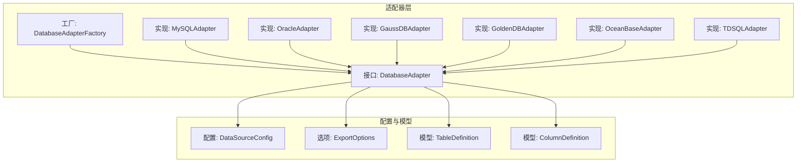
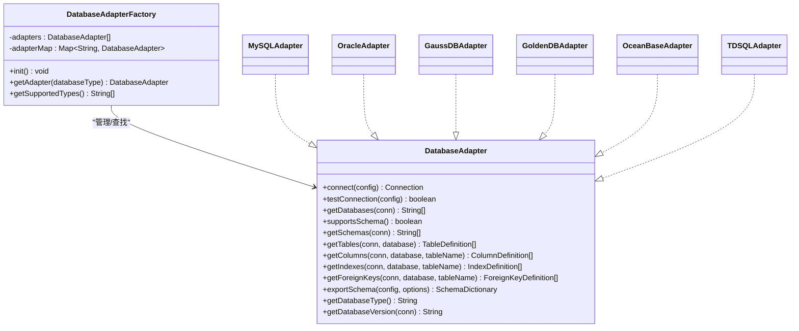
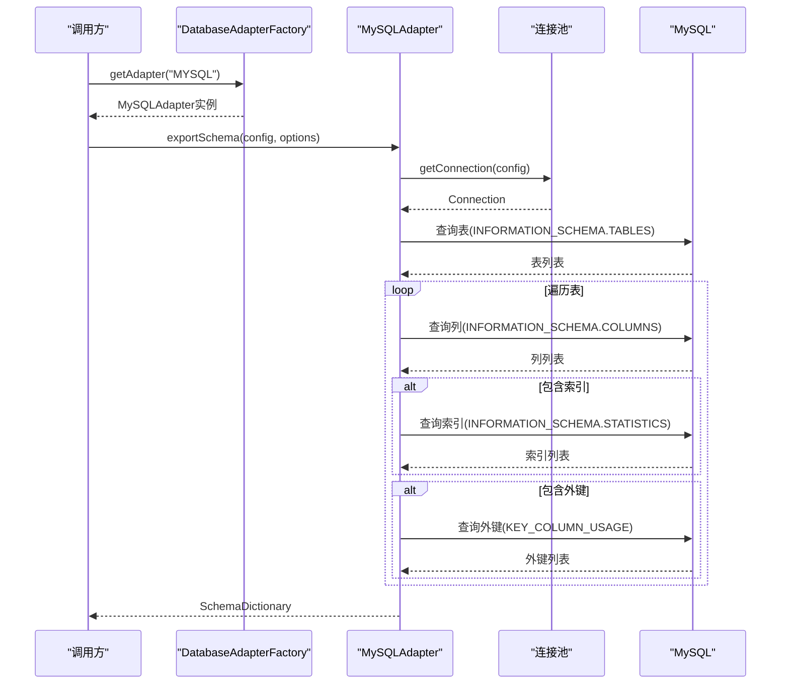
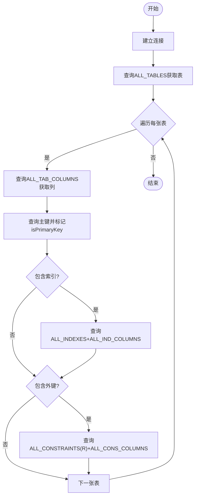
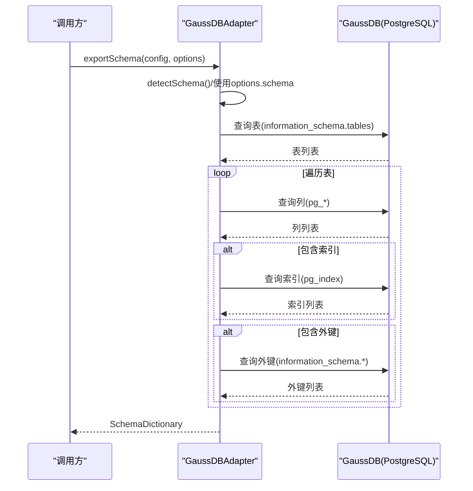
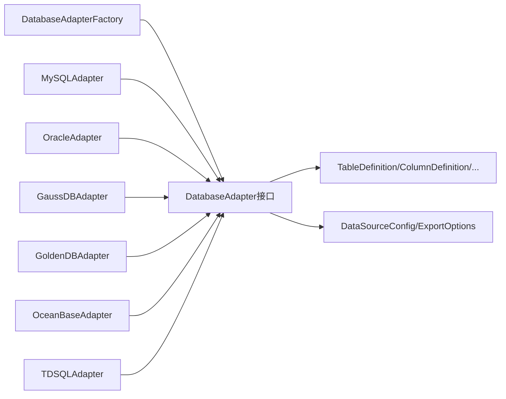

# 数据库适配器详解

<cite>
**本文引用的文件列表**
- [DatabaseAdapter.java](file://schemasync-backend/src/main/java/com/schemasync/adapter/DatabaseAdapter.java)
- [DatabaseAdapterFactory.java](file://schemasync-backend/src/main/java/com/schemasync/adapter/DatabaseAdapterFactory.java)
- [MySQLAdapter.java](file://schemasync-backend/src/main/java/com/schemasync/adapter/MySQLAdapter.java)
- [OracleAdapter.java](file://schemasync-backend/src/main/java/com/schemasync/adapter/OracleAdapter.java)
- [GaussDBAdapter.java](file://schemasync-backend/src/main/java/com/schemasync/adapter/GaussDBAdapter.java)
- [GoldenDBAdapter.java](file://schemasync-backend/src/main/java/com/schemasync/adapter/GoldenDBAdapter.java)
- [OceanBaseAdapter.java](file://schemasync-backend/src/main/java/com/schemasync/adapter/OceanBaseAdapter.java)
- [TDSQLAdapter.java](file://schemasync-backend/src/main/java/com/schemasync/adapter/TDSQLAdapter.java)
- [ExportOptions.java](file://schemasync-backend/src/main/java/com/schemasync/adapter/ExportOptions.java)
- [TableDefinition.java](file://schemasync-backend/src/main/java/com/schemasync/model/dict/TableDefinition.java)
- [ColumnDefinition.java](file://schemasync-backend/src/main/java/com/schemasync/model/dict/ColumnDefinition.java)
- [DataSourceConfig.java](file://schemasync-backend/src/main/java/com/schemasync/model/config/DataSourceConfig.java)
</cite>

## 目录
1. [简介](#简介)
2. [项目结构](#项目结构)
3. [核心组件](#核心组件)
4. [架构总览](#架构总览)
5. [详细组件分析](#详细组件分析)
6. [依赖关系分析](#依赖关系分析)
7. [性能与优化](#性能与优化)
8. [故障排查指南](#故障排查指南)
9. [结论](#结论)
10. [附录：新数据库接入与扩展开发](#附录新数据库接入与扩展开发)

## 简介
本文件聚焦于数据库适配器层，系统性阐述接口设计、策略模式实现以及6种具体适配器的元数据提取机制。文档覆盖不同数据库的特殊处理逻辑、JDBC连接方式、SCHEMA支持差异、表结构查询差异、工厂自动注册机制、新数据库接入指南与扩展示例，并提供SQL语句说明、性能优化策略、兼容性考虑、调试技巧等实用内容。

## 项目结构
适配器层位于 adapter 包下，采用“接口 + 多实现”的策略模式，通过 Spring 的依赖注入完成自动注册与查找。核心文件包括：
- 接口定义：DatabaseAdapter
- 工厂类：DatabaseAdapterFactory
- 具体适配器：MySQLAdapter、OracleAdapter、GaussDBAdapter、GoldenDBAdapter、OceanBaseAdapter、TDSQLAdapter
- 导出选项：ExportOptions
- 模型对象：TableDefinition、ColumnDefinition、DataSourceConfig

图表来源
- [DatabaseAdapter.java](file://schemasync-backend/src/main/java/com/schemasync/adapter/DatabaseAdapter.java)
- [DatabaseAdapterFactory.java](file://schemasync-backend/src/main/java/com/schemasync/adapter/DatabaseAdapterFactory.java)
- [MySQLAdapter.java](file://schemasync-backend/src/main/java/com/schemasync/adapter/MySQLAdapter.java)
- [OracleAdapter.java](file://schemasync-backend/src/main/java/com/schemasync/adapter/OracleAdapter.java)
- [GaussDBAdapter.java](file://schemasync-backend/src/main/java/com/schemasync/adapter/GaussDBAdapter.java)
- [GoldenDBAdapter.java](file://schemasync-backend/src/main/java/com/schemasync/adapter/GoldenDBAdapter.java)
- [OceanBaseAdapter.java](file://schemasync-backend/src/main/java/com/schemasync/adapter/OceanBaseAdapter.java)
- [TDSQLAdapter.java](file://schemasync-backend/src/main/java/com/schemasync/adapter/TDSQLAdapter.java)
- [ExportOptions.java](file://schemasync-backend/src/main/java/com/schemasync/adapter/ExportOptions.java)
- [TableDefinition.java](file://schemasync-backend/src/main/java/com/schemasync/model/dict/TableDefinition.java)
- [ColumnDefinition.java](file://schemasync-backend/src/main/java/com/schemasync/model/dict/ColumnDefinition.java)
- [DataSourceConfig.java](file://schemasync-backend/src/main/java/com/schemasync/model/config/DataSourceConfig.java)

章节来源
- [DatabaseAdapter.java](file://schemasync-backend/src/main/java/com/schemasync/adapter/DatabaseAdapter.java)
- [DatabaseAdapterFactory.java](file://schemasync-backend/src/main/java/com/schemasync/adapter/DatabaseAdapterFactory.java)

## 核心组件
- 接口职责
  - 统一抽象：连接、测试、获取数据库/Schema、表、字段、索引、外键、版本、导出完整字典。
  - SCHEMA支持：默认不支持，支持时重写 supportsSchema() 并实现 getSchemas()。
- 工厂职责
  - 自动发现所有实现了接口的Spring Bean，按 getDatabaseType() 注册到并发Map中。
  - 提供按类型获取适配器和列出已支持类型的API。
- 导出流程
  - 基于 ExportOptions 控制是否包含索引/外键/视图、表名过滤与排除。
  - 每个适配器内部组织连接、查询、组装 SchemaDictionary 的流程，并输出进度日志。

章节来源
- [DatabaseAdapter.java](file://schemasync-backend/src/main/java/com/schemasync/adapter/DatabaseAdapter.java)
- [DatabaseAdapterFactory.java](file://schemasync-backend/src/main/java/com/schemasync/adapter/DatabaseAdapterFactory.java)
- [ExportOptions.java](file://schemasync-backend/src/main/java/com/schemasync/adapter/ExportOptions.java)

## 架构总览
适配器层遵循策略模式：上层仅依赖接口，运行时由工厂根据数据库类型选择具体实现。各适配器通过 JDBC 访问系统目录视图或信息库，将结果映射为统一的模型对象（TableDefinition、ColumnDefinition 等），最终组合成 SchemaDictionary 返回。

图表来源
- [DatabaseAdapter.java](file://schemasync-backend/src/main/java/com/schemasync/adapter/DatabaseAdapter.java)
- [DatabaseAdapterFactory.java](file://schemasync-backend/src/main/java/com/schemasync/adapter/DatabaseAdapterFactory.java)
- [MySQLAdapter.java](file://schemasync-backend/src/main/java/com/schemasync/adapter/MySQLAdapter.java)
- [OracleAdapter.java](file://schemasync-backend/src/main/java/com/schemasync/adapter/OracleAdapter.java)
- [GaussDBAdapter.java](file://schemasync-backend/src/main/java/com/schemasync/adapter/GaussDBAdapter.java)
- [GoldenDBAdapter.java](file://schemasync-backend/src/main/java/com/schemasync/adapter/GoldenDBAdapter.java)
- [OceanBaseAdapter.java](file://schemasync-backend/src/main/java/com/schemasync/adapter/OceanBaseAdapter.java)
- [TDSQLAdapter.java](file://schemasync-backend/src/main/java/com/schemasync/adapter/TDSQLAdapter.java)

## 详细组件分析

### 接口与工厂
- 接口要点
  - 连接与测试：connect、testConnection 使用统一的数据源配置。
  - 元数据获取：getTables/getColumns/getIndexes/getForeignKeys 参数在不同数据库语义略有差异（database/schema）。
  - SCHEMA支持：supportsSchema 默认 false；支持时需提供 getSchemas。
  - 导出：exportSchema 负责串联连接、查询、过滤、组装与日志记录。
- 工厂要点
  - 启动时扫描所有 DatabaseAdapter 实现，以 getDatabaseType().toUpperCase() 作为键注册。
  - 未找到类型时抛出异常，提示支持的类型集合。

章节来源
- [DatabaseAdapter.java](file://schemasync-backend/src/main/java/com/schemasync/adapter/DatabaseAdapter.java)
- [DatabaseAdapterFactory.java](file://schemasync-backend/src/main/java/com/schemasync/adapter/DatabaseAdapterFactory.java)

### MySQL 适配器
- 特殊处理
  - 使用 INFORMATION_SCHEMA 获取表、列、索引、外键。
  - 自增字段通过 EXTRA 字段判断。
  - 字符集与排序规则来自 TABLE_COLLATION 与 CHARACTER_SET_NAME。
- JDBC 连接
  - 通过连接池管理器获取连接。
- SCHEMA 支持
  - 不支持 SCHEMA 层级，直接以数据库名为维度。
- 关键SQL定位
  - 表列表：INFORMATION_SCHEMA.TABLES
  - 列信息：INFORMATION_SCHEMA.COLUMNS
  - 索引信息：INFORMATION_SCHEMA.STATISTICS（GROUP_CONCAT聚合列）
  - 外键信息：INFORMATION_SCHEMA.KEY_COLUMN_USAGE
- 导出流程
  - 连接→查表→可选过滤→逐表查列/索引/外键→组装字典→统计耗时与进度。

图表来源
- [MySQLAdapter.java](file://schemasync-backend/src/main/java/com/schemasync/adapter/MySQLAdapter.java)
- [DatabaseAdapterFactory.java](file://schemasync-backend/src/main/java/com/schemasync/adapter/DatabaseAdapterFactory.java)

章节来源
- [MySQLAdapter.java](file://schemasync-backend/src/main/java/com/schemasync/adapter/MySQLAdapter.java)

### Oracle 适配器
- 特殊处理
  - 使用 ALL_* 视图族进行元数据查询，OWNER 即用户/Schema。
  - 主键需单独查询 ALL_CONSTRAINTS/ALL_CONS_COLUMNS 并在列级别标记 isPrimaryKey。
  - 字符类型长度判定：DATA_LENGTH 仅在字符类型有效。
- JDBC 连接
  - 通过连接池管理器获取连接。
- SCHEMA 支持
  - 以用户作为Schema边界，getDatabases 返回当前用户可见的所有用户名。
- 关键SQL定位
  - 表列表：ALL_TABLES + ALL_TAB_COMMENTS
  - 列信息：ALL_TAB_COLUMNS + ALL_COL_COMMENTS
  - 主键：ALL_CONSTRAINTS(约束类型'P') + ALL_CONS_COLUMNS
  - 索引：ALL_INDEXES + ALL_IND_COLUMNS（LISTAGG聚合列）
  - 外键：ALL_CONSTRAINTS(约束类型'R') + ALL_CONS_COLUMNS 关联引用端
- 导出流程
  - 连接→查表→可选过滤→逐表查列/索引/外键→组装字典→统计耗时与进度。

图表来源
- [OracleAdapter.java](file://schemasync-backend/src/main/java/com/schemasync/adapter/OracleAdapter.java)

章节来源
- [OracleAdapter.java](file://schemasync-backend/src/main/java/com/schemasync/adapter/OracleAdapter.java)

### GaussDB 适配器
- 特殊处理
  - 兼容PostgreSQL协议，使用 information_schema 与 pg_* 系统表。
  - 表注释通过 obj_description 获取；列注释通过 col_description。
  - 类型转换：将内部类型名转换为标准DDL类型名；从 format_type 解析长度/精度。
  - 自动检测默认SCHEMA：优先选择有用户表的非系统SCHEMA，否则回退 public。
- JDBC 连接
  - 通过连接池管理器获取连接。
- SCHEMA 支持
  - 支持 SCHEMA 层级，supportsSchema 返回 true，并提供 getSchemas 方法。
- 关键SQL定位
  - 表列表：information_schema.tables + obj_description
  - 列信息：pg_attribute/pg_class/pg_type/pg_namespace + 主键/默认值/注释
  - 索引：pg_index + pg_class + pg_attribute（数组转字符串）
  - 外键：information_schema.table_constraints + key_column_usage + constraint_column_usage
- 导出流程
  - 连接→检测/指定SCHEMA→查表→可选过滤→逐表查列/索引/外键→组装字典→统计耗时与进度。

图表来源
- [GaussDBAdapter.java](file://schemasync-backend/src/main/java/com/schemasync/adapter/GaussDBAdapter.java)

章节来源
- [GaussDBAdapter.java](file://schemasync-backend/src/main/java/com/schemasync/adapter/GaussDBAdapter.java)

### GoldenDB / OceanBase / TDSQL 适配器
- 共同点
  - 均兼容MySQL协议，使用相同的 INFORMATION_SCHEMA 查询。
  - 自增字段通过 EXTRA 字段判断。
  - 不支持 SCHEMA 层级，以数据库名为维度。
- 差异点
  - 系统数据库过滤列表略有不同（如 goldendb/oceanbase 特有库名）。
  - 版本号前缀不同（GoldenDB/OceanBase/TDSQL）。
- 关键SQL定位
  - 表/列/索引/外键：与 MySQL 一致，分别对应 INFORMATION_SCHEMA.TABLES/COLUMNS/STATISTICS/KEY_COLUMN_USAGE。
- 导出流程
  - 与 MySQL 相同：连接→查表→可选过滤→逐表查列/索引/外键→组装字典→统计耗时与进度。

章节来源
- [GoldenDBAdapter.java](file://schemasync-backend/src/main/java/com/schemasync/adapter/GoldenDBAdapter.java)
- [OceanBaseAdapter.java](file://schemasync-backend/src/main/java/com/schemasync/adapter/OceanBaseAdapter.java)
- [TDSQLAdapter.java](file://schemasync-backend/src/main/java/com/schemasync/adapter/TDSQLAdapter.java)

## 依赖关系分析
- 耦合与内聚
  - 适配器之间无直接依赖，均依赖接口与公共模型，内聚度高、耦合度低。
  - 工厂集中管理适配器生命周期与查找，降低调用方复杂度。
- 外部依赖
  - JDBC 驱动由各数据库厂商提供，适配器通过连接池管理器获取连接。
  - 日志框架用于导出过程的可观测性。
- 循环依赖
  - 未发现循环依赖。

图表来源
- [DatabaseAdapterFactory.java](file://schemasync-backend/src/main/java/com/schemasync/adapter/DatabaseAdapterFactory.java)
- [DatabaseAdapter.java](file://schemasync-backend/src/main/java/com/schemasync/adapter/DatabaseAdapter.java)
- [MySQLAdapter.java](file://schemasync-backend/src/main/java/com/schemasync/adapter/MySQLAdapter.java)
- [OracleAdapter.java](file://schemasync-backend/src/main/java/com/schemasync/adapter/OracleAdapter.java)
- [GaussDBAdapter.java](file://schemasync-backend/src/main/java/com/schemasync/adapter/GaussDBAdapter.java)
- [GoldenDBAdapter.java](file://schemasync-backend/src/main/java/com/schemasync/adapter/GoldenDBAdapter.java)
- [OceanBaseAdapter.java](file://schemasync-backend/src/main/java/com/schemasync/adapter/OceanBaseAdapter.java)
- [TDSQLAdapter.java](file://schemasync-backend/src/main/java/com/schemasync/adapter/TDSQLAdapter.java)
- [TableDefinition.java](file://schemasync-backend/src/main/java/com/schemasync/model/dict/TableDefinition.java)
- [ColumnDefinition.java](file://schemasync-backend/src/main/java/com/schemasync/model/dict/ColumnDefinition.java)
- [DataSourceConfig.java](file://schemasync-backend/src/main/java/com/schemasync/model/config/DataSourceConfig.java)
- [ExportOptions.java](file://schemasync-backend/src/main/java/com/schemasync/adapter/ExportOptions.java)

章节来源
- [DatabaseAdapterFactory.java](file://schemasync-backend/src/main/java/com/schemasync/adapter/DatabaseAdapterFactory.java)
- [DatabaseAdapter.java](file://schemasync-backend/src/main/java/com/schemasync/adapter/DatabaseAdapter.java)

## 性能与优化
- 批量与分页
  - 当前实现多为全量查询后在内存过滤，适合中小规模库；超大型库建议增加分页或增量导出能力。
- SQL优化
  - 尽量利用系统视图的索引与物化视图；避免不必要的JOIN与函数计算。
  - 对大表元数据可先只取必要字段，按需再加载索引/外键。
- 连接与超时
  - 合理设置连接池大小与超时时间，避免阻塞。
- 并行导出
  - 可按表并行拉取元数据（注意数据库侧并发限制与锁竞争）。
- 缓存
  - 对频繁访问的元数据（如表/列清单）可引入短期缓存。

[本节为通用指导，不直接分析具体文件]

## 故障排查指南
- 连接失败
  - 检查 JDBC URL、端口、账号权限、防火墙与SSL配置。
  - 使用 testConnection 快速验证连通性。
- 元数据为空
  - 确认目标库/SCHEMA是否存在且当前用户具备读取权限。
  - 对于 Oracle，确认 OWNER 是否正确；对于 GaussDB，确认 SCHEMA 是否可用。
- 类型/长度异常
  - 关注数值型精度/小数位与字符长度的边界值处理；GaussDB 对异常大值做了保护性忽略。
- 过滤无效
  - 检查 tablePattern/excludeTables 的通配符语法是否符合预期。
- 日志定位
  - 查看导出过程中的阶段日志（连接、查表、进度、总计耗时），快速定位瓶颈。

章节来源
- [MySQLAdapter.java](file://schemasync-backend/src/main/java/com/schemasync/adapter/MySQLAdapter.java)
- [OracleAdapter.java](file://schemasync-backend/src/main/java/com/schemasync/adapter/OracleAdapter.java)
- [GaussDBAdapter.java](file://schemasync-backend/src/main/java/com/schemasync/adapter/GaussDBAdapter.java)
- [GoldenDBAdapter.java](file://schemasync-backend/src/main/java/com/schemasync/adapter/GoldenDBAdapter.java)
- [OceanBaseAdapter.java](file://schemasync-backend/src/main/java/com/schemasync/adapter/OceanBaseAdapter.java)
- [TDSQLAdapter.java](file://schemasync-backend/src/main/java/com/schemasync/adapter/TDSQLAdapter.java)

## 结论
该适配器层通过清晰的接口与工厂机制，将多种数据库的元数据差异封装在各自实现中，对外暴露一致的导出与查询能力。MySQL系与Oracle/GaussDB在元数据源与SCHEMA语义上存在显著差异，但通过适配器的差异化实现得以统一。整体架构具备良好的可扩展性与可维护性，便于后续接入更多数据库类型。

[本节为总结性内容，不直接分析具体文件]

## 附录：新数据库接入与扩展开发

### 新增数据库适配器的步骤
- 新建适配器类
  - 实现 DatabaseAdapter 接口，标注为 Spring 组件以便被工厂自动发现。
  - 实现 getDatabaseType() 返回唯一标识（大写）。
- 实现连接与测试
  - connect 使用连接池管理器获取连接；testConnection 校验连通性。
- 实现元数据查询
  - 根据目标数据库的系统视图/信息库编写 SQL，填充 TableDefinition/ColumnDefinition/IndexDefinition/ForeignKeyDefinition。
  - 若支持 SCHEMA，重写 supportsSchema() 并实现 getSchemas()；否则保持默认行为。
- 实现导出流程
  - 参考现有适配器的 exportSchema 流程：连接→查表→过滤→逐表查详情→组装→日志。
- 注册与验证
  - 由于使用 @Component 与工厂自动注册，无需额外配置。
  - 通过 getSupportedTypes() 确认新类型已注册；调用 getAdapter(type) 获取实例进行测试。

### 关键实现要点与注意事项
- 数据类型与长度/精度
  - 区分基础类型与带参数的类型表示；对超长值使用 Long 存储以避免溢出。
- 主键识别
  - MySQL/GoldenDB/OceanBase/TDSQL：COLUMN_KEY='PRI' 或 EXTRA 含 auto_increment。
  - Oracle：需单独查询主键约束并回填列的 isPrimaryKey。
  - GaussDB：通过 pg_constraint(contype='p') 识别主键。
- 索引与外键
  - 使用 GROUP_CONCAT/LISTAGG 聚合列名，注意分隔符与顺序。
  - 外键需同时获取引用端表与列。
- SCHEMA 语义
  - MySQL系：以数据库名为维度。
  - Oracle：以用户为Schema边界。
  - GaussDB：显式 SCHEMA，支持多SCHEMA与默认public。
- 兼容性
  - 对不同版本的系统视图字段差异做兼容处理（例如空值、缺失字段）。
  - 对异常值（过大精度/长度）做保护性忽略或降级处理。

### 代码级参考路径
- 接口定义与工厂
  - [DatabaseAdapter.java](file://schemasync-backend/src/main/java/com/schemasync/adapter/DatabaseAdapter.java)
  - [DatabaseAdapterFactory.java](file://schemasync-backend/src/main/java/com/schemasync/adapter/DatabaseAdapterFactory.java)
- 典型实现
  - MySQL系（INFORMATION_SCHEMA）：[MySQLAdapter.java](file://schemasync-backend/src/main/java/com/schemasync/adapter/MySQLAdapter.java)、[GoldenDBAdapter.java](file://schemasync-backend/src/main/java/com/schemasync/adapter/GoldenDBAdapter.java)、[OceanBaseAdapter.java](file://schemasync-backend/src/main/java/com/schemasync/adapter/OceanBaseAdapter.java)、[TDSQLAdapter.java](file://schemasync-backend/src/main/java/com/schemasync/adapter/TDSQLAdapter.java)
  - Oracle（ALL_* 视图）：[OracleAdapter.java](file://schemasync-backend/src/main/java/com/schemasync/adapter/OracleAdapter.java)
  - GaussDB（information_schema + pg_*）：[GaussDBAdapter.java](file://schemasync-backend/src/main/java/com/schemasync/adapter/GaussDBAdapter.java)
- 模型与选项
  - [TableDefinition.java](file://schemasync-backend/src/main/java/com/schemasync/model/dict/TableDefinition.java)
  - [ColumnDefinition.java](file://schemasync-backend/src/main/java/com/schemasync/model/dict/ColumnDefinition.java)
  - [DataSourceConfig.java](file://schemasync-backend/src/main/java/com/schemasync/model/config/DataSourceConfig.java)
  - [ExportOptions.java](file://schemasync-backend/src/main/java/com/schemasync/adapter/ExportOptions.java)

### 调试技巧
- 开启详细日志：观察导出阶段的耗时与进度，定位慢查询。
- 最小化导出：先导出少量表，验证字段/索引/外键完整性。
- 对比系统视图：直接在数据库中执行对应的元数据SQL，核对字段与行数。
- 权限验证：确保当前用户具备对系统视图/信息库的读取权限。

[本节为扩展指南，不直接分析具体文件]