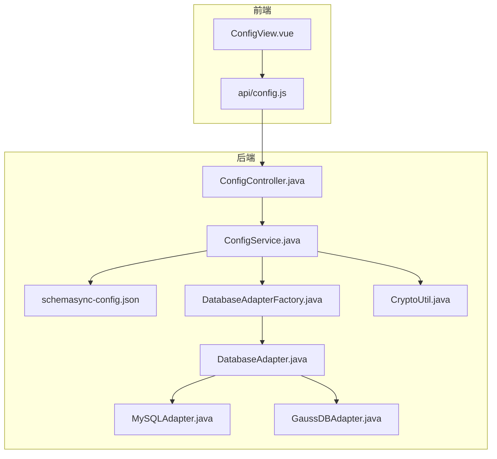
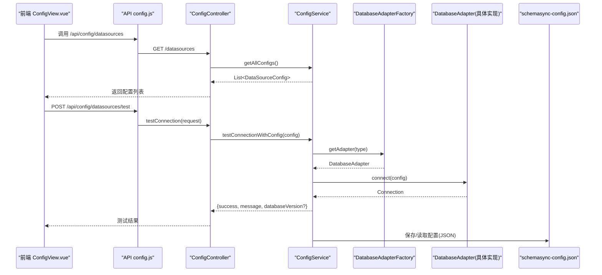
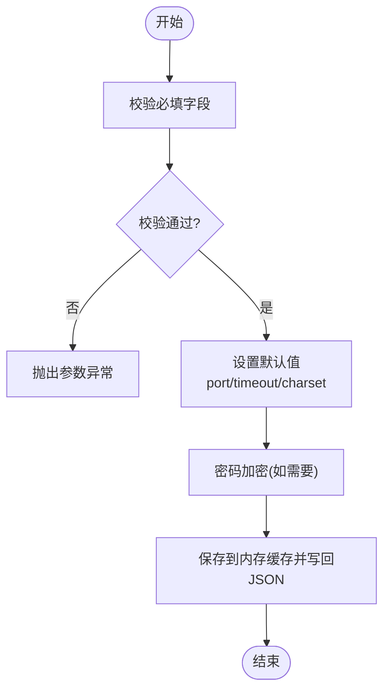
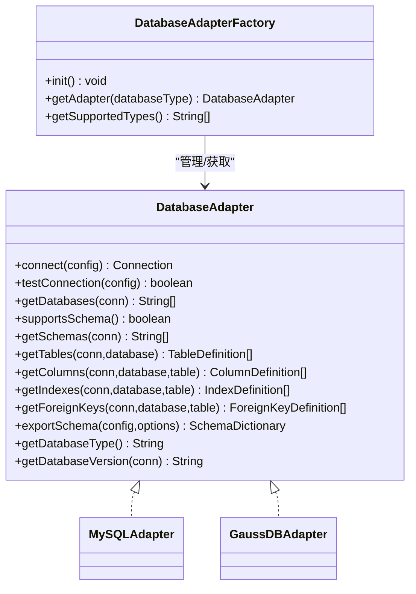
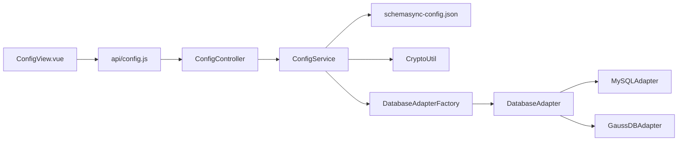

# 数据源配置管理

<cite>
**本文引用的文件列表**
- [DataSourceConfig.java](file://schemasync-backend/src/main/java/com/schemasync/model/config/DataSourceConfig.java)
- [ConfigController.java](file://schemasync-backend/src/main/java/com/schemasync/controller/ConfigController.java)
- [ConfigService.java](file://schemasync-backend/src/main/java/com/schemasync/service/ConfigService.java)
- [CryptoUtil.java](file://schemasync-backend/src/main/java/com/schemasync/util/CryptoUtil.java)
- [DatabaseAdapter.java](file://schemasync-backend/src/main/java/com/schemasync/adapter/DatabaseAdapter.java)
- [DatabaseAdapterFactory.java](file://schemasync-backend/src/main/java/com/schemasync/adapter/DatabaseAdapterFactory.java)
- [MySQLAdapter.java](file://schemasync-backend/src/main/java/com/schemasync/adapter/MySQLAdapter.java)
- [GaussDBAdapter.java](file://schemasync-backend/src/main/java/com/schemasync/adapter/GaussDBAdapter.java)
- [config.js](file://schemasync-frontend/src/api/config.js)
- [ConfigView.vue](file://schemasync-frontend/src/views/ConfigView.vue)
- [schemasync-config.json](file://schemasync-backend/src/main/resources/schemasync-config.json)
- [CryptoUtilTest.java](file://schemasync-backend/src/test/java/com/schemasync/util/CryptoUtilTest.java)
- [DataSourceConnectionIntegrationTest.java](file://schemasync-backend/src/test/java/com/schemasync/service/DataSourceConnectionIntegrationTest.java)
</cite>

## 目录
1. [简介](#简介)
2. [项目结构](#项目结构)
3. [核心组件](#核心组件)
4. [架构总览](#架构总览)
5. [详细组件分析](#详细组件分析)
6. [依赖关系分析](#依赖关系分析)
7. [性能考虑](#性能考虑)
8. [故障排查指南](#故障排查指南)
9. [结论](#结论)
10. [附录](#附录)

## 简介
本章节面向“数据源配置管理”功能，覆盖可视化配置界面、CRUD 接口、连接测试机制与 AES 密码加密存储。文档将深入解析 DataSourceConfig 模型结构、支持的数据库类型、连接池配置选项、SCHEMA 支持检测，并提供完整的 API 调用示例、前端操作流程、错误处理策略、配置文件格式与安全最佳实践，以及常见问题排查和性能优化建议。

## 项目结构
后端采用分层设计：控制器层暴露 REST 接口，服务层负责业务逻辑（持久化到 JSON 配置文件、连接测试、加密解密），适配器层提供多数据库适配能力；前端基于 Vue + Element Plus 提供可视化配置界面。

图示来源
- [ConfigView.vue:1-344](file://schemasync-frontend/src/views/ConfigView.vue#L1-L344)
- [config.js:1-50](file://schemasync-frontend/src/api/config.js#L1-L50)
- [ConfigController.java:1-133](file://schemasync-backend/src/main/java/com/schemasync/controller/ConfigController.java#L1-L133)
- [ConfigService.java:1-383](file://schemasync-backend/src/main/java/com/schemasync/service/ConfigService.java#L1-L383)
- [schemasync-config.json:1-25](file://schemasync-backend/src/main/resources/schemasync-config.json#L1-L25)
- [DatabaseAdapterFactory.java:1-64](file://schemasync-backend/src/main/java/com/schemasync/adapter/DatabaseAdapterFactory.java#L1-L64)
- [DatabaseAdapter.java:1-134](file://schemasync-backend/src/main/java/com/schemasync/adapter/DatabaseAdapter.java#L1-L134)
- [MySQLAdapter.java:1-200](file://schemasync-backend/src/main/java/com/schemasync/adapter/MySQLAdapter.java#L1-L200)
- [GaussDBAdapter.java:1-200](file://schemasync-backend/src/main/java/com/schemasync/adapter/GaussDBAdapter.java#L1-L200)
- [CryptoUtil.java:1-84](file://schemasync-backend/src/main/java/com/schemasync/util/CryptoUtil.java#L1-L84)

章节来源
- [ConfigView.vue:1-344](file://schemasync-frontend/src/views/ConfigView.vue#L1-L344)
- [config.js:1-50](file://schemasync-frontend/src/api/config.js#L1-L50)
- [ConfigController.java:1-133](file://schemasync-backend/src/main/java/com/schemasync/controller/ConfigController.java#L1-L133)
- [ConfigService.java:1-383](file://schemasync-backend/src/main/java/com/schemasync/service/ConfigService.java#L1-L383)
- [schemasync-config.json:1-25](file://schemasync-backend/src/main/resources/schemasync-config.json#L1-L25)
- [DatabaseAdapterFactory.java:1-64](file://schemasync-backend/src/main/java/com/schemasync/adapter/DatabaseAdapterFactory.java#L1-L64)
- [DatabaseAdapter.java:1-134](file://schemasync-backend/src/main/java/com/schemasync/adapter/DatabaseAdapter.java#L1-L134)
- [MySQLAdapter.java:1-200](file://schemasync-backend/src/main/java/com/schemasync/adapter/MySQLAdapter.java#L1-L200)
- [GaussDBAdapter.java:1-200](file://schemasync-backend/src/main/java/com/schemasync/adapter/GaussDBAdapter.java#L1-L200)
- [CryptoUtil.java:1-84](file://schemasync-backend/src/main/java/com/schemasync/util/CryptoUtil.java#L1-L84)

## 核心组件
- 数据源配置模型：定义数据源字段、默认值、时间戳及运行时 SCHEMA 支持标识。
- 配置控制器：提供获取、新增、更新、删除、测试连接的 REST 接口。
- 配置服务：实现配置的加载/保存、校验、加密、连接测试、适配器选择等。
- 加密工具：AES 加解密与 Base64 编码判断。
- 适配器工厂与接口：按数据库类型动态选择具体适配器，统一连接与元数据访问。
- 前端视图与 API：Vue 页面与 Axios 封装的接口调用。

章节来源
- [DataSourceConfig.java:1-129](file://schemasync-backend/src/main/java/com/schemasync/model/config/DataSourceConfig.java#L1-L129)
- [ConfigController.java:1-133](file://schemasync-backend/src/main/java/com/schemasync/controller/ConfigController.java#L1-L133)
- [ConfigService.java:1-383](file://schemasync-backend/src/main/java/com/schemasync/service/ConfigService.java#L1-L383)
- [CryptoUtil.java:1-84](file://schemasync-backend/src/main/java/com/schemasync/util/CryptoUtil.java#L1-L84)
- [DatabaseAdapter.java:1-134](file://schemasync-backend/src/main/java/com/schemasync/adapter/DatabaseAdapter.java#L1-L134)
- [DatabaseAdapterFactory.java:1-64](file://schemasync-backend/src/main/java/com/schemasync/adapter/DatabaseAdapterFactory.java#L1-L64)
- [ConfigView.vue:1-344](file://schemasync-frontend/src/views/ConfigView.vue#L1-L344)
- [config.js:1-50](file://schemasync-frontend/src/api/config.js#L1-L50)

## 架构总览
数据源配置管理的整体流程如下：
- 前端通过 API 发起 CRUD 与连接测试请求。
- 控制器接收请求并委托服务层处理。
- 服务层从内存缓存读写配置，并在变更时持久化到 JSON 配置文件。
- 连接测试通过适配器工厂选择对应数据库适配器，建立连接并验证。
- 密码在写入前进行 AES 加密，读取或测试时按需解密。

图示来源
- [ConfigView.vue:1-344](file://schemasync-frontend/src/views/ConfigView.vue#L1-L344)
- [config.js:1-50](file://schemasync-frontend/src/api/config.js#L1-L50)
- [ConfigController.java:1-133](file://schemasync-backend/src/main/java/com/schemasync/controller/ConfigController.java#L1-L133)
- [ConfigService.java:1-383](file://schemasync-backend/src/main/java/com/schemasync/service/ConfigService.java#L1-L383)
- [DatabaseAdapterFactory.java:1-64](file://schemasync-backend/src/main/java/com/schemasync/adapter/DatabaseAdapterFactory.java#L1-L64)
- [DatabaseAdapter.java:1-134](file://schemasync-backend/src/main/java/com/schemasync/adapter/DatabaseAdapter.java#L1-L134)
- [schemasync-config.json:1-25](file://schemasync-backend/src/main/resources/schemasync-config.json#L1-L25)

## 详细组件分析

### 数据源配置模型（DataSourceConfig）
- 字段说明
  - id：唯一标识，新增时自动生成。
  - name：数据源名称（别名）。
  - type：数据库类型，支持 mysql/oracle/oceanbase/tdsql/gaussdb/goldendb。
  - host/port/database/username/password：连接基本信息。
  - charset：字符集，默认 utf8mb4。
  - timeout：超时秒数，默认 30。
  - jdbcUrl：自定义 JDBC URL（可选），若提供则覆盖自动生成的 URL。
  - poolConfig：连接池高级配置（JSON 字符串，可选）。
  - createTime/updateTime：创建与更新时间。
  - supportsSchema：运行时标记是否支持 SCHEMA 层级（不持久化）。
- 默认值
  - port=3306，charset="utf8mb4"，timeout=30。
- 复杂度
  - 对象为轻量 DTO，无复杂算法，时间/空间复杂度 O(1)。

章节来源
- [DataSourceConfig.java:1-129](file://schemasync-backend/src/main/java/com/schemasync/model/config/DataSourceConfig.java#L1-L129)

### 配置控制器（ConfigController）
- 接口清单
  - GET /api/config/datasources：获取所有数据源，并为每个配置设置 supportsSchema。
  - GET /api/config/datasources/{id}：根据 ID 获取配置。
  - POST /api/config/datasources：新增配置。
  - PUT /api/config/datasources/{id}：更新配置。
  - DELETE /api/config/datasources/{id}：删除配置。
  - POST /api/config/datasources/test：测试连接，支持两种模式：
    - 传入 configId：测试已保存的配置。
    - 传入完整配置对象：测试临时配置（新增/编辑时使用）。
- 行为要点
  - 获取列表时，通过适配器工厂查询 supportsSchema 并回填。
  - 测试接口对端口/超时等参数做兼容处理。

章节来源
- [ConfigController.java:1-133](file://schemasync-backend/src/main/java/com/schemasync/controller/ConfigController.java#L1-L133)

### 配置服务（ConfigService）
- 配置加载与持久化
  - 启动时解析配置文件路径（支持绝对路径与相对路径，相对路径位于用户主目录下的 .schemasync）。
  - 从 JSON 文件加载 dataSources 数组到内存缓存。
  - 增删改后写回 JSON 文件，包含 version 与 updateTime 元信息。
- 校验与默认值
  - 新增时校验必填项（name/type/host/username），缺失抛异常。
  - 未提供 port/timeout/charset 时设置默认值。
  - 生成 id（ds-xxxxxx）。
- 密码加密
  - 新增/更新时，若密码非空且未加密，则使用 AES 加密后存储。
  - 测试连接前尝试解密密码（若检测到密文）。
- 连接测试
  - 内部方法克隆配置避免修改原对象。
  - 通过适配器工厂获取具体适配器，建立连接并 isValid(5) 检查。
  - 成功时尝试获取数据库版本信息。
- 错误处理
  - 参数校验失败抛出异常。
  - 连接失败记录日志并返回 false。
  - 保存失败抛出运行时异常。

图示来源
- [ConfigService.java:133-205](file://schemasync-backend/src/main/java/com/schemasync/service/ConfigService.java#L133-L205)
- [ConfigService.java:359-381](file://schemasync-backend/src/main/java/com/schemasync/service/ConfigService.java#L359-L381)

章节来源
- [ConfigService.java:1-383](file://schemasync-backend/src/main/java/com/schemasync/service/ConfigService.java#L1-L383)

### 加密工具（CryptoUtil）
- 算法：AES（对称加密），Base64 编码输出。
- 密钥：当前硬编码为固定字符串（生产环境应从配置中心或环境变量注入）。
- 方法
  - encrypt(data)：明文转 Base64 密文。
  - decrypt(encryptedData)：Base64 密文还原明文。
  - isEncrypted(data)：简单判定是否为 Base64 格式（用于避免重复加密）。
- 安全建议
  - 密钥应外部化配置，定期轮换。
  - 可升级为带盐或 IV 的加密方案，增强安全性。

章节来源
- [CryptoUtil.java:1-84](file://schemasync-backend/src/main/java/com/schemasync/util/CryptoUtil.java#L1-L84)
- [CryptoUtilTest.java:1-117](file://schemasync-backend/src/test/java/com/schemasync/util/CryptoUtilTest.java#L1-L117)

### 适配器工厂与接口（DatabaseAdapterFactory / DatabaseAdapter）
- 适配器工厂
  - 启动时扫描所有 DatabaseAdapter 实现，注册到 Map。
  - 根据数据库类型获取对应适配器，不支持的类型抛出异常。
- 适配器接口
  - connect(config)：建立连接。
  - testConnection(config)：测试连接。
  - getDatabases(conn)、getTables/getColumns/getIndexes/getForeignKeys：元数据访问。
  - supportsSchema()/getSchemas(conn)：SCHEMA 支持检测与列表获取。
  - exportSchema(config, options)：导出数据字典。
  - getDatabaseType()/getDatabaseVersion(conn)：类型与版本信息。

图示来源
- [DatabaseAdapter.java:1-134](file://schemasync-backend/src/main/java/com/schemasync/adapter/DatabaseAdapter.java#L1-L134)
- [DatabaseAdapterFactory.java:1-64](file://schemasync-backend/src/main/java/com/schemasync/adapter/DatabaseAdapterFactory.java#L1-L64)
- [MySQLAdapter.java:1-200](file://schemasync-backend/src/main/java/com/schemasync/adapter/MySQLAdapter.java#L1-L200)
- [GaussDBAdapter.java:1-200](file://schemasync-backend/src/main/java/com/schemasync/adapter/GaussDBAdapter.java#L1-L200)

章节来源
- [DatabaseAdapter.java:1-134](file://schemasync-backend/src/main/java/com/schemasync/adapter/DatabaseAdapter.java#L1-L134)
- [DatabaseAdapterFactory.java:1-64](file://schemasync-backend/src/main/java/com/schemasync/adapter/DatabaseAdapterFactory.java#L1-L64)
- [MySQLAdapter.java:1-200](file://schemasync-backend/src/main/java/com/schemasync/adapter/MySQLAdapter.java#L1-L200)
- [GaussDBAdapter.java:1-200](file://schemasync-backend/src/main/java/com/schemasync/adapter/GaussDBAdapter.java#L1-L200)

### 前端界面与交互（ConfigView.vue）
- 功能点
  - 展示数据源列表（ID、名称、类型、主机、端口、数据库）。
  - 新增/编辑对话框，支持基础字段与高级配置（JDBC URL、连接池 JSON）。
  - 表单校验与测试连接按钮（在保存前可即时测试）。
  - 删除确认与操作反馈。
- 交互流程
  - 打开新增/编辑对话框 → 填写表单 → 点击“测试连接”→ 显示结果 → 点击“保存”→ 刷新列表。
- 错误处理
  - 表单校验失败提示必填项。
  - 网络或服务端异常统一提示错误消息。

章节来源
- [ConfigView.vue:1-344](file://schemasync-frontend/src/views/ConfigView.vue#L1-L344)
- [config.js:1-50](file://schemasync-frontend/src/api/config.js#L1-L50)

## 依赖关系分析
- 控制器依赖服务与适配器工厂。
- 服务依赖加密工具、适配器工厂与 JSON 配置文件。
- 适配器工厂依赖所有 DatabaseAdapter 实现类。
- 前端依赖 API 封装与后端控制器。

图示来源
- [ConfigController.java:1-133](file://schemasync-backend/src/main/java/com/schemasync/controller/ConfigController.java#L1-L133)
- [ConfigService.java:1-383](file://schemasync-backend/src/main/java/com/schemasync/service/ConfigService.java#L1-L383)
- [CryptoUtil.java:1-84](file://schemasync-backend/src/main/java/com/schemasync/util/CryptoUtil.java#L1-L84)
- [DatabaseAdapterFactory.java:1-64](file://schemasync-backend/src/main/java/com/schemasync/adapter/DatabaseAdapterFactory.java#L1-L64)
- [DatabaseAdapter.java:1-134](file://schemasync-backend/src/main/java/com/schemasync/adapter/DatabaseAdapter.java#L1-L134)
- [MySQLAdapter.java:1-200](file://schemasync-backend/src/main/java/com/schemasync/adapter/MySQLAdapter.java#L1-L200)
- [GaussDBAdapter.java:1-200](file://schemasync-backend/src/main/java/com/schemasync/adapter/GaussDBAdapter.java#L1-L200)
- [ConfigView.vue:1-344](file://schemasync-frontend/src/views/ConfigView.vue#L1-L344)
- [config.js:1-50](file://schemasync-frontend/src/api/config.js#L1-L50)

章节来源
- [ConfigController.java:1-133](file://schemasync-backend/src/main/java/com/schemasync/controller/ConfigController.java#L1-L133)
- [ConfigService.java:1-383](file://schemasync-backend/src/main/java/com/schemasync/service/ConfigService.java#L1-L383)
- [DatabaseAdapterFactory.java:1-64](file://schemasync-backend/src/main/java/com/schemasync/adapter/DatabaseAdapterFactory.java#L1-L64)
- [DatabaseAdapter.java:1-134](file://schemasync-backend/src/main/java/com/schemasync/adapter/DatabaseAdapter.java#L1-L134)
- [ConfigView.vue:1-344](file://schemasync-frontend/src/views/ConfigView.vue#L1-L344)
- [config.js:1-50](file://schemasync-frontend/src/api/config.js#L1-L50)

## 性能考虑
- 连接池配置
  - 可通过 poolConfig 字段以 JSON 形式传入连接池参数（例如最大连接数、最小空闲数、空闲超时等），由底层连接池管理器解析与应用。
- 超时控制
  - 连接测试使用短超时（5 秒）快速失败，避免阻塞。
- 配置持久化
  - 每次增删改都会写回 JSON 文件，频繁操作可能带来 I/O 开销。建议在批量导入场景合并保存或使用事务式写入。
- 适配器选择
  - 适配器工厂使用并发 Map 缓存，查找为 O(1)，性能良好。
- 前端体验
  - 列表加载与对话框操作均带有 loading 状态，提升用户体验。

[本节为通用指导，无需特定文件引用]

## 故障排查指南
- 常见连接问题
  - 主机/端口不可达：检查网络连通性与防火墙规则。
  - 用户名/密码错误：确认账号权限与密码是否正确（注意密码在存储时为密文，测试时会尝试解密）。
  - 数据库实例不存在：确认 database 名称正确。
  - 自定义 JDBC URL 参数错误：检查 URL 中的驱动参数与时区设置。
- 配置文件问题
  - 路径解析：相对路径会解析到用户主目录下的 .schemasync 文件夹，确保该目录存在且有写权限。
  - JSON 格式错误：检查 dataSources 数组结构与字段类型。
- 适配器相关问题
  - 不支持的数据库类型：确认 type 值在支持的列表中（mysql/oracle/oceanbase/tdsql/gaussdb/goldendb）。
  - SCHEMA 支持：某些数据库（如 GaussDB）支持 SCHEMA，MySQL 不支持；列表接口会返回 supportsSchema 标识。
- 加密相关
  - 密钥一致性：确保运行环境的密钥一致，否则解密失败。
  - 明文与密文混用：isEncrypted 仅做 Base64 判定，避免重复加密。

章节来源
- [ConfigService.java:57-71](file://schemasync-backend/src/main/java/com/schemasync/service/ConfigService.java#L57-L71)
- [ConfigService.java:276-297](file://schemasync-backend/src/main/java/com/schemasync/service/ConfigService.java#L276-L297)
- [ConfigService.java:302-334](file://schemasync-backend/src/main/java/com/schemasync/service/ConfigService.java#L302-L334)
- [DatabaseAdapterFactory.java:45-55](file://schemasync-backend/src/main/java/com/schemasync/adapter/DatabaseAdapterFactory.java#L45-L55)
- [DatabaseAdapter.java:46-63](file://schemasync-backend/src/main/java/com/schemasync/adapter/DatabaseAdapter.java#L46-L63)
- [CryptoUtil.java:72-82](file://schemasync-backend/src/main/java/com/schemasync/util/CryptoUtil.java#L72-L82)

## 结论
数据源配置管理模块提供了完善的可视化配置、CRUD 接口、连接测试与 AES 加密存储能力。通过适配器工厂与统一的 DatabaseAdapter 接口，系统具备良好的扩展性，支持多种数据库类型与 SCHEMA 层级检测。结合前端友好交互与完善的错误处理，可满足日常运维与开发需求。生产环境中建议完善密钥管理与连接池调优，以提升安全性与稳定性。

[本节为总结，无需特定文件引用]

## 附录

### API 调用示例
- 新增数据源
  - 方法：POST
  - 路径：/api/config/datasources
  - 请求体：DataSourceConfig 对象（必填：name、type、host、database、username；可选：port、password、charset、timeout、jdbcUrl、poolConfig）
  - 响应：创建的 DataSourceConfig
- 更新数据源
  - 方法：PUT
  - 路径：/api/config/datasources/{id}
  - 请求体：DataSourceConfig 对象（id 与要更新的字段）
  - 响应：更新后的 DataSourceConfig
- 删除数据源
  - 方法：DELETE
  - 路径：/api/config/datasources/{id}
  - 响应：200 OK
- 查询数据源
  - 方法：GET
  - 路径：/api/config/datasources 或 /api/config/datasources/{id}
  - 响应：List<DataSourceConfig> 或 DataSourceConfig
- 测试连接
  - 方法：POST
  - 路径：/api/config/datasources/test
  - 请求体（两种模式）：
    - 模式一：{ "configId": "xxx" }
    - 模式二：完整 DataSourceConfig 对象（用于新增/编辑时即时测试）
  - 响应：{ success, message, databaseVersion? }

章节来源
- [ConfigController.java:33-131](file://schemasync-backend/src/main/java/com/schemasync/controller/ConfigController.java#L33-L131)
- [config.js:1-50](file://schemasync-frontend/src/api/config.js#L1-L50)

### 配置文件格式与默认值
- 根节点
  - version：配置文件版本
  - dataSources：数据源数组
  - settings：全局设置（示例中包含默认输出目录、日志级别、最大连接池大小）
- 数据源字段
  - id/name/type/host/port/database/username/password/charset/timeout/jdbcUrl/poolConfig/createTime/updateTime
- 默认值
  - port=3306，charset="utf8mb4"，timeout=30

章节来源
- [schemasync-config.json:1-25](file://schemasync-backend/src/main/resources/schemasync-config.json#L1-L25)
- [DataSourceConfig.java:39-66](file://schemasync-backend/src/main/java/com/schemasync/model/config/DataSourceConfig.java#L39-L66)
- [ConfigService.java:152-161](file://schemasync-backend/src/main/java/com/schemasync/service/ConfigService.java#L152-L161)

### 支持的数据库类型与 SCHEMA 支持
- 支持类型
  - mysql、oracle、oceanbase、tdsql、gaussdb、goldendb
- SCHEMA 支持检测
  - 通过 DatabaseAdapter.supportsSchema() 返回布尔值。
  - 列表接口会为每个配置设置 supportsSchema 字段。
  - 部分适配器（如 GaussDB）实现了 getSchemas() 以获取 SCHEMA 列表。

章节来源
- [DatabaseAdapter.java:46-63](file://schemasync-backend/src/main/java/com/schemasync/adapter/DatabaseAdapter.java#L46-L63)
- [GaussDBAdapter.java:98-148](file://schemasync-backend/src/main/java/com/schemasync/adapter/GaussDBAdapter.java#L98-L148)
- [ConfigController.java:38-48](file://schemasync-backend/src/main/java/com/schemasync/controller/ConfigController.java#L38-L48)

### 安全最佳实践
- 密钥管理
  - 将 AES 密钥从代码中移除，改为环境变量或配置中心注入。
  - 定期轮换密钥，并确保历史数据迁移策略。
- 传输安全
  - 前后端通信启用 HTTPS，避免敏感信息泄露。
- 输入校验
  - 服务端严格校验必填字段与类型，防止非法输入。
- 最小权限原则
  - 数据库账号仅授予必要权限，避免使用高权限账号。

章节来源
- [CryptoUtil.java:20-29](file://schemasync-backend/src/main/java/com/schemasync/util/CryptoUtil.java#L20-L29)
- [ConfigService.java:167-172](file://schemasync-backend/src/main/java/com/schemasync/service/ConfigService.java#L167-L172)

### 集成测试参考
- 连接集成测试
  - 动态加载配置并遍历测试所有数据源连接。
  - 统计成功与失败数量，打印耗时与异常原因。
- 密码加密测试
  - 验证加密/解密一致性、特殊字符与中文支持、长文本支持。

章节来源
- [DataSourceConnectionIntegrationTest.java:1-296](file://schemasync-backend/src/test/java/com/schemasync/service/DataSourceConnectionIntegrationTest.java#L1-L296)
- [CryptoUtilTest.java:1-117](file://schemasync-backend/src/test/java/com/schemasync/util/CryptoUtilTest.java#L1-L117)