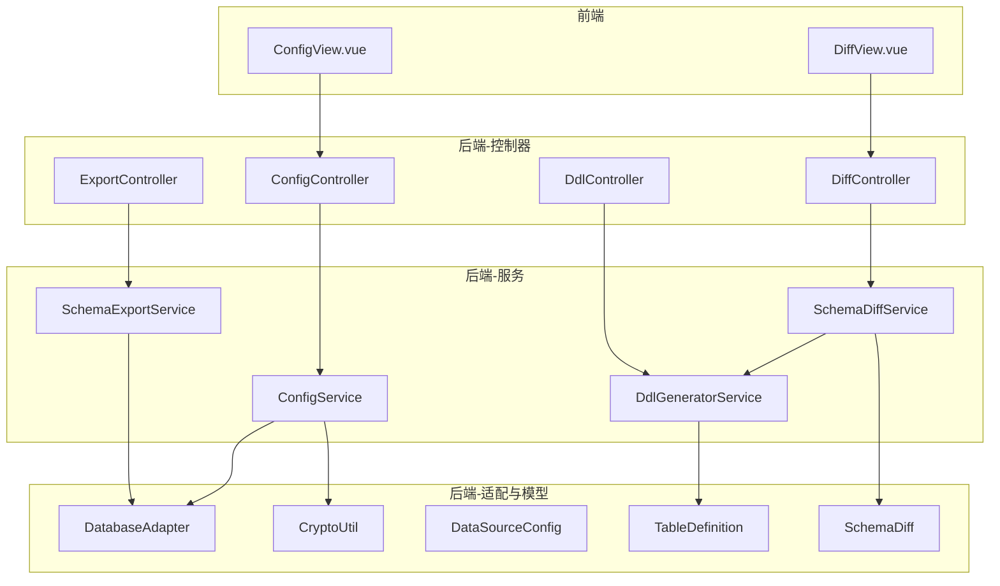
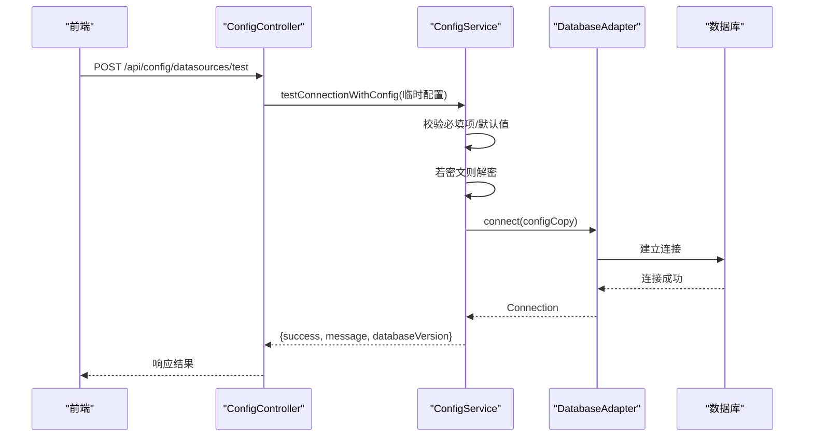
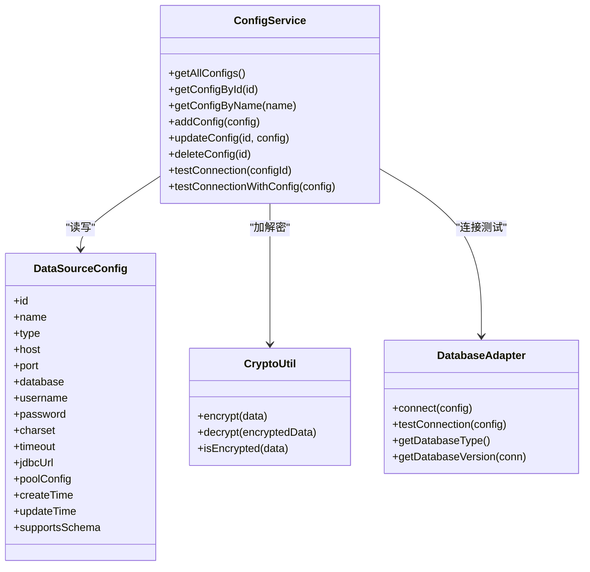
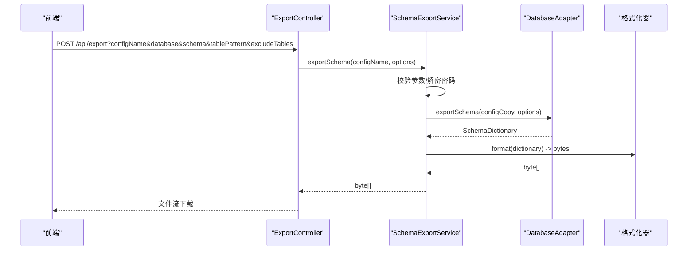
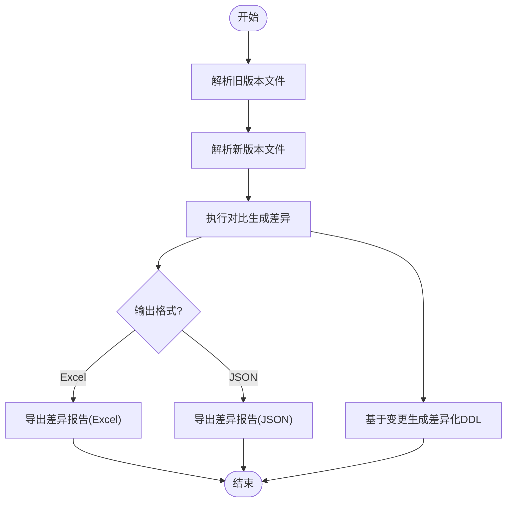
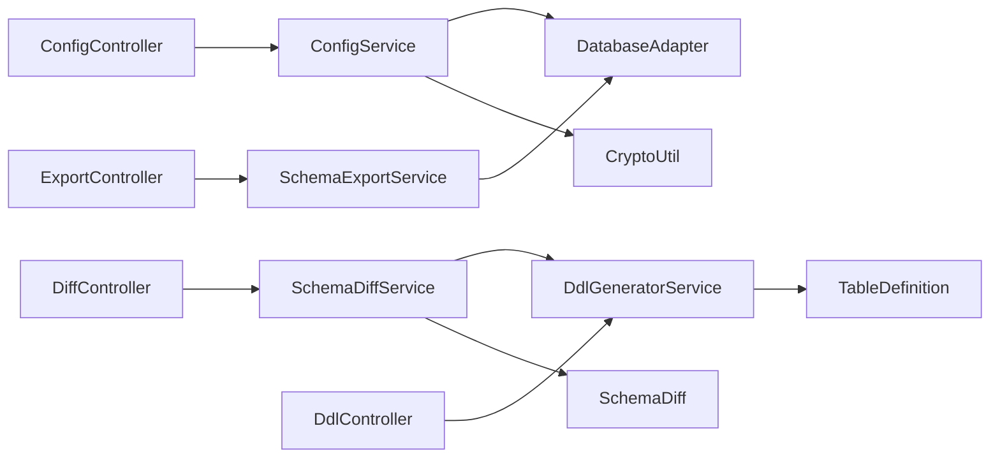

# 核心功能

<cite>
**本文引用的文件**   
- [ConfigController.java](file://schemasync-backend/src/main/java/com/schemasync/controller/ConfigController.java)
- [ExportController.java](file://schemasync-backend/src/main/java/com/schemasync/controller/ExportController.java)
- [DiffController.java](file://schemasync-backend/src/main/java/com/schemasync/controller/DiffController.java)
- [DdlController.java](file://schemasync-backend/src/main/java/com/schemasync/controller/DdlController.java)
- [ConfigService.java](file://schemasync-backend/src/main/java/com/schemasync/service/ConfigService.java)
- [SchemaExportService.java](file://schemasync-backend/src/main/java/com/schemasync/service/SchemaExportService.java)
- [SchemaDiffService.java](file://schemasync-backend/src/main/java/com/schemasync/service/SchemaDiffService.java)
- [DdlGeneratorService.java](file://schemasync-backend/src/main/java/com/schemasync/service/DdlGeneratorService.java)
- [DatabaseAdapter.java](file://schemasync-backend/src/main/java/com/schemasync/adapter/DatabaseAdapter.java)
- [CryptoUtil.java](file://schemasync-backend/src/main/java/com/schemasync/util/CryptoUtil.java)
- [DataSourceConfig.java](file://schemasync-backend/src/main/java/com/schemasync/model/config/DataSourceConfig.java)
- [TableDefinition.java](file://schemasync-backend/src/main/java/com/schemasync/model/dict/TableDefinition.java)
- [SchemaDiff.java](file://schemasync-backend/src/main/java/com/schemasync/model/diff/SchemaDiff.java)
- [ConfigView.vue](file://schemasync-frontend/src/views/ConfigView.vue)
- [DiffView.vue](file://schemasync-frontend/src/views/DiffView.vue)
</cite>

## 目录
1. [简介](#简介)
2. [项目结构](#项目结构)
3. [核心组件](#核心组件)
4. [架构总览](#架构总览)
5. [详细组件分析](#详细组件分析)
6. [依赖关系分析](#依赖关系分析)
7. [性能考虑](#性能考虑)
8. [故障排查指南](#故障排查指南)
9. [结论](#结论)
10. [附录](#附录)

## 简介
本文件聚焦 SchemaSync 的四大核心功能：数据源配置管理、数据字典导出、版本差异对比、DDL脚本生成。文档从实现原理、配置选项、使用方法与最佳实践等维度展开，并给出前后端协作流程、错误处理策略、性能优化建议与常见问题解决方案，帮助读者快速上手与深入理解系统。

## 项目结构
后端采用分层架构：控制器层暴露 REST API；服务层封装业务逻辑；适配器层对接不同数据库；模型层承载数据对象；工具类提供加密等通用能力。前端基于 Vue + Element Plus 提供可视化操作界面。



图表来源
- [ConfigController.java:1-133](file://schemasync-backend/src/main/java/com/schemasync/controller/ConfigController.java#L1-L133)
- [ExportController.java:1-223](file://schemasync-backend/src/main/java/com/schemasync/controller/ExportController.java#L1-L223)
- [DiffController.java:1-108](file://schemasync-backend/src/main/java/com/schemasync/controller/DiffController.java#L1-L108)
- [DdlController.java:1-106](file://schemasync-backend/src/main/java/com/schemasync/controller/DdlController.java#L1-L106)
- [ConfigService.java:1-383](file://schemasync-backend/src/main/java/com/schemasync/service/ConfigService.java#L1-L383)
- [SchemaExportService.java:1-141](file://schemasync-backend/src/main/java/com/schemasync/service/SchemaExportService.java#L1-L141)
- [SchemaDiffService.java:1-800](file://schemasync-backend/src/main/java/com/schemasync/service/SchemaDiffService.java#L1-L800)
- [DdlGeneratorService.java:1-718](file://schemasync-backend/src/main/java/com/schemasync/service/DdlGeneratorService.java#L1-L718)
- [DatabaseAdapter.java:1-134](file://schemasync-backend/src/main/java/com/schemasync/adapter/DatabaseAdapter.java#L1-L134)
- [CryptoUtil.java:1-84](file://schemasync-backend/src/main/java/com/schemasync/util/CryptoUtil.java#L1-L84)
- [DataSourceConfig.java:1-129](file://schemasync-backend/src/main/java/com/schemasync/model/config/DataSourceConfig.java#L1-L129)
- [TableDefinition.java:1-89](file://schemasync-backend/src/main/java/com/schemasync/model/dict/TableDefinition.java#L1-L89)
- [SchemaDiff.java:1-35](file://schemasync-backend/src/main/java/com/schemasync/model/diff/SchemaDiff.java#L1-L35)
- [ConfigView.vue:1-344](file://schemasync-frontend/src/views/ConfigView.vue#L1-L344)
- [DiffView.vue:1-313](file://schemasync-frontend/src/views/DiffView.vue#L1-L313)

章节来源
- [ConfigController.java:1-133](file://schemasync-backend/src/main/java/com/schemasync/controller/ConfigController.java#L1-L133)
- [ExportController.java:1-223](file://schemasync-backend/src/main/java/com/schemasync/controller/ExportController.java#L1-L223)
- [DiffController.java:1-108](file://schemasync-backend/src/main/java/com/schemasync/controller/DiffController.java#L1-L108)
- [DdlController.java:1-106](file://schemasync-backend/src/main/java/com/schemasync/controller/DdlController.java#L1-L106)
- [ConfigService.java:1-383](file://schemasync-backend/src/main/java/com/schemasync/service/ConfigService.java#L1-L383)
- [SchemaExportService.java:1-141](file://schemasync-backend/src/main/java/com/schemasync/service/SchemaExportService.java#L1-L141)
- [SchemaDiffService.java:1-800](file://schemasync-backend/src/main/java/com/schemasync/service/SchemaDiffService.java#L1-L800)
- [DdlGeneratorService.java:1-718](file://schemasync-backend/src/main/java/com/schemasync/service/DdlGeneratorService.java#L1-L718)
- [DatabaseAdapter.java:1-134](file://schemasync-backend/src/main/java/com/schemasync/adapter/DatabaseAdapter.java#L1-L134)
- [CryptoUtil.java:1-84](file://schemasync-backend/src/main/java/com/schemasync/util/CryptoUtil.java#L1-L84)
- [DataSourceConfig.java:1-129](file://schemasync-backend/src/main/java/com/schemasync/model/config/DataSourceConfig.java#L1-L129)
- [TableDefinition.java:1-89](file://schemasync-backend/src/main/java/com/schemasync/model/dict/TableDefinition.java#L1-L89)
- [SchemaDiff.java:1-35](file://schemasync-backend/src/main/java/com/schemasync/model/diff/SchemaDiff.java#L1-L35)
- [ConfigView.vue:1-344](file://schemasync-frontend/src/views/ConfigView.vue#L1-L344)
- [DiffView.vue:1-313](file://schemasync-frontend/src/views/DiffView.vue#L1-L313)

## 核心组件
- 配置管理
  - 控制器：提供数据源的增删改查、连接测试接口
  - 服务：持久化配置（JSON文件）、内存缓存、密码加解密、连接测试
  - 适配器：根据类型获取具体数据库适配器，支持多数据库
  - 前端：可视化表单、在线测试连接、保存/更新/删除
- 数据字典导出
  - 控制器：接收导出参数，返回 Excel/JSON 文件流
  - 服务：解析配置、解密密码、调用适配器导出 SchemaDictionary、格式化输出
  - 适配器：按数据库方言读取表、字段、索引、外键等元信息
- 版本差异对比
  - 控制器：上传两个版本文件，返回差异统计或下载差异报告
  - 服务：解析旧/新版本、执行对比、格式化结果、基于变更生成差异化 DDL
- DDL 脚本生成
  - 控制器：预览/下载全量 DDL
  - 服务：解析输入文件为数据字典，按目标数据库类型生成 CREATE TABLE/VIEW 语句

章节来源
- [ConfigController.java:1-133](file://schemasync-backend/src/main/java/com/schemasync/controller/ConfigController.java#L1-L133)
- [ConfigService.java:1-383](file://schemasync-backend/src/main/java/com/schemasync/service/ConfigService.java#L1-L383)
- [DatabaseAdapter.java:1-134](file://schemasync-backend/src/main/java/com/schemasync/adapter/DatabaseAdapter.java#L1-L134)
- [ExportController.java:1-223](file://schemasync-backend/src/main/java/com/schemasync/controller/ExportController.java#L1-L223)
- [SchemaExportService.java:1-141](file://schemasync-backend/src/main/java/com/schemasync/service/SchemaExportService.java#L1-L141)
- [DiffController.java:1-108](file://schemasync-backend/src/main/java/com/schemasync/controller/DiffController.java#L1-L108)
- [SchemaDiffService.java:1-800](file://schemasync-backend/src/main/java/com/schemasync/service/SchemaDiffService.java#L1-L800)
- [DdlController.java:1-106](file://schemasync-backend/src/main/java/com/schemasync/controller/DdlController.java#L1-L106)
- [DdlGeneratorService.java:1-718](file://schemasync-backend/src/main/java/com/schemasync/service/DdlGeneratorService.java#L1-L718)
- [ConfigView.vue:1-344](file://schemasync-frontend/src/views/ConfigView.vue#L1-L344)
- [DiffView.vue:1-313](file://schemasync-frontend/src/views/DiffView.vue#L1-L313)

## 架构总览
整体数据流遵循“前端交互 → 控制器 → 服务 → 适配器/工具 → 数据库”的路径。关键路径包括：
- 配置管理：前端表单提交 → ConfigController → ConfigService（加密/持久化）→ DatabaseAdapter（连接测试）
- 字典导出：前端选择配置/库/模式/过滤 → ExportController → SchemaExportService → DatabaseAdapter → 格式化器
- 版本对比：前端上传两版文件 → DiffController → SchemaDiffService → 解析/对比/格式化/可选生成DDL
- DDL生成：前端上传字典文件 → DdlController → DdlGeneratorService → 生成 SQL



图表来源
- [ConfigController.java:86-131](file://schemasync-backend/src/main/java/com/schemasync/controller/ConfigController.java#L86-L131)
- [ConfigService.java:234-334](file://schemasync-backend/src/main/java/com/schemasync/service/ConfigService.java#L234-L334)
- [DatabaseAdapter.java:26-34](file://schemasync-backend/src/main/java/com/schemasync/adapter/DatabaseAdapter.java#L26-L34)

## 详细组件分析

### 数据源配置管理（可视化配置、连接测试、AES加密）
- 实现原理
  - 配置持久化：以 JSON 文件存储，启动时加载到内存缓存，新增/更新/删除后落盘
  - 密码安全：新增/更新时对明文密码进行 AES 加密后再存储；连接前按需解密
  - 连接测试：通过适配器工厂获取对应数据库适配器，建立连接并验证有效性
- 配置选项
  - 基础：名称、类型、主机、端口、数据库、用户名、密码
  - 高级：字符集、超时、自定义 JDBC URL、连接池配置（JSON）
- 使用方法
  - 前端页面新增/编辑数据源，支持在线测试连接
  - 列表页可测试、编辑、删除
- 最佳实践
  - 生产环境建议将配置文件放置于绝对路径，避免权限问题
  - 对敏感信息使用强密钥管理方案替换当前硬编码密钥
  - 合理设置连接池参数与超时时间，避免资源耗尽



图表来源
- [DataSourceConfig.java:1-129](file://schemasync-backend/src/main/java/com/schemasync/model/config/DataSourceConfig.java#L1-L129)
- [ConfigService.java:1-383](file://schemasync-backend/src/main/java/com/schemasync/service/ConfigService.java#L1-L383)
- [CryptoUtil.java:1-84](file://schemasync-backend/src/main/java/com/schemasync/util/CryptoUtil.java#L1-L84)
- [DatabaseAdapter.java:1-134](file://schemasync-backend/src/main/java/com/schemasync/adapter/DatabaseAdapter.java#L1-L134)

章节来源
- [ConfigController.java:33-84](file://schemasync-backend/src/main/java/com/schemasync/controller/ConfigController.java#L33-L84)
- [ConfigService.java:133-213](file://schemasync-backend/src/main/java/com/schemasync/service/ConfigService.java#L133-L213)
- [ConfigService.java:234-334](file://schemasync-backend/src/main/java/com/schemasync/service/ConfigService.java#L234-L334)
- [ConfigService.java:359-381](file://schemasync-backend/src/main/java/com/schemasync/service/ConfigService.java#L359-L381)
- [CryptoUtil.java:37-82](file://schemasync-backend/src/main/java/com/schemasync/util/CryptoUtil.java#L37-L82)
- [ConfigView.vue:111-326](file://schemasync-frontend/src/views/ConfigView.vue#L111-L326)

### 数据字典导出（6种数据库支持、多格式输出、表过滤）
- 实现原理
  - 控制器接收配置名、数据库、可选 schema、表过滤与排除参数
  - 服务层根据配置获取适配器，解密密码，调用适配器导出 SchemaDictionary
  - 格式化器将数据字典转换为 Excel 或 JSON 字节数组并返回下载
- 配置选项
  - 导出格式：excel/json（当前默认 excel）
  - 过滤：schema、tablePattern、excludeTables
  - 包含内容：索引、外键等
- 使用方法
  - 在导出页面选择数据源配置、数据库、schema（如支持），填写表过滤条件
  - 点击导出，浏览器自动下载文件
- 最佳实践
  - 大库导出建议先缩小范围（指定 schema 或表过滤）
  - 如需二次处理，优先选择 JSON 格式便于程序消费



图表来源
- [ExportController.java:48-99](file://schemasync-backend/src/main/java/com/schemasync/controller/ExportController.java#L48-L99)
- [SchemaExportService.java:46-111](file://schemasync-backend/src/main/java/com/schemasync/service/SchemaExportService.java#L46-L111)
- [DatabaseAdapter.java:116](file://schemasync-backend/src/main/java/com/schemasync/adapter/DatabaseAdapter.java#L116)

章节来源
- [ExportController.java:48-99](file://schemasync-backend/src/main/java/com/schemasync/controller/ExportController.java#L48-L99)
- [ExportController.java:101-201](file://schemasync-backend/src/main/java/com/schemasync/controller/ExportController.java#L101-L201)
- [SchemaExportService.java:46-111](file://schemasync-backend/src/main/java/com/schemasync/service/SchemaExportService.java#L46-L111)

### 版本差异对比（智能识别变更、破坏性变更标注、详细报告）
- 实现原理
  - 解析旧/新版本文件（Excel/JSON）为数据字典
  - 执行对比算法，生成差异对象（含变更列表、统计、元数据）
  - 支持导出差异报告（Excel/JSON）与基于变更生成差异化 DDL
- 配置选项
  - 导出格式：excel/json
  - 数据库类型：mysql/gaussdb_mysql/gaussdb_oracle（用于差异化 DDL）
- 使用方法
  - 上传两个版本的数据字典文件，选择数据库类型
  - 查看差异统计，下载详细报告，或直接生成差异化 DDL
- 最佳实践
  - 破坏性变更需人工确认后再执行
  - 建议在 CI/CD 中集成差异检查，阻断高风险变更



图表来源
- [SchemaDiffService.java:77-145](file://schemasync-backend/src/main/java/com/schemasync/service/SchemaDiffService.java#L77-L145)
- [SchemaDiffService.java:203-227](file://schemasync-backend/src/main/java/com/schemasync/service/SchemaDiffService.java#L203-L227)

章节来源
- [DiffController.java:31-106](file://schemasync-backend/src/main/java/com/schemasync/controller/DiffController.java#L31-L106)
- [SchemaDiffService.java:77-145](file://schemasync-backend/src/main/java/com/schemasync/service/SchemaDiffService.java#L77-L145)
- [SchemaDiffService.java:203-227](file://schemasync-backend/src/main/java/com/schemasync/service/SchemaDiffService.java#L203-L227)
- [SchemaDiff.java:1-35](file://schemasync-backend/src/main/java/com/schemasync/model/diff/SchemaDiff.java#L1-L35)
- [DiffView.vue:132-257](file://schemasync-frontend/src/views/DiffView.vue#L132-L257)

### DDL脚本生成（自动变更SQL、回滚脚本、事务控制）
- 实现原理
  - 全量生成：解析数据字典，按目标数据库类型生成完整 DDL（表、视图、索引、外键、注释等）
  - 差异化生成：基于对比结果，仅生成变更对应的 DDL（新增/修改字段、索引等）
  - 回滚与事务：当前未内置自动回滚与事务包裹，建议在执行前备份并在外部事务中执行
- 配置选项
  - 输入文件类型：excel/json
  - 目标数据库类型：mysql/gaussdb_mysql/gaussdb_oracle
- 使用方法
  - 全量生成：上传数据字典文件，选择数据库类型，预览/下载 DDL
  - 差异生成：在对比页面选择数据库类型，直接生成差异化 DDL
- 最佳实践
  - 在生产执行前务必进行人工审查
  - 将生成的 DDL 纳入版本管理与发布流水线
  - 对于破坏性变更，准备手动回滚脚本并在维护窗口执行

```mermaid
sequenceDiagram
participant FE as "前端"
participant DLC as "DdlController"
participant DGS as "DdlGeneratorService"
participant PAR as "解析器"
participant GEN as "生成器"
FE->>DLC : POST /api/ddl/generate(file,fileType,databaseType)
DLC->>DGS : generateDdl(inputStream, fileType, databaseType)
DGS->>PAR : 解析Excel/JSON为数据字典
PAR-->>DGS : SchemaDictionary
DGS->>GEN : 按数据库类型生成DDL
GEN-->>DGS : SQL字符串
DGS-->>DLC : SQL字符串
DLC-->>FE : 文件流下载
```

图表来源
- [DdlController.java:32-60](file://schemasync-backend/src/main/java/com/schemasync/controller/DdlController.java#L32-L60)
- [DdlGeneratorService.java:40-97](file://schemasync-backend/src/main/java/com/schemasync/service/DdlGeneratorService.java#L40-L97)

章节来源
- [DdlController.java:32-104](file://schemasync-backend/src/main/java/com/schemasync/controller/DdlController.java#L32-L104)
- [DdlGeneratorService.java:81-177](file://schemasync-backend/src/main/java/com/schemasync/service/DdlGeneratorService.java#L81-L177)
- [TableDefinition.java:1-89](file://schemasync-backend/src/main/java/com/schemasync/model/dict/TableDefinition.java#L1-L89)

## 依赖关系分析
- 控制器与服务解耦：每个控制器只负责参数校验与响应组装，核心逻辑下沉至服务层
- 服务与适配器解耦：服务通过适配器接口访问数据库元信息，屏蔽多数据库差异
- 工具复用：加密工具被配置管理与导出链路共用
- 模型共享：数据字典与差异模型在多模块间复用，保证一致性



图表来源
- [ConfigController.java:1-133](file://schemasync-backend/src/main/java/com/schemasync/controller/ConfigController.java#L1-L133)
- [ExportController.java:1-223](file://schemasync-backend/src/main/java/com/schemasync/controller/ExportController.java#L1-L223)
- [DiffController.java:1-108](file://schemasync-backend/src/main/java/com/schemasync/controller/DiffController.java#L1-L108)
- [DdlController.java:1-106](file://schemasync-backend/src/main/java/com/schemasync/controller/DdlController.java#L1-L106)
- [ConfigService.java:1-383](file://schemasync-backend/src/main/java/com/schemasync/service/ConfigService.java#L1-L383)
- [SchemaExportService.java:1-141](file://schemasync-backend/src/main/java/com/schemasync/service/SchemaExportService.java#L1-L141)
- [SchemaDiffService.java:1-800](file://schemasync-backend/src/main/java/com/schemasync/service/SchemaDiffService.java#L1-L800)
- [DdlGeneratorService.java:1-718](file://schemasync-backend/src/main/java/com/schemasync/service/DdlGeneratorService.java#L1-L718)
- [DatabaseAdapter.java:1-134](file://schemasync-backend/src/main/java/com/schemasync/adapter/DatabaseAdapter.java#L1-L134)
- [CryptoUtil.java:1-84](file://schemasync-backend/src/main/java/com/schemasync/util/CryptoUtil.java#L1-L84)
- [TableDefinition.java:1-89](file://schemasync-backend/src/main/java/com/schemasync/model/dict/TableDefinition.java#L1-L89)
- [SchemaDiff.java:1-35](file://schemasync-backend/src/main/java/com/schemasync/model/diff/SchemaDiff.java#L1-L35)

章节来源
- [ConfigController.java:1-133](file://schemasync-backend/src/main/java/com/schemasync/controller/ConfigController.java#L1-L133)
- [ExportController.java:1-223](file://schemasync-backend/src/main/java/com/schemasync/controller/ExportController.java#L1-L223)
- [DiffController.java:1-108](file://schemasync-backend/src/main/java/com/schemasync/controller/DiffController.java#L1-L108)
- [DdlController.java:1-106](file://schemasync-backend/src/main/java/com/schemasync/controller/DdlController.java#L1-L106)
- [ConfigService.java:1-383](file://schemasync-backend/src/main/java/com/schemasync/service/ConfigService.java#L1-L383)
- [SchemaExportService.java:1-141](file://schemasync-backend/src/main/java/com/schemasync/service/SchemaExportService.java#L1-L141)
- [SchemaDiffService.java:1-800](file://schemasync-backend/src/main/java/com/schemasync/service/SchemaDiffService.java#L1-L800)
- [DdlGeneratorService.java:1-718](file://schemasync-backend/src/main/java/com/schemasync/service/DdlGeneratorService.java#L1-L718)
- [DatabaseAdapter.java:1-134](file://schemasync-backend/src/main/java/com/schemasync/adapter/DatabaseAdapter.java#L1-L134)
- [CryptoUtil.java:1-84](file://schemasync-backend/src/main/java/com/schemasync/util/CryptoUtil.java#L1-L84)
- [TableDefinition.java:1-89](file://schemasync-backend/src/main/java/com/schemasync/model/dict/TableDefinition.java#L1-L89)
- [SchemaDiff.java:1-35](file://schemasync-backend/src/main/java/com/schemasync/model/diff/SchemaDiff.java#L1-L35)

## 性能考虑
- 连接与网络
  - 合理设置超时与重试，避免长耗时阻塞请求
  - 生产环境建议使用连接池并监控池状态
- 导出与对比
  - 大库导出建议限定 schema/表范围，减少 IO 与序列化开销
  - 对比时尽量使用结构化数据（Excel/JSON）而非原始 SQL
- DDL 生成
  - 全量生成适合初始化或重建场景；增量变更优先使用差异化 DDL
  - 注意索引与外键顺序，避免不必要的重建

## 故障排查指南
- 连接失败
  - 检查主机、端口、数据库名、用户名是否正确
  - 确认防火墙与白名单放行
  - 查看日志中的异常堆栈定位原因
- 密码解密失败
  - 确认配置文件中密码是否为 Base64 密文
  - 检查密钥一致性与运行环境编码
- 导出为空或报错
  - 确认配置存在且有效
  - 检查数据库权限与 schema 是否存在
- 对比结果为空
  - 确认两份文件来自同一库或兼容结构
  - 检查文件是否损坏或格式不匹配
- DDL 生成语法错误
  - 核对目标数据库类型与字段类型映射
  - 对破坏性变更进行人工复核

章节来源
- [ConfigService.java:234-334](file://schemasync-backend/src/main/java/com/schemasync/service/ConfigService.java#L234-L334)
- [ExportController.java:101-201](file://schemasync-backend/src/main/java/com/schemasync/controller/ExportController.java#L101-L201)
- [SchemaDiffService.java:77-145](file://schemasync-backend/src/main/java/com/schemasync/service/SchemaDiffService.java#L77-L145)
- [DdlGeneratorService.java:40-97](file://schemasync-backend/src/main/java/com/schemasync/service/DdlGeneratorService.java#L40-L97)

## 结论
SchemaSync 通过清晰的层次划分与适配器抽象，实现了跨数据库的配置管理、字典导出、差异对比与 DDL 生成。结合前端可视化操作，显著降低了数据库结构管理的复杂度与风险。建议在生产环境中完善密钥管理、引入自动化测试与发布流水线，进一步提升稳定性与效率。

## 附录
- 常用 API 参考（示例路径）
  - 配置管理
    - GET /api/config/datasources
    - POST /api/config/datasources
    - PUT /api/config/datasources/{id}
    - DELETE /api/config/datasources/{id}
    - POST /api/config/datasources/test
  - 数据字典导出
    - POST /api/export?configName&database&schema&tablePattern&excludeTables
    - GET /api/export/databases?configName
    - GET /api/export/schemas?configName&database
  - 版本对比
    - POST /api/diff (下载差异报告)
    - POST /api/diff/summary (返回差异统计)
    - POST /api/diff/ddl (生成差异化 DDL)
  - DDL 生成
    - POST /api/ddl/generate
    - POST /api/ddl/preview
    - POST /api/ddl/download

章节来源
- [ConfigController.java:33-131](file://schemasync-backend/src/main/java/com/schemasync/controller/ConfigController.java#L33-L131)
- [ExportController.java:48-201](file://schemasync-backend/src/main/java/com/schemasync/controller/ExportController.java#L48-L201)
- [DiffController.java:31-106](file://schemasync-backend/src/main/java/com/schemasync/controller/DiffController.java#L31-L106)
- [DdlController.java:32-104](file://schemasync-backend/src/main/java/com/schemasync/controller/DdlController.java#L32-L104)