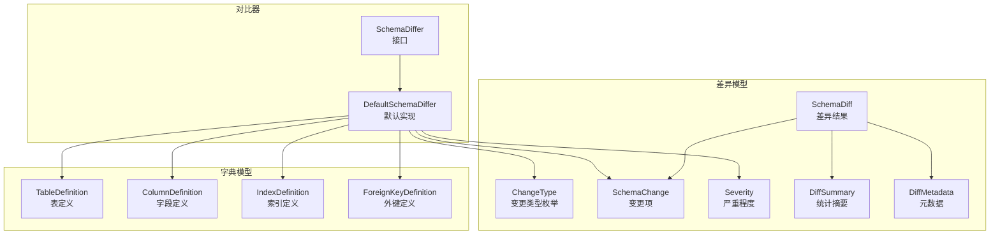
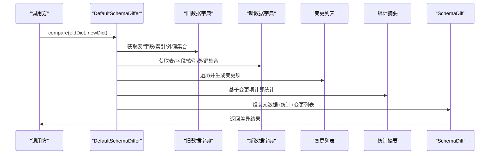
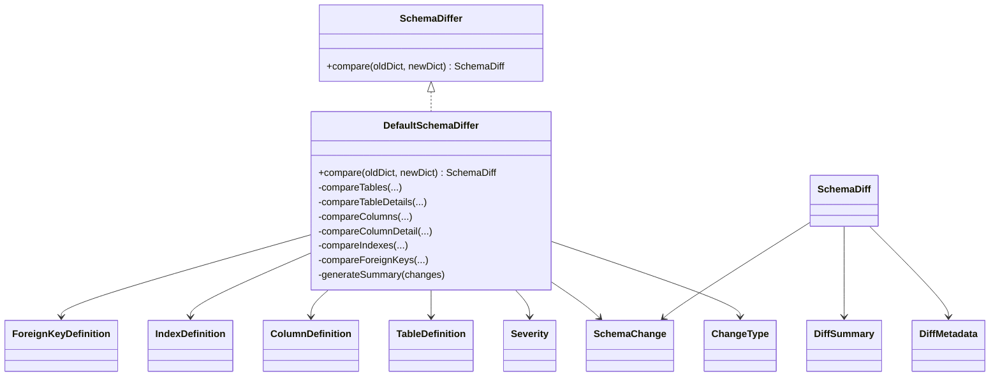
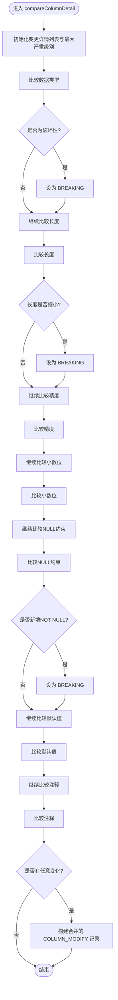

# 变更类型详解

<cite>
**本文引用的文件**   
- [ChangeType.java](file://schemasync-backend/src/main/java/com/schemasync/model/diff/ChangeType.java)
- [SchemaChange.java](file://schemasync-backend/src/main/java/com/schemasync/model/diff/SchemaChange.java)
- [Severity.java](file://schemasync-backend/src/main/java/com/schemasync/model/diff/Severity.java)
- [DefaultSchemaDiffer.java](file://schemasync-backend/src/main/java/com/schemasync/differ/DefaultSchemaDiffer.java)
- [SchemaDiffer.java](file://schemasync-backend/src/main/java/com/schemasync/differ/SchemaDiffer.java)
- [TableDefinition.java](file://schemasync-backend/src/main/java/com/schemasync/model/dict/TableDefinition.java)
- [ColumnDefinition.java](file://schemasync-backend/src/main/java/com/schemasync/model/dict/ColumnDefinition.java)
- [IndexDefinition.java](file://schemasync-backend/src/main/java/com/schemasync/model/dict/IndexDefinition.java)
- [ForeignKeyDefinition.java](file://schemasync-backend/src/main/java/com/schemasync/model/dict/ForeignKeyDefinition.java)
- [SchemaDiff.java](file://schemasync-backend/src/main/java/com/schemasync/model/diff/SchemaDiff.java)
- [DiffSummary.java](file://schemasync-backend/src/main/java/com/schemasync/model/diff/DiffSummary.java)
- [DiffMetadata.java](file://schemasync-backend/src/main/java/com/schemasync/model/diff/DiffMetadata.java)
</cite>

## 目录
1. [简介](#简介)
2. [项目结构](#项目结构)
3. [核心组件](#核心组件)
4. [架构总览](#架构总览)
5. [详细组件分析](#详细组件分析)
6. [依赖关系分析](#依赖关系分析)
7. [性能考量](#性能考量)
8. [故障排查指南](#故障排查指南)
9. [结论](#结论)
10. [附录](#附录)

## 简介
本文件围绕“变更类型系统”进行系统化说明，覆盖以下目标：
- 完整解释 ChangeType 枚举中定义的各类变更（含 TABLE_ADD、TABLE_DROP、TABLE_MODIFY、COLUMN_ADD、COLUMN_DROP、COLUMN_MODIFY、INDEX_ADD、INDEX_DROP、INDEX_MODIFY、FOREIGN_KEY_ADD、FOREIGN_KEY_DROP）
- 明确每种变更类型的检测规则、触发条件与业务含义
- 详细说明 SchemaChange 数据结构字段用途（如 tableName、columnName、severity、details 等）
- 提供各变更类型的实际示例与 JSON 序列化格式要点
- 解释变更类型的优先级排序和影响评估机制
- 给出新增变更类型的扩展开发指南

## 项目结构
变更类型系统位于后端模块的 model.diff 与 differ 包下，核心由枚举、数据模型与对比器实现组成。

图表来源
- [ChangeType.java:1-43](file://schemasync-backend/src/main/java/com/schemasync/model/diff/ChangeType.java#L1-L43)
- [SchemaChange.java:1-181](file://schemasync-backend/src/main/java/com/schemasync/model/diff/SchemaChange.java#L1-L181)
- [Severity.java:1-17](file://schemasync-backend/src/main/java/com/schemasync/model/diff/Severity.java#L1-L17)
- [SchemaDiff.java:1-35](file://schemasync-backend/src/main/java/com/schemasync/model/diff/SchemaDiff.java#L1-L35)
- [DiffSummary.java:1-67](file://schemasync-backend/src/main/java/com/schemasync/model/diff/DiffSummary.java#L1-L67)
- [DiffMetadata.java:1-59](file://schemasync-backend/src/main/java/com/schemasync/model/diff/DiffMetadata.java#L1-L59)
- [TableDefinition.java:1-89](file://schemasync-backend/src/main/java/com/schemasync/model/dict/TableDefinition.java#L1-L89)
- [ColumnDefinition.java:1-116](file://schemasync-backend/src/main/java/com/schemasync/model/dict/ColumnDefinition.java#L1-L116)
- [IndexDefinition.java:1-49](file://schemasync-backend/src/main/java/com/schemasync/model/dict/IndexDefinition.java#L1-L49)
- [ForeignKeyDefinition.java:1-54](file://schemasync-backend/src/main/java/com/schemasync/model/dict/ForeignKeyDefinition.java#L1-L54)
- [SchemaDiffer.java:1-24](file://schemasync-backend/src/main/java/com/schemasync/differ/SchemaDiffer.java#L1-L24)
- [DefaultSchemaDiffer.java:1-512](file://schemasync-backend/src/main/java/com/schemasync/differ/DefaultSchemaDiffer.java#L1-L512)

章节来源
- [SchemaDiffer.java:1-24](file://schemasync-backend/src/main/java/com/schemasync/differ/SchemaDiffer.java#L1-L24)
- [DefaultSchemaDiffer.java:1-512](file://schemasync-backend/src/main/java/com/schemasync/differ/DefaultSchemaDiffer.java#L1-L512)

## 核心组件
- ChangeType：变更类型枚举，用于标识一次 schema 变更的种类。
- Severity：严重程度，区分破坏性与非破坏性变更。
- SchemaChange：单条变更记录，包含变更类型、影响对象（表/字段）、严重级别及详情。
- DefaultSchemaDiffer：默认对比器，负责扫描旧/新数据字典并生成变更列表。
- 字典模型（TableDefinition、ColumnDefinition、IndexDefinition、ForeignKeyDefinition）：描述数据库对象的静态结构信息，作为对比输入。

章节来源
- [ChangeType.java:1-43](file://schemasync-backend/src/main/java/com/schemasync/model/diff/ChangeType.java#L1-L43)
- [Severity.java:1-17](file://schemasync-backend/src/main/java/com/schemasync/model/diff/Severity.java#L1-L17)
- [SchemaChange.java:1-181](file://schemasync-backend/src/main/java/com/schemasync/model/diff/SchemaChange.java#L1-L181)
- [DefaultSchemaDiffer.java:1-512](file://schemasync-backend/src/main/java/com/schemasync/differ/DefaultSchemaDiffer.java#L1-L512)
- [TableDefinition.java:1-89](file://schemasync-backend/src/main/java/com/schemasync/model/dict/TableDefinition.java#L1-L89)
- [ColumnDefinition.java:1-116](file://schemasync-backend/src/main/java/com/schemasync/model/dict/ColumnDefinition.java#L1-L116)
- [IndexDefinition.java:1-49](file://schemasync-backend/src/main/java/com/schemasync/model/dict/IndexDefinition.java#L1-L49)
- [ForeignKeyDefinition.java:1-54](file://schemasync-backend/src/main/java/com/schemasync/model/dict/ForeignKeyDefinition.java#L1-L54)

## 架构总览
对比流程从 SchemaDiffer 接口开始，由 DefaultSchemaDiffer 实现具体逻辑：读取旧/新 SchemaDictionary，逐层对比表、字段、索引、外键，产出 SchemaDiff（包含 DiffMetadata、DiffSummary 与变更列表）。

图表来源
- [SchemaDiffer.java:1-24](file://schemasync-backend/src/main/java/com/schemasync/differ/SchemaDiffer.java#L1-L24)
- [DefaultSchemaDiffer.java:24-52](file://schemasync-backend/src/main/java/com/schemasync/differ/DefaultSchemaDiffer.java#L24-L52)
- [SchemaDiff.java:1-35](file://schemasync-backend/src/main/java/com/schemasync/model/diff/SchemaDiff.java#L1-L35)
- [DiffSummary.java:1-67](file://schemasync-backend/src/main/java/com/schemasync/model/diff/DiffSummary.java#L1-L67)
- [DiffMetadata.java:1-59](file://schemasync-backend/src/main/java/com/schemasync/model/diff/DiffMetadata.java#L1-L59)

## 详细组件分析

### 变更类型枚举与语义
- 表级变更
  - TABLE_ADD：在新字典中存在而旧字典不存在的表。
  - TABLE_DROP：在旧字典中存在而新字典不存在的表。
  - TABLE_MODIFY：同一表存在但内部结构发生变化（字段、索引或外键有变动时，统计表修改数量时会去重计数）。
- 字段级变更
  - COLUMN_ADD：表中新增字段。
  - COLUMN_DROP：表中删除字段。
  - COLUMN_MODIFY：同一字段属性变化（数据类型、长度、精度、小数位、NULL约束、默认值、注释等），合并为一条记录。
- 索引级变更
  - INDEX_ADD：新增非主键索引。
  - INDEX_DROP：删除非主键索引。
  - INDEX_MODIFY：同名索引的定义发生变动（类型、唯一性、列集合）。
- 外键级变更
  - FOREIGN_KEY_ADD：新增外键约束。
  - FOREIGN_KEY_DROP：删除外键约束。
  - FOREIGN_KEY_MODIFY：当前实现未使用此枚举；若需支持可在对比逻辑中扩展。

章节来源
- [ChangeType.java:1-43](file://schemasync-backend/src/main/java/com/schemasync/model/diff/ChangeType.java#L1-L43)
- [DefaultSchemaDiffer.java:57-112](file://schemasync-backend/src/main/java/com/schemasync/differ/DefaultSchemaDiffer.java#L57-L112)
- [DefaultSchemaDiffer.java:117-145](file://schemasync-backend/src/main/java/com/schemasync/differ/DefaultSchemaDiffer.java#L117-L145)
- [DefaultSchemaDiffer.java:147-214](file://schemasync-backend/src/main/java/com/schemasync/differ/DefaultSchemaDiffer.java#L147-L214)
- [DefaultSchemaDiffer.java:216-316](file://schemasync-backend/src/main/java/com/schemasync/differ/DefaultSchemaDiffer.java#L216-L316)
- [DefaultSchemaDiffer.java:318-389](file://schemasync-backend/src/main/java/com/schemasync/differ/DefaultSchemaDiffer.java#L318-L389)
- [DefaultSchemaDiffer.java:391-428](file://schemasync-backend/src/main/java/com/schemasync/differ/DefaultSchemaDiffer.java#L391-L428)
- [DefaultSchemaDiffer.java:433-455](file://schemasync-backend/src/main/java/com/schemasync/differ/DefaultSchemaDiffer.java#L433-L455)
- [DefaultSchemaDiffer.java:469-486](file://schemasync-backend/src/main/java/com/schemasync/differ/DefaultSchemaDiffer.java#L469-L486)

### 变更项 SchemaChange 设计
- changeType：变更类型，对应 ChangeType 枚举。
- tableName：受影响的表名（所有变更均具备）。
- columnName：仅字段级变更时使用。
- severity：严重程度，BREAKING 表示可能破坏现有应用或数据；NON_BREAKING 表示兼容变更。
- details：变更详情，可为字符串或结构化对象（Map/实体），便于前端展示或下游处理。
- oldDataType/newDataType、oldLength/newLength、oldPrecision/newPrecision、oldComment/newComment：字段级变更时用于快速定位差异点。
- Builder：提供链式构建方式，简化构造。

章节来源
- [SchemaChange.java:1-181](file://schemasync-backend/src/main/java/com/schemasync/model/diff/SchemaChange.java#L1-L181)

### 严重程度与影响评估
- BREAKING：可能导致数据丢失或应用故障，例如删除表、删除字段、缩小长度、增加 NOT NULL 约束、改变数值精度等。
- NON_BREAKING：通常向后兼容，例如新增表/字段/索引/外键、删除非关键索引、修改注释等。
- 字段修改的严重级别按“最坏情况”提升：只要任一子项判定为破坏性，整条 COLUMN_MODIFY 即标记为 BREAKING。

章节来源
- [Severity.java:1-17](file://schemasync-backend/src/main/java/com/schemasync/model/diff/Severity.java#L1-L17)
- [DefaultSchemaDiffer.java:216-316](file://schemasync-backend/src/main/java/com/schemasync/differ/DefaultSchemaDiffer.java#L216-L316)

### 变更检测规则与触发条件

#### 表级变更
- TABLE_ADD：新字典中存在且旧字典不存在的表。
- TABLE_DROP：旧字典中存在且新字典不存在的表。
- TABLE_MODIFY：当某表存在字段/索引/外键层面的变更时，统计表修改数量会去重计数该表。

章节来源
- [DefaultSchemaDiffer.java:69-112](file://schemasync-backend/src/main/java/com/schemasync/differ/DefaultSchemaDiffer.java#L69-L112)
- [DefaultSchemaDiffer.java:469-475](file://schemasync-backend/src/main/java/com/schemasync/differ/DefaultSchemaDiffer.java#L469-L475)

#### 字段级变更
- COLUMN_ADD：新字段存在于新字典但不在旧字典。
- COLUMN_DROP：旧字段存在于旧字典但不在新字典。
- COLUMN_MODIFY：同名字段存在但属性发生变化（数据类型、长度、精度、小数位、NULL约束、默认值、注释等），合并为一条记录。

章节来源
- [DefaultSchemaDiffer.java:163-214](file://schemasync-backend/src/main/java/com/schemasync/differ/DefaultSchemaDiffer.java#L163-L214)
- [DefaultSchemaDiffer.java:216-316](file://schemasync-backend/src/main/java/com/schemasync/differ/DefaultSchemaDiffer.java#L216-L316)

#### 索引级变更
- 过滤 PRIMARY 索引，仅对比普通索引。
- INDEX_ADD：新索引存在而旧索引不存在。
- INDEX_DROP：旧索引存在而新索引不存在。
- INDEX_MODIFY：同名索引的类型、唯一性或列集合发生变化。

章节来源
- [DefaultSchemaDiffer.java:318-389](file://schemasync-backend/src/main/java/com/schemasync/differ/DefaultSchemaDiffer.java#L318-L389)

#### 外键级变更
- FOREIGN_KEY_ADD：新外键存在而旧外键不存在。
- FOREIGN_KEY_DROP：旧外键存在而新外键不存在。
- FOREIGN_KEY_MODIFY：当前实现未产生此类变更；如需支持可在此处扩展。

章节来源
- [DefaultSchemaDiffer.java:391-428](file://schemasync-backend/src/main/java/com/schemasync/differ/DefaultSchemaDiffer.java#L391-L428)

### 变更优先级与影响评估机制
- 字段修改的多项属性变化会被合并为一条 COLUMN_MODIFY 记录，其 severity 取各项中最高的（BREAKING > NON_BREAKING）。
- 统计层面：
  - tablesModified：对同一表的多个变更只计一次。
  - columnsModified：对同一表.字段的多个变更只计一次。
  - breakingChanges：统计所有 severity 为 BREAKING 的变更总数。

章节来源
- [DefaultSchemaDiffer.java:216-316](file://schemasync-backend/src/main/java/com/schemasync/differ/DefaultSchemaDiffer.java#L216-L316)
- [DefaultSchemaDiffer.java:433-455](file://schemasync-backend/src/main/java/com/schemasync/differ/DefaultSchemaDiffer.java#L433-L455)
- [DefaultSchemaDiffer.java:469-486](file://schemasync-backend/src/main/java/com/schemasync/differ/DefaultSchemaDiffer.java#L469-L486)

### 变更类型示例与 JSON 序列化格式要点
以下为各变更类型在 JSON 序列化时的典型字段组合（以字段名为准，details 可为字符串或对象）：

- TABLE_ADD
  - 关键字段：changeType=TABLE_ADD、tableName、severity=NON_BREAKING、details 可包含表注释、字段数、索引数等
- TABLE_DROP
  - 关键字段：changeType=TABLE_DROP、tableName、severity=BREAKING、details 可包含表注释
- TABLE_MODIFY
  - 关键字段：changeType=TABLE_MODIFY、tableName、severity 取决于内部变更、details 可包含变更明细
- COLUMN_ADD
  - 关键字段：changeType=COLUMN_ADD、tableName、columnName、severity=NON_BREAKING、newDataType/newLength/newPrecision/newComment
- COLUMN_DROP
  - 关键字段：changeType=COLUMN_DROP、tableName、columnName、severity=BREAKING、oldDataType/oldLength/oldPrecision/oldComment、details 可包含旧定义
- COLUMN_MODIFY
  - 关键字段：changeType=COLUMN_MODIFY、tableName、columnName、severity 取最高、oldDataType/newDataType、oldLength/newLength、oldPrecision/newPrecision、oldComment/newComment、details 为合并后的变更说明文本
- INDEX_ADD
  - 关键字段：changeType=INDEX_ADD、tableName、severity=NON_BREAKING、details 为 IndexDefinition 对象
- INDEX_DROP
  - 关键字段：changeType=INDEX_DROP、tableName、severity=NON_BREAKING、details 为 IndexDefinition 对象
- INDEX_MODIFY
  - 关键字段：changeType=INDEX_MODIFY、tableName、severity=NON_BREAKING、details 包含 indexName、oldValue、newValue
- FOREIGN_KEY_ADD
  - 关键字段：changeType=FOREIGN_KEY_ADD、tableName、severity=NON_BREAKING
- FOREIGN_KEY_DROP
  - 关键字段：changeType=FOREIGN_KEY_DROP、tableName、severity=NON_BREAKING

注意：
- details 的具体内容在不同变更类型中可能为 Map 或实体对象，JSON 序列化时会按对象结构展开。
- 字段级变更的 old/new 字段仅在相关变更中出现，其他变更类型可忽略。

章节来源
- [DefaultSchemaDiffer.java:70-112](file://schemasync-backend/src/main/java/com/schemasync/differ/DefaultSchemaDiffer.java#L70-L112)
- [DefaultSchemaDiffer.java:163-214](file://schemasync-backend/src/main/java/com/schemasync/differ/DefaultSchemaDiffer.java#L163-L214)
- [DefaultSchemaDiffer.java:216-316](file://schemasync-backend/src/main/java/com/schemasync/differ/DefaultSchemaDiffer.java#L216-L316)
- [DefaultSchemaDiffer.java:318-389](file://schemasync-backend/src/main/java/com/schemasync/differ/DefaultSchemaDiffer.java#L318-L389)
- [DefaultSchemaDiffer.java:391-428](file://schemasync-backend/src/main/java/com/schemasync/differ/DefaultSchemaDiffer.java#L391-L428)

### 变更类型扩展开发指南
如需新增变更类型（例如 FOREIGN_KEY_MODIFY），建议遵循以下步骤：
- 在 ChangeType 中添加新枚举值。
- 在 DefaultSchemaDiffer 的对应对比方法中增加检测逻辑，并在必要时设置合适的 severity 与 details。
- 更新 DiffSummary 的统计逻辑，确保新增类型被正确计数。
- 在 UI 或导出器中适配新的变更类型展示与格式化。
- 补充单元测试，覆盖新增分支与边界条件。

章节来源
- [ChangeType.java:1-43](file://schemasync-backend/src/main/java/com/schemasync/model/diff/ChangeType.java#L1-L43)
- [DefaultSchemaDiffer.java:391-428](file://schemasync-backend/src/main/java/com/schemasync/differ/DefaultSchemaDiffer.java#L391-L428)
- [DefaultSchemaDiffer.java:433-455](file://schemasync-backend/src/main/java/com/schemasync/differ/DefaultSchemaDiffer.java#L433-L455)

## 依赖关系分析
变更类型系统的依赖关系如下：
- DefaultSchemaDiffer 依赖 SchemaDiffer 接口、ChangeType、Severity、SchemaChange 以及字典模型（TableDefinition、ColumnDefinition、IndexDefinition、ForeignKeyDefinition）。
- SchemaDiff 聚合 DiffMetadata、DiffSummary 与变更列表。
- 统计摘要 DiffSummary 通过变更列表汇总各类型数量与破坏性变更数量。

图表来源
- [SchemaDiffer.java:1-24](file://schemasync-backend/src/main/java/com/schemasync/differ/SchemaDiffer.java#L1-L24)
- [DefaultSchemaDiffer.java:1-512](file://schemasync-backend/src/main/java/com/schemasync/differ/DefaultSchemaDiffer.java#L1-L512)
- [ChangeType.java:1-43](file://schemasync-backend/src/main/java/com/schemasync/model/diff/ChangeType.java#L1-L43)
- [Severity.java:1-17](file://schemasync-backend/src/main/java/com/schemasync/model/diff/Severity.java#L1-L17)
- [SchemaChange.java:1-181](file://schemasync-backend/src/main/java/com/schemasync/model/diff/SchemaChange.java#L1-L181)
- [TableDefinition.java:1-89](file://schemasync-backend/src/main/java/com/schemasync/model/dict/TableDefinition.java#L1-L89)
- [ColumnDefinition.java:1-116](file://schemasync-backend/src/main/java/com/schemasync/model/dict/ColumnDefinition.java#L1-L116)
- [IndexDefinition.java:1-49](file://schemasync-backend/src/main/java/com/schemasync/model/dict/IndexDefinition.java#L1-L49)
- [ForeignKeyDefinition.java:1-54](file://schemasync-backend/src/main/java/com/schemasync/model/dict/ForeignKeyDefinition.java#L1-L54)
- [SchemaDiff.java:1-35](file://schemasync-backend/src/main/java/com/schemasync/model/diff/SchemaDiff.java#L1-L35)
- [DiffSummary.java:1-67](file://schemasync-backend/src/main/java/com/schemasync/model/diff/DiffSummary.java#L1-L67)
- [DiffMetadata.java:1-59](file://schemasync-backend/src/main/java/com/schemasync/model/diff/DiffMetadata.java#L1-L59)

## 性能考量
- 对比过程采用 Map 分组策略，时间复杂度近似 O(N+M)，其中 N、M 分别为旧/新字典中对象的数量。
- 字段修改合并为一条记录，减少输出规模，有利于前端渲染与传输。
- 统计阶段使用流式过滤与 distinct，避免重复计数带来的额外开销。

[本节为通用指导，无需特定文件引用]

## 故障排查指南
- 若发现某类变更未出现：
  - 检查对应对比方法是否已实现（例如外键修改尚未在当前实现中产生变更）。
  - 确认输入数据字典中的对象名称一致（大小写敏感），否则无法匹配到“修改”。
- 若 severity 不符合预期：
  - 字段修改的 severity 由多项属性比较决定，任何一项为破坏性都会导致整体为 BREAKING。
  - 检查长度缩小、精度/小数位变化、添加 NOT NULL 等逻辑分支。
- 若统计异常：
  - 核对 countTableModifications 与 countColumnModifications 的去重逻辑是否正确。

章节来源
- [DefaultSchemaDiffer.java:216-316](file://schemasync-backend/src/main/java/com/schemasync/differ/DefaultSchemaDiffer.java#L216-L316)
- [DefaultSchemaDiffer.java:469-486](file://schemasync-backend/src/main/java/com/schemasync/differ/DefaultSchemaDiffer.java#L469-L486)

## 结论
本变更类型系统通过清晰的枚举与数据模型，结合默认对比器的分层对比逻辑，能够准确识别表、字段、索引、外键层面的增删改，并以统一的 SchemaChange 表达变更细节与影响程度。通过合并与去重策略，既保证了输出的可读性，也提升了统计准确性。未来可按指南平滑扩展新的变更类型以满足更复杂的场景。

[本节为总结性内容，无需特定文件引用]

## 附录

### 字段级变更合并流程图

图表来源
- [DefaultSchemaDiffer.java:216-316](file://schemasync-backend/src/main/java/com/schemasync/differ/DefaultSchemaDiffer.java#L216-L316)