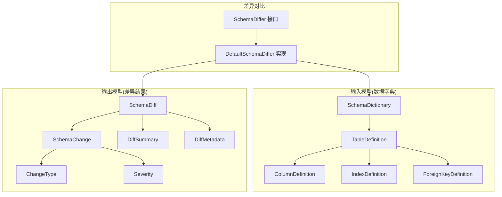
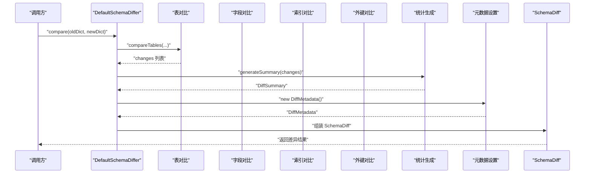
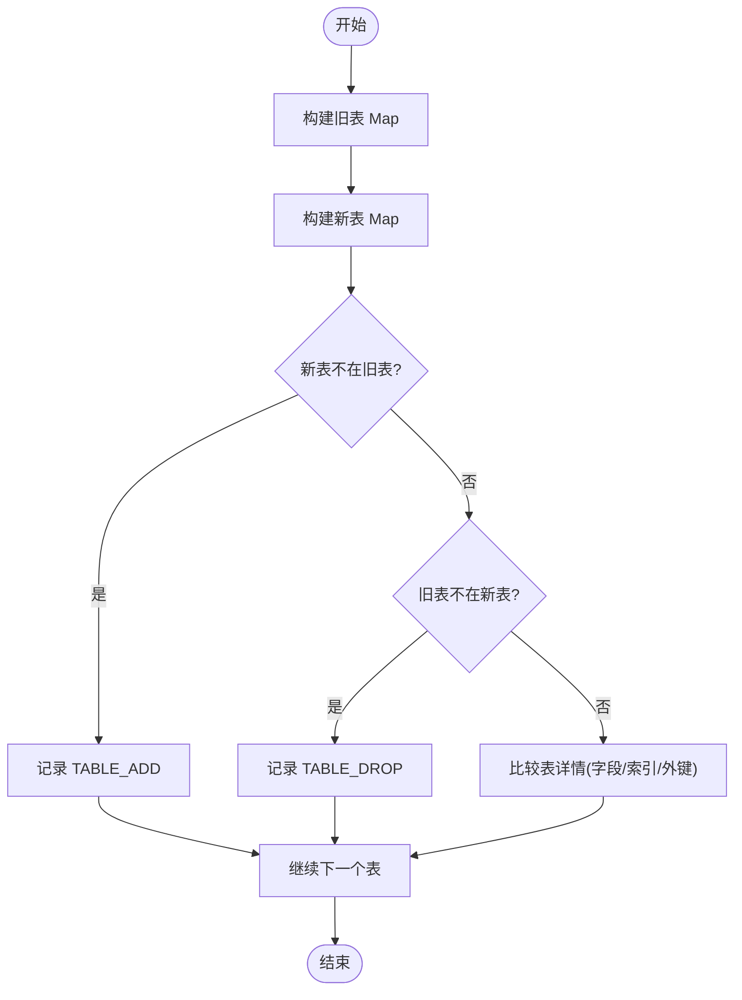
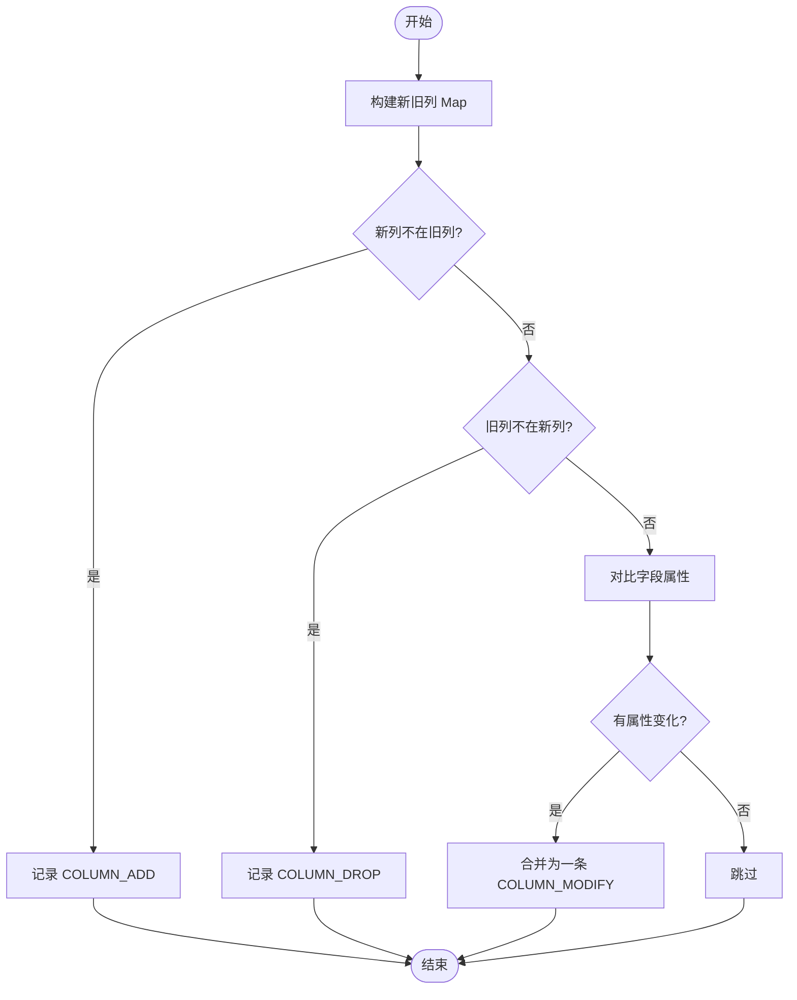
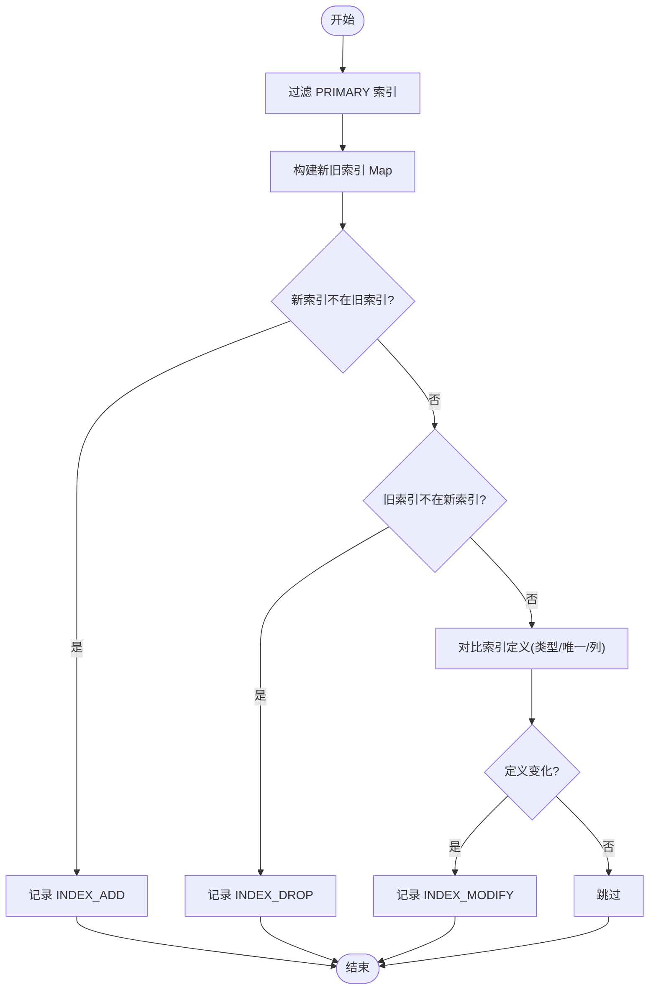
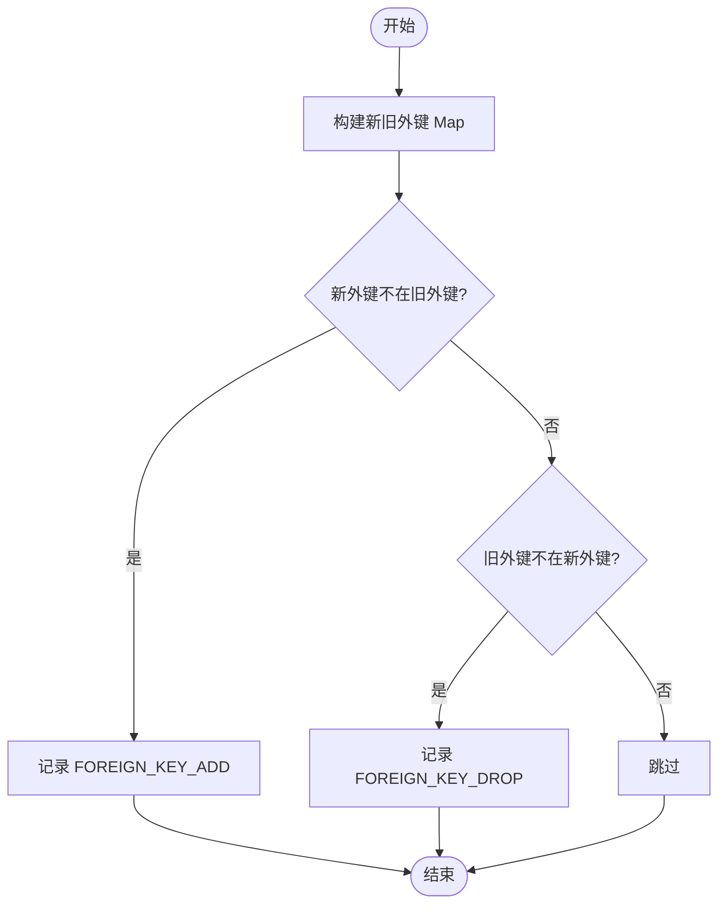
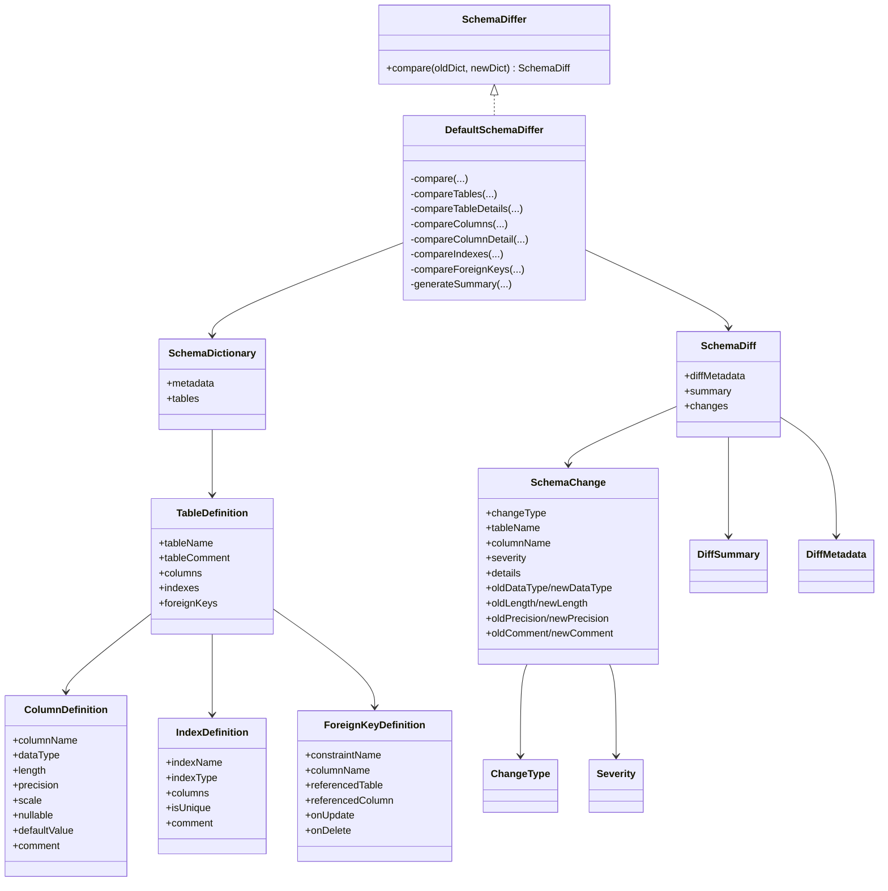

# 对比算法原理

<cite>
**本文引用的文件列表**
- [DefaultSchemaDiffer.java](file://schemasync-backend/src/main/java/com/schemasync/differ/DefaultSchemaDiffer.java)
- [SchemaDiffer.java](file://schemasync-backend/src/main/java/com/schemasync/differ/SchemaDiffer.java)
- [SchemaDiff.java](file://schemasync-backend/src/main/java/com/schemasync/model/diff/SchemaDiff.java)
- [SchemaChange.java](file://schemasync-backend/src/main/java/com/schemasync/model/diff/SchemaChange.java)
- [ChangeType.java](file://schemasync-backend/src/main/java/com/schemasync/model/diff/ChangeType.java)
- [Severity.java](file://schemasync-backend/src/main/java/com/schemasync/model/diff/Severity.java)
- [DiffSummary.java](file://schemasync-backend/src/main/java/com/schemasync/model/diff/DiffSummary.java)
- [DiffMetadata.java](file://schemasync-backend/src/main/java/com/schemasync/model/diff/DiffMetadata.java)
- [TableDefinition.java](file://schemasync-backend/src/main/java/com/schemasync/model/dict/TableDefinition.java)
- [ColumnDefinition.java](file://schemasync-backend/src/main/java/com/schemasync/model/dict/ColumnDefinition.java)
- [IndexDefinition.java](file://schemasync-backend/src/main/java/com/schemasync/model/dict/IndexDefinition.java)
- [ForeignKeyDefinition.java](file://schemasync-backend/src/main/java/com/schemasync/model/dict/ForeignKeyDefinition.java)
- [SchemaDictionary.java](file://schemasync-backend/src/main/java/com/schemasync/model/dict/SchemaDictionary.java)
- [DefaultSchemaDifferTest.java](file://schemasync-backend/src/test/java/com/schemasync/differ/DefaultSchemaDifferTest.java)
</cite>

## 目录
1. [简介](#简介)
2. [项目结构](#项目结构)
3. [核心组件](#核心组件)
4. [架构总览](#架构总览)
5. [详细组件分析](#详细组件分析)
6. [依赖关系分析](#依赖关系分析)
7. [性能与复杂度](#性能与复杂度)
8. [故障排查指南](#故障排查指南)
9. [结论](#结论)
10. [附录：扩展点与自定义规则](#附录扩展点与自定义规则)

## 简介
本技术文档聚焦于版本差异对比算法，围绕 DefaultSchemaDiffer 的核心对比逻辑展开，系统阐述表级、字段级、索引级和外键级的逐层对比策略；深入解析 Map 映射优化、流式处理实现与性能优化技巧；完整说明对比流程的四个阶段（表对比、统计生成、元数据设置、结果组装）；并通过具体代码片段路径展示 compareTables、compareColumns、compareIndexes 等关键方法的实现细节。同时提供时间复杂度分析与大数据量处理策略，并给出算法扩展点和自定义对比规则的实现指南。

## 项目结构
对比算法位于后端模块的 differ 包中，以接口 SchemaDiffer 定义契约，由 DefaultSchemaDiffer 提供默认实现。模型对象集中在 model/diff 和 model/dict 两个子包，分别描述差异结果与源端数据字典结构。测试用例位于 test 目录下，覆盖典型变更场景。

图表来源
- [SchemaDiffer.java:1-24](file://schemasync-backend/src/main/java/com/schemasync/differ/SchemaDiffer.java#L1-L24)
- [DefaultSchemaDiffer.java:1-512](file://schemasync-backend/src/main/java/com/schemasync/differ/DefaultSchemaDiffer.java#L1-L512)
- [SchemaDictionary.java:1-28](file://schemasync-backend/src/main/java/com/schemasync/model/dict/SchemaDictionary.java#L1-L28)
- [TableDefinition.java:1-89](file://schemasync-backend/src/main/java/com/schemasync/model/dict/TableDefinition.java#L1-L89)
- [ColumnDefinition.java:1-116](file://schemasync-backend/src/main/java/com/schemasync/model/dict/ColumnDefinition.java#L1-L116)
- [IndexDefinition.java:1-49](file://schemasync-backend/src/main/java/com/schemasync/model/dict/IndexDefinition.java#L1-L49)
- [ForeignKeyDefinition.java:1-54](file://schemasync-backend/src/main/java/com/schemasync/model/dict/ForeignKeyDefinition.java#L1-L54)
- [SchemaDiff.java:1-35](file://schemasync-backend/src/main/java/com/schemasync/model/diff/SchemaDiff.java#L1-L35)
- [SchemaChange.java:1-181](file://schemasync-backend/src/main/java/com/schemasync/model/diff/SchemaChange.java#L1-L181)
- [ChangeType.java:1-43](file://schemasync-backend/src/main/java/com/schemasync/model/diff/ChangeType.java#L1-L43)
- [Severity.java:1-17](file://schemasync-backend/src/main/java/com/schemasync/model/diff/Severity.java#L1-L17)
- [DiffSummary.java:1-67](file://schemasync-backend/src/main/java/com/schemasync/model/diff/DiffSummary.java#L1-L67)
- [DiffMetadata.java:1-59](file://schemasync-backend/src/main/java/com/schemasync/model/diff/DiffMetadata.java#L1-L59)

章节来源
- [SchemaDiffer.java:1-24](file://schemasync-backend/src/main/java/com/schemasync/differ/SchemaDiffer.java#L1-L24)
- [DefaultSchemaDiffer.java:1-512](file://schemasync-backend/src/main/java/com/schemasync/differ/DefaultSchemaDiffer.java#L1-L512)

## 核心组件
- 接口 SchemaDiffer：定义 compare(oldDict, newDict) 方法，作为对比器契约。
- 实现 DefaultSchemaDiffer：实现四阶段对比流程，包含表、字段、索引、外键的逐层对比与汇总。
- 输入模型 SchemaDictionary/ TableDefinition/ ColumnDefinition/ IndexDefinition/ ForeignKeyDefinition：描述数据库结构。
- 输出模型 SchemaDiff/ SchemaChange/ DiffSummary/ DiffMetadata：承载差异结果、变更项、统计与元数据。
- 枚举 ChangeType/ Severity：统一变更类型与严重程度。

章节来源
- [SchemaDiffer.java:1-24](file://schemasync-backend/src/main/java/com/schemasync/differ/SchemaDiffer.java#L1-L24)
- [DefaultSchemaDiffer.java:1-512](file://schemasync-backend/src/main/java/com/schemasync/differ/DefaultSchemaDiffer.java#L1-L512)
- [SchemaDictionary.java:1-28](file://schemasync-backend/src/main/java/com/schemasync/model/dict/SchemaDictionary.java#L1-L28)
- [TableDefinition.java:1-89](file://schemasync-backend/src/main/java/com/schemasync/model/dict/TableDefinition.java#L1-L89)
- [ColumnDefinition.java:1-116](file://schemasync-backend/src/main/java/com/schemasync/model/dict/ColumnDefinition.java#L1-L116)
- [IndexDefinition.java:1-49](file://schemasync-backend/src/main/java/com/schemasync/model/dict/IndexDefinition.java#L1-L49)
- [ForeignKeyDefinition.java:1-54](file://schemasync-backend/src/main/java/com/schemasync/model/dict/ForeignKeyDefinition.java#L1-L54)
- [SchemaDiff.java:1-35](file://schemasync-backend/src/main/java/com/schemasync/model/diff/SchemaDiff.java#L1-L35)
- [SchemaChange.java:1-181](file://schemasync-backend/src/main/java/com/schemasync/model/diff/SchemaChange.java#L1-L181)
- [ChangeType.java:1-43](file://schemasync-backend/src/main/java/com/schemasync/model/diff/ChangeType.java#L1-L43)
- [Severity.java:1-17](file://schemasync-backend/src/main/java/com/schemasync/model/diff/Severity.java#L1-L17)
- [DiffSummary.java:1-67](file://schemasync-backend/src/main/java/com/schemasync/model/diff/DiffSummary.java#L1-L67)
- [DiffMetadata.java:1-59](file://schemasync-backend/src/main/java/com/schemasync/model/diff/DiffMetadata.java#L1-L59)

## 架构总览
对比流程采用“分而治之”的分层策略：先进行表集合对比，再对同名表进行字段、索引、外键的细粒度对比，最后生成统计与元数据，组装为最终差异对象。

图表来源
- [DefaultSchemaDiffer.java:24-52](file://schemasync-backend/src/main/java/com/schemasync/differ/DefaultSchemaDiffer.java#L24-L52)

章节来源
- [DefaultSchemaDiffer.java:24-52](file://schemasync-backend/src/main/java/com/schemasync/differ/DefaultSchemaDiffer.java#L24-L52)

## 详细组件分析

### 对比流程四阶段
- 表对比：构建旧/新表名到对象的 Map，识别新增、删除、修改的表；对同名表进入详情对比。
- 统计生成：遍历变更列表，按变更类型计数，计算破坏性变更数量。
- 元数据设置：填充生成时间、工具版本等元信息。
- 结果组装：将元数据、统计、变更列表写入 SchemaDiff 并返回。

章节来源
- [DefaultSchemaDiffer.java:24-52](file://schemasync-backend/src/main/java/com/schemasync/differ/DefaultSchemaDiffer.java#L24-L52)

### 表级对比策略（compareTables）
- 使用 Stream + Collectors.toMap 将表列表转为 Map<String, TableDefinition>，键为表名，冲突时保留第一个值。
- 通过 keySet 差集快速识别新增与删除的表，构造对应 TABLE_ADD/TABLE_DROP 的 SchemaChange。
- 对交集表调用 compareTableDetails 进行字段、索引、外键的细粒度对比。

图表来源
- [DefaultSchemaDiffer.java:57-112](file://schemasync-backend/src/main/java/com/schemasync/differ/DefaultSchemaDiffer.java#L57-L112)

章节来源
- [DefaultSchemaDiffer.java:57-112](file://schemasync-backend/src/main/java/com/schemasync/differ/DefaultSchemaDiffer.java#L57-L112)

### 字段级对比策略（compareColumns / compareColumnDetail）
- 构建列名到 ColumnDefinition 的 Map，识别新增、删除、修改的字段。
- 对同名字段执行属性级对比：数据类型、长度、精度、小数位、NULL 约束、默认值、注释。
- 合并同一字段的多个属性变化为一条 COLUMN_MODIFY 记录，severity 取最高级别（BREAKING 优先）。
- 长度缩小、添加 NOT NULL、类型变更等判定为 BREAKING。

图表来源
- [DefaultSchemaDiffer.java:150-214](file://schemasync-backend/src/main/java/com/schemasync/differ/DefaultSchemaDiffer.java#L150-L214)
- [DefaultSchemaDiffer.java:219-316](file://schemasync-backend/src/main/java/com/schemasync/differ/DefaultSchemaDiffer.java#L219-L316)

章节来源
- [DefaultSchemaDiffer.java:150-214](file://schemasync-backend/src/main/java/com/schemasync/differ/DefaultSchemaDiffer.java#L150-L214)
- [DefaultSchemaDiffer.java:219-316](file://schemasync-backend/src/main/java/com/schemasync/differ/DefaultSchemaDiffer.java#L219-L316)

### 索引级对比策略（compareIndexes）
- 过滤主键索引（名称为 PRIMARY），避免与主键约束重复对比。
- 构建索引名到 IndexDefinition 的 Map，识别新增、删除、修改的索引。
- 修改对比包括索引类型、唯一性、列集合是否发生变化。

图表来源
- [DefaultSchemaDiffer.java:321-389](file://schemasync-backend/src/main/java/com/schemasync/differ/DefaultSchemaDiffer.java#L321-L389)

章节来源
- [DefaultSchemaDiffer.java:321-389](file://schemasync-backend/src/main/java/com/schemasync/differ/DefaultSchemaDiffer.java#L321-L389)

### 外键级对比策略（compareForeignKeys）
- 基于约束名称构建 Map，识别新增与删除的外键。
- 当前实现未进行外键定义的深度对比，仅记录增删。

图表来源
- [DefaultSchemaDiffer.java:394-428](file://schemasync-backend/src/main/java/com/schemasync/differ/DefaultSchemaDiffer.java#L394-L428)

章节来源
- [DefaultSchemaDiffer.java:394-428](file://schemasync-backend/src/main/java/com/schemasync/differ/DefaultSchemaDiffer.java#L394-L428)

### 统计与元数据（generateSummary / DiffMetadata）
- generateSummary 遍历 changes，按变更类型计数，并统计破坏性变更数量。
- 元数据包含生成时间与工具版本等信息。

章节来源
- [DefaultSchemaDiffer.java:433-455](file://schemasync-backend/src/main/java/com/schemasync/differ/DefaultSchemaDiffer.java#L433-L455)
- [DefaultSchemaDiffer.java:41-48](file://schemasync-backend/src/main/java/com/schemasync/differ/DefaultSchemaDiffer.java#L41-L48)

### 类图（核心模型与对比器）

图表来源
- [SchemaDiffer.java:1-24](file://schemasync-backend/src/main/java/com/schemasync/differ/SchemaDiffer.java#L1-L24)
- [DefaultSchemaDiffer.java:1-512](file://schemasync-backend/src/main/java/com/schemasync/differ/DefaultSchemaDiffer.java#L1-L512)
- [SchemaDictionary.java:1-28](file://schemasync-backend/src/main/java/com/schemasync/model/dict/SchemaDictionary.java#L1-L28)
- [TableDefinition.java:1-89](file://schemasync-backend/src/main/java/com/schemasync/model/dict/TableDefinition.java#L1-L89)
- [ColumnDefinition.java:1-116](file://schemasync-backend/src/main/java/com/schemasync/model/dict/ColumnDefinition.java#L1-L116)
- [IndexDefinition.java:1-49](file://schemasync-backend/src/main/java/com/schemasync/model/dict/IndexDefinition.java#L1-L49)
- [ForeignKeyDefinition.java:1-54](file://schemasync-backend/src/main/java/com/schemasync/model/dict/ForeignKeyDefinition.java#L1-L54)
- [SchemaDiff.java:1-35](file://schemasync-backend/src/main/java/com/schemasync/model/diff/SchemaDiff.java#L1-L35)
- [SchemaChange.java:1-181](file://schemasync-backend/src/main/java/com/schemasync/model/diff/SchemaChange.java#L1-L181)
- [ChangeType.java:1-43](file://schemasync-backend/src/main/java/com/schemasync/model/diff/ChangeType.java#L1-L43)
- [Severity.java:1-17](file://schemasync-backend/src/main/java/com/schemasync/model/diff/Severity.java#L1-L17)
- [DiffSummary.java:1-67](file://schemasync-backend/src/main/java/com/schemasync/model/diff/DiffSummary.java#L1-L67)
- [DiffMetadata.java:1-59](file://schemasync-backend/src/main/java/com/schemasync/model/diff/DiffMetadata.java#L1-L59)

## 依赖关系分析
- DefaultSchemaDiffer 强依赖 diff 与 dict 包中的模型类，用于输入与输出建模。
- 对比过程无外部 IO 或网络依赖，纯内存计算，便于单元测试与并行化改造。
- 测试用例覆盖了空输入、单变更、多变更等边界条件，验证了核心逻辑的正确性。

章节来源
- [DefaultSchemaDiffer.java:1-512](file://schemasync-backend/src/main/java/com/schemasync/differ/DefaultSchemaDiffer.java#L1-L512)
- [DefaultSchemaDifferTest.java:1-469](file://schemasync-backend/src/test/java/com/schemasync/differ/DefaultSchemaDifferTest.java#L1-L469)

## 性能与复杂度
- Map 映射优化：
  - 表、字段、索引、外键均通过 toMap 建立 O(1) 查找，避免嵌套循环导致的 O(n^2)。
  - 冲突策略使用 (a,b)->a，保证幂等性与稳定性。
- 流式处理：
  - 使用 Java Stream 进行过滤、收集与计数，代码简洁且易于并行化（必要时可改为 parallelStream）。
- 时间复杂度：
  - 表对比：O(Nt + Mt)，Nt/Mt 分别为旧/新表数。
  - 字段对比：每表 O(Co + Cn)，Co/Cn 为旧/新字段数。
  - 索引对比：每表 O(Io + In)，Io/In 为旧/新索引数。
  - 外键对比：每表 O(Fo + Fn)，Fo/Fn 为旧/新外键数。
  - 总体近似 O(Nt + Σ(Co+Cn) + Σ(Io+In) + Σ(Fo+Fn))。
- 空间复杂度：
  - 主要消耗在中间 Map 与变更列表，近似 O(Nt + ΣC + ΣI + ΣF)。
- 大数据量处理策略：
  - 增量对比：仅对比变更范围（如按 schema/table 分区）。
  - 分批处理：对超大表集合分片，降低单次内存峰值。
  - 并行化：对独立表的对比可并行执行，注意线程安全与结果聚合。
  - 惰性评估：对大对象（如 details）延迟序列化，减少内存占用。
  - 去重与早停：在统计阶段使用 distinct 与短路判断，减少无效计算。

[本节为通用性能讨论，不直接分析具体文件]

## 故障排查指南
- 空输入保护：
  - 当 oldTables/newTables/columns/indexes/foreignKeys 为 null 时，内部会替换为空列表，避免 NPE。
- 主键索引过滤：
  - 索引对比显式过滤 PRIMARY，防止与主键约束重复报告。
- 破坏性变更判定：
  - 字段长度缩小、添加 NOT NULL、类型变更等会被标记为 BREAKING，需重点关注。
- 常见断言失败场景：
  - 测试用例覆盖了无变更、新增/删除表、新增/删除/修改字段、新增索引、新增外键等场景，可作为回归基线。

章节来源
- [DefaultSchemaDiffer.java:57-112](file://schemasync-backend/src/main/java/com/schemasync/differ/DefaultSchemaDiffer.java#L57-L112)
- [DefaultSchemaDiffer.java:150-214](file://schemasync-backend/src/main/java/com/schemasync/differ/DefaultSchemaDiffer.java#L150-L214)
- [DefaultSchemaDiffer.java:321-389](file://schemasync-backend/src/main/java/com/schemasync/differ/DefaultSchemaDiffer.java#L321-L389)
- [DefaultSchemaDifferTest.java:31-469](file://schemasync-backend/src/test/java/com/schemasync/differ/DefaultSchemaDifferTest.java#L31-L469)

## 结论
DefaultSchemaDiffer 采用清晰的四层对比策略与 Map 映射优化，结合流式处理实现了高效、可扩展的版本差异对比。其四阶段流程保证了结果的可观测性与可维护性。针对大数据量场景，可通过分片、并行与惰性计算进一步优化。通过扩展点与自定义规则，可灵活适配不同数据库方言与业务需求。

[本节为总结性内容，不直接分析具体文件]

## 附录：扩展点与自定义规则
- 扩展对比维度：
  - 在 compareTableDetails 中增加新的对比项（如存储引擎、字符集、排序规则等），并相应更新统计与元数据。
- 自定义字段对比规则：
  - 在 compareColumnDetail 中插入自定义属性对比逻辑，调整 severity 判定策略。
- 自定义索引对比规则：
  - 在 compareIndexes 中扩展索引定义对比（如索引函数、表达式、可见性等），并完善 INDEX_MODIFY 的记录。
- 自定义外键对比规则：
  - 在 compareForeignKeys 中增加外键定义深度对比（引用表/列、更新/删除规则等），并考虑 FOREIGN_KEY_MODIFY。
- 插件化对比器：
  - 实现 SchemaDiffer 接口，注入自定义对比策略，通过 Spring 容器管理多实现，按配置选择。
- 可插拔统计与元数据：
  - 扩展 DiffSummary/DiffMetadata，增加更多统计指标与上下文信息（如源/目标版本标识、文件路径等）。

章节来源
- [SchemaDiffer.java:1-24](file://schemasync-backend/src/main/java/com/schemasync/differ/SchemaDiffer.java#L1-L24)
- [DefaultSchemaDiffer.java:117-145](file://schemasync-backend/src/main/java/com/schemasync/differ/DefaultSchemaDiffer.java#L117-L145)
- [DefaultSchemaDiffer.java:219-316](file://schemasync-backend/src/main/java/com/schemasync/differ/DefaultSchemaDiffer.java#L219-L316)
- [DefaultSchemaDiffer.java:321-389](file://schemasync-backend/src/main/java/com/schemasync/differ/DefaultSchemaDiffer.java#L321-L389)
- [DefaultSchemaDiffer.java:394-428](file://schemasync-backend/src/main/java/com/schemasync/differ/DefaultSchemaDiffer.java#L394-L428)
- [DiffSummary.java:1-67](file://schemasync-backend/src/main/java/com/schemasync/model/diff/DiffSummary.java#L1-L67)
- [DiffMetadata.java:1-59](file://schemasync-backend/src/main/java/com/schemasync/model/diff/DiffMetadata.java#L1-L59)