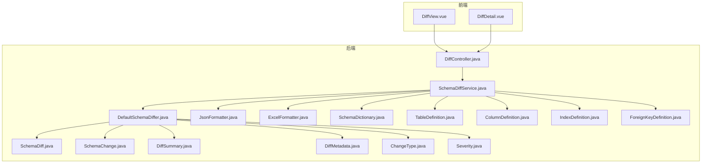
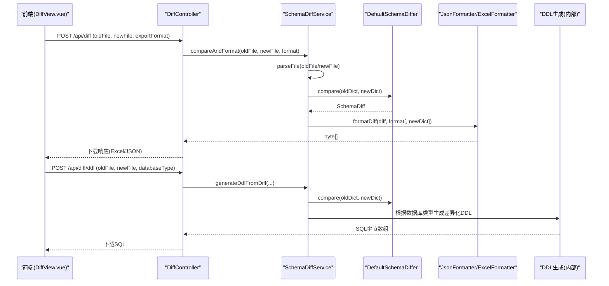
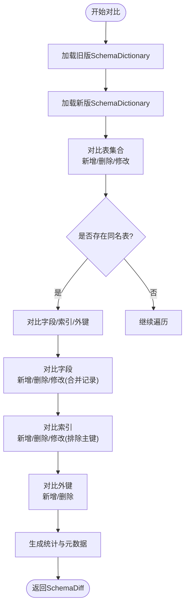
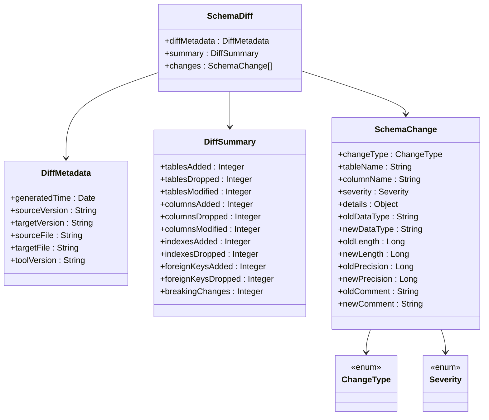
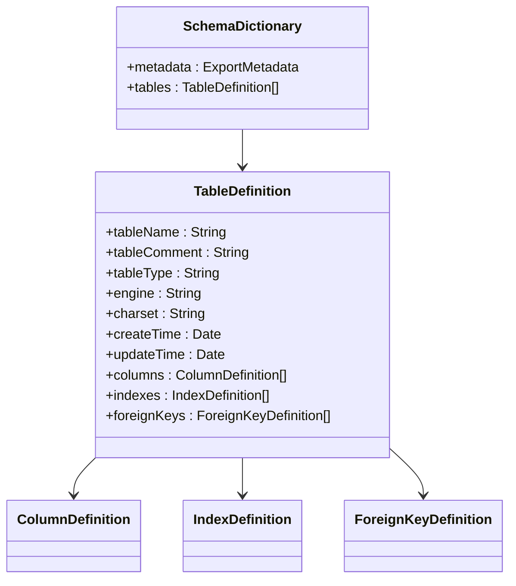
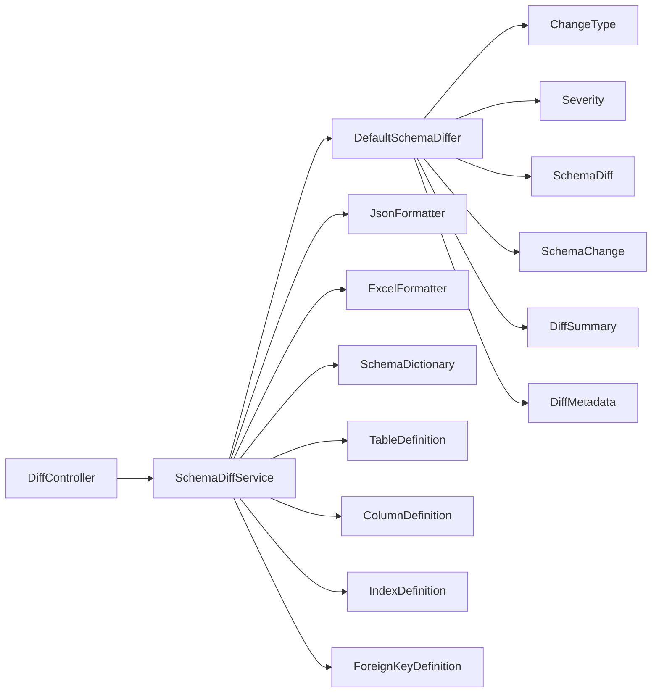

# 版本差异对比

<cite>
**本文引用的文件列表**
- [DefaultSchemaDiffer.java](file://schemasync-backend/src/main/java/com/schemasync/differ/DefaultSchemaDiffer.java)
- [SchemaDiffService.java](file://schemasync-backend/src/main/java/com/schemasync/service/SchemaDiffService.java)
- [DiffController.java](file://schemasync-backend/src/main/java/com/schemasync/controller/DiffController.java)
- [JsonFormatter.java](file://schemasync-backend/src/main/java/com/schemasync/formatter/JsonFormatter.java)
- [ExcelFormatter.java](file://schemasync-backend/src/main/java/com/schemasync/formatter/ExcelFormatter.java)
- [SchemaDictionary.java](file://schemasync-backend/src/main/java/com/schemasync/model/dict/SchemaDictionary.java)
- [TableDefinition.java](file://schemasync-backend/src/main/java/com/schemasync/model/dict/TableDefinition.java)
- [ColumnDefinition.java](file://schemasync-backend/src/main/java/com/schemasync/model/dict/ColumnDefinition.java)
- [IndexDefinition.java](file://schemasync-backend/src/main/java/com/schemasync/model/dict/IndexDefinition.java)
- [ForeignKeyDefinition.java](file://schemasync-backend/src/main/java/com/schemasync/model/dict/ForeignKeyDefinition.java)
- [SchemaChange.java](file://schemasync-backend/src/main/java/com/schemasync/model/diff/SchemaChange.java)
- [SchemaDiff.java](file://schemasync-backend/src/main/java/com/schemasync/model/diff/SchemaDiff.java)
- [DiffSummary.java](file://schemasync-backend/src/main/java/com/schemasync/model/diff/DiffSummary.java)
- [DiffMetadata.java](file://schemasync-backend/src/main/java/com/schemasync/model/diff/DiffMetadata.java)
- [ChangeType.java](file://schemasync-backend/src/main/java/com/schemasync/model/diff/ChangeType.java)
- [Severity.java](file://schemasync-backend/src/main/java/com/schemasync/model/diff/Severity.java)
- [DiffView.vue](file://schemasync-frontend/src/views/DiffView.vue)
- [DiffDetail.vue](file://schemasync-frontend/src/components/DiffDetail.vue)
</cite>

## 目录
1. [简介](#简介)
2. [项目结构](#项目结构)
3. [核心组件](#核心组件)
4. [架构总览](#架构总览)
5. [详细组件分析](#详细组件分析)
6. [依赖关系分析](#依赖关系分析)
7. [性能与可扩展性](#性能与可扩展性)
8. [故障排查指南](#故障排查指南)
9. [结论](#结论)
10. [附录：API与前端操作说明](#附录api与前端操作说明)

## 简介
本章节面向“版本差异对比”功能，系统性阐述智能变更识别算法、破坏性变更标注机制、详细差异报告生成流程，以及前后端交互方式。文档覆盖数据结构定义（SchemaDiff、ChangeType、Severity）、对比流程、文件上传处理、差异计算逻辑、结果展示、变更类型检测规则与影响评估、风险评估方法与迁移决策建议，并提供API调用示例和前端界面操作说明。

## 项目结构
后端采用分层设计：控制器层接收请求，服务层编排解析、对比、格式化与DDL生成，差异器实现核心对比算法；模型层提供数据字典与差异对象；格式化器负责JSON/Excel输出；前端通过Vue页面完成文件选择、发起对比、下载报告与生成DDL脚本。

图表来源
- [DiffController.java:1-108](file://schemasync-backend/src/main/java/com/schemasync/controller/DiffController.java#L1-L108)
- [SchemaDiffService.java:1-220](file://schemasync-backend/src/main/java/com/schemasync/service/SchemaDiffService.java#L1-L220)
- [DefaultSchemaDiffer.java:1-120](file://schemasync-backend/src/main/java/com/schemasync/differ/DefaultSchemaDiffer.java#L1-L120)
- [JsonFormatter.java:1-119](file://schemasync-backend/src/main/java/com/schemasync/formatter/JsonFormatter.java#L1-L119)
- [ExcelFormatter.java](file://schemasync-backend/src/main/java/com/schemasync/formatter/ExcelFormatter.java)
- [SchemaDictionary.java:1-28](file://schemasync-backend/src/main/java/com/schemasync/model/dict/SchemaDictionary.java#L1-L28)
- [TableDefinition.java:1-89](file://schemasync-backend/src/main/java/com/schemasync/model/dict/TableDefinition.java#L1-L89)
- [ColumnDefinition.java](file://schemasync-backend/src/main/java/com/schemasync/model/dict/ColumnDefinition.java)
- [IndexDefinition.java](file://schemasync-backend/src/main/java/com/schemasync/model/dict/IndexDefinition.java)
- [ForeignKeyDefinition.java](file://schemasync-backend/src/main/java/com/schemasync/model/dict/ForeignKeyDefinition.java)
- [SchemaDiff.java:1-35](file://schemasync-backend/src/main/java/com/schemasync/model/diff/SchemaDiff.java#L1-L35)
- [SchemaChange.java:1-181](file://schemasync-backend/src/main/java/com/schemasync/model/diff/SchemaChange.java#L1-L181)
- [DiffSummary.java:1-67](file://schemasync-backend/src/main/java/com/schemasync/model/diff/DiffSummary.java#L1-L67)
- [DiffMetadata.java:1-59](file://schemasync-backend/src/main/java/com/schemasync/model/diff/DiffMetadata.java#L1-L59)
- [ChangeType.java:1-43](file://schemasync-backend/src/main/java/com/schemasync/model/diff/ChangeType.java#L1-L43)
- [Severity.java:1-17](file://schemasync-backend/src/main/java/com/schemasync/model/diff/Severity.java#L1-L17)

章节来源
- [DiffController.java:1-108](file://schemasync-backend/src/main/java/com/schemasync/controller/DiffController.java#L1-L108)
- [SchemaDiffService.java:1-220](file://schemasync-backend/src/main/java/com/schemasync/service/SchemaDiffService.java#L1-L220)
- [DefaultSchemaDiffer.java:1-120](file://schemasync-backend/src/main/java/com/schemasync/differ/DefaultSchemaDiffer.java#L1-L120)

## 核心组件
- 差异模型
  - SchemaDiff：包含元数据、统计摘要与变更列表。
  - DiffSummary：汇总新增/删除/修改的表、字段、索引、外键数量及破坏性变更计数。
  - DiffMetadata：记录生成时间、工具版本、源/目标版本标识与文件路径等。
  - SchemaChange：单条变更记录，含变更类型、表名、字段名、严重级别、详情与旧/新属性值。
- 枚举与分类
  - ChangeType：表增删改、字段增删改、索引增删改、外键增删改。
  - Severity：BREAKING（破坏性）、NON_BREAKING（非破坏性）。
- 对比引擎
  - DefaultSchemaDiffer：基于两版SchemaDictionary进行逐层对比，产出SchemaDiff。
- 服务编排
  - SchemaDiffService：文件解析、对比、格式化（JSON/Excel）与差异化DDL生成。
- 控制器
  - DiffController：对外暴露对比、导出差异报告、生成DDL接口。
- 前端
  - DiffView.vue：上传文件、触发对比、下载差异报告、生成DDL。
  - DiffDetail.vue：按表分组展示差异明细。

章节来源
- [SchemaDiff.java:1-35](file://schemasync-backend/src/main/java/com/schemasync/model/diff/SchemaDiff.java#L1-L35)
- [DiffSummary.java:1-67](file://schemasync-backend/src/main/java/com/schemasync/model/diff/DiffSummary.java#L1-L67)
- [DiffMetadata.java:1-59](file://schemasync-backend/src/main/java/com/schemasync/model/diff/DiffMetadata.java#L1-L59)
- [SchemaChange.java:1-181](file://schemasync-backend/src/main/java/com/schemasync/model/diff/SchemaChange.java#L1-L181)
- [ChangeType.java:1-43](file://schemasync-backend/src/main/java/com/schemasync/model/diff/ChangeType.java#L1-L43)
- [Severity.java:1-17](file://schemasync-backend/src/main/java/com/schemasync/model/diff/Severity.java#L1-L17)
- [DefaultSchemaDiffer.java:1-120](file://schemasync-backend/src/main/java/com/schemasync/differ/DefaultSchemaDiffer.java#L1-L120)
- [SchemaDiffService.java:1-220](file://schemasync-backend/src/main/java/com/schemasync/service/SchemaDiffService.java#L1-L220)
- [DiffController.java:1-108](file://schemasync-backend/src/main/java/com/schemasync/controller/DiffController.java#L1-L108)
- [DiffView.vue:1-313](file://schemasync-frontend/src/views/DiffView.vue#L1-L313)
- [DiffDetail.vue:1-125](file://schemasync-frontend/src/components/DiffDetail.vue#L1-L125)

## 架构总览
整体流程：前端上传两个版本的字典文件（支持Excel/JSON），后端解析为SchemaDictionary，交由差异器执行对比，生成SchemaDiff；服务层可将其序列化为JSON或Excel，并基于变更集生成差异化DDL脚本。

图表来源
- [DiffController.java:31-106](file://schemasync-backend/src/main/java/com/schemasync/controller/DiffController.java#L31-L106)
- [SchemaDiffService.java:114-220](file://schemasync-backend/src/main/java/com/schemasync/service/SchemaDiffService.java#L114-L220)
- [DefaultSchemaDiffer.java:24-52](file://schemasync-backend/src/main/java/com/schemasync/differ/DefaultSchemaDiffer.java#L24-L52)
- [JsonFormatter.java:98-117](file://schemasync-backend/src/main/java/com/schemasync/formatter/JsonFormatter.java#L98-L117)
- [ExcelFormatter.java](file://schemasync-backend/src/main/java/com/schemasync/formatter/ExcelFormatter.java)

## 详细组件分析

### 智能变更识别算法（DefaultSchemaDiffer）
- 表级对比
  - 新增表：标记为非破坏性，附带表注释、列数、索引数等细节。
  - 删除表：标记为破坏性，附带表注释。
  - 修改表：进入表内细节对比（字段、索引、外键）。
- 字段级对比
  - 新增字段：非破坏性，携带新数据类型、长度、精度、注释等。
  - 删除字段：破坏性，携带旧定义信息。
  - 修改字段：合并为一条记录，比较数据类型、长度、精度、小数位、NULL约束、默认值、注释；任一变化即产生变更项，严重级别取最高（如类型改变、长度缩小、增加NOT NULL等均为破坏性）。
- 索引级对比
  - 过滤主键索引，仅对比普通索引。
  - 新增/删除/修改索引均记录，修改时对比索引类型、唯一性、列集合。
- 外键级对比
  - 新增/删除外键记录，便于后续约束校验与迁移规划。
- 统计与元数据
  - 自动生成DiffSummary与DiffMetadata，包含各类变更计数与破坏性变更总数。

图表来源
- [DefaultSchemaDiffer.java:24-112](file://schemasync-backend/src/main/java/com/schemasync/differ/DefaultSchemaDiffer.java#L24-L112)
- [DefaultSchemaDiffer.java:117-145](file://schemasync-backend/src/main/java/com/schemasync/differ/DefaultSchemaDiffer.java#L117-L145)
- [DefaultSchemaDiffer.java:150-214](file://schemasync-backend/src/main/java/com/schemasync/differ/DefaultSchemaDiffer.java#L150-L214)
- [DefaultSchemaDiffer.java:219-316](file://schemasync-backend/src/main/java/com/schemasync/differ/DefaultSchemaDiffer.java#L219-L316)
- [DefaultSchemaDiffer.java:321-389](file://schemasync-backend/src/main/java/com/schemasync/differ/DefaultSchemaDiffer.java#L321-L389)
- [DefaultSchemaDiffer.java:394-428](file://schemasync-backend/src/main/java/com/schemasync/differ/DefaultSchemaDiffer.java#L394-L428)
- [DefaultSchemaDiffer.java:433-455](file://schemasync-backend/src/main/java/com/schemasync/differ/DefaultSchemaDiffer.java#L433-L455)

章节来源
- [DefaultSchemaDiffer.java:24-512](file://schemasync-backend/src/main/java/com/schemasync/differ/DefaultSchemaDiffer.java#L24-L512)

### 破坏性变更标注机制（Severity）
- BREAKING（破坏性）
  - 删除表、删除字段、字段类型变更、长度缩小、精度/小数位变更、新增NOT NULL约束等。
- NON_BREAKING（非破坏性）
  - 新增表/字段/索引/外键、注释变更、默认值变更等。
- 合并字段变更时的严重级别取各属性变更中的最高级别，确保风险不低估。

章节来源
- [Severity.java:1-17](file://schemasync-backend/src/main/java/com/schemasync/model/diff/Severity.java#L1-L17)
- [DefaultSchemaDiffer.java:219-316](file://schemasync-backend/src/main/java/com/schemasync/differ/DefaultSchemaDiffer.java#L219-L316)

### 详细差异报告生成（JSON/Excel）
- JSON格式
  - 使用JsonFormatter将SchemaDiff序列化为JSON字符串/字节数组，便于前端直接渲染或二次处理。
- Excel格式
  - 使用ExcelFormatter将差异列表导出为表格，便于审计与归档。
- 文件名与响应头
  - 控制器设置Content-Disposition与Content-Type，浏览器自动下载。

章节来源
- [JsonFormatter.java:98-117](file://schemasync-backend/src/main/java/com/schemasync/formatter/JsonFormatter.java#L98-L117)
- [ExcelFormatter.java](file://schemasync-backend/src/main/java/com/schemasync/formatter/ExcelFormatter.java)
- [DiffController.java:31-62](file://schemasync-backend/src/main/java/com/schemasync/controller/DiffController.java#L31-L62)

### 差异化DDL生成
- 支持MySQL与GaussDB（MySQL兼容模式、Oracle兼容模式）。
- 针对变更类型生成最小化DDL：
  - 新增表：CREATE TABLE/VIEW。
  - 删除表：注释DROP语句，需人工确认。
  - 新增字段：ALTER TABLE ADD COLUMN。
  - 删除字段：注释DROP COLUMN，需人工确认。
  - 修改字段：ALTER TABLE MODIFY COLUMN。
  - 索引：新增/删除/修改（先删后建）。
- 类型转换
  - GaussDB Oracle风格下，对MySQL类型进行映射（如VARCHAR→VARCHAR2、TEXT→CLOB、数值→NUMBER等）。

章节来源
- [SchemaDiffService.java:203-278](file://schemasync-backend/src/main/java/com/schemasync/service/SchemaDiffService.java#L203-L278)
- [SchemaDiffService.java:288-452](file://schemasync-backend/src/main/java/com/schemasync/service/SchemaDiffService.java#L288-L452)
- [SchemaDiffService.java:457-546](file://schemasync-backend/src/main/java/com/schemasync/service/SchemaDiffService.java#L457-L546)
- [SchemaDiffService.java:551-684](file://schemasync-backend/src/main/java/com/schemasync/service/SchemaDiffService.java#L551-L684)

### 数据结构详解

#### SchemaDiff 类图

图表来源
- [SchemaDiff.java:1-35](file://schemasync-backend/src/main/java/com/schemasync/model/diff/SchemaDiff.java#L1-L35)
- [DiffMetadata.java:1-59](file://schemasync-backend/src/main/java/com/schemasync/model/diff/DiffMetadata.java#L1-L59)
- [DiffSummary.java:1-67](file://schemasync-backend/src/main/java/com/schemasync/model/diff/DiffSummary.java#L1-L67)
- [SchemaChange.java:1-181](file://schemasync-backend/src/main/java/com/schemasync/model/diff/SchemaChange.java#L1-L181)
- [ChangeType.java:1-43](file://schemasync-backend/src/main/java/com/schemasync/model/diff/ChangeType.java#L1-L43)
- [Severity.java:1-17](file://schemasync-backend/src/main/java/com/schemasync/model/diff/Severity.java#L1-L17)

#### 数据字典模型（输入）

图表来源
- [SchemaDictionary.java:1-28](file://schemasync-backend/src/main/java/com/schemasync/model/dict/SchemaDictionary.java#L1-L28)
- [TableDefinition.java:1-89](file://schemasync-backend/src/main/java/com/schemasync/model/dict/TableDefinition.java#L1-L89)
- [ColumnDefinition.java](file://schemasync-backend/src/main/java/com/schemasync/model/dict/ColumnDefinition.java)
- [IndexDefinition.java](file://schemasync-backend/src/main/java/com/schemasync/model/dict/IndexDefinition.java)
- [ForeignKeyDefinition.java](file://schemasync-backend/src/main/java/com/schemasync/model/dict/ForeignKeyDefinition.java)

### 变更类型检测规则与影响评估
- 表级
  - TABLE_ADD：非破坏性，通常不影响现有应用。
  - TABLE_DROP：破坏性，可能导致数据丢失与应用异常。
  - TABLE_MODIFY：进入字段/索引/外键细粒度评估。
- 字段级
  - COLUMN_ADD：非破坏性。
  - COLUMN_DROP：破坏性，引用该字段的查询/业务可能失败。
  - COLUMN_MODIFY：
    - 数据类型变更：破坏性。
    - 长度缩小：破坏性（存在截断风险）。
    - 精度/小数位变更：破坏性。
    - 新增NOT NULL：破坏性（已有空值会失败）。
    - 默认值/注释变更：非破坏性。
- 索引级
  - INDEX_ADD：非破坏性。
  - INDEX_DROP：非破坏性（但可能影响查询性能）。
  - INDEX_MODIFY：非破坏性（重建索引，注意锁与耗时）。
- 外键级
  - FOREIGN_KEY_ADD/DROP：非破坏性（但需注意数据一致性约束）。

章节来源
- [DefaultSchemaDiffer.java:69-112](file://schemasync-backend/src/main/java/com/schemasync/differ/DefaultSchemaDiffer.java#L69-L112)
- [DefaultSchemaDiffer.java:163-214](file://schemasync-backend/src/main/java/com/schemasync/differ/DefaultSchemaDiffer.java#L163-L214)
- [DefaultSchemaDiffer.java:219-316](file://schemasync-backend/src/main/java/com/schemasync/differ/DefaultSchemaDiffer.java#L219-L316)
- [DefaultSchemaDiffer.java:321-389](file://schemasync-backend/src/main/java/com/schemasync/differ/DefaultSchemaDiffer.java#L321-L389)
- [DefaultSchemaDiffer.java:394-428](file://schemasync-backend/src/main/java/com/schemasync/differ/DefaultSchemaDiffer.java#L394-L428)

### 对比流程说明（端到端）
- 文件上传处理
  - 前端选择旧/新版本Excel或JSON文件，封装FormData提交。
  - 后端解析文件：Excel走Excel解析器，JSON走JSON反序列化。
- 差异计算逻辑
  - 调用差异器进行表/字段/索引/外键对比，生成变更列表与统计。
- 结果展示
  - 前端获取统计摘要，展示破坏性变更数量，提示下载完整报告。
- 导出与DDL
  - 支持下载Excel差异报告与生成差异化DDL脚本。

章节来源
- [DiffView.vue:132-257](file://schemasync-frontend/src/views/DiffView.vue#L132-L257)
- [DiffController.java:31-106](file://schemasync-backend/src/main/java/com/schemasync/controller/DiffController.java#L31-L106)
- [SchemaDiffService.java:77-145](file://schemasync-backend/src/main/java/com/schemasync/service/SchemaDiffService.java#L77-L145)

## 依赖关系分析
- 控制器依赖服务，服务依赖差异器与格式化器，差异器依赖模型与枚举。
- 前端通过REST接口与后端交互，无需了解内部实现。

图表来源
- [DiffController.java:1-108](file://schemasync-backend/src/main/java/com/schemasync/controller/DiffController.java#L1-L108)
- [SchemaDiffService.java:1-220](file://schemasync-backend/src/main/java/com/schemasync/service/SchemaDiffService.java#L1-L220)
- [DefaultSchemaDiffer.java:1-120](file://schemasync-backend/src/main/java/com/schemasync/differ/DefaultSchemaDiffer.java#L1-L120)
- [JsonFormatter.java:1-119](file://schemasync-backend/src/main/java/com/schemasync/formatter/JsonFormatter.java#L1-L119)
- [ExcelFormatter.java](file://schemasync-backend/src/main/java/com/schemasync/formatter/ExcelFormatter.java)
- [SchemaDictionary.java:1-28](file://schemasync-backend/src/main/java/com/schemasync/model/dict/SchemaDictionary.java#L1-L28)
- [TableDefinition.java:1-89](file://schemasync-backend/src/main/java/com/schemasync/model/dict/TableDefinition.java#L1-L89)
- [ColumnDefinition.java](file://schemasync-backend/src/main/java/com/schemasync/model/dict/ColumnDefinition.java)
- [IndexDefinition.java](file://schemasync-backend/src/main/java/com/schemasync/model/dict/IndexDefinition.java)
- [ForeignKeyDefinition.java](file://schemasync-backend/src/main/java/com/schemasync/model/dict/ForeignKeyDefinition.java)

## 性能与可扩展性
- 复杂度
  - 表/字段/索引/外键对比主要基于Map查找，时间复杂度近似O(n)，n为元素数量。
- 优化点
  - 大字典场景可考虑并行对比不同表集合。
  - 索引重建DDL在大数据量下需评估锁与耗时，建议在低峰期执行。
- 扩展性
  - 可通过新增ChangeType与对应DDL生成策略扩展更多变更类型。
  - 支持更多数据库类型仅需在DDL生成分支中添加相应策略。

[本节为通用指导，不涉及具体文件分析]

## 故障排查指南
- 常见错误
  - 未上传文件或上传为空：抛出运行时异常，前端提示“请选择两个文件”。
  - 文件格式不支持：解析阶段抛出异常，检查是否为Excel或JSON。
  - 对比失败：捕获异常并包装为运行时异常，查看日志定位问题。
- 定位方法
  - 查看后端日志中“读取文件失败/对比失败”的错误堆栈。
  - 检查前端网络请求状态码与响应体内容。
  - 对于DDL生成失败，核对数据库类型参数与变更类型是否匹配。

章节来源
- [DiffController.java:38-41](file://schemasync-backend/src/main/java/com/schemasync/controller/DiffController.java#L38-L41)
- [SchemaDiffService.java:97-103](file://schemasync-backend/src/main/java/com/schemasync/service/SchemaDiffService.java#L97-L103)
- [SchemaDiffService.java:138-144](file://schemasync-backend/src/main/java/com/schemasync/service/SchemaDiffService.java#L138-L144)

## 结论
本方案通过清晰的模型定义与分层架构，实现了稳定可靠的版本差异对比能力。智能变更识别算法覆盖表、字段、索引、外键全维度，结合破坏性变更标注与差异化DDL生成，有效支撑迁移决策与风险控制。前端提供直观的操作体验，满足日常运维与发布流程需求。

[本节为总结，不涉及具体文件分析]

## 附录：API与前端操作说明

### API定义
- 对比并导出差异报告
  - 方法：POST
  - 路径：/api/diff
  - 参数：
    - oldFile：MultipartFile（旧版本）
    - newFile：MultipartFile（新版本）
    - exportFormat：String（默认excel，可选json）
  - 响应：二进制文件（Excel或JSON），带Content-Disposition文件名
- 获取差异统计
  - 方法：POST
  - 路径：/api/diff/summary
  - 参数：oldFile、newFile
  - 响应：SchemaDiff对象（JSON）
- 生成差异化DDL
  - 方法：POST
  - 路径：/api/diff/ddl
  - 参数：
    - oldFile、newFile
    - databaseType：mysql/gaussdb_mysql/gaussdb_oracle（默认mysql）
  - 响应：SQL脚本二进制文件

章节来源
- [DiffController.java:31-106](file://schemasync-backend/src/main/java/com/schemasync/controller/DiffController.java#L31-L106)

### 前端界面操作说明
- 打开“版本对比”页面，分别选择旧版本与新版本Excel文件。
- 点击“开始对比”，页面显示差异统计与破坏性变更数量。
- 点击“下载差异报告”导出Excel明细。
- 选择数据库类型后点击“生成DDL脚本”，下载SQL文件用于迁移。

章节来源
- [DiffView.vue:1-313](file://schemasync-frontend/src/views/DiffView.vue#L1-L313)
- [DiffDetail.vue:1-125](file://schemasync-frontend/src/components/DiffDetail.vue#L1-L125)