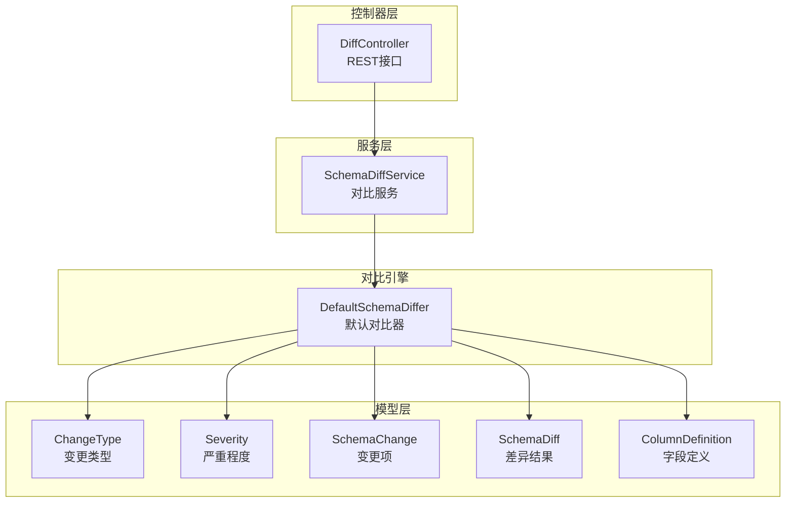
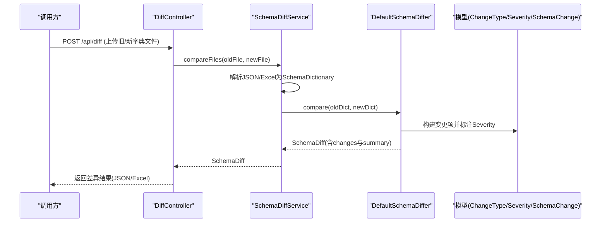
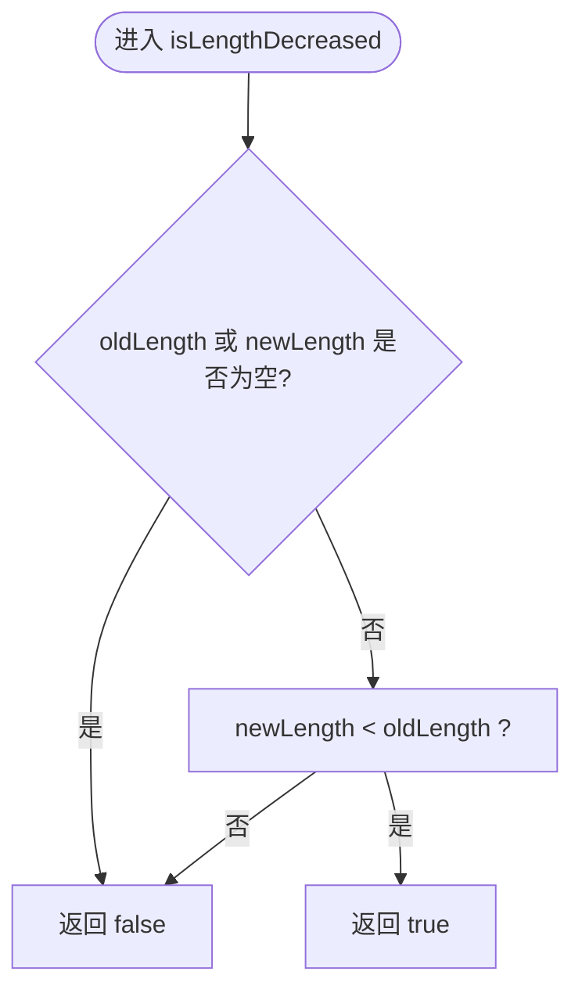
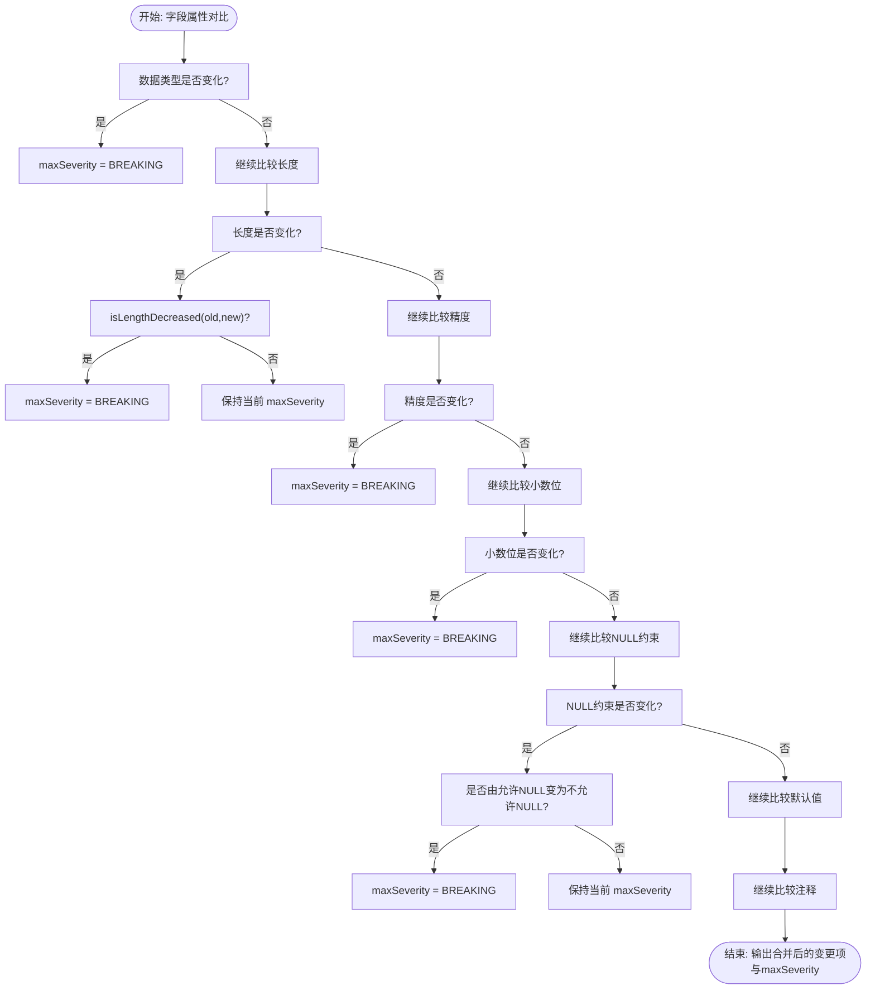
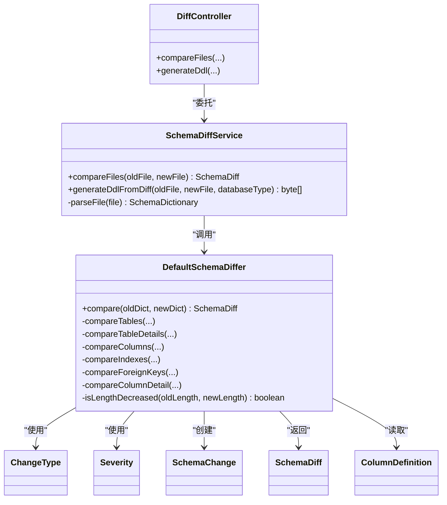

# 风险评估方法

<cite>
**本文引用的文件**   
- [Severity.java](file://schemasync-backend/src/main/java/com/schemasync/model/diff/Severity.java)
- [ChangeType.java](file://schemasync-backend/src/main/java/com/schemasync/model/diff/ChangeType.java)
- [SchemaChange.java](file://schemasync-backend/src/main/java/com/schemasync/model/diff/SchemaChange.java)
- [SchemaDiff.java](file://schemasync-backend/src/main/java/com/schemasync/model/diff/SchemaDiff.java)
- [ColumnDefinition.java](file://schemasync-backend/src/main/java/com/schemasync/model/dict/ColumnDefinition.java)
- [DefaultSchemaDiffer.java](file://schemasync-backend/src/main/java/com/schemasync/differ/DefaultSchemaDiffer.java)
- [SchemaDiffService.java](file://schemasync-backend/src/main/java/com/schemasync/service/SchemaDiffService.java)
- [DiffController.java](file://schemasync-backend/src/main/java/com/schemasync/controller/DiffController.java)
</cite>

## 目录
1. [引言](#引言)
2. [项目结构](#项目结构)
3. [核心组件](#核心组件)
4. [架构总览](#架构总览)
5. [详细组件分析](#详细组件分析)
6. [依赖关系分析](#依赖关系分析)
7. [性能考量](#性能考量)
8. [故障排查指南](#故障排查指南)
9. [结论](#结论)
10. [附录](#附录)

## 引言
本文件面向“破坏性变更风险评估系统”，聚焦于以下目标：
- 解释 Severity 枚举的严重级别分类（BREAKING、NON_BREAKING）
- 梳理各类变更场景的风险评估规则，如数据类型变更、长度缩小、NOT NULL约束添加等如何判定为破坏性变更
- 深入解析 isLengthDecreased 等风险评估算法的实现逻辑
- 提供风险评估决策树与判断流程图
- 给出风险评估结果的解读指南与迁移影响分析
- 说明如何自定义风险评估规则与扩展新的风险等级
- 提供风险评估 API 的使用示例与集成方案

## 项目结构
围绕风险评估的核心代码位于后端模块中，关键路径如下：
- 模型层：定义变更类型、严重程度、变更项与差异对象
- 对比引擎：实现字段、索引、外键等维度的对比与风险评估
- 服务层：封装文件解析、对比流程、DDL生成与导出
- 控制器层：暴露 REST API 供前端或外部系统集成

图表来源
- [DefaultSchemaDiffer.java:1-512](file://schemasync-backend/src/main/java/com/schemasync/differ/DefaultSchemaDiffer.java#L1-L512)
- [SchemaDiffService.java:1-800](file://schemasync-backend/src/main/java/com/schemasync/service/SchemaDiffService.java#L1-L800)
- [DiffController.java:1-96](file://schemasync-backend/src/main/java/com/schemasync/controller/DiffController.java#L1-L96)
- [ChangeType.java:1-43](file://schemasync-backend/src/main/java/com/schemasync/model/diff/ChangeType.java#L1-L43)
- [Severity.java:1-17](file://schemasync-backend/src/main/java/com/schemasync/model/diff/Severity.java#L1-L17)
- [SchemaChange.java:1-181](file://schemasync-backend/src/main/java/com/schemasync/model/diff/SchemaChange.java#L1-L181)
- [SchemaDiff.java:1-35](file://schemasync-backend/src/main/java/com/schemasync/model/diff/SchemaDiff.java#L1-L35)
- [ColumnDefinition.java:1-116](file://schemasync-backend/src/main/java/com/schemasync/model/dict/ColumnDefinition.java#L1-L116)

章节来源
- [DefaultSchemaDiffer.java:1-512](file://schemasync-backend/src/main/java/com/schemasync/differ/DefaultSchemaDiffer.java#L1-L512)
- [SchemaDiffService.java:1-800](file://schemasync-backend/src/main/java/com/schemasync/service/SchemaDiffService.java#L1-L800)
- [DiffController.java:1-96](file://schemasync-backend/src/main/java/com/schemasync/controller/DiffController.java#L1-L96)

## 核心组件
- ChangeType：描述变更维度（表、字段、索引、外键）
- Severity：描述变更风险等级（破坏性、非破坏性）
- SchemaChange：承载一次具体变更及其上下文信息
- SchemaDiff：聚合元数据、统计信息与变更列表
- ColumnDefinition：字段级属性（数据类型、长度、精度、小数位、NULL约束、默认值、注释等）
- DefaultSchemaDiffer：执行对比并计算风险等级
- SchemaDiffService：编排文件解析、对比、格式化与DDL生成
- DiffController：对外暴露对比与DDL生成的REST接口

章节来源
- [ChangeType.java:1-43](file://schemasync-backend/src/main/java/com/schemasync/model/diff/ChangeType.java#L1-L43)
- [Severity.java:1-17](file://schemasync-backend/src/main/java/com/schemasync/model/diff/Severity.java#L1-L17)
- [SchemaChange.java:1-181](file://schemasync-backend/src/main/java/com/schemasync/model/diff/SchemaChange.java#L1-L181)
- [SchemaDiff.java:1-35](file://schemasync-backend/src/main/java/com/schemasync/model/diff/SchemaDiff.java#L1-L35)
- [ColumnDefinition.java:1-116](file://schemasync-backend/src/main/java/com/schemasync/model/dict/ColumnDefinition.java#L1-L116)
- [DefaultSchemaDiffer.java:1-512](file://schemasync-backend/src/main/java/com/schemasync/differ/DefaultSchemaDiffer.java#L1-L512)
- [SchemaDiffService.java:1-800](file://schemasync-backend/src/main/java/com/schemasync/service/SchemaDiffService.java#L1-L800)
- [DiffController.java:1-96](file://schemasync-backend/src/main/java/com/schemasync/controller/DiffController.java#L1-L96)

## 架构总览
从请求到风险评估输出的端到端流程如下：

图表来源
- [DiffController.java:1-96](file://schemasync-backend/src/main/java/com/schemasync/controller/DiffController.java#L1-L96)
- [SchemaDiffService.java:1-800](file://schemasync-backend/src/main/java/com/schemasync/service/SchemaDiffService.java#L1-L800)
- [DefaultSchemaDiffer.java:1-512](file://schemasync-backend/src/main/java/com/schemasync/differ/DefaultSchemaDiffer.java#L1-L512)
- [ChangeType.java:1-43](file://schemasync-backend/src/main/java/com/schemasync/model/diff/ChangeType.java#L1-L43)
- [Severity.java:1-17](file://schemasync-backend/src/main/java/com/schemasync/model/diff/Severity.java#L1-L17)
- [SchemaChange.java:1-181](file://schemasync-backend/src/main/java/com/schemasync/model/diff/SchemaChange.java#L1-L181)

## 详细组件分析

### 严重级别与变更类型
- Severity
  - BREAKING：可能导致数据丢失或应用故障的变更
  - NON_BREAKING：不会导致上述风险的变更
- ChangeType
  - 表级：新增、删除、修改
  - 字段级：新增、删除、修改
  - 索引级：新增、删除、修改
  - 外键级：新增、删除、修改

章节来源
- [Severity.java:1-17](file://schemasync-backend/src/main/java/com/schemasync/model/diff/Severity.java#L1-L17)
- [ChangeType.java:1-43](file://schemasync-backend/src/main/java/com/schemasync/model/diff/ChangeType.java#L1-L43)

### 字段变更风险评估规则
在字段对比过程中，系统逐项比较以下属性，并根据规则确定最大风险等级：
- 数据类型变更：标记为 BREAKING
- 长度变更：若新长度小于旧长度，则标记为 BREAKING；否则为 NON_BREAKING
- 精度变更：标记为 BREAKING
- 小数位变更：标记为 BREAKING
- NULL约束变更：若由允许NULL变为不允许NULL（即添加 NOT NULL），标记为 BREAKING；反之则为 NON_BREAKING
- 默认值变更：标记为 NON_BREAKING
- 注释变更：标记为 NON_BREAKING

最终对同一字段的多个属性变更合并为一条记录，severity取所有子变更中的最高级别。

章节来源
- [DefaultSchemaDiffer.java:219-316](file://schemasync-backend/src/main/java/com/schemasync/differ/DefaultSchemaDiffer.java#L219-L316)
- [SchemaChange.java:1-181](file://schemasync-backend/src/main/java/com/schemasync/model/diff/SchemaChange.java#L1-L181)

### 长度缩小判定算法 isLengthDecreased
- 输入：旧长度 oldLength、新长度 newLength（Long）
- 逻辑：
  - 若任一为空，视为未缩小（返回 false）
  - 否则当 newLength < oldLength 时，判定为缩小（返回 true）
- 用途：用于字段长度变更时的风险判定

图表来源
- [DefaultSchemaDiffer.java:491-496](file://schemasync-backend/src/main/java/com/schemasync/differ/DefaultSchemaDiffer.java#L491-L496)

章节来源
- [DefaultSchemaDiffer.java:491-496](file://schemasync-backend/src/main/java/com/schemasync/differ/DefaultSchemaDiffer.java#L491-L496)

### 风险评估决策树
针对字段变更的整体决策流程如下：

图表来源
- [DefaultSchemaDiffer.java:219-316](file://schemasync-backend/src/main/java/com/schemasync/differ/DefaultSchemaDiffer.java#L219-L316)
- [DefaultSchemaDiffer.java:491-496](file://schemasync-backend/src/main/java/com/schemasync/differ/DefaultSchemaDiffer.java#L491-L496)

章节来源
- [DefaultSchemaDiffer.java:219-316](file://schemasync-backend/src/main/java/com/schemasync/differ/DefaultSchemaDiffer.java#L219-L316)

### 其他变更类型的风险判定
- 表级
  - 新增表：NON_BREAKING
  - 删除表：BREAKING
- 字段级
  - 新增字段：NON_BREAKING
  - 删除字段：BREAKING
- 索引级
  - 新增/删除/修改索引：NON_BREAKING
- 外键级
  - 新增/删除外键：NON_BREAKING

章节来源
- [DefaultSchemaDiffer.java:57-112](file://schemasync-backend/src/main/java/com/schemasync/differ/DefaultSchemaDiffer.java#L57-L112)
- [DefaultSchemaDiffer.java:147-214](file://schemasync-backend/src/main/java/com/schemasync/differ/DefaultSchemaDiffer.java#L147-L214)
- [DefaultSchemaDiffer.java:318-428](file://schemasync-backend/src/main/java/com/schemasync/differ/DefaultSchemaDiffer.java#L318-L428)

### 风险评估结果解读与迁移影响分析
- 结果结构
  - SchemaDiff 包含 diffMetadata、summary、changes
  - summary 提供各类型变更计数以及 breakingChanges 总数
  - changes 为具体变更记录，每条包含 changeType、tableName、columnName、severity、details 等
- 解读要点
  - 关注 severity=BREAKING 的记录，优先处理
  - 结合 details 了解具体变更点（如数据类型、长度、精度、小数位、NULL约束、默认值、注释）
  - 使用 summary.breakingChanges 快速评估整体风险规模
- 迁移影响
  - BREAKING 变更通常需配合数据迁移脚本、回滚策略与应用侧适配
  - NON_BREAKING 变更可平滑发布，但仍建议回归测试

章节来源
- [SchemaDiff.java:1-35](file://schemasync-backend/src/main/java/com/schemasync/model/diff/SchemaDiff.java#L1-L35)
- [SchemaChange.java:1-181](file://schemasync-backend/src/main/java/com/schemasync/model/diff/SchemaChange.java#L1-L181)
- [DefaultSchemaDiffer.java:430-455](file://schemasync-backend/src/main/java/com/schemasync/differ/DefaultSchemaDiffer.java#L430-L455)

### 自定义风险评估规则与扩展风险等级
- 扩展风险等级
  - 在 Severity 中添加新的枚举值（例如 WARNING、INFO）
  - 在对比逻辑中根据业务需要设置新的 severity
- 自定义规则
  - 在 DefaultSchemaDiffer 的字段对比分支中增加新的判定条件
  - 将 isLengthDecreased 等通用算法抽取为可配置策略，支持按数据库类型或字段类型差异化
- 建议
  - 保持向后兼容：新增等级不影响现有客户端
  - 通过配置开关控制规则生效范围，便于灰度验证

章节来源
- [Severity.java:1-17](file://schemasync-backend/src/main/java/com/schemasync/model/diff/Severity.java#L1-L17)
- [DefaultSchemaDiffer.java:219-316](file://schemasync-backend/src/main/java/com/schemasync/differ/DefaultSchemaDiffer.java#L219-L316)

### 风险评估 API 使用示例与集成方案
- 接口概览
  - POST /api/diff：上传两个数据字典文件，返回差异结果（支持 JSON/Excel）
  - POST /api/diff/ddl：基于对比结果生成差异化 DDL 脚本
- 典型用法
  - 上传旧版本与新版本的数据字典文件（JSON 或 Excel）
  - 服务端解析后执行对比，返回 SchemaDiff
  - 前端或服务端消费 changes 与 summary，展示风险清单与统计
- 集成建议
  - 在 CI/CD 流水线中自动触发对比，阻断 BREAKING 变更的合并
  - 将 breakingChanges 指标纳入质量门禁
  - 结合 DDL 生成接口，自动生成迁移脚本并附带回滚语句

章节来源
- [DiffController.java:1-96](file://schemasync-backend/src/main/java/com/schemasync/controller/DiffController.java#L1-L96)
- [SchemaDiffService.java:1-800](file://schemasync-backend/src/main/java/com/schemasync/service/SchemaDiffService.java#L1-L800)

## 依赖关系分析
- DefaultSchemaDiffer 依赖模型层（ChangeType、Severity、SchemaChange、SchemaDiff、ColumnDefinition）进行对比与风险判定
- SchemaDiffService 编排文件解析、对比与格式化，并调用 DdlGeneratorService 生成 DDL
- DiffController 作为入口，接收 HTTP 请求并委托给 SchemaDiffService

图表来源
- [DefaultSchemaDiffer.java:1-512](file://schemasync-backend/src/main/java/com/schemasync/differ/DefaultSchemaDiffer.java#L1-L512)
- [SchemaDiffService.java:1-800](file://schemasync-backend/src/main/java/com/schemasync/service/SchemaDiffService.java#L1-L800)
- [DiffController.java:1-96](file://schemasync-backend/src/main/java/com/schemasync/controller/DiffController.java#L1-L96)
- [ChangeType.java:1-43](file://schemasync-backend/src/main/java/com/schemasync/model/diff/ChangeType.java#L1-L43)
- [Severity.java:1-17](file://schemasync-backend/src/main/java/com/schemasync/model/diff/Severity.java#L1-L17)
- [SchemaChange.java:1-181](file://schemasync-backend/src/main/java/com/schemasync/model/diff/SchemaChange.java#L1-L181)
- [SchemaDiff.java:1-35](file://schemasync-backend/src/main/java/com/schemasync/model/diff/SchemaDiff.java#L1-L35)
- [ColumnDefinition.java:1-116](file://schemasync-backend/src/main/java/com/schemasync/model/dict/ColumnDefinition.java#L1-L116)

章节来源
- [DefaultSchemaDiffer.java:1-512](file://schemasync-backend/src/main/java/com/schemasync/differ/DefaultSchemaDiffer.java#L1-L512)
- [SchemaDiffService.java:1-800](file://schemasync-backend/src/main/java/com/schemasync/service/SchemaDiffService.java#L1-L800)
- [DiffController.java:1-96](file://schemasync-backend/src/main/java/com/schemasync/controller/DiffController.java#L1-L96)

## 性能考量
- 大文件解析：服务层支持 JSON 与 Excel 两种格式，Excel 大数据量场景建议使用流式处理以避免内存压力
- 对比复杂度：主要取决于表、字段、索引、外键的数量，建议在大规模库上分批对比或增量对比
- 日志与监控：服务层已内置日志输出，建议在生产环境开启结构化日志与指标采集

[本节为通用指导，不直接分析具体文件]

## 故障排查指南
- 常见问题
  - 文件解析失败：检查文件格式与编码，确认 JSON/Excel 结构与字段映射一致
  - 对比结果为空：确认新旧版本均包含有效表与字段定义
  - DDL 生成异常：核对数据库类型参数与目标库语法兼容性
- 定位建议
  - 查看服务层日志，关注“解析”、“对比”、“生成DDL”等关键步骤的错误堆栈
  - 使用 /api/diff 返回的 summary.breakingChanges 快速定位高风险变更

章节来源
- [SchemaDiffService.java:1-800](file://schemasync-backend/src/main/java/com/schemasync/service/SchemaDiffService.java#L1-L800)

## 结论
本系统以清晰的模型与分层架构实现了破坏性变更风险评估能力。通过对字段属性的逐项比对与规则化判定，能够准确识别潜在风险并提供可视化结果与迁移脚本。后续可通过扩展风险等级与自定义规则进一步提升灵活性，并结合 CI/CD 形成自动化质量门禁。

[本节为总结性内容，不直接分析具体文件]

## 附录

### 风险评估规则速查表
- 数据类型变更：BREAKING
- 长度缩小：BREAKING（依据 isLengthDecreased）
- 精度/小数位变更：BREAKING
- 添加 NOT NULL：BREAKING
- 默认值/注释变更：NON_BREAKING
- 新增/删除表：NON_BREAKING/BREAKING
- 新增/删除字段：NON_BREAKING/BREAKING
- 索引/外键变更：NON_BREAKING

章节来源
- [DefaultSchemaDiffer.java:57-112](file://schemasync-backend/src/main/java/com/schemasync/differ/DefaultSchemaDiffer.java#L57-L112)
- [DefaultSchemaDiffer.java:147-214](file://schemasync-backend/src/main/java/com/schemasync/differ/DefaultSchemaDiffer.java#L147-L214)
- [DefaultSchemaDiffer.java:219-316](file://schemasync-backend/src/main/java/com/schemasync/differ/DefaultSchemaDiffer.java#L219-L316)
- [DefaultSchemaDiffer.java:318-428](file://schemasync-backend/src/main/java/com/schemasync/differ/DefaultSchemaDiffer.java#L318-L428)
- [DefaultSchemaDiffer.java:491-496](file://schemasync-backend/src/main/java/com/schemasync/differ/DefaultSchemaDiffer.java#L491-L496)