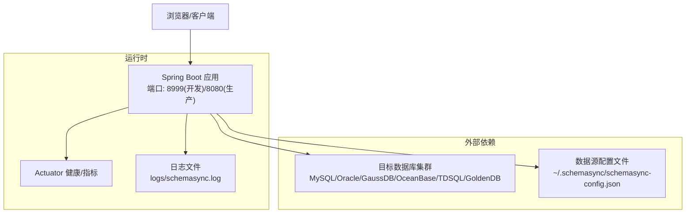
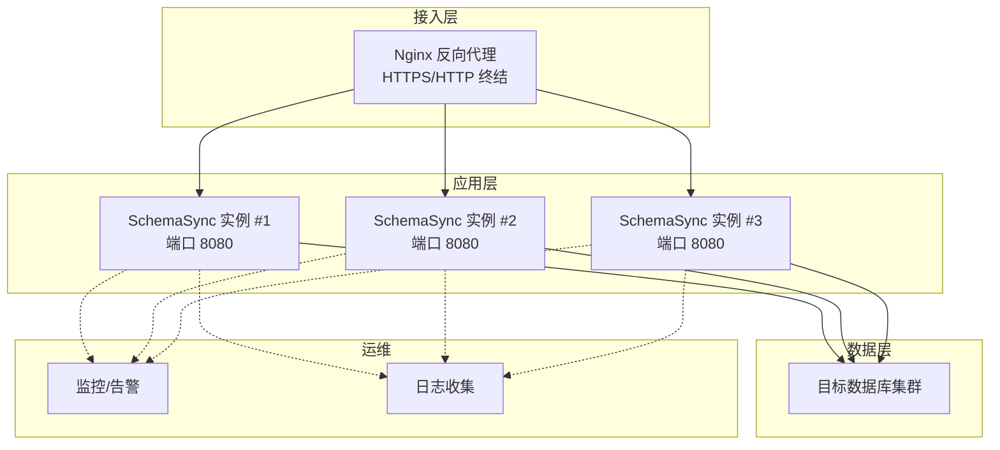
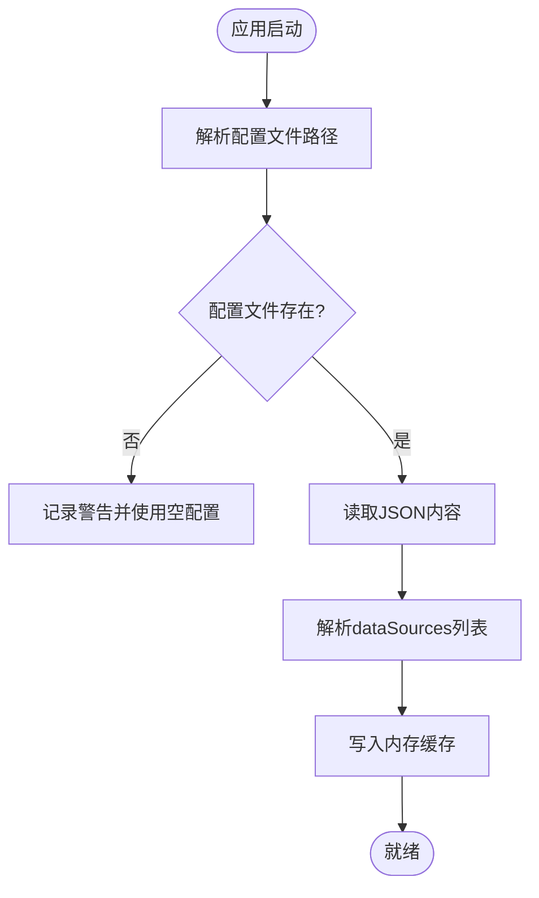
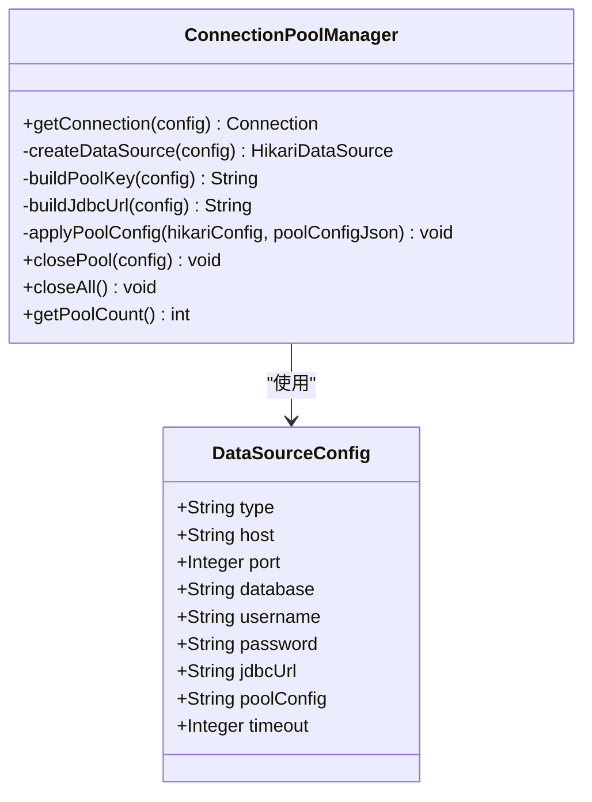
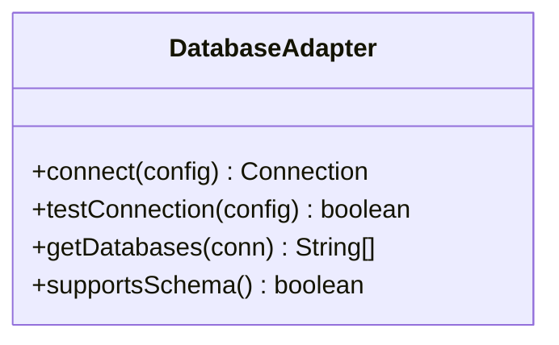
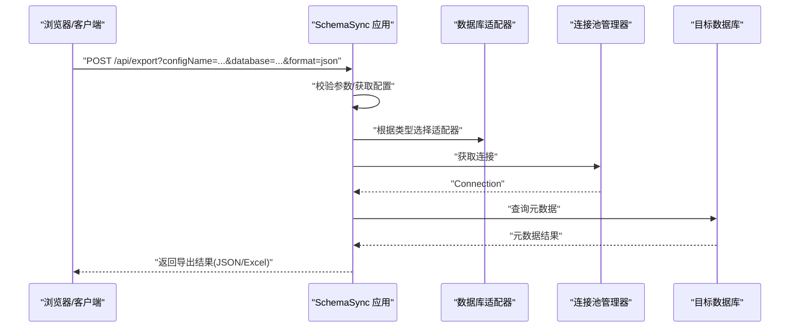
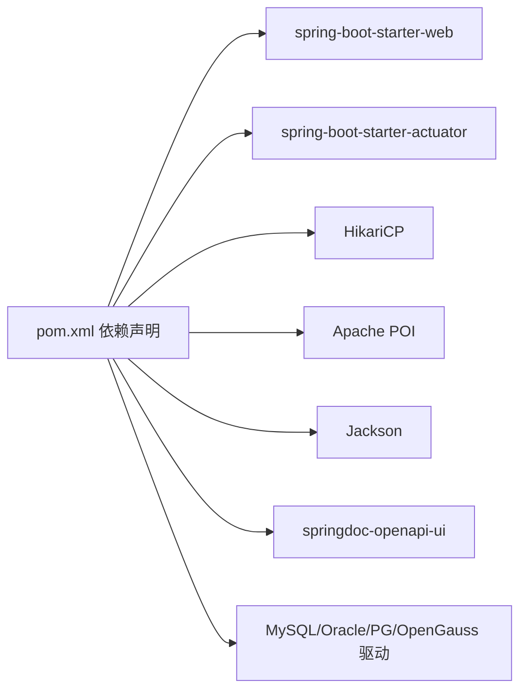

# 部署指南

<cite>
**本文引用的文件**   
- [README.md](file://README.md)
- [BUILD.md](file://BUILD.md)
- [QUICKSTART.md](file://QUICKSTART.md)
- [pom.xml](file://schemasync-backend/pom.xml)
- [application.yml](file://schemasync-backend/src/main/resources/application.yml)
- [application-prod.yml](file://schemasync-backend/src/main/resources/application-prod.yml)
- [build.sh](file://build.sh)
- [build.bat](file://build.bat)
- [start.sh](file://deploy/start.sh)
- [start.bat](file://deploy/start.bat)
- [SchemaSyncApplication.java](file://schemasync-backend/src/main/java/com/schemasync/SchemaSyncApplication.java)
- [ConnectionPoolManager.java](file://schemasync-backend/src/main/java/com/schemasync/util/ConnectionPoolManager.java)
- [ConfigService.java](file://schemasync-backend/src/main/java/com/schemasync/service/ConfigService.java)
- [DataSourceConfig.java](file://schemasync-backend/src/main/java/com/schemasync/model/config/DataSourceConfig.java)
- [DatabaseAdapter.java](file://schemasync-backend/src/main/java/com/schemasync/adapter/DatabaseAdapter.java)
- [schemasync-config.json](file://schemasync-backend/src/main/resources/schemasync-config.json)
</cite>

## 目录
1. [简介](#简介)
2. [项目结构](#项目结构)
3. [核心组件](#核心组件)
4. [架构总览](#架构总览)
5. [详细组件分析](#详细组件分析)
6. [依赖分析](#依赖分析)
7. [性能考虑](#性能考虑)
8. [故障排查手册](#故障排查手册)
9. [结论](#结论)
10. [附录](#附录)

## 简介
本指南面向生产环境，提供 SchemaSync 的完整部署方案，包括：
- 单机部署（JDK、数据库准备、应用打包与启动）
- Docker 容器化部署（Dockerfile、镜像构建、编排）
- 负载均衡与高可用（Nginx 反向代理、多实例、健康检查）
- 生产配置优化（JVM、连接池、日志与监控）
- 安全加固（HTTPS、访问控制、数据备份）
- 监控与日志收集（指标、错误日志、性能分析）
- 故障排查与应急预案

## 项目结构
本项目采用前后端分离、后端单体可执行 JAR 的形态。后端基于 Spring Boot，内置静态资源（前端构建产物），默认端口 8999（开发）或 8080（生产）。

图表来源
- [application.yml:1-83](file://schemasync-backend/src/main/resources/application.yml#L1-L83)
- [application-prod.yml:1-12](file://schemasync-backend/src/main/resources/application-prod.yml#L1-L12)
- [ConfigService.java:44-101](file://schemasync-backend/src/main/java/com/schemasync/service/ConfigService.java#L44-L101)

章节来源
- [README.md:1-100](file://README.md#L1-L100)
- [BUILD.md:1-136](file://BUILD.md#L1-L136)
- [application.yml:1-83](file://schemasync-backend/src/main/resources/application.yml#L1-L83)
- [application-prod.yml:1-12](file://schemasync-backend/src/main/resources/application-prod.yml#L1-L12)

## 核心组件
- 应用入口与版本输出：用于确认服务启动成功与版本信息。
- 配置管理：从文件系统加载数据源配置，支持相对路径与绝对路径，内存缓存并持久化到 JSON。
- 连接池管理：基于 HikariCP 的动态连接池创建、复用与关闭。
- 数据库适配器：统一接口抽象，支持多种数据库类型。

章节来源
- [SchemaSyncApplication.java:15-29](file://schemasync-backend/src/main/java/com/schemasync/SchemaSyncApplication.java#L15-L29)
- [ConfigService.java:44-101](file://schemasync-backend/src/main/java/com/schemasync/service/ConfigService.java#L44-L101)
- [ConnectionPoolManager.java:20-90](file://schemasync-backend/src/main/java/com/schemasync/util/ConnectionPoolManager.java#L20-L90)
- [DatabaseAdapter.java:17-54](file://schemasync-backend/src/main/java/com/schemasync/adapter/DatabaseAdapter.java#L17-L54)

## 架构总览
下图展示生产环境典型部署拓扑：Nginx 作为反向代理，将请求转发至多个 SchemaSync 实例；每个实例通过连接池访问目标数据库，并通过 Actuator 暴露健康与指标。

[此图为概念性架构图，无需“图表来源”]

## 详细组件分析

### 组件A：配置管理与数据源加载
- 启动时解析配置文件路径，支持用户主目录下的相对路径与绝对路径。
- 读取 JSON 中的 dataSources 列表，转换为内存对象并缓存。
- 新增/更新配置时自动加密密码，并写回文件。
- 测试连接时解密密码并尝试建立真实连接。

图表来源
- [ConfigService.java:44-101](file://schemasync-backend/src/main/java/com/schemasync/service/ConfigService.java#L44-L101)

章节来源
- [ConfigService.java:44-101](file://schemasync-backend/src/main/java/com/schemasync/service/ConfigService.java#L44-L101)
- [schemasync-config.json:1-25](file://schemasync-backend/src/main/resources/schemasync-config.json#L1-L25)

### 组件B：连接池管理器（HikariCP）
- 按数据源唯一键缓存 HikariDataSource，避免重复创建。
- 自动生成 JDBC URL（支持 MySQL 兼容型、Oracle、GaussDB/PostgreSQL）。
- 支持自定义连接池参数（JSON 片段覆盖默认值）。
- 提供关闭单个/全部连接池的能力。

图表来源
- [ConnectionPoolManager.java:20-90](file://schemasync-backend/src/main/java/com/schemasync/util/ConnectionPoolManager.java#L20-L90)
- [DataSourceConfig.java:67-128](file://schemasync-backend/src/main/java/com/schemasync/model/config/DataSourceConfig.java#L67-L128)

章节来源
- [ConnectionPoolManager.java:54-132](file://schemasync-backend/src/main/java/com/schemasync/util/ConnectionPoolManager.java#L54-L132)
- [DataSourceConfig.java:67-128](file://schemasync-backend/src/main/java/com/schemasync/model/config/DataSourceConfig.java#L67-L128)

### 组件C：数据库适配器接口
- 定义统一的 connect/test/getDatabases 等能力。
- 不同数据库实现该接口，工厂类根据类型选择具体实现。

图表来源
- [DatabaseAdapter.java:17-54](file://schemasync-backend/src/main/java/com/schemasync/adapter/DatabaseAdapter.java#L17-L54)

章节来源
- [DatabaseAdapter.java:17-54](file://schemasync-backend/src/main/java/com/schemasync/adapter/DatabaseAdapter.java#L17-L54)

### 组件D：API 调用序列（以导出为例）
以下序列图展示了从浏览器发起导出请求到返回结果的调用链。

图表来源
- [SchemaSyncApplication.java:15-29](file://schemasync-backend/src/main/java/com/schemasync/SchemaSyncApplication.java#L15-L29)
- [ConnectionPoolManager.java:36-49](file://schemasync-backend/src/main/java/com/schemasync/util/ConnectionPoolManager.java#L36-L49)
- [DatabaseAdapter.java:17-54](file://schemasync-backend/src/main/java/com/schemasync/adapter/DatabaseAdapter.java#L17-L54)

## 依赖分析
- 运行期依赖：JDK 8+、目标数据库驱动（由 pom.xml 声明）、HikariCP、Jackson、POI、Actuator、Swagger。
- 构建期依赖：Maven、Node.js（由插件自动安装）、前端构建产物复制至后端 static。

图表来源
- [pom.xml:39-184](file://schemasync-backend/pom.xml#L39-L184)

章节来源
- [pom.xml:1-184](file://schemasync-backend/pom.xml#L1-L184)

## 性能考虑
- JVM 参数
  - 建议设置初始堆与最大堆一致，减少动态扩容抖动；结合容器限制合理设置。
  - 示例参考：-Xms256m -Xmx512m（见启动脚本）。
- 连接池调优
  - maximumPoolSize、minimumIdle、connectionTimeout、idleTimeout、maxLifetime 可按负载调整。
  - 支持在数据源配置中通过 JSON 片段覆盖默认值。
- 日志级别
  - 生产建议 root=WARN，业务包 INFO，降低 I/O 压力。
- 文件上传大小
  - 根据业务需要调整 max-file-size 与 max-request-size。

章节来源
- [start.sh:14-16](file://deploy/start.sh#L14-L16)
- [start.bat:1-6](file://deploy/start.bat#L1-L6)
- [ConnectionPoolManager.java:70-90](file://schemasync-backend/src/main/java/com/schemasync/util/ConnectionPoolManager.java#L70-L90)
- [application.yml:18-34](file://schemasync-backend/src/main/resources/application.yml#L18-L34)
- [application-prod.yml:6-12](file://schemasync-backend/src/main/resources/application-prod.yml#L6-L12)

## 故障排查手册
- 无法启动
  - 检查端口占用与防火墙策略。
  - 查看日志：logs/schemasync.log 或 nohup 输出 app.log。
  - 确认 application.yml 与数据源配置文件路径正确。
- 连接失败
  - 校验主机、端口、用户名、密码、数据库名。
  - 若为 GaussDB/PostgreSQL，注意 sslmode 与驱动兼容性。
  - 使用“测试连接”功能定位问题。
- 导出为空或异常
  - 确认数据库权限（如 INFORMATION_SCHEMA 读取权限）。
  - 检查数据库名与表是否存在。
- 健康检查
  - 访问 /actuator/health 查看状态详情。
- 常见命令
  - Linux：tail -f logs/schemasync.log 或 tail -f app.log
  - Windows：查看控制台输出或日志文件

章节来源
- [BUILD.md:119-136](file://BUILD.md#L119-L136)
- [QUICKSTART.md:136-163](file://QUICKSTART.md#L136-L163)
- [application.yml:66-75](file://schemasync-backend/src/main/resources/application.yml#L66-L75)
- [start.sh:14-22](file://deploy/start.sh#L14-L22)

## 结论
SchemaSync 在生产环境可通过单机或容器化方式稳定运行。配合 Nginx 可实现水平扩展与高可用；通过 Actuator 与集中式日志/监控体系，可获得良好的可观测性与可维护性。

## 附录

### A. 单机部署流程（Linux/Windows）
- 环境准备
  - JDK 8+（推荐 8u200+）
  - 目标数据库连通性（网络、白名单、账号权限）
- 构建与打包
  - 使用一键脚本生成 deploy 目录与可执行 JAR。
  - Windows：双击 build.bat 或在 CMD 执行。
  - Linux/Mac：chmod +x build.sh && ./build.sh。
- 部署步骤
  - 将 deploy 目录复制到服务器指定路径。
  - 修改 application.yml（端口、日志路径等）。
  - 准备数据源配置文件 schemasync-config.json（放置于 ~/.schemasync/ 或绝对路径）。
  - 启动服务：
    - Windows：双击 start.bat
    - Linux：chmod +x start.sh && ./start.sh
- 验证
  - 访问 http://IP:PORT 打开前端页面。
  - 访问 http://IP:PORT/api-docs 查看 API 文档。
  - 访问 http://IP:PORT/actuator/health 检查健康状态。

章节来源
- [BUILD.md:1-136](file://BUILD.md#L1-L136)
- [build.sh:1-89](file://build.sh#L1-L89)
- [build.bat:1-174](file://build.bat#L1-L174)
- [start.sh:1-22](file://deploy/start.sh#L1-L22)
- [start.bat:1-6](file://deploy/start.bat#L1-L6)
- [application.yml:1-23](file://schemasync-backend/src/main/resources/application.yml#L1-L23)
- [schemasync-config.json:1-25](file://schemasync-backend/src/main/resources/schemasync-config.json#L1-L25)

### B. Docker 容器化部署
- 基础镜像
  - 使用官方 JDK 8 镜像（例如 eclipse-temurin:8-jre）。
- 构建阶段
  - 在 Maven 构建阶段已包含前端构建与静态资源复制，最终产物为单 JAR。
- 运行阶段
  - 挂载外置配置目录（application.yml、schemasync-config.json）。
  - 挂载日志目录以便采集。
  - 设置 JVM 参数与环境变量。
- 示例要点（说明性）
  - COPY 生成的 schemasync.jar 到镜像。
  - EXPOSE 8080（生产端口）。
  - ENTRYPOINT 使用 java -jar 启动，并传入 --spring.config.location。
  - 通过环境变量注入 JVM 参数（如 JAVA_OPTS）。
- 编排（Kubernetes/Docker Compose）
  - 使用 Deployment/ReplicaSet 或 Compose 副本数 > 1。
  - 通过 ConfigMap/Secret 注入配置与敏感信息。
  - 使用 Service 暴露内部端口，Ingress/Nginx 暴露外部 HTTPS。

[本节为通用指导，不直接分析具体源码文件，故无“章节来源”]

### C. 负载均衡与高可用
- Nginx 反向代理
  - 监听 443（HTTPS），终止 TLS，转发到后端多个实例。
  - 配置 upstream 指向多个 SchemaSync 实例地址。
  - 开启 gzip、缓存静态资源、限流与访问控制。
- 多实例部署
  - 每个实例独立进程，共享同一数据源配置文件与日志目录（或使用独立目录便于区分）。
- 健康检查
  - 使用 /actuator/health 进行存活与就绪探针。
  - 在 Nginx 中配置健康检查或结合监控系统。

[本节为通用指导，不直接分析具体源码文件，故无“章节来源”]

### D. 生产配置优化清单
- JVM
  - 设置 -Xms/-Xmx 一致，启用 GC 日志（可选），根据容器限制设置内存上限。
- 连接池
  - 依据并发与数据库容量调整 maximumPoolSize、idleTimeout、maxLifetime。
  - 对长事务场景适当增大 connectionTimeout。
- 日志
  - 生产 root=WARN，业务包 INFO；按天滚动与保留天数。
- 文件上传
  - 根据业务需求调整 max-file-size 与 max-request-size。
- Actuator
  - 仅暴露 health/info/metrics，并限制访问来源。

章节来源
- [application.yml:18-34](file://schemasync-backend/src/main/resources/application.yml#L18-L34)
- [application-prod.yml:6-12](file://schemasync-backend/src/main/resources/application-prod.yml#L6-L12)
- [ConnectionPoolManager.java:70-90](file://schemasync-backend/src/main/java/com/schemasync/util/ConnectionPoolManager.java#L70-L90)

### E. 监控与日志收集
- 应用指标
  - 通过 /actuator/metrics 暴露 JVM、HTTP、数据库连接池等指标。
- 健康检查
  - /actuator/health 返回详细状态，供编排平台与健康网关使用。
- 日志收集
  - 将 logs/schemasync.log 或 app.log 接入集中式日志系统（如 Filebeat/Fluent Bit）。
- 性能分析
  - 结合系统监控（CPU/内存/IO）与应用指标定位瓶颈。

章节来源
- [application.yml:66-75](file://schemasync-backend/src/main/resources/application.yml#L66-L75)
- [start.sh:14-22](file://deploy/start.sh#L14-L22)

### F. 安全加固建议
- HTTPS
  - 在 Nginx 层启用 TLS，证书定期轮换。
- 访问控制
  - 限制 /api-docs 与 /actuator 的访问来源，必要时增加鉴权。
- 数据保护
  - 数据源密码已在配置管理中加密存储；确保配置文件权限最小化。
- 备份
  - 定期备份 schemasync-config.json 与关键导出文件。

章节来源
- [ConfigService.java:167-179](file://schemasync-backend/src/main/java/com/schemasync/service/ConfigService.java#L167-L179)
- [application.yml:76-83](file://schemasync-backend/src/main/resources/application.yml#L76-L83)

### G. 快速验证与常用命令
- 启动后访问
  - 主页：http://IP:PORT
  - API 文档：http://IP:PORT/api-docs
  - 健康检查：http://IP:PORT/actuator/health
- 停止服务
  - Linux：pkill -f schemasync.jar 或 kill PID
  - Windows：关闭控制台窗口或任务管理器结束进程

章节来源
- [BUILD.md:88-92](file://BUILD.md#L88-L92)
- [start.sh:17-22](file://deploy/start.sh#L17-L22)
- [start.bat:1-6](file://deploy/start.bat#L1-L6)