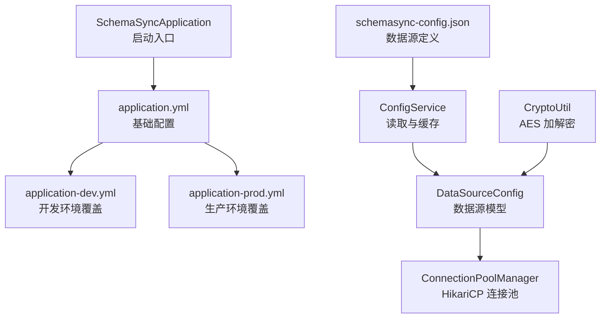
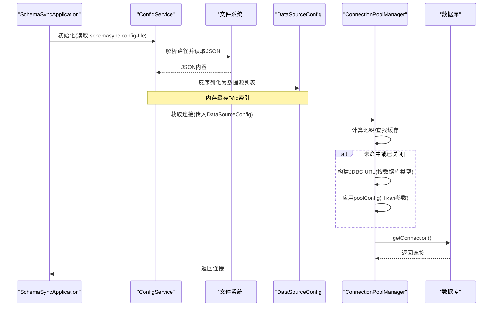
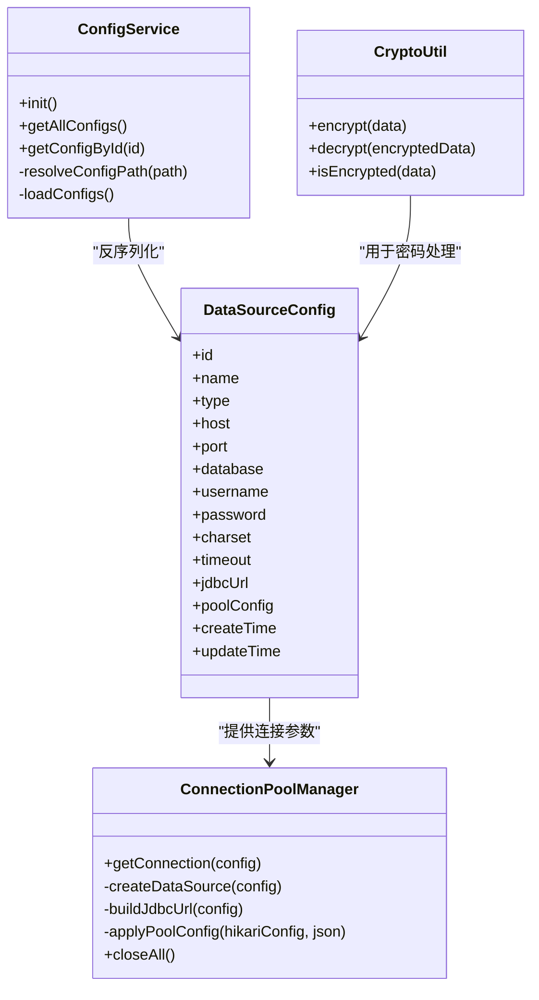

# 配置指南

<cite>
**本文引用的文件**   
- [application.yml](file://schemasync-backend/src/main/resources/application.yml)
- [application-dev.yml](file://schemasync-backend/src/main/resources/application-dev.yml)
- [application-prod.yml](file://schemasync-backend/src/main/resources/application-prod.yml)
- [schemasync-config.json](file://schemasync-backend/src/main/resources/schemasync-config.json)
- [CryptoUtil.java](file://schemasync-backend/src/main/java/com/schemasync/util/CryptoUtil.java)
- [ConnectionPoolManager.java](file://schemasync-backend/src/main/java/com/schemasync/util/ConnectionPoolManager.java)
- [DataSourceConfig.java](file://schemasync-backend/src/main/java/com/schemasync/model/config/DataSourceConfig.java)
- [ConfigService.java](file://schemasync-backend/src/main/java/com/schemasync/service/ConfigService.java)
- [SchemaSyncApplication.java](file://schemasync-backend/src/main/java/com/schemasync/SchemaSyncApplication.java)
</cite>

## 目录
1. [简介](#简介)
2. [项目结构](#项目结构)
3. [核心组件](#核心组件)
4. [架构总览](#架构总览)
5. [详细组件分析](#详细组件分析)
6. [依赖关系分析](#依赖关系分析)
7. [性能考虑](#性能考虑)
8. [故障排查指南](#故障排查指南)
9. [结论](#结论)
10. [附录](#附录)

## 简介
本指南面向使用 SchemaSync 的运维与开发人员，聚焦于后端配置体系：Spring Boot 应用配置文件 application.yml 的结构与含义、多环境配置与环境变量覆盖机制、数据源配置文件 schemasync-config.json 的 JSON 结构与字段说明、密码加密机制 CryptoUtil 的工作原理、连接池管理器 ConnectionPoolManager 的配置与调优，以及生产部署的安全建议。文档同时提供配置校验、热重载思路与常见问题排查方法，帮助正确配置并优化系统性能。

## 项目结构
后端采用 Spring Boot 标准资源组织方式，核心配置位于 resources 目录下；运行时动态加载的数据源定义位于 JSON 文件中；关键工具类包括加密工具与连接池管理器。

图表来源
- [application.yml:1-83](file://schemasync-backend/src/main/resources/application.yml#L1-L83)
- [application-dev.yml:1-8](file://schemasync-backend/src/main/resources/application-dev.yml#L1-L8)
- [application-prod.yml:1-12](file://schemasync-backend/src/main/resources/application-prod.yml#L1-L12)
- [schemasync-config.json:1-25](file://schemasync-backend/src/main/resources/schemasync-config.json#L1-L25)
- [ConfigService.java:26-113](file://schemasync-backend/src/main/java/com/schemasync/service/ConfigService.java#L26-L113)
- [DataSourceConfig.java:1-129](file://schemasync-backend/src/main/java/com/schemasync/model/config/DataSourceConfig.java#L1-L129)
- [ConnectionPoolManager.java:1-258](file://schemasync-backend/src/main/java/com/schemasync/util/ConnectionPoolManager.java#L1-L258)
- [CryptoUtil.java:1-84](file://schemasync-backend/src/main/java/com/schemasync/util/CryptoUtil.java#L1-L84)
- [SchemaSyncApplication.java:1-30](file://schemasync-backend/src/main/java/com/schemasync/SchemaSyncApplication.java#L1-L30)

章节来源
- [application.yml:1-83](file://schemasync-backend/src/main/resources/application.yml#L1-L83)
- [application-dev.yml:1-8](file://schemasync-backend/src/main/resources/application-dev.yml#L1-L8)
- [application-prod.yml:1-12](file://schemasync-backend/src/main/resources/application-prod.yml#L1-L12)
- [schemasync-config.json:1-25](file://schemasync-backend/src/main/resources/schemasync-config.json#L1-L25)
- [ConfigService.java:26-113](file://schemasync-backend/src/main/java/com/schemasync/service/ConfigService.java#L26-L113)
- [DataSourceConfig.java:1-129](file://schemasync-backend/src/main/java/com/schemasync/model/config/DataSourceConfig.java#L1-L129)
- [ConnectionPoolManager.java:1-258](file://schemasync-backend/src/main/java/com/schemasync/util/ConnectionPoolManager.java#L1-L258)
- [CryptoUtil.java:1-84](file://schemasync-backend/src/main/java/com/schemasync/util/CryptoUtil.java#L1-L84)
- [SchemaSyncApplication.java:1-30](file://schemasync-backend/src/main/java/com/schemasync/SchemaSyncApplication.java#L1-L30)

## 核心组件
- 应用基础配置（application.yml）
  - 服务器端口、上下文路径、应用名称与版本注入
  - Jackson 日期格式与时区
  - 文件上传大小限制
  - 日志级别、控制台输出格式、滚动策略
  - SchemaSync 自定义配置项：数据源配置文件路径、默认输出目录、连接池相关参数等
  - Actuator 健康检查端点暴露
  - Swagger 文档与 UI 访问路径
- 多环境配置
  - 开发环境：更详细的 Web 日志
  - 生产环境：调整端口与日志级别、指定日志文件路径
- 数据源配置（schemasync-config.json）
  - 顶层 version、dataSources 数组、settings 对象
  - dataSources 中每个数据源的 id、name、type、host、port、database、username、password、charset、timeout、createTime、updateTime
  - settings 中的 defaultOutputDir、logLevel、maxConnectionPool
- 配置加载服务（ConfigService）
  - 通过 @Value 注入 schemasync.config-file，支持相对路径与绝对路径解析
  - 启动时加载 JSON 到内存缓存，按 id 索引
- 数据源模型（DataSourceConfig）
  - 包含数据库类型、连接信息、字符集、超时、可选 JDBC URL、可选 Hikari 连接池高级配置 JSON
- 连接池管理器（ConnectionPoolManager）
  - 基于 HikariCP 管理多数据源连接池
  - 自动构建 JDBC URL（MySQL/OceanBase/TDSQL/GoldenDB、Oracle、GaussDB）
  - 支持从 DataSourceConfig.poolConfig 注入 Hikari 参数
- 加密工具（CryptoUtil）
  - AES 对称加密/解密，Base64 编码密文
  - 提供 isEncrypted 判断是否已加密

章节来源
- [application.yml:1-83](file://schemasync-backend/src/main/resources/application.yml#L1-L83)
- [application-dev.yml:1-8](file://schemasync-backend/src/main/resources/application-dev.yml#L1-L8)
- [application-prod.yml:1-12](file://schemasync-backend/src/main/resources/application-prod.yml#L1-L12)
- [schemasync-config.json:1-25](file://schemasync-backend/src/main/resources/schemasync-config.json#L1-L25)
- [ConfigService.java:26-113](file://schemasync-backend/src/main/java/com/schemasync/service/ConfigService.java#L26-L113)
- [DataSourceConfig.java:1-129](file://schemasync-backend/src/main/java/com/schemasync/model/config/DataSourceConfig.java#L1-L129)
- [ConnectionPoolManager.java:1-258](file://schemasync-backend/src/main/java/com/schemasync/util/ConnectionPoolManager.java#L1-L258)
- [CryptoUtil.java:1-84](file://schemasync-backend/src/main/java/com/schemasync/util/CryptoUtil.java#L1-L84)

## 架构总览
下图展示了配置加载与连接池创建的关键流程：应用启动后，ConfigService 根据 application.yml 指定的路径加载 JSON 数据源配置，将其映射为 DataSourceConfig 对象并缓存；当业务需要连接数据库时，ConnectionPoolManager 依据 DataSourceConfig 构建或复用 Hikari 连接池，必要时应用 poolConfig 进行参数覆盖。

图表来源
- [SchemaSyncApplication.java:1-30](file://schemasync-backend/src/main/java/com/schemasync/SchemaSyncApplication.java#L1-L30)
- [ConfigService.java:26-113](file://schemasync-backend/src/main/java/com/schemasync/service/ConfigService.java#L26-L113)
- [DataSourceConfig.java:1-129](file://schemasync-backend/src/main/java/com/schemasync/model/config/DataSourceConfig.java#L1-L129)
- [ConnectionPoolManager.java:1-258](file://schemasync-backend/src/main/java/com/schemasync/util/ConnectionPoolManager.java#L1-L258)

## 详细组件分析

### application.yml 配置详解
- 服务器与上下文
  - server.port：应用监听端口
  - server.servlet.context-path：Web 根路径
- Spring 应用元信息
  - spring.application.name / version：用于日志与 Actuator 展示
- Jackson 序列化
  - date-format、time-zone、write-dates-as-timestamps：统一时间格式与时区
- 文件上传
  - servlet.multipart.max-file-size / max-request-size：控制上传大小
- 日志
  - logging.level.root 与 com.schemasync：全局与包级日志级别
  - logging.pattern.console：控制台输出格式
  - logging.file.name / max-size / max-history：日志文件路径与滚动策略
- SchemaSync 自定义
  - schemasync.config-file：数据源配置文件路径（支持相对路径与绝对路径）
  - schemasync.default-output-dir：导出文件默认输出目录
  - schemasync.max-pool-size / connection-timeout / min-idle / max-lifetime：连接池相关默认值（具体生效以连接池实现为准）
  - schemasync.cli-enabled：CLI 模式开关（当前未使用）
- Actuator
  - management.endpoints.web.exposure.include：暴露 health/info/metrics
  - management.endpoint.health.show-details：健康检查详情
- Swagger
  - springdoc.api-docs.path / swagger-ui.path / enabled：API 文档与 UI 访问路径

章节来源
- [application.yml:1-83](file://schemasync-backend/src/main/resources/application.yml#L1-L83)

### 多环境与环境变量覆盖
- 环境激活
  - 通过 Spring Boot 的 profile 机制，可分别启用 application-dev.yml 与 application-prod.yml
- 覆盖优先级
  - 命令行参数 > 环境变量 > application-{profile}.yml > application.yml
- 典型差异
  - 开发环境：提高日志级别，便于调试
  - 生产环境：降低日志级别，指定集中式日志路径，调整端口

章节来源
- [application-dev.yml:1-8](file://schemasync-backend/src/main/resources/application-dev.yml#L1-L8)
- [application-prod.yml:1-12](file://schemasync-backend/src/main/resources/application-prod.yml#L1-L12)

### 数据源配置 schemasync-config.json
- 顶层结构
  - version：配置版本标识
  - dataSources：数据源数组，每项为一个数据源定义
  - settings：全局设置，如默认输出目录、日志级别、最大连接池等
- dataSources 数组元素字段
  - id：数据源唯一标识
  - name：显示名
  - type：数据库类型（mysql/oracle/oceanbase/tdsql/gaussdb/goldendb）
  - host / port / database：连接地址与库名
  - username / password：用户名与密码（建议加密存储）
  - charset：字符集（默认 utf8mb4）
  - timeout：连接超时秒数（默认 30）
  - createTime / updateTime：时间戳
- settings 对象字段
  - defaultOutputDir：默认输出目录
  - logLevel：日志级别
  - maxConnectionPool：最大连接池大小（供参考）
- 注意事项
  - 若需高级 JDBC 参数，可在 DataSourceConfig 中使用 jdbcUrl 覆盖自动生成 URL
  - 可通过 poolConfig 注入 Hikari 连接池参数（见下一节）

章节来源
- [schemasync-config.json:1-25](file://schemasync-backend/src/main/resources/schemasync-config.json#L1-L25)
- [DataSourceConfig.java:1-129](file://schemasync-backend/src/main/java/com/schemasync/model/config/DataSourceConfig.java#L1-L129)

### 配置加载与路径解析（ConfigService）
- 配置文件路径解析
  - 通过 @Value("${schemasync.config-file:schemasync-config.json}") 注入
  - 支持绝对路径与相对路径；相对路径相对于用户主目录下的 .schemasync 子目录
- 加载流程
  - 启动时尝试读取 JSON，失败则记录警告并使用空配置
  - 将 dataSources 数组反序列化为 DataSourceConfig 列表，按 id 缓存
- 扩展点
  - 后续可扩展热重载逻辑，在检测到文件变更时重新加载并刷新缓存

章节来源
- [ConfigService.java:26-113](file://schemasync-backend/src/main/java/com/schemasync/service/ConfigService.java#L26-L113)

### 连接池管理器（ConnectionPoolManager）
- 功能概述
  - 基于 HikariCP 管理多个数据源连接池，避免泄漏
  - 根据 DataSourceConfig 自动构建 JDBC URL，或优先使用自定义 jdbcUrl
  - 支持通过 poolConfig 注入 Hikari 参数（maximumPoolSize、minimumIdle、connectionTimeout、idleTimeout、maxLifetime）
- 关键行为
  - 连接池缓存：以“类型:主机:端口:库:用户名”作为 key
  - 自动检测已关闭的连接池并重建
  - 内置默认值：最大池大小、最小空闲、连接超时、空闲超时、最大生命周期
- 支持的数据库类型与 URL 构造
  - MySQL/OceanBase/TDSQL/GoldenDB：使用 mysql 驱动，设置字符集与时区等
  - Oracle：thin 协议
  - GaussDB：使用 PostgreSQL 驱动，禁用 SSL 与日志以降低开销
- 性能调优要点
  - maximumPoolSize：根据并发与数据库承载能力设定
  - minimumIdle：保持一定空闲连接减少冷启动延迟
  - connectionTimeout：防止长时间阻塞
  - idleTimeout / maxLifetime：合理回收连接，避免长期占用

章节来源
- [ConnectionPoolManager.java:1-258](file://schemasync-backend/src/main/java/com/schemasync/util/ConnectionPoolManager.java#L1-L258)
- [DataSourceConfig.java:1-129](file://schemasync-backend/src/main/java/com/schemasync/model/config/DataSourceConfig.java#L1-L129)

### 密码加密机制（CryptoUtil）
- 算法与编码
  - 使用 AES 对称加密，密钥长度满足 128/192/256 位要求
  - 明文经 AES 加密后，使用 Base64 编码输出
- 主要方法
  - encrypt(data)：对明文进行加密
  - decrypt(encryptedData)：对 Base64 密文进行解密
  - isEncrypted(data)：简单判断是否为 Base64 格式（辅助识别）
- 安全建议
  - 密钥应从外部配置中心或环境变量注入，避免硬编码
  - 生产环境建议使用更强的密钥管理与轮换策略

章节来源
- [CryptoUtil.java:1-84](file://schemasync-backend/src/main/java/com/schemasync/util/CryptoUtil.java#L1-L84)

### 数据源模型（DataSourceConfig）
- 关键字段
  - 连接信息：type、host、port、database、username、password、charset、timeout
  - 高级选项：jdbcUrl（覆盖自动生成的 URL）、poolConfig（Hikari 参数 JSON）
  - 审计字段：createTime、updateTime
- 使用建议
  - 敏感字段（password）建议加密存储
  - 复杂 JDBC 参数通过 jdbcUrl 精确控制
  - 连接池参数通过 poolConfig 精细化调优

章节来源
- [DataSourceConfig.java:1-129](file://schemasync-backend/src/main/java/com/schemasync/model/config/DataSourceConfig.java#L1-L129)

## 依赖关系分析
- 配置加载依赖
  - ConfigService 依赖 ObjectMapper 解析 JSON，依赖 System.getProperty("user.home") 解析相对路径
- 连接池依赖
  - ConnectionPoolManager 依赖 HikariCP（HikariConfig/HikariDataSource）
- 加密依赖
  - CryptoUtil 依赖 javax.crypto 与 Base64

图表来源
- [ConfigService.java:26-113](file://schemasync-backend/src/main/java/com/schemasync/service/ConfigService.java#L26-L113)
- [DataSourceConfig.java:1-129](file://schemasync-backend/src/main/java/com/schemasync/model/config/DataSourceConfig.java#L1-L129)
- [ConnectionPoolManager.java:1-258](file://schemasync-backend/src/main/java/com/schemasync/util/ConnectionPoolManager.java#L1-L258)
- [CryptoUtil.java:1-84](file://schemasync-backend/src/main/java/com/schemasync/util/CryptoUtil.java#L1-L84)

## 性能考虑
- 连接池调优
  - 根据并发量与数据库容量设置 maximumPoolSize 与 minimumIdle
  - 合理设置 connectionTimeout 避免长事务阻塞
  - 使用 idleTimeout 与 maxLifetime 定期回收连接，避免资源泄露
- 日志级别
  - 开发环境使用 DEBUG，生产环境使用 INFO/WARN，避免过多日志影响 IO
- 文件上传
  - 根据业务需求调整 max-file-size 与 max-request-size，防止过大请求导致内存压力
- 数据库 URL
  - 针对特定数据库开启必要的优化参数（如时区、字符集、SSL 等），或通过 jdbcUrl 精确控制

[本节为通用指导，不直接分析具体文件]

## 故障排查指南
- 配置文件路径问题
  - 症状：启动后提示配置文件不存在
  - 排查：确认 schemasync.config-file 指向的路径是否正确；相对路径会解析到用户主目录下的 .schemasync 子目录
- JSON 解析异常
  - 症状：加载数据源配置失败
  - 排查：检查 schemasync-config.json 语法与必填字段；确保 dataSources 为数组且每个元素包含必要字段
- 连接池无法创建
  - 症状：获取连接时报错或超时
  - 排查：检查数据库类型与 URL 构造；核对 host/port/database/username/password；查看 poolConfig 是否合法
- 日志定位
  - 使用 Actuator 的 health 端点检查服务状态
  - 结合日志文件与 console 输出定位错误堆栈
- 热重载建议
  - 可在 ConfigService 中增加文件监听与定时校验逻辑，在文件变更时重新加载并刷新内存缓存

章节来源
- [ConfigService.java:26-113](file://schemasync-backend/src/main/java/com/schemasync/service/ConfigService.java#L26-L113)
- [application.yml:1-83](file://schemasync-backend/src/main/resources/application.yml#L1-L83)

## 结论
通过合理的 application.yml 与多环境配置、规范的 schemasync-config.json 数据源定义、安全的密码加密方案与精细化的连接池调优，SchemaSync 可以在不同环境中稳定运行并获得良好性能。建议在生产环境严格管理密钥与日志，并结合监控与告警持续优化。

[本节为总结性内容，不直接分析具体文件]

## 附录

### 配置清单速查
- application.yml
  - 服务器端口、上下文路径
  - Jackson 日期格式与时区
  - 文件上传大小限制
  - 日志级别与滚动策略
  - SchemaSync 自定义配置项
  - Actuator 与 Swagger 路径
- application-dev.yml / application-prod.yml
  - 日志级别与文件路径差异
  - 端口差异
- schemasync-config.json
  - version、dataSources[]、settings{}
  - dataSources 字段：id、name、type、host、port、database、username、password、charset、timeout、createTime、updateTime
  - settings 字段：defaultOutputDir、logLevel、maxConnectionPool

章节来源
- [application.yml:1-83](file://schemasync-backend/src/main/resources/application.yml#L1-L83)
- [application-dev.yml:1-8](file://schemasync-backend/src/main/resources/application-dev.yml#L1-L8)
- [application-prod.yml:1-12](file://schemasync-backend/src/main/resources/application-prod.yml#L1-L12)
- [schemasync-config.json:1-25](file://schemasync-backend/src/main/resources/schemasync-config.json#L1-L25)

### 跨域与安全加固建议（生产环境）
- 跨域设置
  - 如需允许前端跨域访问，可在 Web 层添加 CORS 配置（例如通过 WebMvcConfigurer 或过滤器）
- SSL 与 HTTPS
  - 建议在反向代理（Nginx/网关）终止 TLS，后端仅处理 HTTP
  - 若直连数据库，可根据数据库类型在 jdbcUrl 中启用 SSL 与证书校验
- 超时与重试
  - 合理设置连接超时与查询超时，避免雪崩
- 安全加固
  - 最小权限原则：数据库账号仅授予必要权限
  - 密钥管理：使用配置中心或环境变量注入密钥，避免硬编码
  - 日志脱敏：避免输出敏感信息（如密码）

[本节为通用建议，不直接分析具体文件]