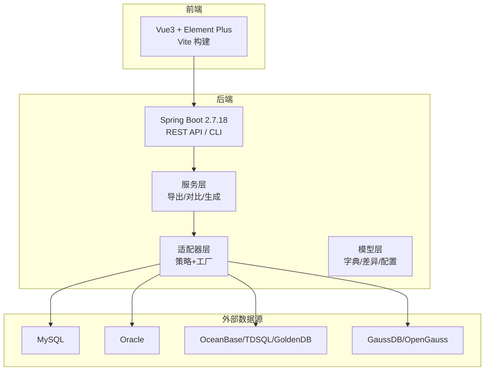
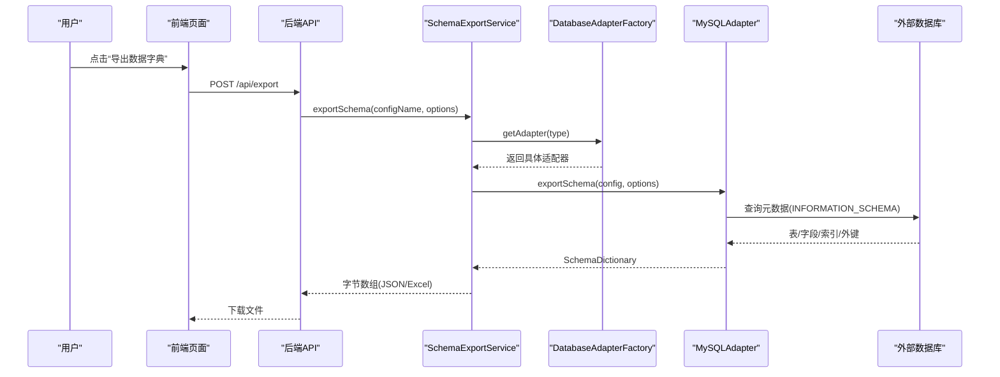
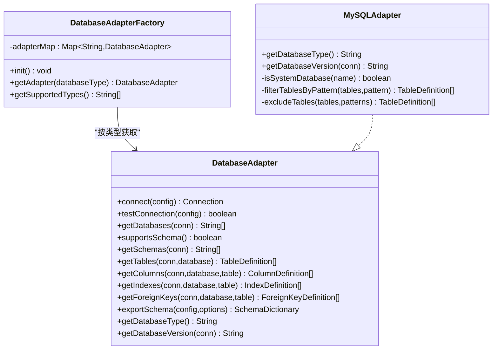
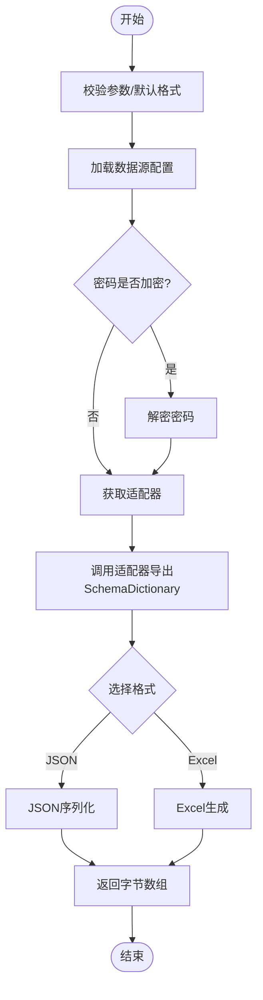
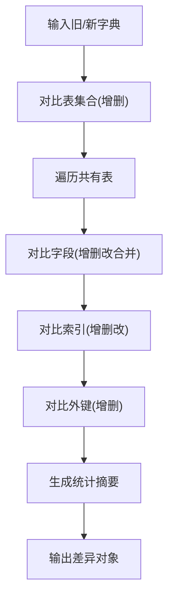
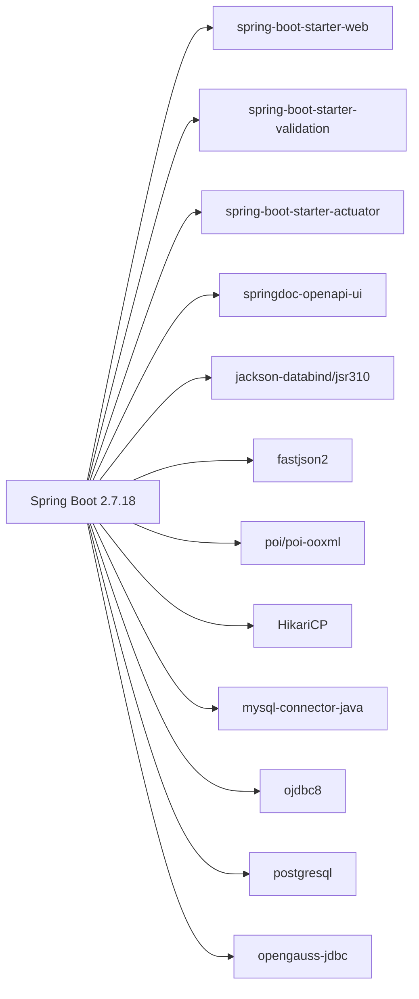

# 项目概述

<cite>
**本文引用的文件**   
- [README.md](file://README.md)
- [DESIGN.md](file://DESIGN.md)
- [PROJECT_SUMMARY.md](file://PROJECT_SUMMARY.md)
- [FEATURE_DATABASE_LIST.md](file://FEATURE_DATABASE_LIST.md)
- [SchemaSyncApplication.java](file://schemasync-backend/src/main/java/com/schemasync/SchemaSyncApplication.java)
- [DatabaseAdapter.java](file://schemasync-backend/src/main/java/com/schemasync/adapter/DatabaseAdapter.java)
- [DatabaseAdapterFactory.java](file://schemasync-backend/src/main/java/com/schemasync/adapter/DatabaseAdapterFactory.java)
- [MySQLAdapter.java](file://schemasync-backend/src/main/java/com/schemasync/adapter/MySQLAdapter.java)
- [SchemaDictionary.java](file://schemasync-backend/src/main/java/com/schemasync/model/dict/SchemaDictionary.java)
- [SchemaExportService.java](file://schemasync-backend/src/main/java/com/schemasync/service/SchemaExportService.java)
- [DefaultSchemaDiffer.java](file://schemasync-backend/src/main/java/com/schemasync/differ/DefaultSchemaDiffer.java)
- [DDLGenerator.java](file://schemasync-backend/src/main/java/com/schemasync/generator/DDLGenerator.java)
- [pom.xml](file://schemasync-backend/pom.xml)
- [package.json](file://schemasync-frontend/package.json)
</cite>

## 目录
1. [简介](#简介)
2. [项目结构](#项目结构)
3. [核心组件](#核心组件)
4. [架构总览](#架构总览)
5. [详细组件分析](#详细组件分析)
6. [依赖分析](#依赖分析)
7. [性能考虑](#性能考虑)
8. [故障排查指南](#故障排查指南)
9. [结论](#结论)
10. [附录](#附录)

## 简介
SchemaSync 是一个面向敏捷开发的轻量级数据字典管理工具，聚焦于数据库变更治理与协作效率提升。其核心价值在于：
- 将分散在各库的元数据统一导出为结构化数据字典，便于团队共享与评审
- 对两个版本的数据字典进行差异对比，自动识别破坏性变更并生成可视化报告
- 基于差异自动生成增量 DDL 脚本（含回滚脚本），降低人工编写 SQL 的错误率与沟通成本
- 通过策略模式+工厂模式的扩展设计，支持 MySQL、Oracle、OceanBase、TDSQL、GaussDB、GoldenDB 等 6 种数据库类型
- 零侵入原则：不依赖目标数据库存储配置，仅以只读方式访问元数据，导出不持久化到本地数据库

这些能力有效解决敏捷迭代中“数据库变更难追踪、易遗漏、回滚困难”的问题，帮助团队在频繁发布节奏下保持数据库结构与业务代码的一致性。

章节来源
- [README.md:1-239](file://README.md#L1-L239)
- [DESIGN.md:15-80](file://DESIGN.md#L15-L80)
- [PROJECT_SUMMARY.md:1-120](file://PROJECT_SUMMARY.md#L1-L120)

## 项目结构
系统采用前后端分离架构：后端提供 REST API 与 CLI 接口，前端提供 Web 操作界面；构建阶段由 Maven 插件统一打包前端静态资源，最终输出单 JAR 包部署。

图表来源
- [pom.xml:194-263](file://schemasync-backend/pom.xml#L194-L263)
- [DESIGN.md:30-80](file://DESIGN.md#L30-L80)

章节来源
- [README.md:66-98](file://README.md#L66-L98)
- [DESIGN.md:84-203](file://DESIGN.md#L84-L203)
- [pom.xml:194-263](file://schemasync-backend/pom.xml#L194-L263)

## 核心组件
- 启动入口：应用主类负责初始化 Spring 容器并输出版本信息
- 适配器层：定义统一的 DatabaseAdapter 接口，并通过 DatabaseAdapterFactory 动态装配具体实现，支撑多数据库接入
- 服务层：封装导出、对比、DDL 生成等业务流程，协调适配器与格式化器
- 模型层：SchemaDictionary 等对象承载数据字典与差异结果的结构化描述
- 生成器层：DDLGenerator 接口定义不同数据库的 DDL 生成策略

章节来源
- [SchemaSyncApplication.java:1-30](file://schemasync-backend/src/main/java/com/schemasync/SchemaSyncApplication.java#L1-L30)
- [DatabaseAdapter.java:1-134](file://schemasync-backend/src/main/java/com/schemasync/adapter/DatabaseAdapter.java#L1-L134)
- [DatabaseAdapterFactory.java:1-64](file://schemasync-backend/src/main/java/com/schemasync/adapter/DatabaseAdapterFactory.java#L1-L64)
- [SchemaDictionary.java:1-28](file://schemasync-backend/src/main/java/com/schemasync/model/dict/SchemaDictionary.java#L1-L28)
- [DDLGenerator.java:1-35](file://schemasync-backend/src/main/java/com/schemasync/generator/DDLGenerator.java#L1-L35)

## 架构总览
系统分层清晰：表现层（Web/CLI）→ API 层 → 业务服务层 → 数据访问层（适配器）→ 外部数据源（只读）。关键设计要点：
- 策略模式：每种数据库一个 Adapter 实现，新增数据库只需新增实现类
- 工厂模式：根据配置中的 type 自动选择对应适配器
- 零侵入：不修改目标库结构，仅读取 INFORMATION_SCHEMA/pg_catalog 等元数据视图
- 前后端一体化打包：Maven 插件在前端构建后将 dist 复制到后端 static，便于单包部署

图表来源
- [SchemaExportService.java:46-111](file://schemasync-backend/src/main/java/com/schemasync/service/SchemaExportService.java#L46-L111)
- [DatabaseAdapterFactory.java:29-55](file://schemasync-backend/src/main/java/com/schemasync/adapter/DatabaseAdapterFactory.java#L29-L55)
- [MySQLAdapter.java:225-303](file://schemasync-backend/src/main/java/com/schemasync/adapter/MySQLAdapter.java#L225-L303)

章节来源
- [DESIGN.md:30-80](file://DESIGN.md#L30-L80)
- [README.md:38-64](file://README.md#L38-L64)

## 详细组件分析

### 数据库适配器与工厂（策略+工厂）
- 接口抽象：DatabaseAdapter 定义了连接、测试、获取数据库/表/字段/索引/外键、导出完整字典、获取类型与版本等统一方法
- 工厂装配：DatabaseAdapterFactory 在启动时扫描所有实现，按 getDatabaseType() 注册到并发 Map，运行时按类型快速查找
- 典型实现：MySQLAdapter 使用 INFORMATION_SCHEMA 查询，支持表过滤与排除模式，包含进度日志与耗时统计

图表来源
- [DatabaseAdapter.java:17-133](file://schemasync-backend/src/main/java/com/schemasync/adapter/DatabaseAdapter.java#L17-L133)
- [DatabaseAdapterFactory.java:19-63](file://schemasync-backend/src/main/java/com/schemasync/adapter/DatabaseAdapterFactory.java#L19-L63)
- [MySQLAdapter.java:24-366](file://schemasync-backend/src/main/java/com/schemasync/adapter/MySQLAdapter.java#L24-L366)

章节来源
- [DatabaseAdapter.java:1-134](file://schemasync-backend/src/main/java/com/schemasync/adapter/DatabaseAdapter.java#L1-L134)
- [DatabaseAdapterFactory.java:1-64](file://schemasync-backend/src/main/java/com/schemasync/adapter/DatabaseAdapterFactory.java#L1-L64)
- [MySQLAdapter.java:1-367](file://schemasync-backend/src/main/java/com/schemasync/adapter/MySQLAdapter.java#L1-L367)

### 数据字典导出流程
- 校验参数与默认格式
- 加载配置并解密密码
- 通过工厂获取适配器执行导出
- 根据选项选择 JSON 或 Excel 格式化输出
- 记录各阶段耗时与统计信息

图表来源
- [SchemaExportService.java:46-111](file://schemasync-backend/src/main/java/com/schemasync/service/SchemaExportService.java#L46-L111)

章节来源
- [SchemaExportService.java:1-141](file://schemasync-backend/src/main/java/com/schemasync/service/SchemaExportService.java#L1-L141)

### 版本差异对比引擎
- 表维度：新增/删除/修改（字段、索引、外键变化聚合为表修改）
- 字段维度：新增/删除/修改（数据类型、长度、精度、小数位、NULL约束、默认值、注释合并为一条变更记录）
- 索引维度：新增/删除/修改（忽略 PRIMARY 主键索引）
- 外键维度：新增/删除
- 严重级别：自动判定破坏性变更（如字段删除、长度缩小、添加非空约束等）

图表来源
- [DefaultSchemaDiffer.java:24-52](file://schemasync-backend/src/main/java/com/schemasync/differ/DefaultSchemaDiffer.java#L24-L52)
- [DefaultSchemaDiffer.java:150-316](file://schemasync-backend/src/main/java/com/schemasync/differ/DefaultSchemaDiffer.java#L150-L316)
- [DefaultSchemaDiffer.java:321-428](file://schemasync-backend/src/main/java/com/schemasync/differ/DefaultSchemaDiffer.java#L321-L428)
- [DefaultSchemaDiffer.java:433-455](file://schemasync-backend/src/main/java/com/schemasync/differ/DefaultSchemaDiffer.java#L433-L455)

章节来源
- [DefaultSchemaDiffer.java:1-512](file://schemasync-backend/src/main/java/com/schemasync/differ/DefaultSchemaDiffer.java#L1-L512)

### DDL 生成器（接口与扩展点）
- 接口 DDLGenerator 定义 generate 与 generateRollback 两种生成能力，以及 getDatabaseType 用于工厂匹配
- 当前仓库已提供 MySQL 生成器实现（见 generator 包），可按需扩展其他数据库

章节来源
- [DDLGenerator.java:1-35](file://schemasync-backend/src/main/java/com/schemasync/generator/DDLGenerator.java#L1-L35)

### 前端技术栈与交互
- Vue 3 + Element Plus + Vite，提供数据源配置、导出、对比、生成四个主要页面
- 通过 Axios 调用后端 REST API，完成文件上传/下载与状态展示

章节来源
- [package.json:1-25](file://schemasync-frontend/package.json#L1-L25)
- [README.md:50-57](file://README.md#L50-L57)

## 依赖分析
- 后端框架：Spring Boot 2.7.18，集成 Web、Validation、Actuator、Swagger
- 数据处理：Jackson/Fastjson2、Apache POI（Excel）、HikariCP（连接池）
- 数据库驱动：MySQL、Oracle、PostgreSQL、OpenGauss
- 构建与打包：Maven 插件负责安装 Node/npm、构建前端并将 dist 复制到后端 static，最终用 Spring Boot Maven Plugin 重打包为可执行 JAR

图表来源
- [pom.xml:39-184](file://schemasync-backend/pom.xml#L39-L184)

章节来源
- [pom.xml:1-339](file://schemasync-backend/pom.xml#L1-L339)

## 性能考虑
- 连接复用：通过 HikariCP 管理连接，减少频繁创建销毁开销
- 只读访问：仅查询元数据视图，避免对生产库写入压力
- 大对象处理：字段长度/精度使用 Long 类型，兼容超大 TEXT 等类型
- 进度与耗时：导出过程分阶段记录耗时，便于定位瓶颈
- 批量与过滤：支持表名模式过滤与排除，减少不必要的数据量

[本节为通用指导，无需源码引用]

## 故障排查指南
- 连接失败：检查数据源配置（host/port/database/charset/timeout），确认网络与账号权限
- 不支持的数据库类型：确认配置 type 与工厂注册的适配器一致
- 导出为空或异常：核对数据库名与权限，查看日志中各阶段耗时与错误堆栈
- 差异结果为空：确认两份字典来自同一数据库类型且时间戳/工具版本一致
- 生成 DDL 报错：检查差异项是否为破坏性变更，必要时先手动评估影响范围

章节来源
- [SchemaExportService.java:107-111](file://schemasync-backend/src/main/java/com/schemasync/service/SchemaExportService.java#L107-L111)
- [DatabaseAdapterFactory.java:45-55](file://schemasync-backend/src/main/java/com/schemasync/adapter/DatabaseAdapterFactory.java#L45-L55)

## 结论
SchemaSync 以“轻量、可扩展、零侵入”为核心设计理念，通过策略+工厂模式实现对多种数据库的统一抽象，结合完善的差异对比与 DDL 生成能力，显著提升了敏捷开发中的数据库变更治理效率与安全性。对于初学者，它提供了清晰的端到端工作流；对于有经验的开发者，其模块化设计与扩展点也为后续演进（更多数据库适配、任务调度、权限管理等）奠定了良好基础。

[本节为总结性内容，无需源码引用]

## 附录

### 支持的数据库与特性
- 已支持：MySQL、Oracle、OceanBase、TDSQL、GaussDB、GoldenDB
- 特性亮点：自动过滤系统库、支持 SCHEMA 层级（部分数据库）、下拉选择数据库名（前端优化）

章节来源
- [README.md:145-155](file://README.md#L145-L155)
- [FEATURE_DATABASE_LIST.md:1-197](file://FEATURE_DATABASE_LIST.md#L1-L197)

### 快速开始与环境要求
- 后端：JDK 8+、Maven 3.6+，运行 spring-boot:run
- 前端：Node.js 16+，npm install && npm run dev
- 构建：Maven 会内置 Node/npm 并完成前端构建与资源复制

章节来源
- [README.md:102-126](file://README.md#L102-L126)
- [pom.xml:194-263](file://schemasync-backend/pom.xml#L194-L263)